# AI Platform — Gaming Universe Platform

> The definitive engineering handbook for the platform's intelligence tier: the pure `@gaming-platform/ai-core` package and the backend `ai` module ([`apps/backend/src/modules/ai`](../apps/backend/src/modules/ai)). This document explains every AI capability — recommendations, semantic search, fraud detection, risk & responsible-gaming scoring, player segmentation, and the grounded LLM assistant — and, above all, **why** each decision was made. It is a companion to the master [System Architecture](./SYSTEM_ARCHITECTURE.md), the [Backend Architecture](./BACKEND_ARCHITECTURE.md), the [Frontend Architecture](./FRONTEND_ARCHITECTURE.md), the [Database Architecture](./DATABASE_ARCHITECTURE.md), the [Game Runtime Architecture](./GAME_RUNTIME.md), the [Game Engine SDK](./GAME_ENGINE_SDK.md), and the [Wallet Engine](./WALLET_ENGINE.md). It is written so a senior AI/ML engineer can operate, debug, and extend the platform's intelligence **without first reading the source**.

| Field | Value |
| --- | --- |
| **Project Name** | Gaming Universe Platform |
| **Component** | AI Platform (`@gaming-platform/ai-core` + `ai` module) |
| **Intelligence Model** | Deterministic pure core + optional LLM narration (provider-agnostic) |
| **AI Version** | A3 — 5 capabilities · deterministic core · reads data, writes nothing |
| **Document Version** | 1.0 |
| **Prepared By** | Office of the CTO — Principal AI Architecture Group |
| **Status** | Authoritative — single source of truth for the AI platform |
| **Last Updated** | V3.0 · Phase 3.2 · Documentation Sprint 8 |

### Revision History

| Version | Date / Milestone | Author | Notes |
| --- | --- | --- | --- |
| 0.1 | AI GA | AI Architecture Group | ai-core (embeddings, recommend, fraud, risk, segment, search) |
| 0.5 | V3.0 Sprints 1–5 | AI Architecture Group | Backend wiring, admin assistant, LLM layer, grounded insights |
| 1.0 | V3.0-P3.2 · Sprint 8 | Office of the CTO | Definitive AI handbook — this document |

---

## Table of Contents

1. [Executive Summary](#1-executive-summary)
2. [AI Platform Philosophy](#2-ai-platform-philosophy)
3. [High-Level AI Architecture](#3-high-level-ai-architecture)
4. [AI Module Overview](#4-ai-module-overview)
5. [Recommendation Engine](#5-recommendation-engine)
6. [Semantic Search](#6-semantic-search)
7. [Fraud Detection](#7-fraud-detection)
8. [Risk Assessment](#8-risk-assessment)
9. [Player Segmentation](#9-player-segmentation)
10. [Analytics AI](#10-analytics-ai)
11. [Prompt Management](#11-prompt-management)
12. [LLM Integration Layer](#12-llm-integration-layer)
13. [Local vs External Providers](#13-local-vs-external-providers)
14. [Feature Engineering](#14-feature-engineering)
15. [Trust Boundaries](#15-trust-boundaries)
16. [Data Flow](#16-data-flow)
17. [Runtime Integration](#17-runtime-integration)
18. [Wallet Integration](#18-wallet-integration)
19. [Operations Integration](#19-operations-integration)
20. [Performance](#20-performance)
21. [Security & Privacy](#21-security--privacy)
22. [Testing Strategy](#22-testing-strategy)
23. [Extension Guide](#23-extension-guide)
24. [Coding Standards](#24-coding-standards)
25. [Architecture Decision Records](#25-architecture-decision-records)
26. [Future AI Roadmap](#26-future-ai-roadmap)
27. [Appendix](#27-appendix)
28. [AI Reference](#28-ai-reference)

---

## 1. Executive Summary

### 1.1 What the AI platform is

The AI platform is the **intelligence layer** of the Gaming Universe Platform — the subsystem that makes the product personal, safe, and observable. It is split into two parts, mirroring the pattern used across the platform (pure core + backend wiring):

- **`@gaming-platform/ai-core`** — a pure, dependency-free, **deterministic** package that owns the intelligence *algorithms*: text embeddings & vector similarity, recommendation/personalization scoring, rule-based fraud detection, risk & responsible-gaming scoring, player segmentation & churn, and a natural-language search parser.
- **The backend `ai` module** — which *wires* those algorithms to real platform data (catalog, sessions, wallet, devices, tournaments, operations) and to an **optional** LLM provider (Claude) for narrative insights.

The `ai-core` index states the split precisely: *"The pure, deterministic core of the Enterprise AI platform … The backend `ai` module wires these to the catalog, sessions, wallet, devices and an optional LLM provider (Claude) for narrative insights."* In short, the algorithms are proven correct in a pure, testable core, and the backend module is reduced to feeding them real data and presenting their results — the intelligence invents nothing it wasn't given.

### 1.2 Five capabilities

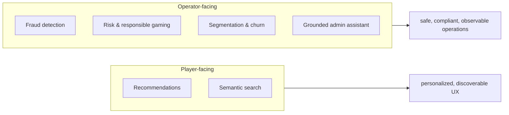

| Capability | Who it serves | Core module |
| --- | --- | --- |
| **Recommendations** | Players | `ai-core/recommend` |
| **Semantic search** | Players + operators | `ai-core/search` + `ai-core/embeddings` |
| **Fraud detection** | Operators | `ai-core/fraud` |
| **Risk & responsible gaming** | Operators + compliance | `ai-core/risk` |
| **Segmentation & churn** | Operators + marketing | `ai-core/segment` |
| **Grounded assistant / insights** | Operators | backend `AnalyticsAiService` + LLM |

### 1.3 The defining property: deterministic and grounded

The single most important architectural fact: **the AI core is deterministic and the AI writes nothing.** Every score, recommendation, fraud signal, and search result is a *pure function* of its inputs — no external model, no network, no randomness. The optional LLM only **narrates** facts that were computed deterministically from real data; it never invents numbers and never makes decisions. And the AI module **reads** platform data (catalog, sessions, wallet, devices) but **writes nothing** — it is advisory. This is what makes AI safe to add to a money-handling, regulated platform. See [§2](#2-ai-platform-philosophy) and [§15](#15-trust-boundaries).

### 1.4 Why deterministic AI

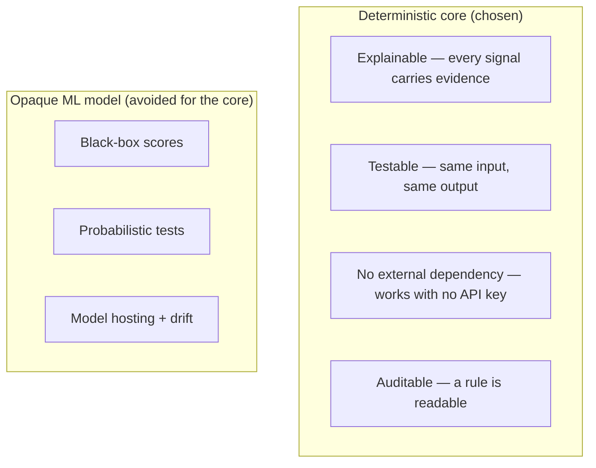

For a regulated gaming platform, **explainability and testability** trump raw predictive power in the decision-making core. A fraud analyst must be able to see *why* an account was flagged; a compliance officer must be able to audit a risk score; an engineer must be able to unit-test the logic. A deterministic, rule-based core provides all three, works with zero external dependencies, and reserves the LLM strictly for *narration* of already-computed facts. See [ADR-001](#25-architecture-decision-records).

### 1.5 Scope

This document covers the AI platform (`ai-core` + `ai` module): every service, feature extractor, scoring algorithm, prompt template, provider abstraction, cache, and API. It references the wallet ([Wallet Engine](./WALLET_ENGINE.md)) and operations ([Backend §15](./BACKEND_ARCHITECTURE.md#15-operations-backend)) for the data the AI reads, and the frontend ([Frontend §13.6](./FRONTEND_ARCHITECTURE.md#136-nova--the-ai-companion)) for how recommendations surface.

---

## 2. AI Platform Philosophy

Six convictions shape the AI platform.

### 2.1 Deterministic core

All intelligence *algorithms* live in a pure package with no external model, no network, and no randomness. The same features always produce the same score. This makes the core exhaustively testable and its behavior reproducible — a fraud score computed today can be recomputed identically tomorrow. See [ADR-001](#25-architecture-decision-records).

### 2.1.1 Deterministic AI in prose — the deeper argument

It is worth dwelling on why a gaming platform would build its intelligence core from *rules and heuristics* rather than trained models, because it runs against the industry default. The answer is that the AI's job here is mostly **decision support in a regulated, adversarial, money-handling domain**, and in that domain the properties that matter most are not raw predictive accuracy but:

- **Explainability.** A regulator or a fraud analyst must be able to see *why* a decision was made. "The account shares a device with three others and has a 94% win rate over 120 rounds" is defensible; "the model scored 0.97" is not. Rule-based signals are inherently explainable.
- **Testability.** Money-adjacent logic must be verifiable. A deterministic rule has an exact expected output for a given input, so it can be unit-tested to certainty. A learned model can only be tested statistically.
- **Adversarial robustness.** Fraudsters probe for weaknesses. A transparent rule can be reasoned about and hardened; an opaque model can be gamed in ways nobody can see until it's too late.
- **Zero-dependency operation.** The core works with no API key, no model server, no network — so it runs in development, air-gapped deployments, and during outages.

This is not a rejection of machine learning — it is a decision about *where* to apply it. Learned models are a documented future enhancement, but they would be added **alongside** the explainable rules (an ensemble), never replacing the auditable decision path ([§26](#26-future-ai-roadmap)). And the one place a large model *is* used — the LLM — is confined to *narration*, where a mistake produces awkward prose, not a wrong decision. The architecture applies each tool where its strengths fit and its weaknesses don't matter. See [ADR-001](#25-architecture-decision-records).

### 2.2 Explainable by construction

Every output carries its evidence. A `FraudSignal` includes a `detail` string explaining what triggered it; a risk assessment lists `RgFlag`s with human messages; a recommendation is a weighted blend of named components. Nothing is a black box. *"Pure and explainable — every signal carries the evidence that triggered it."* See [§7](#7-fraud-detection).

### 2.3 Grounded — never fabricate

The LLM assistant narrates **facts assembled from real platform data**, never invents them. `AnalyticsAiService`'s docstring: *"Because facts come from live data, answers never fabricate numbers."* The prompt to Claude explicitly instructs it to *"Answer ONLY from the provided facts; never invent numbers."* The LLM is a *narrator*, not an oracle. See [§10](#10-analytics-ai).

### 2.4 Advisory — reads data, writes nothing

The AI module influences the UI and informs operators, but it **never** autonomously moves money, grants access, or mutates state. It reads catalog, sessions, wallet, devices, and operations data and produces scores/recommendations/insights. The authoritative decisions remain in the deterministic wallet and authorization modules. See [§15](#15-trust-boundaries).

### 2.5 Provider-agnostic intelligence

The LLM layer is abstracted behind a provider interface: a deterministic **local** provider by default, **Claude** when configured. The platform works fully with no API key (local provider returns the grounded facts verbatim). Swapping or upgrading a model is a contained change behind one seam. See [§12](#12-llm-integration-layer).

### 2.6 Composed from pure functions + real data

The pattern is uniform: a **backend service** extracts features from real data (via Prisma), passes them to a **pure ai-core function**, and returns the result. The feature extraction is the only impure part; the intelligence is pure. This separation makes the algorithm testable in isolation and the extraction auditable. See [§14](#14-feature-engineering).

---

## 3. High-Level AI Architecture

### 3.1 The two layers

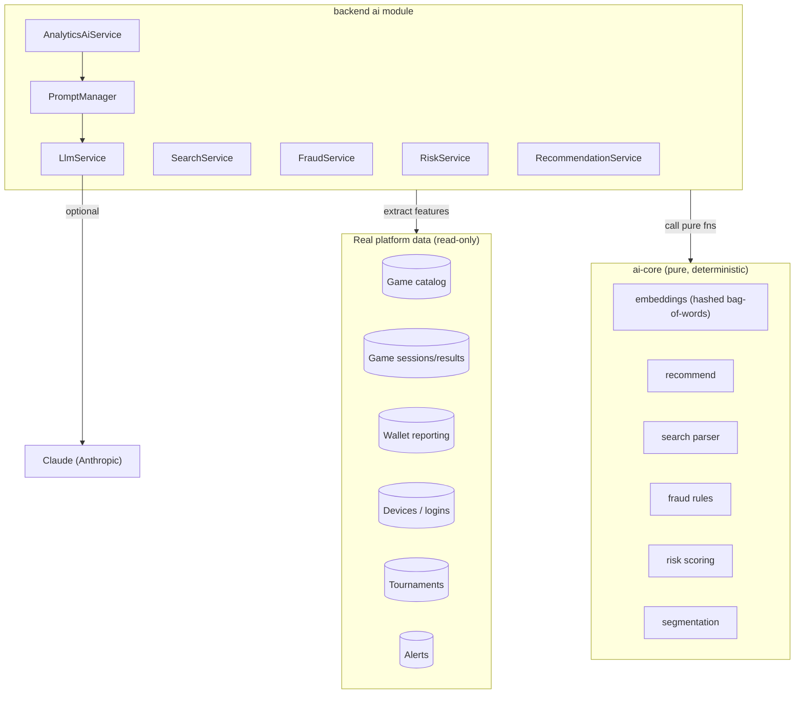

### 3.2 The request pattern

Every AI capability follows the same three-step pattern:

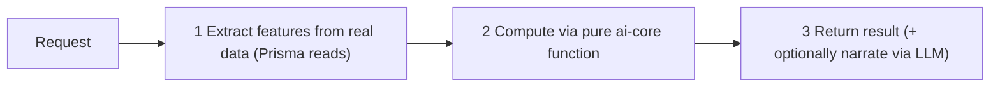

| Step | Where | Purity |
| --- | --- | --- |
| Extract features | backend service (Prisma) | impure (reads DB/Redis) |
| Compute | `ai-core` pure function | **pure, deterministic** |
| Narrate (optional) | `LlmService` | local (pure) or Claude |

### 3.3 The dependency direction

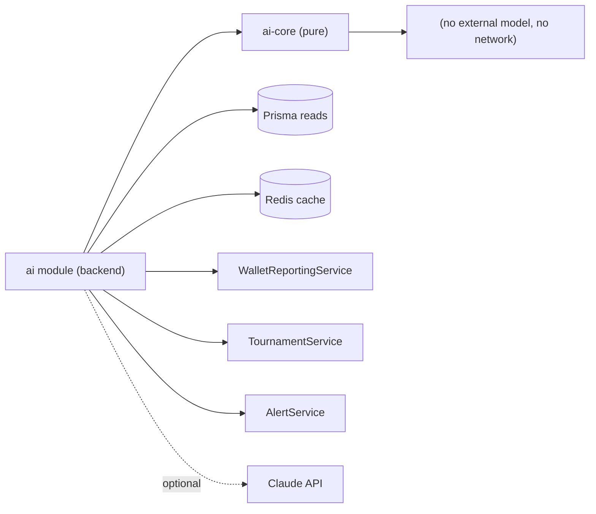

`ai-core` depends on nothing — it is pure TypeScript. The `ai` module depends on `ai-core` plus the data services it reads (wallet reporting, tournaments, alerts) and, optionally, the Claude API. This is the same pure-core-plus-wiring pattern as the wallet ([Wallet §1.3](./WALLET_ENGINE.md#13-why-a-pure-core-plus-a-persistent-mirror)) and the game SDK.

### 3.4 The platform-wide pure-core pattern

The AI platform is the third instance of a pattern that recurs across the Gaming Universe Platform. Recognizing it makes the whole codebase easier to reason about:

| Domain | Pure core | Backend wiring | What the core proves/owns |
| --- | --- | --- | --- |
| **Money** | `wallet-core` | `wallet-engine` module | Balance algebra, conservation ([Wallet §1](./WALLET_ENGINE.md#1-executive-summary)) |
| **Games** | `game-sdk` | `runtime` module | Lifecycle, determinism ([SDK §1](./GAME_ENGINE_SDK.md#1-executive-summary)) |
| **Intelligence** | `ai-core` | `ai` module | Deterministic scoring/ranking |

In every case, the **pure core** owns the algorithm (framework-free, dependency-free, exhaustively testable), and the **backend module** wires it to real data, persistence, and transport. The benefits are identical across all three: the hard logic is verified in isolation, the backend is reduced to faithful wiring, and the same discipline (extract impure inputs in the service, compute in the pure core) applies. An engineer who understands one understands all three. For the AI, the "proof" the core provides is *determinism and explainability*: given the same features, the same score, always, with the same evidence — the intelligence analogue of the wallet's conservation proof and the SDK's lifecycle guarantee.

---

## 4. AI Module Overview

### 4.1 The module

`AiModule` composes the AI services. Its docstring summarizes the whole platform: *"A pure, deterministic core (`ai-core`) powers recommendations, fraud detection, risk/responsible-gaming, segmentation and natural-language search; a provider-agnostic LLM layer (Claude when configured, deterministic local otherwise) narrates grounded insights for the admin AI assistant. Reads catalog/session/wallet/ops data; writes nothing."*

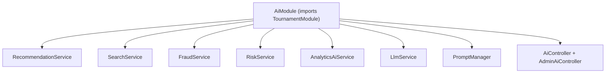

### 4.2 Service catalog

| Service | Purpose | Consumes | Core module |
| --- | --- | --- | --- |
| `RecommendationService` | Personalized game/tournament lists | catalog, sessions, tournaments, Redis | `recommend` |
| `SearchService` | NL smart search (games/tournaments/players) | catalog, tournaments, users, fraud | `search`, `embeddings` |
| `FraudService` | Fraud assessment + scan | logins, devices, results, deposits | `fraud` |
| `RiskService` | Risk profile (risk, RG, segment, churn) | sessions, deposits, results, fraud | `risk`, `segment` |
| `AnalyticsAiService` | Grounded admin assistant + reports | wallet reporting, tournaments, alerts, risk | (routes to LLM) |
| `PromptManager` | Named answer templates | — | — |
| `LlmService` | Provider-agnostic narration | (Claude, optional) | — |

### 4.3 Exports & controllers

`AiModule` exports `RecommendationService`, `FraudService`, `RiskService`, `SearchService`, and `AnalyticsAiService` for other modules. It exposes two controllers: `AiController` (`ai`, player-facing) and `AdminAiController` (`admin/ai`, operator-facing). See [§28.6](#286-endpoint-index).

### 4.4 What the AI reads (and never writes)

| Data source | Read by | Purpose |
| --- | --- | --- |
| `Game` catalog | Recommendation, Search | Embeddable items |
| `GameSession` / `GameResult` | Recommendation, Risk, Fraud | History, behaviour, win rate |
| `LoginHistory` / `Device` | Fraud | IP/device correlation |
| `DepositRequest` / `WithdrawalRequest` | Fraud, Risk | Velocity, ratios |
| `WalletReportingService` | Analytics AI | Revenue/GGR/RTP facts |
| `TournamentService` | Recommendation, Search, Analytics | Tournament data |
| `AlertService` | Analytics AI | Incident facts |

The AI module holds **no tables of its own** ([Database §5.1](./DATABASE_ARCHITECTURE.md#51-domain-catalog)); it is a pure read + compute layer over the platform's data. See [§15](#15-trust-boundaries).

---

## 5. Recommendation Engine

The recommendation engine personalizes game discovery by blending **content similarity**, **popularity**, and **recency** — all from the deterministic `ai-core/recommend` module.

### 5.1 The scoring model

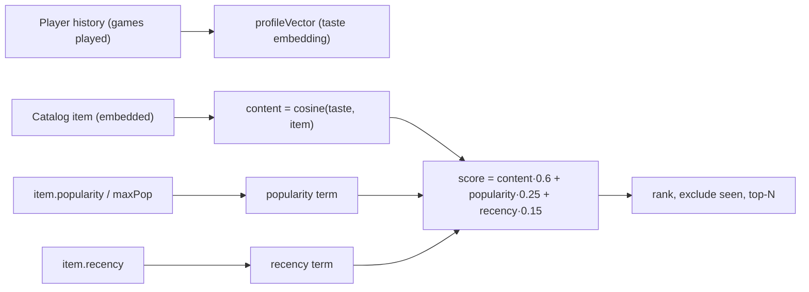

`recommend(items, profile, options)` computes for each unseen item:

```
score = content × 0.6 + popularity × 0.25 + recency × 0.15
```

where `content = (cosine(taste, itemVector) + 1) / 2` (mapped to [0,1]), `popularity = item.popularity / maxPopularity`, and `recency` is the item's recency (0..1). The default weights (`DEFAULT_WEIGHTS`) are `content: 0.6, popularity: 0.25, recency: 0.15`. Items the player has already seen (`profile.history`) are excluded. See [ADR-002](#25-architecture-decision-records).

### 5.2 Building the taste vector

`profileVector(profile, items)` builds a player's taste embedding by combining the embeddings of their played games, weighted by **recency decay** and explicit weights:

```
weight(item at index i) = (profile.weights[id] ?? 1) × 1/(1 + i)
```

More-recent history (lower index) weighs more (the `1/(1+i)` decay), so a player's *current* taste dominates over their historical taste. The accumulated vector is normalized to unit length. If the player has no history, the taste vector is zero and recommendations fall back to popularity + recency.

### 5.3 The three recommendation strategies

| Strategy | Function | Formula |
| --- | --- | --- |
| **Personalized** | `recommend` | content·0.6 + popularity·0.25 + recency·0.15 |
| **Similar** | `similar(targetId)` | content-based nearest neighbors (cosine) |
| **Trending** | `trending` | popularity·0.7 + recency·0.3 (no personalization) |

`similar` finds items nearest to a target game's embedding (content-based, excluding the target). `trending` blends popularity and recency without personalization — a global ranking.

### 5.4 The backend wiring — `RecommendationService`

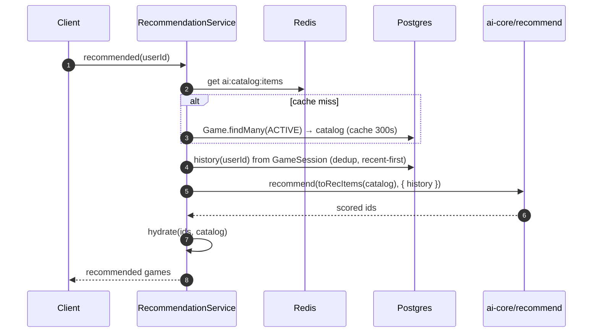

The service builds the catalog as `RecItem`s, deriving the embeddable `text` per game. A key detail: the category is **repeated three times** in the text (`${category} ${category} ${category} ${name} ${rtp >= 97 ? 'high-rtp' : 'standard-rtp'}`) to **weight category above secondary features** in the hashed embedding — a deliberate feature-engineering choice so similar-category games cluster. See [§14.2](#142-embedding-catalog-items).

### 5.5 The recommendation surfaces

| Method | Returns |
| --- | --- |
| `recommended(userId)` | personalized top-12 |
| `similarTo(gameId)` | 8 similar games |
| `trending()` | trending top-12 |
| `recentlyPlayed(userId)` | last-played (from history) |
| `continuePlaying(userId)` | open sessions (`endedAt = null`) |
| `recommendedTournaments()` | open-registration tournaments |
| `forYou(userId)` | **composite** home payload (all of the above in parallel) |

`forYou` assembles the personalized home in one call (via `Promise.all`), which the frontend surfaces on the lobby and through Nova ([Frontend §13.6](./FRONTEND_ARCHITECTURE.md#136-nova--the-ai-companion)).

### 5.5.1 A worked recommendation

Trace a recommendation for a player who mostly plays card games. Their history is `[blackjack, baccarat, poker]` (most-recent first). The taste vector is built as:

| History item | index | decay `1/(1+i)` | weight |
| --- | --- | --- | --- |
| blackjack | 0 | 1.0 | 1.0 |
| baccarat | 1 | 0.5 | 0.5 |
| poker | 2 | 0.33 | 0.33 |

Blackjack (most recent) dominates the taste vector. Now score two candidate games — another card game (`teen-patti`) and a crash game (`rocket-crash`) — assuming teen-patti's embedding is close to the card taste (cosine 0.8) and rocket-crash is far (cosine −0.1), with popularity 60/100 and 90/100 and recency 0.5 and 1.0 respectively:

| Candidate | content `(cos+1)/2` | ×0.6 | popularity/maxPop | ×0.25 | recency | ×0.15 | **score** |
| --- | --- | --- | --- | --- | --- | --- | --- |
| teen-patti | 0.90 | 0.540 | 0.60 | 0.150 | 0.5 | 0.075 | **0.765** |
| rocket-crash | 0.45 | 0.270 | 0.90 | 0.225 | 1.0 | 0.150 | **0.645** |

Teen-patti ranks higher despite rocket-crash being newer and more popular, because **content similarity dominates** (60% weight) and the player's card taste is strong. But note rocket-crash still scores respectably — a very popular, brand-new game surfaces even to a card player, which is the intended behavior: personalization leads, but popularity and recency prevent a filter bubble. This is why the weights are 0.6/0.25/0.15 rather than 1.0/0/0 — the blend balances relevance against discovery. See [ADR-002](#25-architecture-decision-records).

### 5.6 Catalog caching

The active catalog is cached in Redis (`ai:catalog:items`, TTL 300s), so recommendation requests don't re-query and re-embed the catalog on every call. Because embedding is deterministic, the cached catalog is stable within its TTL. See [§20.1](#201-caching).

---

## 6. Semantic Search

Search turns free text into a structured intent and executes it — with a **semantic embedding fallback** for fuzzy queries — all deterministically, with no LLM required.

### 6.1 The search pipeline

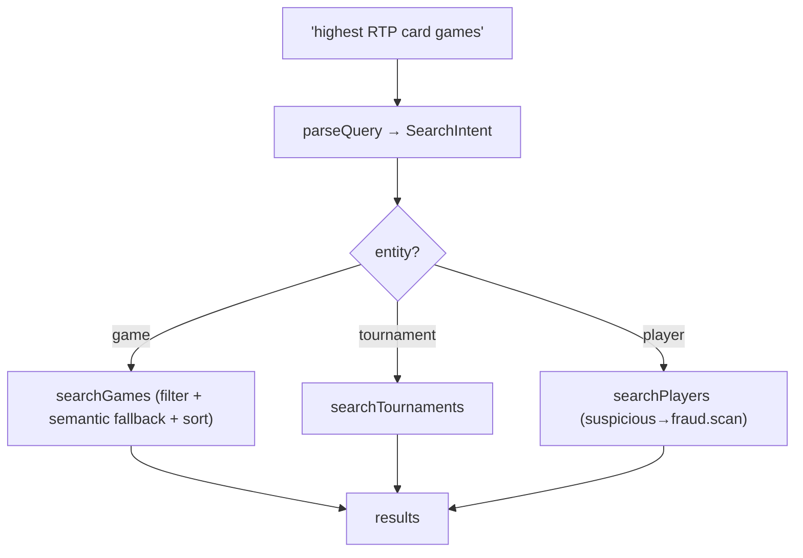

### 6.2 The intent parser (`ai-core/search`)

`parseQuery(raw)` is a **rule-based** parser that maps phrases into a typed `SearchIntent`: *"maps phrases like 'show me card games', 'highest RTP games', 'tournaments today' or 'players with suspicious activity' into a typed query … No LLM required."* It extracts:

| Field | How parsed |
| --- | --- |
| `entity` | `game` (default), `tournament` (regex), `player` (regex) |
| `filters.category` | matched against `CATEGORIES` (card, roulette, dice, crash, slot, table, live, sports, poker, baccarat, blackjack) |
| `sort: 'rtp'` | "highest/best/top/high … rtp" |
| `filters.rtpMin` | "rtp over/above/> N" |
| `filters.trending` | "trending/popular/hot/most played" |
| `filters.isNew` | "new/latest/recent" |
| `filters.free` | "free/no entry" |
| `filters.today`/`status` | "today/now/live" |
| `filters.suspicious` | "suspicious/fraud/risky/bot" → entity `player` |
| `keywords` | leftover words (control words stripped) |

The parser is deterministic and testable — a given query always yields the same intent. This is a deliberate choice over an LLM intent classifier: it's instant, free, explainable, and correct for the platform's query vocabulary. See [ADR-003](#25-architecture-decision-records).

### 6.3 Executing a game search

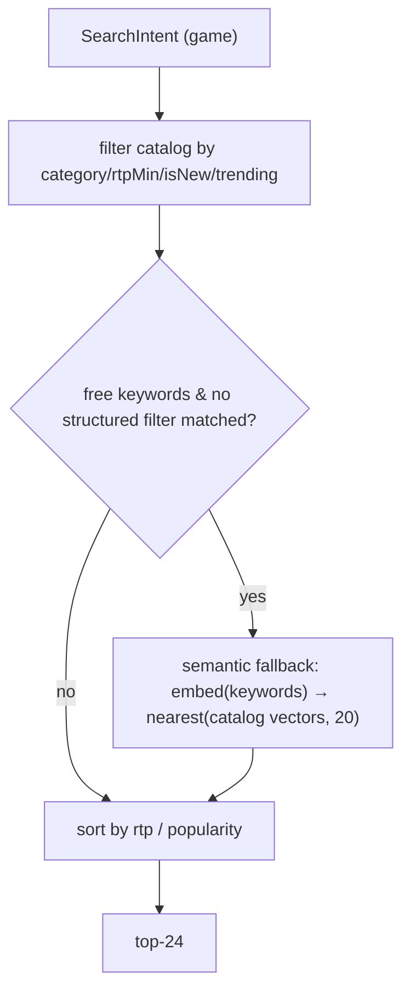

`SearchService.searchGames` applies structured filters first; when free keywords remain and no structured filter narrowed the set, it falls back to **semantic search**: it embeds the keywords and the catalog items into the same 64-dim space and finds the 20 nearest by cosine similarity. This is what handles fuzzy queries like "spooky halloween slots" that don't match a category exactly — the embedding captures loose semantic similarity. See [§14.1](#141-hashed-bag-of-words-embeddings).

### 6.4 Player & tournament search

- **Player search** (`searchPlayers`): if the intent is `suspicious`, it routes to `FraudService.scan(50)` — "show me suspicious players" runs the fraud scanner. Otherwise it searches users by email/username (case-insensitive `contains`).
- **Tournament search** (`searchTournaments`): filters by status (`live`/`registration`) and free-entry.

This routing is why search is a unified operator tool: one search box answers "highest RTP card games," "live tournaments," and "suspicious players" by dispatching to the right data source.

### 6.4.1 A worked search

Trace three queries through the pipeline:

| Query | Parsed intent | Execution |
| --- | --- | --- |
| "highest RTP card games" | entity `game`, category `card`, sort `rtp` desc | filter catalog to card, sort by RTP desc, top-24 |
| "live tournaments today" | entity `tournament`, today, status `live` | `tournaments.list({ status: 'live' })` |
| "players with suspicious activity" | entity `player`, suspicious | `fraud.scan(50)` |

The first query's parser detects the `game` entity (default), matches `card` in `CATEGORIES`, and recognizes "highest … rtp" → `sort: 'rtp', sortDir: 'desc'`. Execution filters the cached catalog to card games and sorts by RTP. The third query is the elegant one: "suspicious" flips the entity to `player` and the filter to `suspicious`, so `searchPlayers` routes straight to the **fraud scanner** — a natural-language phrase becomes a fraud investigation. Now consider a fuzzy fourth query, "spooky halloween games": no category matches, so the leftover keywords `[spooky, halloween]` trigger the **semantic fallback** — the keywords are embedded and matched by cosine against the catalog embeddings, surfacing games whose name/category tokens are lexically closest. One search box, backed entirely by deterministic parsing and hashed embeddings, answers structured, operational, and fuzzy queries alike — with no LLM in the loop. See [ADR-003](#25-architecture-decision-records).

### 6.5 Catalog quick-search

`catalogSearch(term)` is a simpler structured search over active games by name/slug `contains` — used by the catalog search box for exact-ish matches, distinct from the NL smart search.

---

## 7. Fraud Detection

Fraud detection is a **rule-based, explainable** engine: it turns account features into weighted signals, aggregates them into a 0–100 score and band, and each signal carries the evidence that triggered it.

### 7.1 The fraud pipeline

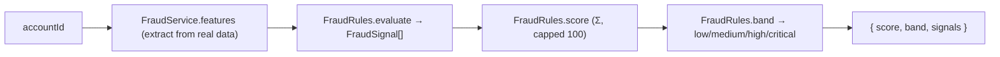

### 7.2 The fraud features

`FraudService.features(userId)` extracts a `FraudFeatures` object from real data (logins, devices, game results, deposits, withdrawals):

| Feature | Source | Signal it feeds |
| --- | --- | --- |
| `sharedDeviceAccounts` | other users on the same device fingerprint | multi-account, device-correlation |
| `sharedIpAccounts` | other users on the same IP | ip-correlation |
| `distinctIpsLastHour` | login history (last hour) | account-sharing |
| `betsLastMinute` | game results (last minute) | velocity |
| `winRate` / `roundsPlayed` | game results | impossible-win-rate |
| `actionIntervalStdDevMs` | std-dev of action timings | bot-activity |
| `depositsLastHour` | deposit requests | suspicious-wallet |
| `withdrawalRatio` | withdrawals / deposits | suspicious-betting |

The shared-account correlation is computed by `distinctOtherUsersByIp` — finding *other* users who share an IP (from `LoginHistory`) or device (from `Device`). This is the core multi-accounting/collusion signal.

### 7.3 The fraud rules

`FraudRules.evaluate` produces a `FraudSignal[]`. Each rule is a threshold on a feature that adds a signal with a severity:

| Signal | Trigger | Severity |
| --- | --- | --- |
| `multi-account` | shares devices with ≥1 account | high (≥3 → critical) |
| `device-correlation` | device fingerprint reused | medium |
| `ip-correlation` | shares IPs with ≥3 accounts | medium (≥6 → high) |
| `account-sharing` | ≥5 distinct IPs in an hour | medium (≥10 → high) |
| `velocity` | ≥60 bets/minute | high (≥200 → critical) |
| `impossible-win-rate` | ≥80% win over ≥50 rounds | high (≥95% → critical) |
| `bot-activity` | action interval σ<50ms over ≥100 rounds | high |
| `suspicious-wallet` | ≥10 deposits/hour | medium (≥25 → high) |
| `suspicious-betting` | withdraws ≥98% with <10 rounds | medium |

Each severity maps to a score contribution (`SEVERITY_SCORE`: low 10, medium 25, high 45, critical 70). See [§7.4](#74-scoring--banding).

### 7.4 Scoring & banding

`FraudRules.score(signals)` sums the signal scores, **capped at 100**. `FraudRules.band(score)` maps to a band:

| Score | Band |
| --- | --- |
| ≥ 70 | critical |
| ≥ 45 | high |
| ≥ 20 | medium |
| < 20 | low |

`FraudRules.assess(features)` runs the full pipeline: `{ score, band, signals }`. Every signal in the result carries a human-readable `detail` (e.g. "Shares devices with 3 account(s)", "94% win rate over 120 rounds") — so a fraud analyst sees exactly *why* an account scored what it did. This explainability is the whole point of a rule-based engine. See [ADR-004](#25-architecture-decision-records).

### 7.5 The fraud scan

### 7.5.1 A worked fraud assessment

Consider a colluding multi-account bot. Its features: shares devices with 3 accounts, shares IPs with 4 accounts, 8 distinct IPs in the last hour, 75 bets in the last minute, 88% win rate over 120 rounds, action-interval σ of 30ms, 4 deposits in the last hour. `FraudRules.evaluate` fires:

| Signal | Triggered by | Severity | Score |
| --- | --- | --- | --- |
| multi-account | 3 shared-device accounts (≥3 → critical) | critical | 70 |
| device-correlation | device reuse | medium | 25 |
| ip-correlation | 4 shared-IP accounts (≥3) | medium | 25 |
| account-sharing | 8 IPs/hour (≥5) | medium | 25 |
| velocity | 75 bets/min (≥60) | high | 45 |
| impossible-win-rate | 88% over 120 rounds (≥80%) | high | 45 |
| bot-activity | σ=30ms over 120 rounds (<50, ≥100) | high | 45 |

The raw sum is 280, **capped at 100**, so the score is **100** → band **critical**. Crucially, the result isn't just "100/critical" — it's the **seven signals with their evidence**: "Shares devices with 3 account(s)", "88% win rate over 120 rounds", "Near-constant action interval (σ=30ms)". A fraud analyst reading this sees a textbook collusion-bot profile and can act with confidence, because every point of the score is attributable to a named, evidenced rule. Contrast an opaque model that would output "0.97" with no explanation — un-actionable and un-auditable. This is the entire argument for rule-based fraud detection in a regulated context. See [ADR-004](#25-architecture-decision-records).

### 7.5.2 The scan in action

`FraudService.scan(limit)` batch-assesses recently-active accounts: it takes the users of the 500 most recent game sessions, assesses each, filters out `low`-band accounts, and sorts by score descending. This is the "show me suspicious players" operator tool, reachable via `admin/ai/fraud/scan` and via the semantic search "suspicious players" query ([§6.4](#64-player--tournament-search)).

---

## 8. Risk Assessment

Risk assessment combines **fraud signals** with **behavioural indicators** (loss chasing, session length, deposit velocity) into a 0–100 risk score plus actionable responsible-gaming flags — the compliance and player-protection layer.

### 8.1 The risk model

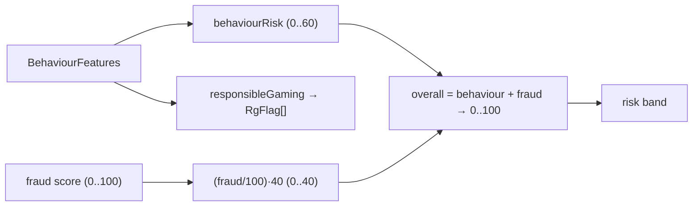

`RiskScoring.overall(behaviour, fraudScore)` combines a behavioural component (0–60) with a fraud component (0–40, scaled from the 0–100 fraud score):

```
risk = min(100, behaviourRisk(behaviour) + (fraudScore / 100) × 40)
```

So fraud contributes at most 40 points and behaviour at most 60 — risk is **majority-behavioural**, reflecting that responsible-gaming risk is primarily about play patterns, with fraud as an aggravating factor.

### 8.2 Behavioural risk components

`RiskScoring.behaviourRisk(b)` accumulates a 0–60 score from responsible-gaming indicators:

| Indicator | Contribution |
| --- | --- |
| `longestSessionMinutes > 180` | up to +15 (scaled) |
| `depositsLast24h > 5` | up to +15 |
| `lossChasingScore` (0..1) | × 15 |
| `nightPlayRatio` (0..1) | × 8 |
| `depositLimitUtilisation > 0.9` | up to +7 |

Capped at 60. These are the classic problem-gambling signals: long sessions, frequent deposits, chasing losses, night play, and hitting deposit limits.

### 8.3 Responsible-gaming flags

`RiskScoring.responsibleGaming(b)` produces actionable `RgFlag`s:

| Flag | Trigger | Severity |
| --- | --- | --- |
| `long-session` | session > 240m | high |
| `loss-chasing` | lossChasingScore ≥ 0.6 | high |
| `deposit-frequency` | ≥ 8 deposits/24h | medium |
| `limit-reached` | deposit limit reached | medium |
| `night-play` | night ratio ≥ 0.7 | low |

Each flag is a named, human-readable warning the platform can act on (nudge, limit, self-exclusion prompt). This is the player-protection surface — a regulatory requirement, computed transparently.

### 8.4 The full risk profile — `RiskService`

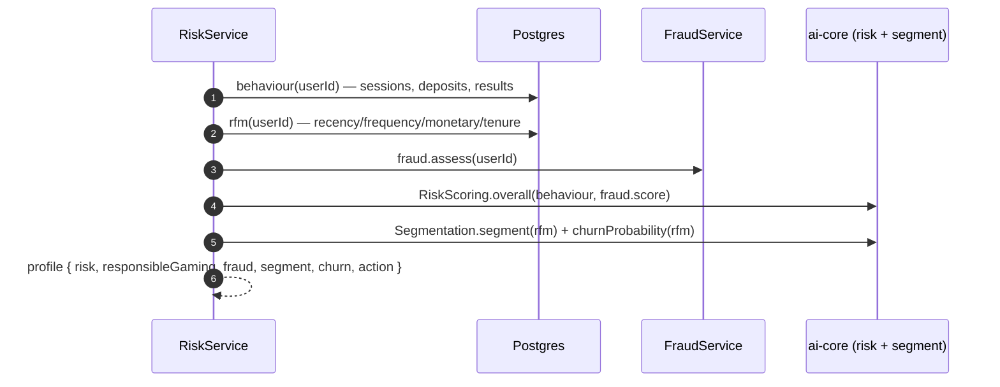

`RiskService.profile(userId)` is the composite: it extracts behaviour + RFM features and a fraud assessment in parallel, then computes the overall risk, RG flags, segment, churn probability, and a recommended retention action. This one call powers both the compliance view (`admin/ai/risk/:userId`) and the player-insight narration ([§10.4](#104-fact-builders)).

### 8.4.1 A worked risk profile

Consider a player showing concerning patterns: longest session 300 minutes, 7 deposits in 24h, loss-chasing score 0.7, night-play ratio 0.6, deposit-limit utilisation 0.95, and a fraud score of 30. The behavioural risk accumulates:

| Indicator | Value | Contribution |
| --- | --- | --- |
| long session | 300m (>180) | min(15, (300−180)/20) = **6** |
| deposits/24h | 7 (>5) | min(15, (7−5)×2) = **4** |
| loss-chasing | 0.7 | 0.7 × 15 = **10.5** |
| night play | 0.6 | 0.6 × 8 = **4.8** |
| limit utilisation | 0.95 (>0.9) | min(7, (0.95−0.9)×70) = **3.5** |
| **behaviourRisk** | | **≈ 28.8** (of 60) |

Adding the fraud component: `(30/100) × 40 = 12`. Overall risk = `min(100, round(28.8 + 12)) = 41` → band **medium**. Separately, `responsibleGaming` fires: `long-session` (>240m, high), `loss-chasing` (≥0.6, high), `limit-reached` is not quite triggered (utilisation 0.95 < 1.0), `night-play` (≥... 0.6 < 0.7, not triggered). So the profile shows **medium risk with two high-severity RG flags** — long sessions and loss chasing. The operator sees not just "41/medium" but the *specific behaviours* driving it, and the recommended action from segmentation. This is player protection made actionable: the platform can nudge this player toward a break or a deposit limit, backed by transparent evidence. Note that the risk score being *majority-behavioural* (28.8 of the 41 from behaviour) correctly reflects that this is a responsible-gaming concern, not primarily a fraud concern.

### 8.5 Loss-chasing detection

`RiskService.lossChasing(bets)` is a proxy for chasing: it computes the fraction of consecutive bets where the bet size *increased* (escalated). A high ratio means the player is raising stakes after losses — a hallmark of problem gambling. This is fed into `lossChasingScore` and drives both the risk score and the `loss-chasing` RG flag.

---

## 9. Player Segmentation

Segmentation classifies players by **RFM** (recency, frequency, monetary) and predicts **churn** — the basis for targeting, bonuses, and retention.

### 9.1 The RFM model

`Segmentation.segment(f)` maps `RfmFeatures` (recencyDays, frequency, monetary, tenureDays) to one of seven segments:

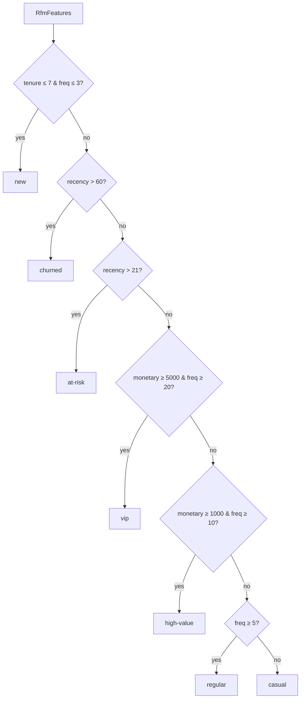

| Segment | Definition |
| --- | --- |
| `new` | tenure ≤ 7 days & frequency ≤ 3 |
| `churned` | recency > 60 days |
| `at-risk` | recency > 21 days |
| `vip` | monetary ≥ 5000 & frequency ≥ 20 |
| `high-value` | monetary ≥ 1000 & frequency ≥ 10 |
| `regular` | frequency ≥ 5 |
| `casual` | otherwise |

The order matters: newness and inactivity are checked first (they override value), then value tiers, then engagement. A once-VIP player who's been idle 30 days is `at-risk`, not `vip` — correctly prioritizing retention.

### 9.2 Churn prediction

`Segmentation.churnProbability(f)` computes a 0–1 churn probability:

```
p = 0.6 × min(1, recencyDays/60) + 0.4 × 1/(1+frequency) + (tenureDays < 14 ? 0.1 : 0)
```

Churn is driven mostly by **recency** (60% weight — 60+ idle days ⇒ high) and **frequency** (40% — low frequency ⇒ higher churn), with a small guard for noisy new accounts. The result is clamped to [0,1] and rounded to 4 decimals. This is a transparent heuristic, not a trained model — explainable and testable, and good enough to drive retention targeting.

### 9.3 Retention actions

`Segmentation.retentionAction(segment, churn)` recommends a next action:

| Condition | Action |
| --- | --- |
| segment `churned` | `win-back-bonus` |
| churn ≥ 0.6 | `reactivation-offer` |
| segment `vip`/`high-value` | `vip-perk` |
| segment `new` | `onboarding-mission` |
| otherwise | `standard-promo` |

This closes the loop: segment + churn → a concrete recommended intervention, surfaced to operators (and, for the player, informing Nova's nudges). The AI *recommends* the action; a human or a campaign executes it — the AI never grants a bonus itself ([§15](#15-trust-boundaries)).

### 9.3.1 Why RFM

RFM (Recency, Frequency, Monetary) is the classic marketing framework for customer value, and it's the right fit here for the same reason the rest of the AI core is rule-based: it's **explainable and actionable**. Each dimension maps to an intuitive business question — *when did they last play* (recency), *how often do they play* (frequency), *how much do they wager* (monetary) — plus tenure to distinguish genuinely-new players from lapsed ones. A marketer looking at a segment immediately understands what it means and how to act on it, which a clustering algorithm's "cluster 4" would not provide. The segment boundaries (5000/1000 monetary, 20/10 frequency, 21/60 day recency) are tunable business thresholds, not learned parameters, so the business can adjust "what counts as VIP" without retraining anything. This is segmentation as a *transparent business rule*, which is exactly what a marketing and retention team can own and trust. See [ADR-015](#25-architecture-decision-records).

### 9.4 A worked segmentation

Take three players and classify them:

| Player | recencyDays | frequency | monetary | tenureDays | → segment | churn |
| --- | --- | --- | --- | --- | --- | --- |
| Ana | 2 | 40 | 8,000 | 400 | **vip** (monetary ≥5000 & freq ≥20) | low (`0.6·0.033 + 0.4·0.024 ≈ 0.03`) |
| Ben | 30 | 8 | 1,200 | 200 | **at-risk** (recency >21) | ~0.34 |
| Cara | 3 | 2 | 50 | 5 | **new** (tenure ≤7 & freq ≤3) | ~0.13 (+ new guard) |

Ana is an active high-roller → `vip`, churn near zero → action `vip-perk`. Ben was valuable (1,200 monetary, freq 8) but has been idle 30 days → the **recency check overrides value** → `at-risk`, churn ~0.34 → action `standard-promo` (churn < 0.6). Cara is brand new → `new` regardless of her (low) activity → action `onboarding-mission`. The ordering of the segment rules is doing important work here: Ben isn't classified as `high-value` (which his monetary would suggest) because inactivity is checked *first* — correctly prioritizing "we're about to lose a good player" over "he's a good player." The churn heuristic quantifies the concern: Ben's 30-day recency contributes `0.6 × min(1, 30/60) = 0.30` to his churn, the dominant term. Each classification is a readable rule an operator can trust and a marketer can target. See [ADR-015](#25-architecture-decision-records).

---

## 10. Analytics AI

The Analytics AI is the **grounded admin assistant and report generator**. It routes a question to the right data source, assembles facts from real services, renders them through the prompt manager, and narrates them via the LLM — *"Because facts come from live data, answers never fabricate numbers."*

### 10.1 The assistant pipeline

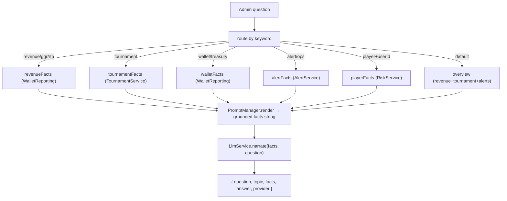

### 10.2 Question routing

`AnalyticsAiService.ask(question, userId?)` routes by keyword regex:

| Keyword match | Topic | Fact source |
| --- | --- | --- |
| revenue/ggr/rtp/turnover/profit | revenue | `WalletReportingService.overview` |
| tournament | tournament | `TournamentService.statistics` |
| wallet/balance/treasury | wallet | `WalletReportingService.walletStatistics` |
| alert/incident/health/ops | alerts | `AlertService.activeIncidents` |
| player/user/churn/risk/segment (+userId) | player | `RiskService.profile` |
| (default) | overview | revenue + tournament + alerts |

### 10.3 The insight endpoints

Beyond free-text `ask`, the service exposes typed insight methods: `revenueInsight(hours)`, `tournamentInsight()`, `walletInsight()`, `playerInsight(userId)`, `alertSummary()`, and `generateReport()` (a composite daily report over revenue + tournaments + wallet + alerts). Each is a fixed-topic version of the same grounded-fact → narrate pipeline.

### 10.4 Fact builders

The fact builders are where **grounding** happens — they pull real numbers from real services and render them through named prompt templates:

| Builder | Reads | Template |
| --- | --- | --- |
| `revenueFacts(hours)` | `WalletReportingService.overview` (bets, wins, GGR, RTP, deposits, withdrawals, cashFlow) | `revenue-insight` |
| `tournamentFacts()` | `TournamentService.statistics` | `tournament-insight` |
| `walletFacts()` | `WalletReportingService.walletStatistics` | `wallet-insight` |
| `playerFacts(userId)` | `RiskService.profile` (segment, churn, risk, action) | `player-insight` |
| `alertFacts()` | `AlertService.activeIncidents` | `alert-summary` |

Because the revenue facts come from `WalletReportingService` — which derives them from the immutable transaction ledger ([Wallet §19](./WALLET_ENGINE.md#19-reporting--reconciliation)) — the assistant's revenue answers are exactly the platform's reconciled numbers. The AI cannot report a GGR that differs from the ledger, because it *reads* the ledger-derived report rather than recomputing it. This is a recurring theme worth naming: the AI is trustworthy on facts precisely because it never originates them — it reads the authoritative sources and presents what they say. See [§18](#18-wallet-integration).

### 10.4.1 A worked assistant answer

An operator asks: *"How did revenue look today?"* The pipeline:

1. **Route.** `ask` matches `/revenue/` → topic `revenue`.
2. **Ground.** `revenueFacts(24)` calls `WalletReportingService.overview(24)`, which returns ledger-derived figures: bets 100,000, wins 96,000, GGR 4,000, RTP 96%, deposits 40,000, withdrawals 25,000, cashFlow 15,000.
3. **Render.** `PromptManager.render('revenue-insight', vars)` produces the grounded fact string: *"Revenue (last 24h): turnover 100000, wins paid 96000, gross gaming revenue 4000, RTP 96.00%. Deposits 40000, withdrawals 25000, net cash flow 15000."*
4. **Narrate.** `LlmService.narrate(facts, question)`. With the **local provider**, the answer *is* the fact string (accurate, plain). With **Claude configured**, the answer might read: *"Over the last 24 hours the platform generated 4,000 in gross gaming revenue on 100,000 of turnover, a 96% RTP. Deposits of 40,000 outpaced 25,000 in withdrawals for a healthy 15,000 net cash flow."*
5. **Return.** `{ question, topic: 'revenue', facts, answer, provider }`.

The key observation: **every number in the prose came from the facts, which came from the reconciled ledger.** Claude rephrased "GGR 4000" into "4,000 in gross gaming revenue" — presentation, not computation. The operator receives both the polished answer *and* the raw facts, so they can verify the narration is faithful. If Claude were down, they'd get the facts verbatim — less polished, equally correct. This is grounding in action: the LLM makes the numbers readable; it never makes them up. See [§18.2](#182-why-this-guarantees-consistency).

### 10.5 The answer envelope

`answer(question, topic, facts)` narrates the facts via the LLM and returns `{ question, topic, facts, answer, provider }`. Critically, it returns **both** the raw `facts` and the narrated `answer` — so an operator can always see the grounded numbers alongside the prose, and audit that the narration matches the facts. The `provider` field records whether the local or Claude provider produced the narration.

---

## 11. Prompt Management

`PromptManager` treats prompts as **named, versioned assets** rendered with grounded variables — not inline string concatenation.

### 11.1 The template catalog

`PROMPT_TEMPLATES` holds the platform's answer templates:

| Template | Content (with `{{vars}}`) |
| --- | --- |
| `revenue-insight` | "Revenue (last {{hours}}h): turnover {{bets}}, wins paid {{wins}}, gross gaming revenue {{ggr}}, RTP {{rtp}}. Deposits {{deposits}}, withdrawals {{withdrawals}}, net cash flow {{cashFlow}}." |
| `tournament-insight` | "Tournaments: {{total}} total — {{live}} live, {{registration}} in registration, {{completed}} completed, with {{participants}} participants…" |
| `player-insight` | "Player {{userId}}: segment {{segment}}, churn risk {{churn}}, risk score {{risk}} ({{riskBand}}). Lifetime sessions {{sessions}}. Recommended action: {{action}}." |
| `wallet-insight` | "Wallets: {{wallets}} accounts holding {{total}} total ({{available}} available, {{locked}} locked, {{pending}} pending)." |
| `alert-summary` | "{{count}} active incident(s): {{incidents}}." |

### 11.2 Rendering

`render(templateKey, vars)` substitutes `{{var}}` placeholders with the grounded values (missing vars render as `—`). `list()` returns the template keys. The rendered string is the **grounded facts** — a factual sentence populated entirely with real numbers — which the LLM then narrates.

### 11.3 Why prompts are managed assets

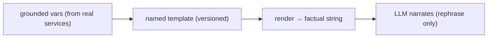

Treating prompts as named, reviewable templates — rather than string concatenation scattered through code — is what makes the AI's factual layer **auditable and maintainable**. The template defines exactly which facts an insight contains; the LLM only rephrases them. This separation (facts in the template, prose from the LLM) is the mechanism that guarantees the LLM summarizes rather than fabricates. See [ADR-005](#25-architecture-decision-records).

---

## 12. LLM Integration Layer

The LLM layer is **provider-agnostic**: a deterministic local provider by default, Claude when configured. All narrative AI flows through it over grounded facts.

### 12.1 The provider abstraction

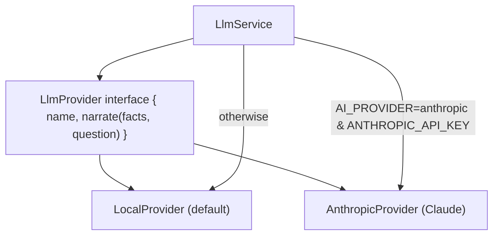

`LlmService` selects the provider at construction: if `AI_PROVIDER === 'anthropic'` and `ANTHROPIC_API_KEY` is set, it uses `AnthropicProvider` (with `AI_MODEL`, default `claude-sonnet-4-6`); otherwise `LocalProvider`. `narrate(facts, question)` delegates to the provider; `providerName` exposes which is active.

### 12.2 The narration contract

Both providers implement `narrate(facts, question): Promise<string>`. The contract is the same: **rephrase the grounded facts into a natural answer, never invent numbers.** The facts are always assembled first (from real data); the provider's only job is presentation.

### 12.3 The Claude provider

When configured, `AnthropicProvider` calls the Anthropic Messages API with a system prompt that enforces grounding: *"You are the gaming platform operations analyst. Answer ONLY from the provided facts; never invent numbers. Be concise and professional."* The facts are passed as authoritative context (`Question: … Facts: …`). On **any** failure (non-OK response, network error), it **falls back to returning the facts verbatim** — logged as a warning. So a Claude outage degrades to the grounded facts, never to an error or a fabrication. See [§13](#13-local-vs-external-providers).

### 12.4 Why grounded narration, not generation

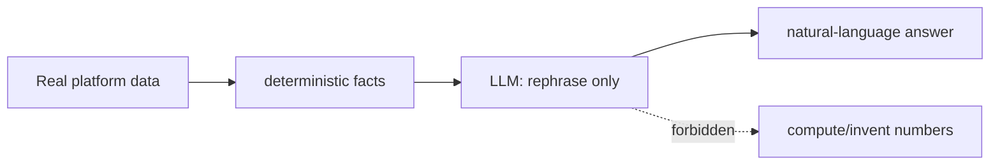

The LLM is a **narrator**, not a computer. It never queries data, never does arithmetic, never decides anything — it receives facts and produces prose. This is the single most important safety property of the LLM integration: because the numbers are computed deterministically and the LLM only rephrases them, an LLM hallucination can at worst produce awkward prose, never a wrong figure. In a financial/regulated context, this is non-negotiable. See [ADR-006](#25-architecture-decision-records).

---

## 13. Local vs External Providers

### 13.1 The two providers

| Aspect | `LocalProvider` (default) | `AnthropicProvider` (Claude) |
| --- | --- | --- |
| Dependency | none | Anthropic API + key |
| Output | returns grounded facts (optionally prefixed with the question) | rephrases facts into natural prose |
| Determinism | fully deterministic | model-dependent |
| Failure mode | n/a | falls back to facts |
| When active | default; no key needed | `AI_PROVIDER=anthropic` + `ANTHROPIC_API_KEY` |

### 13.2 Why a local default

The platform works **fully with no API key**: the `LocalProvider` returns the grounded facts the caller assembled — accurate, if less conversational. This means the AI assistant is functional in development, in air-gapped deployments, and when Claude is unavailable, with **zero external dependency**. The Claude provider is a *narration upgrade*, not a requirement. This is the same "works headless by default, enhanced when configured" philosophy as the game SDK's drivers. See [ADR-007](#25-architecture-decision-records).

### 13.3 The graceful-degradation chain

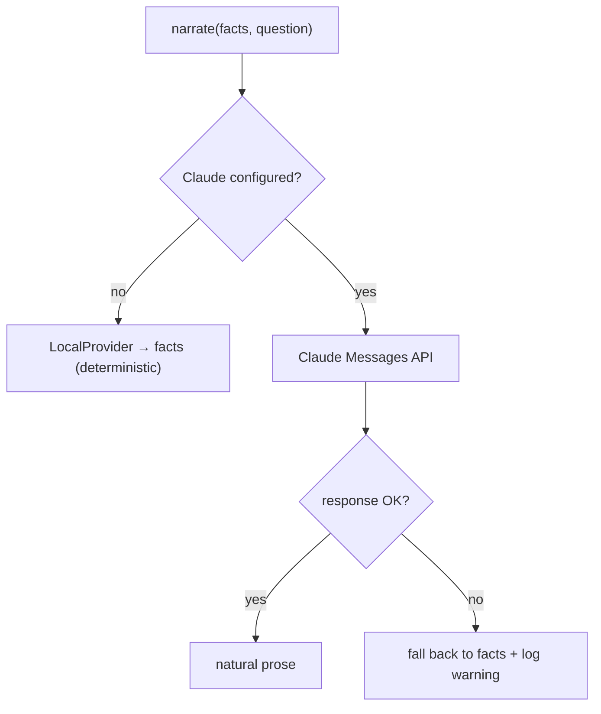

At every level, the fallback is the **grounded facts** — never an error, never a fabrication. Unconfigured → facts; configured but failing → facts. The worst case for the AI assistant is always "you get the accurate facts without the prose polish." This makes the assistant robust: a Claude outage degrades presentation, not correctness.

### 13.4 Model configuration

| Env var | Purpose | Default |
| --- | --- | --- |
| `AI_PROVIDER` | `anthropic` to enable Claude | (local) |
| `ANTHROPIC_API_KEY` | Claude API key | (unset → local) |
| `AI_MODEL` | Claude model id | `claude-sonnet-4-6` |

Swapping the model is a single env change; the provider abstraction means no code changes to upgrade or switch models. See [§27.5](#275-configuration-index).

---

## 14. Feature Engineering

Feature engineering is where real data becomes the inputs to the pure algorithms. It is the **only impure part** of each capability, and it is deliberately isolated in the backend services.

### 14.1 Hashed bag-of-words embeddings

`ai-core/embeddings` projects any text into a fixed 64-dim unit vector with **no external model or network**: *"A hashed bag-of-words projects any text into a fixed-dimensional unit vector … so semantic similarity, 'similar games' and vector search are exact and fully testable."*

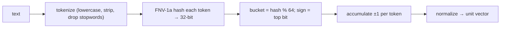

| Function | Purpose |
| --- | --- |
| `tokenize(text)` | lowercase, strip punctuation, drop stopwords + short tokens |
| `embed(input, dim=64)` | hashed bag-of-words → unit vector |
| `cosine(a, b)` | cosine similarity (clamped [-1,1]) |
| `nearest(query, items, k, exclude)` | top-K by cosine |

The embedding is **deterministic** (FNV-1a is a stable hash), so the same text always yields the same vector — embeddings are reproducible and testable, and there's no model to host or drift. The trade-off is that it captures *lexical* similarity (shared tokens) rather than deep semantic meaning — sufficient for catalog similarity and fuzzy search, and vastly simpler than hosting an embedding model. See [ADR-008](#25-architecture-decision-records).

### 14.1.1 A worked embedding

Embed the phrase "Card Blackjack game" into a (tiny, for illustration) 8-dim space. Tokenization lowercases, strips punctuation, and drops stopwords/short tokens → `[card, blackjack, game]`. Each token is FNV-1a hashed to a 32-bit integer, then bucketed by `hash % 8` with a sign from the top bit:

| Token | hash % 8 (bucket) | sign (top bit) | contribution |
| --- | --- | --- | --- |
| card | 3 | + | vec[3] += 1 |
| blackjack | 6 | − | vec[6] −= 1 |
| game | 3 | + | vec[3] += 1 |

The raw vector is `[0,0,0,+2,0,0,−1,0]`, then normalized to unit length → `[0,0,0,0.894,0,0,−0.447,0]`. Two properties matter: **"card" and "game" collided in bucket 3** (hash collisions are expected in a fixed-dim space and average out over many tokens), and the vector is **deterministic** — the same phrase always produces this exact vector, on any machine, forever. In the real 64-dim space collisions are rarer and the vectors are richer, but the mechanism is identical. This is why "similar games" and semantic search are *exact and testable*: a test can assert `embed("Card Blackjack game")` equals a fixed vector, and `cosine(embed(a), embed(a)) === 1`. See [ADR-008](#25-architecture-decision-records).

### 14.1.2 Why 64 dimensions and hashing

The choice of a **fixed 64-dim hashed** space (rather than a vocabulary-indexed sparse vector or a hosted model) is a pragmatic trade-off. A fixed dimension means every vector is the same size — no growing vocabulary, no out-of-vocabulary problem, and cheap dense cosine math. Hashing means no vocabulary to build or persist — any token maps to a bucket instantly. 64 dimensions is enough to separate the platform's game catalog (a few thousand items over a modest token vocabulary) while keeping vectors tiny and cosine computation trivial. The cost is hash collisions (two unrelated tokens sharing a bucket), which introduce noise — but over a multi-token document the signal dominates, and for the platform's similarity/search needs the accuracy is more than sufficient. A hosted embedding model would be more semantically precise but would add a network dependency, latency, cost, and non-reproducibility — none of which the platform's catalog similarity needs. See [§26](#26-future-ai-roadmap) for the upgrade path.

### 14.2 Embedding catalog items

`RecommendationService.toRecItems` builds each game's embeddable text with a deliberate weighting trick: `${category} ${category} ${category} ${name} ${rtp >= 97 ? 'high-rtp' : 'standard-rtp'}` — repeating the category three times so it dominates the hashed vector. This is **hand-tuned feature engineering**: because the embedding is a bag-of-words, repeating a token increases its weight, so games cluster primarily by category, then by name and RTP tier. A comment in the code notes it: *"Repeat the category to weight it above secondary features."*

### 14.3 Behavioural feature extraction

The fraud and risk services extract behavioural features from real event data:

| Feature | Extraction |
| --- | --- |
| `winRate` | wins / roundsPlayed from `GameResult` |
| `actionIntervalStdDevMs` | std-dev of `GameResult.createdAt` deltas (bot detection) |
| `lossChasingScore` | fraction of bets larger than the previous bet |
| `nightPlayRatio` | night sessions / total sessions |
| RFM `monetary` | Σ `GameSession.totalBet` |
| `withdrawalRatio` | Σ withdrawals / Σ deposits (capped at 2) |

`intervalStdDev` is a nice example: near-zero variance in action timing means a **bot** (humans are irregular), so a low σ over many rounds is a strong automation signal. These extractors turn raw rows into the meaningful features the pure rules score.

### 14.3.1 The correlation extractors in depth

The multi-accounting signals rest on `distinctOtherUsersByIp`, which is the platform's collusion/multi-account detector. It queries for **other** users (`userId: { not: userId }`) who share the target's IPs (from `LoginHistory`) or device fingerprints (from `Device`). The result — the set of distinct other accounts sharing infrastructure — feeds `sharedIpAccounts` and `sharedDeviceAccounts`.

```mermaid
flowchart LR
    U["target user U"] --> IPS["U's IPs (LoginHistory) + device fingerprints (Device)"]
    IPS --> QUERY["find other users on the same IPs / devices"]
    QUERY --> SHARED["sharedIpAccounts / sharedDeviceAccounts"]
    SHARED --> RULES["multi-account / ip-correlation rules"]
```

This is powerful because **device sharing is a much stronger signal than IP sharing** — many legitimate users share an IP (household, café, NAT), but sharing a device *fingerprint* strongly implies the same person or a coordinated ring. That's why the rules weight device sharing as `high`/`critical` (multi-account) while IP sharing alone is `medium`. The extractor deliberately separates the two sources so the rules can weight them differently. The queries are bounded (`take: 50`/`200`) to stay tractable, and the correlation is computed from durable auth data ([Database §11](./DATABASE_ARCHITECTURE.md#11-authentication-schema)), so it reflects real login/device history rather than a transient snapshot. The raw correlated account ids are used only to *count* — they inform the signal, and are surfaced to operators only through the gated fraud endpoints, never to players.

### 14.3.2 Why features carry time, not the core

Notice that the *features* carry time-derived values (`betsLastMinute`, `depositsLast24h`, `recencyDays`) computed in the service against `Date.now()`, while the pure core never reads the clock. This is deliberate: it keeps the core deterministic (a given feature set always scores the same) while letting the extraction be time-aware. A test can construct a `FraudFeatures` with `betsLastMinute: 75` and assert the exact score, without mocking time — because the temporal reasoning already happened in the (separately-tested) extractor. This clean split between "when did it happen" (service) and "what does it mean" (core) is what makes the whole pipeline testable. See [§14.4](#144-the-extractioncomputation-boundary).

### 14.4 The extraction/computation boundary

```mermaid
flowchart LR
    subgraph Impure["Backend service (impure)"]
        READ["Prisma reads"] --> FEAT["build feature object"]
    end
    subgraph Pure["ai-core (pure)"]
        FEAT --> ALGO["scoring/ranking algorithm"]
        ALGO --> RESULT["result"]
    end
```

The discipline is strict: **all impurity (DB reads) is in the service; all intelligence is in the pure core.** This means the algorithm can be unit-tested with hand-crafted feature objects (no database), and the extraction can be reviewed independently for correctness. It is the same separation the wallet uses (pure algebra + backend mirror) and the SDK uses (pure engine + host). See [§22](#22-testing-strategy).

---

## 15. Trust Boundaries

The AI platform sits behind a clear trust boundary: it is **advisory**, it **reads but never writes**, and it is **isolated from the authoritative systems**.

### 15.1 The advisory boundary

```mermaid
flowchart TD
    AI["AI platform (advisory)"] --> REC["recommendation → influences UI"]
    AI --> RISK["risk/fraud score → informs a human/operator decision"]
    AI --> INSIGHT["insight → informs an operator"]
    AI -.never.-> MONEY["move money"]
    AI -.never.-> ACCESS["grant access"]
    AI -.never.-> STATE["mutate state"]
    MONEY --> WALLET["Wallet Engine (deterministic authority)"]
    ACCESS --> AUTH["Authorization (deterministic authority)"]
```

The AI's outputs are **advice**, not actions. A recommendation changes what a player *sees*; a fraud score *informs* a human or automated policy decision; an insight helps an operator understand. The AI never *autonomously* freezes a wallet, grants a bonus, or bans an account. Those remain deterministic, server-authoritative decisions in the wallet ([Wallet §22](./WALLET_ENGINE.md#22-security)) and authorization ([Backend §8](./BACKEND_ARCHITECTURE.md#8-authorization-architecture)) modules. See [ADR-009](#25-architecture-decision-records).

### 15.2 The read-only boundary

The AI module **owns no tables** and **writes nothing**. It reads the catalog, sessions, wallet reports, devices, tournaments, and alerts, and produces scores/recommendations/insights. This is enforced structurally: the AI services inject *read* services (`WalletReportingService`, `TournamentService`, `AlertService`) and Prisma for reads, but never the wallet *engine* or any mutation path. A bug in the AI cannot corrupt money or state, because it has no write access.

### 15.3 The LLM trust boundary

```mermaid
flowchart LR
    REALDATA["Real data"] --> FACTS["deterministic facts"]
    FACTS --> LLM["LLM (untrusted for numbers)"]
    LLM --> PROSE["prose (trusted only as narration)"]
    PROSE --> HUMAN["human reads facts + prose"]
```

The LLM is treated as **untrusted for facts**: it never sees secrets or raw PII beyond the grounded facts, it never computes numbers, and its output is always accompanied by the source facts so a human can verify. The system prompt constrains it to the facts, and the fallback is always the facts. The LLM is trusted only to *rephrase*, and even that is verifiable. See [§21](#21-security--privacy).

### 15.4 Why these boundaries

For a regulated, money-handling platform, AI must be a **force multiplier for humans, not an autonomous actor**. Recommendations improve discovery; fraud/risk scores focus human attention; insights speed up operators. But the consequential decisions — moving money, granting access, banning accounts — must remain in deterministic, audited, testable systems. The trust boundary is what lets the platform adopt AI's benefits without inheriting its risks (hallucination, opacity, non-determinism) in the places those risks are unacceptable.

---

## 16. Data Flow

### 16.1 The recommendation data flow

```mermaid
sequenceDiagram
    autonumber
    participant C as Client
    participant RS as RecommendationService
    participant RD as Redis
    participant DB as Postgres
    participant CORE as ai-core
    C->>RS: GET /ai/for-you
    RS->>RD: catalog cache?
    RS->>DB: (miss) Game.findMany → cache 300s
    RS->>DB: history from GameSession
    RS->>CORE: recommend / trending / similar
    RS->>DB: open sessions (continue playing)
    RS-->>C: { recommended, trending, recentlyPlayed, continuePlaying, tournaments }
```

### 16.2 The fraud/risk data flow

```mermaid
sequenceDiagram
    autonumber
    participant A as Admin
    participant RKS as RiskService
    participant FS as FraudService
    participant DB as Postgres
    participant CORE as ai-core
    A->>RKS: GET /admin/ai/risk/:userId
    RKS->>DB: sessions, deposits, results (behaviour + rfm)
    RKS->>FS: assess(userId)
    FS->>DB: logins, devices, results, deposits (features)
    FS->>CORE: FraudRules.assess
    RKS->>CORE: RiskScoring.overall + Segmentation
    RKS-->>A: { risk, responsibleGaming, fraud, segment, churn, action }
```

### 16.3 The assistant data flow

```mermaid
sequenceDiagram
    autonumber
    participant A as Admin
    participant AAS as AnalyticsAiService
    participant SVC as Data services (wallet/tournament/alerts/risk)
    participant PM as PromptManager
    participant LLM as LlmService
    A->>AAS: POST /admin/ai/ask { question }
    AAS->>AAS: route by keyword
    AAS->>SVC: gather grounded facts
    AAS->>PM: render(template, vars)
    AAS->>LLM: narrate(facts, question)
    LLM-->>AAS: prose (or facts on fallback)
    AAS-->>A: { question, topic, facts, answer, provider }
```

### 16.4 The uniform shape

Every flow is the same: **read real data → extract features/facts → compute (pure) or narrate → return.** The AI never writes back. This uniformity is why the platform's intelligence is easy to reason about — there is one pattern, applied to five capabilities.

---

## 17. Runtime Integration

The AI platform integrates with the game runtime primarily as a **consumer of runtime-produced data**, not as a participant in gameplay.

### 17.1 What the AI reads from the runtime

The runtime produces `GameSession` and `GameResult` rows ([Game Runtime §14](./GAME_RUNTIME.md#14-statistics), [Database §13](./DATABASE_ARCHITECTURE.md#13-game-schema)). The AI reads these for:

| AI use | Runtime data read |
| --- | --- |
| Recommendations (history/taste) | `GameSession.gameId`, ordering |
| Continue-playing | open `GameSession` (`endedAt = null`) |
| Fraud (win rate, velocity, bot) | `GameResult.outcome`, `createdAt` timings |
| Risk (behaviour, RFM) | `GameSession.totalBet`, timings |

### 17.2 The AI does not run in the game loop

```mermaid
flowchart LR
    RUNTIME["Game runtime (authoritative, deterministic)"] --> RESULTS["GameSession / GameResult"]
    RESULTS --> AI["AI reads (offline of the game loop)"]
    AI -.never.-> LOOP["influence the game outcome"]
```

The AI is **not** in the server-authoritative game loop. Game outcomes are computed by the deterministic, provably-fair engine ([Game Runtime §15](./GAME_RUNTIME.md#15-runtime-security)) with no AI involvement — an AI must never influence a game result, or fairness would be compromised. The AI reads the *record* of play after the fact to build recommendations and detect fraud. This clean separation keeps game fairness deterministic and AI advisory. See [§15](#15-trust-boundaries).

### 17.2.1 The full engagement loop

The AI's relationship with the runtime forms a closed loop, offline of the game itself:

```mermaid
flowchart LR
    PLAY["Player plays a game (runtime)"] --> RECORD["GameSession / GameResult recorded"]
    RECORD --> TASTE["AI builds taste from history"]
    TASTE --> REC["AI recommends similar/personalized games"]
    REC --> SURFACE["Frontend surfaces recommendations + Nova nudges"]
    SURFACE --> DISCOVER["Player discovers a new game"]
    DISCOVER --> PLAY
```

Each turn of the loop refines the AI's model of the player: the more they play, the sharper their taste vector, the more relevant the recommendations, the more they discover and play. Critically, **the loop runs entirely on recorded data, never on live gameplay** — the AI reads the *history* of play to influence *future* discovery, but never the *current* game outcome. This keeps two concerns cleanly separated: the runtime owns deterministic, provably-fair play; the AI owns personalized discovery. The player experiences a platform that seems to "know what they like" without the AI ever touching a game's fairness. This separation is not a limitation — it is the correct architecture for a platform where game integrity is paramount. See [ADR-018](#25-architecture-decision-records).

### 17.3 Recommendations close the loop to the player

Recommendations surface back to the player through the frontend (the lobby's personalized shelves and Nova, [Frontend §13.6](./FRONTEND_ARCHITECTURE.md#136-nova--the-ai-companion)). So the flow is: player plays (runtime) → results recorded → AI recommends → player discovers more games. The AI improves engagement without ever touching the authoritative play path.

---

## 18. Wallet Integration

The AI integrates with the wallet as a **read-only consumer of reconciled financial facts** — it never touches money.

### 18.1 What the AI reads from the wallet

```mermaid
flowchart LR
    LEDGER["Immutable transaction ledger"] --> WR["WalletReportingService"]
    WR --> REV["overview: bets, wins, GGR, RTP, cashFlow"]
    WR --> STAT["walletStatistics: totals"]
    REV --> AAS["AnalyticsAiService (revenue/wallet insights)"]
    STAT --> AAS
    DEPOSITS["DepositRequest / WithdrawalRequest"] --> FS["FraudService / RiskService (velocity, ratios)"]
```

The Analytics AI's revenue and wallet insights read `WalletReportingService`, which derives every figure from the immutable transaction ledger ([Wallet §19](./WALLET_ENGINE.md#19-reporting--reconciliation)). The fraud/risk services read deposit/withdrawal aggregates for velocity and withdrawal-ratio features.

### 18.2 Why this guarantees consistency

Because the AI's financial facts come from the same `WalletReportingService` that produces the platform's official reports — which reconcile with the ledger by construction — **the AI can never report a financial figure that disagrees with the books.** When an operator asks "what was GGR today," the assistant reads the ledger-derived GGR and narrates it; it doesn't recompute revenue from game state or estimate it. The AI's financial answers are exactly the reconciled truth. This is a direct benefit of the AI being a *reader* of the wallet's reporting layer, not an independent calculator. See [§10.4](#104-fact-builders) and [Wallet §19.1](./WALLET_ENGINE.md#191-the-gaming-overview-report).

### 18.3 The AI never moves money

Consistent with the trust boundary, the AI reads wallet *reports* but never the wallet *engine*. It cannot credit, debit, freeze, or adjust a balance. A fraud score of 95 does not freeze a wallet — it *informs* an operator (or an automated policy outside the AI) who takes the deterministic, audited action through the wallet's admin controls ([Wallet §22.4](./WALLET_ENGINE.md#224-fraud--compliance-controls)). See [ADR-009](#25-architecture-decision-records).

---

## 19. Operations Integration

The AI integrates with the operations platform to surface **incident insights** and to be **observed** like any other subsystem.

### 19.1 Reading alerts

`AnalyticsAiService.alertFacts` reads `AlertService.activeIncidents()` and renders the `alert-summary` template — so an operator can ask "what's on fire?" and get a grounded summary of active incidents (rule name + severity). This makes the operations dashboard queryable in natural language, backed by the real alert state ([Backend §15.3](./BACKEND_ARCHITECTURE.md#153-alerting)).

### 19.2 The AI in the observability picture

```mermaid
flowchart LR
    AI["AI services"] --> METRICS["metrics interceptor (latency, throughput)"]
    AI --> LOGS["structured logs (LLM fallback warnings)"]
    OPS["Operations platform"] --> METRICS
    OPS --> LOGS
```

The AI services are ordinary NestJS services behind the global metrics interceptor and logging pipeline ([Backend §15](./BACKEND_ARCHITECTURE.md#15-operations-backend)), so their latency and errors are observed like any endpoint. Notably, the `AnthropicProvider` logs a **warning** when it falls back to local — so a Claude outage is visible in the logs and metrics, not silent. This is how the operations team knows the AI's external dependency is degraded even though the assistant keeps working.

### 19.3 The executive overview

`AnalyticsAiService.generateReport()` composes revenue + tournament + wallet + alert facts into a **daily operations report** — a single grounded narrative spanning the platform's financial, competitive, and operational state. This ties the AI's data sources together into the operator's morning briefing, entirely from reconciled, real facts.

---

## 20. Performance

### 20.1 Caching

The recommendation catalog is cached in Redis (`ai:catalog:items`, TTL 300s), so the expensive catalog query + embedding is done at most once per 5 minutes, not per request. Because embedding is deterministic, the cache is safe within its TTL. This is the primary AI performance optimization — the catalog is read-heavy and changes slowly. See [§5.6](#56-catalog-caching).

### 20.2 Pure computation is fast

The ai-core algorithms are **pure, in-memory, and cheap**: a 64-dim embedding is a handful of hash + add operations; a recommendation is a cosine per catalog item; a fraud assessment is a set of threshold checks. There is no model inference, no network (for the local path), and no I/O in the core — the cost is dominated by the Prisma feature-extraction reads, not the computation. This is a direct benefit of the deterministic, model-free design.

### 20.3 Parallel extraction

Where multiple feature sets are needed, the services extract them in parallel (`Promise.all`): `RiskService.profile` gathers behaviour + RFM + fraud concurrently; `forYou` builds all recommendation surfaces concurrently. This bounds latency to the slowest single query rather than the sum.

### 20.4 The LLM is the only slow path

The one potentially slow operation is a Claude API call. It is **optional** (local by default), **bounded** (`max_tokens: 700`), and **fault-tolerant** (falls back to facts on timeout/error). So the assistant's latency is capped: with the local provider it's instant; with Claude it's one bounded API call with a fast fallback. The player-facing recommendation/search paths never call the LLM — they're pure + cached.

### 20.4.1 Latency breakdown

Reasoning about where AI latency goes clarifies the design. For a recommendation request:

| Cost | Magnitude | Mitigation |
| --- | --- | --- |
| Catalog fetch + embed | ~one query + N embeds | Redis cache (300s) — amortized to near-zero |
| History fetch | one indexed query (`GameSession[userId, createdAt]`) | composite index ([Database §10](./DATABASE_ARCHITECTURE.md#10-indexing-strategy)) |
| `recommend` computation | N cosines (N = catalog size) | pure, in-memory, microseconds |
| Hydration | in-memory map lookup | negligible |

The dominant cost is the **first** catalog fetch (cache miss); every subsequent request within 300s is a cache hit plus a single history query plus pure math. There is **no** model inference and **no** network on the recommendation path — which is why it's fast enough to compose the entire `forYou` payload (five surfaces in parallel) on a lobby load. The fraud/risk paths are heavier (more feature-extraction queries) but are operator-facing and infrequent, and they run the extraction queries in parallel. The only path that touches the network is the optional Claude call, which is bounded and fault-tolerant. This is the performance payoff of a model-free core: the intelligence is essentially free; the cost is just the data reads, which are indexed and cached.

### 20.5 Scan cost

`FraudService.scan` assesses up to `limit` recently-active accounts, each requiring feature extraction. It bounds the input (users from the 500 most recent sessions, capped at `limit`) and runs assessments in parallel. This keeps the batch scan tractable while covering the accounts most likely to matter (recently active).

---

## 21. Security & Privacy

### 21.1 The LLM never sees secrets or raw PII

The LLM receives only the **grounded facts string** — pre-aggregated numbers and labels (GGR, RTP, segment, churn %, incident names). It never receives raw PII, credentials, or full records. The facts are deliberately aggregate: "Player {{userId}}: segment vip, churn 12%, risk 34" — a userId and derived scores, not an email, address, or transaction detail. This minimizes what crosses the boundary to an external provider. See [§15.3](#153-the-llm-trust-boundary).

### 21.2 Grounding prevents fabrication

The security property of grounding is that the LLM **cannot invent a number** — the numbers are computed deterministically and passed as authoritative context, and the system prompt forbids invention. Even if the model tried to hallucinate a figure, the operator sees the source `facts` alongside the `answer` and can verify. This is defense against the classic LLM risk (confident fabrication) in a context where a wrong number matters.

### 21.3 Read-only, no write access

The AI's inability to write is a security property: it cannot be exploited to move money, escalate privileges, or corrupt state, because it has no mutation path. The blast radius of an AI bug or a prompt-injection attempt is bounded to producing a wrong *advisory* output, which a human still adjudicates.

### 21.4 Fraud/risk data handling

The fraud and risk features are derived from sensitive data (IPs, devices, deposits), so their results are **operator-only** — exposed via `admin/ai/*` endpoints, permission-gated ([Backend §8](./BACKEND_ARCHITECTURE.md#8-authorization-architecture)). A player cannot see their own (or anyone's) fraud/risk score. The correlation data (shared IPs/devices) is used only to compute signals, not exposed raw.

### 21.4.1 Prompt-injection resilience

Because the AI assistant takes free-text admin questions, prompt injection is a consideration. The architecture is resilient by design for three reasons. First, the question is used only to **route** to a fact builder (keyword matching) and is passed alongside the facts — it never becomes the *source* of the answer's numbers, which come from the deterministic facts. Second, the LLM's system prompt pins it to the provided facts ("Answer ONLY from the provided facts; never invent numbers"), so an injected "ignore previous instructions" still can't make it fabricate a figure it wasn't given. Third, and most importantly, the LLM has **no tools and no write access** — even a fully-hijacked LLM can only emit text, which a human reads alongside the source facts. The blast radius of a successful injection is "the prose is weird," not "money moved" or "data leaked," because the LLM is structurally incapable of acting. This is the practical benefit of the narrate-only, tool-less, read-only design: it makes the most dangerous LLM attack class largely inert. See [§15.3](#153-the-llm-trust-boundary).

### 21.5 Provider configuration hygiene

The `ANTHROPIC_API_KEY` is an environment secret, never committed, redacted from logs ([Backend §18.6](./BACKEND_ARCHITECTURE.md#186-logging-redaction)). Enabling Claude is an explicit opt-in (`AI_PROVIDER=anthropic`); the default is the zero-dependency local provider. This means no data leaves the platform to an external AI provider unless an operator explicitly configures it.

---

## 22. Testing Strategy

### 22.1 The pure core is exhaustively testable

Because ai-core is pure and deterministic, every algorithm is unit-testable with hand-crafted inputs and **exact** expected outputs. `ai-core.spec.ts` (vitest) exercises embeddings, recommendations, fraud rules, risk scoring, segmentation, and the search parser. A fraud score for a given feature set is a constant, so the test asserts equality — no probabilistic tolerance.

### 22.2 Test patterns

| Capability | Test |
| --- | --- |
| Embeddings | same text → same vector; cosine of identical text = 1 |
| Recommendations | known history → expected ranking; seen items excluded |
| Fraud | feature set crossing a threshold → expected signal + score |
| Risk | behaviour features → expected band + RG flags |
| Segmentation | RFM → expected segment + churn |
| Search | query string → expected `SearchIntent` |

### 22.3 The extraction/computation split aids testing

Because the impure extraction is separated from the pure computation ([§14.4](#144-the-extractioncomputation-boundary)), the algorithm is tested with pure inputs (no DB), and the extraction is tested against the schema (mocked/test DB). The backend `ai.spec.ts` covers the service wiring. This mirrors the wallet's testing strategy — the pure core is the oracle. See [§14.4](#144-the-extractioncomputation-boundary).

### 22.3.1 A concrete test shape

A representative ai-core test reads like this (described, not code): construct a `FraudFeatures` object with `sharedDeviceAccounts: ['a','b','c']` and `winRate: 0.94, roundsPlayed: 120`, call `FraudRules.assess(features)`, and assert the result is **exactly** `{ score: 100, band: 'critical', signals: [...] }` with the expected signal types and details. Because the rules are deterministic, the expected output is a constant — the test asserts equality, not a probability. A second test constructs a benign feature set and asserts `band: 'low'` with no signals. A segmentation test passes an RFM with `recencyDays: 30` and asserts `segment: 'at-risk'`. An embedding test asserts `cosine(embed("blackjack"), embed("blackjack")) === 1` and that two unrelated phrases have low cosine. This *fixed-input → exact-assertion* shape is only possible because the core is pure and deterministic — the single greatest testing advantage of the model-free design.

### 22.3.2 Testing grounding and fallback

The assistant's grounding is testable by mocking the data services to return known figures and asserting the rendered facts contain exactly those numbers, and that the **local provider** returns them unchanged (proving no fabrication). The Claude fallback is tested by simulating a failing provider and asserting the result equals the facts. These tests encode the safety invariants — grounded, never-fabricate, always-degrade-to-facts — as executable checks, so a regression that let the LLM invent a number or an outage break the assistant would fail CI.

### 22.4 What to always test

- **Determinism:** same input, same output, across runs.
- **Explainability:** every fraud/risk output carries its evidence.
- **Grounding:** the assistant's facts come from the (mocked) real services, and the local provider returns them unchanged.
- **Fallback:** a failing Claude provider returns the facts.

---

## 23. Extension Guide

### 23.1 Add a fraud rule

Add a threshold check to `FraudRules.evaluate` in `ai-core/fraud.ts` that pushes a `FraudSignal` with a type, severity, and `detail`. Add the feature it needs to `FraudFeatures` and extract it in `FraudService.features`. The score/band aggregation is automatic. **Rule:** always include a human-readable `detail` — explainability is mandatory.

### 23.2 Add a risk indicator

Add a term to `RiskScoring.behaviourRisk` (keeping the 0–60 cap) and, if actionable, an `RgFlag` in `responsibleGaming`. Add the feature to `BehaviourFeatures` and extract it in `RiskService.behaviour`.

### 23.3 Tune recommendations

Adjust `DEFAULT_WEIGHTS` (content/popularity/recency) in `ai-core/recommend`, or pass custom `weights` per call. To change how games are embedded, adjust `RecommendationService.toRecItems` (e.g. the category-repetition weighting). Because embedding is deterministic, changes are reproducible and testable.

### 23.4 Add a search intent

Add a `CATEGORIES` entry or a new filter regex in `ai-core/search/parseQuery`, and handle the new filter in `SearchService.searchGames/Tournaments/Players`. The parser stays deterministic — add a test asserting the new query maps to the expected intent.

### 23.5 Add a prompt template / insight

Add a template to `PROMPT_TEMPLATES` (named, with `{{vars}}`), a fact builder in `AnalyticsAiService` that reads the real data and renders it, and a route in `ask` or a typed insight method. The LLM narration is automatic. **Rule:** the template defines the facts; never let the LLM compute.

### 23.6 Add an LLM provider

Implement the `LlmProvider` interface (`name`, `narrate`) and select it in `LlmService`'s constructor based on config. Keep the grounding contract (rephrase facts, never invent) and a fallback to facts on failure.

### 23.7 Golden rules for extenders

| Rule | Why |
| --- | --- |
| Keep the core pure & deterministic | Testability, explainability |
| Every fraud/risk output carries evidence | Auditability |
| Extract features in the service, compute in the core | Clean impure/pure split |
| The LLM narrates; it never computes or decides | Grounding, safety |
| The AI reads; it never writes | Trust boundary |
| Facts live in prompt templates | Auditable factual layer |

---

## 24. Coding Standards

### 24.1 Purity & determinism

- ai-core functions are **pure**: no I/O, no `Date.now()` in the scoring path (features carry time-derived values), no `Math.random()`. Same input → same output.
- All impurity (Prisma reads, Redis, env) lives in the backend services.

### 24.2 Explainability

- Every fraud signal and RG flag carries a human-readable `detail`/`message`.
- Scores are bounded and documented (0–100 fraud, 0–60 behaviour + 0–40 fraud = 0–100 risk, 0–1 churn).

### 24.3 Grounding

- The LLM receives only rendered, grounded facts — never raw data or a request to compute.
- Always return the `facts` alongside the narrated `answer` so operators can verify.

### 24.4 Naming conventions

| Artifact | Convention | Example |
| --- | --- | --- |
| Pure module | domain noun | `fraud.ts`, `recommend.ts` |
| Rule namespace | PascalCase | `FraudRules`, `RiskScoring`, `Segmentation` |
| Feature type | `<Domain>Features` | `FraudFeatures`, `BehaviourFeatures`, `RfmFeatures` |
| Service | `<Capability>Service` | `RecommendationService` |
| Prompt template | kebab-case key | `revenue-insight` |
| Provider | `<Name>Provider` | `LocalProvider`, `AnthropicProvider` |

### 24.5 Anti-patterns (and fixes)

| Anti-pattern | Fix |
| --- | --- |
| Non-determinism in the core (random/clock) | Pass time-derived features in; keep the core pure |
| An opaque score with no evidence | Attach a `detail`/`message` |
| Letting the LLM compute a number | Compute deterministically; LLM narrates only |
| The AI writing state | Read-only; hand decisions to authoritative modules |
| Inline prompt string concatenation | Named `PROMPT_TEMPLATES` |
| Feature extraction inside ai-core | Extract in the service, compute in the core |

---

## 25. Architecture Decision Records

Each ADR records the **problem, decision, alternatives, trade-offs, and consequences.**

### ADR-001 — Deterministic, rule-based core
- **Problem:** a regulated platform needs explainable, testable intelligence.
- **Decision:** pure, deterministic ai-core; no trained model in the decision path.
- **Alternatives:** hosted ML models; end-to-end LLM decisions.
- **Trade-offs:** (+) explainable, testable, zero-dependency; (−) less predictive power than deep models.
- **Consequences:** every score is reproducible and auditable.

### ADR-002 — Weighted-blend recommendations
- **Problem:** personalize discovery transparently.
- **Decision:** content·0.6 + popularity·0.25 + recency·0.15 over embeddings.
- **Alternatives:** matrix factorization; neural recommenders.
- **Trade-offs:** (+) explainable, tunable, cold-start-tolerant; (−) not state-of-the-art accuracy.
- **Consequences:** recommendations are a readable formula.

### ADR-003 — Rule-based NL search parser
- **Problem:** turn free text into structured queries.
- **Decision:** deterministic regex/keyword parser → typed intent; embedding fallback.
- **Alternatives:** an LLM intent classifier.
- **Trade-offs:** (+) instant, free, explainable; (−) bounded to a known vocabulary.
- **Consequences:** search is testable and dependency-free.

### ADR-004 — Explainable fraud rules
- **Problem:** fraud decisions must be auditable.
- **Decision:** weighted rules producing signals with evidence; 0–100 score + band.
- **Alternatives:** an opaque fraud model.
- **Trade-offs:** (+) analyst sees why; (−) manual rule tuning.
- **Consequences:** every flag carries its trigger.

### ADR-005 — Prompts as named templates
- **Problem:** the factual layer must be auditable.
- **Decision:** `PROMPT_TEMPLATES` with `{{var}}` rendering.
- **Alternatives:** inline prompt strings.
- **Trade-offs:** (+) reviewable, versioned facts; (−) a template registry to maintain.
- **Consequences:** the template defines the facts; the LLM rephrases.

### ADR-006 — Grounded narration, never generation
- **Problem:** the LLM must not fabricate numbers.
- **Decision:** compute facts deterministically; the LLM only rephrases them.
- **Alternatives:** let the LLM query/compute.
- **Trade-offs:** (+) no fabrication possible; (−) prose limited to provided facts.
- **Consequences:** a hallucination can't produce a wrong figure.

### ADR-007 — Local provider default
- **Problem:** the AI must work without external dependencies.
- **Decision:** deterministic local provider by default; Claude opt-in.
- **Alternatives:** require an LLM API.
- **Trade-offs:** (+) works with no key, air-gapped; (−) plainer prose without Claude.
- **Consequences:** the assistant is always functional.

### ADR-008 — Hashed bag-of-words embeddings
- **Problem:** semantic similarity without a hosted model.
- **Decision:** FNV-1a hashed bag-of-words → 64-dim unit vector.
- **Alternatives:** a hosted embedding model; TF-IDF with a vocabulary.
- **Trade-offs:** (+) deterministic, testable, no model to host; (−) lexical not deep-semantic.
- **Consequences:** similarity and search are exact and reproducible.

### ADR-009 — AI is advisory, reads-only
- **Problem:** AI must not take consequential actions.
- **Decision:** the AI reads data and produces advice; it never writes or decides.
- **Alternatives:** autonomous AI actions (auto-ban, auto-freeze).
- **Trade-offs:** (+) bounded blast radius, human-in-the-loop; (−) requires a human/policy to act.
- **Consequences:** money/access decisions stay deterministic.

### ADR-010 — Provider-agnostic LLM abstraction
- **Problem:** avoid lock-in and allow model upgrades.
- **Decision:** an `LlmProvider` interface with swappable implementations.
- **Alternatives:** hard-code one provider.
- **Trade-offs:** (+) swap/upgrade via config; (−) an abstraction to maintain.
- **Consequences:** the model is one env var.

### ADR-011 — Graceful LLM degradation to facts
- **Problem:** an LLM outage must not break the assistant.
- **Decision:** on any provider failure, return the grounded facts.
- **Alternatives:** surface an error.
- **Trade-offs:** (+) always works, always accurate; (−) plainer output on failure.
- **Consequences:** correctness never depends on the LLM.

### ADR-012 — Catalog caching
- **Problem:** avoid re-querying/re-embedding the catalog per request.
- **Decision:** cache the RecItem catalog in Redis (300s).
- **Alternatives:** compute per request; precompute offline.
- **Trade-offs:** (+) fast, simple; (−) up to 5-min staleness.
- **Consequences:** recommendations are cheap.

### ADR-013 — Category-weighted item text
- **Problem:** games should cluster by category in the embedding.
- **Decision:** repeat the category token to weight it in the bag-of-words.
- **Alternatives:** weighted embedding math; separate category field.
- **Trade-offs:** (+) simple, effective with hashed BoW; (−) a hand-tuned trick.
- **Consequences:** similar-category games rank together.

### ADR-014 — Risk = behaviour (0–60) + fraud (0–40)
- **Problem:** combine RG behaviour and fraud into one risk score.
- **Decision:** behaviour caps at 60, fraud contributes up to 40.
- **Alternatives:** equal weighting; fraud-dominant.
- **Trade-offs:** (+) RG-primary with fraud as aggravator; (−) fixed weighting.
- **Consequences:** risk reflects play patterns first.

### ADR-015 — RFM segmentation
- **Problem:** classify players for targeting.
- **Decision:** deterministic RFM rules → 7 segments + churn heuristic.
- **Alternatives:** clustering; a churn model.
- **Trade-offs:** (+) explainable, actionable; (−) heuristic, not learned.
- **Consequences:** segment + churn → a recommended action.

### ADR-016 — Feature extraction in services, computation in the core
- **Problem:** keep the intelligence pure and testable.
- **Decision:** services extract features (impure); ai-core computes (pure).
- **Alternatives:** DB reads inside ai-core.
- **Trade-offs:** (+) pure core, testable with fixtures; (−) a boundary to respect.
- **Consequences:** algorithms unit-test without a DB.

### ADR-017 — AI reads reconciled wallet reports
- **Problem:** financial insights must match the books.
- **Decision:** the assistant reads `WalletReportingService` (ledger-derived).
- **Alternatives:** recompute revenue from game state.
- **Trade-offs:** (+) always reconciles; (−) tied to the reporting layer.
- **Consequences:** AI financial answers equal the ledger truth.

### ADR-018 — No AI in the game loop
- **Problem:** game fairness must stay deterministic.
- **Decision:** the AI reads play *records*, never influences outcomes.
- **Alternatives:** AI-adjusted outcomes/odds.
- **Trade-offs:** (+) fairness preserved; (−) no dynamic AI difficulty (by design).
- **Consequences:** outcomes stay provably fair.

### ADR-019 — Operator-only fraud/risk exposure
- **Problem:** sensitive scores must not leak to players.
- **Decision:** fraud/risk via permission-gated `admin/ai/*` only.
- **Alternatives:** expose scores broadly.
- **Trade-offs:** (+) privacy, no gaming the system; (−) operator-only.
- **Consequences:** players never see risk scores.

### ADR-020 — Minimal facts to the LLM
- **Problem:** limit data crossing to an external provider.
- **Decision:** send only aggregated grounded facts, never raw PII/records.
- **Alternatives:** send full context.
- **Trade-offs:** (+) privacy-preserving; (−) the LLM has less context.
- **Consequences:** the external boundary carries minimal data.

### ADR-021 — Pure core + backend wiring (shared pattern)
- **Problem:** consistency with the platform's architecture.
- **Decision:** ai-core (pure) + ai module (wiring), like wallet-core and game-sdk.
- **Alternatives:** monolithic AI service.
- **Trade-offs:** (+) testable, reusable, consistent; (−) two layers.
- **Consequences:** the intelligence is verified in isolation.

---

## 26. Future AI Roadmap

| Phase | Initiative | What changes | Seam it uses |
| --- | --- | --- | --- |
| **1. Embeddings** | Real embedding model | Swap hashed BoW for a hosted model behind the same `embed` interface | `ai-core/embeddings` |
| **1. Vector store** | Persistent vector index | Precompute + store catalog vectors for larger catalogs | Recommendation catalog |
| **2. Learned models** | ML fraud/churn models | Add a learned score *alongside* the explainable rules (ensemble) | Feature extractors |
| **2. Feedback loop** | Recommendation feedback | Learn from click/play feedback on recommendations | Recommendation service |
| **3. Streaming features** | Real-time feature pipeline | Move feature extraction to a streaming pipeline | Feature extraction |
| **3. More LLM providers** | Additional providers | Add providers behind `LlmProvider` | LLM abstraction |
| **4. Automated policies** | Human-approved automation | Auto-actions gated by human approval + audit | Trust boundary (carefully) |
| **4. Player-facing assistant** | Grounded player help | A player-safe grounded assistant (no fraud/risk data) | Analytics AI pattern |

**Guiding principle:** the AI platform already names its seams — the pure algorithms, the feature extractors, the `embed`/`LlmProvider` interfaces, and the prompt templates. Each initiative swaps or augments behind a seam (a better embedder, an ensemble score, a new provider) **without** relaxing the invariants: deterministic core, explainable outputs, grounded narration, and the advisory/read-only trust boundary. Even learned models would be added *alongside* the explainable rules, never replacing the auditable decision path.

---

## 27. Appendix

### A. Glossary

| Term | Definition |
| --- | --- |
| **Deterministic core** | Pure algorithms with no external model/network/randomness |
| **Grounded** | Facts computed from real data; the LLM narrates, never invents |
| **Advisory** | AI influences UI/decisions but never acts autonomously |
| **Embedding** | A text projected into a 64-dim unit vector (hashed bag-of-words) |
| **Taste vector** | A player's embedding built from their play history |
| **Signal** | A fraud indicator with type, severity, and evidence |
| **RFM** | Recency / Frequency / Monetary segmentation features |
| **Churn probability** | 0–1 likelihood a player stops playing |
| **Provider** | An `LlmProvider` implementation (local or Claude) |
| **Fact** | A rendered prompt template populated with real numbers |

### B. Core module index

| Module | Exports |
| --- | --- |
| `embeddings` | `EMBED_DIM`, `tokenize`, `embed`, `normalize`, `dot`, `cosine`, `nearest`, `ScoredId` |
| `recommend` | `recommend`, `similar`, `trending`, `profileVector`, `DEFAULT_WEIGHTS`, `RecItem`, `RecProfile`, `RecWeights` |
| `fraud` | `FraudRules`, `FraudFeatures`, `FraudSignal`, `FraudSignalType`, `Severity` |
| `risk` | `RiskScoring`, `BehaviourFeatures`, `RgFlag`, `RiskBand` |
| `segment` | `Segmentation`, `Segment`, `RfmFeatures` |
| `search` | `parseQuery`, `SearchIntent`, `SearchEntity` |

### C. Service index

| Service | Purpose |
| --- | --- |
| `RecommendationService` | Personalized/similar/trending lists, forYou |
| `SearchService` | NL smart search + semantic fallback + catalog search |
| `FraudService` | Fraud features, assess, scan |
| `RiskService` | Behaviour, RFM, full risk profile |
| `AnalyticsAiService` | Grounded assistant, insights, reports |
| `PromptManager` | Named answer templates |
| `LlmService` | Provider-agnostic narration |

### D. Fraud signal index

`multi-account`, `account-sharing`, `device-correlation`, `ip-correlation`, `suspicious-betting`, `suspicious-wallet`, `bot-activity`, `impossible-win-rate`, `velocity`. Severities: `low` (10), `medium` (25), `high` (45), `critical` (70).

### E. Segment & risk index

- **Segments:** `vip`, `high-value`, `regular`, `casual`, `at-risk`, `churned`, `new`.
- **Risk bands:** low (<25), medium (≥25), high (≥50), critical (≥75).
- **RG flags:** `long-session`, `loss-chasing`, `deposit-frequency`, `limit-reached`, `night-play`.
- **Retention actions:** `win-back-bonus`, `reactivation-offer`, `vip-perk`, `onboarding-mission`, `standard-promo`.

### F. Endpoint index

| Surface | Endpoints |
| --- | --- |
| `ai` (player) | `GET for-you`, `GET recommended`, `GET recently-played`, `GET continue-playing`, `GET trending`, `GET similar/:gameId`, `GET recommended-tournaments`, `POST search`, `GET search/games` |
| `admin/ai` (operator) | `POST ask`, `GET insights/revenue`, `GET insights/tournaments`, `GET insights/wallet`, `GET insights/alerts`, `GET insights/player/:userId`, `POST report`, `GET fraud/scan`, `GET fraud/:userId`, `GET risk/:userId` |

### G. Configuration index

| Variable | Purpose | Default |
| --- | --- | --- |
| `AI_PROVIDER` | `anthropic` enables Claude | (local) |
| `ANTHROPIC_API_KEY` | Claude API key | (unset) |
| `AI_MODEL` | Claude model id | `claude-sonnet-4-6` |
| `ai:catalog:items` | Redis catalog cache key | TTL 300s |

### H. Prompt template index

`revenue-insight`, `tournament-insight`, `player-insight`, `wallet-insight`, `alert-summary`. See [§11.1](#111-the-template-catalog).

### I. Useful references

- [System Architecture (master)](./SYSTEM_ARCHITECTURE.md) · §10 AI Platform
- [Backend Architecture](./BACKEND_ARCHITECTURE.md) · §14 AI Backend
- [Wallet Engine](./WALLET_ENGINE.md) · §19 Reporting (facts source)
- [Frontend Architecture](./FRONTEND_ARCHITECTURE.md) · §13.6 Nova companion
- [Database Architecture](./DATABASE_ARCHITECTURE.md) · §15 Analytics Schema
- Core: [`packages/ai-core/src`](../packages/ai-core/src)
- Module: [`apps/backend/src/modules/ai`](../apps/backend/src/modules/ai)

---

## 28. AI Reference

### 28.1 Recommendation reference

| Item | Value |
| --- | --- |
| Default weights | content 0.6, popularity 0.25, recency 0.15 |
| Taste decay | `1/(1+index)` × explicit weight |
| Trending blend | popularity 0.7 + recency 0.3 |
| Similar | content-based cosine nearest |
| Catalog cache | `ai:catalog:items`, 300s |

### 28.2 Fraud reference

| Rule | Threshold | Severity |
| --- | --- | --- |
| multi-account | ≥1 shared-device account | high / critical (≥3) |
| ip-correlation | ≥3 shared-IP accounts | medium / high (≥6) |
| account-sharing | ≥5 IPs/hour | medium / high (≥10) |
| velocity | ≥60 bets/min | high / critical (≥200) |
| impossible-win-rate | ≥80% over ≥50 rounds | high / critical (≥95%) |
| bot-activity | σ<50ms over ≥100 rounds | high |
| suspicious-wallet | ≥10 deposits/hour | medium / high (≥25) |
| suspicious-betting | ≥98% withdrawal, <10 rounds | medium |

### 28.3 Risk reference

| Component | Range | Source |
| --- | --- | --- |
| behaviourRisk | 0–60 | session length, deposits, loss-chasing, night play, limit |
| fraud contribution | 0–40 | (fraud score / 100) × 40 |
| overall | 0–100 | behaviour + fraud |
| bands | low/med/high/critical | 25 / 50 / 75 thresholds |

### 28.4 Segmentation reference

See [§9.1](#91-the-rfm-model) for segment rules; churn = `0.6·min(1,recency/60) + 0.4·1/(1+freq) + newAccountGuard`.

### 28.5 LLM reference

| Item | Value |
| --- | --- |
| Providers | `LocalProvider` (default), `AnthropicProvider` |
| Contract | `narrate(facts, question)` — rephrase only |
| System prompt | "Answer ONLY from the provided facts; never invent numbers." |
| max_tokens | 700 |
| Fallback | return facts on any failure |

### 28.6 The AI engineer's contract, in one page

If you remember nothing else: **the AI core is pure and deterministic, the AI reads but never writes, and the LLM narrates but never computes.** Every capability follows one pattern — a backend service extracts features from real data, a pure ai-core function computes an explainable result, and (for the assistant) the LLM rephrases grounded facts. Recommendations blend content/popularity/recency; fraud is weighted rules with evidence; risk is behaviour + fraud with RG flags; segmentation is RFM + churn; search is a rule-based parser with a semantic fallback; the assistant is grounded facts narrated by a swappable provider that falls back to the facts. The trust boundary is absolute: AI advises, humans and deterministic systems decide. Respect these seams — pure core, feature extraction in services, grounded narration, advisory-only — and the platform's intelligence stays explainable, testable, safe, and correct.

---

The six deterministic ai-core algorithms and the grounded, provider-agnostic assistant together make the platform personal for players and observable for operators — without ever compromising the determinism, explainability, and safety that a regulated gaming platform demands.

*End of document — AI Platform, Gaming Universe Platform. Maintained by the Office of the CTO. Changes to the AI platform must update this document or record a new ADR in [§25](#25-architecture-decision-records).*
