# API Reference — Gaming Universe Platform

> **The definitive, repository-grounded manual for every REST endpoint, WebSocket namespace, DTO, guard, interceptor, and error contract exposed by the Gaming Universe Platform backend.**

---

## Cover Page

| Field | Value |
| --- | --- |
| **Document** | API_REFERENCE.md |
| **Platform** | Gaming Universe Platform |
| **Version** | 3.0 — Phase 3.3 |
| **Sprint** | Documentation Sprint 13 (final engineering handbook) |
| **Audience** | Frontend developers, backend developers, QA engineers, DevOps engineers, SDK developers, automation engineers, third-party integrators, future maintainers |
| **Surface documented** | 46 controllers · 9 WebSocket gateways · 20 DTO modules · 4 global guards · 3 interceptors · 1 exception filter · 1 correlation middleware |
| **Transport** | HTTP/1.1 + JSON (REST) · Socket.IO (WebSocket) |
| **Base path** | `/api/v1` (URI versioning) |
| **Auth** | Bearer JWT (access) + rotating refresh cookie; `x-api-key` for machine-to-machine |
| **Envelope** | Uniform `ApiResponse<T>` / `ApiErrorResponse` |
| **Status** | Authoritative — grounded entirely in `apps/backend/src` |

This is the twelfth-and-final handbook in the platform documentation set. It is the *contract surface* companion to the twelve architecture documents that precede it: where [BACKEND_ARCHITECTURE.md](./BACKEND_ARCHITECTURE.md) explains how the backend is built, this document explains exactly what it exposes — every route, verb, payload, and event a client can call.

---

## Revision History

| Version | Date | Author(s) | Change |
| --- | --- | --- | --- |
| 0.1 | Sprint 13 draft | Principal API Architect | Initial endpoint census from controllers |
| 0.5 | Sprint 13 | Principal Backend Engineer + Principal Integration Architect | DTO catalog, WebSocket catalog, guard/interceptor chain |
| 1.0 | Sprint 13 | Full principal panel | Complete REST + WebSocket + DTO + error reference, 20+ ADRs |

All facts in this document are verified against the repository at `apps/backend/src`. No endpoint, DTO, event, or status code has been invented. Where the source is data-driven (variant rulesets, prize configs), the document says so rather than fabricating a fixed schema.

---

## Table of Contents

1. [Cover Page](#cover-page)
2. [Revision History](#revision-history)
3. [Purpose](#3-purpose)
4. [Executive Summary](#4-executive-summary)
5. [API Philosophy](#5-api-philosophy)
6. [Versioning Strategy](#6-versioning-strategy)
7. [Authentication](#7-authentication)
8. [Authorization](#8-authorization)
9. [Request Lifecycle](#9-request-lifecycle)
10. [Error Handling](#10-error-handling)
11. [Pagination](#11-pagination)
12. [Filtering](#12-filtering)
13. [Sorting](#13-sorting)
14. [Validation Rules](#14-validation-rules)
15. [REST API Overview](#15-rest-api-overview)
16. [Authentication API](#16-authentication-api)
17. [User / Profile API](#17-user--profile-api)
18. [Wallet API](#18-wallet-api)
19. [Transaction API](#19-transaction-api)
20. [Game Catalog API](#20-game-catalog-api)
21. [Runtime API](#21-runtime-api)
22. [Card Engine API](#22-card-engine-api)
23. [Roulette API](#23-roulette-api)
24. [Dice API](#24-dice-api)
25. [Crash API](#25-crash-api)
26. [Sports API](#26-sports-api)
27. [Tournament API](#27-tournament-api)
28. [Leaderboard API](#28-leaderboard-api)
29. [Rewards API](#29-rewards-api)
30. [AI API](#30-ai-api)
31. [Operations API](#31-operations-api)
32. [Administration API](#32-administration-api)
33. [Notification API](#33-notification-api)
34. [WebSocket APIs](#34-websocket-apis)
35. [Event Catalog](#35-event-catalog)
36. [DTO Catalog](#36-dto-catalog)
37. [Error Code Catalog](#37-error-code-catalog)
38. [OpenAPI / Swagger](#38-openapi--swagger)
39. [API Security](#39-api-security)
40. [Performance Considerations](#40-performance-considerations)
41. [Rate Limiting](#41-rate-limiting)
42. [Extension Guide](#42-extension-guide)
43. [API ADRs](#43-api-adrs)
44. [Future API Roadmap](#44-future-api-roadmap)
45. [Appendix](#45-appendix)

---

## 3. Purpose

This handbook exists to answer a single question definitively: **"What can I call, and what will it return?"**

The Gaming Universe Platform backend is a NestJS application composed of ~28 feature modules. Each module ships one or more controllers (HTTP) and, for real-time domains, a WebSocket gateway. The platform's surface is large — 46 controllers spanning authentication, wallets, five game engines, sportsbook, tournaments, an AI layer, operations tooling, and a full administration console — and it is uniform: every endpoint shares the same envelope, the same guard chain, the same validation pipeline, and the same error contract.

That uniformity is what makes this document possible and valuable. A reader who learns the *cross-cutting contracts* once — the envelope ([§10](#10-error-handling)), the auth model ([§7](#7-authentication)–[§8](#8-authorization)), pagination ([§11](#11-pagination)), validation ([§14](#14-validation-rules)) — can then read any endpoint table in [§16](#16-authentication-api)–[§33](#33-notification-api) and know exactly how to call it. The document is deliberately structured that way: cross-cutting concerns first, then per-domain endpoint catalogs, then the exhaustive DTO and error catalogs, then the decisions that shaped it all.

**Who should read what:**

| Reader | Start here |
| --- | --- |
| Frontend developer wiring a screen | [§15](#15-rest-api-overview) overview, then the relevant domain section |
| Integrator building against the API | [§7](#7-authentication) auth, [§38](#38-openapi--swagger) Swagger, [§41](#41-rate-limiting) limits |
| QA engineer writing API tests | [§9](#9-request-lifecycle) lifecycle, [§10](#10-error-handling), [§37](#37-error-code-catalog) |
| Backend engineer adding an endpoint | [§42](#42-extension-guide) extension guide, [§43](#43-api-adrs) ADRs |
| SDK / automation engineer | [§34](#34-websocket-apis) WebSocket, [§35](#35-event-catalog), [§36](#36-dto-catalog) |
| DevOps engineer | [§31](#31-operations-api) operations, health endpoints in [§15](#15-rest-api-overview) |

---

## 4. Executive Summary

The platform exposes a **REST-first API** under a single versioned prefix, `/api/v1`, complemented by **nine Socket.IO namespaces** for the domains where real-time push matters (the four live game engines, the runtime, the sportsbook, tournaments, the wallet, and a general realtime channel for notifications), plus an operations namespace for the admin console.

Every HTTP request flows through an identical pipeline: a correlation-id middleware, then a four-stage global guard chain (**rate limit → authenticate → authorize by role → authorize by permission**), then per-handler validation of a typed DTO, then the handler, then two interceptors that log the request and wrap the result in a uniform envelope. Every unhandled error is normalized by a single exception filter into the platform's `ApiErrorResponse` shape. This is the spine of the whole surface, and it is described once in [§9](#9-request-lifecycle) and [§10](#10-error-handling).

The numbers that define the surface:

| Dimension | Count | Source |
| --- | --- | --- |
| Feature modules | ~28 | `app.module.ts` imports |
| HTTP controllers | 46 | `*.controller.ts` |
| WebSocket gateways | 9 | `*.gateway.ts` |
| DTO modules | 20 | `*.dto.ts` |
| Global guards | 4 | `ThrottlerGuard`, `JwtAuthGuard`, `RolesGuard`, `PermissionsGuard` |
| Global interceptors | 2 | `LoggingInterceptor`, `TransformInterceptor` |
| Global filters | 1 | `AllExceptionsFilter` |
| Global middleware | 1 | `RequestIdMiddleware` |
| Swagger tags | 40+ | `@ApiTags(...)` across controllers |
| Domain error codes | 8 | `AppErrorCode` union |

The design intent is **predictability**: a client that can call one endpoint can call all of them, because authentication, validation, pagination, error shape, and the response envelope never change from route to route. The variance is confined to the DTO (what you send) and the `data` payload (what you get back) — everything around it is constant.

Cross-references to the rest of the documentation set appear throughout, and are consolidated in the [Appendix](#45-appendix). This document assumes familiarity with the concepts those handbooks establish (the wallet's double-entry ledger, the game engines' provably-fair model, the operations metrics registry) and focuses strictly on the *callable contract*.

---

## 5. API Philosophy

The API is built on a small number of deliberate principles, each of which is enforced structurally (by the framework wiring) rather than by convention.

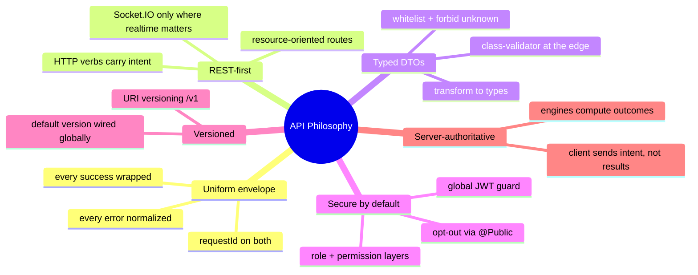

**1. Uniform envelope.** Handlers return raw data. The `TransformInterceptor` wraps every success into `ApiResponse<T>`; the `AllExceptionsFilter` renders every failure into `ApiErrorResponse`. A client never sees a "naked" payload and never has to guess the error shape. See [§10](#10-error-handling).

**2. REST-first, Socket.IO where it earns its place.** The default transport is REST because it is cacheable, debuggable, and universally tooled. WebSocket namespaces exist only for domains with genuine server-push requirements — live multiplier ticks (crash), live odds (sports), bracket advances (tournament), balance changes (wallet), runtime events. See [ADR-002](#adr-002--socketio-for-real-time-domains-only) and [§34](#34-websocket-apis).

**3. Typed DTOs at the edge.** Every request body and query is a class decorated with `class-validator` rules. The global `ValidationPipe` runs with `whitelist`, `forbidNonWhitelisted`, and `transform` — so unknown fields are rejected, and primitives arrive already coerced to their declared types. See [§14](#14-validation-rules) and [ADR-004](#adr-004--dto-validation-with-class-validator).

**4. Secure by default.** The `JwtAuthGuard` is global. A route is protected unless it explicitly opts out with `@Public()`. This inverts the usual failure mode: forgetting a decorator makes a route *more* locked-down, not less. See [§7](#7-authentication) and [ADR-005](#adr-005--global-jwt-guard-with-public-opt-out).

**5. Server-authoritative outcomes.** For game engines, the client sends *intent* (a bet, an action, a cash-out request) and the server computes the outcome deterministically. The API never accepts a result from the client. This is the API-surface reflection of the model described in [GAME_RUNTIME.md](./GAME_RUNTIME.md) and [WALLET_ENGINE.md](./WALLET_ENGINE.md). See [ADR-011](#adr-011--runtime-apis-are-server-authoritative).

**6. Provably fair, verifiable offline.** Every game engine exposes public `verify-*` endpoints that let anyone reproduce an outcome from its seeds without authentication. Fairness is part of the *API contract*, not an internal detail. See [§22](#22-card-engine-api)–[§25](#25-crash-api).

---

## 6. Versioning Strategy

The platform uses **URI-based versioning**, configured globally in `main.ts`:

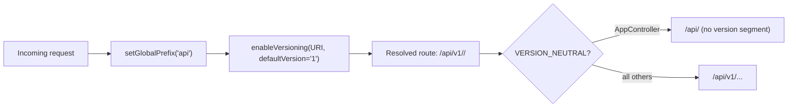

| Aspect | Value | Source |
| --- | --- | --- |
| Versioning type | `VersioningType.URI` | `main.ts` `enableVersioning` |
| Default version | `1` (env `API_VERSION`, default `'1'`) | `env.validation.ts` |
| Global prefix | `api` (env `API_PREFIX`, default `'api'`) | `env.validation.ts` |
| Resolved base | `/api/v1` | prefix + version |
| Version-neutral routes | `AppController` (`@Controller({ version: VERSION_NEUTRAL })`) | `app.controller.ts` |
| Swagger server entry | `/api/v1` (`addServer`) | `swagger.ts` |

**Why URI versioning.** The version is visible in every URL, cacheable by intermediaries, and trivially routable at the gateway/CDN layer without inspecting headers. A future `v2` can live side-by-side with `v1` by mounting new controllers at a different version, and clients migrate URL-by-URL. See [ADR-003](#adr-003--uri-versioning-under-a-global-prefix).

**The one exception** is the root metadata endpoint. `AppController` is declared `VERSION_NEUTRAL` so that `GET /api/` returns API metadata and status regardless of version negotiation — a stable, unversioned "is the API alive and what is it" probe.

Every other controller inherits `v1`. Throughout this document, endpoint tables list the **path relative to `/api/v1`** unless stated otherwise. So a table row of `GET /wallet` means `GET /api/v1/wallet`.

---

## 7. Authentication

Authentication is JWT-based, with a rotating refresh token delivered as an HTTP-only cookie. The full security rationale lives in [SECURITY_GUIDE.md](./SECURITY_GUIDE.md); this section documents the *callable contract*.

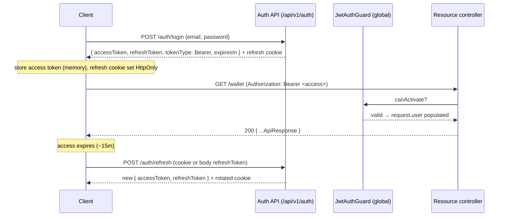

### 7.1 Token model

| Token | Transport | Default lifetime | Source of truth |
| --- | --- | --- | --- |
| Access token | `Authorization: Bearer <jwt>` header | `15m` (`TOKEN.ACCESS_DEFAULT_TTL`) | `packages/shared` constants |
| Refresh token | HTTP-only cookie (`config.auth.cookieName`) **or** request body | `7d` (`TOKEN.REFRESH_DEFAULT_TTL`) | `packages/shared` constants |
| Token type | `Bearer` | — | `AuthTokensDto` |

The JWT strategy (`jwt.strategy.ts`) extracts the token via `ExtractJwt.fromAuthHeaderAsBearerToken()` — i.e. the `Authorization: Bearer` header. On success it populates `request.user` with an `AuthenticatedUser` (id, role, roles, permissions, sessionId, jti), which the `@CurrentUser()` param decorator surfaces to handlers.

### 7.2 The authentication endpoints

All live on `AuthController` (`@Controller('auth')`, tag **Authentication**). Public endpoints bypass the global JWT guard via `@Public()`.

| Verb | Path | Auth | Body DTO | Purpose |
| --- | --- | --- | --- | --- |
| POST | `/auth/register` | Public | `RegisterDto` | Register a new account and start a session |
| POST | `/auth/login` | Public | `LoginDto` | Authenticate with email + password |
| POST | `/auth/2fa/verify` | Public | `VerifyTwoFactorLoginDto` | Complete a 2FA challenge and start a session |
| POST | `/auth/refresh` | Public (throttled 30/60s) | `RefreshDto` | Rotate the refresh token for a new pair |
| POST | `/auth/logout` | Bearer | — | Revoke the current session |
| POST | `/auth/logout-all` | Bearer | — | Revoke every session for the user |
| GET | `/auth/me` | Bearer | — | Authenticated profile + authorization |
| POST | `/auth/verify-email` | Public | `VerifyEmailDto` | Verify an email with a token |
| POST | `/auth/resend-verification` | Bearer | — | Resend the verification link |
| POST | `/auth/forgot-password` | Public | `ForgotPasswordDto` | Request a password reset email |
| POST | `/auth/reset-password` | Public | `ResetPasswordDto` | Reset a password with a token |
| POST | `/auth/change-password` | Bearer | `ChangePasswordDto` | Change password (revokes other sessions) |
| POST | `/auth/password/strength` | Public | `PasswordStrengthDto` | Evaluate password strength |

### 7.3 Refresh-token rotation

`POST /auth/refresh` accepts the refresh token from **either** the request body (`RefreshDto.refreshToken`, validated as a JWT) **or** the refresh cookie. On success it issues a *new* token pair and sets a *new* rotated cookie — the old refresh token is retired. This is single-use rotation: a replayed refresh token is invalid. The endpoint is additionally throttled to 30 requests per 60 seconds (`@Throttle({ default: { limit: 30, ttl: 60_000 } })`) to blunt brute-force and token-spray attempts. See [ADR-006](#adr-006--single-use-refresh-token-rotation).

### 7.4 Machine-to-machine: API keys

For automation and integrators, the platform supports API-key auth via the `ApiKeyGuard`, which reads the `x-api-key` header, verifies it through `ApiKeyService`, and populates `request.apiKey` with `{ userId, scopes, keyId }`. Keys are managed through the **API Keys** controller:

| Verb | Path | Auth | Body DTO | Purpose |
| --- | --- | --- | --- | --- |
| GET | `/auth/api-keys` | Bearer | — | List the user's API keys |
| POST | `/auth/api-keys` | Bearer | `CreateApiKeyDto` | Create a key (secret returned once) |
| DELETE | `/auth/api-keys/:id` | Bearer | — | Revoke a key |

`CreateApiKeyDto` carries a `name` (2–60 chars), optional `scopes` (string slugs), and optional `expiresInDays` (1–3650). The secret is returned exactly once, on creation — it is never retrievable again, mirroring the standard "show once" pattern.

---

## 8. Authorization

Authorization is layered. After authentication, two more global guards decide whether the authenticated principal may proceed: `RolesGuard` (coarse, role-based) and `PermissionsGuard` (fine-grained, permission-slug based). Both are metadata-driven and both *fail open to "allowed"* only when no requirement is declared — otherwise they enforce.

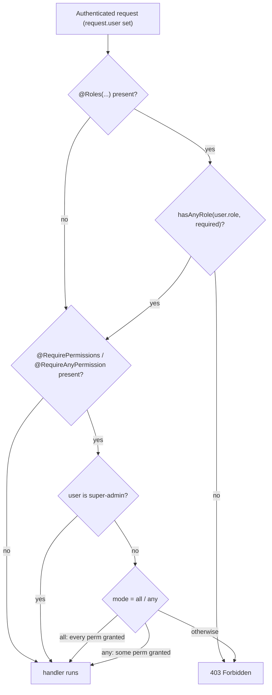

### 8.1 The two authorization models

| Model | Decorator | Guard | Semantics |
| --- | --- | --- | --- |
| Role-based | `@Roles(UserRole.ADMIN)` | `RolesGuard` | Passes if `user.role` satisfies **any** required role (via `hasAnyRole`) |
| Permission-based | `@RequirePermissions('a:b', …)` | `PermissionsGuard` | Passes if user holds **every** listed permission slug |
| Permission-based (any) | `@RequireAnyPermission('a:b', …)` | `PermissionsGuard` | Passes if user holds **at least one** slug |

**Super-admin bypass.** The `PermissionsGuard` short-circuits to allowed if `user.roles` includes the `SUPER_ADMIN` slug (`ROLE_SLUGS.SUPER_ADMIN`). Super admins never need explicit permission grants.

**No requirement = pass.** Both guards return `true` immediately when no metadata is present. This is what lets ordinary authenticated routes (e.g. `GET /wallet`) run without any role/permission decoration — they are gated only by authentication.

### 8.2 Where authorization is applied

Admin surfaces declare their requirement at the controller level, so every route inherits it. For example `AdminController` is annotated `@Roles(UserRole.ADMIN)` on the class, as are `AnalyticsController` and the operations admin controller. Individual routes can also tighten access (e.g. `UsersController` marks only `GET /users/:id` as `@Roles(UserRole.ADMIN)` while `GET/PATCH /users/me` remain ordinary authenticated routes). See [§32](#32-administration-api) for the full admin authorization map and [ADR-007](#adr-007--separate-admin-controllers-and-tags).

### 8.3 The `AuthenticatedUser` shape

The object the guards read and `@CurrentUser()` exposes carries: `id`, `role` (primary), `roles` (slugs, used by the permissions guard), `permissions` (granted slugs), `sessionId`, and `jti`. Handlers pull exactly what they need — e.g. `@CurrentUser('id')` for a user id, or the whole object for session/jti (used by logout).

---

## 9. Request Lifecycle

Every HTTP request traverses the same ordered pipeline. Understanding it once explains the behavior of all 46 controllers.

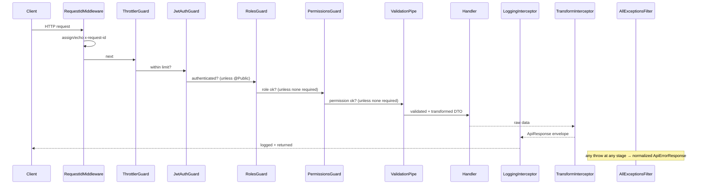

### 9.1 The ordered stages

| # | Stage | Component | Responsibility |
| --- | --- | --- | --- |
| 1 | Correlation | `RequestIdMiddleware` | Assign/echo `x-request-id`; attach `req.id` |
| 2 | Rate limit | `ThrottlerGuard` (global) | Enforce per-window request budget |
| 3 | Authentication | `JwtAuthGuard` (global) | Validate JWT unless `@Public` |
| 4 | Role authorization | `RolesGuard` (global) | Enforce `@Roles(...)` |
| 5 | Permission authorization | `PermissionsGuard` (global) | Enforce `@RequirePermissions(...)` |
| 6 | Validation | `ValidationPipe` (global) | Whitelist, reject unknown, transform DTO |
| 7 | Handler | Controller method | Execute business logic via services |
| 8 | Response logging | `LoggingInterceptor` | Log method/path/status/duration |
| 9 | Envelope | `TransformInterceptor` | Wrap result in `ApiResponse<T>` |
| — | Error path | `AllExceptionsFilter` | Normalize any throw into `ApiErrorResponse` |

The guard order is set explicitly in `app.module.ts` — `ThrottlerGuard`, then `JwtAuthGuard`, then `RolesGuard`, then `PermissionsGuard` — and it is intentional: cheap network-abuse rejection first, then identity, then coarse authorization, then fine authorization. There is no point validating a body or checking a permission for a request that will be rate-limited away. See [ADR-008](#adr-008--the-guard-chain-order).

### 9.2 Correlation and observability

`RequestIdMiddleware` runs for `*` (all routes). It honors an inbound `x-request-id` (so a request id can flow across services) or generates a `randomUUID()`, attaches it to `req.id`, and sets it on the response header. Both the success envelope and the error envelope echo this `requestId`, and the `LoggingInterceptor` and `AllExceptionsFilter` include it in their structured logs. This is the thread that ties a client-visible response to its server-side log lines — see [OPERATIONS_PLATFORM.md](./OPERATIONS_PLATFORM.md) for how those logs are aggregated.

### 9.3 What the interceptors add

- **`LoggingInterceptor`** logs `METHOD path status +Nms` on success and `METHOD path failed +Nms` on error, with structured fields (`method`, `url`, `statusCode`, `durationMs`). It only acts on `http` contexts, so WebSocket traffic is unaffected.
- **`TransformInterceptor`** maps the handler's raw return into `{ success: true, statusCode, message: 'OK', data, timestamp, path, requestId }`. The `statusCode` is read from the live response, so a handler that sets `204`/`201` is reflected accurately.

---

## 10. Error Handling

Every failure — validation, HTTP exception, domain `AppError`, or an unexpected throw — is funneled through the single `AllExceptionsFilter` and rendered into one shape.

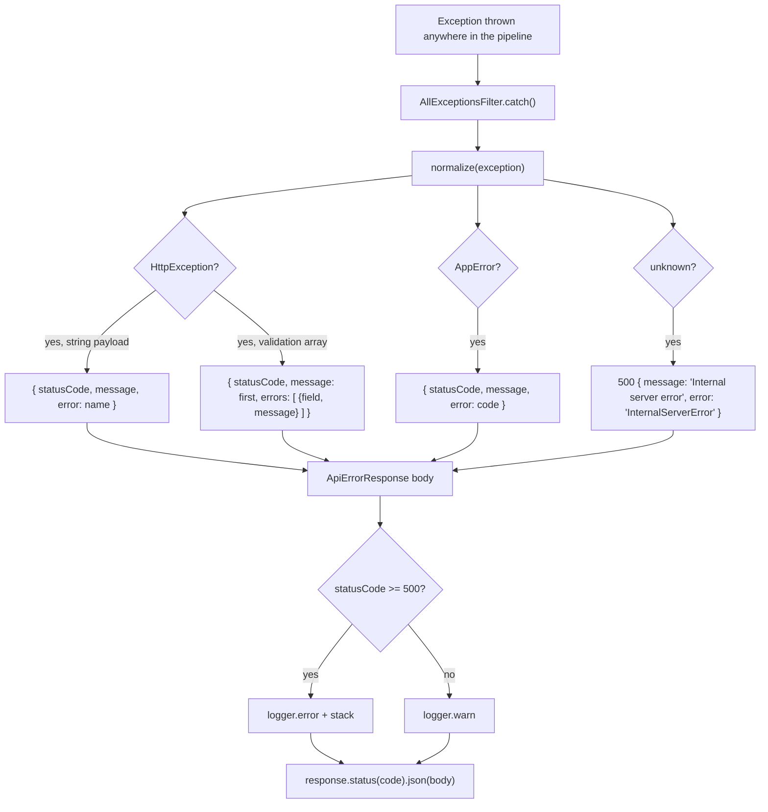

### 10.1 The error envelope

```jsonc
{
  "success": false,
  "statusCode": 400,
  "message": "email must be an email",
  "error": "BadRequestException",
  "errors": [{ "field": "", "message": "email must be an email" }],
  "timestamp": "2026-07-01T12:00:00.000Z",
  "path": "/api/v1/auth/register",
  "requestId": "b1f2…"
}
```

| Field | Type | Always present | Meaning |
| --- | --- | --- | --- |
| `success` | `false` | yes | Discriminator — always `false` on errors |
| `statusCode` | number | yes | HTTP status |
| `message` | string | yes | Human-readable summary (first validation message on 400s) |
| `error` | string | yes | Machine label — exception name or domain `code` |
| `errors` | `ApiFieldError[]` | only for multi-message validation | Per-field validation details (`field`, `message`, optional `code`) |
| `timestamp` | ISO string | yes | Server time of the error |
| `path` | string | yes | `request.originalUrl` |
| `requestId` | string | yes | Correlation id for log lookup |

### 10.2 Normalization rules

The filter's `normalize()` handles four cases in order:

1. **`HttpException`** — uses the exception's status. If the payload is a string, that becomes the `message` and the exception name becomes `error`. If the payload is the Nest validation shape (a `message` array), the **first** message becomes `message` and each entry becomes an `ApiFieldError` in `errors`.
2. **`AppError`** (from `@gaming-platform/shared`) — the domain error's `statusCode` becomes the HTTP status and its `code` becomes `error`. This is how domain codes like `INSUFFICIENT_FUNDS` reach the client. See [§37](#37-error-code-catalog).
3. **Unknown throws** — collapsed to a `500` with `message: 'Internal server error'`, `error: 'InternalServerError'`. Internal details are never leaked.
4. **Logging** — `5xx` is logged at `error` with a stack; everything else at `warn`. Both carry the request context.

See [ADR-009](#adr-009--single-exception-filter-with-domain-apperror-mapping).

---

## 11. Pagination

List endpoints paginate through a shared `PaginationQueryDto` (extended by domain query DTOs) and return a `PaginatedResult<T>`.

### 11.1 The pagination query

| Param | Type | Default | Constraints | Source |
| --- | --- | --- | --- | --- |
| `page` | int | `1` (`PAGINATION.DEFAULT_PAGE`) | `≥ 1` | `PaginationQueryDto` |
| `limit` | int | `20` (`PAGINATION.DEFAULT_LIMIT`) | `1`–`100` (`MIN_LIMIT`–`MAX_LIMIT`) | `PaginationQueryDto` |
| `sortBy` | string | — | optional field name | `PaginationQueryDto` |
| `sortOrder` | enum | `desc` | `asc` \| `desc` | `PaginationQueryDto` |
| `search` | string | — | free-text | `PaginationQueryDto` |

The `@Type(() => Number)` transforms and `@Min`/`@Max` bounds mean a client that passes `?limit=9999` is rejected with a `400`, not silently served a huge page. The `limit` ceiling of `100` is a hard cap enforced by validation, protecting the database and the response size. See [ADR-010](#adr-010--shared-pagination-dto-with-a-hard-limit-ceiling).

### 11.2 The pagination response

```jsonc
{
  "items": [ /* T[] */ ],
  "meta": {
    "page": 1, "limit": 20, "total": 137,
    "totalPages": 7, "hasNextPage": true, "hasPreviousPage": false
  }
}
```

`PaginationMeta` gives clients everything needed to render a pager without additional calls: current position (`page`/`limit`), the totals (`total`/`totalPages`), and precomputed boundary flags (`hasNextPage`/`hasPreviousPage`). This is wrapped by the standard envelope, so the full body is `ApiResponse<PaginatedResult<T>>`.

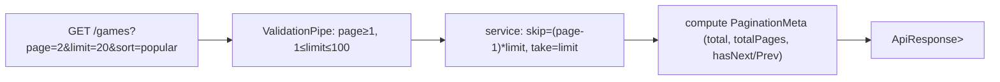

### 11.3 Endpoints that paginate

Pagination is pervasive on list surfaces. Representative examples (relative to `/api/v1`):

| Endpoint | Query DTO |
| --- | --- |
| `GET /games` | `QueryGamesDto` (extends `PaginationQueryDto`) |
| `GET /wallet-engine/transactions` | `TransactionQueryDto` |
| `GET /transactions` | `PaginationQueryDto` |
| `GET /notifications` | `PaginationQueryDto` |
| `GET /admin/users` | `PaginationQueryDto` + `search` |
| `GET /admin/audit` | `PaginationQueryDto` + filters |
| `GET /favorites` | `PaginationQueryDto` |
| `GET /admin/games` | `PaginationQueryDto` |

---

## 12. Filtering

Filtering is expressed as additional query parameters on the domain query DTO. The richest example is the game catalog's `QueryGamesDto`, which extends `PaginationQueryDto` and adds a broad filter set.

### 12.1 Catalog filters (`QueryGamesDto`)

| Param | Type | Validation | Meaning |
| --- | --- | --- | --- |
| `category` | string | optional | Category slug |
| `provider` | string | optional | Provider code |
| `tag` | string | optional | Tag slug |
| `device` | string | optional | Platform (`web`, `ios`, `android`, …) |
| `language` | string | optional | Language code |
| `currency` | string | optional | Currency code |
| `country` | string | optional | ISO country for geo filtering |
| `ageRating` | string | optional | Age rating |
| `minRtp` | numeric string | `@IsNumberString` | Minimum RTP |
| `isNew` | boolean | `@Transform(toBool)` | New games only |
| `isFeatured` | boolean | `@Transform(toBool)` | Featured only |
| `isTrending` | boolean | `@Transform(toBool)` | Trending only |
| `sort` | enum | one of `SORTS` | Sort option (see [§13](#13-sorting)) |

The boolean filters use a custom `toBool` transform so that `?isNew=true` (a string over the wire) becomes a real boolean, and an absent parameter stays `undefined` (not `false`) — the filter is only applied when explicitly present. See [ADR-012](#adr-012--boolean-query-coercion-via-transform).

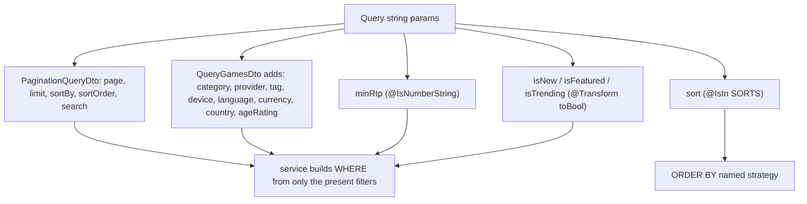

### 12.2 Filtering in other domains

| Domain | Filterable query params | Source |
| --- | --- | --- |
| Transactions (wallet-engine) | `type`, `status`, `page`, `limit` | `TransactionQueryDto` |
| Sports matches | `competition`, `sport`, `status` (via query) | `SportsController` `GET /sports/matches` |
| Operations logs | `level` (`info`/`warn`/`error`), `search`, `limit` | `LogQueryDto` |
| Admin users | `search` | `AdminUsersController` |
| Tournaments | list filters | `TournamentController` `GET /tournaments` |

Filtering is always *additive and optional*: every filter param is `@IsOptional()`, so omitting it widens the result rather than erroring.

---

## 13. Sorting

Sorting is handled two ways depending on the surface.

**1. Generic sorting** — via `PaginationQueryDto.sortBy` + `sortOrder`. Any list endpoint that accepts the base pagination DTO accepts a `sortBy` field name and a `sortOrder` of `asc`/`desc` (default `desc`).

**2. Named sort strategies** — the catalog uses a curated enum instead of arbitrary field names, because "popular" and "trending" are computed rankings, not columns:

| `sort` value | Meaning |
| --- | --- |
| `popular` | Popularity ranking (default) |
| `trending` | Trending score ranking |
| `newest` | Most recently added |
| `rating` | Highest rated |
| `name` | Alphabetical |
| `display` | Curated display order |

The set is defined as `const SORTS: GameSortOption[]` and enforced with `@IsIn(SORTS)`, so an unknown sort value is rejected at validation. This keeps sorting semantics under server control — a client cannot ask to sort by an unindexed or sensitive column. See [ADR-013](#adr-013--named-sort-strategies-for-the-catalog).

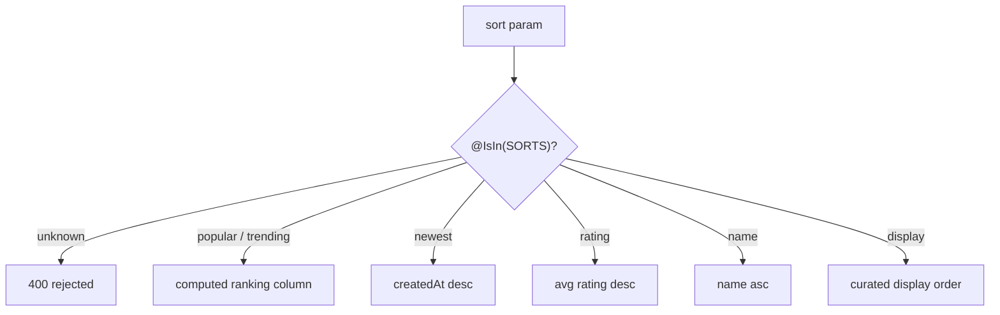

---

## 14. Validation Rules

Validation is centralized in the global `ValidationPipe` (configured in `main.ts`) plus per-DTO `class-validator` decorators.

### 14.1 The global pipe configuration

| Option | Value | Effect |
| --- | --- | --- |
| `whitelist` | `true` | Strips properties with no validation decorator |
| `forbidNonWhitelisted` | `true` | **Rejects** (400) any unknown property, rather than stripping |
| `transform` | `true` | Instantiates the DTO class and coerces types |
| `transformOptions.enableImplicitConversion` | `true` | Coerces primitives (e.g. query strings → numbers) |

`forbidNonWhitelisted` is the strict choice: sending `{"email": "...", "isAdmin": true}` to an endpoint whose DTO has no `isAdmin` field is a `400`, not a silent drop. This closes mass-assignment style attacks at the edge. See [ADR-004](#adr-004--dto-validation-with-class-validator).

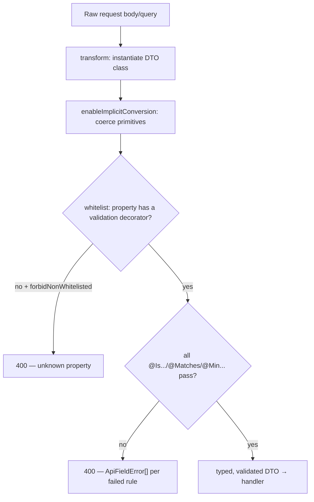

### 14.2 Common validation vocabulary

The DTOs draw from a consistent decorator vocabulary. Representative rules seen across the surface:

| Decorator | Used for | Example |
| --- | --- | --- |
| `@IsEmail()` | email fields | `LoginDto.email`, `RegisterDto.email` |
| `@IsString()` / `@IsNotEmpty()` | required text | passwords, tokens, ids |
| `@MinLength` / `@MaxLength` | bounded text | username 3–24, password 8–128 |
| `@Matches(pattern)` | format enforcement | password policy, monetary amounts, kebab-case keys |
| `@IsInt()` + `@Min`/`@Max` | bounded integers | ratings 1–5, pagination |
| `@IsIn([...])` | enumerations | wallet types, bet types, statuses |
| `@IsBoolean()` | flags | `rememberMe`, `enabled` |
| `@IsUUID()` | identifiers | role ids, permission ids |
| `@IsJWT()` | tokens | `RefreshDto.refreshToken` |
| `@ValidateNested()` + `@Type()` | arrays of objects | bet slips, dice bets, crash bets |
| `@IsObject()` | data-driven config | variant rules, save-state snapshots |

### 14.3 Domain-specific patterns

Three patterns recur and are worth calling out because integrators hit them constantly:

- **Monetary amounts** are validated as strings against `^\d+(\.\d{1,18})?$` (up to 18 decimal places) — never as floats. This is the API-surface expression of the wallet's exact-decimal model ([WALLET_ENGINE.md](./WALLET_ENGINE.md)). See `TransferDto.amount`, `GrantBonusDto.amount`, `AdminAdjustDto.amount`. See [ADR-014](#adr-014--monetary-amounts-are-validated-strings).
- **Resource keys** (variant keys, plugin keys, alert ids, sport/competition keys) are validated as kebab-case against `^[a-z0-9]+(?:-[a-z0-9]+)*$`. This gives every engine and rule a URL-safe, human-readable identifier.
- **Password policy** — `@MinLength(8)`, `@MaxLength(128)`, and `@Matches(/^(?=.*[a-z])(?=.*[A-Z])(?=.*\d).+$/)` (one lowercase, one uppercase, one digit), sourced from `PASSWORD_POLICY` so the rule is identical in `RegisterDto`, `ResetPasswordDto`, and `ChangePasswordDto`.

---

## 15. REST API Overview

The REST surface is 46 controllers. This section is the master index; [§16](#16-authentication-api)–[§33](#33-notification-api) then drill into each domain. Every path below is relative to `/api/v1`.

### 15.1 Controller census

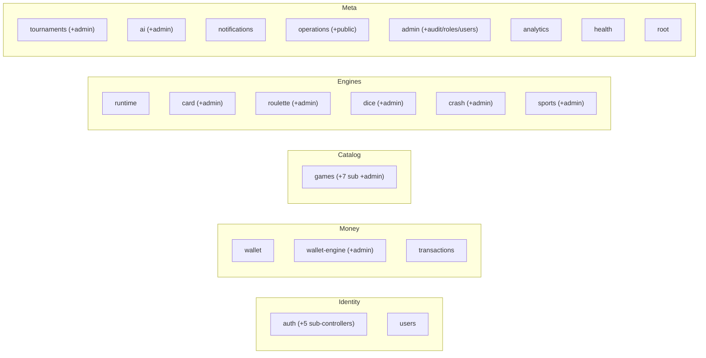

### 15.2 Master controller table

| # | Controller | Base route | Swagger tag | Class-level auth |
| --- | --- | --- | --- | --- |
| 1 | `AppController` | `/` (neutral) | Root | `@Public` (metadata) |
| 2 | `HealthController` | `/health` | Health | Public probes |
| 3 | `AuthController` | `/auth` | Authentication | mixed (public + bearer) |
| 4 | `TwoFactorController` | `/auth/2fa` | Two-Factor Authentication | Bearer |
| 5 | `SessionsController` | `/auth/sessions` | Account Security | Bearer |
| 6 | `DevicesController` | `/auth/devices` | Account Security | Bearer |
| 7 | `SecurityController` | `/auth/security` | Account Security | Bearer |
| 8 | `ApiKeysController` | `/auth/api-keys` | API Keys | Bearer |
| 9 | `UsersController` | `/users` | Users | Bearer (+admin on `:id`) |
| 10 | `WalletController` | `/wallet` | Wallet | Bearer |
| 11 | `WalletEngineController` | `/wallet-engine` | Wallet Engine | Bearer |
| 12 | `AdminWalletController` | `/admin/wallet` | Admin · Wallet Engine | Admin |
| 13 | `TransactionsController` | `/transactions` | Transactions | Bearer |
| 14 | `GamesController` (catalog) | `/games` | Games · Catalog | mixed |
| 15 | `GamesController` (simple) | `/games` | Games | Public list/detail |
| 16 | `CategoriesController` | `/game-categories` | Games · Categories | Public |
| 17 | `CollectionsController` | `/game-collections` | Games · Collections | Public |
| 18 | `ProvidersController` | `/game-providers` | Games · Providers | Public |
| 19 | `FavoritesController` | `/favorites` | Games · Favorites | Bearer |
| 20 | `RatingsController` | `/game-ratings` | Games · Ratings | Bearer |
| 21 | `RecentlyPlayedController` | `/recently-played` | Games · Recently Played | Bearer |
| 22 | `AdminGamesController` | `/admin/games` | Admin · Games | Admin |
| 23 | `AdminCatalogController`* | `/admin/game-categories` … | Admin · Categories/Providers/Collections/Launchers | Admin |
| 24 | `RuntimeController` | `/runtime` | Game Runtime | mixed |
| 25 | `CardController` | `/card` | Card Engine | mixed |
| 26 | `AdminCardController` | `/admin/card` | Admin · Card Engine | Admin |
| 27 | `RouletteController` | `/roulette` | Roulette Engine | mixed |
| 28 | `AdminRouletteController` | `/admin/roulette` | Admin · Roulette Engine | Admin |
| 29 | `DiceController` | `/dice` | Dice Engine | mixed |
| 30 | `AdminDiceController` | `/admin/dice` | Admin · Dice Engine | Admin |
| 31 | `CrashController` | `/crash` | Crash Engine | mixed |
| 32 | `AdminCrashController` | `/admin/crash` | Admin · Crash Engine | Admin |
| 33 | `SportsController` | `/sports` | Sports Betting | mixed |
| 34 | `AdminSportsController` | `/admin/sports` | Admin · Sports Betting | Admin |
| 35 | `TournamentController` | `/tournaments` | Tournaments | mixed |
| 36 | `AdminTournamentController` | `/admin/tournaments` | Admin · Tournaments | Admin |
| 37 | `AiController` | `/ai` | AI | mixed |
| 38 | `AdminAiController` | `/admin/ai` | Admin · AI | Admin |
| 39 | `NotificationsController` | `/notifications` | Notifications | Bearer |
| 40 | `OperationsController` (admin) | `/admin/operations` | Admin · Operations | Admin |
| 41 | `OperationsController` (public) | `/operations` | Operations | Public status |
| 42 | `AdminController` | `/admin` | Admin | Admin |
| 43 | `AdminAuditController` | `/admin/audit` | Admin · Audit | Admin |
| 44 | `AdminRolesController` | `/admin` (roles/permissions) | Admin · Roles & Permissions | Admin |
| 45 | `AdminUsersController` | `/admin/users` | Admin · Users | Admin |
| 46 | `AnalyticsController` | `/analytics` | Analytics | Admin |

\* `AdminCatalogController` file declares four controllers (`game-categories`, `game-providers`, `game-collections`, `game-launchers`) under distinct admin tags.

Controllers delegate to services, and cross-domain flows compose those services — the controller dependency graph below shows the principal integration edges (a controller reaching another domain's service):

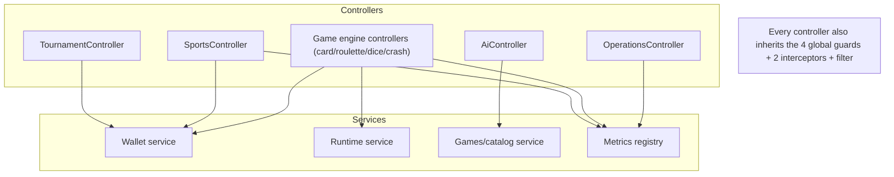

### 15.3 Health & root endpoints

| Verb | Path | Auth | Purpose |
| --- | --- | --- | --- |
| GET | `/` (neutral) | Public | API metadata and status |
| GET | `/health` | Public | Full readiness check (database, cache, memory) |
| GET | `/health/liveness` | Public | Liveness probe — process is up |
| GET | `/health/readiness` | Public | Readiness probe — dependencies reachable |
| GET | `/operations/status` | Public | Public service status (up / degraded / down) |

The health endpoints return a `HealthCheckResult` (`status`, `info`, `error`, `details`, `uptime`, `version`, `timestamp`) — see [§36](#36-dto-catalog). These are the endpoints Kubernetes/orchestration probes hit; they are deliberately `@Public()` so probes need no credentials. See [DEPLOYMENT_GUIDE.md](./DEPLOYMENT_GUIDE.md) for how they wire into liveness/readiness gates.

---

## 16. Authentication API

The authentication domain spans six controllers: the core `AuthController` plus five account-security sub-controllers. The core endpoints are catalogued in [§7.2](#72-the-authentication-endpoints); this section covers the account-security surface and the request/response shapes.

### 16.1 Two-factor authentication (`/auth/2fa`)

| Verb | Path | Auth | Body | Purpose |
| --- | --- | --- | --- | --- |
| POST | `/auth/2fa/setup` | Bearer | — | Begin TOTP setup — returns QR code + secret |
| POST | `/auth/2fa/enable` | Bearer | `TwoFactorCodeDto` | Confirm a code, enable 2FA, receive recovery codes |
| POST | `/auth/2fa/disable` | Bearer | `TwoFactorCodeDto` | Disable two-factor authentication |
| GET | `/auth/2fa/status` | Bearer | — | Get two-factor status |
| POST | `/auth/2fa/recovery-codes` | Bearer | `TwoFactorCodeDto` | Regenerate recovery codes |

The login flow's 2FA branch is completed at the public `POST /auth/2fa/verify` with `VerifyTwoFactorLoginDto` (`challengeToken` + `code`). The `challengeToken` is issued by `POST /auth/login` when the account has 2FA enabled — login does not return tokens directly in that case; it returns a challenge the client must satisfy.

### 16.2 Sessions, devices, security (`/auth/*`)

| Verb | Path | Controller | Body | Purpose |
| --- | --- | --- | --- | --- |
| GET | `/auth/sessions` | Sessions | — | List active sessions |
| DELETE | `/auth/sessions/:id` | Sessions | — | Revoke a specific session |
| DELETE | `/auth/sessions` | Sessions | — | Revoke all other sessions (keep current) |
| GET | `/auth/devices` | Devices | — | List devices that accessed the account |
| PATCH | `/auth/devices/:id/trust` | Devices | `TrustDeviceDto` | Mark a device trusted / untrusted |
| DELETE | `/auth/devices/:id` | Devices | — | Remove a device |
| GET | `/auth/security/login-history` | Security | — | Recent login attempts |
| GET | `/auth/security/events` | Security | — | Recent security events |

These endpoints turn the account into a self-service security console: users can enumerate and revoke their own sessions and devices, and audit their own login history. The `@ReqMeta()` decorator feeds IP/user-agent/device-fingerprint context into the session and security-event records — see [SECURITY_GUIDE.md](./SECURITY_GUIDE.md).

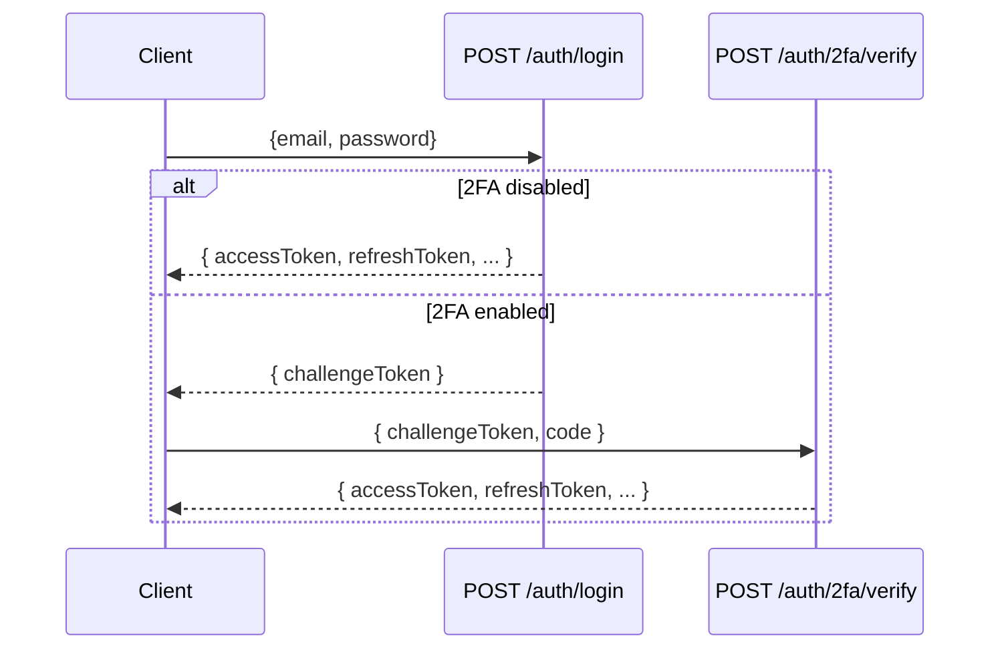

---

## 17. User / Profile API

`UsersController` (`@Controller('users')`, tag **Users**) is the self-profile surface.

| Verb | Path | Auth | Body | Purpose |
| --- | --- | --- | --- | --- |
| GET | `/users/me` | Bearer | — | Get the authenticated user (from the access token) |
| PATCH | `/users/me` | Bearer | `UpdateProfileDto` | Update the authenticated profile |
| GET | `/users/:id` | **Admin** | — | Fetch a user by id (admin only) |

`UpdateProfileDto` is deliberately narrow — only `displayName` (≤ 60 chars) and `avatarUrl` (a valid URL) are updatable through this route. Everything sensitive (email, password, roles) is handled by dedicated, separately-guarded flows (auth endpoints for credentials, admin endpoints for roles). The single admin-only route on this controller (`GET /users/:id`) demonstrates route-level `@Roles(UserRole.ADMIN)` layered on an otherwise ordinary authenticated controller. See [ADR-015](#adr-015--narrow-profile-dto-privileged-fields-elsewhere).

Note there is also a richer identity surface exposed at `GET /auth/me`, which returns the profile *plus* the authorization context (roles, permissions). Clients that need to render permission-gated UI read `/auth/me`; clients that only need profile fields read `/users/me`.

---

## 18. Wallet API

The wallet surface is split across three controllers by audience: a simple read-only `WalletController`, the full-featured `WalletEngineController` for player operations, and the `AdminWalletController` for privileged operations. All monetary values are strings. The double-entry model behind these endpoints is documented in [WALLET_ENGINE.md](./WALLET_ENGINE.md).

### 18.1 Read surface (`/wallet`)

| Verb | Path | Auth | Purpose |
| --- | --- | --- | --- |
| GET | `/wallet` | Bearer | List the user's wallets |
| GET | `/wallet/summary` | Bearer | Balance summary across all wallets |
| GET | `/wallet/:currencyId` | Bearer | Get (or create) a wallet by currency |

### 18.2 Player operations (`/wallet-engine`)

| Verb | Path | Auth | Body | Purpose |
| --- | --- | --- | --- | --- |
| GET | `/wallet-engine/balances` | Bearer | — | All wallet balances for the user |
| GET | `/wallet-engine/wallets/:currencyId` | Bearer | — | Get/create the main wallet for a currency |
| GET | `/wallet-engine/transactions` | Bearer | `TransactionQueryDto` | List transaction history (filter + paginate) |
| GET | `/wallet-engine/transactions/:id` | Bearer | — | Get a transaction by id |
| POST | `/wallet-engine/transfer` | Bearer | `TransferDto` | Transfer funds between the user's wallet types |
| GET | `/wallet-engine/bonus` | Bearer | — | List bonus wallets |
| POST | `/wallet-engine/bonus/:id/convert` | Bearer | — | Convert a cleared bonus into the main wallet |
| GET | `/wallet-engine/reward` | Bearer | — | Get the reward (loyalty) wallet |
| POST | `/wallet-engine/reward/redeem` | Bearer | `RewardPointsDto` | Redeem loyalty points |
| POST | `/wallet-engine/grant-bonus` | Bearer | `GrantBonusDto` | Claim a promotional bonus (if eligible) |

### 18.3 Admin operations (`/admin/wallet`)

| Verb | Path | Auth | Body | Purpose |
| --- | --- | --- | --- | --- |
| GET | `/admin/wallet/statistics` | Admin | — | Platform wallet statistics |
| GET | `/admin/wallet/reports/overview` | Admin | — | Gaming revenue report (turnover, wins, RTP, GGR) |
| GET | `/admin/wallet/reconcile` | Admin | — | Ledger trial balance (debits vs credits) |
| GET | `/admin/wallet/users/:userId/wallets` | Admin | — | Inspect a user's wallets |
| GET | `/admin/wallet/users/:userId/transactions` | Admin | — | Inspect a user's transactions |
| GET | `/admin/wallet/wallets/:walletId/ledger` | Admin | — | Ledger entries for a wallet |
| POST | `/admin/wallet/credit` | Admin | `AdminAdjustDto` | Manual credit (administrative adjustment) |
| POST | `/admin/wallet/debit` | Admin | `AdminAdjustDto` | Manual debit (administrative adjustment) |
| POST | `/admin/wallet/freeze` | Admin | `WalletStatusDto` | Freeze a wallet |
| POST | `/admin/wallet/unfreeze` | Admin | `WalletStatusDto` | Unfreeze a wallet |
| POST | `/admin/wallet/rollback` | Admin | `RollbackDto` | Reverse a transaction (correction) |

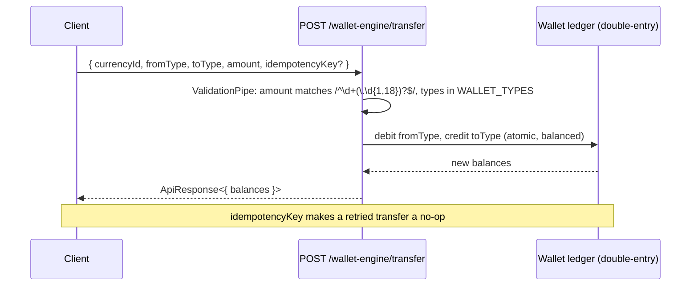

**Idempotency.** `TransferDto`, `AdminAdjustDto`, and `RollbackDto` all carry an optional `idempotencyKey`. Replaying a request with the same key does not double-apply the operation — this is essential for financial safety under retries and flaky networks. See [ADR-016](#adr-016--wallet-write-apis-are-idempotent-and-transactional) and [WALLET_ENGINE.md](./WALLET_ENGINE.md).

**Wallet types.** `TransferDto.fromType`/`toType` are validated with `@IsIn(WALLET_TYPES)` where `WALLET_TYPES = ['MAIN','BONUS','REWARD','LOCKED','TOURNAMENT','PROMOTIONAL','CASH','VIRTUAL']`. Transfers are only permitted between the caller's own wallet types.

---

## 19. Transaction API

`TransactionsController` (`@Controller('transactions')`, tag **Transactions**) is a thin, read-only projection over the ledger for the authenticated user.

| Verb | Path | Auth | Query | Purpose |
| --- | --- | --- | --- | --- |
| GET | `/transactions` | Bearer | `PaginationQueryDto` | List the user's transactions (paginated) |
| GET | `/transactions/:id` | Bearer | — | Fetch a single transaction by id |

This controller exists **separately** from the wallet-engine's `GET /wallet-engine/transactions` because it serves a different consumer: a general "activity feed" view of all transactions, versus the wallet-engine's wallet-scoped, filterable history. Both read the same underlying ledger; they differ in shape and filtering. A transaction id fetched here is the same id used in `POST /admin/wallet/rollback`. See [DATABASE_ARCHITECTURE.md](./DATABASE_ARCHITECTURE.md) for the ledger schema.

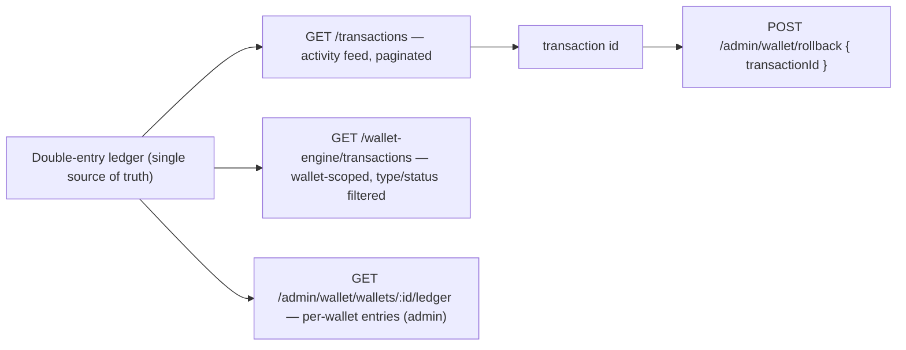

---

## 20. Game Catalog API

The catalog is the largest read surface, spanning the catalog `GamesController` plus seven sub-controllers (categories, collections, providers, favorites, ratings, recently-played) and the admin catalog controllers. Public shelves need no auth; personalized and interaction endpoints require a bearer token.

### 20.1 Catalog browse & detail (`/games`)

| Verb | Path | Auth | Query/Body | Purpose |
| --- | --- | --- | --- | --- |
| GET | `/games/featured` | Public | — | Featured games shelf |
| GET | `/games/trending` | Public | — | Trending games shelf |
| GET | `/games/popular` | Public | — | Popular games shelf |
| GET | `/games/recently-added` | Public | — | Recently added shelf |
| GET | `/games/recommended` | Bearer | — | Personalized recommendations |
| GET | `/games` | Public | `QueryGamesDto` | Browse (search, filter, sort, paginate) |
| GET | `/games/:slug` | Public | — | Game detail by slug |
| GET | `/games/:slug/related` | Public | — | Related games |
| GET | `/games/:slug/launch` | Public | — | Resolve launch info & availability |
| GET | `/games/:slug/reviews` | Public | — | Published reviews for a game |

### 20.2 Categories, collections, providers

| Verb | Path | Auth | Purpose |
| --- | --- | --- | --- |
| GET | `/game-categories` | Public | Nested category tree with game counts |
| GET | `/game-categories/:slug` | Public | Category detail by slug |
| GET | `/game-categories/:slug/games` | Public | Games in a category (paginated) |
| GET | `/game-collections` | Public | List active collections |
| GET | `/game-collections/:slug` | Public | Collection detail with games |
| GET | `/game-providers` | Public | List providers with game counts |
| GET | `/game-providers/:code` | Public | Provider detail by code |
| GET | `/game-providers/:code/games` | Public | Games from a provider (paginated) |

### 20.3 Player interactions

| Verb | Path | Auth | Body | Purpose |
| --- | --- | --- | --- | --- |
| GET | `/favorites` | Bearer | — | List favorite games (paginated) |
| GET | `/favorites/ids` | Bearer | — | List favorited game ids |
| POST | `/favorites/:gameId/toggle` | Bearer | — | Toggle a game as favorite |
| GET | `/recently-played` | Bearer | — | List recently played |
| POST | `/recently-played/:gameId` | Bearer | — | Record that a game was played |
| POST | `/game-ratings/:gameId` | Bearer | `RateGameDto` | Rate a game (1–5) |
| POST | `/game-ratings/:gameId/review` | Bearer | `ReviewGameDto` | Write or update a review |

### 20.4 Admin catalog management

| Verb | Path | Auth | Body | Purpose |
| --- | --- | --- | --- | --- |
| GET | `/admin/games/statistics` | Admin | — | Catalog statistics |
| GET | `/admin/games` | Admin | pagination | List games (all statuses) |
| GET | `/admin/games/:id` | Admin | — | Get a game for editing |
| POST | `/admin/games` | Admin | `CreateGameDto` | Create a game (metadata) |
| POST | `/admin/games/reorder` | Admin | `ReorderDto` | Reorder by display order |
| PUT | `/admin/games/:id` | Admin | `UpdateGameDto` | Update metadata |
| PATCH | `/admin/games/:id/status` | Admin | `SetStatusDto` | Change status |
| PATCH | `/admin/games/:id/visibility` | Admin | `SetVisibilityDto` | Change visibility |
| PATCH | `/admin/games/:id/flags` | Admin | `SetFlagsDto` | Toggle featured / new |
| PATCH | `/admin/games/:id/trending` | Admin | `SetTrendingDto` | Set trending state + score |
| PATCH | `/admin/games/:id/maintenance` | Admin | `SetMaintenanceDto` | Toggle maintenance |
| PATCH | `/admin/games/:id/schedule` | Admin | `ScheduleDto` | Schedule publish window |
| DELETE | `/admin/games/:id` | Admin | — | Soft-delete a game |
| GET | `/admin/games/:id/versions` | Admin | — | List version history |
| POST | `/admin/games/:id/versions` | Admin | `AddVersionDto` | Publish a new version |
| GET | `/admin/games/:id/assets` | Admin | — | List assets |
| POST | `/admin/games/:id/assets` | Admin | `CreateAssetDto` | Attach an asset |
| DELETE | `/admin/games/:id/assets/:assetId` | Admin | — | Remove an asset |

Plus the four admin catalog controllers (`/admin/game-categories`, `/admin/game-providers`, `/admin/game-collections`, `/admin/game-launchers`), each exposing full CRUD (`GET`/`POST`/`PUT`/`DELETE`) with `reorder` on categories and `PUT :id/games` on collections (set ordered games). This is the content-management backbone described in [BACKEND_ARCHITECTURE.md](./BACKEND_ARCHITECTURE.md).

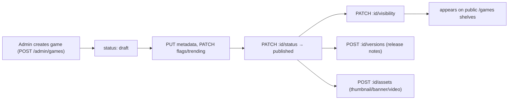

---

## 21. Runtime API

`RuntimeController` (`@Controller('runtime')`, tag **Game Runtime**) is the generic, engine-agnostic session host. It is the HTTP face of the runtime described in [GAME_RUNTIME.md](./GAME_RUNTIME.md): a plugin registry, session lifecycle, server-authoritative actions, save-state, and replay.

| Verb | Path | Auth | Body | Purpose |
| --- | --- | --- | --- | --- |
| GET | `/runtime/plugins` | Public | — | List registered game plugins (engines) |
| GET | `/runtime/plugins/:key` | Public | — | Plugin metadata + default config |
| GET | `/runtime/health` | Public | — | Runtime health |
| POST | `/runtime/provably-fair/verify` | Public | `VerifyFairnessDto` | Verify a provably-fair seed derivation |
| POST | `/runtime/sessions` | Bearer | `CreateRuntimeSessionDto` | Start a runtime session |
| GET | `/runtime/sessions/:id` | Bearer | — | Get a runtime session |
| GET | `/runtime/sessions/:id/config` | Bearer | — | Resolved configuration for a session |
| POST | `/runtime/sessions/:id/action` | Bearer | `RuntimeActionDto` | Apply a player action (server-authoritative) |
| GET | `/runtime/sessions/:id/live-state` | Bearer | — | Live in-memory state of an active runtime |
| POST | `/runtime/sessions/:id/state` | Bearer | `SaveStateDto` | Persist a save state |
| GET | `/runtime/sessions/:id/state` | Bearer | — | Restore a save state |
| POST | `/runtime/sessions/:id/replay` | Bearer | `SaveReplayDto` | Store a replay |
| GET | `/runtime/sessions/:id/replay` | Bearer | — | List replays for a session |
| POST | `/runtime/sessions/:id/end` | Bearer | — | End a session and release resources |

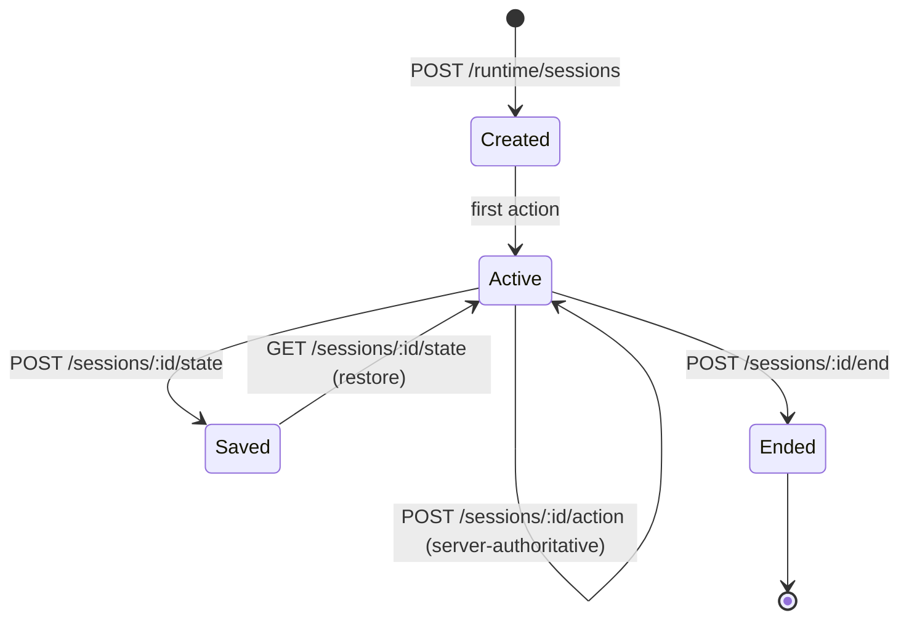

**Server-authoritative actions.** `RuntimeActionDto` carries a `type` (e.g. `dice:roll`) and an optional opaque `payload`. The client sends *what it wants to do*; the runtime computes the outcome and returns authoritative state. The client never sends an outcome. `CreateRuntimeSessionDto` accepts a `pluginKey` (kebab-case), optional `gameId`, an optional player `clientSeed` (for provable fairness), a `mode` (`real`/`demo`), and `locale`. See [ADR-011](#adr-011--runtime-apis-are-server-authoritative).

**Provable fairness as a public endpoint.** `POST /runtime/provably-fair/verify` (and its per-engine siblings) take `serverSeed`, `serverSeedHash`, `clientSeed`, `nonce`, and `expectedSeed` and confirm the derivation — with no authentication. Anyone can independently verify an outcome. See [GAME_ENGINE_SDK.md](./GAME_ENGINE_SDK.md).

---

## 22. Card Engine API

`CardController` (`@Controller('card')`, tag **Card Engine**) exposes the card games (Teen Patti, Dragon Tiger, Blackjack, and other variants). It follows the pattern shared by all four table engines: public variant discovery + verification, a stateless one-shot `play`, and a full stateful session lifecycle. Blackjack additionally has hand-action endpoints.

| Verb | Path | Auth | Body | Purpose |
| --- | --- | --- | --- | --- |
| GET | `/card/variants` | Public | — | List available variants |
| GET | `/card/variants/:key` | Public | — | Resolve the full ruleset for a variant |
| POST | `/card/play` | Bearer | `StatelessPlayDto` | Play one self-contained, verifiable round |
| POST | `/card/verify-shuffle` | Public | `VerifyShuffleDto` | Reproduce a deterministic shoe from a seed |
| POST | `/card/verify-fairness` | Public | `VerifyFairnessDto` | Verify a provably-fair seed derivation |
| POST | `/card/sessions` | Bearer | `CreateCardSessionDto` | Start a card session |
| GET | `/card/sessions/:id` | Bearer | — | Get a card session |
| POST | `/card/sessions/:id/round` | Bearer | `PlayRoundDto` | Play a round (auto-resolve games) |
| POST | `/card/sessions/:id/bj/deal` | Bearer | — | Blackjack — deal initial hands |
| POST | `/card/sessions/:id/bj/hit` | Bearer | — | Blackjack — hit |
| POST | `/card/sessions/:id/bj/stand` | Bearer | — | Blackjack — stand and resolve |
| GET | `/card/sessions/:id/state` | Bearer | — | Restore saved state |
| POST | `/card/sessions/:id/state` | Bearer | `SaveCardStateDto` | Persist save state |
| GET | `/card/sessions/:id/replay` | Bearer | — | List replays |
| POST | `/card/sessions/:id/replay` | Bearer | `SaveCardReplayDto` | Store a replay |
| GET | `/card/sessions/:id/history` | Bearer | — | Round history |
| GET | `/card/sessions/:id/fairness` | Bearer | — | Current fairness commitment |
| POST | `/card/sessions/:id/end` | Bearer | — | End session and reveal server seed |

Admin management lives on `AdminCardController` (`/admin/card`): list/create/update/enable/disable/delete variants, `GET statistics`, `GET replays`. `CreateCardVariant`/`UpdateCardVariant`-style DTOs carry a kebab-case `key`, a `name`, and a data-driven `rules` object (`@IsObject()`) — the engine is configured by data, not code, exactly as [GAME_ENGINE_SDK.md](./GAME_ENGINE_SDK.md) describes.

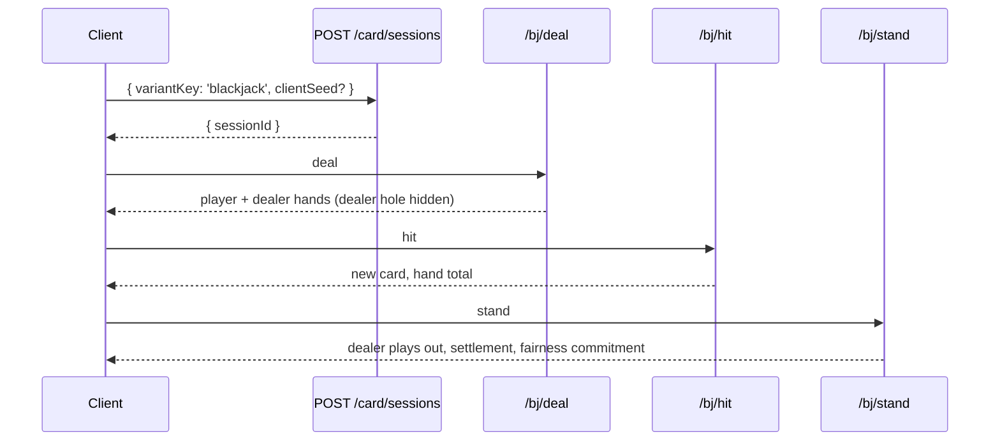

**PlaceBetDto (card).** A bet is `{ type: string, amount: string }` — e.g. `{ type: 'dragon', amount: '10' }`. `PlayRoundDto` wraps an array of these; `StatelessPlayDto` adds a `variantKey` and optional `clientSeed`.

---

## 23. Roulette API

`RouletteController` (`@Controller('roulette')`, tag **Roulette Engine**) mirrors the table-engine pattern with a spin lifecycle.

| Verb | Path | Auth | Body | Purpose |
| --- | --- | --- | --- | --- |
| GET | `/roulette/variants` | Public | — | List available variants |
| GET | `/roulette/variants/:key` | Public | — | Resolve the full ruleset |
| POST | `/roulette/play` | Bearer | `StatelessSpinDto` | Spin one self-contained, verifiable round |
| POST | `/roulette/verify-spin` | Public | `VerifySpinDto` | Reproduce a deterministic spin from a seed |
| POST | `/roulette/verify-fairness` | Public | `VerifyFairnessDto` | Verify a seed derivation |
| POST | `/roulette/sessions` | Bearer | `CreateRouletteSessionDto` | Start a session |
| GET | `/roulette/sessions/:id` | Bearer | — | Get a session |
| POST | `/roulette/sessions/:id/spin` | Bearer | `SpinDto` | Spin the wheel and settle bets |
| GET | `/roulette/sessions/:id/state` | Bearer | — | Restore saved state |
| POST | `/roulette/sessions/:id/state` | Bearer | `SaveRouletteStateDto` | Persist save state |
| GET | `/roulette/sessions/:id/replay` | Bearer | — | List replays |
| POST | `/roulette/sessions/:id/replay` | Bearer | `SaveRouletteReplayDto` | Store a replay |
| GET | `/roulette/sessions/:id/history` | Bearer | — | Spin history |
| GET | `/roulette/sessions/:id/fairness` | Bearer | — | Current fairness commitment |
| POST | `/roulette/sessions/:id/end` | Bearer | — | End session, reveal server seed |

Admin: `AdminRouletteController` (`/admin/roulette`) — the same variant CRUD + statistics + replays surface. `SpinDto` carries an array of `PlaceRouletteBetDto`; `StatelessSpinDto` adds `variantKey` + optional `clientSeed`. See [GAME_ENGINE_SDK.md](./GAME_ENGINE_SDK.md) for the bet-type taxonomy the ruleset defines.

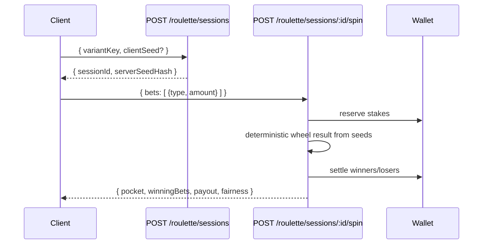

---

## 24. Dice API

`DiceController` (`@Controller('dice')`, tag **Dice Engine**) covers Sic Bo and other dice variants.

| Verb | Path | Auth | Body | Purpose |
| --- | --- | --- | --- | --- |
| GET | `/dice/variants` | Public | — | List variants |
| GET | `/dice/variants/:key` | Public | — | Resolve the ruleset |
| POST | `/dice/play` | Bearer | `StatelessRollDto` | Roll one self-contained round |
| POST | `/dice/verify-roll` | Public | `VerifyRollDto` | Reproduce a deterministic outcome |
| POST | `/dice/verify-fairness` | Public | `VerifyFairnessDto` | Verify a seed derivation |
| POST | `/dice/sessions` | Bearer | `CreateDiceSessionDto` | Start a session |
| GET | `/dice/sessions/:id` | Bearer | — | Get a session |
| POST | `/dice/sessions/:id/roll` | Bearer | `RollDto` | Roll and settle bets |
| GET | `/dice/sessions/:id/state` | Bearer | — | Restore saved state |
| POST | `/dice/sessions/:id/state` | Bearer | `SaveDiceStateDto` | Persist save state |
| GET | `/dice/sessions/:id/replay` | Bearer | — | List replays |
| POST | `/dice/sessions/:id/replay` | Bearer | `SaveDiceReplayDto` | Store a replay |
| GET | `/dice/sessions/:id/history` | Bearer | — | Roll history |
| GET | `/dice/sessions/:id/fairness` | Bearer | — | Fairness commitment |
| POST | `/dice/sessions/:id/end` | Bearer | — | End session, reveal seed |

`RollDto` wraps an array of `PlaceDiceBetDto` (`{ type, amount }`, e.g. `{ type: 'big', amount: '10' }`). Admin CRUD on `/admin/dice` uses `CreateDiceVariantDto` / `UpdateDiceVariantDto`. The dice engine is also exposed over WebSocket (`/dice` namespace, [§34](#34-websocket-apis)) for live rolls.

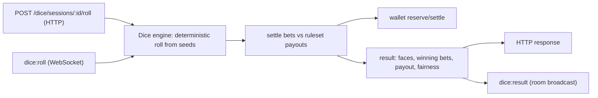

---

## 25. Crash API

`CrashController` (`@Controller('crash')`, tag **Crash Engine**) has the most distinctive lifecycle: a round *opens a cash-out window* while the crash point stays hidden, and the player races to cash out before the bust.

| Verb | Path | Auth | Body | Purpose |
| --- | --- | --- | --- | --- |
| GET | `/crash/variants` | Public | — | List variants |
| GET | `/crash/variants/:key` | Public | — | Resolve the ruleset |
| POST | `/crash/play` | Bearer | `StatelessPlayDto` | Play one round (auto cash-out only) |
| POST | `/crash/verify-crash` | Public | `VerifyCrashDto` | Reproduce a deterministic crash point |
| POST | `/crash/verify-fairness` | Public | `VerifyFairnessDto` | Verify a seed derivation |
| POST | `/crash/sessions` | Bearer | `CreateCrashSessionDto` | Start a session |
| GET | `/crash/sessions/:id` | Bearer | — | Get a session |
| POST | `/crash/sessions/:id/start` | Bearer | `StartRoundDto` | Begin a round (opens cash-out; crash point hidden) |
| POST | `/crash/sessions/:id/cashout` | Bearer | — | Cash out at the current multiplier |
| POST | `/crash/sessions/:id/resolve` | Bearer | — | Resolve the round (bust / auto cash-out) |
| GET | `/crash/sessions/:id/state` | Bearer | — | Restore saved state |
| POST | `/crash/sessions/:id/state` | Bearer | `SaveCrashStateDto` | Persist save state |
| GET | `/crash/sessions/:id/replay` | Bearer | — | List replays |
| POST | `/crash/sessions/:id/replay` | Bearer | `SaveCrashReplayDto` | Store a replay |
| GET | `/crash/sessions/:id/history` | Bearer | — | Round history |
| GET | `/crash/sessions/:id/fairness` | Bearer | — | Fairness commitment |
| POST | `/crash/sessions/:id/end` | Bearer | — | End session, reveal seed |

```mermaid
sequenceDiagram
    participant C as Client
    participant St as POST /crash/sessions/:id/start
    participant Co as POST /crash/sessions/:id/cashout
    participant Re as POST /crash/sessions/:id/resolve
    C->>St: { amount, autoCashout? }
    St-->>C: round open (crash point hidden), multiplier rising
    alt player cashes out in time
        C->>Co: cashout
        Co-->>C: win at current multiplier
    else rides to bust
        C->>Re: resolve
        Re-->>C: bust — stake lost (or auto-cashout hit)
    end
```

`StartRoundDto` / `CrashBetDto` carry a string `amount` and an optional numeric `autoCashout` multiplier. `StatelessPlayDto` (crash) additionally accepts `manualCashouts` (per-bet cash-out multipliers, `null` to ride to bust). Live play is available over the `/crash` WebSocket namespace with `crash:start` / `crash:cashout` events ([§34](#34-websocket-apis)). Admin CRUD on `/admin/crash` via `CreateCrashVariantDto` / `UpdateCrashVariantDto`.

---

## 26. Sports API

`SportsController` (`@Controller('sports')`, tag **Sports Betting**) exposes the sportsbook: catalog discovery (public), bet pricing and placement (authenticated), and bet history. `AdminSportsController` (`/admin/sports`) manages the fixtures, odds, and settlement.

### 26.1 Public catalog

| Verb | Path | Auth | Purpose |
| --- | --- | --- | --- |
| GET | `/sports/sports` | Public | List supported sports |
| GET | `/sports/market-templates` | Public | List market type templates |
| GET | `/sports/profiles` | Public | List betting rule profiles |
| GET | `/sports/competitions` | Public | List competitions (optionally by sport) |
| GET | `/sports/competitions/:key` | Public | Get a competition |
| GET | `/sports/matches` | Public | List matches (filter by competition/sport/status) |
| GET | `/sports/matches/live` | Public | List live matches |
| GET | `/sports/matches/upcoming` | Public | List upcoming matches |
| GET | `/sports/matches/:id` | Public | Match details with markets and odds |

### 26.2 Betting (authenticated)

| Verb | Path | Auth | Body | Purpose |
| --- | --- | --- | --- | --- |
| POST | `/sports/quote` | Bearer | `PlaceBetDto` | Price a bet slip without placing it |
| POST | `/sports/bets` | Bearer | `PlaceBetDto` | Place a bet slip |
| GET | `/sports/bets` | Bearer | — | List my bets (settles resolved ones) |
| GET | `/sports/bets/statistics` | Bearer | — | My betting statistics |

`PlaceBetDto` is the sportsbook's richest client DTO: a `type` (`single`/`accumulator`/`system`), a string `stake`, an optional `profile`, and a nested, validated array of `BetSelectionRefDto` (`{ matchId, marketId, selectionId }`). The `quote` endpoint runs the exact same pricing as `bets` but stops short of committing — so a client can show the potential return before the player confirms. See [ADR-017](#adr-017--quote-before-place-for-bet-slips).

### 26.3 Admin sportsbook management (`/admin/sports`)

| Verb | Path | Body | Purpose |
| --- | --- | --- | --- |
| GET | `/admin/sports/statistics` | — | Catalog statistics |
| GET | `/admin/sports/sports` | — | List all sports |
| POST | `/admin/sports/sports` | `UpsertSportDto` | Create/update a sport |
| DELETE | `/admin/sports/sports/:key` | — | Delete a custom sport |
| POST | `/admin/sports/competitions` | `UpsertCompetitionDto` | Create/update a competition |
| DELETE | `/admin/sports/competitions/:key` | — | Delete a competition |
| POST | `/admin/sports/matches` | `UpsertMatchDto` | Create/update a match (markets + odds) |
| PUT | `/admin/sports/matches/:id/status` | `MatchStatusDto` | Set match status |
| PUT | `/admin/sports/matches/:id/odds` | `UpdateOddsDto` | Update a selection price (live odds) |
| PUT | `/admin/sports/matches/:id/markets/:marketId/status` | `MarketStatusDto` | Suspend / open a market |
| POST | `/admin/sports/matches/:id/settle` | `SettleMatchDto` | Settle a match with its result feed |
| DELETE | `/admin/sports/matches/:id` | — | Delete a match |

```mermaid
sequenceDiagram
    participant A as Admin
    participant M as Match
    participant B as Bettors
    participant W as Wallet
    A->>M: POST /admin/sports/matches (scheduled)
    A->>M: PUT :id/status → live
    A->>M: PUT :id/odds (live price moves) → emits sports:odds
    B->>M: POST /sports/bets (stake reserved via wallet)
    A->>M: POST :id/settle { winners, lines?, voids? }
    M->>W: winning bets paid, losing stakes captured
    Note over B: GET /sports/bets settles the bettor's resolved slips
```

`UpdateOddsDto` enforces `odds ≥ 1.01` (`@Min(1.01)`), and match/market status transitions are constrained to their enums (`scheduled`/`live`/`paused`/`finished`/`settled`/`cancelled` for matches; `open`/`suspended`/`closed`/`settled` for markets). `SettleMatchDto` carries `winners` (marketId → winning selection ids), optional `lines` (realised handicap/total lines), and optional `voids` (forced-void selections). Live odds and match-status changes are pushed over the `/sports` WebSocket namespace ([§34](#34-websocket-apis)). See [GAME_ENGINE_SDK.md](./GAME_ENGINE_SDK.md) for the settlement engine.

---

## 27. Tournament API

`TournamentController` (`@Controller('tournaments')`, tag **Tournaments**) covers tournament discovery and participation; `AdminTournamentController` (`/admin/tournaments`) covers the full lifecycle plus the gamification surfaces (leaderboards, missions, achievements, rewards, seasons).

### 27.1 Player tournament endpoints

| Verb | Path | Auth | Body | Purpose |
| --- | --- | --- | --- | --- |
| GET | `/tournaments` | Public | — | List tournaments |
| GET | `/tournaments/:id` | Public | — | Detail (bracket, participants, standings) |
| POST | `/tournaments/:id/register` | Bearer | `RegisterTournamentDto` | Register (collects entry fee via wallet) |
| POST | `/tournaments/:id/checkin` | Bearer | — | Check in for a tournament |
| POST | `/tournaments/:id/withdraw` | Bearer | — | Withdraw from a tournament |

### 27.2 Tournament lifecycle (admin)

| Verb | Path | Body | Purpose |
| --- | --- | --- | --- |
| GET | `/admin/tournaments/statistics` | — | Tournament statistics |
| POST | `/admin/tournaments` | `CreateTournamentDto` | Create a tournament |
| PUT | `/admin/tournaments/:id` | `UpdateTournamentDto` | Edit a draft/scheduled tournament |
| POST | `/admin/tournaments/:id/open` | — | Open registration |
| POST | `/admin/tournaments/:id/start` | — | Seed, generate the bracket, go live |
| POST | `/admin/tournaments/:id/report` | `ReportMatchDto` | Report a result (advances the bracket) |
| POST | `/admin/tournaments/:id/complete` | — | Complete and distribute prizes |
| POST | `/admin/tournaments/:id/cancel` | — | Cancel (refunds entry fees) |

```mermaid
stateDiagram-v2
    [*] --> Draft: POST /admin/tournaments
    Draft --> Open: /open
    Open --> Live: /start (seed + bracket)
    Live --> Live: /report (advance bracket)
    Live --> Completed: /complete (prizes)
    Draft --> Cancelled: /cancel (refunds)
    Open --> Cancelled: /cancel (refunds)
    Completed --> [*]
    Cancelled --> [*]
```

`CreateTournamentDto` carries a `name`, a `format` (one of `single-elimination`, `double-elimination`, `swiss`, `round-robin`, `knockout`, `timed`, `leaderboard`), optional `registrationMode` (`open`/`invite`/`password`/`private`), `cadence` (`one-off`/`daily`/`weekly`/`monthly`/`season`), `capacity` (≥ 2), string `entryFee`, `currencyId`, `password`, an `invited` list, `allowLateJoin`, a data-driven `prize` config object, and `startsAt`. Registration collecting the entry fee ties the tournament domain to the wallet — a failed wallet reserve blocks registration. Bracket advances are pushed over the `/tournament` WebSocket namespace ([§34](#34-websocket-apis)). See [OPERATIONS_PLATFORM.md](./OPERATIONS_PLATFORM.md) and [WALLET_ENGINE.md](./WALLET_ENGINE.md).

---

## 28. Leaderboard API

Leaderboards are exposed on both the player and admin tournament controllers.

| Verb | Path | Auth | Body | Purpose |
| --- | --- | --- | --- | --- |
| GET | `/tournaments/leaderboards/list` | Public | — | List active leaderboards |
| GET | `/tournaments/leaderboards/:id/top` | Public | — | Top entries for a leaderboard |
| POST | `/admin/tournaments/leaderboards` | Admin | `CreateLeaderboardDto` | Create a leaderboard |
| POST | `/admin/tournaments/leaderboards/submit` | Admin | `SubmitScoreDto` | Submit/replace a score (admin/system feed) |

`CreateLeaderboardDto` carries a `name`, optional `metric`, optional `period` (`DAILY`/`WEEKLY`/`MONTHLY`/`SEASONAL`/`ALL_TIME`), and optional `gameId`. `SubmitScoreDto` is `{ leaderboardId, score }`. Scores are submitted by the admin/system feed rather than accepted from clients directly — this keeps leaderboards authoritative and cheat-resistant, consistent with the server-authoritative principle. The exact-percentile ranking machinery behind these boards is documented in [OPERATIONS_PLATFORM.md](./OPERATIONS_PLATFORM.md). Live leaderboard updates flow over the `/tournament` namespace (`tournament:leaderboard`).

```mermaid
flowchart LR
    FEED["Admin/system feed"] --> SUBMIT["POST /admin/tournaments/leaderboards/submit { leaderboardId, score }"]
    SUBMIT --> RANK["ranking recompute"]
    RANK --> READ["GET /tournaments/leaderboards/:id/top (public)"]
    RANK --> PUSH["tournament:leaderboard (WebSocket feed)"]
```

---

## 29. Rewards API

Rewards, missions, achievements, and seasons form the gamification layer, split between player reads and admin writes.

### 29.1 Player gamification (`/tournaments/me/*`, `/tournaments/rewards/*`)

| Verb | Path | Auth | Body | Purpose |
| --- | --- | --- | --- | --- |
| GET | `/tournaments/me/missions` | Bearer | — | My missions, XP and level |
| GET | `/tournaments/me/achievements` | Bearer | — | My achievements |
| GET | `/tournaments/me/rewards` | Bearer | — | My reward claims |
| POST | `/tournaments/me/rewards/:claimId/claim` | Bearer | `ClaimRewardDto` | Claim a pending reward |
| GET | `/tournaments/rewards/catalog` | Public | — | Reward catalog |
| GET | `/tournaments/seasons/list` | Public | — | List seasons |
| GET | `/tournaments/seasons/current` | Public | — | Current season |

### 29.2 Admin gamification (`/admin/tournaments/*`)

| Verb | Path | Body | Purpose |
| --- | --- | --- | --- |
| GET | `/admin/tournaments/missions` | — | List mission definitions |
| POST | `/admin/tournaments/missions` | `MissionDto` | Create or update a mission |
| POST | `/admin/tournaments/achievements` | `CreateAchievementDto` | Create an achievement |
| POST | `/admin/tournaments/rewards` | `CreateRewardDto` | Create a reward |
| POST | `/admin/tournaments/rewards/grant` | — | Grant a reward to a user |
| POST | `/admin/tournaments/seasons` | `SeasonDto` | Create or update a season |

`MissionDto` carries a kebab-case `id`, `name`, a `window` (`daily`/`weekly`/`monthly`/`season`/`permanent`), a `metric`, a `target` (≥ 1), `xp` (≥ 0), and optional `rewardSlugs`. `CreateRewardDto` typed a reward as one of `CASH`/`BONUS`/`FREE_SPINS`/`CASHBACK`/`POINTS`/`BADGE`/`PHYSICAL`. `ClaimRewardDto` optionally carries the `currencyId` into which a monetary reward is paid — tying reward claims back to the wallet. This is the same reward/mission model the frontend's rewards surface consumes (see [FRONTEND_ARCHITECTURE.md](./FRONTEND_ARCHITECTURE.md)).

```mermaid
flowchart TD
    DEF["Admin defines mission (POST /admin/tournaments/missions)"] --> PROG["player activity advances metric toward target"]
    PROG --> DONE{"target reached?"}
    DONE -->|yes| XP["award XP + grant rewardSlugs"]
    XP --> PEND["reward appears in GET /tournaments/me/rewards (pending)"]
    PEND --> CLAIM["POST /tournaments/me/rewards/:claimId/claim { currencyId? }"]
    CLAIM --> WALLET["monetary rewards credited to wallet"]
```

---

## 30. AI API

`AiController` (`@Controller('ai')`, tag **AI**) is the player-facing AI surface — personalization, recommendations, and natural-language search. `AdminAiController` (`/admin/ai`) is the operator-facing assistant and risk tooling. The AI is rule-based and deterministic, as [AI_PLATFORM.md](./AI_PLATFORM.md) explains; these endpoints are its HTTP face.

### 30.1 Player AI (`/ai`)

| Verb | Path | Auth | Body | Purpose |
| --- | --- | --- | --- | --- |
| GET | `/ai/for-you` | Bearer | — | Personalized home payload (recommended, trending, continue) |
| GET | `/ai/recommended` | Bearer | — | Recommended games |
| GET | `/ai/recently-played` | Bearer | — | Recently played games |
| GET | `/ai/continue-playing` | Bearer | — | Continue playing (open sessions) |
| GET | `/ai/trending` | Public | — | Trending games |
| GET | `/ai/similar/:gameId` | Public | — | Games similar to a given game |
| GET | `/ai/recommended-tournaments` | Bearer | — | Recommended tournaments |
| POST | `/ai/search` | Bearer | `SearchDto` | Natural-language smart search |
| GET | `/ai/search/games` | Public | — | Quick catalog search |

### 30.2 Admin AI (`/admin/ai`)

| Verb | Path | Body | Purpose |
| --- | --- | --- | --- |
| POST | `/admin/ai/ask` | `AskDto` | Ask the admin AI assistant (grounded in live data) |
| GET | `/admin/ai/insights/revenue` | — | Explain revenue |
| GET | `/admin/ai/insights/tournaments` | — | Tournament insights |
| GET | `/admin/ai/insights/wallet` | — | Wallet insights |
| GET | `/admin/ai/insights/alerts` | — | Alert / incident summary |
| GET | `/admin/ai/insights/player/:userId` | — | Player insights (segment, churn, risk) |
| POST | `/admin/ai/report` | — | Generate the daily operations report |
| GET | `/admin/ai/fraud/scan` | — | Scan recently-active accounts for fraud |
| GET | `/admin/ai/fraud/:userId` | — | Fraud assessment for an account |
| GET | `/admin/ai/risk/:userId` | — | Full player risk profile (risk, RG, segment, churn) |

```mermaid
flowchart TD
    Q["POST /ai/search { query }"] --> PARSE["parseQuery (NL → structured intent)"]
    PARSE --> ROUTE{"intent"}
    ROUTE -->|games| GREC["content-based game match"]
    ROUTE -->|tournaments| TREC["tournament match"]
    ROUTE -->|players| PREC["player lookup (admin)"]
    GREC --> RESP["ranked results"]
    TREC --> RESP
    PREC --> RESP
```

`SearchDto` requires a `query` (≥ 2 chars). `AskDto` carries a `question` (≥ 2 chars) and optional `userId` for player-specific questions. The admin AI is **grounded**: it narrates real, live platform data (revenue, wallet, alerts) rather than inventing figures — the grounding contract is tested (see [TESTING_GUIDE.md](./TESTING_GUIDE.md) §11) and detailed in [AI_PLATFORM.md](./AI_PLATFORM.md). The fraud/risk endpoints return explainable outputs carrying their evidence. See [ADR-018](#adr-018--ai-endpoints-are-grounded-and-explainable).

---

## 31. Operations API

The operations surface has two controllers in one file: an admin-guarded `/admin/operations` console feed and a `@Public()` `/operations/status` for external status pages. This is the HTTP face of [OPERATIONS_PLATFORM.md](./OPERATIONS_PLATFORM.md).

| Verb | Path | Auth | Body | Purpose |
| --- | --- | --- | --- | --- |
| GET | `/admin/operations/overview` | Admin | — | Overview (health, system, API, queue, alerts) |
| GET | `/admin/operations/health` | Admin | — | Deep health with dependency graph |
| GET | `/admin/operations/metrics` | Admin | — | Metrics snapshot (counters, gauges, histograms) |
| GET | `/admin/operations/metrics/prometheus` | Admin | — | Prometheus exposition text |
| GET | `/admin/operations/system` | Admin | — | Live system metrics (memory, CPU, event loop) |
| GET | `/admin/operations/logs` | Admin | `LogQueryDto` | Recent structured logs (filterable) |
| GET | `/admin/operations/queue` | Admin | — | Background job / queue statistics |
| POST | `/admin/operations/queue/:jobId/retry` | Admin | — | Requeue a dead-letter job |
| GET | `/admin/operations/circuits` | Admin | — | Circuit breaker states |
| GET | `/admin/operations/alerts` | Admin | — | Alert rules |
| GET | `/admin/operations/alerts/active` | Admin | — | Active (firing) incidents |
| POST | `/admin/operations/alerts` | Admin | `UpsertAlertRuleDto` | Create or update an alert rule |
| GET | `/operations/status` | **Public** | — | Public service status (up/degraded/down) |

`UpsertAlertRuleDto` defines an alert rule: a kebab-case `id`, `name`, `metric`, a `comparator` (`>`/`>=`/`<`/`<=`/`==`), a numeric `threshold`, a `forSeconds` sustain window, a `severity` (`info`/`warning`/`critical`), an `enabled` flag, and an optional `description`. The `forSeconds` field is the anti-flapping sustain window described in [OPERATIONS_PLATFORM.md](./OPERATIONS_PLATFORM.md) §9 and tested in [TESTING_GUIDE.md](./TESTING_GUIDE.md) §12.3. `LogQueryDto` filters by `level` (`info`/`warn`/`error`), `search`, and `limit`. The Prometheus endpoint returns raw exposition text (not the JSON envelope) for scrape compatibility — a deliberate exception to the uniform-envelope rule. The `/operations/status` endpoint is public so external status pages and uptime monitors can read platform health without credentials. Operations metrics also stream over the `/operations` WebSocket namespace ([§34](#34-websocket-apis)).

---

## 32. Administration API

The admin surface is deliberately fragmented into many small, single-responsibility controllers rather than one monolith, each tagged distinctly for Swagger. Every admin controller is `@Roles(UserRole.ADMIN)` at the class level.

### 32.1 Core admin controllers

| Controller | Base route | Key endpoints |
| --- | --- | --- |
| `AdminController` | `/admin` | `GET /admin/overview` — runtime system overview |
| `AdminUsersController` | `/admin/users` | list, get, lock, unlock, verify, assign/remove role, sessions, security-events |
| `AdminRolesController` | `/admin` | `GET/POST /admin/roles`, `PUT /admin/roles/:id/permissions`, `GET /admin/permissions` |
| `AdminAuditController` | `/admin/audit` | `GET /admin/audit` — browse the audit trail (paginated, filterable) |
| `AnalyticsController` | `/analytics` | `GET /analytics/summary` — dashboard metrics for a date range |

### 32.2 Admin user management (`/admin/users`)

| Verb | Path | Body | Purpose |
| --- | --- | --- | --- |
| GET | `/admin/users` | pagination + `search` | List users |
| GET | `/admin/users/:id` | — | Get a user with roles + counts |
| POST | `/admin/users/:id/lock` | `LockUserDto` | Suspend (lock) an account |
| POST | `/admin/users/:id/unlock` | — | Unlock / reactivate |
| POST | `/admin/users/:id/verify` | — | Manually verify email |
| POST | `/admin/users/:id/roles` | `AssignRoleDto` | Assign a role |
| DELETE | `/admin/users/:id/roles/:roleId` | — | Remove a role |
| GET | `/admin/users/:id/sessions` | — | List a user's active sessions |
| DELETE | `/admin/users/:id/sessions` | — | Revoke all sessions for a user |
| GET | `/admin/users/:id/security-events` | — | List a user's security events |

### 32.3 Roles & permissions (`/admin`)

| Verb | Path | Body | Purpose |
| --- | --- | --- | --- |
| GET | `/admin/roles` | — | List all roles with permissions |
| POST | `/admin/roles` | `CreateRoleDto` | Create a custom role |
| PUT | `/admin/roles/:id/permissions` | `SetRolePermissionsDto` | Replace a role's permission set |
| GET | `/admin/permissions` | — | List all available permissions |

```mermaid
flowchart LR
    subgraph "RBAC administration"
      PERMS["GET /admin/permissions (catalog)"] --> ROLE["POST /admin/roles { name, level, permissionIds }"]
      ROLE --> ASSIGN["POST /admin/users/:id/roles { roleId }"]
      ASSIGN --> USER["user gains role's permissions"]
      USER --> ENFORCE["PermissionsGuard enforces on every request"]
    end
```

`CreateRoleDto` carries a `name`, an optional privilege `level` (0–100), and optional `permissionIds` (UUIDs). `SetRolePermissionsDto` replaces the whole permission set (`permissionIds`, UUIDs). `AssignRoleDto` is `{ roleId }` (UUID). `LockUserDto` carries an optional `reason` recorded in the security log. This RBAC surface feeds the `PermissionsGuard` described in [§8](#8-authorization) and the security model in [SECURITY_GUIDE.md](./SECURITY_GUIDE.md). See [ADR-007](#adr-007--separate-admin-controllers-and-tags).

---

## 33. Notification API

`NotificationsController` (`@Controller('notifications')`, tag **Notifications**) is the REST face of the notification system; the push face is the `/realtime` WebSocket namespace ([§34](#34-websocket-apis)).

| Verb | Path | Auth | Query | Purpose |
| --- | --- | --- | --- | --- |
| GET | `/notifications` | Bearer | `PaginationQueryDto` | List the user's notifications (paginated) |
| PATCH | `/notifications/:id/read` | Bearer | — | Mark a notification as read |

```mermaid
sequenceDiagram
    participant SVC as Any backend service
    participant G as NotificationsGateway (/realtime)
    participant DB as Notification store
    participant C as Client
    SVC->>DB: persist notification
    SVC->>G: emitToUser(userId, event, payload)
    G-->>C: push over /realtime (if connected)
    C->>C: GET /notifications (on load / reconnect) — catches up
    C->>C: PATCH /notifications/:id/read
```

The pattern is **push + pull**: real-time delivery over WebSocket when the client is connected, and a paginated REST backlog for catch-up on load or reconnect. A client is never dependent on being connected at the moment a notification is created — the REST list is the durable source of truth, the socket is the low-latency accelerator. See [ADR-019](#adr-019--notifications-are-push-plus-pull).

---

## 34. WebSocket APIs

Real-time transport is **Socket.IO**, exposed as nine namespaces. Each namespace corresponds to a domain that needs server-push. All namespaces share the same CORS options (`wsCorsOptions`) and the same connection convention: a client authenticates on connect (JWT), receives a `<domain>:connected` acknowledgement, and then exchanges domain events. All namespaces implement a `<domain>:heartbeat` → `<domain>:heartbeat:ack` round-trip carrying `{ clientTs, serverTs }` for latency measurement and liveness.

```mermaid
flowchart TD
    subgraph "Socket.IO server (same origin, /api base)"
      RT["/runtime"]
      CRASH["/crash"]
      DICE["/dice"]
      ROU["/roulette"]
      SPORTS["/sports"]
      TOUR["/tournament"]
      WALLET["/wallet"]
      REALTIME["/realtime (notifications)"]
      OPS["/operations"]
    end
    CLIENT["Client (Socket.IO)"] -->|handshake + JWT| RT
    CLIENT --> CRASH
    CLIENT --> DICE
    CLIENT --> ROU
    CLIENT --> SPORTS
    CLIENT --> TOUR
    CLIENT --> WALLET
    CLIENT --> REALTIME
    ADMINCLIENT["Admin console"] --> OPS
```

### 34.1 Namespace catalog

| Namespace | Gateway | Auth on connect | Room model | Purpose |
| --- | --- | --- | --- | --- |
| `/runtime` | `RuntimeGateway` | JWT | per runtime session | Live runtime events + actions |
| `/crash` | `CrashGateway` | JWT | per session (`room(sessionId)`) | Live crash rounds |
| `/dice` | `DiceGateway` | JWT | per session | Live dice rolls |
| `/roulette` | `RouletteGateway` | JWT | per session | Live roulette spins |
| `/sports` | `SportsGateway` | optional (public feed) | per match + global feed | Live odds + match status |
| `/tournament` | `TournamentGateway` | optional | per tournament + feed | Bracket / leaderboard updates |
| `/wallet` | `WalletGateway` | JWT | per user (`userRoom`) | Balance / transaction / settlement push |
| `/realtime` | `NotificationsGateway` | JWT | per user | Notification push |
| `/operations` | `OperationsGateway` | JWT (admin) | single ops room | Metrics + alerts stream |

### 34.2 The connection handshake

```mermaid
sequenceDiagram
    participant C as Client
    participant NS as Namespace gateway
    participant J as JWT verify
    C->>NS: connect (token in handshake)
    NS->>J: verify token
    alt valid
        J-->>NS: payload { sub: userId }
        NS-->>C: <domain>:connected { userId }
        Note over C,NS: client may join rooms (join/watch events)
    else invalid (JWT-required namespaces)
        NS-->>C: disconnect
    else optional-auth namespace (sports/tournament)
        NS-->>C: <domain>:connected { userId: null }
        Note over C: still receives public feed
    end
```

Game and wallet namespaces require a valid JWT and disconnect unauthenticated sockets. The `/sports` and `/tournament` namespaces allow **optional** auth — an anonymous socket still receives the public live feed (odds, match status, bracket updates) with `userId: null`, because that data is public. This mirrors the REST split where sports/tournament catalog reads are `@Public()`.

### 34.3 Per-namespace event reference

**`/runtime`** — client emits `runtime:join { runtimeSessionId }`, `runtime:action { runtimeSessionId, type, payload? }`, `runtime:leave`, `runtime:heartbeat`. Server emits `runtime:connected`, `runtime:state`, `runtime:event` (broadcast to the session room), `runtime:heartbeat:ack`.

**`/crash`** — client emits `crash:join { sessionId }`, `crash:start { sessionId, amount, autoCashout? }`, `crash:cashout { sessionId }`, `crash:leave`, `crash:heartbeat`. Server emits `crash:connected`, `crash:state`, `crash:started` (room), `crash:result` (room), `crash:error`, `crash:heartbeat:ack`.

**`/dice`** — client emits `dice:join`, `dice:roll { sessionId, bets }`, `dice:leave`, `dice:heartbeat`. Server emits `dice:connected`, `dice:state`, `dice:result` (room), `dice:error`, `dice:heartbeat:ack`.

**`/roulette`** — client emits `roulette:join`, `roulette:spin { sessionId, bets }`, `roulette:leave`, `roulette:heartbeat`. Server emits `roulette:connected`, `roulette:state`, `roulette:result` (room), `roulette:error`, `roulette:heartbeat:ack`.

**`/sports`** — client emits `sports:watch { matchId }`, `sports:unwatch { matchId }`, `sports:heartbeat`. Server emits `sports:connected`, `sports:match` (per-match room), `sports:feed` (global), `sports:odds { matchId, marketId, selectionId, odds }`, `sports:heartbeat:ack`.

**`/tournament`** — client emits `tournament:watch { id }`, `tournament:unwatch { id }`. Server emits `tournament:connected`, `tournament:update` (room), `tournament:feed` (global), `tournament:bracket { id, bracket }`, `tournament:leaderboard { leaderboardId, entries }`.

**`/wallet`** — client emits `wallet:heartbeat`. Server emits `wallet:connected`, `wallet:balances` (user room), `wallet:transaction` (user room), `wallet:settlement` (user room), `wallet:heartbeat:ack`.

**`/realtime`** — server emits notification events to the user's room (`emitToUser`). This is the push channel behind [§33](#33-notification-api).

**`/operations`** — client emits `operations:heartbeat`. Server emits `operations:connected`, `operations:overview` (ops room), `operations:alert` (ops room), `operations:heartbeat:ack`.

```mermaid
sequenceDiagram
    participant C as Client
    participant G as CrashGateway (/crash)
    participant E as Crash engine
    participant W as Wallet
    C->>G: crash:join { sessionId }
    G-->>C: crash:state (current session)
    C->>G: crash:start { sessionId, amount, autoCashout }
    G->>W: reserve stake
    G->>E: begin round
    G-->>C: crash:started (room broadcast)
    Note over E: multiplier rising, crash point hidden
    C->>G: crash:cashout { sessionId }
    G->>E: settle at current multiplier
    G->>W: credit winnings
    G-->>C: crash:result (room broadcast)
```

### 34.4 Room model & isolation

Rooms are how the gateways target emits. Game namespaces use a per-session room (`room(sessionId)`) so a `crash:result` reaches exactly the sockets watching that session. The wallet and notifications namespaces use a per-user room (`userRoom(userId)`) so balance and notification pushes reach only their owner. Sports/tournament use per-entity rooms (`matchRoom`, tournament `room`) plus a shared global feed room (`SPORTS_FEED`, tournament `FEED`) for broadcast-to-all-watchers events. Operations uses a single shared room. This room discipline is what keeps one user's financial events from leaking to another's socket. See [ADR-020](#adr-020--per-user-and-per-session-socket-rooms).

---

## 35. Event Catalog

This is the exhaustive catalog of every socket event across all nine namespaces, grouped by direction.

### 35.1 Client → Server events

| Namespace | Event | Payload | Effect |
| --- | --- | --- | --- |
| `/runtime` | `runtime:join` | `{ runtimeSessionId }` | Join session room, stream events |
| `/runtime` | `runtime:action` | `{ runtimeSessionId, type, payload? }` | Apply server-authoritative action |
| `/runtime` | `runtime:leave` | `{ runtimeSessionId }` | Leave session room |
| `/runtime` | `runtime:heartbeat` | `{ ts }` | Liveness/latency |
| `/crash` | `crash:join` | `{ sessionId }` | Join session, get state |
| `/crash` | `crash:start` | `{ sessionId, amount, autoCashout? }` | Begin a round |
| `/crash` | `crash:cashout` | `{ sessionId }` | Cash out current round |
| `/crash` | `crash:leave` | `{ sessionId }` | Leave session |
| `/crash` | `crash:heartbeat` | `{ ts }` | Liveness/latency |
| `/dice` | `dice:join` | `{ sessionId }` | Join session |
| `/dice` | `dice:roll` | `{ sessionId, bets }` | Roll + settle |
| `/dice` | `dice:leave` | `{ sessionId }` | Leave session |
| `/dice` | `dice:heartbeat` | `{ ts }` | Liveness/latency |
| `/roulette` | `roulette:join` | `{ sessionId }` | Join session |
| `/roulette` | `roulette:spin` | `{ sessionId, bets }` | Spin + settle |
| `/roulette` | `roulette:leave` | `{ sessionId }` | Leave session |
| `/roulette` | `roulette:heartbeat` | `{ ts }` | Liveness/latency |
| `/sports` | `sports:watch` | `{ matchId }` | Join match room |
| `/sports` | `sports:unwatch` | `{ matchId }` | Leave match room |
| `/sports` | `sports:heartbeat` | `{ ts }` | Liveness/latency |
| `/tournament` | `tournament:watch` | `{ id }` | Join tournament room |
| `/tournament` | `tournament:unwatch` | `{ id }` | Leave tournament room |
| `/wallet` | `wallet:heartbeat` | `{ ts }` | Liveness/latency |
| `/operations` | `operations:heartbeat` | `{ ts }` | Liveness/latency |

### 35.2 Server → Client events

| Namespace | Event | Payload | Trigger |
| --- | --- | --- | --- |
| `/runtime` | `runtime:connected` | `{ userId }` | On authenticated connect |
| `/runtime` | `runtime:state` | session state | On join |
| `/runtime` | `runtime:event` | engine event | Runtime emits (room) |
| `/runtime` | `runtime:heartbeat:ack` | `{ clientTs, serverTs }` | On heartbeat |
| `/crash` | `crash:connected` | `{ userId }` | Connect |
| `/crash` | `crash:state` | session state | On join |
| `/crash` | `crash:started` | round start | On start (room) |
| `/crash` | `crash:result` | round result | On cashout/resolve (room) |
| `/crash` | `crash:error` | `{ message }` | On error |
| `/crash` | `crash:heartbeat:ack` | `{ clientTs, serverTs }` | On heartbeat |
| `/dice` | `dice:connected` | `{ userId }` | Connect |
| `/dice` | `dice:state` | session state | On join |
| `/dice` | `dice:result` | roll result | On roll (room) |
| `/dice` | `dice:error` | `{ message }` | On error |
| `/dice` | `dice:heartbeat:ack` | `{ clientTs, serverTs }` | On heartbeat |
| `/roulette` | `roulette:connected` | `{ userId }` | Connect |
| `/roulette` | `roulette:state` | session state | On join |
| `/roulette` | `roulette:result` | spin result | On spin (room) |
| `/roulette` | `roulette:error` | `{ message }` | On error |
| `/roulette` | `roulette:heartbeat:ack` | `{ clientTs, serverTs }` | On heartbeat |
| `/sports` | `sports:connected` | `{ userId }` | Connect |
| `/sports` | `sports:match` | match payload | Match update (room) |
| `/sports` | `sports:feed` | `{ matchId, status }` | Global feed |
| `/sports` | `sports:odds` | `{ matchId, marketId, selectionId, odds }` | Odds change (room) |
| `/sports` | `sports:heartbeat:ack` | `{ clientTs, serverTs }` | On heartbeat |
| `/tournament` | `tournament:connected` | `{ userId }` | Connect |
| `/tournament` | `tournament:update` | payload | Tournament update (room) |
| `/tournament` | `tournament:feed` | `{ id, ... }` | Global feed |
| `/tournament` | `tournament:bracket` | `{ id, bracket }` | Bracket advance (room) |
| `/tournament` | `tournament:leaderboard` | `{ leaderboardId, entries }` | Leaderboard update (feed) |
| `/wallet` | `wallet:connected` | `{ userId }` | Connect |
| `/wallet` | `wallet:balances` | balances | Balance change (user room) |
| `/wallet` | `wallet:transaction` | transaction | New transaction (user room) |
| `/wallet` | `wallet:settlement` | settlement | Bet settlement (user room) |
| `/wallet` | `wallet:heartbeat:ack` | `{ clientTs, serverTs }` | On heartbeat |
| `/operations` | `operations:connected` | `{ userId }` | Connect |
| `/operations` | `operations:overview` | overview | Periodic push (ops room) |
| `/operations` | `operations:alert` | alert payload | Alert fires (ops room) |
| `/operations` | `operations:heartbeat:ack` | `{ clientTs, serverTs }` | On heartbeat |

The shared constant `WS_EVENTS` (`packages/shared`) also defines canonical names for the connection lifecycle (`connection`, `disconnect`) and cross-cutting events (`notification`, `wallet:update`, `transaction:update`) used by the realtime layer.

---

## 36. DTO Catalog

This catalog enumerates every request/response DTO by module. Field-level rules were given in the domain sections; this is the consolidated index. Every DTO is a `class-validator`-decorated class; the global `ValidationPipe` enforces it.

### 36.1 Cross-cutting DTOs

| DTO | Module | Key fields |
| --- | --- | --- |
| `PaginationQueryDto` | common | `page`, `limit` (1–100), `sortBy`, `sortOrder`, `search` |
| `ApiResponse<T>` (response) | types | `success`, `statusCode`, `message`, `data`, `timestamp`, `path`, `requestId` |
| `ApiErrorResponse` (response) | types | `success:false`, `statusCode`, `message`, `error`, `errors[]`, `timestamp`, `path`, `requestId` |
| `ApiFieldError` (response) | types | `field`, `message`, `code?` |
| `PaginatedResult<T>` (response) | types | `items[]`, `meta` |
| `PaginationMeta` (response) | types | `page`, `limit`, `total`, `totalPages`, `hasNextPage`, `hasPreviousPage` |
| `HealthCheckResult` (response) | types | `status`, `info`, `error`, `details`, `uptime`, `version`, `timestamp` |

### 36.2 Auth & account DTOs

| DTO | Fields |
| --- | --- |
| `LoginDto` | `email`, `password`, `rememberMe?` |
| `RegisterDto` | `email`, `username` (3–24, pattern), `password` (8–128, policy) |
| `VerifyEmailDto` | `token` |
| `ForgotPasswordDto` | `email` |
| `ResetPasswordDto` | `token`, `password` (policy) |
| `ChangePasswordDto` | `currentPassword`, `newPassword` (policy) |
| `RefreshDto` | `refreshToken?` (JWT) |
| `PasswordStrengthDto` | `password` |
| `VerifyTwoFactorLoginDto` | `challengeToken`, `code` |
| `TwoFactorCodeDto` | `code` |
| `CreateApiKeyDto` | `name` (2–60), `scopes?`, `expiresInDays?` (1–3650) |
| `TrustDeviceDto` | `trusted` |
| `AuthTokensDto` (response) | `accessToken`, `refreshToken`, `tokenType`, `expiresIn` |
| `UpdateProfileDto` | `displayName?` (≤60), `avatarUrl?` (URL) |

### 36.3 Wallet DTOs

| DTO | Fields |
| --- | --- |
| `TransferDto` | `currencyId`, `fromType`, `toType` (in `WALLET_TYPES`), `amount` (decimal string), `idempotencyKey?` |
| `TransactionQueryDto` | `page?`, `limit?`, `type?`, `status?` |
| `GrantBonusDto` | `currencyId`, `amount`, `wageringRequirement?` |
| `RewardPointsDto` | `points` |
| `AdminAdjustDto` | `userId`, `currencyId`, `amount`, `reason?`, `idempotencyKey?` |
| `WalletStatusDto` | `walletId` |
| `RollbackDto` | `transactionId`, `idempotencyKey?` |

### 36.4 Game engine DTOs

| DTO | Module | Fields |
| --- | --- | --- |
| `StatelessPlayDto` (card) | card | `variantKey`, `bets[]`, `clientSeed?` |
| `PlayRoundDto` / `PlaceBetDto` | card | `bets[]` / `{ type, amount }` |
| `CreateCardSessionDto` | card | `variantKey`, `gameId?`, `clientSeed?`, `mode?` |
| `SaveCardStateDto` / `SaveCardReplayDto` | card | state+version / seed+frames+durationMs |
| `VerifyShuffleDto` | card | `seed`, count?, offset? |
| `SpinDto` / `PlaceRouletteBetDto` | roulette | `bets[]` |
| `StatelessSpinDto` | roulette | `variantKey`, `bets[]`, `clientSeed?` |
| `RollDto` / `PlaceDiceBetDto` | dice | `bets[]` / `{ type, amount }` |
| `StatelessRollDto` | dice | `variantKey`, `bets[]`, `clientSeed?` |
| `StartRoundDto` / `CrashBetDto` | crash | `amount`, `autoCashout?` |
| `StatelessPlayDto` (crash) | crash | `variantKey`, `bets[]`, `manualCashouts?`, `clientSeed?` |
| `Create*SessionDto` | each | `variantKey`, `gameId?`, `clientSeed?`, `mode?` |
| `Verify*Dto` | each | `variantKey`, `seed` |
| `VerifyFairnessDto` | each | `serverSeed`, `serverSeedHash`, `clientSeed`, `nonce`, `expectedSeed` |
| `Create*VariantDto` / `Update*VariantDto` | each admin | `key`, `name`, `rules` (object) |
| `CreateRuntimeSessionDto` | runtime | `pluginKey`, `gameId?`, `clientSeed?`, `mode?`, `locale?` |
| `RuntimeActionDto` | runtime | `type`, `payload?` |
| `SaveStateDto` / `SaveReplayDto` | runtime | state+version / seed+frames+durationMs |

### 36.5 Sports, tournament, AI, operations, admin DTOs

| DTO | Module | Fields |
| --- | --- | --- |
| `PlaceBetDto` / `BetSelectionRefDto` | sports | `type`, `stake`, `profile?`, `selections[]` / `{matchId, marketId, selectionId}` |
| `UpsertSportDto` | sports | `key`, `name`, `category`, `hasDraw`, `participantNoun`, `marketTypes[]` |
| `UpsertCompetitionDto` | sports | `key`, `sportKey`, `name`, `region`, `season?`, `tournament?` |
| `UpsertMatchDto` | sports | `id`, `competitionKey`, `sportKey`, `name`, `startTime`, `status`, `participants[]`, `markets[]` |
| `MatchStatusDto` / `MarketStatusDto` | sports | `status` (enum) |
| `UpdateOddsDto` | sports | `marketId`, `selectionId`, `odds` (≥1.01) |
| `SettleMatchDto` | sports | `winners`, `lines?`, `voids?` |
| `CreateTournamentDto` | tournament | `name`, `format`, …, `prize`, `startsAt` |
| `UpdateTournamentDto` | tournament | `name?`, `description?`, `entryFee?`, `prize?`, `startsAt?` |
| `RegisterTournamentDto` | tournament | `password?` |
| `ReportMatchDto` | tournament | `matchId`, `winnerParticipantId`, `scoreA?`, `scoreB?` |
| `SubmitScoreDto` / `CreateLeaderboardDto` | tournament | `leaderboardId`, `score` / `name`, `metric?`, `period?`, `gameId?` |
| `MissionDto` | tournament | `id`, `name`, `window`, `metric`, `target`, `xp`, `rewardSlugs?` |
| `CreateAchievementDto` / `CreateRewardDto` / `ClaimRewardDto` | tournament | achievement/reward/claim configs |
| `SeasonDto` | tournament | `id`, `name`, `startsAt`, `endsAt`, `active`, `rankPoints?` |
| `SearchDto` / `AskDto` | ai | `query` / `question`, `userId?` |
| `UpsertAlertRuleDto` | operations | `id`, `name`, `metric`, `comparator`, `threshold`, `forSeconds`, `severity`, `enabled`, `description?` |
| `LogQueryDto` | operations | `level?`, `search?`, `limit?` |
| `AssignRoleDto` / `CreateRoleDto` / `SetRolePermissionsDto` / `LockUserDto` | admin | RBAC + moderation configs |
| `CreateGameDto` / `UpdateGameDto` / `SetStatusDto` / `SetVisibilityDto` / `SetFlagsDto` / `SetTrendingDto` / `SetMaintenanceDto` / `ScheduleDto` / `ReorderDto` / `AddVersionDto` / `CreateAssetDto` | games-admin | catalog CMS DTOs |
| `CreateCategoryDto` / `CreateProviderDto` / `CreateCollectionDto` / `SetCollectionGamesDto` / `CreateLauncherDto` (+ `Update*`) | games-admin | catalog structure DTOs |
| `RateGameDto` / `ReviewGameDto` | games | `rating` (1–5) / `rating?`, `title?`, `body` (3–2000) |

---

## 37. Error Code Catalog

The platform's error surface has two layers: **HTTP status codes** (from Nest exceptions) and **domain error codes** (`AppErrorCode`), both normalized into the `error` field by the `AllExceptionsFilter` ([§10](#10-error-handling)).

### 37.1 Domain error codes (`AppErrorCode`)

| Code | Typical status | Meaning | Example trigger |
| --- | --- | --- | --- |
| `VALIDATION_ERROR` | 400 | Input failed a domain rule | Invalid state transition |
| `UNAUTHORIZED` | 401 | Missing/invalid credentials | Expired access token |
| `FORBIDDEN` | 403 | Authenticated but not permitted | Non-admin hits admin route |
| `NOT_FOUND` | 404 | Resource does not exist | Unknown session id |
| `CONFLICT` | 409 | State conflict | Duplicate registration |
| `RATE_LIMITED` | 429 | Too many requests | Throttle exceeded |
| `INSUFFICIENT_FUNDS` | 402/400 | Wallet lacks balance | Bet exceeds available |
| `INTERNAL_ERROR` | 500 | Unexpected server failure | Unhandled exception |

`AppError` carries a `code`, `statusCode`, `message`, and optional `details`; the filter maps `statusCode` to the HTTP status and `code` to the `error` field, so a client can branch on a stable machine label (e.g. `INSUFFICIENT_FUNDS`) regardless of the HTTP status.

### 37.2 HTTP status codes in use

| Status | Where it appears |
| --- | --- |
| 200 OK | Reads, and explicit `@HttpCode(200)` on `login`/`refresh`/`logout` |
| 201 Created | Default for `POST` handlers that create resources |
| 204 No Content | Deletes / acknowledgements returning nothing |
| 400 Bad Request | Validation failures (`ValidationPipe`), bad domain input |
| 401 Unauthorized | `JwtAuthGuard` rejection, missing/invalid API key |
| 403 Forbidden | `RolesGuard` / `PermissionsGuard` rejection |
| 404 Not Found | Unknown resource id/slug |
| 409 Conflict | Duplicate/conflicting state |
| 422 / 400 | Domain validation errors surfaced via `AppError` |
| 429 Too Many Requests | `ThrottlerGuard` |
| 500 Internal Server Error | Normalized unknown throws |

### 37.3 Validation error shape

A validation failure produces a `400` with the first message as `message` and each field message as an `ApiFieldError` in `errors`. Because the pipe runs with `forbidNonWhitelisted`, an *unknown* property also yields a `400` with a message naming the offending property — so integrators get precise feedback on both malformed and extraneous fields. See [§14](#14-validation-rules).

---

## 38. OpenAPI / Swagger

The API self-documents through OpenAPI (Swagger), configured in `swagger.ts` and mounted in `main.ts` when `SWAGGER_ENABLED` is set.

```mermaid
flowchart TD
    DECOS["@ApiTags / @ApiOperation / @ApiProperty / @ApiBearerAuth decorators on controllers + DTOs"] --> BUILDER["DocumentBuilder (title, description, version, bearer, server, tags)"]
    BUILDER --> CREATE["SwaggerModule.createDocument(app, builder)"]
    CREATE --> SETUP["SwaggerModule.setup(swaggerPath, document)"]
    SETUP --> UI["Swagger UI at /<SWAGGER_PATH> (default /docs)"]
    SETUP --> JSON["OpenAPI JSON for codegen / Postman"]
```

### 38.1 Swagger configuration

| Aspect | Value | Source |
| --- | --- | --- |
| Mount path | `SWAGGER_PATH` (default `docs`) | `env.validation.ts` |
| Enabled by | `SWAGGER_ENABLED` | `env.validation.ts` |
| Title | `<name> API` | `DocumentBuilder.setTitle` |
| Description | "Enterprise gaming platform — REST API documentation." | `swagger.ts` |
| Version | `apiVersion` | `DocumentBuilder.setVersion` |
| Auth scheme | Bearer JWT, id `access-token` | `addBearerAuth` |
| Server entry | `/api/v1` ("Versioned API") | `addServer` |
| Persist auth | `persistAuthorization: true` | `swaggerOptions` |
| Sorting | tags + operations alpha-sorted | `swaggerOptions` |

### 38.2 The tag taxonomy

`DocumentBuilder` explicitly registers a base set of tags (`Health`, `Authentication`, `Users`, `Games`, `Wallet`, `Transactions`, `Notifications`, `Admin`, `Analytics`), and each controller declares its own `@ApiTags(...)` — including the fine-grained admin tags (`Admin · Users`, `Admin · Roles & Permissions`, `Admin · Wallet Engine`, `Admin · Card Engine`, etc.) and the per-engine tags (`Card Engine`, `Roulette Engine`, `Dice Engine`, `Crash Engine`, `Sports Betting`, `Game Runtime`). The result is a navigable, grouped Swagger UI that mirrors this document's structure. Every DTO field carries `@ApiProperty`/`@ApiPropertyOptional` with examples, so the generated schema shows realistic sample values. See [ADR-021](#adr-021--decorator-driven-openapi).

### 38.3 Using the generated spec

The OpenAPI JSON (served alongside the UI) is the machine-readable contract: integrators can generate typed clients, import into Postman/Insomnia, or drive contract tests. Because the spec is generated from the same decorators that drive runtime validation, it never drifts from actual behavior — a field that is validated is a field that is documented. This is the core payoff of decorator-driven OpenAPI over a hand-maintained spec.

---

## 39. API Security

Security is layered across the pipeline and detailed comprehensively in [SECURITY_GUIDE.md](./SECURITY_GUIDE.md). This section summarizes the API-surface controls.

```mermaid
flowchart TD
    NET["Network edge"] --> HELMET["helmet (security headers)"]
    HELMET --> CORS["CORS (credentialed, method allowlist)"]
    CORS --> COMP["compression + cookie-parser"]
    COMP --> RID["RequestIdMiddleware (correlation)"]
    RID --> THROTTLE["ThrottlerGuard (rate limit)"]
    THROTTLE --> AUTH["JwtAuthGuard (identity)"]
    AUTH --> ROLE["RolesGuard (coarse authz)"]
    ROLE --> PERM["PermissionsGuard (fine authz)"]
    PERM --> VALID["ValidationPipe (whitelist + forbid unknown)"]
    VALID --> HANDLER["Handler"]
```

### 39.1 API-surface controls

| Control | Mechanism | Effect |
| --- | --- | --- |
| Transport headers | `helmet()` | CSP (prod), frame/embedder policy, standard hardening |
| CORS | `enableCors({ origin, credentials, methods })` | Credentialed cross-origin from allowlisted origins only |
| Cookies | `cookie-parser` + HTTP-only refresh cookie | Refresh token not readable by JS |
| Rate limiting | `ThrottlerGuard` (global) | Per-window request budget |
| Authentication | `JwtAuthGuard` (global, opt-out) | Secure by default |
| Authorization | `RolesGuard` + `PermissionsGuard` | Role + permission gating |
| Input hardening | `ValidationPipe` (`forbidNonWhitelisted`) | Rejects unknown/mass-assignment |
| Machine auth | `ApiKeyGuard` (`x-api-key`) | Scoped M2M access |
| Correlation | `RequestIdMiddleware` | Every request/response traceable |
| Error hygiene | `AllExceptionsFilter` | No internal detail leakage on 500 |

### 39.2 Defense-in-depth notes

- **Secure by default** means a new controller is protected the moment it is registered — a developer must *actively* mark a route `@Public()` to expose it. See [ADR-005](#adr-005--global-jwt-guard-with-public-opt-out).
- **Mass-assignment resistance** — because the `ValidationPipe` rejects unknown fields, a client cannot smuggle privileged fields (`isAdmin`, `role`, `balance`) into a body; they are `400`-rejected, not silently applied.
- **Financial safety at the edge** — monetary amounts are string-validated ([§14.3](#143-domain-specific-patterns)), wallet writes are idempotent ([§18](#18-wallet-api)), and outcomes are server-authoritative ([§21](#21-runtime-api)) — the API never trusts the client for money or results.
- **Fairness is public and verifiable** — the `verify-*` endpoints let anyone audit an outcome, turning a trust problem into a math problem.

---

## 40. Performance Considerations

```mermaid
flowchart LR
    CACHE["Cacheable public reads (catalog, variants, status)"] --> CDN["CDN/edge cacheable"]
    PAGE["Hard pagination ceiling (limit ≤ 100)"] --> DB["bounded query + response size"]
    ENVELOPE["Uniform envelope (interceptor)"] --> ZERO["zero per-handler serialization cost"]
    WS["Socket.IO for live data"] --> NOLOOP["no client polling loops"]
    DEMO["Demo mode / stateless play"] --> LIGHT["no session persistence for one-shots"]
```

| Consideration | Mechanism |
| --- | --- |
| Bounded responses | `limit ≤ 100` hard cap in `PaginationQueryDto` |
| Cacheable reads | Public `GET` shelves/variants/status carry no per-user state |
| Push over poll | Live data via Socket.IO rooms, not REST polling |
| Cheap rejection first | Guard order rejects throttled/unauthenticated requests before validation/handler |
| Stateless one-shots | `play` endpoints compute a round without persisting a session |
| Compression | `compression()` middleware on all responses |
| Prometheus scrape | Raw exposition text endpoint avoids envelope overhead for metrics |

Response times, the metrics registry, and the histogram/percentile machinery behind `GET /admin/operations/metrics` are documented in [OPERATIONS_PLATFORM.md](./OPERATIONS_PLATFORM.md); the load-test evidence (10,000-op wallet stress, 100k-sample percentile accuracy) is in [TESTING_GUIDE.md](./TESTING_GUIDE.md). The `MetricsInterceptor` (operations module) records per-request latency into the registry, so every endpoint is observable without per-handler instrumentation.

---

## 41. Rate Limiting

Rate limiting is enforced by the global `ThrottlerGuard` (registered first in the guard chain), configured from environment.

```mermaid
flowchart TD
    REQ["Request"] --> TG{"ThrottlerGuard: within window budget?"}
    TG -->|yes| NEXT["continue to auth"]
    TG -->|no| R429["429 Too Many Requests"]
    subgraph "Per-route overrides"
      REFRESH["POST /auth/refresh → @Throttle(30 / 60s)"]
    end
```

| Aspect | Value | Source |
| --- | --- | --- |
| Default window (TTL) | 60 s (`RATE_LIMIT_TTL`, default 60) | `env.validation.ts` |
| Default budget | 120 requests/window (`RATE_LIMIT_LIMIT`, default 120) | `env.validation.ts` |
| Configured via | `ThrottlerModule.forRootAsync` (ttl × 1000 ms) | `app.module.ts` |
| Enforcement | `ThrottlerGuard` as first global guard | `app.module.ts` |
| Notable override | `POST /auth/refresh` → 30 req / 60 s | `auth.controller.ts` |
| Exceed response | `429 Too Many Requests` | Nest throttler |

The default is a generous 120 requests per 60 seconds per client, tuned for interactive use. Sensitive auth endpoints tighten the budget with a per-route `@Throttle(...)` override — the refresh endpoint's 30/60s is a deliberate anti-abuse measure since a leaked refresh cookie's value is high. Because throttling is the *first* guard, an over-limit client is rejected before any authentication or database work is done, which is what makes rate limiting an effective DoS-dampener rather than just a policy. See [ADR-008](#adr-008--the-guard-chain-order) and [SECURITY_GUIDE.md](./SECURITY_GUIDE.md).

---

## 42. Extension Guide

Adding to the API surface follows a fixed recipe, because the cross-cutting machinery is already global. A new endpoint inherits authentication, authorization, validation, logging, the envelope, error normalization, rate limiting, and Swagger documentation automatically.

```mermaid
flowchart TD
    START["Need a new endpoint"] --> DTO["1. Define a DTO (class-validator + @ApiProperty)"]
    DTO --> SVC["2. Implement logic in a service"]
    SVC --> CTRL["3. Add a controller method (@Get/@Post + @ApiOperation)"]
    CTRL --> AUTH{"4. Auth?"}
    AUTH -->|public| PUB["@Public()"]
    AUTH -->|role| ROLE["@Roles(UserRole.ADMIN)"]
    AUTH -->|permission| PERM["@RequirePermissions('x:y')"]
    AUTH -->|default| NOTHING["nothing — bearer required by default"]
    PUB --> DONE["endpoint live under /api/v1"]
    ROLE --> DONE
    PERM --> DONE
    NOTHING --> DONE
```

### 42.1 Adding a REST endpoint

1. **DTO** — create a `class-validator` class for the body/query, with `@ApiProperty`/`@ApiPropertyOptional` for Swagger. Extend `PaginationQueryDto` for list endpoints.
2. **Service** — put the logic in an injectable service; keep the controller thin. See the controller/service split in [ADR-022](#adr-022--thin-controllers-over-services).
3. **Controller method** — add `@Get`/`@Post`/etc. with a route and `@ApiOperation({ summary })`. Return raw data; the envelope is applied for you.
4. **Auth** — decide the guard posture. Default (nothing) requires a bearer token. Add `@Public()`, `@Roles(...)`, or `@RequirePermissions(...)` as needed.
5. **Register** — ensure the controller is in a module that `app.module.ts` imports.

That's it — the endpoint immediately participates in the full pipeline and appears in Swagger. No wiring of validation, logging, or error handling is required because those are global.

### 42.2 Adding a WebSocket namespace

1. Create a gateway with `@WebSocketGateway({ namespace: '/x', cors: wsCorsOptions })`.
2. Authenticate the socket on connect (verify the JWT, emit `x:connected`).
3. Add `@SubscribeMessage('x:action')` handlers with `@ConnectedSocket()` + `@MessageBody()`.
4. Use rooms (`server.to(room(id)).emit(...)`) to target emits; add an `x:heartbeat` → `x:heartbeat:ack` pair for liveness.
5. Register the gateway as a provider in its module.

### 42.3 Adding an engine variant (no code)

Because engines are data-driven, a new variant is *not* a code change: `POST /admin/<engine>/variants` with a kebab-case `key`, a `name`, and a `rules` object creates a fully playable variant. This is the API-surface reflection of the data-driven engine design in [GAME_ENGINE_SDK.md](./GAME_ENGINE_SDK.md). See [ADR-023](#adr-023--data-driven-engine-variants-over-the-api).

---

## 43. API ADRs

Twenty-three Architecture Decision Records capturing *why* the API surface is shaped as it is. Each records the problem, the decision, alternatives considered, trade-offs, and consequences.

### ADR-001 — REST-first over GraphQL

- **Problem.** Choose a primary API paradigm for a large, multi-domain platform serving web/mobile clients and third-party integrators.
- **Decision.** REST with resource-oriented routes under `/api/v1`, JSON envelope, HTTP verbs carrying intent.
- **Alternatives.** GraphQL (single endpoint, client-shaped queries); gRPC.
- **Trade-offs.** REST can over/under-fetch versus GraphQL; but it is cacheable at the HTTP layer, trivially debuggable (curl/Postman), universally tooled, and its per-route authorization maps cleanly onto NestJS guards. GraphQL's flexible query graph complicates per-field authorization, rate limiting, and caching for a platform with strict financial and RBAC boundaries.
- **Consequences.** 46 controllers, uniform envelope, Swagger for discovery. Real-time needs are met by Socket.IO ([ADR-002](#adr-002--socketio-for-real-time-domains-only)) rather than GraphQL subscriptions.

### ADR-002 — Socket.IO for real-time domains only

- **Problem.** Several domains need server-push (live multipliers, odds, balances, brackets); most do not.
- **Decision.** Add Socket.IO namespaces only for the nine real-time domains; keep everything else REST.
- **Alternatives.** Server-Sent Events; WebSocket everywhere; long-polling.
- **Trade-offs.** Socket.IO adds a second transport to reason about, but its rooms, reconnection, and namespace model fit per-session/per-user targeting precisely. SSE is one-directional (no client actions like `crash:cashout`); raw WS lacks rooms/reconnection out of the box.
- **Consequences.** Nine gateways with a uniform connect/heartbeat convention ([§34](#34-websocket-apis)); REST remains the default and durable source of truth (e.g. notifications are push+pull, [ADR-019](#adr-019--notifications-are-push-plus-pull)).

### ADR-003 — URI versioning under a global prefix

- **Problem.** Provide a forward-compatible versioning scheme.
- **Decision.** `VersioningType.URI` with default version `1` under global prefix `api` → `/api/v1`.
- **Alternatives.** Header versioning; media-type versioning; no versioning.
- **Trade-offs.** URI versioning duplicates routes across versions when v2 arrives, but the version is visible, cacheable, and routable without header inspection. Header/media-type versioning hides the version from logs, caches, and casual inspection.
- **Consequences.** Every controller lives under `/api/v1`; the root metadata controller is `VERSION_NEUTRAL` for a stable unversioned probe ([§6](#6-versioning-strategy)).

### ADR-004 — DTO validation with class-validator

- **Problem.** Validate and coerce every request body/query safely.
- **Decision.** Typed DTO classes with `class-validator`, enforced by a global `ValidationPipe` (`whitelist`, `forbidNonWhitelisted`, `transform`, implicit conversion).
- **Alternatives.** Manual validation in handlers; schema validation (Zod/Joi) at the edge.
- **Trade-offs.** Decorator DTOs couple validation to classes and require `reflect-metadata`, but they double as the OpenAPI schema source and the TypeScript type, so validation, docs, and types never diverge. `forbidNonWhitelisted` adds strictness that can surprise clients sending extra fields — an intentional trade for mass-assignment safety.
- **Consequences.** One vocabulary of decorators across 20 DTO modules; unknown fields are `400`-rejected ([§14](#14-validation-rules)).

### ADR-005 — Global JWT guard with `@Public` opt-out

- **Problem.** Ensure endpoints are protected by default.
- **Decision.** Register `JwtAuthGuard` globally; expose routes only via an explicit `@Public()` decorator.
- **Alternatives.** Per-controller guard application; a middleware allowlist.
- **Trade-offs.** A global guard means forgetting a decorator makes a route *locked*, not *open* — the safe failure mode. The cost is that genuinely public routes need an explicit marker, which is a small, visible burden.
- **Consequences.** Secure-by-default surface; public shelves/health/verify endpoints carry `@Public()` ([§7](#7-authentication), [§39](#39-api-security)).

### ADR-006 — Single-use refresh-token rotation

- **Problem.** Balance long sessions against token-theft risk.
- **Decision.** Short-lived access tokens (~15m) + rotating refresh tokens (~7d) delivered as an HTTP-only cookie; each refresh issues a new pair and retires the old token; refresh is throttled 30/60s.
- **Alternatives.** Long-lived access tokens; non-rotating refresh tokens; server-side sessions only.
- **Trade-offs.** Rotation adds refresh bookkeeping and a replay-detection concern, but it bounds the damage of a leaked refresh token to a single use and keeps access tokens short-lived. HTTP-only cookie storage keeps the refresh token out of JS reach.
- **Consequences.** `POST /auth/refresh` accepts cookie or body, rotates, and re-sets the cookie ([§7.3](#73-refresh-token-rotation)).

### ADR-007 — Separate admin controllers and tags

- **Problem.** Keep privileged operations clearly delineated from player operations.
- **Decision.** Dedicated `Admin*` controllers under `/admin/*`, each `@Roles(UserRole.ADMIN)` at the class level and tagged distinctly for Swagger.
- **Alternatives.** Mixed controllers with per-route role checks; a single admin god-controller.
- **Trade-offs.** More controllers to maintain, but authorization is legible (the class annotation gates everything) and Swagger groups admin surfaces separately, reducing the chance of accidentally exposing an admin route publicly.
- **Consequences.** ~15 admin controllers; the RBAC surface ([§32](#32-administration-api)) is self-contained.

### ADR-008 — The guard chain order

- **Problem.** Order the four global guards for correctness and efficiency.
- **Decision.** `ThrottlerGuard` → `JwtAuthGuard` → `RolesGuard` → `PermissionsGuard`.
- **Alternatives.** Any other ordering; authorization before authentication.
- **Trade-offs.** Rate-limiting first means abusive traffic is dropped before any expensive work; authentication before authorization is mandatory (the role/permission guards read `request.user`). The chosen order is the only one that is both correct and cheap-first.
- **Consequences.** An over-limit or unauthenticated request never reaches validation or the database ([§9.1](#91-the-ordered-stages), [§41](#41-rate-limiting)).

### ADR-009 — Single exception filter with domain AppError mapping

- **Problem.** Present a uniform error contract regardless of failure origin.
- **Decision.** One global `AllExceptionsFilter` normalizes `HttpException`, domain `AppError`, validation arrays, and unknown throws into `ApiErrorResponse`.
- **Alternatives.** Per-module filters; letting Nest's default error shape through.
- **Trade-offs.** A single filter is a central choke point (all error logic in one place), which is exactly what makes the contract uniform. Domain `AppError` codes (`INSUFFICIENT_FUNDS`, …) surface as a stable `error` label independent of HTTP status.
- **Consequences.** Every error has the same shape and a `requestId` for correlation ([§10](#10-error-handling), [§37](#37-error-code-catalog)).

### ADR-010 — Shared pagination DTO with a hard limit ceiling

- **Problem.** Paginate consistently and safely across dozens of list endpoints.
- **Decision.** A shared `PaginationQueryDto` (`page`, `limit` 1–100, `sortBy`, `sortOrder`, `search`) that domain DTOs extend; responses use `PaginatedResult<T>` with a rich `PaginationMeta`.
- **Alternatives.** Cursor pagination; per-endpoint bespoke pagination; unbounded limits.
- **Trade-offs.** Offset pagination is simpler than cursors but less efficient on deep pages; the hard `limit ≤ 100` cap prevents both accidental and malicious oversized queries. `PaginationMeta`'s precomputed flags save clients a round of arithmetic.
- **Consequences.** Uniform pagination everywhere; a `?limit=9999` is `400`-rejected ([§11](#11-pagination)).

### ADR-011 — Runtime APIs are server-authoritative

- **Problem.** Prevent clients from dictating game outcomes or balances.
- **Decision.** Clients send *intent* (actions, bets, cash-out requests); the server computes outcomes deterministically and returns authoritative state.
- **Alternatives.** Client-computed outcomes with server validation; optimistic client state.
- **Trade-offs.** Server-authoritative play requires a round-trip per action and server-side state, but it is the only model that is cheat-resistant for real-money gaming. Determinism + provable fairness make the outcomes independently verifiable.
- **Consequences.** `RuntimeActionDto` and engine `play`/`spin`/`roll`/`cashout` endpoints never accept results ([§21](#21-runtime-api)–[§25](#25-crash-api)).

### ADR-012 — Boolean query coercion via `@Transform`

- **Problem.** Query strings are always strings; boolean filters need real booleans, and absent must differ from false.
- **Decision.** A `toBool` transform maps `'true'`/`true` to `true` and leaves absent values `undefined`.
- **Alternatives.** `@IsBooleanString`; implicit conversion only; string comparison in the service.
- **Trade-offs.** A custom transform is a little extra code, but it correctly distinguishes "filter not requested" (`undefined`) from "filter = false", which implicit conversion cannot.
- **Consequences.** Catalog boolean filters (`isNew`, `isFeatured`, `isTrending`) apply only when explicitly present ([§12.1](#121-catalog-filters-querygamesdto)).

### ADR-013 — Named sort strategies for the catalog

- **Problem.** Some catalog sorts are computed rankings, not columns; arbitrary `sortBy` is unsafe.
- **Decision.** A curated `GameSortOption` enum (`popular`, `trending`, `newest`, `rating`, `name`, `display`) enforced with `@IsIn`.
- **Alternatives.** Free-form `sortBy` field names; separate endpoints per sort.
- **Trade-offs.** A fixed enum is less flexible than arbitrary field sorting but keeps sort semantics server-controlled (no sorting by unindexed/sensitive columns) and lets "popular"/"trending" map to computed rankings.
- **Consequences.** Unknown sort values are `400`-rejected; the generic `sortBy` remains available on other lists ([§13](#13-sorting)).

### ADR-014 — Monetary amounts are validated strings

- **Problem.** Represent money on the wire without floating-point error.
- **Decision.** Amounts are strings validated against `^\d+(\.\d{1,18})?$`; never floats.
- **Alternatives.** Numbers (floats); integer minor units; a money object.
- **Trade-offs.** Strings require parsing into an exact-decimal type server-side, but they avoid IEEE-754 rounding entirely and preserve trailing precision. Up to 18 decimal places covers crypto-scale currencies.
- **Consequences.** `TransferDto`, `GrantBonusDto`, `AdminAdjustDto`, and all bet amounts use string amounts, aligned with the wallet's exact model ([§14.3](#143-domain-specific-patterns), [WALLET_ENGINE.md](./WALLET_ENGINE.md)).

### ADR-015 — Narrow profile DTO; privileged fields elsewhere

- **Problem.** Let users edit their profile without exposing privileged fields to self-service.
- **Decision.** `UpdateProfileDto` allows only `displayName` and `avatarUrl`; credentials and roles are edited through dedicated, separately-guarded flows.
- **Alternatives.** A broad user-update DTO with server-side field filtering.
- **Trade-offs.** Multiple narrow endpoints over one broad one, but the attack surface for privilege escalation via profile update is eliminated by construction (the fields simply aren't in the DTO, and unknown fields are rejected).
- **Consequences.** `PATCH /users/me` cannot change email/password/roles ([§17](#17-user--profile-api)).

### ADR-016 — Wallet write APIs are idempotent and transactional

- **Problem.** Financial writes must survive retries and network failures without double-applying.
- **Decision.** Transfer, admin-adjust, and rollback DTOs carry an optional `idempotencyKey`; the wallet applies each key once, atomically, against a double-entry ledger.
- **Alternatives.** At-least-once with client-side dedup; no idempotency.
- **Trade-offs.** Idempotency keys require server-side tracking, but they make a retried transfer a safe no-op — essential for money under real-world networks.
- **Consequences.** Clients can safely retry wallet writes ([§18](#18-wallet-api), [WALLET_ENGINE.md](./WALLET_ENGINE.md)).

### ADR-017 — Quote-before-place for bet slips

- **Problem.** Let bettors see potential return before committing a stake.
- **Decision.** A `POST /sports/quote` that runs identical pricing to `POST /sports/bets` but does not commit.
- **Alternatives.** Client-side price estimation; place-then-cancel.
- **Trade-offs.** A second endpoint and a duplicated pricing call, but the quote is authoritative (same engine as placement) and avoids client-side price drift; place-then-cancel would touch the wallet unnecessarily.
- **Consequences.** Clients render an accurate potential payout before the player confirms ([§26.2](#262-betting-authenticated)).

### ADR-018 — AI endpoints are grounded and explainable

- **Problem.** Prevent an AI layer from fabricating figures or opaque risk scores.
- **Decision.** The AI is rule-based and deterministic; admin AI narrates real live data (grounding), and fraud/risk endpoints return their supporting evidence (explainability).
- **Alternatives.** A generative LLM answering from a prompt; black-box risk scores.
- **Trade-offs.** Rule-based AI is less linguistically fluent than an LLM but is deterministic, testable (exact-assertion tests), and never invents numbers — the right trade for a system making financial/risk statements.
- **Consequences.** `POST /admin/ai/ask` is grounded; `GET /admin/ai/fraud/:userId` and `risk/:userId` carry evidence ([§30](#30-ai-api), [AI_PLATFORM.md](./AI_PLATFORM.md)).

### ADR-019 — Notifications are push plus pull

- **Problem.** Deliver notifications reliably whether or not the client is currently connected.
- **Decision.** Persist every notification and expose a paginated REST list; push over the `/realtime` socket when connected.
- **Alternatives.** Socket-only delivery; REST polling only.
- **Trade-offs.** Maintaining both a store and a socket path is more work than either alone, but socket-only loses notifications created while offline, and polling-only adds latency and load. Push+pull gives low latency *and* durability.
- **Consequences.** `GET /notifications` is the durable backlog; `/realtime` is the accelerator ([§33](#33-notification-api)).

### ADR-020 — Per-user and per-session socket rooms

- **Problem.** Target real-time emits precisely without leaking data across clients.
- **Decision.** Game namespaces use per-session rooms; wallet/notifications use per-user rooms; sports/tournament add per-entity + global feed rooms; operations uses one shared room.
- **Alternatives.** Broadcast-to-namespace with client-side filtering; one room per namespace.
- **Trade-offs.** Room bookkeeping per join/leave, but it guarantees a `wallet:balances` push reaches only its owner and a `crash:result` reaches only that session's watchers — filtering client-side would leak sensitive data over the wire.
- **Consequences.** Financial and session events are isolated by room ([§34.4](#344-room-model--isolation)).

### ADR-021 — Decorator-driven OpenAPI

- **Problem.** Keep API documentation from drifting away from real behavior.
- **Decision.** Generate the OpenAPI spec from the same decorators that drive validation (`@ApiTags`/`@ApiOperation`/`@ApiProperty`), served as Swagger UI + JSON.
- **Alternatives.** A hand-maintained OpenAPI file; no formal spec.
- **Trade-offs.** Decorators add annotation noise to controllers/DTOs, but the spec is always in sync with the code — a validated field is a documented field — and integrators get generated clients and Postman imports for free.
- **Consequences.** Swagger at `/docs` mirrors this document's structure ([§38](#38-openapi--swagger)).

### ADR-022 — Thin controllers over services

- **Problem.** Keep the HTTP layer testable and the business logic reusable.
- **Decision.** Controllers only parse/validate/route; all logic lives in injectable services.
- **Alternatives.** Fat controllers with inline logic.
- **Trade-offs.** More files (controller + service per domain), but services are unit-testable without HTTP and reusable across controllers and gateways (e.g. a game service backs both the REST controller and the WebSocket gateway).
- **Consequences.** Every controller in this document delegates to a service; gateways reuse the same services ([§42.1](#421-adding-a-rest-endpoint)).

### ADR-023 — Data-driven engine variants over the API

- **Problem.** Add new game variants without shipping code.
- **Decision.** Variants are created via `POST /admin/<engine>/variants` with a `rules` object; the engine interprets rules at runtime.
- **Alternatives.** Hard-coded variants; per-variant modules.
- **Trade-offs.** A generic rules interpreter is more complex than fixed variants, but it turns "new variant" into a data change (an admin API call) rather than a deploy, and keeps all engines uniform.
- **Consequences.** `Create*VariantDto.rules` is an `@IsObject()`; variants are managed entirely over the admin API ([§42.3](#423-adding-an-engine-variant-no-code), [GAME_ENGINE_SDK.md](./GAME_ENGINE_SDK.md)).

---

## 44. Future API Roadmap

The roadmap items below are documented as *directions consistent with the current surface*, not as existing endpoints. None of them are callable today.

| Area | Direction | Rationale |
| --- | --- | --- |
| GraphQL gateway | Optional read-only GraphQL facade over existing services | Client-shaped fetching for complex dashboards without abandoning REST authorization |
| Webhooks | Outbound event delivery to integrator endpoints | Complements the pull-based REST + socket push model for server-to-server consumers |
| API-key scopes | Richer scope taxonomy on `CreateApiKeyDto` | Finer M2M authorization beyond the current scope slugs |
| Cursor pagination | Cursor option alongside offset on high-volume lists | Efficient deep pagination on transactions/audit |
| Idempotency everywhere | Extend idempotency keys beyond wallet writes | Uniform safe-retry semantics for all POSTs |
| Version 2 | A parallel `/api/v2` for breaking changes | URI versioning already supports side-by-side versions |
| Field-level response shaping | `fields=` selector on heavy reads | Reduce over-fetch without a full GraphQL adoption |

These directions all *extend* rather than *replace* the current contracts, because the cross-cutting machinery (envelope, guards, validation, versioning) is designed to accommodate them.

---

## 45. Appendix

### 45.1 Base URLs & conventions

| Item | Value |
| --- | --- |
| REST base | `/api/v1` |
| Root (neutral) | `/api/` |
| Swagger UI | `/docs` (when enabled) |
| WebSocket namespaces | `/runtime`, `/crash`, `/dice`, `/roulette`, `/sports`, `/tournament`, `/wallet`, `/realtime`, `/operations` |
| Auth header | `Authorization: Bearer <access token>` |
| Refresh | HTTP-only cookie or `refreshToken` body field |
| Machine auth | `x-api-key: <key>` header |
| Correlation | `x-request-id` (echoed on every response) |

### 45.2 Global pipeline quick reference

```mermaid
flowchart LR
    A["x-request-id"] --> B["ThrottlerGuard"] --> C["JwtAuthGuard"] --> D["RolesGuard"] --> E["PermissionsGuard"] --> F["ValidationPipe"] --> G["Handler"] --> H["LoggingInterceptor"] --> I["TransformInterceptor"]
    G -.throw.-> J["AllExceptionsFilter"]
```

### 45.3 Success & error envelopes

```jsonc
// Success — ApiResponse<T>
{ "success": true, "statusCode": 200, "message": "OK",
  "data": { }, "timestamp": "…", "path": "/api/v1/…", "requestId": "…" }

// Error — ApiErrorResponse
{ "success": false, "statusCode": 400, "message": "…", "error": "…",
  "errors": [ { "field": "…", "message": "…" } ],
  "timestamp": "…", "path": "/api/v1/…", "requestId": "…" }
```

### 45.4 Cross-reference map

This API reference is the contract-surface companion to the twelve architecture handbooks. Where to go for depth beyond the callable contract:

| Topic | Handbook |
| --- | --- |
| Overall system context | [SYSTEM_ARCHITECTURE.md](./SYSTEM_ARCHITECTURE.md) |
| Module wiring, controller/service split | [BACKEND_ARCHITECTURE.md](./BACKEND_ARCHITECTURE.md) |
| Client consumption of these APIs | [FRONTEND_ARCHITECTURE.md](./FRONTEND_ARCHITECTURE.md) |
| Ledger & entity schema | [DATABASE_ARCHITECTURE.md](./DATABASE_ARCHITECTURE.md) |
| Runtime session model | [GAME_RUNTIME.md](./GAME_RUNTIME.md) |
| Engine rules & provable fairness | [GAME_ENGINE_SDK.md](./GAME_ENGINE_SDK.md) |
| Wallet double-entry & idempotency | [WALLET_ENGINE.md](./WALLET_ENGINE.md) |
| AI grounding & determinism | [AI_PLATFORM.md](./AI_PLATFORM.md) |
| Metrics, alerts, circuit breakers | [OPERATIONS_PLATFORM.md](./OPERATIONS_PLATFORM.md) |
| Health probes & CI/CD | [DEPLOYMENT_GUIDE.md](./DEPLOYMENT_GUIDE.md) |
| Auth, RBAC, hardening | [SECURITY_GUIDE.md](./SECURITY_GUIDE.md) |
| API contract tests | [TESTING_GUIDE.md](./TESTING_GUIDE.md) |

### 45.5 Glossary

| Term | Meaning |
| --- | --- |
| Envelope | The uniform `ApiResponse`/`ApiErrorResponse` wrapper around every response |
| Guard | A pipeline component that allows/denies a request (throttle, auth, roles, permissions) |
| DTO | A `class-validator` class defining a request's shape and rules |
| Namespace | A Socket.IO channel scoped to a domain (`/crash`, `/wallet`, …) |
| Room | A Socket.IO sub-grouping used to target emits (per-user, per-session, per-entity) |
| Provably fair | An outcome reproducible from its seeds, verifiable via public `verify-*` endpoints |
| Idempotency key | A client-supplied token making a repeated write a safe no-op |
| Server-authoritative | The server computes outcomes; the client sends only intent |

---

*This completes the platform's core documentation set — twelve authoritative handbooks: [System](./SYSTEM_ARCHITECTURE.md), [Backend](./BACKEND_ARCHITECTURE.md), [Frontend](./FRONTEND_ARCHITECTURE.md), [Database](./DATABASE_ARCHITECTURE.md), [Game Runtime](./GAME_RUNTIME.md), [Game Engine SDK](./GAME_ENGINE_SDK.md), [Wallet Engine](./WALLET_ENGINE.md), [AI Platform](./AI_PLATFORM.md), [Operations Platform](./OPERATIONS_PLATFORM.md), [Deployment Guide](./DEPLOYMENT_GUIDE.md), [Security Guide](./SECURITY_GUIDE.md), [Testing Guide](./TESTING_GUIDE.md), and this API Reference. Every endpoint, event, DTO, and error code documented here is grounded in `apps/backend/src`.*
