# Backend Architecture — Gaming Universe Platform

> The authoritative engineering handbook for the platform's server tier. This document drills into the backend that lives in [`apps/backend`](../apps/backend) and the workspace packages it composes. It is a companion to the master [System Architecture](./SYSTEM_ARCHITECTURE.md) document; where that document describes the platform end-to-end, this one describes the **NestJS backend** in depth — every module, every guard, every flow, and, most importantly, **why** each decision was made.

| Field | Value |
| --- | --- |
| **Project Name** | Gaming Universe Platform |
| **Component** | Backend / Application Server (`@gaming-platform/backend`) |
| **Document Version** | 1.0 |
| **Architecture Version** | A3 |
| **Backend Version** | 1.0.0 |
| **Runtime** | Node.js ≥ 20 · NestJS 10 · TypeScript 5.7 (strict) |
| **Prepared By** | Office of the CTO — Principal Backend Architecture Group |
| **Status** | Authoritative — single source of truth for the backend |
| **Last Updated** | V3.0 · Phase 3.1 · Documentation Sprint 2 |

### Revision History

| Version | Date / Milestone | Author | Notes |
| --- | --- | --- | --- |
| 0.1 | Backend GA | Backend Architecture Group | Initial modular monolith, auth + wallet + runtime |
| 0.5 | V2.0-A1 | Backend Architecture Group | Operations platform, health/metrics/tracing, resilience primitives |
| 1.0 | V3.0-P3.1 · Sprint 2 | Office of the CTO | Definitive backend handbook — this document |

---

## Table of Contents

1. [Backend Overview](#1-backend-overview)
2. [Backend Technology Stack](#2-backend-technology-stack)
3. [Backend High-Level Architecture](#3-backend-high-level-architecture)
4. [Backend Folder Structure](#4-backend-folder-structure)
5. [Module Architecture](#5-module-architecture)
6. [Request Lifecycle](#6-request-lifecycle)
7. [Authentication Architecture](#7-authentication-architecture)
8. [Authorization Architecture](#8-authorization-architecture)
9. [Database Access Layer](#9-database-access-layer)
10. [Redis Architecture](#10-redis-architecture)
11. [WebSocket Architecture](#11-websocket-architecture)
12. [Wallet Backend](#12-wallet-backend)
13. [Runtime Backend](#13-runtime-backend)
14. [AI Backend](#14-ai-backend)
15. [Operations Backend](#15-operations-backend)
16. [Configuration Management](#16-configuration-management)
17. [Error Handling](#17-error-handling)
18. [Security](#18-security)
19. [Performance](#19-performance)
20. [Deployment](#20-deployment)
21. [Testing Strategy](#21-testing-strategy)
22. [Extension Guide](#22-extension-guide)
23. [Coding Standards](#23-coding-standards)
24. [Architecture Decisions](#24-architecture-decisions)
25. [Future Backend Roadmap](#25-future-backend-roadmap)
26. [Appendix](#appendix)

---

## 1. Backend Overview

### 1.1 Purpose

The backend is the **server-authoritative core** of the Gaming Universe Platform. It owns everything that must not be trusted to a browser: identity and sessions, authorization, the money supply (wallets, ledger, settlement), game fairness and outcomes, tournaments and progression, catalog data, notifications, analytics, and the operational control plane. The frontend is a rich presentation layer, but **truth lives on the server**. Any figure a player sees — a balance, a win, a leaderboard position — is computed, persisted, and signed off by this backend.

It is delivered as a single deployable NestJS application (`node dist/main.js`) that exposes a **versioned REST API** (`/api/v1/...`) and a family of **Socket.IO gateways** for real-time play and dashboards. Internally it is a **modular monolith**: 24 feature modules with hard boundaries, wired through NestJS dependency injection, sharing one process, one Prisma connection pool, and one Redis client.

### 1.2 Responsibilities

| Responsibility | Owning area |
| --- | --- |
| Authenticate users; issue and rotate tokens; manage sessions/devices/2FA | `auth` |
| Resolve roles and fine-grained permissions | `authorization` |
| Move money atomically with an auditable double-entry ledger | `wallet-engine` |
| Host server-authoritative game runtimes and provably-fair outcomes | `runtime` + game modules |
| Serve the game catalog, categories, providers, favorites, ratings | `games` |
| Run tournaments, leaderboards, missions, achievements, rewards | `tournament` |
| Produce recommendations, fraud/risk scores, grounded AI insights | `ai` |
| Emit metrics, traces, logs, alerts; guard reliability | `operations` |
| Persist and read all durable state | `database` (Prisma) |
| Cache, lock, rate-limit, hold ephemeral state | `redis` |
| Deliver transactional email | `mailer` |
| Administer users, roles, audit, catalog, wallet corrections | `admin` |

### 1.3 Scope

**In scope:** the HTTP/WebSocket API surface, business logic, persistence, caching, real-time transport, security enforcement, observability, and the pure workspace packages the backend composes (`wallet-core`, `game-sdk`, the six game engines, `ai-core`, `ops-core`, `auth`, `shared`, `types`, `database`).

**Out of scope for this document:** the Next.js frontend (see [System Architecture §4](./SYSTEM_ARCHITECTURE.md)), UI/UX, the design system, and client-only demo mode. Those are referenced only where they touch a backend contract.

### 1.4 Backend Philosophy

Five convictions shape every file in `apps/backend`:

1. **Server-authoritative by default.** The client proposes; the server disposes. Outcomes, balances, and permissions are never computed on, or trusted from, the client.
2. **A modular monolith until scale demands otherwise.** One process, hard module boundaries. We get the developer velocity, transactional integrity, and operational simplicity of a monolith, while keeping the seams a future microservice split would follow. See [ADR-001](#24-architecture-decisions).
3. **Money is sacred.** Every balance movement is atomic, idempotent, optimistically locked, and double-entry ledgered. There is exactly one code path that mutates a balance, and everything else calls it. See [§12](#12-wallet-backend).
4. **Determinism where correctness matters.** Game outcomes, fairness derivation, fraud/risk scoring, and pricing are pure functions of inputs (`(config, seed, bet) → outcome`). Pure cores are trivially testable and provably fair.
5. **Fail closed, fail fast, fail loud.** Invalid configuration prevents boot. Unknown routes are authenticated by default. Errors are normalized, logged with correlation ids, and redacted of secrets.

### 1.5 Design Principles

- **Single Responsibility & thin controllers.** Controllers validate and delegate; services hold logic; the engine owns invariants.
- **Dependency inversion via DI.** Modules depend on injected services, not concretions they construct. This is what makes the boundaries real and the tests fast.
- **Explicit contracts.** DTOs (`class-validator`) at the edge, typed config (`AppConfigService`), and shared types (`@gaming-platform/types`) across the wire.
- **Cross-cutting concerns are global, not copy-pasted.** Rate limiting, auth, authorization, logging, the response envelope, metrics, and exception handling are registered once as global providers.
- **Least privilege.** Every protected route declares the roles/permissions it needs; the default is "authenticated," and the escalation to admin is explicit.

### 1.6 Architecture Goals

| Goal | How the backend achieves it |
| --- | --- |
| Correctness of money | One wallet engine, four concurrency layers, trial-balance reconciliation |
| Provable fairness | Commit-reveal server seeds + HMAC seed derivation, deterministic engines |
| Low latency | Redis hot paths (sessions, locks, cache), in-process metrics, connection pooling |
| Resilience | Circuit breakers, retry queue with DLQ, health probes, graceful shutdown |
| Observability | Metrics + tracing + structured logs + alerts, all first-class |
| Security | Global fail-closed guards, token rotation w/ reuse detection, secret redaction |
| Evolvability | Plugin runtime, hard module seams, versioned API |

### 1.7 Non-goals

- **Not a microservices mesh (yet).** We deliberately avoid network hops between domains while a single team owns the platform. The seams exist; the split does not. See [§25](#25-future-backend-roadmap).
- **Not an event-sourced system.** State is stored as current rows plus an append-only financial ledger and audit/security logs — not a global event log.
- **Not a general workflow engine.** The in-process `QueueService` handles retries and background jobs; it is intentionally minimal, not a Temporal/BullMQ replacement.
- **Not multi-region active-active.** Horizontal scaling of the stateless tier is supported; global data replication is future work.

---

## 2. Backend Technology Stack

Every dependency below is a real entry in [`apps/backend/package.json`](../apps/backend/package.json). The table records the version and, crucially, the **reason it was chosen over alternatives**.

### 2.1 Core stack

| Technology | Version | Role | Why (vs. alternatives) |
| --- | --- | --- | --- |
| **Node.js** | ≥ 20 (`.nvmrc`) | Runtime | Ubiquitous, async I/O suited to a chat/real-time/IO-bound gaming backend; shares a language with the frontend, so `types`/`shared` packages are literally the same code. LTS ≥ 20 for stable `fetch`, test runner, and performance. |
| **TypeScript** | 5.7 (strict, `noUncheckedIndexedAccess`) | Language | Compile-time safety on a money-handling codebase is non-negotiable. Strict mode + indexed-access checks catch whole classes of `undefined` bugs before runtime. Chosen over plain JS unconditionally. |
| **NestJS** | 10.4 | Application framework | Opinionated DI, modules, guards, interceptors, and pipes give us the cross-cutting architecture "for free." Chosen over Express-alone (no structure), Fastify-alone (less batteries), and a hand-rolled DI container (reinventing Nest). Nest runs *on* Express here, so we keep raw middleware access when needed. |
| **Prisma** | 6.2 | ORM / data mapper | Type-safe queries generated from a single schema, first-class migrations, and **interactive transactions** (`$transaction(async tx => …)`) which the wallet engine depends on. Chosen over TypeORM (weaker types, heavier decorators) and Knex (no types). See [§9](#9-database-access-layer). |
| **PostgreSQL** | 16 | Primary datastore | ACID guarantees, `SELECT … FOR UPDATE` row locks, rich constraints, and `Decimal`/`numeric` for money. A relational store is mandatory for a double-entry ledger. Chosen over MySQL (weaker feature set) and any document store (no cross-row transactions). |
| **Redis** | 7 (via `ioredis` 5.4) | Cache / locks / ephemeral state | Sub-millisecond reads for sessions and the token blacklist, atomic primitives for per-wallet locks and rate limiting, TTL for challenges and runtime sessions. `ioredis` chosen for cluster support and a mature API. See [§10](#10-redis-architecture). |
| **Socket.IO** | 4.8 (`@nestjs/platform-socket.io`) | Real-time transport | Rooms, namespaces, auto-reconnect, and heartbeat out of the box — ideal for per-game rooms and live dashboards. Chosen over raw `ws` (no rooms/reconnect) for developer velocity. See [§11](#11-websocket-architecture). |
| **JWT** | `@nestjs/jwt` 10.2 | Stateless access tokens | Signed, self-describing access tokens let any instance authorize a request without a DB hit — essential for horizontal scaling. Paired with a Redis jti blacklist + session check to regain revocation. See [§7](#7-authentication-architecture). |
| **Passport** | 0.7 + `passport-jwt` 4 | AuthN strategy | The `JwtStrategy` gives us a well-trodden extraction/verification pipeline that Nest guards plug into. Chosen over hand-rolled header parsing for correctness. |
| **Swagger** | `@nestjs/swagger` 8.1 | API documentation | OpenAPI generated from decorators — the docs never drift from the code. Served at `/docs` (configurable). |
| **Zod** | 3.24 | Env & boundary validation | Parses and *types* environment variables at boot; the app refuses to start on invalid config. Chosen over `class-validator` for env because Zod excels at coercion + inference of a plain object. See [§16](#16-configuration-management). |
| **class-validator / class-transformer** | 0.14 / 0.5 | DTO validation | Declarative request validation via the global `ValidationPipe`. The idiomatic Nest choice; integrates with Swagger. |
| **Winston** | 3.17 (`nest-winston` 1.10) | Structured logging | JSON logs + daily rotation in prod, pretty logs in dev, and a custom **secret-redaction format**. Chosen over `pino` for the mature format/transport ecosystem and the redaction hook. |
| **Helmet / compression / cookie-parser** | 8 / 1.7 / 1.4 | HTTP hardening & ergonomics | Security headers, gzip, and the refresh-cookie parser applied globally in `main.ts`. |
| **otplib / qrcode** | 12 / 1.5 | TOTP 2FA | Standard RFC-6238 TOTP with QR provisioning for authenticator apps. |
| **ua-parser-js** | 1.0 | Device fingerprinting | Human-readable device names for the trusted-device list and session UI. |
| **@nestjs/throttler** | 6.4 | Rate limiting | Global request throttling backed by config; first line of defense against brute force and abuse. |
| **@nestjs/terminus** | 10.2 | Health checks | Liveness/readiness/health probes for orchestrators. See [§15](#15-operations-backend). |
| **Docker** | multi-stage, non-root, `tini` | Packaging | Reproducible, minimal, secure images with a `HEALTHCHECK`. See [§20](#20-deployment). |
| **Jest / Supertest** | 29 / 7 | Testing | Unit + integration + e2e. Pure cores unit-tested; HTTP flows via Supertest. See [§21](#21-testing-strategy). |

### 2.2 Workspace packages the backend composes

The backend is thin where it can be, because the hard logic lives in **pure, framework-free packages** it imports as `workspace:*`:

| Package | Provides | Consumed by |
| --- | --- | --- |
| `@gaming-platform/database` | Prisma client + schema | `database` module |
| `@gaming-platform/wallet-core` | `Money`, `Balance`, non-negative algebra, type codes | `wallet-engine` |
| `@gaming-platform/game-sdk` | Plugin registry, resolver, loader, `SeededRng`, runtime contract | `runtime` |
| `@gaming-platform/{dice,crash,roulette,card,sports,lottery}-engine` | Deterministic engine registrations | `runtime` + game modules |
| `@gaming-platform/ai-core` | Fraud rules, risk scoring, segmentation (pure) | `ai` |
| `@gaming-platform/ops-core` | `MetricRegistry`, `CircuitBreaker`, `RetryPolicy`, `Alerts` | `operations` |
| `@gaming-platform/auth` | Token defaults, `verifyAccessToken`, `hasAnyRole` | `auth`, gateways, guards |
| `@gaming-platform/shared` | `AppError`, shared utilities | filters, services |
| `@gaming-platform/types` | Cross-tier DTO/response types | everywhere |

**Why this split:** it forces the invariants (money algebra, fairness, scoring) to be **pure and testable in isolation**, keeps NestJS a thin delivery mechanism, and lets the same types flow to the frontend. See [ADR-013](#24-architecture-decisions).

---

## 3. Backend High-Level Architecture

### 3.1 Layered view

The backend is organized in concentric layers. A request passes *inward* through cross-cutting concerns, executes domain logic, touches infrastructure, and returns *outward* through the response envelope.

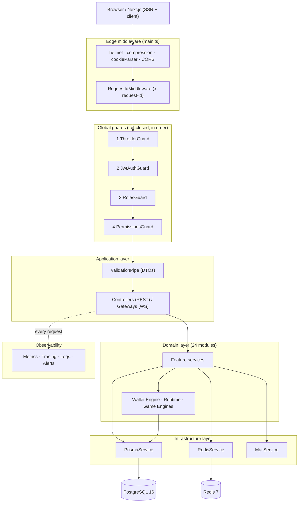

### 3.2 Bootstrap sequence

`bootstrap()` in [`main.ts`](../apps/backend/src/main.ts) wires the process before it listens:

1. Create the `NestExpressApplication` with `bufferLogs: true` (so early logs are captured and re-emitted through Winston).
2. Swap Nest's logger for the Winston provider.
3. Read typed config from `AppConfigService`.
4. Apply `helmet`, `compression`, `cookieParser`.
5. Enable CORS with credentials for the configured origins.
6. Set the global prefix (`api`) and **URI versioning** (`v1`).
7. Register the global `ValidationPipe` (`whitelist`, `forbidNonWhitelisted`, `transform`).
8. `enableShutdownHooks()` so `OnModuleDestroy` runs on SIGTERM (Prisma disconnects, Redis quits, runtimes stop).
9. Conditionally mount Swagger.
10. `listen(port, host)` and log the ready banner.

### 3.3 Module dependency graph

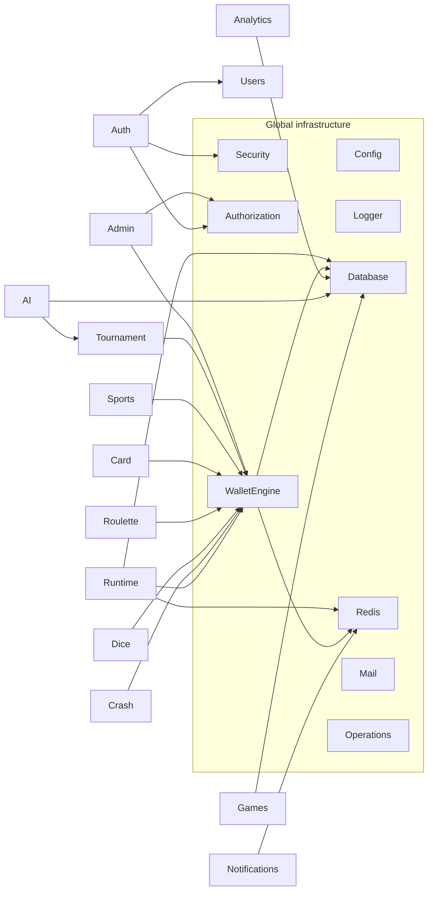

**Global modules** (`@Global()` or infrastructure) are imported once and available everywhere: `Config`, `Logger`, `Database`, `Redis`, `Security`, `Mail`, `Authorization`, `Operations`, and `WalletEngine`. This is deliberate — money, authz, observability, and persistence are cross-cutting, so they are provided platform-wide rather than re-imported per module. Everything else is a **feature module** with explicit imports.

**Ordering matters** in [`app.module.ts`](../apps/backend/src/app.module.ts): infrastructure first, then cross-cutting security, then `OperationsModule` (so the metrics interceptor is live), then `WalletEngineModule` (so the wallet bridge exists before any game engine tries to integrate), then the domain modules.

---

## 4. Backend Folder Structure

```
apps/backend/
├── src/
│   ├── main.ts                     # Bootstrap: middleware, versioning, pipes, Swagger, listen
│   ├── app.module.ts               # Root module: global providers (guards/interceptors/filter), imports
│   ├── app.controller.ts           # Version-neutral root (ping/info)
│   ├── app.service.ts
│   ├── swagger.ts                  # OpenAPI document builder
│   ├── config/                     # Typed configuration
│   │   ├── env.validation.ts       # Zod schema; validateEnv() — fail fast on bad env
│   │   ├── configuration.ts        # Namespaced config tree (app/db/redis/auth/security/mail/throttle)
│   │   ├── app-config.service.ts   # Strongly-typed facade over ConfigService
│   │   └── config.module.ts        # @Global; loads layered .env, validates, exports facade
│   ├── logger/
│   │   └── winston.config.ts       # Winston options + secret redaction format
│   ├── common/                     # Cross-cutting building blocks
│   │   ├── decorators/             # @Public, @Roles, @CurrentUser, @RequirePermissions, @ReqMeta
│   │   ├── guards/                 # JwtAuthGuard, RolesGuard
│   │   ├── interceptors/           # LoggingInterceptor, TransformInterceptor
│   │   ├── filters/                # AllExceptionsFilter
│   │   ├── middleware/             # RequestIdMiddleware
│   │   ├── dto/                    # PaginationDto
│   │   └── security/               # crypto.util, request-meta, ws-cors
│   └── modules/                    # 24 feature modules
│       ├── database/               # PrismaService (connection lifecycle, health probe)
│       ├── redis/                  # RedisService (ioredis wrapper), REDIS_CLIENT token
│       ├── auth/                   # AuthN: controllers, services, strategies, guards
│       ├── authorization/          # RBAC: rbac.service, roles.service, bootstrap, PermissionsGuard
│       ├── security/               # GeoService, SecurityEventService, AuditService (@Global)
│       ├── users/ · profile        # Account + profile
│       ├── wallet-engine/          # Financial engine (@Global): services, controllers, gateway
│       ├── wallet/ · transactions/ # Player-facing wallet + transaction history facades
│       ├── games/                  # Catalog: controllers, services, repository, mapper
│       ├── runtime/                # Plugin runtime: registry, active runtimes, sessions, fairness
│       ├── crash/ dice/ roulette/  # Per-game modules (engine + session + variant + gateway)
│       ├── card/ sports/           # Card & sportsbook modules
│       ├── tournament/             # Tournaments, leaderboards, missions, achievements, rewards
│       ├── ai/                     # Recommendations, fraud, risk, search, LLM, prompts
│       ├── operations/             # Metrics, tracing, logs, alerts, queue, breakers (@Global)
│       ├── notifications/          # Notification service + gateway
│       ├── analytics/ · admin/     # Analytics read-models + admin control plane
│       ├── mailer/                 # Transactional email
│       └── health/                 # Terminus probes + indicators
└── test/                           # Jest e2e config + integration specs
```

### 4.1 Folder ownership

| Folder | Owns | Rule |
| --- | --- | --- |
| `config/` | Environment contract and typed access | Nothing reads `process.env` directly except `env.validation.ts`; everything else injects `AppConfigService`. |
| `common/` | Framework-level cross-cutting code | No domain logic here. Guards/interceptors/decorators only. |
| `modules/*/controllers` | HTTP surface | Thin: validate (DTO), delegate to a service, return raw data (the envelope is applied globally). |
| `modules/*/services` | Business logic | The only place logic lives. Services are injectable and unit-testable. |
| `modules/*/dto` | Input/output contracts | `class-validator`-decorated request shapes. |
| `modules/*/*.gateway.ts` | Real-time surface | Socket.IO namespace handlers; authenticate on connection. |
| `modules/database` & `modules/redis` | Infrastructure clients | The *only* modules that construct a DB/Redis connection. |

**Why colocate by feature (not by technical layer):** a change to "dice" touches `modules/dice` and nowhere else. Feature-colocation keeps the blast radius of a change small and the module boundary obvious — the same boundary a future service split would cut along.

---

## 5. Module Architecture

The 24 modules registered in `AppModule` are grouped below by concern. For each, the table gives its **purpose, public API surface, key internal services, dependencies, emitted events, security posture, and extension points.** Every service and controller named here exists in the repository.

### 5.1 Module catalog (overview)

| Module | Kind | Route prefix(es) | Real-time | Global |
| --- | --- | --- | --- | --- |
| `config` | Infra | — | — | ✅ |
| `logger` | Infra | — | — | ✅ |
| `database` | Infra | — | — | ✅ |
| `redis` | Infra | — | — | ✅ |
| `security` | Cross-cutting | — | — | ✅ |
| `mailer` | Cross-cutting | — | — | ✅ (Mail) |
| `authorization` | Cross-cutting | (guards) | — | ✅ |
| `operations` | Cross-cutting | `admin/operations`, `operations` | `/operations` | ✅ |
| `wallet-engine` | Domain | `wallet-engine`, `admin/wallet` | `/wallet` | ✅ |
| `health` | Domain | `health` | — | — |
| `auth` | Domain | `auth`, `auth/*` | — | — |
| `users` | Domain | `users` | — | — |
| `games` | Domain | `games`, `game-*`, `favorites`, … | — | — |
| `runtime` | Domain | `runtime` | `/runtime` | — |
| `crash` | Domain | `crash`, `admin/crash` | `/crash` | — |
| `dice` | Domain | `dice`, `admin/dice` | `/dice` | — |
| `roulette` | Domain | `roulette`, `admin/roulette` | `/roulette` | — |
| `card` | Domain | `card`, `admin/card` | — | — |
| `sports` | Domain | `sports`, `admin/sports` | `/sports` | — |
| `tournament` | Domain | `tournaments`, `admin/tournaments` | `/tournament` | — |
| `ai` | Domain | `ai`, `admin/ai` | — | — |
| `wallet` | Domain | `wallet` | — | — |
| `transactions` | Domain | `transactions` | — | — |
| `notifications` | Domain | `notifications` | `/notifications` | — |
| `admin` | Domain | `admin`, `admin/*` | — | — |
| `analytics` | Domain | `analytics` | — | — |

### 5.2 Infrastructure modules

#### DatabaseModule

- **Purpose:** own the Prisma connection lifecycle and expose the typed client.
- **Public API:** `PrismaService` (injected everywhere data is touched).
- **Internal:** extends `PrismaClient`; `onModuleInit` connects, `onModuleDestroy` disconnects; `isHealthy()` runs `SELECT 1`.
- **Dependencies:** `AppConfigService` (connection URL), Winston.
- **Security:** log level restricted to `warn`/`error`; `errorFormat: minimal` in prod (no query leakage).
- **Extension points:** add repositories/services that inject `PrismaService`; never open a second client. See [§9](#9-database-access-layer).

#### RedisModule

- **Purpose:** provide a single shared `ioredis` client and a JSON-friendly wrapper.
- **Public API:** `RedisService` (`get/set/del/exists/ping/raw`), `REDIS_CLIENT` token.
- **Security:** password from config; wrapper never logs values.
- **Extension points:** inject `RedisService` for cache/locks/ephemeral state. See [§10](#10-redis-architecture).

#### SecurityModule (`@Global`)

- **Purpose:** cross-cutting security services.
- **Public API:** `GeoService` (IP → geo), `SecurityEventService` (security event log), `AuditService` (audit trail).
- **Events:** writes `SecurityEvent` and `AuditLog` rows — the forensic backbone consumed by admin and AI.

#### MailModule / LoggerModule / ConfigModule

- `MailModule` exposes `MailService` (nodemailer; logs instead of sends when SMTP is unset — safe in dev).
- `LoggerModule` wires Winston as the app logger with redaction.
- `ConfigModule` (`@Global`) validates env and exposes `AppConfigService`. See [§16](#16-configuration-management).

### 5.3 Auth & Authorization

#### AuthModule

- **Purpose:** the full identity lifecycle.
- **Controllers:** `AuthController` (`auth`), `SessionsController` (`auth/sessions`), `DevicesController` (`auth/devices`), `TwoFactorController` (`auth/2fa`), `ApiKeysController` (`auth/api-keys`), `SecurityController` (`auth/security`).
- **Services:** `AuthService` (orchestrator), `PasswordService`, `TokenService`, `SessionService`, `DeviceService`, `TwoFactorService`, `ApiKeyService`, `EmailVerificationService`, `PasswordResetService`, `AccountSecurityService`; strategy `JwtStrategy`; guard `ApiKeyGuard`.
- **Public API (exports):** `AuthService`, `TokenService`, `SessionService`, `ApiKeyService`, `AccountSecurityService`, `PasswordService`.
- **Events:** `LOGIN_SUCCESS/FAILURE`, `MFA_CHALLENGE`, `PASSWORD_CHANGE`, `LOGOUT`, `SUSPICIOUS_ACTIVITY` (via `SecurityEventService`); `AuditLog` on register.
- **Security:** timing-equalized login, account lockout, token rotation with reuse detection, session concurrency caps. See [§7](#7-authentication-architecture).

#### AuthorizationModule (`@Global`)

- **Purpose:** role and permission resolution.
- **Public API:** `RbacService` (resolve a user's roles + permission slugs for token claims), `RolesService` (admin CRUD), `PermissionsGuard`.
- **Internal:** `RbacBootstrapService` idempotently seeds the canonical role/permission catalog on boot.
- **Extension points:** add a permission to `rbac.constants.ts`, attach `@RequirePermissions('resource:action')`. See [§8](#8-authorization-architecture).

### 5.4 Financial core

#### WalletEngineModule (`@Global`)

- **Purpose:** the platform's financial backbone — the single authority over balances.
- **Controllers:** `WalletEngineController` (`wallet-engine`), `AdminWalletController` (`admin/wallet`); gateway `WalletGateway` (`/wallet`).
- **Services:** `WalletEngineService` (authoritative mutations), `WalletBalanceService`, `WalletTransactionService`, `WalletLedgerService`, `ReservationService`, `SettlementService`, `BonusWalletService`, `RewardWalletService`, `SystemAccountService` (house wallet), `WalletReportingService`, `WalletBridgeService` (game integration).
- **Public API (exports):** the above services; **game engines integrate exclusively via `WalletBridgeService`.**
- **Events:** emits `wallet:balances` and `wallet:settlement` over the gateway; posts double-entry `Ledger`/`LedgerEntry` rows.
- **Security:** four concurrency layers; no other module may mutate a balance. See [§12](#12-wallet-backend).

The player-facing `WalletModule` (`wallet`) and `TransactionsModule` (`transactions`) are **thin read/orchestration facades** over the engine — they never touch balances directly.

### 5.5 Games, Runtime & Engines

#### GamesModule

- **Purpose:** the game catalog and player interactions.
- **Controllers:** `GamesController` (`games`), plus `categories`, `providers`, `collections`, `favorites`, `ratings`, `recently-played`, and the `admin/games` / `admin/game-*` admin controllers.
- **Services:** `CatalogService`, `CategoryService`, `ProviderService`, `CollectionService`, `FavoritesService`, `RatingService`, `RecentlyPlayedService`, `RecommendationService`, `LauncherService`, `AssetService`, `GameCacheService`, `GameAdminService`, plus a `GameRepository` and `game-mapper`.
- **Security:** read endpoints are broadly available; writes require `games:write`.
- **Extension points:** register a game row + assets; the runtime plugin key links catalog → engine.

#### RuntimeModule

- **Purpose:** host server-authoritative game runtimes and provable fairness.
- **Controller:** `RuntimeController` (`runtime`); gateway `RuntimeGateway` (`/runtime`).
- **Services:** `RuntimePluginRegistryService` (validates + registers 6 engines at boot), `ActiveRuntimeService` (in-memory live runtimes with idle sweep), `RuntimeSessionService` (Redis-backed session records + seeds), `ProvablyFairService` (commit-reveal + HMAC).
- **Extension points:** add an engine registration to the registry array — no platform changes. See [§13](#13-runtime-backend).

#### Per-game modules (`crash`, `dice`, `roulette`, `card`, `sports`)

Each wraps its engine with a consistent trio — `*-engine.service`, `*-session.service`, `*-variant.service` — a public controller, an `admin/*` controller, and (for real-time games) a gateway. They call the engine for deterministic outcomes and the `WalletBridgeService` for money. This uniformity is deliberate: once you understand one game module, you understand all of them.

### 5.6 Progression, Intelligence & Operations

#### TournamentModule

- **Services:** `TournamentService`, `LeaderboardService`, `MissionService`, `AchievementService`, `RewardService`, `SeasonService`; gateway `/tournament`.
- **Public API:** exported services are consumed by `AiModule` (which imports `TournamentModule`) for insight generation.

#### AiModule

- **Purpose:** grounded intelligence; **reads platform data, writes nothing.**
- **Controllers:** `AiController` (`ai`), `AdminAiController` (`admin/ai`).
- **Services:** `RecommendationService`, `FraudService`, `RiskService`, `SearchService`, `AnalyticsAiService`, `LlmService`, `PromptManager`. See [§14](#14-ai-backend).

#### OperationsModule (`@Global`)

- **Purpose:** the observability + reliability control plane.
- **Controllers:** `OperationsController` (`admin/operations`), `PublicOperationsController` (`operations`); gateway `/operations`.
- **Services:** `MetricsService`, `TracingService`, `LogBufferService`, `MonitoringService`, `OperationsHealthService`, `AlertService`, `QueueService`, `CircuitBreakerService`; the global `MetricsInterceptor`. See [§15](#15-operations-backend).

#### NotificationsModule / AnalyticsModule / AdminModule / HealthModule

- `NotificationsModule`: `NotificationsService` + gateway `/notifications`. Persists notifications and pushes them to a user's socket room in real time; read/dismiss endpoints keep the badge count authoritative on the server.
- `AnalyticsModule`: read-model aggregations over the `analytics` schema. It is **read-only** and computed from durable data (sessions, results, ledger) so numbers reconcile with the source of truth rather than drifting in a separate counter store.
- `AdminModule`: the `admin` control plane — users, roles, audit — gated by permissions and audit-logged. Every admin mutation writes an `AuditLog` row, so "who changed what, when" is always answerable.
- `HealthModule`: Terminus probes (`health`, `health/liveness`, `health/readiness`).

#### UsersModule, WalletModule, TransactionsModule (facades)

- `UsersModule` owns the account/profile aggregate (`UsersService`) and is imported by `AuthModule` — auth composes user reads/writes rather than duplicating them. `UsersService.toAuthView` is the single place a user entity becomes the sanitized shape that ships in tokens/responses, so a password hash or internal flag can never leak by accident.
- `WalletModule` (`wallet`) and `TransactionsModule` (`transactions`) are intentionally **thin**: they expose player-facing balance and history reads and delegate every mutation to the engine. Keeping them as facades — rather than letting them write balances "just this once" — is what preserves the single-money-path invariant ([ADR-005](#24-architecture-decisions)).

**Why these are separate from `wallet-engine`:** the engine is the *mechanism* (atomic, ledgered, locked); the facades are the *policy and presentation* (what a player is allowed to see and request). Splitting them keeps the safety-critical engine small and its surface area minimal — fewer entry points to audit.

---

## 6. Request Lifecycle

Every HTTP request flows through a fixed pipeline. Understanding this order is the single most useful thing a new engineer can internalize, because it explains *where* to put a concern (a header → middleware; a permission → guard; a response shape → interceptor; an error → filter).

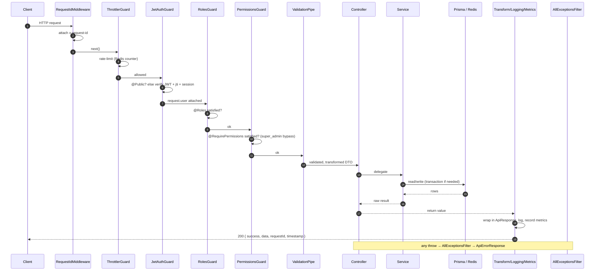

### 6.1 Stage-by-stage

| Stage | Component | Responsibility | Failure mode |
| --- | --- | --- | --- |
| 1. Correlation | `RequestIdMiddleware` | Assign/echo `x-request-id` | — |
| 2. Rate limit | `ThrottlerGuard` | Enforce `RATE_LIMIT_LIMIT` per `RATE_LIMIT_TTL` | `429 Too Many Requests` |
| 3. Authenticate | `JwtAuthGuard` + `JwtStrategy` | Verify signature/expiry, jti blacklist, session liveness; attach `request.user`. Skipped for `@Public`. | `401 Unauthorized` |
| 4. Authorize (coarse) | `RolesGuard` | Check `@Roles(...)` against `user.role` | `403 Forbidden` |
| 5. Authorize (fine) | `PermissionsGuard` | Check `@RequirePermissions(...)`; super-admin bypass | `403 Forbidden` |
| 6. Validate | `ValidationPipe` | Whitelist, reject unknown props, transform to typed DTO | `400 Bad Request` |
| 7. Handle | Controller → Service | Business logic, persistence | domain `AppError`/HTTP exceptions |
| 8. Metrics/trace | `MetricsInterceptor` | Time request, record metrics, attach `x-trace-id`, buffer log | — |
| 9. Log | `LoggingInterceptor` | `METHOD url status +Xms` | — |
| 10. Envelope | `TransformInterceptor` | Wrap in `ApiResponse<T>` | — |
| 11. Normalize errors | `AllExceptionsFilter` | Any throw → `ApiErrorResponse` | consistent error body |

**Why guards before the pipe:** authorization is cheaper and more security-critical than validation. We reject an unauthenticated or unauthorized request *before* spending CPU validating its body. **Why interceptors wrap the handler:** the envelope and metrics must observe both success and error paths uniformly, which is exactly what an RxJS `tap`/`map` around `next.handle()` provides.

### 6.2 The response envelope

Handlers return **raw data**; the `TransformInterceptor` wraps everything in one shape so clients parse uniformly:

```jsonc
// success
{ "success": true, "statusCode": 200, "message": "OK",
  "data": { /* handler result */ },
  "timestamp": "…", "path": "/api/v1/…", "requestId": "…" }

// error (AllExceptionsFilter)
{ "success": false, "statusCode": 400, "message": "…",
  "error": "ValidationError", "errors": [{ "field": "", "message": "…" }],
  "timestamp": "…", "path": "/api/v1/…", "requestId": "…" }
```

---

## 7. Authentication Architecture

Authentication is implemented across `AuthService` and a set of focused services. The design goal is **stateless authorization with revocation** — JWTs so any instance can authorize without a DB round-trip, plus Redis-backed session/blacklist checks so we can still kill a token or session instantly.

### 7.1 Token model

| Token | Secret | Lifetime (default) | Carries | Storage |
| --- | --- | --- | --- | --- |
| **Access** | `JWT_ACCESS_SECRET` | `15m` | `sub, email, username, role, roles[], permissions[], sid, jti, type:'access'` | Not stored; verified statelessly; jti can be blacklisted in Redis |
| **Refresh** | `JWT_REFRESH_SECRET` | `7d` (`30d` remember-me) | `sub, sid, family, jti, type:'refresh'` | Hash stored in `RefreshToken` (rotation + reuse detection); session mirrored in Redis |

Access tokens are **short-lived** so a leaked token expires fast; refresh tokens are **rotated** on every use and bound to a **family** so reuse is detectable. Issuer/audience are pinned via `TOKEN_DEFAULTS`.

### 7.2 Registration → verification

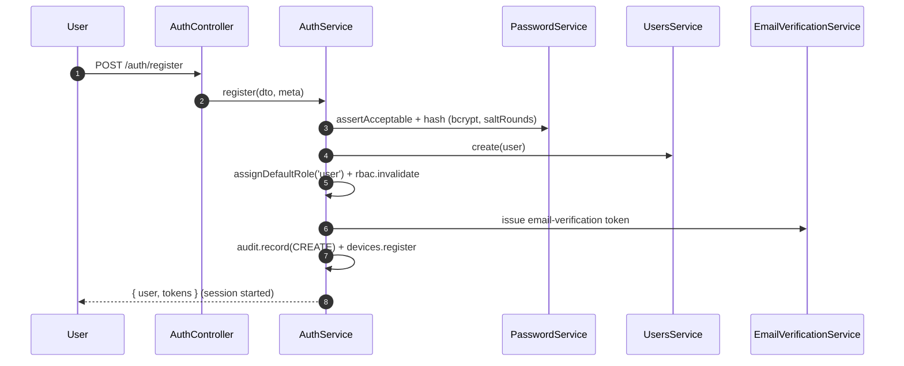

`PasswordService.assertAcceptable` rejects weak/breached passwords (optional HIBP-style check via `PASSWORD_BREACH_CHECK_ENABLED`) and passwords containing the email/username. Email verification is issued with a TTL (`EMAIL_VERIFICATION_TTL_HOURS`).

### 7.3 Login (with optional 2FA)

`AuthService.login` is careful about the details that matter for security:

- **Timing equalization:** if the email is unknown, it *still* runs a bcrypt comparison against a dummy hash, so response time doesn't reveal account existence.
- **Lockout:** `AccountSecurityService.isLocked` short-circuits locked accounts; failed attempts increment toward `ACCOUNT_LOCK_MAX_ATTEMPTS` and lock for `ACCOUNT_LOCK_DURATION_MINUTES`.
- **Status gate:** `BANNED`/`CLOSED` accounts are refused.
- **2FA challenge:** if `twoFactorEnabled`, a random challenge token is stored in Redis (`auth:2fa:<token>`, TTL 300s) and returned; the client completes via `verifyTwoFactor`. Only then is a session issued.

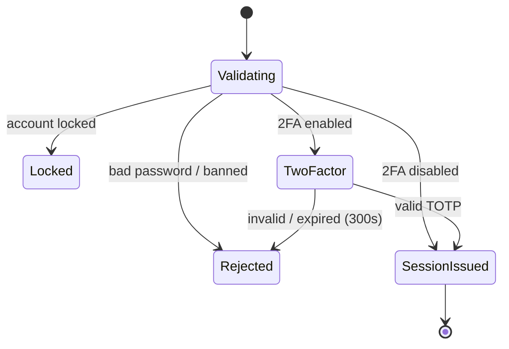

### 7.4 Sessions, refresh rotation & reuse detection

`SessionService.start` creates a `Session` row, mirrors a lightweight record in Redis (`session:<sid>`), issues the first token pair, and enforces **concurrency**: if active sessions exceed `MAX_CONCURRENT_SESSIONS`, the oldest are revoked.

`SessionService.rotate` is where the security model earns its keep:

1. Verify the refresh JWT; look up its hash in `RefreshToken`.
2. If the record is **not `ACTIVE`** (already used/revoked) → **token reuse** → `handleReuse` burns the entire token **family**, revokes the session, records a `SUSPICIOUS_ACTIVITY` HIGH event, and rejects. This defeats stolen-refresh-token replay.
3. If expired → mark `EXPIRED`, reject.
4. Otherwise issue a new pair, mark the old record `USED` with `replacedById`, update session activity, refresh the Redis mirror.

### 7.5 Access-token validation (`JwtStrategy.validate`)

On every protected request the strategy performs three checks beyond signature/expiry:

1. `type === 'access'` (a refresh token can't be used as an access token).
2. **jti not blacklisted** (`TokenService.isAccessBlacklisted` → Redis `bl:access:<jti>`) — logout blacklists the jti until natural expiry.
3. **Session still active** (`SessionService.isActive` → Redis fast-path, DB fallback) — so revoking a session from another device kills all its access tokens too.

It returns the `AuthenticatedUser` (id, email, username, role, roles[], permissions[], sessionId, jti) which downstream guards and `@CurrentUser` consume.

### 7.6 Devices, 2FA, password reset, API keys

| Feature | Service | Notes |
| --- | --- | --- |
| Trusted devices | `DeviceService` | Fingerprints via `ua-parser-js`; lists devices; links sessions to a device |
| 2FA (TOTP) | `TwoFactorService` | `otplib` secret + `qrcode` provisioning; issuer `TWO_FACTOR_ISSUER` |
| Password reset | `PasswordResetService` | Time-boxed token (`PASSWORD_RESET_TTL_MINUTES`); revokes sessions on completion |
| Password change | `AuthService.changePassword` | Verifies current password; keeps current session, revokes the rest |
| API keys (M2M) | `ApiKeyService` + `ApiKeyGuard` | `x-api-key` header; verified key populates `request.apiKey` with scopes |

### 7.7 Threat model (authentication)

| Threat | Mitigation |
| --- | --- |
| Credential stuffing / brute force | Global throttler + account lockout + timing equalization |
| Token theft (access) | Short 15m lifetime + jti blacklist + session liveness |
| Token theft (refresh) | Rotation + family reuse detection (burn on replay) |
| Session hijack across devices | Revoke-all + per-request session check |
| Account enumeration | Identical error + equalized timing for unknown vs. wrong-password |
| MFA bypass | Challenge stored server-side (Redis), 300s TTL, session only after verify |
| Secret leakage in logs | Winston redaction of tokens/secrets/seeds |

---

## 8. Authorization Architecture

Authorization is **two-layered and fail-closed**: coarse role checks and fine-grained permission checks, both registered as global guards so *every* route is protected unless it opts out.

### 8.1 Global guard chain

Registered in `app.module.ts` in this order (each runs only if the previous allowed):

```
ThrottlerGuard → JwtAuthGuard → RolesGuard → PermissionsGuard
```

Because these are `APP_GUARD` providers, the **default posture is "authenticated."** A new controller is protected the moment it exists; you must *explicitly* mark it `@Public()` to open it. This is the opposite of the common (dangerous) default where new routes are open until someone remembers to lock them.

### 8.2 The RBAC catalog

`rbac.constants.ts` is the single source of truth:

| Role | Slug | Level | Permissions |
| --- | --- | --- | --- |
| User | `user` | 10 | (none — baseline authenticated) |
| VIP | `vip` | 20 | (none extra; perks are feature-flag/segment driven) |
| Moderator | `moderator` | 30 | `users:read`, `sessions:read`, `security:read`, `audit:read` |
| Administrator | `admin` | 40 | Moderator + user write/lock/verify, roles read/assign, sessions revoke, games read/write, wallets read, transactions read, analytics read, settings read, feature_flags read |
| Super Admin | `super_admin` | 50 | **all permissions** (and bypasses every permission check) |

Permissions are `resource:action` slugs (`users:read`, `wallets:adjust`, `feature_flags:write`, …). `RbacBootstrapService` seeds roles and permissions **idempotently on boot**, so a fresh database is immediately governable and drift is impossible.

### 8.3 How authorization is declared and enforced

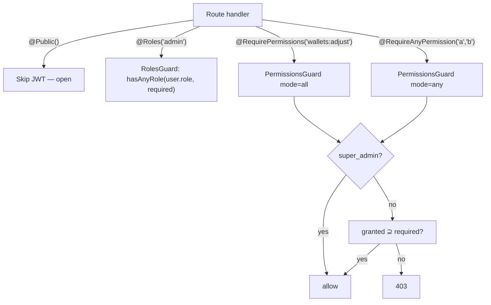

- `RolesGuard` reads `@Roles(...)` metadata; if none is declared it passes (permission-level checks may still apply). It uses `hasAnyRole` from `@gaming-platform/auth`.
- `PermissionsGuard` reads `@RequirePermissions` / `@RequireAnyPermission` metadata. `super_admin` short-circuits to allow. Otherwise it checks the token's `permissions[]` claim (`every` for `all`-mode, `some` for `any`-mode). Both guards throw `ForbiddenException` on failure.

**Why put permissions in the token:** the claim set is resolved at login/refresh by `RbacService` and travels in the access token, so per-request authorization is a set-membership check with **no database hit** — fast and horizontally scalable. The cost is that a permission change takes effect at next token refresh; for immediate revocation we have session kill + jti blacklist.

### 8.4 Ownership & resource access

Beyond role/permission checks, services enforce **ownership** where the resource is user-scoped (e.g. `SessionService.revoke` filters `where: { id, userId }`, so a user can only revoke *their* sessions). This "authorize the row, not just the route" pattern lives in services because only they know the data model. Admin overrides are gated by the corresponding permission (e.g. `sessions:revoke`).

---

## 9. Database Access Layer

### 9.1 Prisma as the single data mapper

`PrismaService` extends `PrismaClient` and is the **only** database client in the process. It:

- takes its URL from `AppConfigService` (never `process.env` directly);
- connects in `onModuleInit`, disconnects in `onModuleDestroy` (wired to shutdown hooks);
- restricts logging to `warn`/`error` and uses `minimal` error format in production (no query/parameter leakage);
- exposes `isHealthy()` (`SELECT 1`) for the health module.

The schema itself (126 models / 69 enums across 16 split files) is documented in [System Architecture §6](./SYSTEM_ARCHITECTURE.md#6-database-architecture); this section is about **how the backend accesses it**.

### 9.2 Repository vs. service data access

Two patterns coexist, chosen per module:

- **Direct Prisma in services** (most modules): services inject `PrismaService` and issue typed queries. Simple, transparent, and the Prisma client *is* the repository abstraction (type-safe, testable via mocking).
- **Explicit repository** (e.g. `games` has `GameRepository`, `game-mapper`): used where query construction is complex or reused, to keep services focused on logic and centralize mapping DB rows → API shapes.

**Why not a repository for everything:** Prisma already provides a typed, mockable data layer; wrapping every model in a hand-written repository would be ceremony without benefit. We add a repository only when it earns its place (reuse, complex mapping).

### 9.3 Transactions

The wallet engine relies on Prisma **interactive transactions** — `this.prisma.$transaction(async (tx) => { … })` — so that a balance write, a `LockedFunds` update, a `WalletTransaction`, and the double-entry `Ledger`/`LedgerEntry` posts all commit or roll back **atomically**. Multi-statement array transactions (`$transaction([...])`) are used for simpler all-or-nothing writes (e.g. revoking a session + its refresh tokens).

### 9.4 Optimistic locking & concurrency

`WalletBalance` carries a `version` column. Every balance write is conditioned on the version read at the start of the operation; a concurrent writer that bumped the version causes the conditional update to affect zero rows, which the engine treats as a conflict and **retries** (bounded by `MAX_RETRIES`). Combined with `SELECT … FOR UPDATE` row locks (`lockWalletRow`) inside the transaction and per-wallet Redis locks *around* it, corruption under concurrency is prevented at three independent levels. See [§12.4](#124-concurrency-the-four-layers).

### 9.5 Query patterns & conventions

| Concern | Convention |
| --- | --- |
| Pagination | `PaginationDto` (`common/dto`) — `skip`/`take` with sane caps |
| Soft deletes | `deletedAt` filters (`where: { deletedAt: null }`) on user-facing reads |
| Money columns | Postgres `Decimal`/`numeric`; never floats. `Money` (wallet-core) does the arithmetic |
| Selection | `select`/`include` scoped to what the caller needs (no `SELECT *` bloat) |
| Ordering | Explicit `orderBy` (e.g. sessions by `lastActivityAt desc`) |
| Aggregation | `groupBy`/`aggregate` for reconciliation, analytics, fraud features |

### 9.6 Indexing, auditing, statistics

Indexing lives in the Prisma schema (hot lookups: `userId`, `tokenHash`, wallet composite keys, `reference`). Auditing is application-level and explicit: `AuditService` records `AuditLog` rows on sensitive actions, `SecurityEventService` records `SecurityEvent` rows on auth events — both consumed by admin and AI. This gives a queryable forensic trail without database triggers, keeping the audit logic visible in code.

### 9.7 Migrations & schema evolution

Schema changes flow through **Prisma Migrate**: a change to the split schema files generates a versioned SQL migration that is reviewed, committed, and applied in CI before the app boots against it. The discipline is **additive-first** — add columns/tables and backfill before removing anything — so a new app version is forward-compatible with the previous schema and a rollback of the app doesn't strip data the old code still reads. Money and ledger tables are treated as **append-only**: corrections are compensating entries, never destructive updates, so migrations never rewrite financial history. This is what makes the zero-downtime, start-first deploy ([§20.3](#203-health-scaling--rollback)) safe: old and new instances briefly run against the same schema without conflict.

---

## 10. Redis Architecture

Redis is the backend's **hot path and coordination layer**. `RedisService` wraps `ioredis` with JSON-aware `get`/`set` (auto-serialize/parse), `del`, `exists`, and `ping`; the raw client is exposed via `raw` for atomic primitives.

### 10.1 What lives in Redis

| Use | Key pattern | TTL | Why Redis (not Postgres) |
| --- | --- | --- | --- |
| Session liveness mirror | `session:<sid>` | refresh TTL | Sub-ms per-request check without a DB hit |
| Access-token blacklist | `bl:access:<jti>` | ≤ token expiry | Instant revocation of a still-valid JWT |
| 2FA challenge | `auth:2fa:<token>` | 300s | Short-lived, self-expiring, never needs durability |
| Runtime session record | `runtime:session:<id>` | 3600s | Fast reconnect + seed retrieval for live play |
| Per-wallet lock | wallet lock key | 5000ms | Serialize concurrent mutations of one wallet |
| Rate-limit counters | throttler keys | `RATE_LIMIT_TTL` | Atomic increments at the edge |
| Cache (catalog etc.) | `GameCacheService` keys | `REDIS_TTL` | Offload read-heavy catalog queries |

### 10.2 Locks

The wallet engine acquires a **per-wallet lock** (`LOCK_TTL_MS = 5000`) before mutating, so two requests for the same wallet serialize rather than race. The TTL guarantees a crashed holder can't deadlock the wallet forever — the lock self-expires and the optimistic version check still protects correctness if the lock ever lapses. This is the "belt and suspenders" philosophy: the lock is an optimization for the common case; the version column is the correctness guarantee.

### 10.3 Ephemeral state & cache invalidation

Ephemeral, self-expiring state (challenges, runtime sessions, session mirrors) is chosen for Redis precisely because it **should** vanish on TTL — there is no value in persisting a 5-minute 2FA challenge. For cache, the pattern is **write-through invalidation**: services that mutate a cached entity call `redis.del(cacheKey)` (e.g. `WalletEngineService.setStatus` deletes the wallet cache key) so the next read repopulates from the source of truth.

### 10.4 Failure posture

Redis is treated as **fast but not the source of truth for correctness**. Session checks fall back to Postgres if the Redis key is missing. `ping()` failures are logged and surfaced by the health/readiness probe and the `redis-down` alert rule, but a transient Redis blip degrades latency, not correctness — because durable state is always in Postgres.

---

## 11. WebSocket Architecture

Real-time is delivered by **nine Socket.IO gateways**, each on its own namespace, all sharing the same auth and CORS conventions.

### 11.1 Namespaces

| Namespace | Gateway | Purpose |
| --- | --- | --- |
| `/runtime` | `RuntimeGateway` | Server-authoritative runtime play (join, action, event stream) |
| `/wallet` | `WalletGateway` | Live balance + settlement pushes |
| `/crash` | `CrashGateway` | Crash rounds (multiplayer tick stream) |
| `/dice` | `DiceGateway` | Dice results |
| `/roulette` | `RouletteGateway` | Roulette spins |
| `/sports` | `SportsGateway` | Live odds / bet updates |
| `/tournament` | `TournamentGateway` | Leaderboard + tournament events |
| `/notifications` | `NotificationsGateway` | User notifications |
| `/operations` | `OperationsGateway` | Live ops dashboard (metrics/alerts/logs) |

### 11.2 Authentication on connect

Gateways authenticate **at the handshake**, not per message. `RuntimeGateway.handleConnection` reads the token from `handshake.auth.token` (or the `Authorization` header), verifies it with `verifyAccessToken` from `@gaming-platform/auth` (same secrets as HTTP), stores `userId` on `client.data`, and **disconnects immediately** if the token is missing or invalid. Unauthenticated sockets never reach a message handler.

```mermaid
sequenceDiagram
    autonumber
    participant C as Client socket
    participant G as Gateway (/runtime)
    participant A as Active runtimes
    C->>G: connect (auth.token)
    G->>G: verifyAccessToken → userId (else disconnect)
    G-->>C: runtime:connected
    C->>G: runtime:join { runtimeSessionId }
    G->>A: start/attach runtime, join room runtime:<id>
    A-->>G: game events (bus.onAny)
    G-->>C: event stream (broadcast to room)
    C->>G: runtime:action { ... }
    G->>A: apply action (server-authoritative)
    A-->>G: resulting events
    G-->>C: updated state
    Note over C,G: disconnect keeps runtime alive for reconnect; idle sweep reclaims it
```

### 11.3 Rooms, broadcasting & reconnect

- **Rooms** scope broadcasts: a runtime broadcasts to `runtime:<runtimeSessionId>`; the wallet gateway targets a user's own room. This keeps fan-out precise — a player only receives their own balance updates and their own game's events.
- **Reconnect** is seamless: `ActiveRuntimeService` keeps a runtime **alive after disconnect** (it is only reclaimed by the idle sweeper). Rejoining resends current state, so a dropped connection doesn't lose an in-progress game.
- **Heartbeat/latency** monitoring is built into the runtime gateway.

### 11.4 Scaling considerations

Today the gateways hold **in-memory** room/runtime state, so real-time is not yet horizontally shardable without sticky sessions. The documented path (see [§25](#25-future-backend-roadmap)) is the **Socket.IO Redis adapter** for cross-instance broadcasting plus moving live runtime state to Redis, which turns the WS tier stateless-enough to scale out. This is a conscious trade-off: in-memory is simpler and faster for the current single-node-plus-replicas topology, and the seam (all runtime access goes through `ActiveRuntimeService`) is where the Redis-backed implementation will slot in.

---

## 12. Wallet Backend

The wallet engine is the most safety-critical subsystem in the platform. Its contract is simple to state and hard to get right: **no money is ever created or destroyed except by an atomic, idempotent, double-entry-ledgered operation, and there is exactly one code path that mutates a balance.**

### 12.1 Balance model

A `WalletBalance` has four components, all `Decimal` strings, plus a `version`:

| Component | Meaning |
| --- | --- |
| `available` | Spendable now |
| `locked` | Reserved for an in-flight bet |
| `pending` | In-flight deposit/withdrawal |
| `total` | `available + locked + pending` (invariant) |

Users can hold multiple wallets by **type** — `MAIN`, `BONUS`, `REWARD` — and currency. The `Balance` value object from `@gaming-platform/wallet-core` implements the algebra (`credit`, `debit`, `reserve`, `commitReserved`, `releaseReserved`) with **non-negative guarantees** — an overdraft throws rather than producing a negative balance.

### 12.2 Operations

| Operation | Effect | Ledger |
| --- | --- | --- |
| `credit` | `available += amount` | deposit/adjustment journal |
| `debit` | `available -= amount` (guarded) | withdrawal/adjustment journal |
| `reserve` | `available → locked`; open `LockedFunds` | `RESERVE` txn |
| `commitReservation` | consume stake (`GAME_BET`) + credit win (`GAME_WIN`); close reservation | two journals (bet DEBIT, win CREDIT vs. house) |
| `releaseReservation` | `locked → available`; cancel | `RESERVE_RELEASE` txn |
| `transfer` | move between a user's wallet types | `TRANSFER_OUT`/`TRANSFER_IN` + journal |
| `rollback` | reverse a settled txn (admin correction) | compensating journal |
| `freeze`/`unfreeze` | set `WalletStatus` | — |

### 12.3 Settlement flow (the canonical game round)

Every game round follows **reserve → play → commit** (or **release** on cancel). Stateless games (dice/roulette/card) use `settleImmediate`, which reserves and commits in one step but is still fully ledgered.

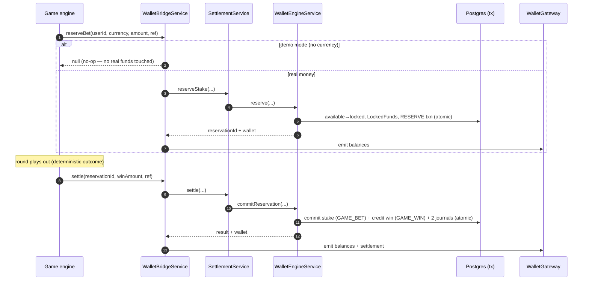

**Why a mandatory bridge:** `WalletBridgeService` is the *only* way a game engine touches money. Engines can't accidentally (or maliciously) write a balance directly because they don't depend on the engine — they depend on the bridge, which enforces the reserve→commit flow and emits real-time updates. In **demo mode** (no currency bound) the bridge is a **safe no-op**, so demo play is genuinely free of financial side effects while real-money play is always ledgered. See [ADR-006](#24-architecture-decisions).

### 12.4 Concurrency: the four layers

`WalletEngineService`'s own docstring names the four guardrails, and they are independent so any one failing still leaves the books correct:

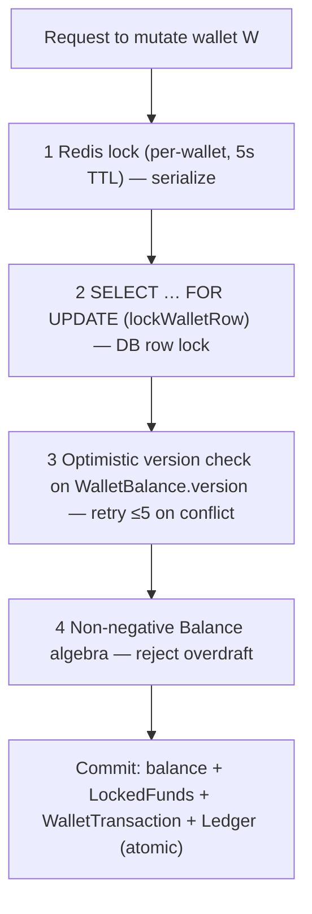

1. **Redis lock** serializes concurrent mutations of the same wallet (fast path).
2. **Row lock** (`FOR UPDATE`) inside the Prisma transaction prevents interleaving at the DB.
3. **Optimistic `version`** is the correctness backstop: a stale write hits zero rows and retries (≤ `MAX_RETRIES`).
4. **Non-negative algebra** makes an overdraft a thrown error, never a silent negative.

### 12.5 Idempotency

Money endpoints accept an **idempotency key**. On replay, `WalletEngineService.replay(tx, key)` finds the original transaction and returns the **original result** instead of applying the mutation twice. This makes client retries (and at-least-once delivery from the queue) safe — a double-submitted settlement can never double-charge or double-pay. References are namespaced (`<ref>:bet`, `<ref>:win`, `<ref>:release`) so each leg is independently idempotent.

### 12.6 Double-entry ledger & house wallet

Every value movement posts a balanced **journal**: a player-side entry and a house-side entry (`SystemAccountService.houseWallet`) in opposite directions. Because debits and credits are always posted together, the books are **provably balanced**. `WalletLedgerService.reconcile()` runs the **trial balance** — `Σ debits` vs. `Σ credits` across all `POSTED` entries — and reports `balanced` + `difference`. A non-zero difference trips the `wallet-inconsistency` alert (threshold 0, critical). This is the same technique real accounting systems use; it turns "is the money correct?" into a query.

### 12.7 Reporting & failure recovery

`WalletReportingService` exposes turnover/GGR/exposure reads for admin and AI. On failure, `WalletBridgeService.settleImmediate` logs and rethrows so the caller (and the retry queue) can react; because operations are idempotent, a retried settlement is safe. Admin corrections go through `rollback`, which posts a **compensating** entry rather than mutating history — the ledger is append-only.

---

## 13. Runtime Backend

The runtime hosts **server-authoritative game sessions** and guarantees **provable fairness**. It is where a plugin engine (pure logic) becomes a live, stateful, networked game.

### 13.1 Plugin registry (boot-time)

`RuntimePluginRegistryService` registers six engines at construction — `dice`, `crash`, `roulette`, `card`, `lottery`, `sports` — each imported as a `*Registration` from its engine package. Every registration is **validated at boot** (`validate()`): a well-formed kebab-case `key`, a callable `factory`, and a sane player range. A malformed plugin **prevents boot** — fail fast rather than discover a broken game at play time. A `GameRegistryResolver` supports lazy/code-split loading for future engines without platform changes.

### 13.2 Provable fairness

`ProvablyFairService` implements commit-reveal:

1. **Commit:** generate a 32-byte `serverSeed`, publish only its SHA-256 hash (`serverSeedHash`) up front.
2. **Derive:** the round seed = `HMAC-SHA256(serverSeed, "<clientSeed>:<nonce>")`.
3. **Reveal & verify:** after the round the server can reveal `serverSeed`; a player re-hashes it (must equal the committed hash) and re-derives the seed (must equal the one used). `verify()` returns `{ hashValid, seedValid }`.

Because the engines are **deterministic** (`(config, seed, bet) → outcome`), the same seed always produces the same outcome — so fairness is not a promise, it's arithmetic the player can reproduce.

### 13.3 Runtime session lifecycle

```mermaid
stateDiagram-v2
    [*] --> Created: RuntimeSessionService.create (seed committed, config resolved, Redis 1h TTL)
    Created --> Joined: gateway runtime:join → ActiveRuntimeService.start
    Joined --> Playing: initialize() + start(); bus.onAny → gateway
    Playing --> Playing: runtime:action (server-authoritative)
    Playing --> Idle: client disconnect (runtime kept alive)
    Idle --> Playing: reconnect + rejoin (state resent)
    Idle --> Swept: idle > 15m (sweeper every 60s)
    Playing --> Ended: game complete / stop
    Swept --> [*]
    Ended --> [*]
```

- `RuntimeSessionService.create` mints a `runtimeSessionId`, commits fairness seeds, resolves the plugin config, optionally opens a `GameSession` row (for real-money mode), and stores the record in Redis (`runtime:session:<id>`, 3600s).
- `ActiveRuntimeService` loads the engine via `GameLoader`, wires `runtime.bus.onAny` to forward every `GameEvent` to the gateway, calls `initialize()` + `start()`, and keeps the live `GameRuntime` in an in-memory `Map`.
- An **idle sweeper** (every 60s, 15-minute TTL) stops and evicts inactive runtimes to reclaim memory; `onModuleDestroy` stops all runtimes cleanly.

### 13.4 State persistence, replay & statistics

Session metadata and seeds live in Redis for fast reconnect; durable records (`GameSession`, `GameResult`) live in Postgres for history, replay, statistics, fraud/risk features, and reconciliation. Because outcomes are seed-derived, a **replay** re-runs the engine with the stored seed to reproduce the exact sequence — invaluable for dispute resolution and audit. This is the division of labor: **Redis for liveness, Postgres for truth.**

---

## 14. AI Backend

The AI module is deliberately constrained: it **reads platform data and writes nothing**, and its outputs are **advisory**. Intelligence influences the UI and informs operators; it never autonomously moves money or grants access.

### 14.1 Structure

| Service | Backed by | Purpose |
| --- | --- | --- |
| `RecommendationService` | `ai-core` | Personalized game recommendations from play history |
| `FraudService` | `ai-core` `FraudRules` | Explainable fraud flags from behavioural/correlation features |
| `RiskService` | `ai-core` `RiskScoring`, `Segmentation` | Risk band, responsible-gaming flags, segment, churn probability |
| `SearchService` | `ai-core` | Natural-language catalog search |
| `AnalyticsAiService` | Prisma reads | Grounded operational insights (revenue, tournaments, wallets) |
| `PromptManager` | templates | Named answer templates rendered with grounded variables |
| `LlmService` | provider abstraction | Narrates grounded facts (local by default; Claude when configured) |

### 14.2 The determinism + grounding contract

`FraudService`/`RiskService` build feature objects from **real** data — logins, devices, `GameResult`, deposits, sessions — and run the **pure, deterministic** `ai-core` rule/scoring engines. Every flag is explainable because it's a rule over named features, not an opaque model. This is why fraud/risk logic lives in a pure package: it's unit-testable and reproducible.

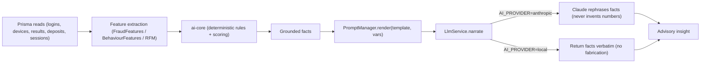

### 14.3 LLM abstraction & trust boundary

`LlmService` hides the provider behind an `LlmProvider` interface with two implementations:

- **`LocalProvider` (default):** returns the grounded facts the caller assembled — **never inventing numbers** — so the platform works with **no API key and no external dependency**.
- **`AnthropicProvider`:** used only when `AI_PROVIDER=anthropic` and `ANTHROPIC_API_KEY` are set. It calls the Messages API with a system prompt that instructs the model to answer **only from the provided facts** and never fabricate figures; the facts are passed as authoritative context.

The `PromptManager` holds versioned, named templates (`revenue-insight`, `player-insight`, `wallet-insight`, …) rendered by `{{var}}` substitution. **Why templates + grounding:** treating prompts as reviewed, versioned assets and forcing the model to summarize (not compute) is what makes AI output trustworthy in a financial product. The LLM is a *narrator*, not an oracle.

**Trust boundary:** a recommendation changes what a player sees; a risk score informs a human decision. The deterministic wallet and authorization modules remain the sole authorities over money and access. See [System Architecture §10](./SYSTEM_ARCHITECTURE.md#10-ai-platform).

---

## 15. Operations Backend

`OperationsModule` (`@Global`) is the production control plane: **metrics, tracing, logs, alerts, health, queues, and circuit breakers**, plus a live `/operations` dashboard gateway. Its primitives come from the pure `@gaming-platform/ops-core` package.

### 15.1 The four observability signals

| Signal | Component | Detail |
| --- | --- | --- |
| **Metrics** | `MetricsService` (`MetricRegistry`) | HTTP + domain counters/histograms/gauges; `prometheus()` text exposition; derived `errorRate()`, `latencyP95()`, `throughput()` |
| **Traces** | `TracingService` | Per-request trace id (`x-trace-id`), propagated from `x-trace-id` header if present |
| **Logs** | `LogBufferService` + Winston | In-memory ring buffer for the live log explorer; Winston for durable, redacted, rotated logs |
| **Health** | `OperationsHealthService` + Terminus | Liveness/readiness/health, dependency probes |

The global `MetricsInterceptor` ties three of these together: it times **every** HTTP request, records latency/throughput/error metrics, attaches the trace id to the response, and pushes a structured entry to the log buffer — all uniformly, for both success and error paths.

### 15.2 Resilience primitives

| Primitive | Service | Behaviour |
| --- | --- | --- |
| **Circuit breaker** | `CircuitBreakerService` | Named breakers (default: 5 failures → open 10s → 2 successes → close). `execute()` throws `503` while open, preventing cascading failures against fragile dependencies. |
| **Retry queue + DLQ** | `QueueService` | In-process background jobs with exponential backoff (base 500ms, ×2, cap 30s, 3 attempts) and a dead-letter queue. A 250ms poll loop drains due jobs. Ideal for settlement retries and notifications without an external broker. |
| **Graceful shutdown** | Nest shutdown hooks | `OnModuleDestroy` stops runtimes, disconnects Prisma, quits Redis, clears timers. |

**Why in-process resilience:** the platform is a single deployable, so an in-memory breaker/queue avoids operational weight (no broker to run) while covering the real needs — retrying a settlement, protecting a flaky gateway. The `ops-core` primitives are pure, so their logic is unit-tested independent of Nest. When scale demands durability, the queue seam is where a broker-backed implementation slots in.

### 15.3 Alerting

`AlertService` ships **ten production default rules** and merges admin overrides (stored as `ApplicationSetting`, scope `alert-rule`). Each rule is a comparator/threshold with a sustain window; sustained breaches fire incidents that broadcast to the alert center over the `/operations` gateway.

| Rule | Metric | Condition | Severity |
| --- | --- | --- | --- |
| High error rate | `error_rate` | > 0.05 for 60s | critical |
| High latency (p95) | `latency_p95_ms` | > 1000 for 120s | warning |
| Database unavailable | `database_up` | < 1 | critical |
| Redis unavailable | `redis_up` | < 1 | critical |
| Queue backlog | `queue_backlog` | > 1000 for 120s | warning |
| High memory | `memory_used_mb` | > 1536 for 120s | warning |
| High CPU | `cpu_percent` | > 85 for 120s | warning |
| WS disconnect spike | `ws_disconnects` | > 100 for 60s | warning |
| Failed settlements | `failed_settlements` | > 5 for 60s | critical |
| Wallet inconsistency | `wallet_inconsistencies` | > 0 | critical |

The last two are the ones that page someone at 3am: a settlement failure or a ledger imbalance is a money-integrity event, so their thresholds are strict (5 and **0**) and their severity is critical.

### 15.4 Health probes

`HealthController` (`@Public`) exposes three Terminus endpoints:

| Endpoint | Checks | Used by |
| --- | --- | --- |
| `GET /health` | Prisma + Redis + memory heap (≤ 512MB) | Full readiness / dashboards |
| `GET /health/liveness` | process up | Orchestrator liveness probe |
| `GET /health/readiness` | Prisma + Redis reachable | Orchestrator readiness / load-balancer gating |

Separating liveness from readiness matters: a pod that's alive but can't reach Postgres should be pulled from rotation (readiness fails) without being **killed** (liveness passes), so it can recover when the dependency returns.

---

## 16. Configuration Management

Configuration is **validated, typed, layered, and fail-fast**.

### 16.1 Validation at boot (fail fast)

`env.validation.ts` defines a **Zod schema** for every variable with types, coercion, bounds, and defaults. `validateEnv` runs during `ConfigModule` init; on any invalid/missing variable it throws an **aggregated, human-readable error** and the process **refuses to boot**. A misconfiguration is caught at startup, never mid-request in production. Examples of the guarantees this buys: `DATABASE_URL` must be a valid URL; JWT secrets must be ≥ 16 chars; `BCRYPT_SALT_ROUNDS` is clamped to 8–15.

### 16.2 Typed access (no stringly-typed lookups)

`configuration.ts` maps the flat, validated env into a **namespaced tree** (`app`, `database`, `redis`, `auth`, `security`, `mail`, `throttle`). `AppConfigService` is a **strongly-typed facade** over Nest's `ConfigService`; code injects it and reads `config.auth.accessSecret`, `config.security.maxConcurrentSessions`, etc. **Nothing outside `env.validation.ts` reads `process.env` directly** — this is the rule that keeps configuration testable and typo-proof.

### 16.3 Configuration hierarchy

`ConfigModule` loads layered `.env` files in precedence order, so local overrides beat committed defaults:

```
.env.<NODE_ENV>.local  →  .env.<NODE_ENV>  →  .env.local  →  .env
```

Variable expansion is enabled and the config is cached. Environment-specific committed files exist (`.env.development`, `.env.staging`, `.env.production`); `.env.example` documents the full contract.

### 16.4 Secrets

Secrets (JWT secrets, DB/Redis passwords, SMTP, `ANTHROPIC_API_KEY`) are supplied via environment, never committed. In production they come from the orchestrator's secret store. They are **redacted from logs** by the Winston format ([§18.6](#186-logging-redaction)) and excluded from error responses.

---

## 17. Error Handling

### 17.1 One filter to normalize them all

`AllExceptionsFilter` (`@Catch()`, registered as the global `APP_FILTER`) turns **every** thrown value into the standard `ApiErrorResponse`. Its `normalize()` handles four cases:

| Thrown | → statusCode | → message/error |
| --- | --- | --- |
| `HttpException` (incl. `ValidationPipe`) | its status | its message; array messages become `errors[]` field errors |
| Domain `AppError` (`@gaming-platform/shared`) | `error.statusCode` | `error.message` + machine `error.code` |
| Unknown / unexpected | `500` | generic "Internal server error" (details never leaked) |

### 17.2 Exception hierarchy & where to throw

| Layer | Throws | Example |
| --- | --- | --- |
| Pipe | `BadRequestException` | invalid DTO |
| Guard | `Unauthorized`/`Forbidden` | bad token, missing permission |
| Service (expected) | `NotFound`/`Conflict`/`BadRequest` or `AppError` | reservation not found, version conflict |
| Engine (invariant) | `AppError` / `ConflictException` | overdraft, idempotency replay conflict |
| Anything unexpected | bubbles to filter → `500` | bug |

Domain code prefers **`AppError`** (a typed error with `code` + `statusCode`) so the client receives a stable machine-readable `error` code, not a stringly-typed message.

### 17.3 Logging & severity

The filter logs `5xx` at **error** with a stack trace and `4xx` at **warn** (client errors are not system failures). Every logged line carries the `requestId`, so an error report from a user maps directly to its server logs. The separate `LoggingInterceptor` records the request line + duration for both success and failure.

### 17.4 A worked failure: a settlement under a version conflict

To make the model concrete, trace a real failure. Two requests settle the same wallet at once:

1. Both acquire the intent to mutate wallet `W`; the **Redis lock** admits one and makes the other wait (up to the 5s TTL).
2. The admitted request opens a Prisma transaction, `SELECT … FOR UPDATE` locks the row, reads `version = 7`, computes the new balance, and writes conditioned on `version = 7` → success, `version` becomes 8, ledger posted, transaction commits, lock released.
3. The second request proceeds, reads (now) `version = 8`, and writes. If any race let it read a stale `version = 7`, its conditional update touches **zero rows** — the engine detects the conflict and **retries** (≤ `MAX_RETRIES`), re-reading `version = 8` and succeeding.
4. If the client had supplied the **same idempotency key** (a genuine duplicate submit, not two distinct bets), step 2's `replay()` short-circuits step 3 entirely and returns the original result — no second settlement.

The caller sees exactly one of: a success, an idempotent echo of the first success, or — only after exhausting retries under pathological contention — a `409 Conflict` it can safely retry. At no point can the balance go negative or the ledger unbalance. This is the payoff of layering the four guards: each covers the case the others miss.

### 17.5 Retry & recovery

Transient, retriable work (settlement retries, notifications) is handed to `QueueService` with exponential backoff and a DLQ; because wallet operations are idempotent, retries are safe. Fragile external calls are wrapped in a `CircuitBreakerService` breaker so repeated failures fail fast (`503`) instead of piling up. Optimistic-lock conflicts in the wallet engine are retried internally (≤ `MAX_RETRIES`) before surfacing.

---

## 18. Security

Security is layered from the network edge to the log line. This section maps the concrete mechanisms already described to the **OWASP Top 10** and adds the pieces not yet covered.

### 18.1 OWASP Top 10 mapping

| OWASP (2021) | Mitigation in this backend |
| --- | --- |
| A01 Broken Access Control | Fail-closed global guards; two-layer RBAC; per-row ownership checks; super-admin explicit |
| A02 Cryptographic Failures | bcrypt password hashing (8–15 rounds); HS256 JWT with pinned iss/aud; SHA-256 token/seed hashing; TLS at the edge |
| A03 Injection | Prisma parameterized queries (no string SQL); DTO whitelist validation; `forbidNonWhitelisted` |
| A04 Insecure Design | Server-authoritative outcomes; double-entry ledger; idempotency; reserve→commit |
| A05 Security Misconfiguration | Zod env validation (fail fast); Helmet headers; CORS allow-list; non-root Docker |
| A06 Vulnerable Components | Pinned versions; Dependabot; CodeQL in CI |
| A07 Auth Failures | Lockout; token rotation + reuse detection; session liveness; 2FA; timing equalization |
| A08 Integrity Failures | Append-only ledger + audit log; plugin validation at boot |
| A09 Logging/Monitoring Failures | Structured logs + **secret redaction**; security-event log; metrics/alerts |
| A10 SSRF | No user-controlled outbound URLs; the only external call (Claude) is a fixed endpoint |

### 18.2 Authentication & authorization

Covered in depth in [§7](#7-authentication-architecture) and [§8](#8-authorization-architecture). Key posture: default-authenticated, default-least-privilege, instant revocation via jti blacklist + session kill.

### 18.3 Transport, headers & cookies

`main.ts` applies **Helmet** (CSP enabled in production), disables cross-origin embedder policy where it would break assets, enables **CORS** with credentials for the configured origins only, and mounts `cookie-parser`. The refresh token is delivered via an **HTTP-only cookie** (`AUTH_COOKIE_NAME`, `AUTH_COOKIE_SECURE` in prod, scoped to `AUTH_COOKIE_DOMAIN`) so it is not readable by JavaScript — mitigating XSS token theft.

### 18.4 Rate limiting & replay protection

The global `ThrottlerGuard` enforces `RATE_LIMIT_LIMIT` requests per `RATE_LIMIT_TTL` — the first defense against brute force and scraping. **Replay protection** on money operations is the idempotency-key mechanism ([§12.5](#125-idempotency)): a replayed request returns the original result rather than repeating the effect. Refresh-token replay is caught by family reuse detection ([§7.4](#74-sessions-refresh-rotation--reuse-detection)).

### 18.5 Input validation

The global `ValidationPipe` runs with `whitelist: true` (strip unknown props), `forbidNonWhitelisted: true` (reject unknown props outright), and `transform: true` (coerce to typed DTOs). Combined with Prisma's parameterization, injection and mass-assignment are structurally prevented.

### 18.6 Logging redaction

The Winston `redactFormat` recursively strips a denylist of sensitive keys — `password`, `passwordHash`, `token`, `accessToken`, `refreshToken`, `authorization`, `cookie`, `secret`, `apiKey`, `idempotencyKey`, `twoFactorSecret`, `serverSeed`, `clientSeed`, `creditCard`, `cvv` — replacing values with `[REDACTED]` before **any** transport writes them. This is defense-in-depth against A09: even a careless `logger.info(obj)` cannot leak a secret or a fairness seed.

### 18.7 Audit & security event trail

`AuditService` (mutations) and `SecurityEventService` (auth/security events) write durable, queryable trails: logins, MFA challenges, password changes, session revocations, suspicious activity, and admin actions. These feed the admin console and the AI fraud/risk features, and they are the forensic record for incident response.

### 18.8 Backend threat model (summary)

| Attack surface | Primary defense |
| --- | --- |
| Public HTTP | Helmet + CORS + throttle + fail-closed auth |
| Auth endpoints | Lockout + timing equalization + rotation/reuse detection |
| Money endpoints | Idempotency + four-layer concurrency + ledger reconciliation |
| WebSockets | Handshake token verification + room scoping |
| Admin surface | Permission-gated + audit-logged |
| Logs & errors | Redaction + generic 500s + requestId correlation |
| Config | Zod validation + secret env injection |

---

## 19. Performance

Performance is engineered, not hoped for. The backend is IO-bound, so the wins come from **avoiding round-trips, pooling connections, and doing hot work in memory**.

### 19.1 Caching & hot paths

| Hot path | Technique |
| --- | --- |
| Per-request auth | Session liveness + jti checks in Redis (sub-ms) instead of a DB hit |
| Authorization | Permissions carried in the JWT claim — a set check, zero DB hits |
| Catalog reads | `GameCacheService` caches read-heavy catalog queries with `REDIS_TTL` |
| Metrics | In-process `MetricRegistry` — no external metrics call on the request path |
| Runtime state | Live runtimes in memory; reconnect served from Redis, not rebuilt from DB |

### 19.2 Database optimization

- **Connection pooling** via a single Prisma client (never per-request clients).
- **Scoped selection** (`select`/`include`) to avoid over-fetching.
- **Indexes** on hot lookups (`tokenHash`, `userId`, wallet composite keys, `reference`).
- **Transactions kept short** — the wallet transaction does the minimum work under lock, then commits.
- **Aggregation in the DB** (`groupBy`/`aggregate`) for reconciliation and analytics rather than pulling rows into Node.

### 19.3 Concurrency & memory

The per-wallet Redis lock ensures contention on a single wallet **serializes** rather than thrashing retries, while different wallets proceed fully in parallel. Live-runtime memory is bounded by the **idle sweeper** (15-minute TTL) so abandoned games don't leak. The memory-heap health check (≤ 512MB) and the `high-memory` alert (> 1536MB) provide guardrails.

### 19.4 Payload & transport

`compression` (gzip) is applied globally; the uniform envelope is compact; pagination caps response sizes. Real-time updates are **pushed** over WebSockets to the precise room, avoiding client polling.

### 19.5 Scalability posture

The HTTP tier is **stateless** (JWT auth, no server-side session affinity for REST), so it scales horizontally behind a load balancer with zero coordination. The bounded piece today is in-memory WebSocket/runtime state ([§11.4](#114-scaling-considerations)); the documented path is the Socket.IO Redis adapter + Redis-backed runtime state.

### 19.6 Indicative budgets

| Concern | Target |
| --- | --- |
| Auth check overhead (guards) | < 5 ms (Redis + in-memory) |
| p95 HTTP latency (alert threshold) | < 1000 ms |
| Error rate (alert threshold) | < 5% |
| Wallet mutation (uncontended) | single short transaction |
| Health/readiness probe | < 50 ms |

---

## 20. Deployment

### 20.1 Container

The backend ships as a **multi-stage, non-root Docker image** with `tini` as PID 1 (proper signal handling for graceful shutdown) and a `HEALTHCHECK` hitting `/health`. The multi-stage build compiles with dev dependencies, then copies only the built `dist` + production `node_modules` into a slim runtime image — smaller attack surface, faster pulls.

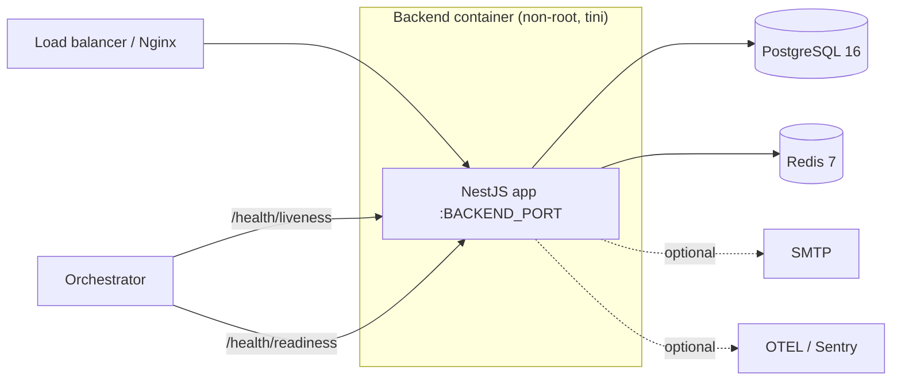

### 20.2 Compose & environments

`docker-compose` brings up the data tier (Postgres, Redis) and the app; a production override adds **start-first zero-downtime** deploys and rollback. Environments are selected by `NODE_ENV` and the layered `.env` files ([§16.3](#163-configuration-hierarchy)). Configuration per environment:

| Variable group | Dev | Production |
| --- | --- | --- |
| `SWAGGER_ENABLED` | true | typically false |
| `AUTH_COOKIE_SECURE` | false | **true** |
| Helmet CSP | relaxed | **enabled** |
| `LOG_LEVEL` | debug/info | info/warn (JSON + rotation) |
| Prisma logging | warn/error | warn/error, minimal format |

### 20.3 Health, scaling & rollback

- **Liveness** keeps a wedged process from lingering; **readiness** gates traffic until Postgres/Redis are reachable ([§15.4](#154-health-probes)).
- **Scaling:** run N stateless replicas behind the LB; JWT auth needs no shared session store for REST.
- **Rollback:** the release/rollback CI workflows re-deploy the previous image; because the ledger is append-only and migrations are additive-first, rolling back the app is safe.
- **Graceful shutdown:** on SIGTERM, shutdown hooks stop runtimes, quit Redis, and disconnect Prisma so in-flight work drains cleanly.

### 20.4 CI/CD

CI runs typecheck, lint (zero warnings), tests, and build; CodeQL scans for vulnerabilities; Dependabot proposes dependency bumps. A boot smoke-test guards against DI/wiring errors that unit tests miss (a lesson learned — see the platform's memory of the boot smoke-test gap).

---

## 21. Testing Strategy

### 21.1 The pyramid

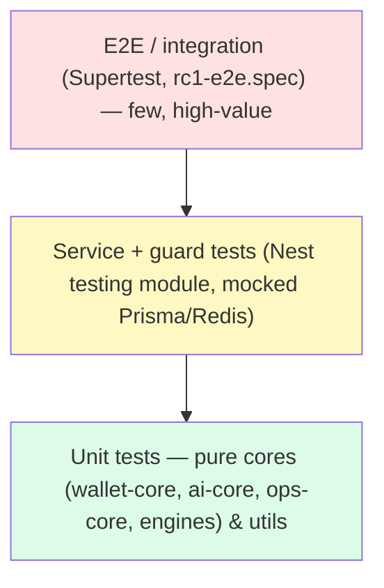

The base is broad and cheap because the **hard logic is pure**: money algebra, fairness derivation, fraud/risk scoring, circuit-breaker/retry state machines, and each game engine are all deterministic functions tested in isolation with no Nest, DB, or network. The `PermissionsGuard` spec and `crypto.util` spec are examples of focused unit tests already in the tree.

### 21.2 Levels

| Level | Tooling | What it covers |
| --- | --- | --- |
| Unit | Jest | Pure packages, guards, utilities, per-engine determinism |
| Integration | `@nestjs/testing` | Services with mocked `PrismaService`/`RedisService`; guard/interceptor behaviour |
| E2E | Jest + Supertest (`jest-e2e.json`) | HTTP flows end-to-end (`rc1-e2e.spec`, `integration/`) |
| Contract | shared `types` | Same DTO/response types on client and server prevent drift |

### 21.3 What we insist on testing

- **Every money path**: reserve/commit/release, idempotent replay, overdraft rejection, and **trial-balance reconciliation** (Σ debits = Σ credits).
- **Every fairness path**: `verify()` hash + seed re-derivation.
- **Authorization**: `all`/`any` permission modes, super-admin bypass, unauthenticated denial (already covered by `permissions.guard.spec`).
- **Resilience**: breaker open/half-open/close transitions; retry backoff + DLQ.

### 21.4 Coverage posture (honest)

Coverage is **targeted, not uniform**: the pure cores and security/money paths are the priority; thin controllers and DTOs are exercised through integration/e2e rather than chased for line coverage. CI runs the full suite with `--passWithNoTests` tolerance during scaffolding, and the boot smoke-test catches wiring regressions the unit suite can't.

---

## 22. Extension Guide

The platform is built to be extended **without touching existing architecture**. Each recipe below stays inside a module boundary and reuses the global cross-cutting machinery.

### 22.1 Add a module

1. `nest g module modules/<name>` (or hand-create `<name>.module.ts`).
2. Add services/controllers; import only what you depend on.
3. Register the module in `app.module.ts` (mind ordering: after `WalletEngineModule` if it settles money).
4. It is **protected by default** — declare `@Public()`/`@Roles()`/`@RequirePermissions()` explicitly.

### 22.2 Add a service

Create an `@Injectable()` in `modules/<name>/services`, inject `PrismaService`/`RedisService`/other services, keep it pure of HTTP concerns, register it in the module's `providers` (and `exports` if other modules need it). Unit-test it with mocked dependencies.

### 22.3 Add a controller

Thin controller in `modules/<name>`: DTO-validated inputs, delegate to a service, return **raw** data (the envelope is global). Add `@ApiTags`/`@ApiOperation` for Swagger. Declare authz decorators; add a new permission to `rbac.constants.ts` if needed (the bootstrap seeds it on next boot).

### 22.4 Add a WebSocket gateway

Create `<name>.gateway.ts` with `@WebSocketGateway({ namespace: '/<name>', cors: wsCorsOptions })`, authenticate in `handleConnection` via `verifyAccessToken` (copy the runtime/wallet gateway pattern), scope broadcasts to rooms, register it in the module's `providers`.

### 22.5 Add a Redis cache / background job / breaker

- **Cache:** inject `RedisService`; namespace your keys; set a TTL; `del` on write to invalidate.
- **Job:** inject `QueueService`; `process('<queue>', handler)` once at startup; `enqueue('<queue>', payload)` to schedule; rely on backoff + DLQ.
- **Breaker:** wrap a fragile call in `circuitBreaker.execute('<name>', () => call())`.

### 22.6 Add a runtime plugin (a new game engine)

The highest-leverage extension — and it requires **zero platform changes**:

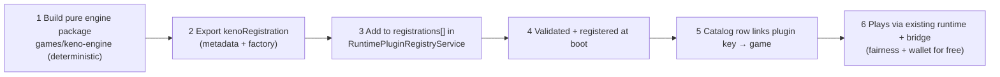

1. Implement the engine as a pure `(config, seed, bet) → outcome` package under `games/`.
2. Export a `PluginRegistration` (`metadata` with a kebab-case `key` + a `factory`).
3. Add it to the `registrations` array in `RuntimePluginRegistryService`.
4. Boot validation accepts it; the resolver/loader can now instantiate it.
5. Add a catalog row whose plugin key matches; assets via `AssetService`.
6. It immediately inherits provable fairness, server-authoritative runtime, reconnect, and — via `WalletBridgeService` — fully-ledgered real-money settlement.

### 22.7 Add a backend API safely — the rules

| Rule | Why |
| --- | --- |
| Never mutate a balance outside `WalletEngineService` | One money path; invariants + ledger |
| Never open a second Prisma/Redis client | One pool; lifecycle managed by infra modules |
| Never read `process.env` outside `env.validation.ts` | Typed, validated config only |
| Never return the raw entity if it holds secrets | Map to a view type; redaction is not a substitute |
| Always declare authz explicitly | Default-authenticated is a floor, not a ceiling |
| Always make money operations idempotent | Safe retries |

---

## 23. Coding Standards

### 23.1 NestJS conventions

- **One concern per provider.** Orchestrators (e.g. `AuthService`) coordinate focused services (`TokenService`, `SessionService`, …) rather than becoming god-objects.
- **Constructor injection only.** No service locators, no `new`-ing dependencies. This is what keeps modules testable and boundaries honest.
- **Global cross-cutting via `APP_*` providers.** Guards, interceptors, and the filter are registered once; never re-implemented per controller.
- **Thin controllers, fat-free services.** Controllers do validation + delegation; services never touch `req`/`res`.

### 23.2 TypeScript

- `strict` + `noUncheckedIndexedAccess`. Handle `undefined` explicitly.
- Prefer `type`-only imports for types (`import type { … }`), matching the codebase.
- No `any` at boundaries; use `@gaming-platform/types` for shared shapes.
- Money is a **string `Decimal`** end-to-end; never a JS `number`.

### 23.3 Naming & structure

| Artifact | Convention | Example |
| --- | --- | --- |
| Module | `<feature>.module.ts` | `wallet-engine.module.ts` |
| Service | `<concern>.service.ts` | `settlement.service.ts` |
| Controller | `<resource>.controller.ts` | `sessions.controller.ts` |
| Gateway | `<feature>.gateway.ts` | `runtime.gateway.ts` |
| DTO | `<action>.dto.ts` | `login.dto.ts` |
| Guard/Interceptor/Filter | `<name>.<kind>.ts` | `permissions.guard.ts` |
| Permission slug | `resource:action` | `wallets:adjust` |

### 23.4 Error handling & logging

- Throw typed errors (`AppError` / Nest HTTP exceptions); let the global filter render them.
- Log with a `context` and never log secrets (the redactor is a backstop, not a license).
- Include actionable metadata (ids, durations) but not payloads with PII.

### 23.5 Dependency injection & transactions

- Export a service only when another module truly needs it; otherwise keep it module-private.
- Do money/multi-write work inside a Prisma interactive transaction; keep the transaction body minimal.
- Prefer idempotent operations for anything a client or queue might retry.

### 23.6 Git & review workflow

Feature branches off the default branch; conventional commits; PRs must be green on typecheck + lint (zero warnings) + tests + build before merge; Husky pre-commit (lint-staged) and commit-msg hooks keep the tree clean; security-sensitive areas (auth, wallet) get extra review. A change is **done** when it compiles, lints clean, has tests for new money/fairness logic, builds in prod mode, and updates this document or an ADR when it changes architecture.

---

## 24. Architecture Decisions

Each ADR records the **decision, the problem, the alternatives, the trade-offs, and the consequences.**

### ADR-001 — Modular monolith over microservices
- **Problem:** how to structure a broad platform (auth, wallet, games, tournaments, AI, ops) for one team.
- **Decision:** a single NestJS process with hard module boundaries.
- **Alternatives:** microservices; serverless functions.
- **Trade-offs:** (+) transactional integrity across domains, one deploy, fast local dev, no network tax; (−) shared fate on a crash, must scale as a unit.
- **Consequences:** boundaries are drawn where a future split would cut; global modules encapsulate cross-cutting concerns.

### ADR-002 — Stateless JWT auth with Redis-backed revocation
- **Problem:** authorize every request without a DB hit, yet retain the ability to revoke.
- **Decision:** short-lived access JWT (claims incl. permissions) + Redis jti blacklist + session liveness check.
- **Alternatives:** server-side sessions only; long-lived tokens.
- **Trade-offs:** (+) horizontal scale, fast checks; (−) permission changes apply at next refresh.
- **Consequences:** logout/kill are instant via blacklist+session; access tokens kept to 15m.

### ADR-003 — Refresh token rotation with family reuse detection
- **Problem:** refresh tokens are long-lived and theft-prone.
- **Decision:** rotate on every use; bind to a family; burn the family on reuse.
- **Trade-offs:** (+) replay is detected and neutralized; (−) more token bookkeeping.
- **Consequences:** a stolen refresh token self-destructs the moment the real client (or attacker) reuses a rotated one.

### ADR-004 — Two-layer RBAC with permission claims in the token
- **Problem:** need both coarse roles and fine-grained actions, checked cheaply.
- **Decision:** `RolesGuard` + `PermissionsGuard`; permissions resolved at login and carried as claims.
- **Trade-offs:** (+) zero-DB authz; (−) token size, refresh-latency for changes.
- **Consequences:** default-authenticated posture; `super_admin` bypass; catalog seeded on boot.

### ADR-005 — Single authoritative wallet engine
- **Problem:** many features move money; correctness must be centralized.
- **Decision:** one `WalletEngineService`; all balance mutations go through it.
- **Alternatives:** per-feature balance writes.
- **Trade-offs:** (+) one place to audit/lock/ledger; (−) a hot dependency.
- **Consequences:** other modules are facades; game engines use the bridge only.

### ADR-006 — Mandatory wallet bridge for game integration (demo no-op)
- **Problem:** engines must settle money without being able to corrupt balances.
- **Decision:** `WalletBridgeService` is the only integration seam; demo mode is a safe no-op.
- **Trade-offs:** (+) enforced reserve→commit flow, free demo isolation; (−) engines can't optimize money paths themselves (by design).
- **Consequences:** every real-money round is ledgered; demo never touches funds.

### ADR-007 — Double-entry ledger + trial-balance reconciliation
- **Problem:** prove the money is always correct.
- **Decision:** post balanced player/house journals; reconcile Σ debits = Σ credits.
- **Trade-offs:** (+) provable integrity, standard accounting; (−) more writes per movement.
- **Consequences:** `wallet-inconsistency` alert at threshold 0; append-only corrections via rollback.

### ADR-008 — Four-layer wallet concurrency control
- **Problem:** prevent balance corruption under concurrency.
- **Decision:** Redis lock + row lock + optimistic version + non-negative algebra.
- **Trade-offs:** (+) correctness even if one layer lapses; (−) complexity.
- **Consequences:** contended writes serialize; conflicts retry; overdrafts throw.

### ADR-009 — Idempotency keys on money operations
- **Problem:** client/queue retries must not double-apply.
- **Decision:** replay returns the original result; references namespaced per leg.
- **Trade-offs:** (+) safe retries; (−) callers must supply keys.
- **Consequences:** at-least-once delivery is safe end-to-end.

### ADR-010 — Server-authoritative runtime with provable fairness
- **Problem:** outcomes must be tamper-proof and verifiable.
- **Decision:** in-memory authoritative runtimes; commit-reveal seeds + HMAC derivation; deterministic engines.
- **Trade-offs:** (+) fairness is reproducible arithmetic; (−) live state is in memory (scaling seam).
- **Consequences:** replay and dispute resolution from stored seeds.

### ADR-011 — Plugin registry validated at boot
- **Problem:** add games without changing platform code, and never ship a broken one.
- **Decision:** engines register as validated plugins; malformed ones prevent boot.
- **Trade-offs:** (+) extensibility + fail-fast; (−) all engines loaded in-process.
- **Consequences:** adding a game is a registration + catalog row.

### ADR-012 — Zod env validation, fail fast
- **Problem:** misconfiguration should never reach runtime.
- **Decision:** validate all env at boot; refuse to start on error; typed facade for access.
- **Trade-offs:** (+) no stringly-typed config, no mid-request surprises; (−) must keep schema current.
- **Consequences:** `process.env` is read in exactly one file.

### ADR-013 — Pure cores in workspace packages
- **Problem:** critical logic must be testable and reusable.
- **Decision:** money/fairness/scoring/resilience live in framework-free packages.
- **Trade-offs:** (+) trivial unit testing, shared with frontend; (−) a package boundary to maintain.
- **Consequences:** NestJS stays a thin delivery layer.

### ADR-014 — Global observability + in-process resilience
- **Problem:** production visibility and reliability without operational sprawl.
- **Decision:** global metrics/tracing/log interceptor; in-process breaker + retry queue + alerts.
- **Trade-offs:** (+) no extra infra to run; (−) queue/breaker state is not durable across restarts.
- **Consequences:** durable broker is a future upgrade behind the same seam.

### ADR-015 — Secret redaction in the logging pipeline
- **Problem:** logs are a common leak vector (OWASP A09).
- **Decision:** a Winston format recursively redacts a denylist (tokens, secrets, seeds, PAN/CVV).
- **Trade-offs:** (+) careless logging can't leak; (−) denylist must be maintained.
- **Consequences:** even fairness seeds never appear in logs.

### ADR-016 — Uniform response envelope + global exception filter
- **Problem:** clients need one predictable success/error shape.
- **Decision:** `TransformInterceptor` wraps success; `AllExceptionsFilter` normalizes every error.
- **Trade-offs:** (+) uniform parsing, correlation ids; (−) a wrapper layer.
- **Consequences:** handlers return raw data; errors carry machine codes + requestId.

---

## 25. Future Backend Roadmap

Sequenced by dependency and value. None of these require rewrites — each slots into an existing seam.

| Phase | Initiative | What changes | Seam it uses |
| --- | --- | --- | --- |
| **1. Persistence** | Durable queue + outbox | Replace in-memory `QueueService` with a broker (BullMQ/Redis-streams) and add a transactional outbox for settlement events | `QueueService` interface |
| **1. Persistence** | Read replicas | Route heavy analytics/reporting reads to a Postgres replica | `PrismaService` |
| **2. Real-time scale** | Socket.IO Redis adapter | Cross-instance broadcasting; move live runtime state to Redis for stateless WS | `ActiveRuntimeService`, gateways |
| **2. Multiplayer** | Shared-room games | Multi-player crash/tournaments across instances | Runtime + gateways |
| **3. Horizontal scale** | Autoscaling stateless tier | N replicas + LB; sticky-less after WS/runtime externalization | Deployment |
| **3. Messaging** | Domain events bus | Emit domain events (bet settled, user registered) for async consumers | Service layer |
| **4. Microservices (if needed)** | Extract wallet/runtime | Promote the hardest-isolated modules to services along existing boundaries | Module seams |
| **4. Cloud** | Managed data tier + secrets manager | Managed Postgres/Redis, KMS-backed secrets, OTLP export | Config + infra modules |
| **5. Analytics** | Streaming pipeline | CDC → warehouse for BI, offline model training | Ledger + analytics |
| **5. Security** | Hardware-backed keys, WebAuthn | Passkeys alongside TOTP; signed audit chain | `auth`, `security` |
| **5. Observability** | Full OpenTelemetry | Export traces/metrics to a collector; distributed tracing across services | `operations` |

**Guiding principle for all of the above:** the current architecture already *names the seams* (bridge, queue, active-runtime, prisma, config). Evolution means swapping an implementation behind a seam, not re-plumbing the platform.

---

## Appendix

### A. Glossary

| Term | Definition |
| --- | --- |
| **Modular monolith** | One deployable process with hard internal module boundaries |
| **Guard** | Nest class deciding whether a request may proceed (authn/authz/throttle) |
| **Interceptor** | Nest class wrapping a handler to transform in/out or observe (envelope, metrics, logging) |
| **Filter** | Nest class that turns a thrown value into an HTTP response |
| **Pipe** | Nest class that validates/transforms inputs (the global `ValidationPipe`) |
| **DTO** | Data Transfer Object — a validated request/response shape |
| **jti** | JWT ID — unique per token; used for the access-token blacklist |
| **Token family** | A lineage of rotated refresh tokens; reuse of a rotated member burns the family |
| **Reservation** | Locked stake (`available → locked`) awaiting settlement |
| **Double-entry** | Every movement posts balanced debit + credit entries |
| **Trial balance** | Σ debits vs. Σ credits — proves the ledger is balanced |
| **Idempotency key** | Client-supplied key so a replayed money op returns the original result |
| **Provably fair** | Commit-reveal seed scheme letting players verify outcomes |
| **Runtime** | A live, server-authoritative instance of a game engine |
| **Circuit breaker** | Fails fast when a dependency is unhealthy to prevent cascades |
| **Envelope** | The uniform `ApiResponse` wrapper around every response |

### B. Module Index

`config`, `logger`, `database`, `redis`, `security`, `mailer`, `authorization`, `operations`, `wallet-engine`, `wallet`, `transactions`, `health`, `auth`, `users`, `games`, `runtime`, `crash`, `dice`, `roulette`, `card`, `sports`, `tournament`, `ai`, `notifications`, `analytics`, `admin`.

### C. Service Index (selected)

| Domain | Services |
| --- | --- |
| Auth | `AuthService`, `PasswordService`, `TokenService`, `SessionService`, `DeviceService`, `TwoFactorService`, `ApiKeyService`, `EmailVerificationService`, `PasswordResetService`, `AccountSecurityService` |
| Authz | `RbacService`, `RolesService`, `RbacBootstrapService` |
| Security | `GeoService`, `SecurityEventService`, `AuditService` |
| Wallet | `WalletEngineService`, `WalletBalanceService`, `WalletTransactionService`, `WalletLedgerService`, `ReservationService`, `SettlementService`, `BonusWalletService`, `RewardWalletService`, `SystemAccountService`, `WalletReportingService`, `WalletBridgeService` |
| Runtime | `RuntimePluginRegistryService`, `ActiveRuntimeService`, `RuntimeSessionService`, `ProvablyFairService` |
| AI | `RecommendationService`, `FraudService`, `RiskService`, `SearchService`, `AnalyticsAiService`, `LlmService`, `PromptManager` |
| Operations | `MetricsService`, `TracingService`, `LogBufferService`, `MonitoringService`, `OperationsHealthService`, `AlertService`, `QueueService`, `CircuitBreakerService` |
| Tournament | `TournamentService`, `LeaderboardService`, `MissionService`, `AchievementService`, `RewardService`, `SeasonService` |
| Games | `CatalogService`, `CategoryService`, `ProviderService`, `CollectionService`, `FavoritesService`, `RatingService`, `RecentlyPlayedService`, `RecommendationService`, `LauncherService`, `AssetService`, `GameCacheService`, `GameAdminService` |

### D. Controller Index

| Prefix | Controllers |
| --- | --- |
| `auth`, `auth/{sessions,devices,2fa,api-keys,security}` | Auth suite |
| `users` | `UsersController` |
| `games`, `game-categories`, `game-providers`, `game-collections`, `favorites`, `game-ratings`, `recently-played` | Catalog |
| `wallet`, `wallet-engine`, `transactions` | Wallet + txns |
| `runtime`, `crash`, `dice`, `roulette`, `card`, `sports`, `tournaments` | Play |
| `ai` | `AiController` |
| `notifications`, `analytics`, `operations`, `health` | Platform |
| `admin`, `admin/{users,roles,audit,games,game-*,wallet,crash,dice,roulette,sports,tournaments,ai,operations}` | Admin control plane |

### E. Gateway Index

| Namespace | Gateway |
| --- | --- |
| `/runtime` | `RuntimeGateway` |
| `/wallet` | `WalletGateway` |
| `/crash` | `CrashGateway` |
| `/dice` | `DiceGateway` |
| `/roulette` | `RouletteGateway` |
| `/sports` | `SportsGateway` |
| `/tournament` | `TournamentGateway` |
| `/notifications` | `NotificationsGateway` |
| `/operations` | `OperationsGateway` |

### F. Guard Index

| Guard | Scope | Effect |
| --- | --- | --- |
| `ThrottlerGuard` | global | Rate limiting |
| `JwtAuthGuard` | global | Authentication (unless `@Public`) |
| `RolesGuard` | global | Coarse role authorization |
| `PermissionsGuard` | global | Fine-grained permission authorization |
| `ApiKeyGuard` | opt-in | M2M `x-api-key` authentication |

### G. Environment Variable Reference (backend)

| Group | Variables |
| --- | --- |
| Runtime | `NODE_ENV`, `APP_NAME`, `TZ` |
| Server | `BACKEND_PORT`, `BACKEND_HOST`, `API_PREFIX`, `API_VERSION`, `CORS_ORIGINS` |
| Rate limit | `RATE_LIMIT_TTL`, `RATE_LIMIT_LIMIT` |
| Docs/log | `SWAGGER_ENABLED`, `SWAGGER_PATH`, `LOG_LEVEL` |
| Database | `DATABASE_URL` |
| Redis | `REDIS_HOST`, `REDIS_PORT`, `REDIS_PASSWORD`, `REDIS_URL`, `REDIS_TTL` |
| Auth/JWT | `JWT_ACCESS_SECRET`, `JWT_ACCESS_EXPIRES_IN`, `JWT_REFRESH_SECRET`, `JWT_REFRESH_EXPIRES_IN`, `BCRYPT_SALT_ROUNDS`, `AUTH_COOKIE_NAME`, `AUTH_COOKIE_DOMAIN`, `AUTH_COOKIE_SECURE`, `REMEMBER_ME_EXPIRES_IN` |
| Security policy | `ACCOUNT_LOCK_MAX_ATTEMPTS`, `ACCOUNT_LOCK_DURATION_MINUTES`, `MAX_CONCURRENT_SESSIONS`, `PASSWORD_BREACH_CHECK_ENABLED`, `EMAIL_VERIFICATION_TTL_HOURS`, `PASSWORD_RESET_TTL_MINUTES`, `TWO_FACTOR_ISSUER` |
| URLs/mail | `APP_WEB_URL`, `MAIL_HOST`, `MAIL_PORT`, `MAIL_SECURE`, `MAIL_USER`, `MAIL_PASSWORD`, `MAIL_FROM` |
| Optional obs | `SENTRY_DSN`, `OTEL_EXPORTER_OTLP_ENDPOINT` |

### H. Technology Versions

| Package | Version |
| --- | --- |
| `@nestjs/core` / `common` | ^10.4.15 |
| `@nestjs/jwt` / `passport` | ^10.2.0 / ^10.0.3 |
| `@nestjs/swagger` | ^8.1.0 |
| `@nestjs/terminus` | ^10.2.3 |
| `@nestjs/throttler` | ^6.4.0 |
| `@nestjs/websockets` / `platform-socket.io` | ^10.4.15 |
| `@prisma/client` / `prisma` | ^6.2.1 |
| `socket.io` | ^4.8.1 |
| `ioredis` | ^5.4.2 |
| `zod` | ^3.24.1 |
| `winston` / `nest-winston` | ^3.17.0 / ^1.10.2 |
| `passport-jwt` | ^4.0.1 |
| `helmet` / `compression` / `cookie-parser` | ^8.0.0 / ^1.7.5 / ^1.4.7 |
| `otplib` / `qrcode` | ^12.0.1 / ^1.5.4 |
| `jest` / `supertest` | ^29.7.0 / ^7.0.0 |
| `typescript` | ^5.7.3 |

### I. Useful References

- [System Architecture (master)](./SYSTEM_ARCHITECTURE.md)
- Source: [`apps/backend/src`](../apps/backend/src)
- Bootstrap: [`main.ts`](../apps/backend/src/main.ts) · Root module: [`app.module.ts`](../apps/backend/src/app.module.ts)
- Config: [`config/`](../apps/backend/src/config) · Logger: [`logger/winston.config.ts`](../apps/backend/src/logger/winston.config.ts)
- Wallet engine: [`modules/wallet-engine`](../apps/backend/src/modules/wallet-engine)
- Runtime: [`modules/runtime`](../apps/backend/src/modules/runtime)
- Operations: [`modules/operations`](../apps/backend/src/modules/operations)
- API docs (running): `/{SWAGGER_PATH}` (default `/docs`)

---

*End of document — Backend Architecture, Gaming Universe Platform. Maintained by the Office of the CTO. Changes to backend architecture must update this document or record a new ADR in [§24](#24-architecture-decisions).*
