# Database Architecture — Gaming Universe Platform

> The authoritative engineering handbook for the platform's persistence tier: the PostgreSQL 16 database defined by the Prisma schema in [`packages/database`](../packages/database). This document is a companion to the master [System Architecture](./SYSTEM_ARCHITECTURE.md), the [Backend Architecture](./BACKEND_ARCHITECTURE.md), and the [Frontend Architecture](./FRONTEND_ARCHITECTURE.md). Where those describe the platform, its server tier, and its client, this one documents the **data model** in depth — every domain, every relationship strategy, every index, and, above all, **why** each schema decision was made. It is written so a senior PostgreSQL/Prisma engineer can understand, optimize, extend, and maintain the database *without reading the schema directly*.

| Field | Value |
| --- | --- |
| **Project Name** | Gaming Universe Platform |
| **Component** | Database / Persistence Tier (`@gaming-platform/database`) |
| **Database Engine** | PostgreSQL 16 |
| **ORM / Schema Toolkit** | Prisma 6.2 (multi-file schema, `prisma-client-js`) |
| **Schema Version** | A3 — 126 models · 69 enums · 16 schema files |
| **Document Version** | 1.0 |
| **Prepared By** | Office of the CTO — Principal Database Architecture Group |
| **Status** | Authoritative — single source of truth for the database |
| **Last Updated** | V3.0 · Phase 3.1 · Documentation Sprint 4 |

### Revision History

| Version | Date / Milestone | Author | Notes |
| --- | --- | --- | --- |
| 0.1 | Database GA | Database Architecture Group | Core auth, wallet, games, sessions schema |
| 0.5 | V2.0-A1 | Database Architecture Group | Operations/infra tables, analytics roll-ups |
| 0.8 | V3.0 Sprints 1–5 | Database Architecture Group | Game runtime save-state + replay, promotions, content, localization |
| 1.0 | V3.0-P3.1 · Sprint 4 | Office of the CTO | Definitive database handbook — this document |

---

## Table of Contents

1. [Executive Summary](#1-executive-summary)
2. [Technology Stack](#2-technology-stack)
3. [High-Level Database Architecture](#3-high-level-database-architecture)
4. [Schema Overview](#4-schema-overview)
5. [Domain Organization](#5-domain-organization)
6. [Entity Relationship Model](#6-entity-relationship-model)
7. [Primary Keys](#7-primary-keys)
8. [Relationships](#8-relationships)
9. [Constraints](#9-constraints)
10. [Indexing Strategy](#10-indexing-strategy)
11. [Authentication Schema](#11-authentication-schema)
12. [Wallet Schema](#12-wallet-schema)
13. [Game Schema](#13-game-schema)
14. [Tournament Schema](#14-tournament-schema)
15. [Analytics Schema](#15-analytics-schema)
16. [Administration Schema](#16-administration-schema)
17. [Infrastructure Schema](#17-infrastructure-schema)
18. [Data Lifecycle](#18-data-lifecycle)
19. [Transactions](#19-transactions)
20. [Performance](#20-performance)
21. [Security](#21-security)
22. [Migration Strategy](#22-migration-strategy)
23. [Extension Guide](#23-extension-guide)
24. [Architecture Decision Records](#24-architecture-decision-records)
25. [Future Database Roadmap](#25-future-database-roadmap)
26. [Appendix](#appendix)

---

## 1. Executive Summary

### 1.1 Purpose

The database is the **system of record** for the entire Gaming Universe Platform. It holds every durable fact the platform depends on: identities and credentials, the money supply (wallets, a double-entry ledger, payments), the game catalog and its runtime save-state, play sessions and results, tournaments and progression, promotions, content, localization, analytics roll-ups, and the operational/administrative control plane. As the [Backend Architecture](./BACKEND_ARCHITECTURE.md#9-database-access-layer) establishes, **truth lives on the server** — and within the server, truth ultimately lives *here*, in PostgreSQL.

The schema is defined once, declaratively, in a **multi-file Prisma schema** (16 files under [`packages/database/prisma/schema`](../packages/database/prisma/schema)) that Prisma merges at validate/generate time to produce a single, fully-typed client consumed by the NestJS backend.

### 1.2 Database philosophy

Six convictions shape every model in the schema:

1. **Relational integrity is non-negotiable.** A gaming platform moves money and must prove it. That demands ACID transactions, foreign keys, unique constraints, and a relational engine — PostgreSQL — not a document store. See [ADR-001](#24-architecture-decision-records).
2. **The database enforces what it can; the application enforces the rest.** Structural invariants (uniqueness, referential integrity, non-null) live in the schema as constraints. Business invariants that need computation (non-negative balances, double-entry balancing) are enforced by the wallet engine *on top of* the schema's guarantees ([Backend §12](./BACKEND_ARCHITECTURE.md#12-wallet-backend)).
3. **Money is exact, never floating point.** Every monetary value is `Decimal(38, 18)` — a fixed-precision numeric wide enough for any currency and any crypto sub-unit. A JS `number` never touches a balance.
4. **Time-ordered identity.** Every primary key is a **UUIDv7** — globally unique like a UUID, but time-sortable like a sequence, which is decisive for index locality and pagination. See [§7](#7-primary-keys).
5. **Append-only where it counts.** The financial ledger, audit trails, and security events are append-only records; corrections are compensating entries, never destructive edits. History is evidence.
6. **Soft-delete user-facing data, hard-delete ephemera.** User-facing entities carry `deletedAt` so deletion is reversible and auditable; lookup/ephemeral rows are hard-deleted.

### 1.3 Architecture goals

| Goal | How the schema achieves it |
| --- | --- |
| Financial correctness | Double-entry ledger, `Decimal(38,18)`, optimistic-lock `version`, idempotency keys |
| Referential integrity | Foreign keys with explicit `onDelete`/`onUpdate` on every relation |
| Query performance | ~250 purpose-built indexes; composite indexes for hot access paths |
| Index locality & pagination | UUIDv7 time-ordered keys + `createdAt` composite indexes |
| Extensibility | Data-driven registries (launchers, collections, currencies) — add rows, not code |
| Auditability | `AuditTrail`, `SecurityEvent`, `AdminAuditLog`, append-only ledger |
| Maintainability | Domain-partitioned schema files, uniform naming conventions |

### 1.4 Design principles

- **One convention, everywhere.** UUIDv7 keys, camelCase Prisma fields → snake_case columns/tables via `@map`/`@@map`, `createdAt`/`updatedAt` timestamps, `deletedAt` soft delete, `Decimal(38,18)` money, `JsonB` for structured blobs. Consistency is a feature — a new engineer learns the rules once.
- **Domain partitioning.** The schema is split by bounded context into 16 files, mirroring the backend's module boundaries so a change to "wallet" touches `wallet.prisma` and nowhere else.
- **Explicit cascade semantics.** Every relation declares its delete behavior deliberately — `Cascade` for owned children, `Restrict` for financial references, `SetNull` for optional links. See [§8](#8-relationships).
- **Lookup tables over magic strings** where the set is operationally managed (currencies, transaction types/statuses, payment gateways), and **enums** where the set is fixed and code-referenced (69 enums).
- **Indexes follow queries, not hunches.** Every index maps to a real access pattern in the backend services.

### 1.5 Non-goals

- **Not a document database.** We do not model core entities as JSON blobs; `JsonB` is used only for genuinely schemaless metadata, configuration, and captured runtime state.
- **Not event-sourced.** State is stored as current rows plus append-only ledger/audit logs — not a global replayable event stream. See [ADR-018](#24-architecture-decision-records).
- **Not sharded or multi-region (yet).** The current topology is a single primary with a documented path to replicas and partitioning ([§25](#25-future-database-roadmap)).
- **Not the cache.** Hot, ephemeral, self-expiring state lives in Redis ([Backend §10](./BACKEND_ARCHITECTURE.md#10-redis-architecture)); the database holds durable truth.

---

## 2. Technology Stack

Every choice below is grounded in [`packages/database/package.json`](../packages/database/package.json) and [`base.prisma`](../packages/database/prisma/schema/base.prisma).

| Technology | Version | Role | Why (vs. alternatives) |
| --- | --- | --- | --- |
| **PostgreSQL** | 16 | Primary datastore | ACID transactions, `SELECT … FOR UPDATE` row locks, rich constraints, `numeric` for exact money, `JsonB`, partial/composite indexes, and native `gen_random_uuid`/UUID support. A relational engine is *mandatory* for a double-entry ledger. Chosen over MySQL (weaker `JsonB`/CTE story, historically weaker constraint support) and any document store (no cross-row transactions). See [ADR-001](#24-architecture-decision-records). |
| **Prisma ORM** | 6.2 | Schema toolkit + typed client | A single declarative schema generates a fully type-safe client, first-class migrations, and **interactive transactions** the wallet engine depends on. The multi-file schema keeps 126 models organized by domain. Chosen over TypeORM (weaker types, decorator-heavy) and Knex/raw SQL (no generated types). See [ADR-002](#24-architecture-decision-records). |
| **UUIDv7 keys** | via `@default(uuid(7))` | Primary keys | Globally unique *and* time-ordered — the best of both worlds for a distributed-ready, high-write system. Time-ordering gives B-tree index locality and natural chronological pagination. Chosen over auto-increment `bigint` (leaks counts, coordination on inserts, not distributed-safe) and UUIDv4 (random → index fragmentation). See [§7](#7-primary-keys) and [ADR-003](#24-architecture-decision-records). |
| **`Decimal(38, 18)`** | `@db.Decimal(38,18)` | Money & rates | Exact fixed-point arithmetic with 20 integer + 18 fractional digits — enough for any fiat and crypto sub-unit. Chosen over `float`/`double` (rounding errors are unacceptable for money) and integer-minor-units (inflexible across currencies with different decimals). See [ADR-004](#24-architecture-decision-records). |
| **`JsonB`** | `@db.JsonB` | Schemaless payloads | Binary JSON with indexing/query support for genuinely variable data: `metadata`, `config`, runtime `state`, replay `frames`, security-event context. Chosen over `text` JSON (no operators/indexing) and over-normalizing inherently variable data into rigid columns. See [ADR-005](#24-architecture-decision-records). |
| **Redis** (adjacent) | 7 | Cache / locks / ephemeral | Not part of the schema, but the database's partner: sessions, locks, rate-limit counters, and cache live in Redis so PostgreSQL is reserved for durable truth. See [Backend §10](./BACKEND_ARCHITECTURE.md#10-redis-architecture) and [§20.4](#204-caching--redis). |
| **Prisma Migrate** | 6.2 | Migration system | Versioned, reviewable SQL migrations generated from schema diffs, applied via `migrate deploy` in CI before boot. Chosen over hand-written SQL migrations (drift risk) and auto-`db push` in prod (no history). See [§22](#22-migration-strategy). |
| **tsup / tsx** | 8.3 / 4.19 | Client build + seed | The generated client is bundled by `tsup` and exported from the workspace package; `tsx` runs the TypeScript seed. |

### 2.0 Alternatives & trade-offs, in prose

The table states the choices; the two most consequential deserve fuller reasoning.

**PostgreSQL vs. a document database (MongoDB).** A document store is tempting for a platform with variable data (game configs, runtime state) and would simplify some reads. But the platform's *core* is money, and money demands multi-row ACID transactions, foreign keys, and exact numerics — precisely what a document store trades away for horizontal write scaling we do not yet need. The decisive scenario is the double-entry ledger: settling a bet must atomically debit a player wallet, credit the house, write a transaction, and post two ledger entries, and it must be impossible for any subset of those to persist. That is a textbook relational transaction. We keep the *benefits* of a document model exactly where they belong — `JsonB` columns for genuinely schemaless fields — inside a relational engine, rather than making the whole database schemaless to serve a minority of columns.

**PostgreSQL vs. MySQL.** Both are capable relational engines. PostgreSQL wins here on the specifics the schema leans on: first-class `JsonB` with indexing and operators (used for metadata/config/runtime state), a mature `numeric` type for `Decimal(38,18)`, native UUID support, partial and expression indexes, and stronger constraint/CTE ergonomics. For a schema this constraint-heavy and JSON-adjacent, PostgreSQL is the lower-friction choice.

**Prisma vs. raw SQL / a query builder.** Raw SQL offers maximum control, and the wallet engine does drop to `SELECT … FOR UPDATE` where it must. But hand-writing and hand-typing 126 tables' worth of queries would be a correctness and maintenance liability. Prisma generates a fully-typed client from one schema, gives us migrations with history, and — critically — provides **interactive transactions** with a clean API. Where Prisma's query API is insufficient, `$queryRaw`/`$executeRaw` remain available, so we lose no power. The type-safety payoff is compounded by sharing `@gaming-platform/types` with the frontend, making a column's type consistent from database to browser.

### 2.1 The client package

[`packages/database/src/index.ts`](../packages/database/src/index.ts) wraps the generated Prisma client for the whole monorepo:

- `createPrismaClient()` builds a configured client — log level `['query','warn','error']` in development, `['warn','error']` in production; `errorFormat` `minimal` in production (no query/parameter leakage).
- A **process-wide singleton** is attached to `globalThis.__prisma` in development to survive hot-reloads and avoid exhausting the connection pool.
- The backend's `PrismaService` ([Backend §9.1](./BACKEND_ARCHITECTURE.md#91-prisma-as-the-single-data-mapper)) extends `PrismaClient` and manages the connection lifecycle inside NestJS; scripts and tooling use the exported singleton.
- The generator targets both `native` (local dev) and `linux-musl-openssl-3.0.x` (Alpine containers), so the same schema runs identically in local and Dockerized environments.

---

## 3. High-Level Database Architecture

### 3.1 Where the database sits

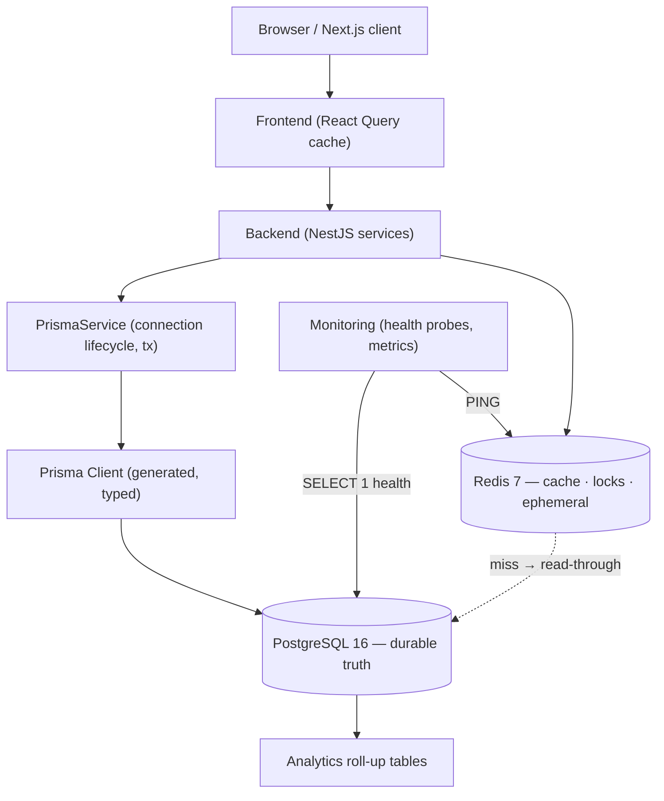

The database is reached **only** through Prisma, which is reached only through the backend's `PrismaService`. No other tier — not the frontend, not a gateway — touches PostgreSQL directly. This single choke point is what makes the data layer auditable and its access patterns knowable.

### 3.2 Read/write topology

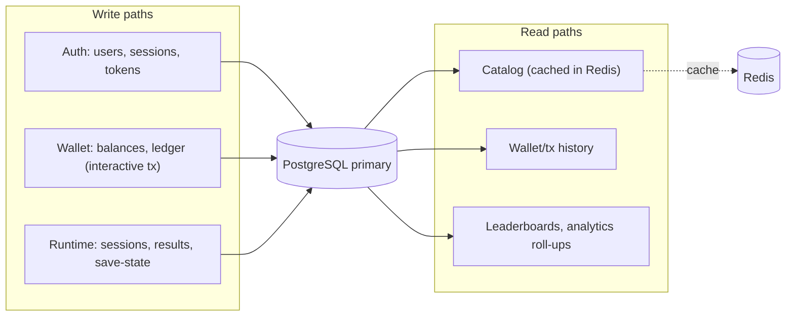

Today all reads and writes target a **single primary**. The schema is designed so that heavy analytical reads (roll-up tables, leaderboards) can later be routed to a read replica with no application change ([§25](#25-future-database-roadmap)), because those tables are already isolated from the transactional hot path.

### 3.3 Multi-file schema composition

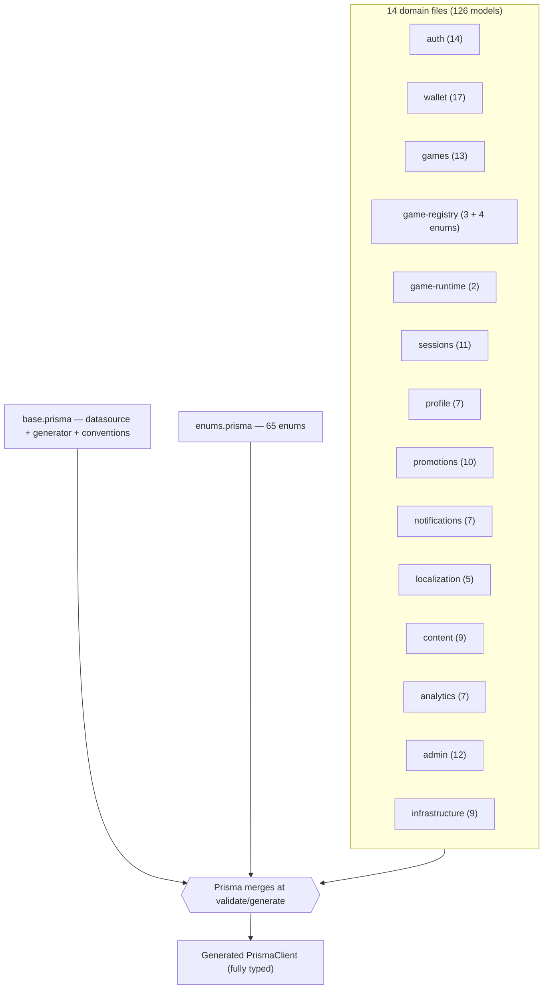

Prisma's multi-file schema (configured via `prisma.schema = "prisma/schema"` in `package.json`) lets us **partition 126 models by domain** while still producing one merged, cross-referential client. This is the schema-level equivalent of the backend's modular monolith: hard file boundaries, one cohesive artifact.

---

## 4. Schema Overview

### 4.1 By the numbers

| Metric | Value |
| --- | --- |
| **Total models (tables)** | **126** |
| **Total enums** | **69** (65 in `enums.prisma`, 4 in `game-registry.prisma`) |
| **Schema files** | 16 (`base` + `enums` + 14 domain files) |
| **Primary-key strategy** | UUIDv7 on every model (`@default(uuid(7)) @db.Uuid`) |
| **Money type** | `Decimal(38, 18)` (points `Decimal(38,8)`, multipliers `Decimal(10,4)`) |
| **Structured data** | `JsonB` for metadata/config/state |
| **Soft delete** | `deletedAt` on user-facing entities |
| **Approx. indexes** | ~250 (`@@index` + `@@unique` + implicit unique/FK) |

### 4.2 Models per domain file

| File | Models | Enums | Domain |
| --- | --- | --- | --- |
| `auth.prisma` | 14 | — | Identity, RBAC, sessions, tokens, devices, security |
| `wallet.prisma` | 17 | — | Wallets, balances, ledger, payments, bonuses |
| `games.prisma` | 13 | — | Catalog, versions, assets, ratings, favorites |
| `game-registry.prisma` | 3 | 4 | Launchers, collections |
| `game-runtime.prisma` | 2 | — | Save-state, replays |
| `sessions.prisma` | 11 | — | Play sessions, results, stats, leaderboards, achievements, rewards |
| `profile.prisma` | 7 | — | Profiles, preferences, avatar, KYC, documents |
| `promotions.prisma` | 10 | — | Promotions, coupons, campaigns, referrals, loyalty |
| `notifications.prisma` | 7 | — | Notifications, templates, announcements, inbox |
| `localization.prisma` | 5 | — | Geo (country/state/city), language, timezone |
| `content.prisma` | 9 | — | CMS, banners, pages, FAQ, media |
| `analytics.prisma` | 7 | — | Events, activity, revenue/traffic/geo roll-ups |
| `admin.prisma` | 12 | — | Admin RBAC, audit, feature flags, settings, logs |
| `infrastructure.prisma` | 9 | — | Storage, webhooks, jobs, queues, rate limits, API usage |
| `enums.prisma` | — | 65 | All cross-domain enumerations |
| `base.prisma` | — | — | Datasource + generator + conventions |

### 4.3 Conventions (the rules every model obeys)

| Concern | Convention | Example |
| --- | --- | --- |
| Primary key | UUIDv7 | `id String @id @default(uuid(7)) @db.Uuid` |
| Field ↔ column naming | camelCase field, snake_case column | `passwordHash String @map("password_hash")` |
| Table naming | snake_case plural | `@@map("users")` |
| Audit timestamps | `createdAt` / `updatedAt` | `@default(now())` / `@updatedAt` |
| Soft delete | `deletedAt DateTime?` | user-facing entities only |
| Money | `Decimal(38,18)` | `amount Decimal @db.Decimal(38, 18)` |
| Structured blob | `JsonB` | `metadata Json? @db.JsonB` |
| Foreign key column | `<relation>Id` + `@db.Uuid` | `userId String @map("user_id") @db.Uuid` |

### 4.4 Views & generated client

The schema declares **no database views**; read models are composed by Prisma queries in backend services (and, for heavy analytics, by dedicated roll-up *tables* — see [§15](#15-analytics-schema)). The generated `PrismaClient` is the single typed access surface; the same `@gaming-platform/types` shapes flow to the frontend, so a column's type is consistent from database to browser ([Frontend §9](./FRONTEND_ARCHITECTURE.md#9-api-layer)).

---

## 5. Domain Organization

The schema is partitioned into bounded contexts. Each domain exists because it owns a distinct slice of platform truth with its own lifecycle and access patterns.

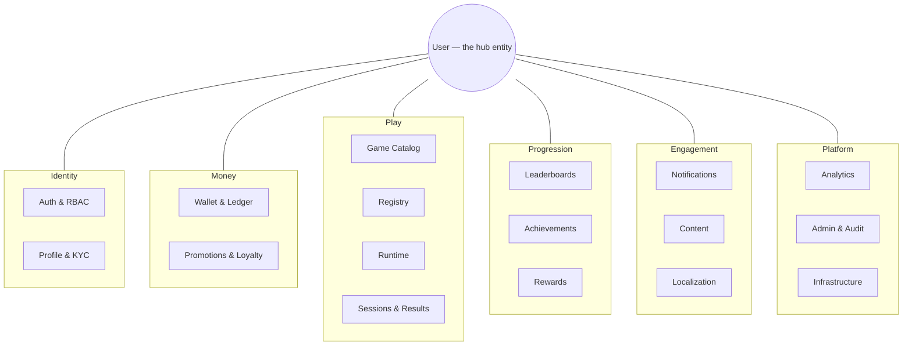

### 5.1 Domain catalog

| Domain | Schema file(s) | Purpose — why it exists |
| --- | --- | --- |
| **Authentication** | `auth` | Own identity, credentials, RBAC, sessions, tokens, devices, and the security event log — the trust foundation the whole platform stands on |
| **Users** | `auth` (`User`) | The central hub entity; nearly every other domain hangs off `User` |
| **Profiles** | `profile` | Separate *presentation/compliance* identity (display name, KYC, documents, avatar, addresses) from *auth* identity — different lifecycle, different sensitivity |
| **Wallet** | `wallet` | The money supply: wallets, balances, double-entry ledger, payments, bonuses — the financial backbone |
| **Transactions** | `wallet` (`WalletTransaction`, `Ledger`, `LedgerEntry`) | Immutable record of every value movement, with idempotency and reconciliation |
| **Games** | `games` | The catalog: what can be played, its metadata, assets, ratings, and player interactions |
| **Runtime** | `game-runtime` | Persisted save-state and replays for the server-authoritative runtime engine |
| **Sessions** | `sessions` | Play sessions, per-player participation, and results — the record of what happened |
| **Leaderboards** | `sessions` (`Leaderboard`, `LeaderboardEntry`) | Competitive ranking, periodized |
| **Rewards** | `sessions` (`Reward`, `RewardClaim`) | Grantable rewards and their claim lifecycle |
| **Achievements** | `sessions` (`Achievement`, `UserAchievement`) | Unlockable accomplishments and per-user progress |
| **Tournament / Progression** | `sessions` + `promotions` | Competitive events, seasons, XP, missions (see [§14](#14-tournament-schema)) |
| **Notifications** | `notifications` | Multi-channel messaging: notifications, templates, announcements, inbox |
| **Analytics** | `analytics` | Behavioural events + pre-aggregated revenue/traffic/geo/device roll-ups |
| **Operations / Administration** | `admin` | Admin RBAC, audit, feature flags, settings, system/error logs |
| **AI** | (reads existing tables) | The AI module reads `GameResult`, `LoginHistory`, `Device`, deposits, sessions — it owns no tables ([Backend §14](./BACKEND_ARCHITECTURE.md#14-ai-backend)) |
| **Content** | `content` | CMS: banners, carousels, pages, FAQ, help, media library |
| **Localization** | `localization` | Geo hierarchy (country → state → city), languages, timezones |
| **Infrastructure** | `infrastructure` | Storage, webhooks, background jobs/queues, scheduled tasks, API usage, rate-limit logs |
| **Settings** | `admin` (`SystemSetting`, `ApplicationSetting`, `FeatureFlag`) | Runtime configuration and feature gating, environment-scoped |
| **Community / Social** | `notifications` (`InboxMessage`), `promotions` (`ReferralHistory`) | Player-to-player messaging and referral graph |
| **Inventory / Cosmetics** | `profile` (`Avatar`), `promotions` (rewards) | Cosmetic identity and grantable items |
| **Promotions** | `promotions` | Promotions, coupons, campaigns, referrals, loyalty tiers/points |
| **Payments** | `wallet` (`PaymentGateway`, `PaymentMethod`, `DepositRequest`, `WithdrawalRequest`, `Refund`) | The cash in/out boundary between the ledger and the outside world |

**Why separate profile from auth:** authentication data (password hash, 2FA secret, session tokens) and profile data (display name, KYC documents, addresses) have different sensitivity, different change frequency, and different access control. Splitting them keeps the hot auth path lean and isolates PII/compliance data into `profile` where it can be governed separately.

### 5.2 Cross-domain relationships

Although the schema is partitioned into 16 files, the domains are richly interlinked — the boundaries are organizational, not isolating. The most important cross-domain edges (and why they exist):

| Edge | Crosses | Why it exists |
| --- | --- | --- |
| `User` → everything | auth → all | `User` is the aggregate root; nearly every domain scopes its rows to a user |
| `Wallet` → `Currency` | wallet → wallet (lookup) | Every balance is denominated; `Restrict` protects the currency master |
| `BonusWallet` → `Promotion` | wallet → promotions | Bonus liability is attributable to the campaign that granted it |
| `WalletTransaction` → `GameResult` (via `reference`) | wallet ↔ sessions | A settlement's `reference` ties money to the round that produced it |
| `Game` → `GameLauncher`/`GameCategory`/`GameProvider` | games → registry | Data-driven catalog composition |
| `GameSession` → `GameRuntimeState`/`GameReplay` | sessions → runtime | Live/persisted state for a played session |
| `Address` → `Country`/`State`/`City` | profile → localization | Geo hierarchy for compliance and restrictions |
| `AdminUser` → `User` | admin → auth | Back-office identity is a facet of a platform identity |
| `WithdrawalRequest` → `AdminUser` (`reviewedById`) | wallet → admin | Withdrawal approval workflow is human-in-the-loop |

The design principle: **model the real relationship even when it crosses a domain boundary.** A foreign key from `BonusWallet` into `Promotion`, or from `WithdrawalRequest` into `AdminUser`, expresses a true business fact (this bonus came from that promotion; this withdrawal was approved by that admin) that reporting and compliance depend on. The domain files organize the models for humans; the foreign keys model reality for the database. This is the schema-level analogue of the backend's module graph ([Backend §3.3](./BACKEND_ARCHITECTURE.md#33-module-dependency-graph)) — hard file boundaries with explicit, deliberate cross-boundary references.

---

## 6. Entity Relationship Model

### 6.1 High-level ER — the User hub

`User` is the gravitational center of the schema: it carries **50+ relations** across every domain. The diagram shows the principal clusters.

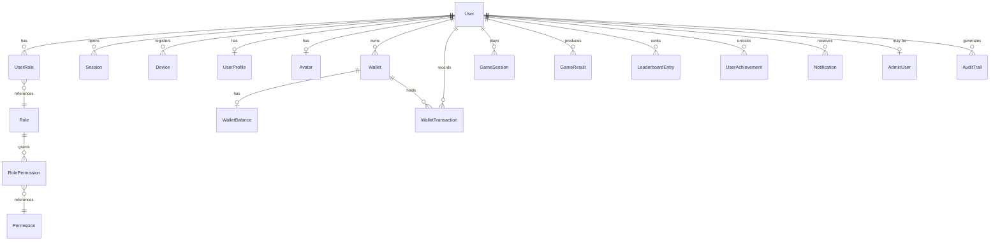

### 6.2 Wallet domain ER (the financial core)

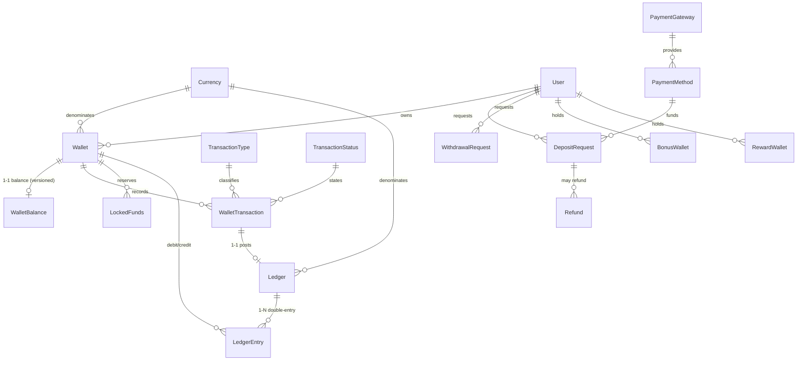

### 6.3 Game & session domain ER

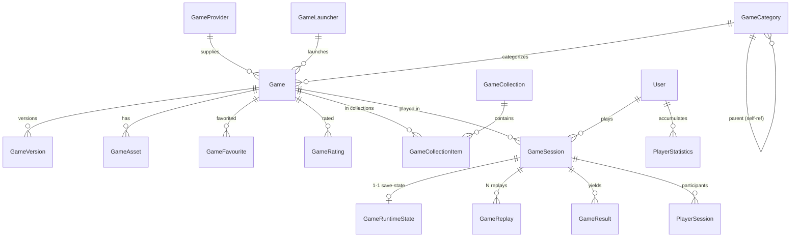

### 6.4 Relationship hierarchy, cardinality & ownership

| Pattern | Example | Cardinality | Ownership / cascade |
| --- | --- | --- | --- |
| Aggregate root → owned child | `User → Session` | 1-N | User owns; `onDelete: Cascade` |
| Entity → 1-1 satellite | `Wallet → WalletBalance` | 1-1 | Wallet owns; `Cascade` |
| Entity → 1-1 satellite | `GameSession → GameRuntimeState` | 1-1 | Session owns; `Cascade` |
| Financial reference | `WalletTransaction → User/Wallet/Currency` | N-1 | `onDelete: Restrict` (protect history) |
| Optional link | `Session → Device` | N-1 optional | `onDelete: SetNull` |
| Many-to-many via join | `Role ↔ Permission` (via `RolePermission`) | M-N | join owns; `Cascade` both sides |
| Self-reference | `GameCategory → parent`, `City → State → Country` | tree | `SetNull`/`Restrict` per level |
| Reflexive relation | `WalletTransaction → relatedTransaction` | 1-N self | `SetNull` |

**Ownership drives cascade.** The rule the schema follows: if a parent *owns* a child's existence (a user owns their sessions), deleting the parent cascades. If a child merely *references* something that must be preserved for integrity (a transaction references a user), the reference is `Restrict` — you cannot delete a user with financial history, which is exactly the protection a money system needs. Optional, non-owning links (`Session.device`) use `SetNull`.

### 6.5 Profile & compliance ER

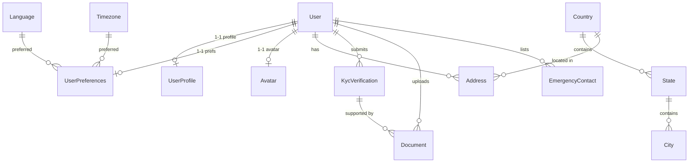

The profile cluster deliberately keeps **compliance-sensitive** data (`KycVerification`, `Document`, `Address`) hanging off `User` but in its own domain file, and links addresses into the localization geo-hierarchy (`Country → State → City`). This is what lets the platform apply KYC-level gating and geo restrictions without polluting the auth or wallet paths.

### 6.6 Engagement ER (promotions, notifications, content)

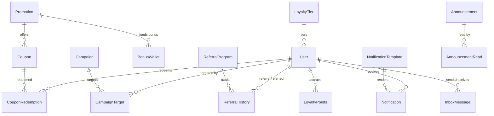

Note the cross-domain link `Promotion → BonusWallet.sourcePromotionId`: a promotion that grants a bonus is traceable from the marketing domain into the financial domain, so bonus liability is always attributable to the campaign that created it — a requirement for financial reporting and responsible-gaming controls.

---

## 7. Primary Keys

### 7.1 UUIDv7 everywhere

Every model declares its primary key identically:

```
id String @id @default(uuid(7)) @db.Uuid
```

`uuid(7)` generates a **UUID version 7**: a 128-bit identifier whose leading bits are a Unix-millisecond timestamp, followed by random bits. Stored as native PostgreSQL `uuid` (16 bytes), it is globally unique like any UUID but **monotonically increasing over time** like a sequence.

### 7.2 Why UUIDv7 (the decisive trade-off)

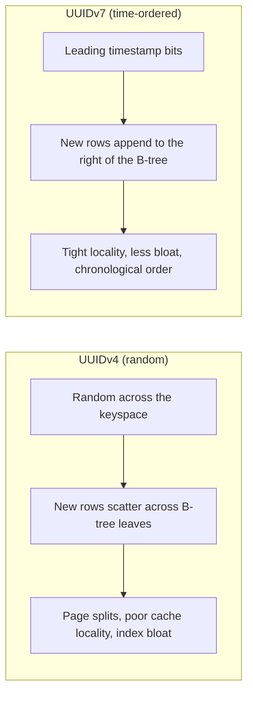

| Property | Auto-increment `bigint` | UUIDv4 | **UUIDv7 (chosen)** |
| --- | --- | --- | --- |
| Globally unique | No (per-table) | Yes | **Yes** |
| Distributed-safe (generate anywhere) | No | Yes | **Yes** |
| Time-ordered | Yes | No | **Yes** |
| Index locality on insert | Excellent | Poor (random) | **Excellent** |
| Leaks row counts / is guessable | Yes | No | **No** |
| Natural chronological pagination | Yes | No | **Yes** |
| Storage | 8 bytes | 16 bytes | 16 bytes |

UUIDv7 gives us the **distribution-friendliness and non-enumerability of a UUID** with the **insert locality and sortability of a sequence** — critical for a high-write gaming platform. Random UUIDv4 keys fragment B-tree indexes (every insert lands in a random leaf, causing page splits and cache misses); UUIDv7 inserts append near the right edge, keeping indexes compact. The only cost over `bigint` is 8 extra bytes per key — a price we pay gladly to avoid exposing counts and to keep IDs generatable without a central sequence. See [ADR-003](#24-architecture-decision-records).

### 7.3 Generation & ordering

Keys are generated by Prisma/PostgreSQL at insert time via `@default(uuid(7))` — the application never mints IDs. Because the value embeds creation time, `ORDER BY id` approximates `ORDER BY createdAt`, and many hot indexes pair the key's natural order with an explicit `createdAt` for stable, seek-based pagination ([§10](#10-indexing-strategy)).

---

## 8. Relationships

Every relation in the schema declares explicit `onDelete` and `onUpdate` behavior. This section catalogs the strategies and *why* each is used.

### 8.1 Cardinality patterns

| Type | Definition | Schema examples |
| --- | --- | --- |
| **One-to-one** | A row relates to at most one row | `Wallet ↔ WalletBalance`, `User ↔ UserProfile`, `User ↔ Avatar`, `GameSession ↔ GameRuntimeState`, `WalletTransaction ↔ Ledger` |
| **One-to-many** | A parent has many children | `User → Session`, `Game → GameVersion`, `Ledger → LedgerEntry`, `Leaderboard → LeaderboardEntry` |
| **Many-to-many** | Via explicit join model | `Role ↔ Permission` (`RolePermission`), `Game ↔ GameTag` (`GameTagMapping`), `Game ↔ GameCollection` (`GameCollectionItem`) |
| **Self-referencing** | A row references its own table | `GameCategory.parentId`, `MediaFolder.parentId`, `City → State → Country`, `WalletTransaction.relatedTransactionId`, `InboxMessage.parentId`, `RefreshToken.replacedById` |

### 8.2 Explicit join tables

The platform models many-to-many relationships with **explicit join models** rather than Prisma's implicit `@relation` join tables. This is deliberate: an explicit join model can carry its own columns and constraints.

| Join model | Connects | Extra columns / constraints |
| --- | --- | --- |
| `UserRole` | User ↔ Role | `assignedById`, `expiresAt`, `@@unique([userId, roleId])` |
| `RolePermission` | Role ↔ Permission | `@@unique([roleId, permissionId])` |
| `GameTagMapping` | Game ↔ GameTag | `@@unique([gameId, tagId])` |
| `GameCollectionItem` | Game ↔ GameCollection | `position`, `@@unique([collectionId, gameId])` |
| `AdminRolePermission` | AdminRole ↔ AdminPermission | `@@unique([roleId, permissionId])` |

**Why explicit joins:** RBAC needs `expiresAt` and `assignedById` on the user↔role link; collections need `position` for ordering. An implicit join table couldn't carry those. Explicit join models also make the unique constraint (one link per pair) visible and enforceable.

### 8.3 Cascade strategy — the three delete behaviors

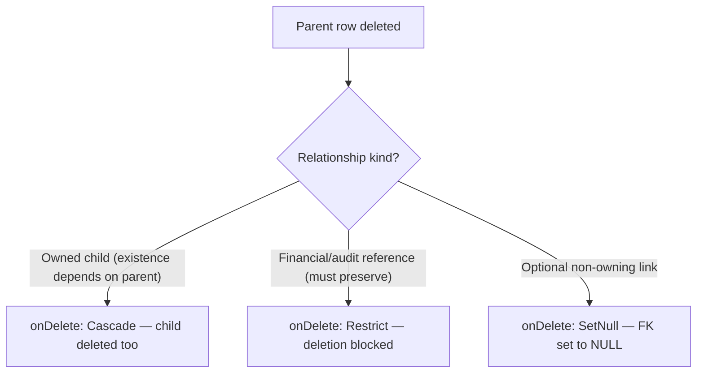

| Behavior | When used | Representative relations |
| --- | --- | --- |
| **Cascade** | The child cannot meaningfully exist without the parent | `User → Session/Device/RefreshToken/UserRole`, `Wallet → WalletBalance`, `Ledger → LedgerEntry`, `GameSession → GameRuntimeState/GameReplay`, `Role → RolePermission` |
| **Restrict** | The reference protects financial or historical integrity | `WalletTransaction → User/Wallet/Currency/Type/Status`, `LedgerEntry → Wallet/Currency`, `DepositRequest/WithdrawalRequest → User/Wallet/Currency`, `Wallet → Currency` |
| **SetNull** | Optional link whose loss is acceptable | `Session → Device`, `SecurityEvent → User`, `WalletTransaction → relatedTransaction`, `RefreshToken → Session`, `Ledger → WalletTransaction`, `User → LoyaltyTier` |

**Why `Restrict` on money:** you must never be able to delete a `Currency`, `Wallet`, or `User` out from under a `WalletTransaction` or `LedgerEntry`. Restrict turns "delete a user with a ledger history" into a database-level error, forcing the correct path (soft-delete/close the account) and guaranteeing the ledger never dangles. `onUpdate: Cascade` is used broadly so that a rare PK change propagates — though UUIDv7 keys are effectively immutable in practice.

---

## 9. Constraints

Constraints are the schema's first line of defense — the invariants PostgreSQL enforces regardless of application bugs.

### 9.1 Constraint inventory

| Constraint kind | Mechanism | Count/examples |
| --- | --- | --- |
| **Primary keys** | `@id` (UUIDv7) | 126 — one per model |
| **Foreign keys** | `@relation` with `references` | Hundreds — every relation, with explicit delete/update rules |
| **Single-column unique** | `@unique` | `User.email`, `User.username`, `User.phoneNumber`, `User.referralCode`, `Session.tokenHash`, `RefreshToken.tokenHash`, `WalletTransaction.reference`, `WalletTransaction.idempotencyKey`, `Ledger.reference`, `ApiKey.keyHash`/`prefix`, `Device.fingerprint`, `Currency.code`, … |
| **Composite unique** | `@@unique([...])` | See table below |
| **Not-null** | required fields (no `?`) | Enforced per column |
| **Enum domains** | 69 Postgres enum types | Restrict columns to a fixed value set |
| **Defaults** | `@default(...)` | `now()`, `0`, enum defaults, `false` |

### 9.2 Composite unique constraints (business rules in the schema)

These encode real business rules as database guarantees:

| Model | Composite unique | Business rule it enforces |
| --- | --- | --- |
| `Wallet` | `[userId, currencyId, type]` | One wallet per user, per currency, per type |
| `Permission` | `[resource, action]` | One permission per resource/action pair |
| `RolePermission` | `[roleId, permissionId]` | A permission is granted to a role at most once |
| `UserRole` | `[userId, roleId]` | A role is assigned to a user at most once |
| `TwoFactorAuth` | `[userId, method]` | One 2FA config per method per user |
| `ExchangeRate` | `[baseCurrencyId, quoteCurrencyId, validFrom]` | One rate per pair per effective time |
| `GameVersion` | `[gameId, version]` | Version numbers unique per game |
| `GameFavourite` / `RecentlyPlayed` / `GameRating` / `GameReview` | `[userId, gameId]` | One per user per game |
| `PlayerStatistics` | `[userId, gameId]` | One stats row per user per game |
| `LeaderboardEntry` | `[leaderboardId, userId]` | One entry per user per leaderboard |
| `UserAchievement` | `[userId, achievementId]` | Unlock recorded once |
| `NotificationPreference` | `[userId, type, channel]` | One preference per channel |
| `FeatureFlag` | `[key, environment]` | One flag value per environment |
| `ApplicationSetting` | `[scope, key, environment]` | One setting per scope/key/env |
| `GeoAnalytics` / `RevenueAnalytics` / `TrafficAnalytics` | `[periodDate, …]` | One roll-up row per period bucket |

### 9.3 Business rules beyond the schema

Some invariants cannot be expressed as SQL constraints and are enforced by the application on top of the schema's guarantees:

| Invariant | Enforced by | Reference |
| --- | --- | --- |
| Balance never negative | `Balance` value object (non-negative algebra) | [Backend §12.1](./BACKEND_ARCHITECTURE.md#121-balance-model) |
| Ledger balances (Σ debit = Σ credit) | Double-entry posting + `reconcile()` trial balance | [Backend §12.6](./BACKEND_ARCHITECTURE.md#126-double-entry-ledger--house-wallet) |
| `total = available + locked + pending` | Wallet engine on every write | [Backend §12](./BACKEND_ARCHITECTURE.md#12-wallet-backend) |
| Optimistic concurrency | `WalletBalance.version` check + retry | [§19.3](#193-optimistic-locking) |
| Idempotent money ops | `WalletTransaction.idempotencyKey` unique + replay | [§19.5](#195-idempotency) |

The `idempotencyKey` and `reference` **unique** constraints are the schema-level half of the idempotency story: even if the application logic had a race, the database would reject a duplicate `reference`, making double-settlement structurally impossible.

### 9.4 Defense in depth — where each invariant is enforced

A useful way to reason about correctness is to ask, for any given invariant, *how many independent layers protect it.* The schema is designed so the most critical invariants are guarded at multiple levels:

| Invariant | DB constraint | App logic | Result |
| --- | --- | --- | --- |
| No duplicate settlement | `reference`/`idempotencyKey` unique | replay check in engine | Two independent guards |
| One wallet per user/currency/type | `@@unique([userId, currencyId, type])` | `getOrCreateWallet` upsert | Race-safe creation |
| No orphaned ledger entry | FK `Restrict` on wallet/currency | append-only posting | History never dangles |
| Balance never negative | — (not expressible in SQL) | `Balance` non-negative algebra | App-enforced |
| Ledger balances | — | double-entry + `reconcile()` | App-enforced, DB-verified |
| No lost update | — | `version` optimistic lock + retry | App-enforced |

The pattern is intentional: **structural invariants** (uniqueness, referential integrity, one-row-per-key) are pushed *down* into the database where they hold regardless of application bugs; **computed invariants** (non-negativity, double-entry balancing) that SQL cannot express live in the wallet engine but are *verified* against the database's honest record via reconciliation. Neither layer fully trusts the other — the database rejects a duplicate `reference` even if the engine's replay check somehow missed it, and the engine's `reconcile()` would surface a discrepancy even if a constraint were mis-specified. This mutual distrust is what makes the money model trustworthy.

---

## 10. Indexing Strategy

The schema carries roughly **250 indexes** (`@@index`, `@@unique`, and implicit FK/PK indexes). Every one maps to a real query in the backend. Indexes are not free — they cost write throughput and storage — so each is justified by a read path.

### 10.1 The read-vs-write trade-off

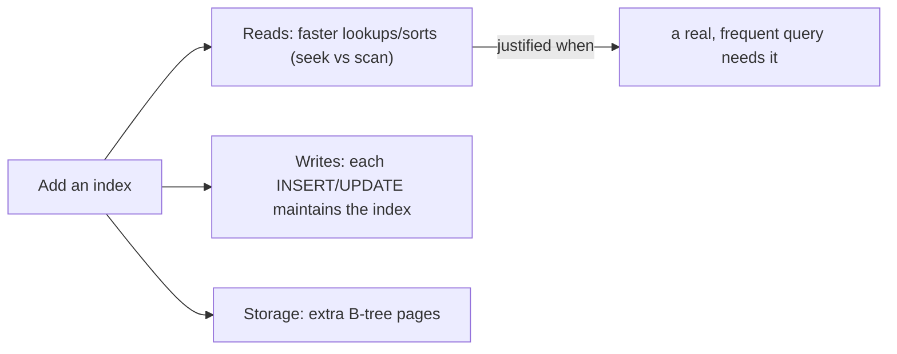

The platform's rule: **index the access path, not the column.** A composite `@@index([userId, createdAt])` serves "this user's rows, newest first" — the single most common query shape in the app — in one seek, whereas separate single-column indexes could not satisfy the sort efficiently.

### 10.2 Index catalog by purpose

| Purpose | Representative indexes | Query served |
| --- | --- | --- |
| **User activity timelines** | `WalletTransaction([userId, createdAt])`, `LoginHistory([userId, createdAt])`, `GameResult([userId, playedAt])`, `Notification([userId, createdAt])`, `AuditTrail([userId, createdAt])`, `Event([userId, occurredAt])` | "This user's X, newest first" |
| **Session/token liveness** | `Session([status, expiresAt])`, `RefreshToken([status, expiresAt])`, `RefreshToken([family])`, `PasswordResetToken([status, expiresAt])` | Active-session lookups, token-family reuse detection |
| **Wallet hot paths** | `Wallet([userId])`, `Wallet([currencyId])`, `Wallet([status])`, `WalletTransaction([walletId, createdAt])`, `LockedFunds([walletId])`, `LockedFunds([status])` | Balance reads, reservation lifecycle |
| **Ledger & reconciliation** | `LedgerEntry([ledgerId])`, `LedgerEntry([walletId, createdAt])`, `LedgerEntry([direction])`, `Ledger([postedAt])` | Trial-balance grouping by direction; per-wallet ledger |
| **Catalog discovery** | `Game([status, visibility])`, `Game([status, isFeatured])`, `Game([isTrending, trendingScore])`, `Game([popularityScore])`, `Game([publishedAt])`, `Game([categoryId])`, `Game([providerId])` | Featured/trending/popular/new shelves ([Frontend §13](./FRONTEND_ARCHITECTURE.md#13-gaming-experience)) |
| **Leaderboards** | `LeaderboardEntry([leaderboardId, rank])`, `Leaderboard([period, isActive])` | Top-N by rank within an active period |
| **Play analytics** | `GameResult([gameId, playedAt])`, `GameResult([outcome])`, `GameSession([status])`, `PlayerStatistics([userId])` | Fraud/risk features, game stats |
| **Security & audit** | `SecurityEvent([userId, createdAt])`, `SecurityEvent([type])`, `AuditTrail([entityType, entityId])`, `AdminAuditLog([resource, resourceId])` | Forensic queries |
| **Infra / ops** | `BackgroundJob([status, scheduledAt])`, `BackgroundJob([status, priority])`, `RateLimitLog([identifier, windowStart])`, `ApiUsage([endpoint, occurredAt])`, `ErrorLog([fingerprint])` | Queue draining, rate limiting, error grouping |
| **Analytics roll-ups** | `RevenueAnalytics([periodDate])`, `TrafficAnalytics([periodDate])`, `GeoAnalytics([periodDate])`, `DeviceAnalytics([periodDate])` | Period-bucketed reporting |

### 10.3 Leaderboard optimization

`LeaderboardEntry` carries `@@unique([leaderboardId, userId])` (one entry per player) *and* `@@index([leaderboardId, rank])`. The composite `(leaderboardId, rank)` index is a **covering access path for the canonical query** — "top N of leaderboard L ordered by rank" — which becomes an index range scan returning rows already in rank order, no sort node required. This is why leaderboard reads stay fast even as entries grow. See [§14](#14-tournament-schema).

### 10.4 Wallet optimization

The wallet's write path is protected by `WalletBalance.version` (optimistic lock) and served by `Wallet([userId])` (fetch a user's wallets) and `WalletTransaction([walletId, createdAt])` (a wallet's transaction history). Reconciliation groups `LedgerEntry` by `direction` — served by `LedgerEntry([direction])` — so the trial-balance query (`GROUP BY direction`) is index-assisted rather than a full scan. See [Backend §12.6](./BACKEND_ARCHITECTURE.md#126-double-entry-ledger--house-wallet).

### 10.5 How a composite index serves a query (worked example)

Consider the single most common query in the app — "the current user's wallet transactions, newest first, page 1":

```
SELECT … FROM wallet_transactions
WHERE user_id = $1
ORDER BY created_at DESC
LIMIT 20;
```

Without help, PostgreSQL would filter by `user_id` (via the FK index) and then **sort** the matching rows by `created_at` — an extra sort node that grows with the user's history. The schema instead provides `@@index([userId, createdAt])`. Because the index is ordered first by `user_id` and then by `created_at`, PostgreSQL can:

1. **Seek** directly to the `user_id = $1` range (the leading column), and
2. **Read rows already in `created_at` order** off the index (the second column) — no sort node.

The result is an **index range scan** whose cost is proportional to the 20 rows returned, not to the user's total history. This is why the schema pairs an owner FK with a time column in dozens of composite indexes ([ADR-017](#24-architecture-decision-records)) rather than relying on single-column indexes — a single-column `user_id` index would still force a sort. The same shape (`[leaderboardId, rank]`, `[gameId, playedAt]`, `[status, expiresAt]`) recurs wherever the access pattern is "filter by X, ordered by Y."

### 10.6 Analytics optimization

Analytics avoids scanning transactional tables by maintaining **pre-aggregated roll-up tables** (`RevenueAnalytics`, `TrafficAnalytics`, `GeoAnalytics`, `DeviceAnalytics`), each keyed by a `periodDate` bucket with a `@@unique` on the bucket dimensions and an index on `periodDate`. Reporting queries hit small, purpose-built tables instead of aggregating millions of raw `Event` rows on the fly. See [§15](#15-analytics-schema).

---

## 11. Authentication Schema

The `auth` domain (14 models) is the trust foundation. It is the data model behind [Backend §7](./BACKEND_ARCHITECTURE.md#7-authentication-architecture) and [§8](./BACKEND_ARCHITECTURE.md#8-authorization-architecture).

### 11.1 Model map

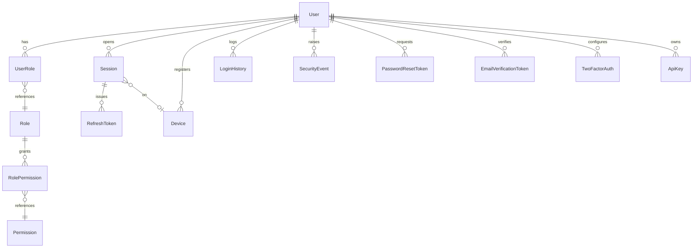

### 11.2 Model reference

| Model | Table | Purpose | Key columns / constraints |
| --- | --- | --- | --- |
| `User` | `users` | Central identity | unique `email`/`username`/`phoneNumber`/`referralCode`; `status`, `authProvider`, `failedLoginCount`, `lockedUntil`, `twoFactorEnabled`; soft-delete |
| `Role` | `roles` | RBAC role | unique `name`/`slug`, `level`, `isSystem` |
| `Permission` | `permissions` | Fine-grained permission | unique `[resource, action]`, unique `slug` |
| `RolePermission` | `role_permissions` | Role↔Permission join | unique `[roleId, permissionId]` |
| `UserRole` | `user_roles` | User↔Role join | unique `[userId, roleId]`, `assignedById`, `expiresAt` |
| `Session` | `sessions` | Login session | unique `tokenHash`, `status`, `expiresAt`, index `[status, expiresAt]` |
| `RefreshToken` | `refresh_tokens` | Rotating refresh token | unique `tokenHash`, `family`, `replacedById`, `status` |
| `Device` | `devices` | Trusted device | unique `fingerprint`, `isTrusted` |
| `LoginHistory` | `login_history` | Login audit | `success`, `failureReason`, `ipAddress`, geo |
| `SecurityEvent` | `security_events` | Security event log | `type`, `severity`, `metadata` JsonB |
| `PasswordResetToken` | `password_reset_tokens` | Reset flow | unique `tokenHash`, `status`, `expiresAt` |
| `EmailVerificationToken` | `email_verification_tokens` | Email verification | unique `tokenHash`, `status`, `expiresAt` |
| `TwoFactorAuth` | `two_factor_auth` | TOTP/2FA config | `secret`, `backupCodes[]`, unique `[userId, method]` |
| `ApiKey` | `api_keys` | M2M credential | unique `keyHash`/`prefix`, `scopes[]`, `status` |

### 11.3 Design notes — why the auth model looks like this

- **Tokens are stored as hashes, never plaintext.** `Session.tokenHash`, `RefreshToken.tokenHash`, `PasswordResetToken.tokenHash`, `EmailVerificationToken.tokenHash`, and `ApiKey.keyHash` all store a SHA-256 hash. A database compromise never yields usable tokens. This mirrors the backend's `sha256`/`generateToken` handling ([Backend §7.4](./BACKEND_ARCHITECTURE.md#74-sessions-refresh-rotation--reuse-detection)).
- **RefreshToken `family` + `replacedById`** encode the rotation lineage that powers reuse detection: reusing a rotated token whose `status` is no longer `ACTIVE` triggers a family-wide revocation. The `@@index([family])` makes that revocation a single indexed sweep.
- **Account lockout lives on `User`** (`failedLoginCount`, `lockedUntil`) so the check is a cheap read on the identity row.
- **RBAC is fully normalized** (`Role`/`Permission`/`RolePermission`/`UserRole`) so permissions can be composed and audited; the backend resolves them into token claims at login ([Backend §8.2](./BACKEND_ARCHITECTURE.md#82-the-rbac-catalog)).
- **`AdminUser` is a separate identity** (in `admin`) linked 1-1 to `User`, keeping the admin RBAC surface isolated from player RBAC (see [§16](#16-administration-schema)).

### 11.4 The auth path in queries

The authentication data model is shaped by the exact queries the backend runs on every request. Tracing them shows why each index exists:

| Operation | Query shape | Index used |
| --- | --- | --- |
| Login by email | `User WHERE email = $1` | unique `email` |
| Verify password lockout | read `failedLoginCount`, `lockedUntil` on the `User` row | PK (already fetched) |
| Session liveness (per request) | `Session WHERE id = $1 AND status=ACTIVE AND expires_at > now()` | PK + `[status, expiresAt]` |
| Refresh rotation | `RefreshToken WHERE token_hash = $1` | unique `tokenHash` |
| Reuse detection (burn family) | `UPDATE RefreshToken WHERE family = $1 AND status IN (ACTIVE,USED)` | `@@index([family])` |
| Concurrency cap | `Session WHERE user_id=$1 AND status=ACTIVE ORDER BY last_activity_at` | `@@index([userId])` |
| 2FA lookup | `TwoFactorAuth WHERE user_id=$1 AND method=$2` | unique `[userId, method]` |

The token-hash uniques serve two purposes at once: they are the **lookup index** (find a token by its hash) *and* the **integrity constraint** (no two tokens share a hash). The `[family]` index turns the security-critical "burn the whole token family on reuse" operation into a single indexed `UPDATE` — fast enough to run inline on the rotation path without adding latency ([Backend §7.4](./BACKEND_ARCHITECTURE.md#74-sessions-refresh-rotation--reuse-detection)).

### 11.5 Why sessions live in both PostgreSQL and Redis

The `Session` and `RefreshToken` tables are the **durable** record of a session; Redis holds a **fast mirror** (`session:<sid>`) for the per-request liveness check ([Backend §10.1](./BACKEND_ARCHITECTURE.md#101-what-lives-in-redis)). The database is the source of truth (a Redis miss falls back to a `Session` row lookup, served by the PK), while Redis absorbs the high-frequency "is this session still valid?" read so it never hits PostgreSQL on the hot path. The schema supports this split cleanly because session validity is fully derivable from the `status` + `expiresAt` columns, both indexed.

---

## 12. Wallet Schema

The `wallet` domain (17 models) is the most safety-critical part of the database — the persistence behind the [Backend Wallet Engine](./BACKEND_ARCHITECTURE.md#12-wallet-backend).

### 12.1 The financial model

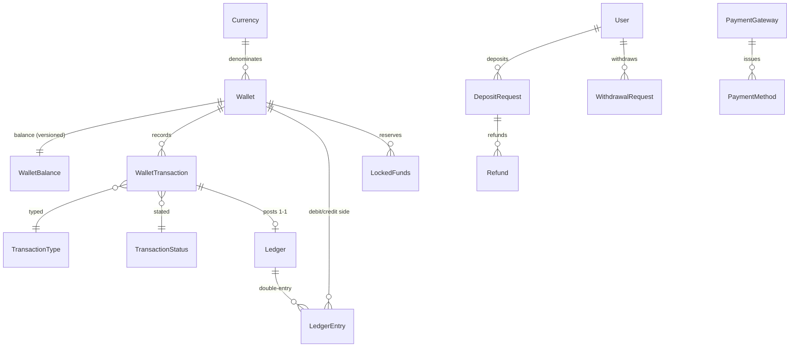

### 12.2 Model reference

| Model | Table | Role |
| --- | --- | --- |
| `Currency` | `currencies` | Currency master (fiat/crypto/virtual); unique `code`, `decimals` |
| `ExchangeRate` | `exchange_rates` | Time-bounded FX rates; unique `[base, quote, validFrom]` |
| `TransactionType` | `transaction_types` | Lookup: `GAME_BET`, `GAME_WIN`, `RESERVE`, `TRANSFER_*`, … |
| `TransactionStatus` | `transaction_statuses` | Lookup: `SETTLED`, `PENDING`, `COMPLETED`, … (`isFinal`) |
| `Wallet` | `wallets` | A user's account for one currency+type; unique `[userId, currencyId, type]` |
| `WalletBalance` | `wallet_balances` | 1-1 balance: `available`/`locked`/`pending`/`total` + `version` |
| `WalletTransaction` | `wallet_transactions` | Immutable movement; unique `reference` + `idempotencyKey`; `balanceBefore`/`balanceAfter` |
| `Ledger` | `ledgers` | Double-entry journal header; unique `reference`; 1-1 to a transaction |
| `LedgerEntry` | `ledger_entries` | Journal lines with `direction` (DEBIT/CREDIT) |
| `PaymentGateway` | `payment_gateways` | Payment provider config |
| `PaymentMethod` | `payment_methods` | Saved instrument (`last4`, `brand`, tokenized) |
| `DepositRequest` | `deposit_requests` | Cash-in; unique `reference`; `status` |
| `WithdrawalRequest` | `withdrawal_requests` | Cash-out; approval workflow; `reviewedById` |
| `Refund` | `refunds` | Deposit reversal |
| `BonusWallet` | `bonus_wallets` | Bonus balance with `wageringRequirement`/`wageringProgress` |
| `RewardWallet` | `reward_wallets` | Loyalty points (`Decimal(38,8)`), `tierMultiplier` |
| `LockedFunds` | `locked_funds` | Reservation records (`status` LOCKED/RELEASED) |

### 12.3 Why this shape — the double-entry ledger

The heart of the model is the pairing of `WalletTransaction`, `Ledger`, and `LedgerEntry`:

- A **`WalletTransaction`** is the player-facing record: what happened, to which wallet, for how much, with `balanceBefore`/`balanceAfter` captured for audit.
- A **`Ledger`** is posted 1-1 with that transaction (`walletTransactionId @unique`), acting as the journal header.
- **`LedgerEntry`** rows are the double-entry lines: each movement posts a balanced pair — a `DEBIT` against one wallet and a `CREDIT` against the counterparty (the house wallet) — in the same currency. Because debits and credits are always posted together, `Σ debits = Σ credits` holds globally, and the backend's `reconcile()` proves it via a `GROUP BY direction` trial balance ([Backend §12.6](./BACKEND_ARCHITECTURE.md#126-double-entry-ledger--house-wallet)).

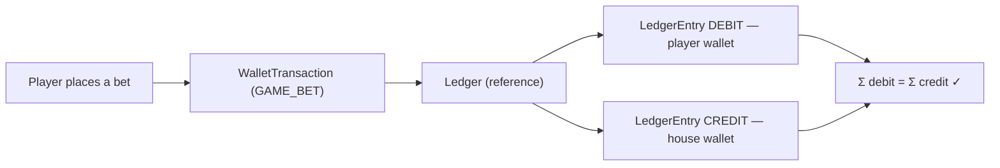

### 12.4 Balance components & optimistic locking

`WalletBalance` splits a balance into four `Decimal(38,18)` components and a `version` integer:

| Column | Meaning |
| --- | --- |
| `available` | Spendable now |
| `locked` | Reserved for an in-flight bet (`LockedFunds`) |
| `pending` | In-flight deposit/withdrawal |
| `total` | `available + locked + pending` (invariant) |
| `version` | Optimistic-lock counter, bumped on every write |

The `version` column is the schema's contribution to the wallet engine's four-layer concurrency control ([Backend §12.4](./BACKEND_ARCHITECTURE.md#124-concurrency-the-four-layers)): a write conditioned on the read `version` affects zero rows if a concurrent writer already advanced it, and the engine retries. See [§19.3](#193-optimistic-locking).

### 12.5 Idempotency, reservations, and cash boundaries

- **Idempotency** is enforced by `WalletTransaction.idempotencyKey @unique` and `reference @unique` — a replayed settlement cannot double-post because the database rejects the duplicate. See [§19.5](#195-idempotency).
- **Reservations** live in `LockedFunds` (`status` LOCKED→RELEASED) and move value between `available` and `locked` — the persistence of the reserve→commit→release lifecycle.
- **Cash in/out** is quarantined in `DepositRequest`/`WithdrawalRequest`/`Refund`, the boundary between the internal ledger and external payment gateways. Withdrawals carry an approval workflow (`reviewedById`, `approvedAt`, `rejectionReason`), and every deposit/withdrawal references its resulting `WalletTransaction` — so external movements are always reconciled against the ledger.
- **`Restrict` everywhere on financial FKs** guarantees you cannot delete a currency, wallet, or user with financial history ([§8.3](#83-cascade-strategy--the-three-delete-behaviors)).

### 12.6 The reservation lifecycle in the schema

A game round's money flow — reserve → commit → release — is persisted across three tables working together. Following a single bet illustrates how the schema records each step:

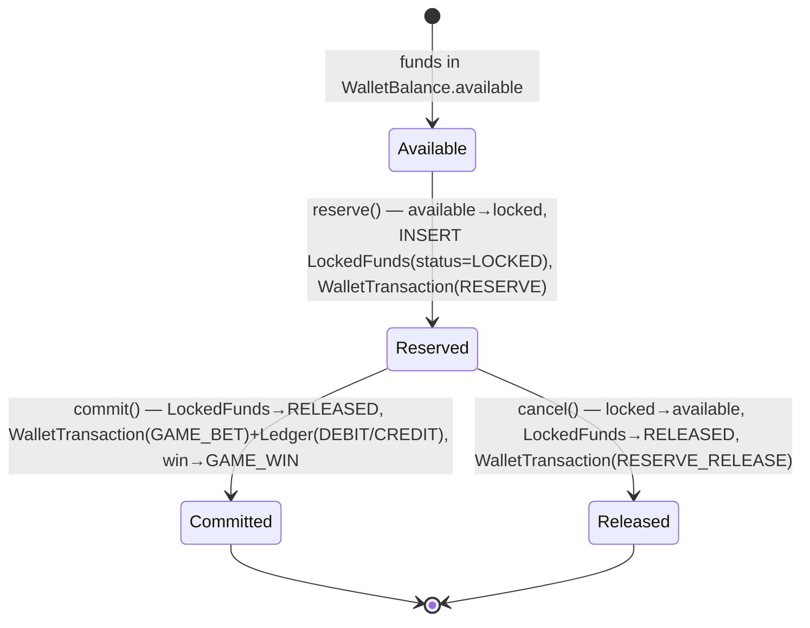

| Step | Tables touched | Balance effect |
| --- | --- | --- |
| **Reserve** | `WalletBalance` (available→locked, `version++`), `LockedFunds` (INSERT, LOCKED), `WalletTransaction` (RESERVE) | `available -= stake`, `locked += stake` |
| **Commit (settle)** | `WalletBalance` (consume locked, credit win), `LockedFunds` (→RELEASED), `WalletTransaction` (GAME_BET, +GAME_WIN), `Ledger`+`LedgerEntry` (DEBIT player / CREDIT house, and CREDIT player for a win) | `locked -= stake`, `available += win` |
| **Release (cancel)** | `WalletBalance` (locked→available), `LockedFunds` (→RELEASED), `WalletTransaction` (RESERVE_RELEASE) | `locked -= stake`, `available += stake` |

Every step runs inside one interactive transaction ([§19.1](#191-prisma-interactive-transactions)), so the `WalletBalance`, `LockedFunds`, `WalletTransaction`, and `Ledger` rows are always mutually consistent — there is no window in which locked funds exist without a matching `LockedFunds` row, or a `GAME_BET` transaction without its balanced ledger entries. The `LockedFunds.status` index (`@@index([status])`) lets a reconciliation job find any stale `LOCKED` rows (e.g. from a crashed round) for cleanup.

### 12.7 Why lookup tables for transaction type/status

`WalletTransaction` references `TransactionType` and `TransactionStatus` as **FK lookups**, not enum columns. This is a deliberate departure from the schema's usual enum-for-fixed-sets rule ([ADR-014](#24-architecture-decision-records)): the set of transaction *types* (GAME_BET, GAME_WIN, RESERVE, DEPOSIT, WITHDRAWAL, TRANSFER_IN/OUT, ADJUSTMENT, …) and their *categories* is operationally extensible, and statuses carry an `isFinal` flag the application reads to decide whether a transaction can still change. Modeling them as tables means adding a new transaction type is a seeded row, not a schema migration — the same data-driven philosophy as the game registry.

---

## 13. Game Schema

The game domain spans `games` (13), `game-registry` (3), `game-runtime` (2), and `sessions` (11) — the catalog, how games launch, their live/persisted state, and the record of play.

### 13.1 Catalog & registry

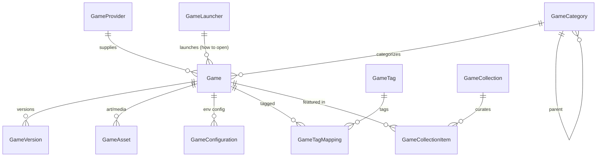

| Model | Table | Role |
| --- | --- | --- |
| `Game` | `games` | Catalog entry: status, visibility, RTP, popularity/trending scores, launcher/category/provider FKs |
| `GameProvider` | `game_providers` | Studio/aggregator supplying games |
| `GameCategory` | `game_categories` | Self-referencing category tree (`parentId`) |
| `GameLauncher` | `game_launchers` | **How** a game opens (IFRAME/INTERNAL_MODULE/WEBGL/…) |
| `GameVersion` | `game_versions` | Versioned releases; unique `[gameId, version]` |
| `GameAsset` | `game_assets` | Art/media per game+type |
| `GameTag` / `GameTagMapping` | `game_tags` / `game_tag_mappings` | Tagging (M-N) |
| `GameConfiguration` | `game_configurations` | Per-game, per-environment config (`JsonB`); unique `[gameId, key, environment]` |
| `GameCollection` / `GameCollectionItem` | `game_collections` / `game_collection_items` | Curated shelves with `position` |

**Why data-driven launchers/collections:** as the schema comments state, "the registry is fully data-driven … no game-specific code lives in the platform." A `GameLauncher` row tells the client how to open any game that references it; adding a launcher or collection is *data*, not a code change — mirroring the backend's plugin philosophy ([Backend §13.1](./BACKEND_ARCHITECTURE.md#131-plugin-registry-boot-time)). See [ADR-011](#24-architecture-decision-records).

### 13.2 Player interactions

| Model | Table | Unique | Purpose |
| --- | --- | --- | --- |
| `GameFavourite` | `game_favourites` | `[userId, gameId]` | Favorites ([Frontend §9.3](./FRONTEND_ARCHITECTURE.md#93-query--mutation-hooks)) |
| `RecentlyPlayed` | `recently_played` | `[userId, gameId]` | Recent list (`lastPlayedAt`) |
| `GameRating` | `game_ratings` | `[userId, gameId]` | 1–5 rating |
| `GameReview` | `game_reviews` | `[userId, gameId]` | Written review with moderation `status` |
| `GameLaunchHistory` | `game_launch_history` | — | Launch audit |

### 13.3 Runtime state & replay

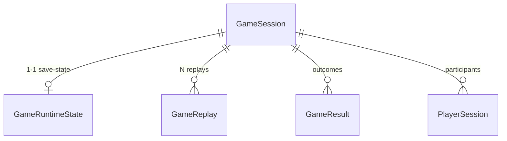

| Model | Table | Role |
| --- | --- | --- |
| `GameRuntimeState` | `game_runtime_states` | 1-1 with a session (`sessionId @unique`); JsonB `state`, `snapshotVersion`, `checksum` |
| `GameReplay` | `game_replays` | Deterministic replay: `seed`, JsonB `frames`, `frameCount`, `durationMs` |
| `GameSession` | `game_sessions` | A play session (`status`, `totalBet`, `totalWin`) |
| `PlayerSession` | `player_sessions` | Per-player participation; unique `[sessionId, userId]` |
| `GameResult` | `game_results` | Per-round outcome (`outcome` enum, `betAmount`) |
| `PlayerStatistics` | `player_statistics` | Aggregated per-user-per-game stats; unique `[userId, gameId]` |
| `GameStatistics` | `game_statistics` | Aggregated per-game stats |

**Why persist runtime state and replays:** the runtime is server-authoritative and provably fair ([Backend §13](./BACKEND_ARCHITECTURE.md#13-runtime-backend)). `GameRuntimeState` gives fast reconnect/recovery of an in-progress game; `GameReplay` stores the `seed` and frame sequence so any round can be **re-run deterministically** for dispute resolution and audit. The JsonB `state`/`frames` are the correct use of schemaless storage — their shape is engine-specific and evolving, so forcing them into rigid columns would be wrong ([ADR-005](#24-architecture-decision-records)).

### 13.4 Catalog query patterns

The catalog is the most-read part of the database (every lobby load), so `Game` carries an unusually rich index set — eight indexes serving distinct shelves the frontend renders ([Frontend §13.2](./FRONTEND_ARCHITECTURE.md#132-core-surfaces)):

| Shelf / query | Filter + sort | Index |
| --- | --- | --- |
| Visible catalog | `status, visibility` | `[status, visibility]` |
| Featured | `status, isFeatured` | `[status, isFeatured]` |
| Trending | `isTrending` ordered by `trendingScore` | `[isTrending, trendingScore]` |
| Popular | ordered by `popularityScore` | `[popularityScore]` |
| Newly added | ordered by `publishedAt` | `[publishedAt]` |
| By category / provider / launcher | FK filter | `[categoryId]` / `[providerId]` / `[launcherId]` |
| Manual ordering | `displayOrder` | `[displayOrder]` |

This is a case where **more indexes are justified**: `Game` is read constantly and written rarely (a studio publishes/updates a game occasionally), so the write cost of eight indexes is negligible against the read benefit — the inverse of a high-write table like `LedgerEntry`, which is kept lean. The catalog is additionally cached in Redis ([§20.4](#204-caching--redis)), so most catalog reads never reach these indexes at all; they exist for cache-miss and admin queries. This asymmetry — heavily indexed read-mostly tables, minimally indexed write-heavy tables — is a deliberate, recurring pattern in the schema.

---

## 14. Tournament Schema

"Tournament" on this platform is the **progression and competition** cluster, spread across `sessions` (leaderboards, achievements, rewards) and `promotions` (loyalty, referrals) — plus tournament wallet types (`WalletType.TOURNAMENT`). There is no monolithic "tournament" table; competition is composed from focused models.

### 14.1 Competition & progression models

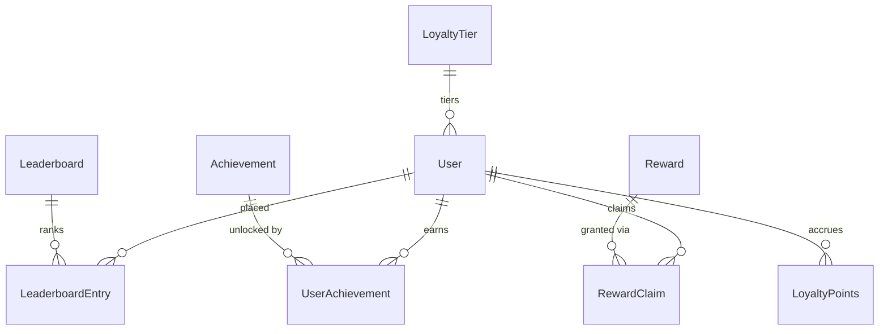

| Model | Table | Role |
| --- | --- | --- |
| `Leaderboard` | `leaderboards` | A ranked board scoped by `period` (`LeaderboardPeriod`) and game |
| `LeaderboardEntry` | `leaderboard_entries` | A player's `rank`/`score`; unique `[leaderboardId, userId]`, index `[leaderboardId, rank]` |
| `Achievement` | `achievements` | Definable accomplishment (`type`, `isActive`) |
| `UserAchievement` | `user_achievements` | Per-user unlock progress; unique `[userId, achievementId]`, index `[userId, isUnlocked]` |
| `Reward` | `rewards` | Grantable reward (`type` `RewardType`) |
| `RewardClaim` | `reward_claims` | Claim lifecycle (`RewardClaimStatus`); index `[userId, status]` |
| `LoyaltyTier` | `loyalty_tiers` | VIP tiers by `level` |
| `LoyaltyPoints` | `loyalty_points` | Points ledger (`type` `LoyaltyPointType`) |

### 14.2 Season, XP, missions & battle pass

Seasons, XP, missions, and the battle pass are expressed through this cluster combined with promotions and rewards: **XP/points** accrue via `LoyaltyPoints` and `PlayerStatistics`; **missions/battle-pass progression** is tracked against `UserAchievement`/`RewardClaim` and surfaced by the frontend's `missions`/`player-profile` stores ([Frontend §7.2](./FRONTEND_ARCHITECTURE.md#72-zustand--client-state)); **seasons** are periodization applied via `Leaderboard.period` and promotion windows (`Promotion.startsAt/endsAt`). This compositional approach means a new competitive format is usually *configuration over new tables* — a design goal shared with the game registry.

### 14.3 Why leaderboards are their own optimized models

Leaderboards are read constantly (every lobby, every profile) and written on every result. Splitting `Leaderboard` (the board) from `LeaderboardEntry` (the placements), enforcing one entry per player (`@@unique([leaderboardId, userId])`), and indexing `(leaderboardId, rank)` makes "top N by rank" an index range scan with no sort ([§10.3](#103-leaderboard-optimization)). Materialized/periodic recomputation of ranks is a documented future optimization ([§25](#25-future-database-roadmap)).

---

## 15. Analytics Schema

The `analytics` domain (7 models) separates **raw behavioural capture** from **pre-aggregated roll-ups** — the classic OLTP-vs-reporting split, kept inside the same database for now.

| Model | Table | Kind | Purpose |
| --- | --- | --- | --- |
| `Event` | `events` | Raw | Behavioural events; index `[name, occurredAt]`, `[userId, occurredAt]`, `[category]` |
| `PageView` | `page_views` | Raw | Navigation; index `[path, occurredAt]` |
| `UserActivity` | `user_activities` | Raw | Typed activity stream (`ActivityType`) |
| `DeviceAnalytics` | `device_analytics` | Roll-up | Per-period device breakdown |
| `GeoAnalytics` | `geo_analytics` | Roll-up | Per-period geo; unique `[countryCode, region, city, periodDate]` |
| `RevenueAnalytics` | `revenue_analytics` | Roll-up | Per-period revenue; unique `[periodDate, currencyCode]` |
| `TrafficAnalytics` | `traffic_analytics` | Roll-up | Per-period traffic; unique `[periodDate, source, medium]` |

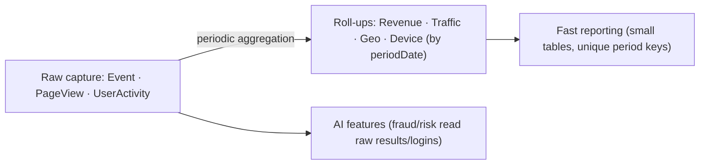

**Why pre-aggregate:** reporting dashboards must not scan millions of raw `Event` rows on every load. Roll-up tables — each with a `@@unique` on its period+dimension key and a `periodDate` index — turn "revenue last 30 days" into a tiny indexed range scan. Raw tables remain for drill-down and for the AI module's fraud/risk feature extraction, which reads `GameResult`, `LoginHistory`, and deposits directly ([Backend §14.2](./BACKEND_ARCHITECTURE.md#142-the-determinism--grounding-contract)). The unique period keys also make aggregation **idempotent** — re-running a roll-up upserts the same bucket rather than duplicating it. See [ADR-016](#24-architecture-decision-records).

---

## 16. Administration Schema

The `admin` domain (12 models) is the operational control plane — the persistence behind the backend's admin and operations modules ([Backend §5.6](./BACKEND_ARCHITECTURE.md#56-progression-intelligence--operations)).

| Model | Table | Purpose |
| --- | --- | --- |
| `AdminUser` | `admin_users` | 1-1 with `User`; admin identity + `status` |
| `AdminRole` | `admin_roles` | Admin RBAC role (`level`) |
| `AdminPermission` | `admin_permissions` | Admin permission; unique `[resource, action]` |
| `AdminRolePermission` | `admin_role_permissions` | Join; unique `[roleId, permissionId]` |
| `AdminAuditLog` | `admin_audit_logs` | Admin action audit; index `[adminId, createdAt]`, `[resource, resourceId]`, `[action]` |
| `FeatureFlag` | `feature_flags` | Env-scoped gating; unique `[key, environment]` |
| `SystemSetting` | `system_settings` | Global settings |
| `ApplicationSetting` | `application_settings` | Scoped/env settings; unique `[scope, key, environment]` — backs alert-rule overrides ([Backend §15.3](./BACKEND_ARCHITECTURE.md#153-alerting)) |
| `MaintenanceWindow` | `maintenance_windows` | Planned maintenance (`status`, `startsAt`) |
| `SystemLog` | `system_logs` | Structured system log (`level`, `context`) |
| `ErrorLog` | `error_logs` | Grouped errors; index `[fingerprint]`, `[isResolved, createdAt]` |
| `AuditTrail` | `audit_trails` | Cross-cutting mutation audit; index `[userId, createdAt]`, `[entityType, entityId]`, `[action]` |

**Why a separate admin RBAC:** player RBAC (`Role`/`Permission`) governs the API surface; admin RBAC (`AdminRole`/`AdminPermission`) governs the back-office. Keeping them separate means a player role can never accidentally grant back-office access, and the two permission catalogs evolve independently. **Why `ApplicationSetting` is `[scope, key, environment]`-unique:** it doubles as a generic, environment-aware key-value store — the backend stores alert-rule overrides there, scoped so staging and production never collide.

**AuditTrail vs. AdminAuditLog vs. SecurityEvent:** three complementary logs by concern — `AuditTrail` for general entity mutations (who changed what entity), `AdminAuditLog` for back-office actions specifically, and `SecurityEvent` (in `auth`) for authentication/security events. Together they form the forensic backbone the AI fraud module and incident response rely on.

---

## 17. Infrastructure Schema

The `infrastructure` domain (9 models) persists the platform's operational plumbing — the durable side of what the backend's operations module runs in-process ([Backend §15](./BACKEND_ARCHITECTURE.md#15-operations-backend)).

| Model | Table | Purpose |
| --- | --- | --- |
| `StorageProvider` | `storage_providers` | Object-storage backends (`StorageProviderType`) |
| `FileStorage` | `file_storage` | Stored file records (key, size, provider) |
| `Webhook` | `webhooks` | Outbound webhook subscriptions (`status`) |
| `WebhookLog` | `webhook_logs` | Delivery attempts (`DeliveryStatus`); index `[webhookId, createdAt]` |
| `JobQueue` | `job_queues` | Named queues |
| `BackgroundJob` | `background_jobs` | Durable jobs; index `[status, scheduledAt]`, `[status, priority]` |
| `ScheduledTask` | `scheduled_tasks` | Cron-like tasks; index `[status, nextRunAt]` |
| `ApiUsage` | `api_usage` | Per-endpoint usage; index `[endpoint, occurredAt]`, `[apiKeyId]` |
| `RateLimitLog` | `rate_limit_logs` | Rate-limit records; index `[identifier, windowStart]`, `[key]` |

**Why persist jobs/queues when the backend runs an in-process queue?** The backend's `QueueService` is deliberately in-memory for speed ([Backend §15.2](./BACKEND_ARCHITECTURE.md#152-resilience-primitives)); these tables are the **durable substrate** for a future broker-backed queue and for anything that must survive a restart (scheduled tasks, webhook delivery history, an outbox). Their presence is the schema-level seam for the roadmap's durable-queue initiative ([§25](#25-future-database-roadmap)). `ApiUsage`/`RateLimitLog` provide a persistent record complementing Redis's ephemeral rate-limit counters ([Backend §10.1](./BACKEND_ARCHITECTURE.md#101-what-lives-in-redis)).

---

## 18. Data Lifecycle

### 18.1 The lifecycle of a row

```mermaid
stateDiagram-v2
    [*] --> Created: INSERT (createdAt = now, UUIDv7)
    Created --> Modified: UPDATE (updatedAt = now)
    Modified --> Modified: further updates
    Modified --> SoftDeleted: set deletedAt (user-facing entities)
    Created --> HardDeleted: DELETE (ephemeral/lookup rows)
    SoftDeleted --> Recovered: clear deletedAt
    SoftDeleted --> Archived: retention/export
    Archived --> [*]
    HardDeleted --> [*]
```

### 18.2 Creation & modification

Every row is stamped `createdAt @default(now())` on insert and `updatedAt @updatedAt` on every change. Combined with the time-ordered UUIDv7 key, this gives two independent chronological signals per row. The backend never mutates `createdAt`.

### 18.3 Soft delete vs. hard delete

| Strategy | Applies to | Mechanism | Why |
| --- | --- | --- | --- |
| **Soft delete** | User-facing entities (`User`, `Wallet`, `Device`, `ApiKey`, `Game`, `PaymentMethod`, `BonusWallet`, …) | `deletedAt DateTime?`; reads filter `where: { deletedAt: null }` | Reversible, auditable, preserves referential history |
| **Hard delete** | Lookup/ephemeral/append-only rows (join tables, tokens, logs) | `DELETE` | No value in retaining; or governed by retention |

Soft delete is why financial FKs can safely be `Restrict`: a user is never physically removed while they hold transactions — they are *closed* (`deletedAt` set, `status` `CLOSED`). This keeps the ledger's references intact forever.

### 18.4 Retention, archive, cleanup & recovery

| Concern | Approach |
| --- | --- |
| **Token cleanup** | Expired `Session`/`RefreshToken`/`*Token` rows are prunable by `status`+`expiresAt` (indexed) via scheduled tasks |
| **Analytics retention** | Raw `Event`/`PageView` retained for drill-down; roll-ups retained long-term (small) |
| **Audit retention** | `AuditTrail`/`SecurityEvent`/`AdminAuditLog` retained per compliance policy — append-only |
| **Recovery** | Soft-deleted rows recovered by clearing `deletedAt`; point-in-time recovery via PostgreSQL backups |
| **Archive** | Cold data (old sessions/results) is a partitioning/archival candidate ([§25](#25-future-database-roadmap)) |

### 18.5 A worked lifecycle: an account from birth to closure

Following one user through the schema shows how the domains interlock over a lifetime:

1. **Registration.** An `INSERT` creates a `User` (status `PENDING`), a `UserRole` links the default `user` role, an `EmailVerificationToken` is issued (hashed), a `Device` is fingerprinted, and a `Session` + `RefreshToken` pair is opened. An `AuditTrail` row records the creation; a `SecurityEvent` records the first login.
2. **Verification & profiling.** Email verification flips `User.emailVerified`; the player fills in a `UserProfile`, `UserPreferences`, and an `Avatar`. High-value flows add `KycVerification` + `Document` rows.
3. **Funding.** A `DepositRequest` moves through its status enum; on completion it posts a `WalletTransaction` and credits the `WalletBalance` (bumping `version`), all referencing the user's `Wallet` for the chosen `Currency`.
4. **Play.** Each round opens a `GameSession`, may persist a `GameRuntimeState`, records `GameResult` rows, and — for real money — reserves via `LockedFunds` and settles through the ledger. `PlayerStatistics`, `LeaderboardEntry`, and `UserAchievement` accumulate.
5. **Engagement.** `Notification`, `LoyaltyPoints`, `RewardClaim`, and `CouponRedemption` rows accrue as the player is retained.
6. **Closure.** The account is **soft-deleted** (`User.deletedAt` set, `status` `CLOSED`) — never hard-deleted, because `WalletTransaction`/`LedgerEntry` FKs are `Restrict`. The financial history remains intact and auditable; reads filter the closed user out, but reconciliation and compliance queries can still reach the record.

This illustrates the schema's central lifecycle principle: **user-facing state is reversible and auditable, financial state is immutable and protected.** A closed account is invisible to the app yet fully present for the books.

---

## 19. Transactions

### 19.1 Prisma interactive transactions

The wallet engine wraps multi-statement money operations in Prisma **interactive transactions** (`prisma.$transaction(async (tx) => { … })`) so that a balance write, a `LockedFunds` update, a `WalletTransaction`, and the double-entry `Ledger`/`LedgerEntry` posts either **all commit or all roll back** ([Backend §9.3](./BACKEND_ARCHITECTURE.md#93-transactions)). Simpler all-or-nothing writes (revoke a session + its refresh tokens) use the array form `$transaction([...])`.

```mermaid
sequenceDiagram
    autonumber
    participant ENG as WalletEngineService
    participant TX as Prisma tx
    participant PG as PostgreSQL
    ENG->>TX: begin interactive tx
    TX->>PG: SELECT ... FOR UPDATE (lock wallet row)
    TX->>PG: UPDATE wallet_balances (WHERE version = N)
    TX->>PG: INSERT wallet_transactions (reference unique)
    TX->>PG: INSERT ledgers + ledger_entries (DEBIT+CREDIT)
    alt all succeed
        TX->>PG: COMMIT
    else any failure / version conflict
        TX->>PG: ROLLBACK
        ENG->>ENG: retry (≤ MAX_RETRIES)
    end
```

### 19.2 Isolation

PostgreSQL's default `READ COMMITTED` isolation is used for most operations; the wallet path elevates safety with explicit **`SELECT … FOR UPDATE` row locks** (via the engine) plus the optimistic `version` check, which together give serializable-equivalent correctness *for a single wallet* without the contention of a global `SERIALIZABLE` isolation level. This is a deliberate trade: per-row pessimistic locking where it matters (money), optimistic elsewhere.

### 19.3 Optimistic locking

`WalletBalance.version` is the optimistic-concurrency token. The engine reads `version = N`, computes the new balance, and issues an update conditioned on `version = N`; a concurrent writer that already bumped it causes the conditional update to match **zero rows**, which the engine detects as a conflict and retries (bounded by `MAX_RETRIES`). See [Backend §12.4](./BACKEND_ARCHITECTURE.md#124-concurrency-the-four-layers).

### 19.4 Retry & rollback

A conflict or transient failure rolls the whole transaction back (no partial ledger) and retries. Because the operation is idempotent ([§19.5](#195-idempotency)), a retry is safe. Admin corrections never mutate history — they post **compensating** `LedgerEntry` rows via the engine's `rollback`, preserving the append-only ledger.

### 19.5 Idempotency

`WalletTransaction.idempotencyKey @unique` and `reference @unique` make double-application structurally impossible: a replayed request either finds the original transaction (engine returns it) or is rejected by the unique constraint. This makes client retries and at-least-once queue delivery safe end-to-end ([Backend §12.5](./BACKEND_ARCHITECTURE.md#125-idempotency)).

### 19.6 Consistency guarantees

| Guarantee | Mechanism |
| --- | --- |
| Atomicity of a money movement | Interactive transaction (balance + txn + ledger together) |
| No lost updates | `SELECT FOR UPDATE` + optimistic `version` |
| No double-spend/double-pay | `idempotencyKey`/`reference` unique + replay |
| Ledger always balances | Double-entry posting + trial-balance reconciliation |
| Referential integrity | FKs with `Restrict` on financial references |

---

## 20. Performance

### 20.1 Query optimization

The performance model rests on three pillars: **the right index for every hot query** ([§10](#10-indexing-strategy)), **scoped selection** (`select`/`include` fetch only needed columns — no `SELECT *`), and **aggregation in the database** (`groupBy`/`aggregate` for reconciliation and analytics rather than pulling rows into Node). See [Backend §19.2](./BACKEND_ARCHITECTURE.md#192-database-optimization).

### 20.2 Read patterns

| Pattern | Optimization |
| --- | --- |
| "My X, newest first" | Composite `[userId, createdAt]` indexes → single seek |
| Catalog shelves | Partial-ish composite indexes (`[status, isFeatured]`, `[isTrending, trendingScore]`) + Redis caching |
| Leaderboard top-N | `[leaderboardId, rank]` index range scan (no sort) |
| Reporting | Pre-aggregated roll-up tables keyed by `periodDate` |
| Balance read | `Wallet([userId])` + 1-1 `WalletBalance` |

### 20.3 Write patterns

| Pattern | Optimization |
| --- | --- |
| UUIDv7 inserts | Append near B-tree right edge → minimal page splits |
| Money writes | Short transactions holding the row lock for minimal time |
| High-volume logs/events | Append-only, few indexes, partitioning-ready |
| Optimistic retries | Conflicts retried in-engine, not surfaced as errors |

### 20.4 Caching & Redis

The database is shielded by Redis for hot, repeatable reads: the game catalog is cached (`GameCacheService`), sessions/token-blacklists/locks/rate-limits live in Redis, and cache is invalidated write-through ([Backend §10](./BACKEND_ARCHITECTURE.md#10-redis-architecture)). The frontend adds a second cache layer via React Query ([Frontend §7.1](./FRONTEND_ARCHITECTURE.md#71-react-query--server-state)). The net effect: PostgreSQL handles durable writes and cache-miss reads, not every read.

### 20.5 The index-density spectrum

A recurring design tension is how heavily to index a table. The schema resolves it by placing every table on a **read-vs-write spectrum** and indexing accordingly:

```mermaid
flowchart LR
    R["Read-mostly, write-rare\n(Game, GameCategory, Currency)"] -->|"many indexes justified"| MANY["8+ indexes on Game"]
    M["Balanced\n(WalletTransaction, GameResult)"] -->|"targeted composite indexes"| MID["[userId,createdAt] etc."]
    W["Write-heavy, append-only\n(LedgerEntry, Event, logs)"] -->|"minimal indexes"| FEW["only what reconciliation/query truly needs"]
```

| Table class | Example | Index policy | Rationale |
| --- | --- | --- | --- |
| Read-mostly | `Game`, `Currency` | Rich (8 on `Game`) | Written rarely; every shelf query deserves an index |
| Balanced | `WalletTransaction` | Targeted composites | Both read and written; index the hot access paths only |
| Write-heavy append-only | `LedgerEntry`, `Event` | Minimal | Every index taxes each insert; add only reconciliation/query-critical ones |

This is why `LedgerEntry` carries just three indexes (`[ledgerId]`, `[walletId, createdAt]`, `[direction]`) despite being central to money — each is load-bearing (join to ledger, per-wallet history, trial-balance grouping), and none is speculative. Over-indexing an append-only table would silently tax the wallet write path that must stay fast under load.

### 20.6 Connection pooling & scaling

A **single Prisma client** (never per-request) pools connections; the dev singleton on `globalThis` prevents pool exhaustion under hot-reload. The scaling path ([§25](#25-future-database-roadmap)): a pooler (PgBouncer) in front of the primary, read replicas for analytics/leaderboards, and partitioning for the largest append-only tables — all enabled by the schema's isolation of transactional vs. reporting tables.

---

## 21. Security

### 21.1 Sensitive data & hashing

The schema **never stores authentication secrets in plaintext.** Passwords are bcrypt-hashed in `User.passwordHash`; every token is SHA-256-hashed (`Session.tokenHash`, `RefreshToken.tokenHash`, `PasswordResetToken.tokenHash`, `EmailVerificationToken.tokenHash`, `ApiKey.keyHash`); 2FA secrets live in `TwoFactorAuth.secret` and backup codes in `backupCodes[]`. A database dump yields no usable credentials. This is the persistence side of [Backend §18](./BACKEND_ARCHITECTURE.md#18-security).

### 21.2 PII & compliance

PII is concentrated in `profile` (`UserProfile`, `Address`, `Document`, `KycVerification`, `EmergencyContact`) and payment instruments in `PaymentMethod` (which stores only `last4`/`brand`/tokenized references, never full card numbers — PCI-minimizing by design). Isolating PII/KYC into the `profile` domain makes it straightforward to apply stricter access controls, encryption-at-rest, and retention/erasure policies (GDPR "right to be forgotten" via soft-delete + scrubbing) to exactly the tables that need them.

### 21.3 Audit & access control

Three append-only logs (`AuditTrail`, `AdminAuditLog`, `SecurityEvent`) provide a complete forensic record of who did what. Access to the database is single-channel (only via `PrismaService`), and application-level authorization (RBAC) gates every mutation before it reaches Prisma. Production Prisma logging is restricted to `warn`/`error` with `minimal` error format so queries and parameters never leak into logs.

### 21.3.1 The three-log forensic model

The schema separates audit concerns into three append-only logs so that a security investigation can query the right grain without noise:

```mermaid
flowchart TD
    ACT{"What happened?"}
    ACT -->|"auth/security event"| SE["SecurityEvent (auth) — logins, MFA, lockouts, suspicious activity"]
    ACT -->|"back-office action"| AAL["AdminAuditLog (admin) — who did what in the console"]
    ACT -->|"entity mutation"| AT["AuditTrail (admin) — create/update/delete on any entity"]
    SE & AAL & AT --> FRAUD["AI fraud/risk features + incident response"]
```

Each log is indexed for its interrogation pattern: `SecurityEvent[userId, createdAt]` + `[type]` (a user's security timeline, or all events of a type), `AdminAuditLog[adminId, createdAt]` + `[resource, resourceId]` (an admin's actions, or all changes to one resource), and `AuditTrail[entityType, entityId]` + `[action]` (the change history of any entity). Together they answer "who touched this, when, and what did they do" from three complementary angles — the exact inputs the AI fraud module consumes ([Backend §14.2](./BACKEND_ARCHITECTURE.md#142-the-determinism--grounding-contract)).

### 21.4 Encryption & at-rest

| Layer | Protection |
| --- | --- |
| In transit | TLS to PostgreSQL |
| At rest | Disk/volume encryption (deployment-level); a managed-Postgres KMS path is roadmap |
| Application | Hashing of all secrets; tokenization of payment instruments |
| Logs | Secret redaction in the app layer ([Backend §18.6](./BACKEND_ARCHITECTURE.md#186-logging-redaction)) |

---

## 22. Migration Strategy

### 22.1 Prisma Migrate workflow

```mermaid
flowchart LR
    EDIT["Edit schema/*.prisma"] --> DEV["prisma migrate dev — generate + apply locally"]
    DEV --> REVIEW["Review generated SQL migration"]
    REVIEW --> COMMIT["Commit migration to VCS"]
    COMMIT --> CI["CI: prisma migrate deploy before boot"]
    CI --> PROD["Production DB migrated, then app starts"]
```

Schema changes flow through **Prisma Migrate**: `db:migrate` (`prisma migrate dev`) generates a versioned SQL migration locally, which is reviewed and committed; CI runs `db:migrate:deploy` (`prisma migrate deploy`) to apply pending migrations **before** the app boots against the new schema. `db:generate` regenerates the typed client; `db:seed` (`tsx prisma/seed.ts`) seeds reference data.

### 22.2 Versioning & deployment discipline

- **Additive-first.** Add columns/tables and backfill before removing anything, so a new app version is forward-compatible with the previous schema and a rollback doesn't strip data the old code reads ([Backend §9.7](./BACKEND_ARCHITECTURE.md#97-migrations--schema-evolution)).
- **Append-only money tables** are never rewritten by a migration — corrections are compensating entries.
- **Zero-downtime deploys** rely on this: old and new instances briefly share one schema without conflict ([Backend §20.3](./BACKEND_ARCHITECTURE.md#203-health-scaling--rollback)).

### 22.3 Development vs. production workflow

| Environment | Command | Behavior |
| --- | --- | --- |
| Development | `prisma migrate dev` | Diff schema → generate + apply migration + regenerate client |
| Development (throwaway) | `prisma db push` | Push schema without a migration (prototyping only) |
| CI / Production | `prisma migrate deploy` | Apply committed migrations idempotently; no schema drift |
| Any | `prisma db seed` | Seed reference/lookup data (`tsx prisma/seed.ts`) |

### 22.3.1 Seed & reference data

A fresh database is not empty — it needs **reference data** to be operable: the RBAC catalog (`Role`/`Permission` seeded idempotently by the backend's `RbacBootstrapService`, [Backend §8.2](./BACKEND_ARCHITECTURE.md#82-the-rbac-catalog)), currencies, transaction types/statuses, and system settings. The `db:seed` script (`tsx prisma/seed.ts`, wired via Prisma's `seed` config) populates these. The design goal is **idempotent seeding**: re-running the seed upserts rather than duplicates, so it is safe to run on every deploy. This is why lookup sets like `TransactionType` and `Currency` are tables — they are seeded (and operationally editable) data, not code constants. A new environment becomes fully governable the moment the seed runs.

### 22.4 Rollback

Because migrations are additive-first and money tables are append-only, **rolling back the application is safe** without rolling back the database. A genuinely bad migration is remediated with a forward "fix" migration rather than a destructive down-migration — the same forward-only discipline that keeps production history intact.

---

## 23. Extension Guide

Every recipe preserves compatibility and follows the conventions in [§4.3](#43-conventions-the-rules-every-model-obeys).

### 23.1 Add a model (table)

1. Choose the correct domain file (`wallet.prisma`, `games.prisma`, …) — never create a new file without a new bounded context.
2. Follow the conventions: UUIDv7 `id`, `@map`/`@@map` snake_case, `createdAt`/`updatedAt`, `deletedAt` if user-facing, `Decimal(38,18)` for money, `JsonB` for blobs.
3. Add relations with **explicit `onDelete`/`onUpdate`** ([§8.3](#83-cascade-strategy--the-three-delete-behaviors)) — owned→`Cascade`, financial→`Restrict`, optional→`SetNull`.
4. Add `@@index` for every query the backend will run against it.
5. `prisma migrate dev` → review SQL → commit.

### 23.2 Add a relation

Add the FK column (`<name>Id @db.Uuid`) and the `@relation`, decide the cascade behavior deliberately, and index the FK if you'll query by it. For M-N, create an **explicit join model** with a `@@unique` on the pair ([§8.2](#82-explicit-join-tables)).

### 23.3 Add an enum

Add it to `enums.prisma` (or the domain file if tightly scoped, like `game-registry`), with `@@map("snake_case")`. **Only append values** to an existing enum — reordering or removing values is a breaking change. Prisma generates the `ALTER TYPE … ADD VALUE` migration.

### 23.4 Add an index

Add `@@index([...])` matching a real access path; prefer a **composite** index that satisfies both filter and sort (e.g. `[userId, createdAt]`) over multiple single-column indexes. Weigh the write cost ([§10.1](#101-the-read-vs-write-trade-off)) — don't index a column no query filters on.

### 23.5 Add a migration safely

Make it **additive-first**: add nullable columns or new tables, deploy, backfill, then (in a later migration) tighten constraints or drop old columns. Never rewrite money/ledger tables. Test `migrate deploy` against a production-like copy before shipping.

### 23.6 Golden rules

| Rule | Why |
| --- | --- |
| Never store money as `float` | Rounding corrupts balances — use `Decimal(38,18)` |
| Never delete a financially-referenced row | `Restrict` protects the ledger — soft-delete instead |
| Never reorder/remove enum values | Breaking change — append only |
| Always declare cascade behavior | Implicit defaults surprise; be explicit |
| Always index the access path | Unindexed hot queries scan and lock |
| Always add `deletedAt` to user-facing entities | Reversible, auditable deletion |

---

## 24. Architecture Decision Records

Each ADR records the **problem, decision, alternatives, trade-offs, and consequences.**

### ADR-001 — PostgreSQL as the primary datastore
- **Problem:** a money-handling gaming platform needs strong consistency and rich constraints.
- **Decision:** PostgreSQL 16 as the single system of record.
- **Alternatives:** MySQL; MongoDB/document store; NewSQL.
- **Trade-offs:** (+) ACID, FKs, `numeric`, `JsonB`, row locks; (−) vertical-scale-first.
- **Consequences:** double-entry ledger and referential integrity are feasible and enforced.

### ADR-002 — Prisma with a multi-file schema
- **Problem:** manage 126 models with type safety and organized boundaries.
- **Decision:** Prisma 6, schema split into 16 domain files.
- **Alternatives:** TypeORM; Drizzle; raw SQL + a query builder.
- **Trade-offs:** (+) generated types, migrations, interactive tx, domain partitioning; (−) ORM abstraction, some advanced SQL via raw escape hatch.
- **Consequences:** one typed client; the same types flow to the frontend.

### ADR-003 — UUIDv7 primary keys
- **Problem:** globally-unique, non-enumerable, insert-friendly keys.
- **Decision:** UUIDv7 on every model.
- **Alternatives:** auto-increment `bigint`; UUIDv4; ULID.
- **Trade-offs:** (+) unique + time-ordered + distributed-safe; (−) 16 bytes vs 8.
- **Consequences:** index locality of a sequence without leaking counts.

### ADR-004 — `Decimal(38,18)` for money
- **Problem:** exact monetary arithmetic across fiat and crypto.
- **Decision:** fixed-point `Decimal(38,18)` (points `38,8`, multipliers `10,4`).
- **Alternatives:** `float`/`double`; integer minor units.
- **Trade-offs:** (+) exact, wide range; (−) larger than int, arithmetic in the app via `Money`.
- **Consequences:** no rounding errors; the ledger reconciles exactly.

### ADR-005 — `JsonB` for schemaless payloads
- **Problem:** some data is inherently variable (metadata, config, runtime state, replay frames).
- **Decision:** `JsonB` columns for those fields only.
- **Alternatives:** over-normalize; `text` JSON; a document DB.
- **Trade-offs:** (+) flexible, indexable, queryable; (−) no column-level constraints inside the blob.
- **Consequences:** core entities stay relational; only genuinely variable data is JSON.

### ADR-006 — Double-entry ledger
- **Problem:** prove the money is always correct.
- **Decision:** `WalletTransaction` + `Ledger` + `LedgerEntry` (DEBIT/CREDIT pairs).
- **Alternatives:** single balance column; transaction log only.
- **Trade-offs:** (+) provable integrity, standard accounting; (−) more rows per movement.
- **Consequences:** trial-balance reconciliation; append-only corrections.

### ADR-007 — Optimistic locking via `version`
- **Problem:** prevent lost updates on concurrent balance writes.
- **Decision:** `WalletBalance.version` checked on every write.
- **Alternatives:** pessimistic-only; `SERIALIZABLE` globally.
- **Trade-offs:** (+) high concurrency, correctness; (−) retry logic in the engine.
- **Consequences:** conflicts retry transparently.

### ADR-008 — Idempotency + `reference` unique constraints
- **Problem:** retries must not double-apply money.
- **Decision:** unique `idempotencyKey` and `reference` on `WalletTransaction`.
- **Alternatives:** app-only dedup.
- **Trade-offs:** (+) database-enforced safety; (−) callers supply keys.
- **Consequences:** double-settlement is structurally impossible.

### ADR-009 — Explicit cascade semantics
- **Problem:** deletes must not orphan or destroy protected data.
- **Decision:** every relation declares `onDelete`/`onUpdate` (Cascade/Restrict/SetNull).
- **Alternatives:** rely on defaults.
- **Trade-offs:** (+) predictable, safe; (−) verbose.
- **Consequences:** money references are `Restrict`; owned children `Cascade`.

### ADR-010 — Soft delete for user-facing data
- **Problem:** deletion must be reversible and non-destructive to history.
- **Decision:** `deletedAt` on user-facing entities; filter reads.
- **Alternatives:** hard delete; archive tables.
- **Trade-offs:** (+) recovery, audit, safe FKs; (−) queries must filter, data grows.
- **Consequences:** financial FKs can safely be `Restrict`.

### ADR-011 — Data-driven game registry
- **Problem:** add games/launchers/collections without code changes.
- **Decision:** `GameLauncher`/`GameCollection` describe games as data.
- **Alternatives:** per-game code/config.
- **Trade-offs:** (+) extensible, decoupled; (−) indirection.
- **Consequences:** onboarding a game is rows, not a deploy.

### ADR-012 — Normalized RBAC (player + admin, separate)
- **Problem:** composable, auditable permissions for two audiences.
- **Decision:** `Role`/`Permission` for players, `AdminRole`/`AdminPermission` for back-office.
- **Alternatives:** a single RBAC; roles-as-strings.
- **Trade-offs:** (+) least privilege, isolation; (−) more join tables.
- **Consequences:** player roles can never grant admin access.

### ADR-013 — Hashed tokens, tokenized payments
- **Problem:** limit blast radius of a database compromise.
- **Decision:** store SHA-256 token hashes and only `last4`/tokens for cards.
- **Alternatives:** encrypted plaintext.
- **Trade-offs:** (+) dump yields nothing usable, PCI-minimizing; (−) can't reverse a token.
- **Consequences:** security by construction.

### ADR-014 — Lookup tables for operationally-managed sets
- **Problem:** currencies, transaction types/statuses, gateways change operationally.
- **Decision:** model them as tables (`Currency`, `TransactionType`, `TransactionStatus`, `PaymentGateway`), enums for fixed code-referenced sets.
- **Alternatives:** enums for everything; strings.
- **Trade-offs:** (+) runtime-manageable, FK-enforced; (−) an extra join.
- **Consequences:** add a currency without a migration.

### ADR-015 — Persist runtime state & replays
- **Problem:** reconnect/recover in-progress games and audit outcomes.
- **Decision:** `GameRuntimeState` (1-1 save-state) + `GameReplay` (seed + frames).
- **Alternatives:** memory-only; no replay.
- **Trade-offs:** (+) recovery, deterministic replay for disputes; (−) storage.
- **Consequences:** provable fairness is auditable from stored seeds.

### ADR-016 — Pre-aggregated analytics roll-ups
- **Problem:** reporting must not scan raw event tables.
- **Decision:** roll-up tables keyed by `periodDate` + dimensions with `@@unique`.
- **Alternatives:** aggregate raw on read; external warehouse.
- **Trade-offs:** (+) fast, idempotent upserts; (−) aggregation jobs to maintain.
- **Consequences:** dashboards read tiny indexed tables.

### ADR-017 — Composite indexes on `[fk, createdAt]`
- **Problem:** the dominant query is "an entity's rows, newest first."
- **Decision:** composite indexes pairing the owner FK with a time column.
- **Alternatives:** single-column indexes.
- **Trade-offs:** (+) one seek satisfies filter + sort; (−) write cost per index.
- **Consequences:** timelines are fast without sort nodes.

### ADR-018 — Current-state rows, not event sourcing
- **Problem:** balance history vs. system-wide event log.
- **Decision:** store current state + append-only ledger/audit, not a global event store.
- **Alternatives:** full event sourcing/CQRS.
- **Trade-offs:** (+) simpler reads, standard tooling; (−) no free time-travel outside ledger/audit.
- **Consequences:** the ledger *is* the financial event log; audit trails cover the rest.

### ADR-019 — Domain-partitioned multi-file schema
- **Problem:** 126 models in one file is unmaintainable.
- **Decision:** 16 files by bounded context, merged by Prisma.
- **Alternatives:** one monolithic schema.
- **Trade-offs:** (+) navigable, boundary-aligned with backend modules; (−) cross-file relations need care.
- **Consequences:** changes are localized to a domain file.

### ADR-020 — Forward-only, additive-first migrations
- **Problem:** zero-downtime deploys and safe rollbacks.
- **Decision:** additive-first migrations; forward fixes over destructive down-migrations; append-only money tables.
- **Alternatives:** in-place destructive changes.
- **Trade-offs:** (+) old/new app versions coexist, rollback-safe; (−) multi-step schema evolution.
- **Consequences:** deploys never require downtime for schema changes.

---

## 25. Future Database Roadmap

| Phase | Initiative | What changes | Seam it uses |
| --- | --- | --- | --- |
| **1. Read scaling** | Read replicas | Route analytics/leaderboard reads to a replica | Reporting tables already isolated |
| **1. Pooling** | PgBouncer | Connection pooling in front of the primary | Single Prisma client |
| **2. Partitioning** | Time-partition append-only tables | Partition `Event`, `GameResult`, `LedgerEntry`, logs by time | UUIDv7 + `createdAt` |
| **2. Materialized views** | Leaderboard/analytics MVs | Precompute rankings/roll-ups as MVs refreshed on schedule | Roll-up tables + leaderboard indexes |
| **3. Durable queue/outbox** | Broker-backed jobs + transactional outbox | Promote `BackgroundJob`/`JobQueue`/`ScheduledTask` to a durable pipeline | `infrastructure` job tables |
| **3. Warehouse** | CDC → data warehouse | Stream changes to BI/offline ML | `analytics` raw tables |
| **4. Sharding** | Horizontal partitioning by tenant/user | Shard the largest domains if a single primary is outgrown | UUIDv7 keys (shard-friendly) |
| **4. Multiplayer persistence** | Shared-room game state | Richer `GameRuntimeState`/session models for multi-player rooms | `game-runtime` |
| **5. Compliance** | Encryption-at-rest via KMS, automated erasure | Managed-Postgres KMS; GDPR erasure jobs over `profile` PII | Isolated `profile` domain |

**Guiding principle:** the schema already names the seams — reporting tables are isolated from the transactional hot path, append-only tables are partitioning-ready, UUIDv7 keys are shard-friendly, and the `infrastructure` job tables anticipate a durable queue. Each initiative extends behind a seam rather than re-modeling the database.

---

## Appendix

### A. Glossary

| Term | Definition |
| --- | --- |
| **Model** | A Prisma model = a PostgreSQL table |
| **UUIDv7** | Time-ordered 128-bit unique identifier used for every primary key |
| **Double-entry** | Every value movement posts balanced DEBIT + CREDIT ledger entries |
| **Trial balance** | `Σ debits` vs `Σ credits` — proves the ledger balances |
| **Optimistic lock** | Concurrency control via a `version` column checked on write |
| **Idempotency key** | Unique key making a replayed money op safe |
| **Soft delete** | Marking a row deleted (`deletedAt`) without physically removing it |
| **Roll-up** | A pre-aggregated analytics table keyed by a period bucket |
| **Join model** | An explicit table modeling a many-to-many relation |
| **Cascade / Restrict / SetNull** | FK delete behaviors (delete children / block / null the link) |
| **JsonB** | Binary JSON column for schemaless data |
| **Lookup table** | A table holding an operationally-managed set (e.g. `Currency`) |

### B. Complete model index (126)

| Domain | Models |
| --- | --- |
| **Auth (14)** | User, Role, Permission, RolePermission, UserRole, Session, RefreshToken, Device, LoginHistory, SecurityEvent, PasswordResetToken, EmailVerificationToken, TwoFactorAuth, ApiKey |
| **Wallet (17)** | Currency, ExchangeRate, TransactionType, TransactionStatus, Wallet, WalletBalance, WalletTransaction, Ledger, LedgerEntry, PaymentGateway, PaymentMethod, DepositRequest, WithdrawalRequest, Refund, BonusWallet, RewardWallet, LockedFunds |
| **Games (13)** | GameProvider, GameCategory, Game, GameVersion, GameAsset, GameTag, GameTagMapping, GameConfiguration, GameLaunchHistory, GameFavourite, RecentlyPlayed, GameRating, GameReview |
| **Game Registry (3)** | GameLauncher, GameCollection, GameCollectionItem |
| **Game Runtime (2)** | GameRuntimeState, GameReplay |
| **Sessions (11)** | GameSession, PlayerSession, GameResult, PlayerStatistics, GameStatistics, Leaderboard, LeaderboardEntry, Achievement, UserAchievement, Reward, RewardClaim |
| **Profile (7)** | UserProfile, UserPreferences, Avatar, Address, KycVerification, Document, EmergencyContact |
| **Promotions (10)** | Promotion, Coupon, CouponRedemption, Campaign, CampaignTarget, ReferralProgram, ReferralHistory, ReferralReward, LoyaltyTier, LoyaltyPoints |
| **Notifications (7)** | NotificationTemplate, Notification, NotificationPreference, Announcement, AnnouncementRead, InboxMessage, MessageAttachment |
| **Localization (5)** | Country, State, City, Language, Timezone |
| **Content (9)** | Banner, Carousel, Page, PageSection, CMSContent, Faq, HelpArticle, MediaFolder, Media |
| **Analytics (7)** | Event, PageView, UserActivity, DeviceAnalytics, GeoAnalytics, RevenueAnalytics, TrafficAnalytics |
| **Admin (12)** | AdminUser, AdminRole, AdminPermission, AdminRolePermission, AdminAuditLog, FeatureFlag, SystemSetting, ApplicationSetting, MaintenanceWindow, SystemLog, ErrorLog, AuditTrail |
| **Infrastructure (9)** | StorageProvider, FileStorage, Webhook, WebhookLog, JobQueue, BackgroundJob, ScheduledTask, ApiUsage, RateLimitLog |

### C. Enum index (69)

AchievementType, ActivityType, AddressType, AdminStatus, AgeRating, AnnouncementAudience, ApiKeyStatus, AuditAction, AuthProvider, BannerPosition, CampaignChannel, CampaignStatus, CollectionType, ContentStatus, CouponStatus, CurrencyType, DeliveryStatus, DepositStatus, DeviceType, DiscountType, DocumentStatus, DocumentType, GameAssetType, GameLauncherType, GameOutcome, GameSessionStatus, GameStatus, GameVersionStatus, GameVisibility, Gender, JobStatus, KycLevel, KycStatus, LeaderboardPeriod, LedgerDirection, LedgerEntryStatus, LockedFundStatus, LogLevel, LoyaltyPointType, MaintenanceStatus, MediaType, MessageStatus, NotificationChannel, NotificationStatus, NotificationType, PaymentDirection, PaymentMethodType, PromotionStatus, PromotionType, ProviderStatus, RedemptionStatus, ReferralStatus, RefundStatus, ReviewStatus, RewardClaimStatus, RewardType, ScheduledTaskStatus, SecurityEventType, SecuritySeverity, SessionStatus, SettingValueType, StorageProviderType, TokenStatus, TwoFactorMethod, UserStatus, WalletStatus, WalletType, WebhookStatus, WithdrawalStatus.

Representative value sets: `WalletType` = MAIN, BONUS, REWARD, LOCKED, TOURNAMENT, PROMOTIONAL, CASH, VIRTUAL · `LedgerDirection` = DEBIT, CREDIT · `LedgerEntryStatus` = PENDING, POSTED, REVERSED · `GameOutcome` = WIN, LOSS, DRAW, PUSH, PENDING, VOID · `UserStatus` = ACTIVE, PENDING, INACTIVE, SUSPENDED, BANNED, CLOSED · `TokenStatus` = ACTIVE, USED, EXPIRED, REVOKED · `GameLauncherType` = IFRAME, INTERNAL_MODULE, EXTERNAL_URL, WEBGL, NATIVE.

### D. Relation index (selected)

| Relation | Type | Cascade |
| --- | --- | --- |
| User → Session/Device/RefreshToken/UserRole | 1-N | Cascade |
| Wallet → WalletBalance | 1-1 | Cascade |
| Ledger → LedgerEntry | 1-N | Cascade |
| WalletTransaction → Ledger | 1-1 | SetNull (on Ledger side) |
| WalletTransaction → User/Wallet/Currency/Type/Status | N-1 | Restrict |
| GameSession → GameRuntimeState | 1-1 | Cascade |
| GameSession → GameReplay | 1-N | Cascade |
| Role ↔ Permission (RolePermission) | M-N | Cascade |
| Game ↔ GameCollection (GameCollectionItem) | M-N | Cascade |
| GameCategory → parent | self-ref | SetNull |
| WalletTransaction → relatedTransaction | self-ref | SetNull |
| Session → Device | N-1 optional | SetNull |

### E. Constraint index (highlights)

Composite uniques: `Wallet[userId,currencyId,type]`, `Permission[resource,action]`, `UserRole[userId,roleId]`, `RolePermission[roleId,permissionId]`, `TwoFactorAuth[userId,method]`, `ExchangeRate[base,quote,validFrom]`, `GameVersion[gameId,version]`, `GameFavourite/RecentlyPlayed/GameRating/GameReview/PlayerStatistics[userId,gameId]`, `LeaderboardEntry[leaderboardId,userId]`, `UserAchievement[userId,achievementId]`, `NotificationPreference[userId,type,channel]`, `FeatureFlag[key,environment]`, `ApplicationSetting[scope,key,environment]`, `GeoAnalytics[countryCode,region,city,periodDate]`, `RevenueAnalytics[periodDate,currencyCode]`, `TrafficAnalytics[periodDate,source,medium]`. Single-column uniques include `User.email/username/phoneNumber/referralCode`, all `tokenHash`/`keyHash`/`prefix`/`fingerprint`, `WalletTransaction.reference/idempotencyKey`, `Ledger.reference`, `Currency.code`.

### F. Index catalog (by table family)

See [§10.2](#102-index-catalog-by-purpose). Dominant patterns: `[ownerId, createdAt/occurredAt/playedAt]` timelines; `[status, expiresAt]` liveness; `[status, …]` catalog/queue filters; `[leaderboardId, rank]` ranking; `[periodDate, …]` analytics buckets.

### G. Migration history

Migrations are managed by Prisma Migrate (`prisma migrate dev` → commit → `prisma migrate deploy` in CI). The schema is the source of truth; committed migration SQL under `prisma/migrations` (generated at migration time) records the applied history. Seeding is via `tsx prisma/seed.ts` (`db:seed`).

### H. Environment variables

| Variable | Purpose |
| --- | --- |
| `DATABASE_URL` | PostgreSQL connection string (validated at backend boot; [Backend §16](./BACKEND_ARCHITECTURE.md#16-configuration-management)) |
| `NODE_ENV` | Selects Prisma log levels (`query` in dev; `warn`/`error` in prod) and error format |

### I. Useful references

- [System Architecture (master)](./SYSTEM_ARCHITECTURE.md) · §6 Database Architecture
- [Backend Architecture](./BACKEND_ARCHITECTURE.md) · §9 Database Access Layer, §12 Wallet Backend
- [Frontend Architecture](./FRONTEND_ARCHITECTURE.md) · §9 API Layer
- Schema source: [`packages/database/prisma/schema`](../packages/database/prisma/schema)
- Client: [`packages/database/src/index.ts`](../packages/database/src/index.ts)
- Conventions: [`base.prisma`](../packages/database/prisma/schema/base.prisma)

---

*End of document — Database Architecture, Gaming Universe Platform. Maintained by the Office of the CTO. Changes to the schema must update this document or record a new ADR in [§24](#24-architecture-decision-records).*
