# Deployment Guide — Gaming Universe Platform

> The definitive DevOps and SRE handbook for building, shipping, operating, upgrading, and recovering the Gaming Universe Platform in every supported environment. Everything here is grounded in the real deployment artifacts in the repository — the [`docker/`](../docker) directory (Dockerfiles, compose files, nginx), the [`.github/workflows/`](../.github/workflows) CI/CD pipelines, the layered `.env` files, and the monorepo build scripts. It is a companion to the master [System Architecture](./SYSTEM_ARCHITECTURE.md), [Backend Architecture](./BACKEND_ARCHITECTURE.md), [Frontend Architecture](./FRONTEND_ARCHITECTURE.md), [Database Architecture](./DATABASE_ARCHITECTURE.md), [Game Runtime](./GAME_RUNTIME.md), [Game Engine SDK](./GAME_ENGINE_SDK.md), [Wallet Engine](./WALLET_ENGINE.md), [AI Platform](./AI_PLATFORM.md), and [Operations Platform](./OPERATIONS_PLATFORM.md). It is written so a DevOps engineer can deploy, upgrade, and recover the platform **without first reading the source**.

| Field | Value |
| --- | --- |
| **Project Name** | Gaming Universe Platform |
| **Deployment Model** | Multi-stage non-root Docker · compose + prod override · GHCR images · zero-downtime start-first |
| **Runtime** | Node 20 (alpine) · pnpm 9.15.0 · Turborepo 2.3 |
| **Data tier** | PostgreSQL 16 · Redis 7 |
| **Edge** | nginx 1.27 reverse proxy |
| **CI/CD** | GitHub Actions (ci · release · rollback · codeql) |
| **Document Version** | 1.0 |
| **Prepared By** | Office of the CTO — Principal DevOps & Platform Engineering Group |
| **Status** | Authoritative — single source of truth for deployment |
| **Last Updated** | V3.0 · Phase 3.3 · Documentation Sprint 10 |

### Revision History

| Version | Date / Milestone | Author | Notes |
| --- | --- | --- | --- |
| 0.1 | Deploy GA | DevOps Group | Dockerfiles, compose, CI |
| 0.5 | V2.0-A1 | DevOps Group | Release/rollback/CodeQL workflows, prod override, GHCR |
| 1.0 | V3.0-P3.3 · Sprint 10 | Office of the CTO | Definitive deployment handbook — this document |

---

## Table of Contents

1. [Executive Summary](#1-executive-summary)
2. [Deployment Philosophy](#2-deployment-philosophy)
3. [Infrastructure Overview](#3-infrastructure-overview)
4. [Supported Environments](#4-supported-environments)
5. [Environment Variables](#5-environment-variables)
6. [Docker Architecture](#6-docker-architecture)
7. [Docker Compose](#7-docker-compose)
8. [Build Pipeline](#8-build-pipeline)
9. [CI/CD Workflows](#9-cicd-workflows)
10. [Release Process](#10-release-process)
11. [Database Migration Strategy](#11-database-migration-strategy)
12. [Secrets Management](#12-secrets-management)
13. [Scaling Strategy](#13-scaling-strategy)
14. [High Availability](#14-high-availability)
15. [Health Checks](#15-health-checks)
16. [Monitoring Integration](#16-monitoring-integration)
17. [Backup & Restore](#17-backup--restore)
18. [Disaster Recovery](#18-disaster-recovery)
19. [Rollback Procedures](#19-rollback-procedures)
20. [Production Hardening](#20-production-hardening)
21. [Performance Tuning](#21-performance-tuning)
22. [Troubleshooting Guide](#22-troubleshooting-guide)
23. [Operational Checklists](#23-operational-checklists)
24. [Coding & Release Standards](#24-coding--release-standards)
25. [Architecture Decision Records](#25-architecture-decision-records)
26. [Future Deployment Roadmap](#26-future-deployment-roadmap)
27. [Appendix](#27-appendix)
28. [Deployment Reference](#28-deployment-reference)

---

## 1. Executive Summary

### 1.1 What deploys

The Gaming Universe Platform deploys as **two application containers** fronted by a reverse proxy, over a two-service data tier:

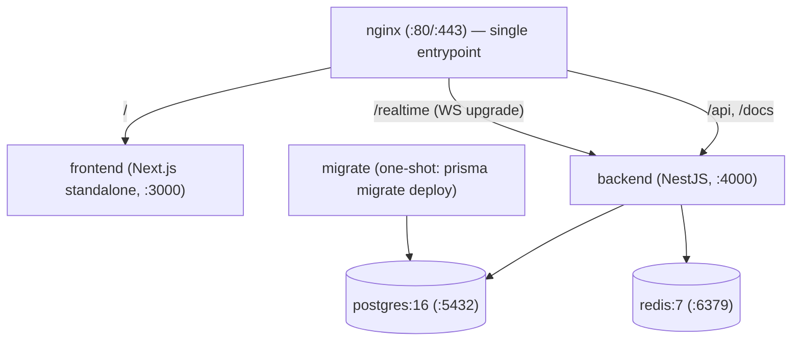

| Container | Image basis | Port | Role |
| --- | --- | --- | --- |
| `frontend` | `node:20-alpine` (Next.js standalone) | 3000 | The web client ([Frontend Architecture](./FRONTEND_ARCHITECTURE.md)) |
| `backend` | `node:20-alpine` (NestJS) | 4000 | The API + WebSocket + runtime + wallet + AI + ops ([Backend Architecture](./BACKEND_ARCHITECTURE.md)) |
| `postgres` | `postgres:16-alpine` | 5432 | System of record ([Database Architecture](./DATABASE_ARCHITECTURE.md)) |
| `redis` | `redis:7-alpine` | 6379 | Cache, locks, sessions, ephemeral state |
| `nginx` | `nginx:1.27-alpine` | 80/443 | Reverse proxy / single entrypoint |
| `migrate` | (backend image) | — | One-shot Prisma migration runner |

### 1.2 How it deploys

The deployment model has three tiers of sophistication, all real:

1. **Local / single-host:** `docker compose -f docker/docker-compose.yml up --build` brings up the full stack.
2. **Production single-host:** the prod override (`docker-compose.prod.yml`) adds replicas, resource limits, log rotation, and **zero-downtime start-first** updates.
3. **Orchestrated (GHCR images):** the release workflow publishes versioned, scanned images to GHCR (`ghcr.io/<repo>-{backend,frontend}:<version>`) for a Kubernetes/Swarm/compose orchestrator to pull.

### 1.3 The deployment guarantees

| Guarantee | How |
| --- | --- |
| Reproducible builds | Multi-stage Docker + `pnpm install --frozen-lockfile` + pinned tool versions |
| Minimal, secure images | Turbo prune → standalone output; non-root user; tini init |
| Zero-downtime deploys | `start-first` update order (new healthy before old stops) |
| Safe schema evolution | Additive-first migrations, applied before boot ([§11](#11-database-migration-strategy)) |
| Fast rollback | Re-tag a known-good, already-scanned GHCR image ([§19](#19-rollback-procedures)) |
| Supply-chain integrity | SBOM + provenance + Trivy scan + CodeQL + Dependabot |
| Correct signal handling | `tini` as PID 1 → graceful SIGTERM shutdown |

### 1.4 Why this deployment shape

The platform is a **modular monolith** ([Backend §1.4](./BACKEND_ARCHITECTURE.md#14-backend-philosophy)) — one backend deployable, one frontend deployable, over a two-service data tier — so it doesn't need a service mesh, a dozen microservice pipelines, or a control plane to run. The Docker + compose + GHCR shape is the right fit: reproducible, minimal, orchestrator-agnostic, and simple enough to run on a single host yet ready to scale horizontally. Every choice (multi-stage builds, non-root, start-first, additive migrations) exists to make deploys **reproducible, secure, and reversible** — the three properties that matter most for a money-handling platform. Reproducible so a release is exactly what was tested; secure so the pipeline and images can't be a vector; reversible so a mistake is a two-minute rollback, not an outage. Everything in this guide serves those three properties. See [ADR-001](#25-architecture-decision-records).

---

## 2. Deployment Philosophy

Six convictions shape deployment.

### 2.1 Reproducible builds

Builds are deterministic: `pnpm install --frozen-lockfile` (no lockfile drift), pinned tool versions (`pnpm@9.15.0`, Node 20 via `.nvmrc`, `turbo@^2`), and multi-stage Docker with layer caching. The same commit builds the same image, every time, anywhere — a prerequisite for trustworthy releases and rollbacks. See [§8](#8-build-pipeline).

### 2.1.1 The deployment shape, in prose

Why this particular deployment shape — Docker images, compose, GHCR, nginx — rather than a Kubernetes-first or PaaS-first approach? The reasoning follows from the platform being a **modular monolith** ([Backend §1.4](./BACKEND_ARCHITECTURE.md#14-backend-philosophy)): one backend deployable and one frontend deployable, not a constellation of microservices. For that shape, the chosen approach hits a sweet spot:

- **Orchestrator-agnostic.** The output of the pipeline is a pair of standard OCI images in GHCR. Those images run identically under `docker compose`, Docker Swarm, or Kubernetes — the deployment isn't wedded to any one orchestrator. A team can start with compose on a single host and move to Kubernetes later *with the same images*.
- **Simple enough to run anywhere.** `docker compose up` brings up the entire stack — app, data, proxy — on a laptop or a single VM. There's no requirement to stand up a control plane to run the platform.
- **Sophisticated where it counts.** The prod override adds exactly the production concerns that matter (replicas, limits, log rotation, zero-downtime updates, auto-rollback) without the complexity of a full orchestrator, and the CI/CD pipeline is genuinely production-grade (scanning, SBOM, provenance).

The trade-off is that at large scale, a full orchestrator (Kubernetes with HPA, managed data services) becomes worthwhile — and the roadmap ([§26](#26-future-deployment-roadmap)) names that path. But the images and health probes are already orchestrator-ready, so that transition is adopting new infrastructure around the *same artifacts*, not re-architecting. "Simple by default, ready to scale" is the deployment philosophy in one phrase. See [ADR-001](#25-architecture-decision-records).

### 2.2 Minimal, secure images

Images are pruned to the minimum: Turbo's `prune --docker` reduces the monorepo to only the target app and its dependencies, and the frontend uses Next.js **standalone** output (a minimal server bundle). Containers run as a **non-root** user (uid 1001), on Alpine base images, with `tini` as init. A smaller image is a smaller attack surface and a faster pull. See [§6](#6-docker-architecture) and [ADR-002](#25-architecture-decision-records).

### 2.3 Zero-downtime by default

Production updates use **start-first** ordering: a new container must pass its health check *before* the old one is stopped. A deploy never drops traffic. If the new version fails to become healthy, the update **automatically rolls back**. See [§10](#10-release-process) and [ADR-006](#25-architecture-decision-records).

### 2.4 Additive-first, forward-only schema

Migrations are additive-first (add before remove) and applied **before** the app boots, so old and new app versions are compatible with the schema during a rolling deploy. Corrections are forward migrations, never destructive down-migrations. This is what makes zero-downtime deploys safe for a database-backed platform. See [§11](#11-database-migration-strategy) and [Database §22](./DATABASE_ARCHITECTURE.md#22-migration-strategy).

### 2.5 Fast, artifact-based rollback

Rollback re-tags a **previously-released, already-scanned** GHCR image — no rebuild. Because the previous image is a known-good, tested artifact, rolling back is fast and safe. Combined with additive migrations, an app rollback doesn't require a database rollback. See [§19](#19-rollback-procedures) and [ADR-007](#25-architecture-decision-records).

### 2.6 Secrets never in the image or repo

`.env.example` documents every variable; real secrets are **injected by the deployment platform**, never committed and never baked into an image. The layered `.env` files carry only non-secret, environment-specific configuration. See [§12](#12-secrets-management) and [ADR-008](#25-architecture-decision-records).

---

## 3. Infrastructure Overview

### 3.1 The deployment topology

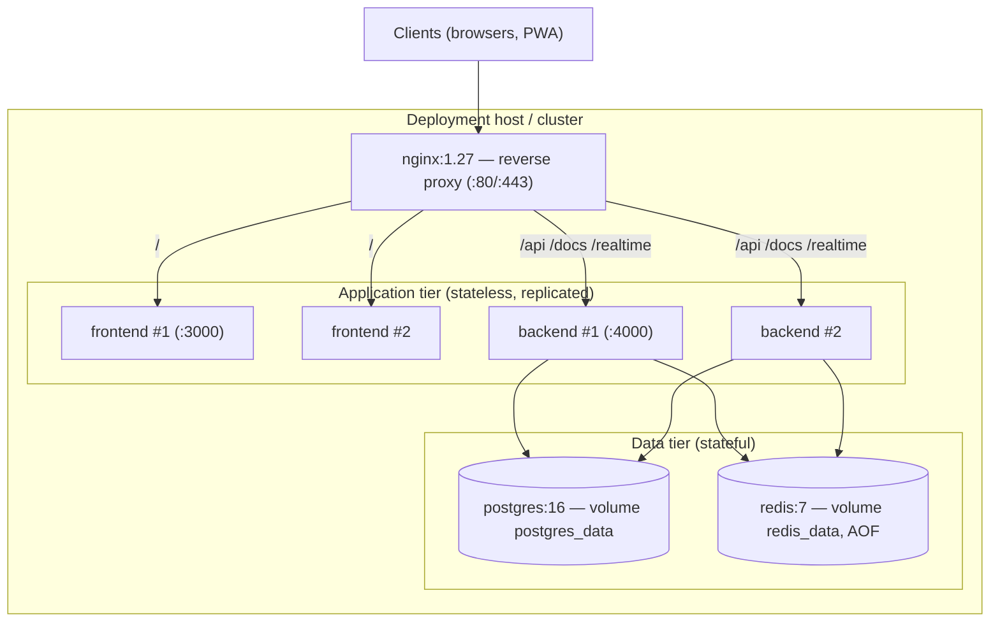

### 3.2 The nginx reverse proxy

`nginx.conf` is the single entrypoint, routing by path:

| Path | Upstream | Notes |
| --- | --- | --- |
| `/` | `frontend:3000` | Next.js (with WebSocket upgrade for HMR/RSC) |
| `/api/` | `backend:4000` | REST API |
| `/docs` | `backend:4000` | Swagger |
| `/realtime/` | `backend:4000` | Socket.IO (WebSocket upgrade, `read_timeout 3600s`) |

Nginx handles gzip compression, forwards `X-Real-IP`/`X-Forwarded-For`/`X-Forwarded-Proto`, caps request bodies at `10m`, hides its version (`server_tokens off`), and maps the `Upgrade` header for WebSocket connections. The `map $http_upgrade $connection_upgrade` block plus per-location `proxy_set_header Upgrade`/`Connection` is what makes the platform's nine Socket.IO gateways ([Backend §11](./BACKEND_ARCHITECTURE.md#11-websocket-architecture)) work through the proxy — the `/realtime/` location's `3600s` read timeout keeps long-lived game/wallet sockets alive.

### 3.3 The data tier

| Service | Config | Persistence |
| --- | --- | --- |
| `postgres:16-alpine` | user/password/db from env | volume `postgres_data` |
| `redis:7-alpine` | `--appendonly yes` (AOF); prod adds `--maxmemory 512mb --maxmemory-policy allkeys-lru` | volume `redis_data` |

Postgres is the durable system of record; Redis is the cache/lock/ephemeral layer with AOF persistence for durability across restarts. In production, Redis is capped at 512MB with LRU eviction — appropriate for a cache where old entries can be evicted, since durable truth lives in Postgres ([Operations §1.3](./OPERATIONS_PLATFORM.md#13-the-defining-property-in-process-and-deterministic)).

### 3.4 The network

All services share a single Docker bridge network (`gaming`), so they reach each other by service name (`postgres`, `redis`, `backend`, `frontend`) — which is why `DATABASE_URL` uses `@postgres:5432` and `REDIS_HOST=redis` inside the compose network. The only ports exposed to the host in production are through nginx; the app and data containers are not host-published (`ports: []` in the prod override).

---

## 4. Supported Environments

The platform supports three environments — development, staging, production — selected by `NODE_ENV` and layered `.env` files.

### 4.1 The three environments

| Environment | `NODE_ENV` | Purpose |
| --- | --- | --- |
| **Development** | `development` | Local work; relaxed security, verbose logging |
| **Staging** | `staging` | Pre-production validation; production-like with docs enabled |
| **Production** | `production` | Live; hardened, minimal logging, docs disabled |

### 4.2 The layered configuration

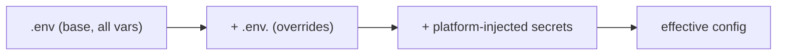

Configuration layers: `.env` (base, documented by `.env.example`) → `.env.<NODE_ENV>` (environment overrides) → platform-injected secrets. The backend validates the effective config with Zod at boot and **refuses to start** on invalid config ([Backend §16.1](./BACKEND_ARCHITECTURE.md#161-validation-at-boot-fail-fast)).

### 4.3 The environment differences

The `.env.{development,staging,production}` files differ in exactly these settings:

| Setting | development | staging | production |
| --- | --- | --- | --- |
| `NODE_ENV` | development | staging | production |
| `LOG_LEVEL` | debug | info | **warn** |
| `SWAGGER_ENABLED` | true | true | **false** |
| `AUTH_COOKIE_SECURE` | false | **true** | **true** |
| `CORS_ORIGINS` | localhost:3000,4000 | staging.example.com | example.com |
| `NEXT_PUBLIC_ENVIRONMENT` | development | staging | production |
| `RATE_LIMIT_LIMIT` | 300 | 120 | 120 |

The progression hardens toward production: logging quiets (debug→info→warn), Swagger is disabled in production (no API surface exposure), cookies require HTTPS (`AUTH_COOKIE_SECURE=true` from staging), CORS narrows to the real domain, and rate limiting tightens (300→120). Development is deliberately permissive for productivity; production is deliberately locked down. See [§20](#20-production-hardening).

### 4.4 Why environment-specific overrides (not one config)

Keeping environment differences in small override files — rather than branching logic in code — means the *code* is identical across environments, and only *configuration* changes. This is the twelve-factor principle: the same build artifact runs in every environment, differing only by injected config. A bug can't hide in an "if production" branch because there isn't one; the difference is data. See [ADR-009](#25-architecture-decision-records).

---

## 5. Environment Variables

`.env.example` documents every supported variable — the authoritative configuration reference.

### 5.1 Core & server

| Variable | Purpose | Example |
| --- | --- | --- |
| `NODE_ENV` | Environment selector | `production` |
| `APP_NAME` / `TZ` | App name, timezone | `gaming-platform` / `UTC` |
| `BACKEND_PORT` / `BACKEND_HOST` | Backend bind | `4000` / `0.0.0.0` |
| `API_PREFIX` / `API_VERSION` | Route prefix | `api` / `1` |
| `CORS_ORIGINS` | Allowed origins (comma-separated) | `https://example.com` |
| `RATE_LIMIT_TTL` / `RATE_LIMIT_LIMIT` | Throttle window/limit | `60` / `120` |
| `SWAGGER_ENABLED` / `SWAGGER_PATH` | API docs | `false` / `docs` |
| `LOG_LEVEL` | Winston level | `warn` |

### 5.2 Frontend (public)

| Variable | Purpose |
| --- | --- |
| `FRONTEND_PORT` | Frontend bind |
| `NEXT_PUBLIC_APP_NAME` | App name (browser) |
| `NEXT_PUBLIC_API_URL` | Backend API URL (browser) |
| `NEXT_PUBLIC_WS_URL` | WebSocket URL (browser) |
| `NEXT_PUBLIC_ENVIRONMENT` | Environment (browser) |

**Critical:** `NEXT_PUBLIC_*` variables are **baked into the frontend build** (they're compiled into the browser bundle), so they're passed as Docker **build args** ([§6.3](#63-the-frontend-image)), not runtime env. Only `NEXT_PUBLIC_`-prefixed variables reach the browser ([Frontend §19.4](./FRONTEND_ARCHITECTURE.md#194-public-config-only)).

### 5.2.1 The NEXT_PUBLIC build-time gotcha

This is the single most common frontend deployment mistake, so it's worth making explicit. `NEXT_PUBLIC_API_URL`, `NEXT_PUBLIC_WS_URL`, etc. are **compiled into the static JavaScript bundle at build time** — they are *not* read at runtime. This has two consequences:

| Consequence | Implication |
| --- | --- |
| They're build args, not runtime env | Passed via `docker build --build-arg` / compose `build.args`, not `environment:` |
| They're environment-specific per image | A staging frontend image and a production frontend image differ (different API URLs baked in) |

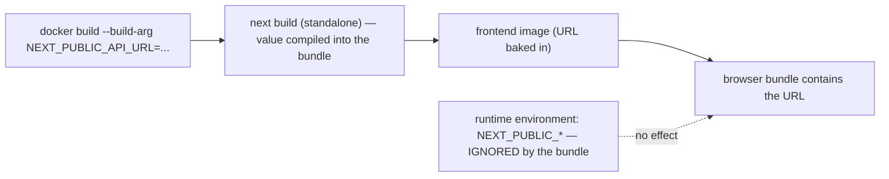

The **symptom** of getting this wrong: you set `NEXT_PUBLIC_API_URL` as a runtime environment variable, deploy, and the frontend still calls the *old* (build-time) URL — because the bundle was compiled with the old value and ignores the runtime one. The **fix**: pass the correct URL as a *build arg* and rebuild the image. The compose `frontend.build.args` block and the Dockerfile's `ARG`/`ENV` pairs are set up for exactly this. Unlike the backend (whose config is all runtime env), the frontend's public config is a **build-time** decision — which is why the same commit produces a *different* frontend image per environment. Backend config differs by runtime env; frontend public config differs by build arg. Internalizing this distinction prevents the most frustrating "why is it calling the wrong URL?" deployment bug. See [ADR-017](#25-architecture-decision-records).

### 5.3 Data tier

| Variable | Purpose |
| --- | --- |
| `POSTGRES_HOST/PORT/USER/PASSWORD/DB` | Postgres connection parts |
| `DATABASE_URL` | Full Prisma connection string |
| `REDIS_HOST/PORT/PASSWORD/URL` | Redis connection |
| `REDIS_TTL` | Default cache TTL (3600s) |

### 5.4 Auth & security

| Variable | Purpose |
| --- | --- |
| `JWT_ACCESS_SECRET` / `JWT_REFRESH_SECRET` | Token signing (≥16 chars; generate with `openssl rand -base64 48`) |
| `JWT_ACCESS_EXPIRES_IN` / `JWT_REFRESH_EXPIRES_IN` | Token lifetimes (15m / 7d) |
| `BCRYPT_SALT_ROUNDS` | Password hashing cost (12) |
| `AUTH_COOKIE_NAME/DOMAIN/SECURE` | Refresh cookie |
| `ACCOUNT_LOCK_MAX_ATTEMPTS` / `_DURATION_MINUTES` | Lockout policy |
| `MAX_CONCURRENT_SESSIONS` | Session cap |
| `PASSWORD_BREACH_CHECK_ENABLED` | HIBP check |
| `EMAIL_VERIFICATION_TTL_HOURS` / `PASSWORD_RESET_TTL_MINUTES` | Token TTLs |
| `TWO_FACTOR_ISSUER` | 2FA issuer |

These are consumed and validated by the backend config layer ([Backend §16](./BACKEND_ARCHITECTURE.md#16-configuration-management)).

### 5.5 Mail & observability

| Variable | Purpose |
| --- | --- |
| `MAIL_HOST/PORT/SECURE/USER/PASSWORD/FROM` | SMTP (when `MAIL_HOST` empty, emails are logged not sent) |
| `APP_WEB_URL` | Base URL for email links |
| `SENTRY_DSN` | Error reporting (optional) |
| `OTEL_EXPORTER_OTLP_ENDPOINT` | OpenTelemetry export (optional) |
| `AI_PROVIDER` / `ANTHROPIC_API_KEY` / `AI_MODEL` | LLM provider ([AI §13.4](./AI_PLATFORM.md#134-model-configuration)) |
| `NGINX_PORT` / `NGINX_SSL_PORT` | Proxy ports |

### 5.6 Secret vs. non-secret variables

| Kind | Examples | Handling |
| --- | --- | --- |
| **Secret** | JWT secrets, DB/Redis passwords, SMTP password, `ANTHROPIC_API_KEY` | Injected by the platform; never committed |
| **Non-secret config** | ports, log level, CORS, feature flags, public URLs | Layered `.env` files |

The `.env.example`, `.env.development/staging/production` files contain **only non-secret config**; every real secret is a placeholder (`replace_with_a_long_random_access_secret`, `change_me_in_production`). See [§12](#12-secrets-management).

---

## 6. Docker Architecture

Both apps use **multi-stage** Dockerfiles that build from the monorepo root, prune to their scope, build, and produce a minimal non-root runtime image.

### 6.1 The multi-stage pattern

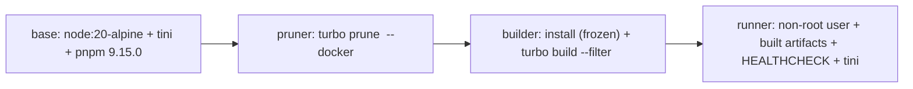

| Stage | Purpose |
| --- | --- |
| `base` | Common toolchain: Alpine, `tini`, `libc6-compat`, `openssl` (backend), corepack + `pnpm@9.15.0` |
| `pruner` | `turbo prune <app> --docker` → a minimal subset (only the app + its deps) with a split lockfile/manifests (`out/json`) and full source (`out/full`) |
| `builder` | Install deps from the pruned lockfile (`--frozen-lockfile`), then `turbo run build --filter <app>` |
| `runner` | Copy built artifacts, create a non-root user, set `HEALTHCHECK`, `tini` entrypoint |

**Why prune:** the monorepo has many packages, but the backend image needs only the backend and its workspace dependencies. `turbo prune --docker` produces exactly that subset, so the install and build stages are fast and the final image is small. The split (`out/json` first for lockfile+manifests, then `out/full` for source) maximizes Docker layer caching — a source change doesn't invalidate the dependency-install layer. See [ADR-002](#25-architecture-decision-records).

### 6.2 The backend image

`Dockerfile.backend`:

| Aspect | Value |
| --- | --- |
| Base | `node:20-alpine` + `tini` + `libc6-compat` + `openssl` |
| Build | prune → `pnpm install --frozen-lockfile` → `turbo build --filter @gaming-platform/backend` |
| Runtime user | non-root `nestjs` (uid 1001, group `nodejs` gid 1001) |
| Working dir | `/app/apps/backend` |
| Port | `EXPOSE 4000` |
| Init | `tini` (PID 1) → correct SIGTERM → Nest `enableShutdownHooks` graceful shutdown |
| Command | `node dist/main.js` |
| Healthcheck | liveness probe (see [§15](#15-health-checks)) |

The `openssl` package is included because Prisma's query engine needs it. `tini` is essential: as PID 1 it forwards SIGTERM to Node so Nest's shutdown hooks run (disconnecting Prisma, quitting Redis, stopping runtimes) — without it, `docker stop` would `SIGKILL` after a timeout, cutting off in-flight work. See [Backend §20.1](./BACKEND_ARCHITECTURE.md#201-container).

### 6.3 The frontend image

`Dockerfile.frontend`:

| Aspect | Value |
| --- | --- |
| Base | `node:20-alpine` + `tini` |
| Build | prune → install → **standalone** build (`BUILD_STANDALONE=true`) |
| Build args | `NEXT_PUBLIC_APP_NAME/API_URL/WS_URL/ENVIRONMENT` (baked into the bundle) |
| Runtime | copies `.next/standalone`, `.next/static`, `public` |
| Runtime user | non-root `nextjs` (uid 1001) |
| Port | `EXPOSE 3000` (`PORT=3000`, `HOSTNAME=0.0.0.0`) |
| Command | `node apps/frontend/server.js` |
| Healthcheck | GET `/` < 500 |

The **standalone output** ([Frontend §15.1](./FRONTEND_ARCHITECTURE.md#151-bundle-strategy)) is key: `BUILD_STANDALONE=true` makes Next.js emit a self-contained server bundle with a minimal `node_modules`, so the runtime image doesn't need the full dependency tree — just the standalone server, static assets, and public files. `NEXT_TELEMETRY_DISABLED=1` and the `NEXT_PUBLIC_*` args are set at build time because they're compiled into the client bundle.

### 6.3.1 How layer caching makes builds fast

The multi-stage split isn't just for minimal images — it's engineered for **build speed via layer caching**. The pruner emits two directories: `out/json` (lockfile + package manifests only) and `out/full` (the source). The builder copies them in a deliberate order:

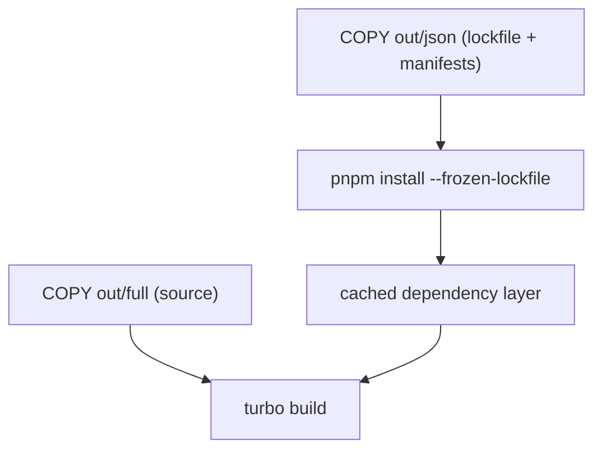

Docker caches each layer, and a layer's cache is invalidated only when its inputs change. By copying **manifests first and installing before copying source**, the expensive `pnpm install` layer is cached and **reused as long as the dependencies haven't changed** — even when the source changes. So a typical code-only change skips the entire dependency install (often the slowest step) and only re-runs the build. This is why CI and release builds are fast despite a large monorepo: a source change rebuilds the source, not the dependencies. If instead source and manifests were copied together, any source edit would bust the install cache and force a full re-install every build. The `out/json` / `out/full` split from `turbo prune` exists precisely to enable this caching discipline. See [ADR-002](#25-architecture-decision-records), [ADR-014](#25-architecture-decision-records).

### 6.4 Image security posture

| Control | Implementation |
| --- | --- |
| Non-root | Both images run as uid 1001, never root |
| Minimal base | Alpine + only required packages |
| Minimal content | Pruned (backend) / standalone (frontend) |
| Proper init | `tini` reaps zombies, forwards signals |
| Healthcheck | Container-level liveness |
| No secrets baked | Secrets are runtime env, never build-time (except public `NEXT_PUBLIC_*`) |
| SBOM + provenance | Generated at release ([§10](#10-release-process)) |

---

## 7. Docker Compose

Two compose files define the stack: a base (`docker-compose.yml`) and a production override (`docker-compose.prod.yml`).

### 7.1 The base compose

`docker-compose.yml` defines six services on the `gaming` bridge network with two named volumes:

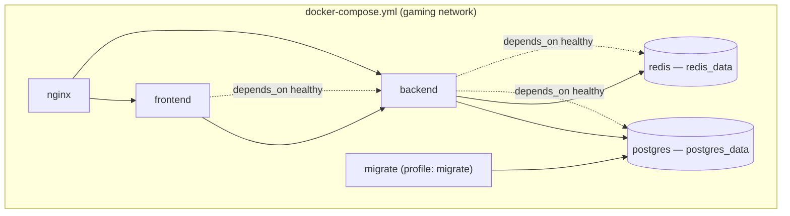

| Service | Key config |
| --- | --- |
| `postgres` | healthcheck `pg_isready`, volume, `restart: unless-stopped` |
| `redis` | `--appendonly yes`, healthcheck `redis-cli ping`, volume |
| `backend` | `env_file: ../.env`, `DATABASE_URL`/`REDIS_HOST` overridden for the network, `depends_on` postgres+redis healthy, healthcheck `/api/v1/health` |
| `frontend` | build args, `depends_on` backend healthy, healthcheck `/` |
| `migrate` | `profile: migrate` (not started by default), runs `prisma migrate deploy` |
| `nginx` | mounts `nginx.conf`, port 80, depends on frontend+backend |

### 7.2 Dependency ordering

`depends_on` with `condition: service_healthy` enforces startup order: the backend waits for postgres **and** redis to be healthy (not just started), and the frontend waits for the backend to be healthy. This prevents the classic race where the app starts before the database is ready and crashes on the first query. Because the backend also validates config at boot ([Backend §16.1](./BACKEND_ARCHITECTURE.md#161-validation-at-boot-fail-fast)), a healthy start means both config and dependencies are good.

### 7.3 The migration service

The `migrate` service is a **one-shot** runner gated behind the `migrate` profile (so it doesn't start with `up`). It runs `prisma migrate deploy` against the database and exits:

```
docker compose -f docker/docker-compose.yml --profile migrate run --rm migrate
```

This is the deployment-time migration step: run it **before** deploying a new backend version, so the schema is up to date before the app boots ([§11](#11-database-migration-strategy)). Separating migration into its own one-shot container (rather than running it in the backend's entrypoint) means migrations run **once**, not once per backend replica — critical when scaling to multiple backend instances. See [ADR-004](#25-architecture-decision-records).

### 7.4 The production override

`docker-compose.prod.yml` layers production concerns on top of the base:

| Concern | Config |
| --- | --- |
| **Replicas** | backend ×2, frontend ×2 |
| **Resource limits** | postgres 2 CPU/2G, redis 1 CPU/768M, backend 1.5 CPU/1G, frontend 1 CPU/768M |
| **Reservations** | guaranteed minimums per service |
| **Log rotation** | `json-file`, max 20m × 5 files |
| **Redis eviction** | `--maxmemory 512mb --maxmemory-policy allkeys-lru` |
| **No host ports** | `ports: []` — everything behind nginx |
| **Restart policy** | backend `on-failure`, 3 attempts, 5s delay, 120s window |
| **Update strategy** | `start-first`, parallelism 1, `failure_action: rollback` |
| **Rollback strategy** | `stop-first` |

Applied with:

```
docker compose -f docker/docker-compose.yml -f docker/docker-compose.prod.yml up -d
```

The override transforms the base into a production-grade deployment: replicated, resource-bounded, log-rotated, and zero-downtime. See [§10](#10-release-process), [§13](#13-scaling-strategy).

### 7.5 Network isolation

A subtle but important production property: the prod override sets `ports: []` on the backend and frontend, **removing their host port publishing**. In development, backend `:4000` and frontend `:3000` are published to the host for convenience. In production, they are **not** — the only host-published ports are nginx's `:80`/`:443`. This means the app and data containers are reachable **only** through the internal `gaming` network and, from outside, **only** via nginx.

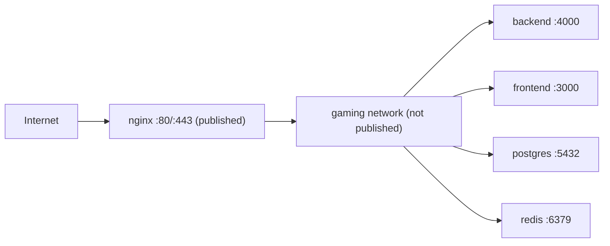

The security benefit is significant: an attacker cannot hit the backend, frontend, Postgres, or Redis directly — every external request goes through nginx, which enforces the routing, forwarded headers, body-size limits, and (in production) TLS. Postgres and Redis are **never** exposed to the host at all, so the database isn't reachable from outside the Docker network. This is a defense-in-depth control: even if a service had a vulnerability, it's not directly addressable. The single-entrypoint-through-nginx model is what makes this isolation clean — there's exactly one door, and it's the hardened proxy. See [§20.3](#203-edge-hardening-nginx).

---

## 8. Build Pipeline

The build is orchestrated by **Turborepo** across the pnpm monorepo.

### 8.1 The monorepo build

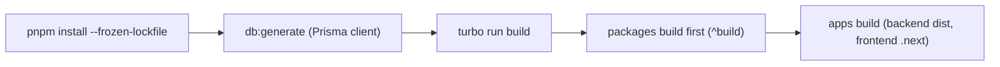

Turbo's task graph (`turbo.json`) enforces ordering: `build` depends on `^build` (dependencies build first) and `db:generate` (the Prisma client must exist before the backend typechecks/builds). Outputs are cached (`dist/**`, `.next/**` excluding cache), so unchanged packages don't rebuild.

### 8.2 The build scripts

| Script | Purpose |
| --- | --- |
| `pnpm build` | `turbo run build` — build everything |
| `pnpm typecheck` | `turbo run typecheck` |
| `pnpm lint` | `turbo run lint` |
| `pnpm test` | `turbo run test` |
| `pnpm db:generate` | Generate the Prisma client |
| `pnpm db:migrate:deploy` | Apply migrations (production) |

### 8.3 Turbo caching & env

`turbo.json` declares `globalDependencies` (`.env`, `tsconfig.base.json`) and `globalPassThroughEnv` (`DATABASE_URL`, `REDIS_URL`, `JWT_*`) so cache keys account for config that affects builds. The `db:generate` task is `cache: false` (always regenerate the client). This caching is what makes CI fast — only changed packages rebuild — while remaining correct (a config change invalidates the cache).

### 8.4 The Docker build vs. the CI build

There are two build contexts, both real:

| Context | How | When |
| --- | --- | --- |
| **CI build** | `pnpm build` on the runner | Every push/PR (verify job) |
| **Docker build** | multi-stage Dockerfile | CI docker job + release |

The CI build validates the code compiles and tests pass (fast, cached); the Docker build produces the deployable image (reproducible, self-contained). Both use the same underlying `turbo build`, so they can't diverge. See [§9](#9-cicd-workflows).

---

## 9. CI/CD Workflows

Four GitHub Actions workflows govern quality, release, rollback, and security.

### 9.1 The workflow map

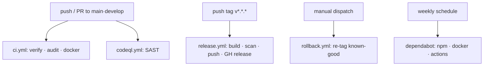

| Workflow | Trigger | Purpose |
| --- | --- | --- |
| `ci.yml` | push/PR to main·develop | Lint, typecheck, test, build, audit, docker build |
| `codeql.yml` | push/PR + weekly | SAST (JS/TS, security-and-quality) |
| `release.yml` | tag `v*.*.*` | Build, scan, push images to GHCR + GitHub release |
| `rollback.yml` | manual dispatch | Re-tag a known-good image |
| `dependabot.yml` | weekly | Dependency updates (npm, docker, actions) |

### 9.2 The CI workflow

`ci.yml` has three jobs:

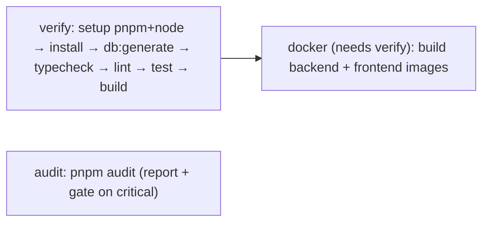

| Job | Steps |
| --- | --- |
| `verify` | Checkout → pnpm 9.15.0 → Node 20 (pnpm cache) → `install --frozen-lockfile` → `db:generate` → `typecheck` → `lint` → `test` → `build` |
| `audit` | `pnpm audit --prod` (report) + gate on `critical` |
| `docker` | (after verify) build both images to validate the Dockerfiles |

Concurrency is grouped per ref with `cancel-in-progress: true` — a new push cancels an in-flight run, saving CI minutes. The full gate (typecheck + lint + test + build) must pass before merge, and the docker job proves the images build. See [§24](#24-coding--release-standards).

### 9.3 The CodeQL workflow

`codeql.yml` runs static application security testing on the TypeScript/JavaScript code with the `security-and-quality` query suite, on every push/PR and weekly (Mondays). This catches security-relevant code patterns (injection, unsafe deserialization) before they ship, complementing the runtime security controls ([Backend §18](./BACKEND_ARCHITECTURE.md#18-security)).

### 9.3.1 Why the CI gate is shaped this way

The CI ordering — verify → (docker after verify) — is deliberate. The `verify` job runs the fast checks first (typecheck, lint, test, build) because they catch the most issues cheapest; the `docker` job runs **only after** verify passes (`needs: verify`), because building images for code that doesn't even compile would waste minutes. The `audit` job runs in parallel (it's independent of the build). This shape optimizes for **fast failure**: a typecheck error fails in seconds, not after a full Docker build. The `concurrency: cancel-in-progress` completes the optimization — pushing a fix while CI is running cancels the superseded run, so CI always reflects the *latest* commit and never wastes minutes on obsolete code. Together these choices make CI both **thorough** (nothing merges without the full gate) and **efficient** (fail fast, don't waste work). The gate's completeness is the point: because every merge is typechecked, linted, tested, built, image-built, and SAST-scanned, every commit on the default branch is releasable — which is what makes tag-triggered releases safe. See [§24.2](#242-the-quality-gate).

### 9.3.2 The three quality layers

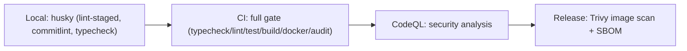

Quality is enforced at four points, each catching what the others might miss: **local hooks** (fast feedback before a push — formatting, commit format, typecheck), **CI** (the full correctness gate), **CodeQL** (security patterns in the code), and **Trivy** (vulnerabilities in the built image). A bug has to slip past all four to reach production. This layering means most issues are caught at the cheapest, earliest stage (local), and only the deepest (image CVEs) require the full pipeline — a cost-efficient defense in depth.

### 9.4 Dependabot

`dependabot.yml` opens weekly update PRs for three ecosystems: `npm` (grouped dev-dependencies, limit 10), `docker` (base images in `/docker`), and `github-actions` (workflow action versions). This keeps dependencies, base images, and CI actions current — a supply-chain hygiene control. See [§20.4](#204-supply-chain-security).

---

## 10. Release Process

A release is triggered by pushing a semver tag; the release workflow builds, scans, and publishes versioned images to GHCR.

### 10.1 The release flow

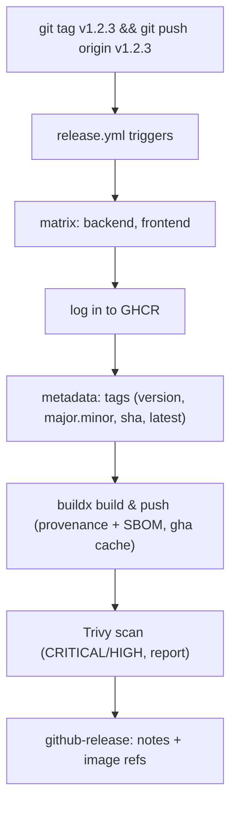

### 10.2 The release steps

| Step | Detail |
| --- | --- |
| **Trigger** | `git tag v1.2.3 && git push origin v1.2.3` (semver tags only) |
| **Build & push** | `docker/build-push-action` with `provenance: true`, `sbom: true`, GHCR |
| **Tags** | `{version}`, `{major}.{minor}`, `sha-<sha>`, `latest` (via `docker/metadata-action`) |
| **Scan** | Trivy scans the pushed image for CRITICAL/HIGH (report-only, `ignore-unfixed`) |
| **Release** | `action-gh-release` creates a GitHub release with generated notes + image references |

Images are published to `ghcr.io/<repo>-backend:<version>` and `ghcr.io/<repo>-frontend:<version>`. The **SBOM and provenance attestations** provide supply-chain traceability (what's in the image, how it was built). The Trivy scan is report-only today (`exit-code: '0'`) — a documented flip to `'1'` would block on findings. See [ADR-005](#25-architecture-decision-records).

### 10.3 The zero-downtime rollout

Once images are published, deploying them (via the prod override or an orchestrator) uses **start-first** rollout:

```mermaid
sequenceDiagram
    autonumber
    participant D as Deploy
    participant NEW as New container
    participant HC as Healthcheck
    participant OLD as Old container
    participant LB as nginx/LB
    D->>NEW: start new version
    NEW->>HC: healthcheck (start_period, then interval)
    HC-->>NEW: healthy
    NEW->>LB: added to rotation
    D->>OLD: stop old version
    OLD->>LB: removed from rotation
    Note over NEW,OLD: traffic never dropped; if new never healthy → auto rollback
```

The prod override's `update_config: { order: start-first, failure_action: rollback }` means a new container must become healthy **before** the old one stops, and if the new version fails to become healthy, the update **automatically rolls back** to the old one. Combined with `parallelism: 1`, updates roll one replica at a time, so there's always a healthy instance serving traffic. See [§2.3](#23-zero-downtime-by-default).

### 10.3.1 A worked zero-downtime deploy

Trace an actual production deploy of `v1.3.0` with 2 backend replicas. Follow the traffic:

| Step | Backend #1 (old v1.2.9) | Backend #2 (old v1.2.9) | New replica (v1.3.0) | Serving traffic |
| --- | --- | --- | --- | --- |
| 0 | healthy, serving | healthy, serving | — | #1, #2 |
| 1: start new #1 | healthy | healthy | starting (start_period) | #1, #2 |
| 2: new #1 healthy | healthy | healthy | **healthy, serving** | #1, #2, new#1 |
| 3: stop old #1 | draining → stopped | healthy | healthy | #2, new#1 |
| 4: start new #2 | — | healthy | healthy | #2, new#1 |
| 5: new #2 healthy | — | healthy | 2× v1.3.0 healthy | old#2, new#1, new#2 |
| 6: stop old #2 | — | draining → stopped | 2× v1.3.0 | new#1, new#2 |

At **every** step there are healthy replicas serving traffic — the deploy never drops a request. The `parallelism: 1` setting rolls one replica at a time, so there's always at least one old-or-new healthy instance. The old replicas **drain gracefully** (tini + shutdown hooks finish in-flight requests before stopping). If, at step 1, the new replica had **failed** to become healthy within its `start_period` + retries, `failure_action: rollback` would kick in: the update stops, and the old replicas keep serving — the bad version never receives traffic. This is the concrete meaning of "zero-downtime with automatic rollback": a good deploy rolls seamlessly, a bad deploy is caught before it can hurt anyone. See [ADR-006](#25-architecture-decision-records).

### 10.4 The full deploy procedure

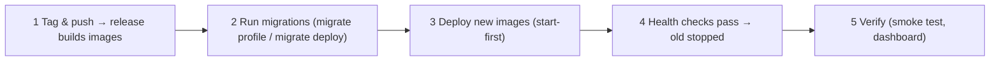

The order is deliberate: **migrate first** (additive, so the old app still works against the new schema), **then** deploy the app (start-first, so no downtime). This is the safe sequence that makes zero-downtime deploys work with a database ([§11.4](#114-the-deploy-sequence)).

---

## 11. Database Migration Strategy

Migrations are managed by **Prisma Migrate**, applied before the app boots, additive-first.

### 11.1 The migration workflow

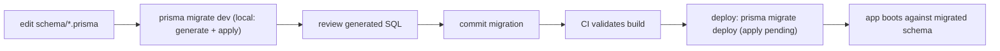

| Command | Environment | Behavior |
| --- | --- | --- |
| `pnpm db:migrate` (`prisma migrate dev`) | development | Generate + apply a migration, regenerate client |
| `pnpm db:migrate:deploy` (`prisma migrate deploy`) | production/CI | Apply pending migrations idempotently |
| `pnpm db:push` | dev/prototyping | Push schema without a migration |
| `pnpm db:seed` | any | Seed reference data |

### 11.2 How migrations run in deployment

Two mechanisms, both real:

1. **The `migrate` compose service** (one-shot): `docker compose --profile migrate run --rm migrate` runs `prisma migrate deploy` in a dedicated container.
2. **The root script**: `pnpm db:migrate:deploy` (delegates to `@gaming-platform/database db:migrate:deploy`).

The migration runs **once** (not per backend replica), **before** the new backend deploys. See [§7.3](#73-the-migration-service).

### 11.3 Additive-first, forward-only

The discipline ([Database §22.2](./DATABASE_ARCHITECTURE.md#222-versioning--deployment-discipline)):

- **Additive-first:** add columns/tables and backfill *before* removing anything, so a new app version is forward-compatible with the previous schema.
- **Forward-only:** a bad migration is fixed with a *new* forward migration, never a destructive down-migration.
- **Money tables append-only:** ledger/transaction tables are never rewritten by a migration ([Wallet §20.3](./WALLET_ENGINE.md#203-rollback--compensation)).

### 11.4 The deploy sequence

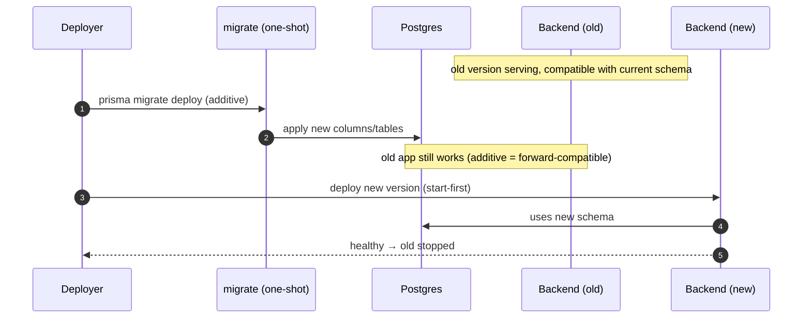

Because migrations are **additive**, there's a window where the old app runs against the new schema — and that's safe, because additive changes don't break the old code (it just ignores the new columns). This is precisely what enables zero-downtime deploys with a database: migrate additively first, then roll the app. See [ADR-003](#25-architecture-decision-records).

### 11.4.1 A worked additive migration

Suppose `v1.3.0` adds a `nickname` column to `users`. The additive-first discipline plays out as:

| Phase | Schema | Old app (v1.2.9) | New app (v1.3.0) |
| --- | --- | --- | --- |
| Before | no `nickname` | works | — |
| Migrate (additive) | `nickname` added (nullable) | **still works** (ignores the new column) | — |
| Deploy new app | `nickname` present | draining | works (reads/writes `nickname`) |
| After | `nickname` present | stopped | works |

The key moment is the middle: after the migration adds `nickname` but *before* the new app is fully rolled out, the **old app is still running against the new schema** — and it works, because a *nullable added column* doesn't break code that doesn't know about it. This is why additive migrations enable zero-downtime deploys: there's a window where old and new code coexist against one schema, and additive changes make that window safe. Contrast a *destructive* migration (dropping a column the old app still reads): it would break the old app the instant it ran, forcing downtime. Now consider *removing* `nickname` later: the safe path is a two-release dance — release N stops writing it (but tolerates its presence), release N+1's migration drops it. Never drop a column the currently-running app still uses. This add-first / remove-later discipline is the heart of zero-downtime schema evolution. See [Database §22.2](./DATABASE_ARCHITECTURE.md#222-versioning--deployment-discipline).

### 11.5 Migration rollback

Because migrations are additive and money tables append-only, **an app rollback rarely requires a database rollback** — the old app version works against the (additively-migrated) new schema. If a schema change genuinely must be reverted, the correct path is a *forward* migration that undoes it (adding back a dropped column, etc.), reviewed and applied like any migration. A destructive `migrate reset` is **never** run in production. See [§19.4](#194-database-considerations-on-rollback).

---

## 12. Secrets Management

Secrets are injected by the deployment platform, never committed or baked into images.

### 12.1 The secret boundary

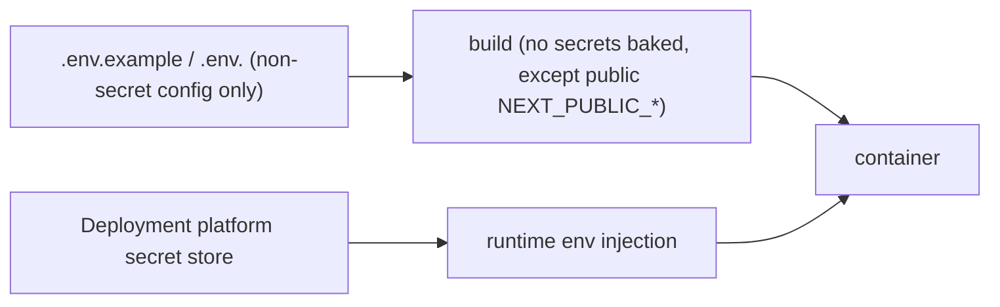

The `.env.production` header states it: *"Real secrets are injected by the deployment platform, never committed."* The committed files carry only non-secret configuration; every secret is a placeholder to be replaced at deploy time by the orchestrator's secret mechanism (Kubernetes Secrets, Docker secrets, a vault, or platform env injection).

### 12.2 What is a secret

| Secret | Generation |
| --- | --- |
| `JWT_ACCESS_SECRET` / `JWT_REFRESH_SECRET` | `openssl rand -base64 48` (≥16 chars, validated at boot) |
| `POSTGRES_PASSWORD` | strong random |
| `REDIS_PASSWORD` | strong random (if used) |
| `MAIL_PASSWORD` | SMTP credential |
| `ANTHROPIC_API_KEY` | from Anthropic (optional) |

### 12.3 Secret hygiene

| Control | Implementation |
| --- | --- |
| Never committed | `.gitignore` excludes `.env`; committed files have placeholders |
| Never in the image | Secrets are runtime env, not build args (except public `NEXT_PUBLIC_*`) |
| Never logged | Winston redacts secrets ([Backend §18.6](./BACKEND_ARCHITECTURE.md#186-logging-redaction)) |
| Validated at boot | JWT secrets must be ≥16 chars or the app refuses to start ([Backend §16.1](./BACKEND_ARCHITECTURE.md#161-validation-at-boot-fail-fast)) |
| Rotatable | Change the injected value and restart; refresh-token rotation ([Wallet/Backend]) limits blast radius |

**Why secrets are runtime, not build-time:** an image is a shareable, cacheable artifact that may be pushed to a registry. Baking a secret into it would leak the secret to anyone who can pull the image. Runtime injection keeps the image secret-free and lets the same image run in staging and production with different secrets. See [ADR-008](#25-architecture-decision-records).

---

## 13. Scaling Strategy

The application tier scales horizontally; the data tier scales vertically (with a documented replica path).

### 13.1 Horizontal application scaling

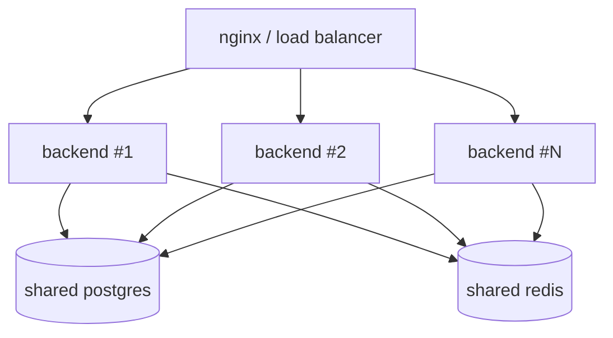

The backend is **stateless** for HTTP ([Backend §19.5](./BACKEND_ARCHITECTURE.md#195-scalability-posture)) — JWT auth needs no server-side session affinity, so N replicas serve behind the load balancer with no coordination. The prod override sets `replicas: 2` for both backend and frontend; scaling out is increasing that number (or the orchestrator's replica count). Each replica runs its own in-process operations platform ([Operations §20.2](./OPERATIONS_PLATFORM.md#202-scaling-posture)).

### 13.2 The scaling signals

Scale decisions are driven by the operations platform's metrics ([Operations §20](./OPERATIONS_PLATFORM.md#20-capacity--scaling)):

| Signal | Scale action |
| --- | --- |
| Sustained high CPU / event-loop lag | Add backend replicas |
| Rising p95 latency | Add replicas before the SLO breaches |
| Growing queue backlog | Add capacity / investigate |
| Memory pressure | Scale up (larger limits) or investigate a leak |

### 13.3 The stateful-tier consideration

The bounded piece is **in-memory WebSocket/runtime state**: live game runtimes and Socket.IO rooms are held in a backend instance's memory ([Runtime §16.4](./GAME_RUNTIME.md#164-concurrency--scaling), [Backend §11.4](./BACKEND_ARCHITECTURE.md#114-scaling-considerations)). Today this means real-time play benefits from sticky sessions (a player's socket returns to the instance holding their runtime), and the documented path to fully-shardable real-time is the **Socket.IO Redis adapter** plus Redis-backed runtime state. The HTTP tier is already stateless; the real-time tier's externalization is the roadmap item. See [§26](#26-future-deployment-roadmap).

### 13.4 Data-tier scaling

| Tier | Scaling |
| --- | --- |
| Postgres | Vertical (prod: 2 CPU/2G); documented path to **read replicas** for analytics/reporting ([Database §25](./DATABASE_ARCHITECTURE.md#25-future-database-roadmap)) |
| Redis | Vertical (prod: 512MB LRU); documented path to a Redis cluster |

Because the schema isolates heavy reporting reads from the transactional hot path ([Database §3.2](./DATABASE_ARCHITECTURE.md#32-readwrite-topology)), routing reporting to a read replica is an application-config change, not a re-architecture.

### 13.5 A worked scale-out

The dashboard shows p95 latency climbing to 900ms (near the 1000ms alert) and event-loop lag rising under a traffic surge. The operator scales the backend from 2 to 4 replicas:

| Before | After |
| --- | --- |
| 2 backend replicas | 4 backend replicas |
| ~1800 req/interval each | ~900 req/interval each |
| p95 900ms, lag 40ms | p95 ~400ms, lag ~10ms |

Because the backend is **stateless for HTTP** (JWT auth, no server-side session store, [Backend §19.5](./BACKEND_ARCHITECTURE.md#195-scalability-posture)), adding replicas requires **no coordination** — the new instances simply register behind nginx and start taking their share of traffic. Each new instance brings its own in-process operations platform, so the fleet's total capacity roughly doubles, halving per-instance load, latency, and lag. The one caveat is real-time state: a player's live game runtime lives in one instance's memory ([§13.3](#133-the-stateful-tier-consideration)), so real-time play benefits from sticky sessions until the Socket.IO Redis adapter is adopted. But the HTTP tier — the bulk of the load — scales linearly and instantly. This is the payoff of the stateless design: capacity is a dial (replica count) an operator turns in response to the metrics, not a re-architecture. The scale-out is itself a start-first rolling operation, so it happens without downtime. See [§21.4](#214-the-node-capacity-signal).

---

## 14. High Availability

### 14.1 The HA posture

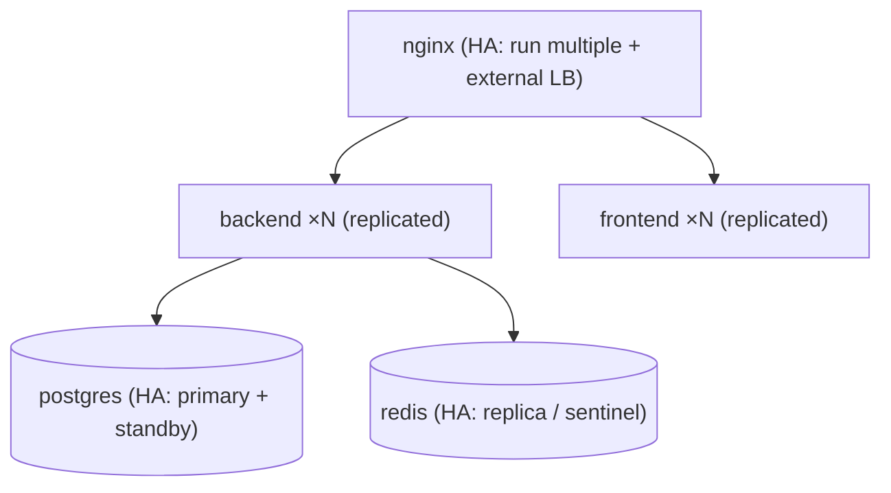

| Tier | HA mechanism (current) | HA path |
| --- | --- | --- |
| Application | ≥2 replicas + start-first + auto-rollback + restart policy | more replicas, multi-node |
| nginx | single proxy | multiple + external LB/ingress |
| Postgres | single primary + volume + backups | primary/standby replication |
| Redis | single + AOF + volume | replica + sentinel |

### 14.2 Application HA

The prod override gives the application tier real HA properties: **≥2 replicas** (no single point of failure for the app), a **restart policy** (`on-failure`, 3 attempts, 5s delay), **start-first updates** (always a healthy instance during a deploy), and **auto-rollback** (a failed update reverts). If one backend replica crashes, the other serves traffic and the failed one restarts.

### 14.3 Graceful shutdown

`tini` + Nest's `enableShutdownHooks` mean a stopped container **drains gracefully**: on SIGTERM, the backend stops accepting new work, finishes in-flight requests, disconnects Prisma, quits Redis, and stops runtimes ([Backend §20.3](./BACKEND_ARCHITECTURE.md#203-health-scaling--rollback)). This is what makes rolling updates safe — a replica being replaced finishes its work rather than dropping connections.

### 14.3.1 A worked graceful shutdown

When a backend replica is stopped during a rolling update, the graceful-shutdown chain plays out:

```mermaid
sequenceDiagram
    autonumber
    participant ORCH as Orchestrator
    participant TINI as tini (PID 1)
    participant NODE as Node/Nest
    participant LB as nginx/LB
    participant PG as Postgres
    participant RD as Redis
    ORCH->>TINI: SIGTERM
    TINI->>NODE: forward SIGTERM
    NODE->>LB: stop accepting new connections (readiness fails)
    NODE->>NODE: finish in-flight requests
    NODE->>PG: Prisma disconnect
    NODE->>RD: Redis quit
    NODE->>NODE: stop runtimes (idle-safe), clear timers
    NODE->>TINI: exit 0
    TINI->>ORCH: container stopped cleanly
```

The critical link is **tini forwarding SIGTERM to Node**. Without tini as PID 1, `docker stop`'s SIGTERM would be ignored by Node (which doesn't handle signals well as PID 1), forcing a `SIGKILL` after the stop timeout — abruptly cutting off in-flight requests, open transactions, and live game runtimes. With tini, Node receives SIGTERM, Nest's `enableShutdownHooks` runs, and the replica **drains**: it stops taking new work, finishes what's in flight, disconnects cleanly from Postgres and Redis, and stops runtimes. A player mid-request gets their response; a settlement in flight completes or rolls back atomically ([Wallet §20.1](./WALLET_ENGINE.md#201-atomicity--all-or-nothing)). This clean drain is what makes rolling updates and scaling-down safe — a replaced replica leaves no severed connections or half-done work. See [ADR-010](#25-architecture-decision-records).

### 14.4 Data-tier HA (current and future)

Currently Postgres and Redis are single instances with **durable volumes** (`postgres_data`, `redis_data`) and **backups** ([§17](#17-backup--restore)) — so data survives a container restart, and a host failure is recoverable from backups. The documented HA upgrade is Postgres primary/standby replication and Redis sentinel/replica, giving automatic failover — a managed-database path that fits the single-deployable model. See [§26](#26-future-deployment-roadmap).

---

## 15. Health Checks

Health checks operate at three levels: container (Docker), compose (dependency ordering), and application (orchestrator probes).

### 15.1 The three levels

```mermaid
flowchart TD
    DOCKER["Docker HEALTHCHECK (in the image)"] --> LIVENESS["liveness — is the process up?"]
    COMPOSE["compose healthcheck (depends_on condition)"] --> ORDER["startup ordering"]
    ORCH["orchestrator probes (external)"] --> READINESS["readiness — gate traffic"]
```

### 15.2 The health endpoints

The backend exposes three Terminus probes ([Backend §15.4](./BACKEND_ARCHITECTURE.md#154-health-probes)):

| Endpoint | Checks | Used by |
| --- | --- | --- |
| `GET /api/v1/health` | Prisma + Redis + memory heap | compose backend healthcheck, dashboards |
| `GET /api/v1/health/liveness` | process up | Docker `HEALTHCHECK` (backend image) |
| `GET /api/v1/health/readiness` | Prisma + Redis reachable | orchestrator readiness probe |
| `GET /operations/status` (public) | up/degraded/down | external monitors ([Operations §8.4](./OPERATIONS_PLATFORM.md#84-the-public-status-endpoint)) |

### 15.3 The Docker healthchecks

| Image/service | Healthcheck | Interval |
| --- | --- | --- |
| backend image | `GET /api/v1/health/liveness` (Node http) | 30s, 5s timeout, 25s start-period, 3 retries |
| frontend image | `GET /` < 500 | 30s, 5s timeout, 20s start-period, 3 retries |
| compose postgres | `pg_isready` | 10s, 5 retries |
| compose redis | `redis-cli ping` | 10s, 5 retries |
| compose backend | `GET /api/v1/health` (wget) | 15s, 20s start-period, 5 retries |
| compose frontend | `GET /` | 15s, 20s start-period, 5 retries |

### 15.4 Why liveness ≠ readiness

The Docker `HEALTHCHECK` uses **liveness** (is the process up?), while the compose backend healthcheck and the orchestrator readiness probe use the **full/readiness** check (are dependencies reachable?). The distinction matters ([Backend §15.4](./BACKEND_ARCHITECTURE.md#154-health-probes)): a backend that's alive but can't reach Postgres should be **pulled from the load balancer** (readiness fails) without being **killed** (liveness passes), so it can recover when Postgres returns. Killing it would just churn; pulling it lets it heal. The `start_period` on each healthcheck gives the container time to boot (config validation, connections, migrations-applied) before health is enforced.

---

## 16. Monitoring Integration

Deployment integrates with the in-process operations platform ([Operations Platform](./OPERATIONS_PLATFORM.md)) and optional external tooling.

### 16.1 In-process observability

Every deployed backend runs its own operations platform — metrics, logs, traces, health, alerts, breakers, queue ([Operations §1](./OPERATIONS_PLATFORM.md#1-executive-summary)). So the moment a container is deployed, it's observable: the ops dashboard (`/operations` gateway), the metrics endpoint, the log explorer, and the ten default alert rules are all live. No external monitoring is *required* for the platform to be observable.

### 16.2 The deployment monitoring surface

```mermaid
flowchart LR
    DEPLOY["deployed backend"] --> HEALTH["/api/v1/health(/readiness)"]
    DEPLOY --> METRICS["/admin/operations/metrics/prometheus"]
    DEPLOY --> DASH["/operations WS dashboard"]
    DEPLOY --> STATUS["/operations/status (public)"]
    METRICS -.optional.-> PROM["external Prometheus + Grafana"]
    DEPLOY -.optional.-> SENTRY["Sentry (SENTRY_DSN)"]
    DEPLOY -.optional.-> OTEL["OTLP collector (OTEL_EXPORTER_OTLP_ENDPOINT)"]
```

| Integration | Env var | Purpose |
| --- | --- | --- |
| Prometheus | (scrape `/metrics/prometheus`) | Fleet metrics aggregation ([Operations §5.4](./OPERATIONS_PLATFORM.md#54-prometheus-exposition)) |
| Sentry | `SENTRY_DSN` | Error reporting (optional) |
| OpenTelemetry | `OTEL_EXPORTER_OTLP_ENDPOINT` | Distributed tracing export (optional) |
| Docker logs | `json-file` (20m × 5) | Log rotation in prod |

### 16.2.1 Observability from the first second

A deliberate consequence of the in-process operations design ([Operations §2.2](./OPERATIONS_PLATFORM.md#22-in-process-by-default-exportable-by-choice)) is that a freshly-deployed container is observable **the instant it's healthy** — there's no waiting for it to register with an external monitoring system, no scrape-config to update, no agent to attach. The moment a backend replica passes its health check, its `/operations` dashboard, `/metrics`, log explorer, and alert evaluation are all live. This matters during a deploy: the operator watching the rollout sees the new replica's metrics appear as it comes up, and can confirm it's healthy and behaving before the old one stops. If the new replica were only observable after some external registration delay, there'd be a blind spot exactly when visibility matters most — during the cutover. In-process observability closes that blind spot: **the thing you deployed watches itself from the first second.** External aggregation (Prometheus scraping each instance) layers on top for the fleet view, but per-instance observability is immediate and unconditional.

### 16.3 Post-deploy verification

After a deploy, verification checks (part of the deploy procedure, [§23.2](#232-deployment-checklist)):

| Check | How |
| --- | --- |
| Health | `GET /api/v1/health` returns 200 |
| Dashboard | ops overview shows `status: up`, no firing alerts |
| Smoke test | key routes respond ([Frontend §20.2](./FRONTEND_ARCHITECTURE.md#202-playwright-e2e)) |
| Money integrity | `wallet-inconsistency` alert not firing; `reconcile()` balanced ([Wallet §19.3](./WALLET_ENGINE.md#193-reconciliation--the-trial-balance)) |

The **money-integrity check** is the most important post-deploy verification: confirm the ledger reconciles and no `failed-settlements`/`wallet-inconsistency` alerts are firing ([Operations §18.4](./OPERATIONS_PLATFORM.md#184-the-money-integrity-alerts)). A deploy that broke settlement would surface here immediately.

---

## 17. Backup & Restore

### 17.1 What to back up

| Data | Where | Criticality |
| --- | --- | --- |
| PostgreSQL | volume `postgres_data` | **Critical** — the system of record (money, users, everything durable) |
| Redis | volume `redis_data` (AOF) | Recoverable — cache/ephemeral; durable truth is in Postgres |

### 17.2 Postgres backup

```mermaid
flowchart LR
    PG[("postgres")] --> DUMP["pg_dump (logical) / pg_basebackup (physical)"]
    DUMP --> STORE["off-host encrypted storage"]
    STORE --> PITR["point-in-time recovery (WAL archiving)"]
```

Postgres is backed up with standard tooling — `pg_dump` for logical backups and, for point-in-time recovery, WAL archiving + `pg_basebackup`. Backups are stored **off-host and encrypted**. The backup cadence and retention are operational policy; the critical rule is that the **money data is always recoverable**. Because the ledger is append-only ([Wallet §11.3](./WALLET_ENGINE.md#113-global-conservation)), a restored backup is internally consistent (the trial balance holds at any point in time).

### 17.3 Redis backup

Redis uses **AOF** (append-only file, `--appendonly yes`) persisted to the `redis_data` volume, so it survives a container restart. Because Redis holds cache, locks, sessions, and ephemeral state — not durable truth — a Redis loss is **recoverable, not catastrophic**: sessions re-authenticate via the refresh cookie ([Backend §11.5](./DATABASE_ARCHITECTURE.md#115-why-sessions-live-in-both-postgresql-and-redis)), caches repopulate from Postgres, and locks are re-acquired. So Redis backup is a convenience (faster warm-up), not a data-safety requirement.

### 17.4 Restore

| Restore | Procedure |
| --- | --- |
| Postgres | Restore the dump/basebackup into a fresh volume; run `migrate deploy` to ensure schema currency; verify `reconcile()` balances |
| Redis | Restore the AOF, or start fresh (it repopulates) |
| Full stack | Restore Postgres, start the data tier, run migrations, deploy the app, verify |

The critical restore verification is the **ledger trial balance** — after restoring Postgres, `reconcile()` must return balanced, confirming the money data is intact and consistent. See [§18](#18-disaster-recovery).

### 17.5 A worked restore

A Postgres volume is corrupted; the team restores from last night's backup + WAL. The procedure and its verification:

```mermaid
flowchart TD
    A["1 stop the app (or put it in maintenance)"] --> B["2 provision a fresh postgres volume"]
    B --> C["3 restore base backup + replay WAL to the target point"]
    C --> D["4 run migrate deploy (ensure schema currency)"]
    D --> E["5 reconcile() — is the ledger balanced?"]
    E --> F{"balanced?"}
    F -->|yes| G["6 deploy the app; verify health + smoke"]
    F -->|no| H["STOP — investigate before resuming (integrity breach)"]
```

The linchpin verification is step 5: **`reconcile()` must return balanced** before the app is allowed back online. Because the ledger is append-only and double-entry ([Wallet §11.3](./WALLET_ENGINE.md#113-global-conservation)), a correctly-restored database *will* reconcile — every posted journal balanced when it was written, and restore preserves those rows. If reconciliation returned *unbalanced*, it would mean the restore was incomplete or corrupted, and resuming would risk operating on inconsistent money data — so the procedure halts. WAL replay determines the RPO: with continuous archiving, the restore point is seconds before the corruption, so at most seconds of activity is lost. The app and Redis recover trivially (redeploy the images; Redis repopulates from Postgres), so the restore time is dominated by the Postgres base-restore + WAL replay. This is why the whole DR posture centers on Postgres: it's the only tier holding irreplaceable, integrity-critical state, and its restore is gated on the trial balance. See [§18.3](#183-the-recovery-priorities).

---

## 18. Disaster Recovery

### 18.1 The DR scenarios

| Disaster | Recovery |
| --- | --- |
| Backend container crash | restart policy (auto) + other replica serves |
| Backend node loss | orchestrator reschedules; other replicas serve |
| Redis loss | restart (AOF) or fresh (repopulates); sessions/caches recover |
| Postgres corruption | restore from backup + verify trial balance |
| Full host loss | rebuild host, restore Postgres, redeploy images, verify |
| Bad deploy | rollback ([§19](#19-rollback-procedures)) |

### 18.2 The recovery flow

```mermaid
flowchart TD
    DISASTER["disaster"] --> ASSESS{"what failed?"}
    ASSESS -->|app only| RESTART["restart / reschedule / rollback"]
    ASSESS -->|redis| REDIS["restart AOF / fresh"]
    ASSESS -->|postgres| PGREC["restore backup + migrate + reconcile"]
    ASSESS -->|full host| FULL["rebuild host → restore PG → redeploy → verify"]
    RESTART & REDIS & PGREC & FULL --> VERIFY["verify: health + reconcile + smoke"]
```

### 18.3 The recovery priorities

The recovery order prioritizes the money: (1) restore **Postgres** (the durable truth), (2) verify the **trial balance** reconciles, (3) apply **migrations** to ensure schema currency, (4) restore **Redis** (or let it repopulate), (5) deploy the **application**, (6) run **verification** (health + smoke + money integrity). The platform is designed so that everything except Postgres is recoverable-by-rebuild — the app is stateless (images redeploy), Redis is a cache (repopulates), and only Postgres holds irreplaceable state. This is why Postgres backup is the linchpin of DR.

### 18.4 RTO/RPO considerations

| Objective | Driver |
| --- | --- |
| **RPO** (data loss) | Postgres backup frequency + WAL archiving (near-zero with continuous archiving) |
| **RTO** (downtime) | Time to restore Postgres + redeploy (minutes for app, backup-size-dependent for DB) |

Because the app and Redis recover fast (redeploy / repopulate), the RTO is dominated by the Postgres restore. Continuous WAL archiving minimizes RPO (data loss) to seconds. The append-only ledger means a restored database is always financially consistent — there's no "half-committed money" to reconcile.

### 18.5 The DR readiness principle

A recovery procedure that has never been rehearsed is a hope, not a plan. The platform's DR posture is *designed* to be rehearsable because its recovery primitives are simple and verifiable: restore Postgres, run `migrate deploy`, check `reconcile()`, redeploy the images. Each step has an unambiguous success signal (the migration applies, the trial balance balances, the health check passes), so a DR drill can confirm the whole chain works without ambiguity. The recommended cadence is to periodically **restore a backup into an isolated environment and verify the trial balance reconciles** — proving both that the backups are good and that the restore procedure works. Because everything except Postgres is stateless-and-rebuildable, a drill focuses on the one thing that matters: can we get the money data back, intact, fast? The append-only, double-entry ledger makes "intact" a single checkable assertion (`reconcile()` balances), which is what makes the platform's DR genuinely testable rather than aspirational. Treat the backup-restore-reconcile drill as a first-class operational routine, not an afterthought. See [§23.1](#231-pre-deploy-checklist).

---

## 19. Rollback Procedures

Rollback re-tags a previously-released, already-scanned image — fast and safe.

### 19.1 The rollback workflow

```mermaid
flowchart TD
    TRIGGER["manual dispatch: rollback.yml (version, promote_latest?)"] --> LOGIN["log in to GHCR"]
    LOGIN --> PULL["pull ghcr image :<version>"]
    PULL --> RETAG["tag as :rollback (+ optionally :latest)"]
    RETAG --> PUSH["push"]
    PUSH --> REDEPLOY["re-deploy orchestrator to pull :<version>"]
```

`rollback.yml` is a `workflow_dispatch` with inputs `version` (the known-good tag, e.g. `v1.2.2`) and `promote_latest`. It pulls the target version's images, re-tags them as `:rollback` (and optionally `:latest`) **without a rebuild**, and pushes. The summary provides the re-deploy commands (`kubectl set image` or compose with `IMAGE_TAG`).

### 19.2 Why re-tag, not rebuild

```mermaid
flowchart LR
    subgraph Rebuild["Rebuild rollback (avoided)"]
        A["rebuild old version"] --> B["re-scan"] --> C["slow, could differ"]
    end
    subgraph Retag["Re-tag rollback (chosen)"]
        D["pull known-good image"] --> E["re-tag"] --> F["fast, identical, already-scanned"]
    end
```

The previous release's image is a **known-good, tested, already-scanned artifact** — re-tagging it is fast (no build), safe (the exact bytes that were tested), and immediate. Rebuilding would be slower and could theoretically produce a different image (dependency drift, base-image change). Rollback should be the *fastest, safest* operation in the toolkit, and re-tagging a proven artifact is exactly that. See [ADR-007](#25-architecture-decision-records).

### 19.3 The rollback decision

| Situation | Rollback? |
| --- | --- |
| New version fails health during deploy | **Automatic** (`failure_action: rollback`) |
| New version healthy but misbehaving (errors, latency, money issues) | **Manual** rollback workflow |
| Schema change that broke the old app | Forward-fix migration (rare; additive avoids this) |

For a *healthy-but-wrong* deploy (it passed health checks but shows elevated errors or a money-integrity alert), an operator triggers the rollback workflow to the last known-good version, then re-deploys.

### 19.3.1 A worked rollback scenario

`v1.3.0` deploys and passes health checks, but 10 minutes later the ops dashboard shows the `high-error-rate` alert firing and elevated `500`s on `/wallet/settle`. The response:

```mermaid
sequenceDiagram
    autonumber
    participant OP as Operator
    participant DASH as Ops dashboard
    participant RB as rollback.yml
    participant GHCR as GHCR
    participant ORCH as Orchestrator
    DASH->>OP: high-error-rate alert (settlement 500s)
    OP->>OP: identify last known-good: v1.2.9
    OP->>RB: dispatch rollback (version=v1.2.9)
    RB->>GHCR: pull v1.2.9 images → tag :rollback → push
    OP->>ORCH: set image to v1.2.9 (start-first)
    ORCH-->>DASH: v1.2.9 healthy; errors subside
    OP->>DASH: verify reconcile() balanced, alert resolved
    Note over OP: no DB rollback — v1.3.0's migration was additive
```

The operator identifies the last known-good tag (`v1.2.9`), dispatches the rollback workflow (which re-tags the already-scanned `v1.2.9` images — no rebuild, seconds not minutes), and re-deploys start-first. Within a couple of minutes, `v1.2.9` is serving and the error rate subsides. **Crucially, no database rollback is needed**: `v1.3.0`'s migration was additive, so `v1.2.9` runs fine against the (additively-migrated) schema — it just ignores whatever `v1.3.0` added. The operator verifies the ledger reconciles (confirming the brief `v1.3.0` window didn't corrupt money) and the alert resolves. Then the team forward-fixes the settlement bug and re-releases as `v1.3.1`. This is rollback as it should be: fast (re-tag a proven artifact), safe (additive migrations decouple app from DB), and verified (reconcile confirms integrity). See [ADR-007](#25-architecture-decision-records).

### 19.4 Database considerations on rollback

Because migrations are **additive-first**, rolling back the *app* to a previous version is safe **without** rolling back the database — the old app works against the additively-migrated schema ([§11.5](#115-migration-rollback)). This is the crucial property: app rollback and database state are decoupled. You never have to choose between "roll back the app but keep the new schema" — the additive discipline makes them compatible. A schema change that a rollback would genuinely need reverted is handled by a forward-fix migration, never a destructive rollback in production. See [ADR-003](#25-architecture-decision-records).

---

## 20. Production Hardening

### 20.1 Container hardening

| Control | Implementation |
| --- | --- |
| Non-root | uid 1001 (`nestjs`/`nextjs`) |
| Minimal base | Alpine + required packages only |
| Proper init | `tini` PID 1 |
| Resource limits | prod override CPU/memory limits + reservations |
| Log rotation | `json-file` 20m × 5 |
| No host port exposure | `ports: []` — everything behind nginx |
| Restart policy | `on-failure`, bounded attempts |

### 20.2 Application hardening (env)

| Setting | Production value | Effect |
| --- | --- | --- |
| `SWAGGER_ENABLED` | false | No API docs exposed |
| `AUTH_COOKIE_SECURE` | true | Cookies require HTTPS |
| `LOG_LEVEL` | warn | No verbose/debug leakage |
| `CORS_ORIGINS` | real domain only | Locked-down cross-origin |
| `RATE_LIMIT_LIMIT` | 120 | Tight throttling |

These are the production `.env.production` overrides ([§4.3](#43-the-environment-differences)) plus the backend's built-in production behavior (Helmet CSP enabled, Prisma minimal error format, [Backend §20.2](./BACKEND_ARCHITECTURE.md#202-compose--environments)).

### 20.3 Edge hardening (nginx)

`nginx.conf`: `server_tokens off` (hides version), `client_max_body_size 10m` (caps upload size), forwarded headers set correctly (so the app sees the real client IP/proto for rate limiting and security), and gzip for efficiency. TLS termination (`NGINX_SSL_PORT=443`) is the production edge, with `AUTH_COOKIE_SECURE=true` requiring it.

### 20.4 Supply-chain security

| Control | Workflow |
| --- | --- |
| SAST | `codeql.yml` (JS/TS, weekly + PR) |
| Image scanning | Trivy (`release.yml`, CRITICAL/HIGH) |
| SBOM + provenance | `build-push-action` (`sbom: true, provenance: true`) |
| Dependency audit | `pnpm audit` (`ci.yml`, gate on critical) |
| Dependency updates | Dependabot (npm, docker, actions) |

This is defense-in-depth for the supply chain: scan the *code* (CodeQL), the *image* (Trivy), the *dependencies* (audit + Dependabot), and record *what shipped* (SBOM + provenance). Combined with the backend's runtime security ([Backend §18](./BACKEND_ARCHITECTURE.md#18-security)), the platform is hardened from source to runtime.

---

## 21. Performance Tuning

### 21.1 Resource allocation

The prod override sets per-service limits and reservations — the tuning knobs:

| Service | Limit | Reservation |
| --- | --- | --- |
| postgres | 2 CPU / 2G | 0.5 CPU / 1G |
| redis | 1 CPU / 768M | 0.25 CPU / 256M |
| backend | 1.5 CPU / 1G | 0.5 CPU / 512M |
| frontend | 1 CPU / 768M | 0.25 CPU / 256M |
| nginx | 0.5 CPU / 256M | — |

The prod override comment says *"Tune the numbers to your hosts"* — these are starting points sized for a modest host, adjusted per deployment based on the operations platform's metrics ([Operations §20](./OPERATIONS_PLATFORM.md#20-capacity--scaling)).

### 21.2 The tuning loop

```mermaid
flowchart LR
    DEPLOY["deploy with baseline limits"] --> OBSERVE["observe: CPU, memory, event-loop lag, latency"]
    OBSERVE --> ADJUST{"resource-bound?"}
    ADJUST -->|CPU/lag| REPLICAS["add replicas (horizontal)"]
    ADJUST -->|memory| BUMP["raise memory limit or fix leak"]
    ADJUST -->|latency| BOTH["scale + tune queries/cache"]
```

### 21.3 The tuning levers

| Layer | Lever |
| --- | --- |
| Application | replica count (horizontal), CPU/memory limits |
| Database | connection pooling (single Prisma client), indexes, read replicas ([Database §20](./DATABASE_ARCHITECTURE.md#20-performance)) |
| Redis | maxmemory + eviction policy (512MB LRU), caching TTLs |
| Frontend | standalone bundle, `optimizePackageImports`, image optimization ([Frontend §15](./FRONTEND_ARCHITECTURE.md#15-performance)) |
| Edge | gzip, keepalive, nginx worker tuning |

### 21.3.1 A worked tuning cycle

A deployment starts with the override's baseline limits and the operations dashboard reveals a bottleneck. Follow the cycle:

| Observation | Diagnosis | Action | Result |
| --- | --- | --- | --- |
| backend memory pinned at ~950M (limit 1G), rising | approaching the memory limit | raise backend limit to 1.5G *or* investigate | steadied; no OOM |
| p95 900ms, event-loop lag 40ms under load | CPU/loop-bound, not memory | scale backend 2→4 replicas | p95 ~400ms |
| Redis at 512M, cache-miss rate up | LRU evicting hot keys | raise Redis maxmemory to 1G | miss rate down |
| Postgres CPU 90% on reports | reporting on the primary | (roadmap) route reports to a read replica | primary relieved |

The tuning loop is **observe → diagnose → adjust → re-observe**, driven entirely by the operations platform's metrics. The key diagnostic skill is distinguishing *which* resource is the bottleneck: pinned memory says "raise the limit or fix a leak," high event-loop lag says "scale out" (add replicas, since it's a per-instance throughput ceiling), and a rising cache-miss rate says "the cache is too small." Each has a different fix, and applying the wrong one (e.g. adding replicas when the problem is a memory leak) wastes resources without helping. Because the app is stateless, the most common effective action — scaling out — is cheap and safe (a start-first rolling addition). The limits in the prod override are *starting points* the comment explicitly says to tune; this cycle is how you tune them, grounded in real signals rather than guesswork. Over time, a deployment converges on limits sized for its actual traffic. See [Operations §20](./OPERATIONS_PLATFORM.md#20-capacity--scaling).

### 21.4 The Node capacity signal

For the backend, **event-loop lag** is the truest capacity signal ([Operations §20.4](./OPERATIONS_PLATFORM.md#204-event-loop-lag-as-the-node-capacity-signal)) — a rising lag under load means the process is doing too much synchronous work, and the right response is usually to **scale out** (add a replica) rather than up. Because the backend is stateless for HTTP, adding replicas is the cheap, effective performance lever.

---

## 22. Troubleshooting Guide

### 22.1 The diagnostic decision tree

```mermaid
flowchart TD
    ISSUE["something's wrong"] --> WHERE{"where?"}
    WHERE -->|won't start| BOOT["check config (Zod validation), DB/Redis reachability, migrations"]
    WHERE -->|unhealthy| HEALTH["GET /health — which dependency is down?"]
    WHERE -->|slow| PERF["ops dashboard: latency, CPU, event-loop lag, backlog"]
    WHERE -->|errors| LOGS["Log Explorer: filter errors by route + trace id"]
    WHERE -->|money| MONEY["reconcile() + failed-settlements/wallet-inconsistency alerts"]
    WHERE -->|deploy failed| DEPLOY["health check failed → auto-rollback; check start_period, config"]
```

### 22.2 Common issues

| Symptom | Likely cause | Fix |
| --- | --- | --- |
| Backend won't boot | invalid config (Zod), missing secret | check the aggregated Zod error; verify env injection |
| Backend unhealthy | DB/Redis unreachable | check `depends_on` health; check network/credentials |
| "Concurrent modification" errors | wallet version conflicts under load | expected + retried; if persistent, check contention ([Wallet §14](./WALLET_ENGINE.md#14-concurrency-model)) |
| Frontend shows stale config | `NEXT_PUBLIC_*` baked at build | rebuild with correct build args |
| WebSockets fail | nginx not upgrading | verify `/realtime/` proxy + `Upgrade` headers |
| Migration fails | conflicting schema | review the migration; forward-fix |
| Deploy auto-rolled-back | new version failed health | check the new container's logs + `start_period` |
| High memory | leak or undersized limit | check metrics; raise limit or investigate |
| `wallet-inconsistency` alert | ledger imbalance | **halt settlement, reconcile** ([Wallet §19.3.1](./WALLET_ENGINE.md#1931-what-a-reconciliation-failure-would-mean)) |

### 22.3 The observability-first approach

The troubleshooting philosophy is **observability-first**: the operations platform ([Operations Platform](./OPERATIONS_PLATFORM.md)) already provides the tools — the health endpoint shows which dependency is down, the Log Explorer filters errors by route and trace id, the dashboard shows latency/CPU/lag, and the money-integrity alerts flag financial problems. Most issues are diagnosable from the dashboard and logs without shelling into a container. The trace id ([Operations §7](./OPERATIONS_PLATFORM.md#7-distributed-tracing)) correlates a user-reported problem to its server logs. Start with the dashboard, not the container.

### 22.3.1 A worked troubleshooting walkthrough

The backend won't start after a deploy. Follow the diagnostic path:

```mermaid
flowchart TD
    START["backend container exits immediately"] --> LOGS["docker compose logs backend"]
    LOGS --> ERR{"what does it say?"}
    ERR -->|"Invalid environment configuration: JWT_ACCESS_SECRET ..."| CONFIG["Zod validation failed → a secret is missing/short"]
    ERR -->|"connect ECONNREFUSED postgres:5432"| DB["DB unreachable → check depends_on health / network"]
    ERR -->|"P3009 migration failed"| MIG["a migration is broken → review/forward-fix"]
    CONFIG --> FIX1["inject the correct JWT secret (≥16 chars); restart"]
    DB --> FIX2["ensure postgres healthy before backend; check DATABASE_URL"]
    MIG --> FIX3["fix the migration; re-run migrate deploy"]
```

The first move is **always the logs** (`docker compose logs backend` / `pnpm docker:logs`). The backend's fail-fast config validation ([Backend §16.1](./BACKEND_ARCHITECTURE.md#161-validation-at-boot-fail-fast)) makes the most common failure — a missing or malformed secret — *self-diagnosing*: it prints an aggregated Zod error naming the exact variable ("JWT_ACCESS_SECRET must be at least 16 characters"). That turns "the backend won't start" from a mystery into a one-line fix (inject the correct secret). A `ECONNREFUSED postgres:5432` means the DB wasn't ready — check that `depends_on: service_healthy` is working and the `DATABASE_URL` points at the right host (`@postgres` inside the network, `@localhost` from the host). A migration error means the schema step failed — review the migration and forward-fix. The pattern is: **read the log, match the error class, apply the targeted fix** — the platform's fail-fast design makes most boot failures immediately legible. See [§22.2](#222-common-issues).

### 22.4 Container-level diagnostics

| Command | Purpose |
| --- | --- |
| `docker compose logs -f <service>` | Live logs (`pnpm docker:logs`) |
| `docker compose ps` | Service status + health |
| `docker exec -it <container> sh` | Shell into a container (last resort) |
| `GET /api/v1/health` | Dependency health |
| `GET /admin/operations/overview` | Full ops overview |

---

## 23. Operational Checklists

### 23.1 Pre-deploy checklist

| ✓ | Check |
| --- | --- |
| ☐ | CI green (typecheck, lint, test, build, docker) on the release commit |
| ☐ | CodeQL + Trivy show no new critical findings |
| ☐ | Migration reviewed (additive-first, no destructive changes) |
| ☐ | Secrets provisioned in the target environment |
| ☐ | `.env.<env>` overrides correct (CORS, cookie-secure, log level) |
| ☐ | Backup taken (Postgres) before a schema change |
| ☐ | Rollback target identified (last known-good tag) |

### 23.2 Deployment checklist

| ✓ | Step |
| --- | --- |
| ☐ | 1. Tag & push → release workflow builds/scans/pushes images |
| ☐ | 2. Run migrations (`migrate` profile / `db:migrate:deploy`) |
| ☐ | 3. Deploy new images (start-first) |
| ☐ | 4. Health checks pass → old replicas stopped |
| ☐ | 5. Verify: `/health` 200, ops dashboard `up`, no firing alerts |
| ☐ | 6. Verify money: `reconcile()` balanced, no settlement alerts |
| ☐ | 7. Smoke test key routes |

### 23.3 Post-incident checklist

| ✓ | Step |
| --- | --- |
| ☐ | Confirm resolution (alert resolved, metrics normal) |
| ☐ | Verify money integrity (reconcile) |
| ☐ | Review logs/traces for root cause |
| ☐ | If a bad deploy: confirm rollback, then forward-fix |
| ☐ | Update runbook / add an alert if a gap was found |

### 23.4 Rollback checklist

| ✓ | Step |
| --- | --- |
| ☐ | Identify the last known-good version tag |
| ☐ | Run the rollback workflow (`version`, `promote_latest`) |
| ☐ | Re-deploy the orchestrator to pull the rolled-back image |
| ☐ | Verify health + money integrity |
| ☐ | Confirm no database rollback needed (additive migrations) |

---

## 24. Coding & Release Standards

### 24.1 Commit & branch standards

| Standard | Enforcement |
| --- | --- |
| Conventional commits | Husky `commit-msg` → commitlint |
| Lint-staged pre-commit | Husky `pre-commit` → lint-staged (eslint --fix + prettier) |
| Typecheck pre-push | Husky `pre-push` → `pnpm typecheck` |
| Feature branches off default | Never commit to main directly |
| PR template | `.github/pull_request_template.md` |

The local Husky hooks catch issues before they reach CI: `pre-commit` runs lint-staged (formatting + auto-fixable lint), `commit-msg` enforces conventional commits (which drives release notes), and `pre-push` runs a typecheck. So a push that would fail CI's typecheck is caught locally first.

### 24.2 The quality gate

```mermaid
flowchart LR
    LOCAL["local: husky (lint-staged, commitlint, typecheck)"] --> PR["PR"]
    PR --> CI["CI: typecheck + lint + test + build + audit + docker + CodeQL"]
    CI --> MERGE["merge (all green)"]
    MERGE --> TAG["tag → release"]
```

Nothing merges unless CI is fully green (typecheck, lint with zero warnings, test, build, docker build, CodeQL). Nothing releases except a semver tag. This gate is what makes every released image trustworthy — it compiled, passed tests, built as an image, and cleared SAST.

### 24.3 Release standards

| Standard | Rule |
| --- | --- |
| Semver tags | `vMAJOR.MINOR.PATCH` triggers release |
| Immutable images | Each version is a distinct GHCR tag |
| Signed provenance | SBOM + provenance attestations |
| Generated notes | `generate_release_notes` from conventional commits |
| Rollback-ready | Every release is a rollback target |

### 24.4 The deploy discipline

- **Migrate before deploy** (additive-first).
- **Deploy start-first** (zero downtime).
- **Verify money integrity** after every deploy.
- **Rollback via re-tag** (never rebuild).
- **Never skip the gate** (no direct-to-prod without CI green).

---

## 25. Architecture Decision Records

Each ADR records the **problem, decision, alternatives, trade-offs, and consequences.**

### ADR-001 — Docker + compose + GHCR (not a mesh)
- **Problem:** deploy a modular monolith reproducibly and portably.
- **Decision:** multi-stage Docker images, compose for orchestration, GHCR for distribution.
- **Alternatives:** a service mesh; PaaS lock-in.
- **Trade-offs:** (+) reproducible, orchestrator-agnostic, simple; (−) manual orchestration vs a managed platform.
- **Consequences:** runs on a single host or a cluster with the same images.

### ADR-002 — Multi-stage, pruned, non-root images
- **Problem:** minimal, secure, cacheable images from a monorepo.
- **Decision:** `turbo prune --docker` + standalone output + non-root + tini.
- **Alternatives:** copy the whole monorepo; run as root.
- **Trade-offs:** (+) small, secure, fast; (−) multi-stage complexity.
- **Consequences:** small attack surface, fast pulls, correct signals.

### ADR-003 — Additive-first, forward-only migrations
- **Problem:** evolve the schema without downtime or unsafe rollbacks.
- **Decision:** add-before-remove; fixes are forward migrations.
- **Alternatives:** in-place destructive migrations; down-migrations in prod.
- **Trade-offs:** (+) zero-downtime-safe, rollback-decoupled; (−) multi-step evolution.
- **Consequences:** app rollback needs no DB rollback.

### ADR-004 — One-shot migration container
- **Problem:** migrations must run once, before the app, not per replica.
- **Decision:** a dedicated `migrate` service (profile-gated) running `migrate deploy`.
- **Alternatives:** migrate in the backend entrypoint.
- **Trade-offs:** (+) runs once, explicit; (−) a separate deploy step.
- **Consequences:** safe with N backend replicas.

### ADR-005 — Release on semver tags with SBOM/provenance/scan
- **Problem:** trustworthy, traceable, immutable releases.
- **Decision:** tag-triggered build + SBOM + provenance + Trivy + GHCR.
- **Alternatives:** deploy from branch; unscanned images.
- **Trade-offs:** (+) supply-chain traceability, immutable artifacts; (−) a tagging discipline.
- **Consequences:** every release is auditable and a rollback target.

### ADR-006 — Start-first zero-downtime updates
- **Problem:** deploy without dropping traffic.
- **Decision:** `start-first` order + healthcheck gate + auto-rollback.
- **Alternatives:** stop-first (downtime); big-bang.
- **Trade-offs:** (+) no downtime, auto-revert on failure; (−) brief double capacity.
- **Consequences:** a failed deploy self-heals.

### ADR-007 — Rollback by re-tagging a known-good image
- **Problem:** roll back fast and safely.
- **Decision:** re-tag a previously-released, scanned image (no rebuild).
- **Alternatives:** rebuild the old version.
- **Trade-offs:** (+) fast, identical, pre-scanned; (−) relies on retained images.
- **Consequences:** rollback is the fastest operation.

### ADR-008 — Secrets injected at runtime, never in the image/repo
- **Problem:** keep secrets out of shareable artifacts.
- **Decision:** platform-injected runtime env; placeholders in committed files.
- **Alternatives:** bake secrets into images or `.env`.
- **Trade-offs:** (+) image is secret-free, one image many envs; (−) requires a secret store.
- **Consequences:** the same image runs in staging and prod with different secrets.

### ADR-009 — Layered `.env` with per-environment overrides
- **Problem:** environment differences without code branches.
- **Decision:** `.env` base + `.env.<NODE_ENV>` overrides.
- **Alternatives:** `if (production)` code branches.
- **Trade-offs:** (+) identical code across envs, twelve-factor; (−) config files to manage.
- **Consequences:** the difference between envs is data, not code.

### ADR-010 — tini as PID 1
- **Problem:** correct signal handling for graceful shutdown.
- **Decision:** `tini` forwards SIGTERM → Nest shutdown hooks.
- **Alternatives:** Node as PID 1 (poor signal handling).
- **Trade-offs:** (+) graceful drain, zombie reaping; (−) one more package.
- **Consequences:** `docker stop` drains in-flight work.

### ADR-011 — nginx single entrypoint
- **Problem:** one edge for frontend + API + WebSockets.
- **Decision:** nginx reverse proxy routing by path, with WS upgrade.
- **Alternatives:** expose each service; separate LBs.
- **Trade-offs:** (+) one entrypoint, TLS termination, gzip; (−) a proxy to run.
- **Consequences:** `/realtime` proxies long-lived sockets.

### ADR-012 — Liveness ≠ readiness
- **Problem:** don't kill a recoverable-but-degraded instance.
- **Decision:** liveness (process) for Docker; readiness (deps) for the LB.
- **Alternatives:** one binary health check.
- **Trade-offs:** (+) degraded instances pulled not killed; (−) two probes.
- **Consequences:** a DB blip pulls, doesn't churn, the instance.

### ADR-013 — Frozen-lockfile reproducible installs
- **Problem:** deterministic dependency resolution.
- **Decision:** `pnpm install --frozen-lockfile` everywhere.
- **Alternatives:** unpinned installs.
- **Trade-offs:** (+) reproducible builds; (−) lockfile must be current.
- **Consequences:** the same commit builds the same image.

### ADR-014 — Turborepo build orchestration
- **Problem:** build a monorepo fast and correctly.
- **Decision:** Turbo task graph with caching + `^build` ordering.
- **Alternatives:** hand-scripted builds.
- **Trade-offs:** (+) cached, ordered, parallel; (−) a build tool to learn.
- **Consequences:** only changed packages rebuild.

### ADR-015 — Health-gated dependency ordering in compose
- **Problem:** don't start the app before its data tier is ready.
- **Decision:** `depends_on: condition: service_healthy`.
- **Alternatives:** start order only (no readiness).
- **Trade-offs:** (+) no startup races; (−) slower cold start.
- **Consequences:** the backend starts only when DB+Redis are healthy.

### ADR-016 — Resource limits + log rotation in prod
- **Problem:** bound resource use and log growth.
- **Decision:** per-service CPU/memory limits + `json-file` rotation.
- **Alternatives:** unbounded.
- **Trade-offs:** (+) predictable resource use, no disk-full from logs; (−) tuning per host.
- **Consequences:** a runaway service can't starve others.

### ADR-017 — Standalone Next.js output
- **Problem:** a minimal frontend runtime image.
- **Decision:** `BUILD_STANDALONE=true` → self-contained server bundle.
- **Alternatives:** ship the full dependency tree.
- **Trade-offs:** (+) tiny runtime image; (−) build-arg-baked public config.
- **Consequences:** the frontend image is minimal.

### ADR-018 — Redis LRU cap in prod
- **Problem:** bound Redis memory as a cache.
- **Decision:** `--maxmemory 512mb --maxmemory-policy allkeys-lru`.
- **Alternatives:** unbounded Redis.
- **Trade-offs:** (+) bounded, self-evicting; (−) cache misses on eviction.
- **Consequences:** Redis can't OOM; truth is in Postgres anyway.

### ADR-019 — Supply-chain security in CI/CD
- **Problem:** ship secure images and dependencies.
- **Decision:** CodeQL + Trivy + audit + Dependabot + SBOM/provenance.
- **Alternatives:** trust unscanned artifacts.
- **Trade-offs:** (+) defense in depth; (−) more CI steps.
- **Consequences:** code, image, and deps are all scanned.

### ADR-020 — Post-deploy money-integrity verification
- **Problem:** a deploy must not break the money.
- **Decision:** verify `reconcile()` + settlement alerts after every deploy.
- **Alternatives:** verify only health.
- **Trade-offs:** (+) catches financial regressions immediately; (−) an extra check.
- **Consequences:** a settlement-breaking deploy is caught at once.

### ADR-021 — Concurrency-cancel CI
- **Problem:** don't waste CI on superseded commits.
- **Decision:** `concurrency: cancel-in-progress` per ref.
- **Alternatives:** run every push to completion.
- **Trade-offs:** (+) saves CI minutes; (−) cancelled runs show as cancelled.
- **Consequences:** only the latest commit's CI runs.

---

## 26. Future Deployment Roadmap

| Phase | Initiative | What changes | Seam it uses |
| --- | --- | --- | --- |
| **1. Orchestration** | Kubernetes manifests / Helm | Deploy the GHCR images to k8s with HPA | GHCR images + health probes |
| **1. Managed data** | Managed Postgres + Redis | Move DB/Redis to a managed HA service | `DATABASE_URL` / Redis config |
| **2. Real-time scale** | Socket.IO Redis adapter | Make the real-time tier shardable (drop sticky sessions) | Gateways + `ActiveRuntimeService` |
| **2. Read replicas** | Postgres read replicas | Route reporting/analytics reads to a replica | Isolated reporting tables |
| **3. Fleet observability** | Prometheus + Grafana + OTLP | Aggregate per-instance metrics + distributed traces | `/metrics/prometheus` + traceparent |
| **3. Progressive delivery** | Canary / blue-green | Route a % of traffic to a new version before full rollout | LB + health |
| **4. Secrets automation** | Vault / KMS | Automated secret rotation | Runtime env injection |
| **4. Multi-region** | Geo-distributed deploy | Active-active or active-passive regions | Stateless app tier |

**Guiding principle:** the deployment already names its seams — GHCR images (orchestrator-agnostic), health probes (any orchestrator), the Prometheus/OTLP endpoints (external observability), and the layered config (per-environment). Each initiative connects the existing artifacts to more sophisticated infrastructure without re-architecting the deployment. The images that run in compose today run in Kubernetes tomorrow, unchanged.

---

## 27. Appendix

### A. Glossary

| Term | Definition |
| --- | --- |
| **Multi-stage build** | A Dockerfile with separate build/runtime stages for a minimal final image |
| **Turbo prune** | Reducing a monorepo to one app + its deps for a Docker build |
| **Standalone output** | Next.js self-contained server bundle |
| **Start-first** | Deploy a new container healthy before stopping the old (zero-downtime) |
| **Additive migration** | A schema change that adds without removing (forward-compatible) |
| **GHCR** | GitHub Container Registry |
| **SBOM** | Software Bill of Materials |
| **Provenance** | An attestation of how an image was built |
| **Liveness / Readiness** | Is the process up? / Are its dependencies reachable? |
| **tini** | A minimal init that forwards signals and reaps zombies |
| **RTO / RPO** | Recovery Time / Point Objective |

### B. Container index

| Container | Image | Port | User |
| --- | --- | --- | --- |
| backend | `node:20-alpine` (NestJS) | 4000 | nestjs (1001) |
| frontend | `node:20-alpine` (Next standalone) | 3000 | nextjs (1001) |
| postgres | `postgres:16-alpine` | 5432 | postgres |
| redis | `redis:7-alpine` | 6379 | redis |
| nginx | `nginx:1.27-alpine` | 80/443 | nginx |
| migrate | (backend image) | — | nestjs |

### C. Port index

| Port | Service | Exposed (prod) |
| --- | --- | --- |
| 80 / 443 | nginx | **yes** (the only public ports) |
| 3000 | frontend | no (behind nginx) |
| 4000 | backend | no (behind nginx) |
| 5432 | postgres | no |
| 6379 | redis | no |

### D. Workflow index

| Workflow | Trigger | Jobs |
| --- | --- | --- |
| `ci.yml` | push/PR main·develop | verify, audit, docker |
| `codeql.yml` | push/PR + weekly | analyze (SAST) |
| `release.yml` | tag `v*.*.*` | images (build/scan/push), github-release |
| `rollback.yml` | manual dispatch | retag, notify |
| `dependabot.yml` | weekly | npm, docker, github-actions |

### E. Health endpoint index

| Endpoint | Purpose |
| --- | --- |
| `GET /api/v1/health` | Full (DB + Redis + memory) |
| `GET /api/v1/health/liveness` | Process up (Docker healthcheck) |
| `GET /api/v1/health/readiness` | Dependencies reachable (LB gate) |
| `GET /operations/status` | Public up/degraded/down |

### F. Command index

| Command | Purpose |
| --- | --- |
| `pnpm docker:up` | Full stack up (build) |
| `pnpm docker:down` / `docker:logs` | Down / follow logs |
| `docker compose ... --profile migrate run --rm migrate` | Run migrations |
| `docker compose -f ... -f docker-compose.prod.yml up -d` | Production deploy |
| `pnpm db:migrate:deploy` | Apply migrations |
| `git tag v1.2.3 && git push origin v1.2.3` | Trigger a release |

### G. Environment variable reference

See [§5](#5-environment-variables) and `.env.example` for the complete list. Secrets: `JWT_ACCESS_SECRET`, `JWT_REFRESH_SECRET`, `POSTGRES_PASSWORD`, `REDIS_PASSWORD`, `MAIL_PASSWORD`, `ANTHROPIC_API_KEY`.

### H. Deployment stage reference

| Stage | Action | Downtime |
| --- | --- | --- |
| Build | CI verify + docker | — |
| Release | tag → GHCR images | — |
| Migrate | `migrate deploy` (additive) | none (backward-compat) |
| Deploy | start-first rollout | **none** |
| Verify | health + reconcile + smoke | — |
| Rollback | re-tag known-good | minimal |

### I. Useful references

- [System Architecture (master)](./SYSTEM_ARCHITECTURE.md) · §17 Deployment
- [Backend Architecture](./BACKEND_ARCHITECTURE.md) · §20 Deployment
- [Database Architecture](./DATABASE_ARCHITECTURE.md) · §22 Migration Strategy
- [Operations Platform](./OPERATIONS_PLATFORM.md) · §16 Monitoring integration
- [Wallet Engine](./WALLET_ENGINE.md) · §19 Reconciliation (post-deploy verification)
- Docker: [`docker/`](../docker) · Workflows: [`.github/workflows/`](../.github/workflows)

---

## 28. Deployment Reference

### 28.1 The full deploy runbook

```mermaid
flowchart TD
    A["1 Merge to main (CI green)"] --> B["2 git tag vX.Y.Z && push"]
    B --> C["3 release.yml → GHCR images (scanned, SBOM)"]
    C --> D["4 Back up Postgres (if schema change)"]
    D --> E["5 Run migrations (additive) — migrate deploy"]
    E --> F["6 Deploy images (start-first)"]
    F --> G["7 Health checks pass → old stopped"]
    G --> H["8 Verify: health + reconcile + smoke + no alerts"]
    H --> I["9 Done — or rollback if verification fails"]
```

### 28.2 The rollback runbook

```mermaid
flowchart TD
    A["1 Detect: alert / verification failure"] --> B["2 Identify last known-good tag"]
    B --> C["3 Run rollback.yml (version)"]
    C --> D["4 Re-deploy orchestrator to pull the tag"]
    D --> E["5 Verify: health + reconcile"]
    E --> F["6 No DB rollback needed (additive)"]
    F --> G["7 Forward-fix the issue, re-release"]
```

### 28.3 Configuration matrix

| Setting | dev | staging | prod |
| --- | --- | --- | --- |
| NODE_ENV | development | staging | production |
| LOG_LEVEL | debug | info | warn |
| SWAGGER_ENABLED | true | true | false |
| AUTH_COOKIE_SECURE | false | true | true |
| RATE_LIMIT_LIMIT | 300 | 120 | 120 |
| replicas | 1 | 1–2 | 2+ |
| host ports | published | proxied | proxied |

### 28.4 The health-check matrix

| Level | Backend | Frontend | Postgres | Redis |
| --- | --- | --- | --- | --- |
| Docker image | liveness (30s) | `/` (30s) | — | — |
| Compose | `/api/v1/health` (15s) | `/` (15s) | `pg_isready` (10s) | `redis-cli ping` (10s) |
| Orchestrator | readiness | `/` | (managed) | (managed) |

### 28.5 The deployment engineer's contract, in one page

If you remember nothing else: **build reproducibly, migrate additively, deploy start-first, verify the money, roll back by re-tagging.** The platform ships as two non-root Alpine images (backend `:4000`, frontend `:3000`) behind an nginx proxy, over Postgres 16 and Redis 7. CI (typecheck + lint + test + build + docker + CodeQL) gates every merge; a semver tag triggers a release that builds, scans (Trivy), and publishes SBOM-attested images to GHCR. Deploy by running additive migrations first (one-shot `migrate deploy`, so the old app stays compatible), then rolling the new images start-first (new container healthy before old stops, auto-rollback on failure). After every deploy, verify health *and* the ledger trial balance — a settlement-breaking deploy must be caught immediately. Roll back by re-tagging a previously-released, already-scanned image (fast, safe, no rebuild), and because migrations are additive, the app rolls back without touching the database. Secrets are injected at runtime, never baked; config differs by environment through layered `.env` files, never code branches. Respect these seams — reproducible builds, additive migrations, start-first deploys, money-integrity verification, artifact-based rollback — and the platform deploys, upgrades, and recovers safely in every environment.

---

*This document completes the platform's core documentation set — ten authoritative handbooks: [System](./SYSTEM_ARCHITECTURE.md), [Backend](./BACKEND_ARCHITECTURE.md), [Frontend](./FRONTEND_ARCHITECTURE.md), [Database](./DATABASE_ARCHITECTURE.md), [Game Runtime](./GAME_RUNTIME.md), [Game Engine SDK](./GAME_ENGINE_SDK.md), [Wallet Engine](./WALLET_ENGINE.md), [AI Platform](./AI_PLATFORM.md), [Operations Platform](./OPERATIONS_PLATFORM.md), and this Deployment Guide.*

*End of document — Deployment Guide, Gaming Universe Platform. Maintained by the Office of the CTO. Changes to deployment must update this document or record a new ADR in [§25](#25-architecture-decision-records).*
