# Frontend Architecture — Gaming Universe Platform

> The definitive engineering handbook for the platform's client tier: the Next.js 15 / React 19 application in [`apps/frontend`](../apps/frontend) and the design-system package [`packages/ui`](../packages/ui) it composes. This document is a companion to the master [System Architecture](./SYSTEM_ARCHITECTURE.md) and the [Backend Architecture](./BACKEND_ARCHITECTURE.md). Where those describe the platform and its server tier, this one describes the **frontend** in depth — every route group, provider, store, hook, immersive system, and animation — and, above all, **why** each decision was made. It is written so a senior frontend engineer can understand, extend, and maintain the platform *without first reading the implementation*.

| Field | Value |
| --- | --- |
| **Project Name** | Gaming Universe Platform |
| **Component** | Frontend / Web Client (`@gaming-platform/frontend`) |
| **Document Version** | 1.0 |
| **Architecture Version** | A3 |
| **Frontend Version** | 1.0.0 |
| **Runtime** | Node ≥ 20 · Next.js 15.1 (App Router) · React 19 · TypeScript 5.7 (strict) |
| **Prepared By** | Office of the CTO — Principal Frontend Architecture Group |
| **Status** | Authoritative — single source of truth for the frontend |
| **Last Updated** | V3.0 · Phase 3.1 · Documentation Sprint 3 |

### Revision History

| Version | Date / Milestone | Author | Notes |
| --- | --- | --- | --- |
| 0.1 | Frontend GA | Frontend Architecture Group | App Router shell, auth, catalog, first games |
| 0.5 | V2.0-A1 | Frontend Architecture Group | Playwright E2E, Web Vitals + error monitoring, PWA, accessibility menu, error boundaries |
| 0.8 | V3.0 Sprints 1–5 | Frontend Architecture Group | Premium light-mode UI, WebGL hero, playable games, ecosystem, identity, World Map, Nova, dynamic world, sound engine |
| 1.0 | V3.0-P3.1 · Sprint 3 | Office of the CTO | Definitive frontend handbook — this document |

---

## Table of Contents

1. [Executive Summary](#1-executive-summary)
2. [Frontend Technology Stack](#2-frontend-technology-stack)
3. [High-Level Frontend Architecture](#3-high-level-frontend-architecture)
4. [Folder Structure](#4-folder-structure)
5. [Next.js App Router](#5-nextjs-app-router)
6. [Component Architecture](#6-component-architecture)
7. [State Management](#7-state-management)
8. [Data Flow](#8-data-flow)
9. [API Layer](#9-api-layer)
10. [Animation Architecture](#10-animation-architecture)
11. [Audio Architecture](#11-audio-architecture)
12. [Theme System](#12-theme-system)
13. [Gaming Experience](#13-gaming-experience)
14. [Accessibility](#14-accessibility)
15. [Performance](#15-performance)
16. [Responsive Design](#16-responsive-design)
17. [Error Handling](#17-error-handling)
18. [PWA](#18-pwa)
19. [Security](#19-security)
20. [Testing](#20-testing)
21. [Extension Guide](#21-extension-guide)
22. [Coding Standards](#22-coding-standards)
23. [Frontend ADRs](#23-frontend-adrs)
24. [Future Frontend Roadmap](#24-future-frontend-roadmap)
25. [Appendix](#25-appendix)

---

## 1. Executive Summary

### 1.1 Frontend philosophy

The frontend's job is to make a server-authoritative platform feel **alive, cinematic, and instant**. The backend owns truth ([Backend Architecture](./BACKEND_ARCHITECTURE.md)); the frontend owns *experience*. Five convictions shape every file in `apps/frontend`:

1. **Server components by default, client components on purpose.** The App Router renders as much as possible on the server (React Server Components), and we "drop to the client" (`'use client'`) only where interactivity, browser APIs, or animation demand it. This keeps bundles lean and first paint fast.
2. **The presentation layer never becomes the source of truth.** The client mirrors server state via React Query and holds only *client* state (session token in memory, UI chrome, demo affordances) in Zustand. It proposes; the server disposes.
3. **Immersion is a system, not a decoration.** The living background, WebGL hero, dynamic world, sound engine, cinematic transitions, and Nova assistant are first-class subsystems, each engineered to be GPU-cheap, reduced-motion-aware, and non-blocking.
4. **Accessible and resilient by construction.** Every animation respects `prefers-reduced-motion`; every immersive layer is `aria-hidden`; error boundaries, offline detection, and a service worker mean a failure degrades gracefully instead of crashing.
5. **A shared design language.** Tokens, variants, and primitives live in `@gaming-platform/ui` and are consumed as source, so the visual system is consistent and centrally evolvable.

### 1.2 Design goals

| Goal | Realization |
| --- | --- |
| Premium, light-first gaming aesthetic | Forced light theme, glassmorphism, gradient/glow tokens ([§12](#12-theme-system)) |
| Cinematic motion without jank | GPU transforms, opacity-only page transitions, offscreen pausing ([§10](#10-animation-architecture)) |
| "Always something to do" | Nova assistant + live feeds + ecosystem surfaces ([§13](#13-gaming-experience)) |
| Instant navigation | RSC streaming, App Router prefetch, React Query cache ([§5](#5-nextjs-app-router)) |
| One coherent visual language | `@gaming-platform/ui` design system ([§6](#6-component-architecture)) |

### 1.3 Architecture principles

- **Route groups model experiences, not just URLs** — `(auth)`, `(casino)`, `(dashboard)`, `(game)` each carry their own layout and chrome.
- **Composition over configuration** — providers, backgrounds, and immersive layers compose at the root; pages stay focused.
- **State is split by ownership** — server state (React Query) vs. client state (Zustand) vs. ephemeral local state (`useState`). See [§7](#7-state-management).
- **Typed contracts end-to-end** — `@gaming-platform/types` are the same types the backend emits, so the API envelope is parsed once and typed everywhere.
- **Fail soft** — monitoring, PWA registration, and every immersive effect are wrapped so they can never break rendering.

### 1.4 User experience goals

The platform should feel like a AAA game lobby, not an enterprise dashboard: a cinematic hero, a world that visibly breathes (time-of-day + weather), audio that responds to context, buttery route cross-fades, and a companion (Nova) that always has a next action. Simultaneously it must be usable by everyone — keyboard, screen reader, reduced motion, high contrast, and scalable text are all first-class.

### 1.5 Technical goals

| Technical goal | How it is met |
| --- | --- |
| Small client bundles | RSC-by-default, dynamic imports, `optimizePackageImports` |
| Fast, measured performance | Core Web Vitals reporting (LCP/INP/CLS/FCP/TTFB) |
| No cross-request state leakage | Per-request React Query client factory |
| Resilient sessions | In-memory access token + silent refresh via httpOnly cookie |
| Installable & offline-tolerant | Web manifest + service worker + offline page |
| Maintainable visual system | CVA variants + CSS-variable tokens in `packages/ui` |

---

## 2. Frontend Technology Stack

Every dependency below is a real entry in [`apps/frontend/package.json`](../apps/frontend/package.json). The table records the version, its role, and the **reason it was chosen over alternatives**.

| Technology | Version | Role | Why (vs. alternatives) |
| --- | --- | --- | --- |
| **Next.js** | 15.1 | Framework / App Router | RSC, streaming, file-based routing, image optimization, and first-class Vercel-grade performance. The App Router's server-first model is the backbone of our bundle strategy. Chosen over Vite+React-Router (no RSC/SSR out of the box) and Remix (smaller ecosystem for our needs). |
| **React** | 19 | UI runtime | Server Components, `use`, improved transitions, and the concurrent renderer. React 19 is what makes RSC-by-default practical. |
| **TypeScript** | 5.7 (strict) | Language | End-to-end type safety with the backend via shared `types`. `ignoreBuildErrors: false` — a type error fails the build. Non-negotiable for a large app. |
| **Tailwind CSS** | 3.4 | Styling | Utility-first styling with a **shared preset** so tokens are identical across the app and the UI package. Chosen over CSS-in-JS (runtime cost, RSC friction) and plain CSS (no design-token discipline). |
| **Framer Motion** | 11.15 | Declarative animation | Springy, interruptible animations with a built-in `useReducedMotion` hook and `AnimatePresence` for exit animations. Chosen over React Spring (less ergonomic layout animation) and hand-rolled CSS for complex sequences. |
| **Three.js** | 0.171 (raw) | WebGL hero | The living "Gaming Universe" hero needs instanced meshes, particle fields, and custom render loops. We use **raw three.js** (not React-Three-Fiber) for full control of the loop and disposal, and to avoid a reconciler on the hot path. See [ADR-004](#23-frontend-adrs). |
| **TanStack React Query** | 5.62 | Server-state cache | Declarative fetching, caching, background refetch, and mutations with invalidation — the right model for mirroring backend truth. Chosen over Redux-Toolkit-Query (heavier, Redux-coupled) and SWR (fewer mutation ergonomics). |
| **Zustand** | 5.0 | Client-state store | Tiny, hook-based, no boilerplate, no context re-render storms. Perfect for auth/UI/demo/sound stores. Chosen over Redux (ceremony) and Context-only (re-render cost). See [ADR-003](#23-frontend-adrs). |
| **React Hook Form** | 7.54 | Forms | Uncontrolled, minimal re-renders, great DX for auth and settings forms. |
| **@hookform/resolvers + Zod** | 3.10 / 3.24 | Schema validation | Zod schemas validate form input on the client with the same library the backend uses for env/DTO thinking. One mental model for validation. |
| **Socket.IO Client** | 4.8 | Real-time transport | Matches the backend gateways exactly (namespaces, auth handshake, auto-reconnect). Used by the runtime hook and live surfaces. See [Backend §11](./BACKEND_ARCHITECTURE.md#11-websocket-architecture). |
| **Axios** | 1.7 | HTTP client | Interceptor model fits our bearer-token injection + envelope-unwrap + error-normalization pattern cleanly. `withCredentials` carries the refresh cookie. |
| **next-themes** | 0.4 | Theme controller | Class-based theming; the platform pins it to **forced light** ([§12](#12-theme-system)). |
| **sonner** | 1.7 | Toasts | Lightweight, accessible, animated toasts for success/error feedback. |
| **lucide-react** | 0.469 | Icons | Consistent, tree-shakeable icon set; `optimizePackageImports` keeps only what is used. |
| **class-variance-authority / clsx / tailwind-merge** | 0.7 / 2.1 / 2.6 | Variant + class composition | CVA drives component variants; `cn()` merges Tailwind classes deterministically. The backbone of the design system. |
| **web-vitals** | 4 | Performance telemetry | Core Web Vitals (LCP/INP/CLS/FCP/TTFB) reported to a pluggable sink. |
| **PWA (manifest + custom SW)** | — | Installability & offline | Hand-written, dependency-free service worker + web manifest ([§18](#18-pwa)). Chosen over `next-pwa` to keep the SW minimal, auditable, and production-gated. |
| **@playwright/test** | 1.49 | E2E + visual regression | Real-browser smoke navigation, economy flows, visual baselines. See [§20](#20-testing). |

### 2.0 Alternatives & trade-offs, in prose

The table above states the choices; the reasoning behind the biggest ones deserves fuller treatment, because these are the decisions a new engineer is most likely to question.

**Next.js App Router vs. a Vite SPA.** A pure client SPA would be simpler to reason about — one bundle, one render target — but it pays for that simplicity with a large first-load bundle and no server rendering, which is exactly wrong for a content-rich lobby that must paint fast and rank well. The App Router lets us render marketing and catalog scaffolding on the server (zero client JS) and hydrate only the interactive islands. The cost is the server/client boundary discipline every engineer must internalize; we accept it because the bundle and first-paint wins are decisive for a gaming lobby.

**Zustand vs. Redux Toolkit.** Redux is the industry default and its devtools are excellent, but for our state shape — a handful of frequently-mutating client concerns (balance ticks, mission progress, sound volume) read in many places — Redux's action/reducer ceremony and provider re-render model are a poor fit. Zustand gives selector-level subscriptions (only components reading a changed slice re-render) with almost no boilerplate. We keep React Query for server state, so Zustand never has to grow into an all-encompassing store.

**Raw three.js vs. React-Three-Fiber (R3F).** R3F is delightful for declarative scenes, but it puts a React reconciler on the animation hot path and abstracts away the render loop and resource disposal we need to control tightly for a background that must pause off-screen and free GPU memory on every route change. The hero is a self-contained imperative scene in a single `useEffect`; raw three.js is the right tool for a long-lived, performance-critical render loop that never needs React's diffing.

**Tailwind vs. CSS-in-JS.** Runtime CSS-in-JS (styled-components/emotion) adds a serialization cost and creates friction with RSC (styles that must run on the client). Tailwind is compile-time, RSC-friendly, and — paired with a **shared preset** — gives the app and the design-system package one token vocabulary. The trade-off is verbose class strings, which `cn()` + CVA tame.

**Custom service worker vs. `next-pwa`.** `next-pwa` is convenient but generates a large, opaque Workbox SW and can cause maddening cache-staleness during development. Our SW is ~40 lines, auditable at a glance, network-first for pages (always fresh), and registered only in production. We prefer a small thing we fully understand over a big thing we mostly trust.

### 2.1 Workspace packages

| Package | Provides | Consumed as |
| --- | --- | --- |
| `@gaming-platform/ui` | Design system: tokens, Tailwind preset, CVA primitives (Button, Card, Input, Sheet, …) | **Source** (`transpilePackages`) |
| `@gaming-platform/types` | Shared API/DTO/response types — identical to the backend's | Types |
| `@gaming-platform/shared` | Cross-tier utilities (`AppError`, helpers) | Utilities |
| `@gaming-platform/config` | Shared ESLint/TS config | Dev dependency |

**Why consume `ui` as source:** `transpilePackages: ['@gaming-platform/ui']` in [`next.config.mjs`](../apps/frontend/next.config.mjs) lets the app compile the design system from TSX directly — instant HMR on token/variant changes, perfect tree-shaking, and no separate build step. `optimizePackageImports` further trims `lucide-react` and `ui` imports.

---

## 3. High-Level Frontend Architecture

### 3.1 The layered client

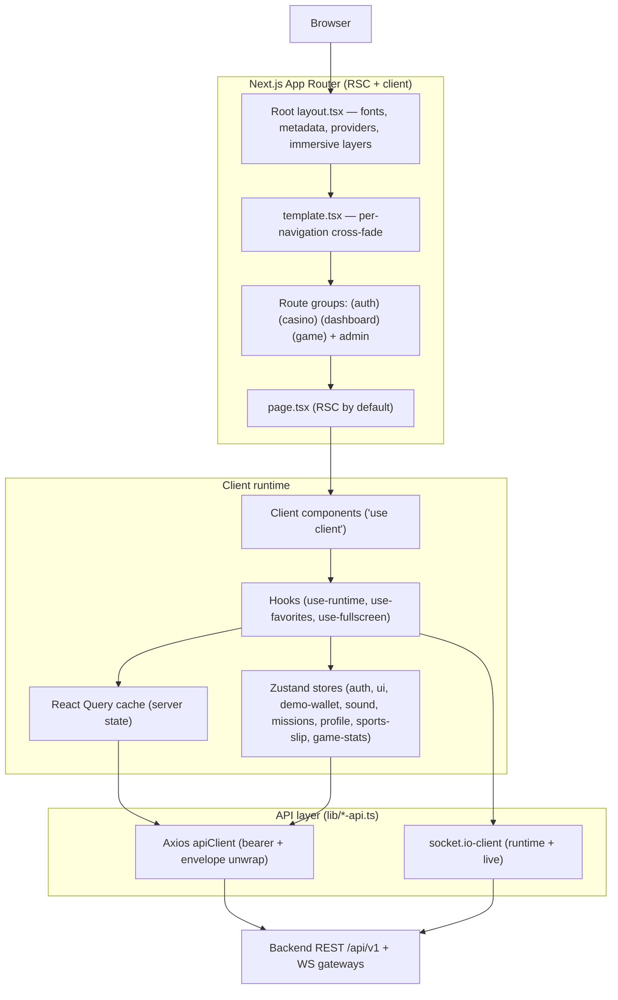

### 3.2 Request-to-pixel path

The canonical flow, from a user's click to a rendered update:

```
User → Component → Hook → (Store | React Query) → API client → Backend → Response → cache/store → re-render
```

- **Reads** flow through React Query hooks (e.g. `useFavorites`) → `lib/*-api.ts` → `apiClient` → backend → cache → component.
- **Session** flows through the in-memory access token (Zustand `auth-store`) mirrored into Axios.
- **Real-time** flows through `socket.io-client` (e.g. `use-runtime`) directly into component state.

### 3.3 The server/client boundary

The single most consequential structural line in the app is the **server/client boundary** — the `'use client'` directive. Everything above it is a React Server Component (no client JS); everything at or below it ships to and runs in the browser.

| Side of the boundary | What lives there | Examples |
| --- | --- | --- |
| **Server (RSC)** | Page scaffolding, static layouts, marketing/content composition, metadata | `page.tsx` files, `(dashboard)/layout.tsx`, `not-found.tsx`, `loading.tsx` |
| **Client (`'use client'`)** | Interactivity, browser APIs, animation, stores, hooks, sockets | `template.tsx`, every provider/store/hook, all immersive layers, forms, game components |

The discipline is: **keep the boundary as low as possible.** A page stays an RSC and delegates only its interactive islands to client components, so the amount of JavaScript shipped is proportional to the amount of genuine interactivity — not to the size of the page. When a component needs `useState`, an event handler, `window`, or animation, that component (and only it) becomes a client component; its server-rendered parent passes serializable props across the boundary.

### 3.4 Composition at the root

Everything global is composed once in [`app/layout.tsx`](../apps/frontend/src/app/layout.tsx) inside `<AppProviders>`: the route background, dynamic world, page content, and the persistent immersive/utility layers (sound control, accessibility menu, Nova assistant, click FX, cinematic intro, offline indicator, Web Vitals reporter, PWA register). This means **every page automatically inherits the full experience** without importing anything.

---

## 4. Folder Structure

```
apps/frontend/
├── next.config.mjs           # transpilePackages, standalone output, optimizePackageImports, images
├── tailwind.config.ts        # extends packages/ui shared preset; scans app + ui source
├── postcss.config.mjs        # tailwindcss + autoprefixer
├── playwright.config.ts      # E2E: serial, demo-mode dev server on :3130
├── public/                   # manifest.webmanifest, sw.js, offline.html, icons, robots.txt
└── src/
    ├── app/                  # App Router
    │   ├── layout.tsx        # Root layout: fonts, metadata, viewport, providers, immersive layers, skip link
    │   ├── template.tsx      # Per-navigation cross-fade (re-mounts each route)
    │   ├── page.tsx          # Home / lobby (RSC)
    │   ├── loading.tsx       # Root suspense fallback (Spinner)
    │   ├── error.tsx         # Route error boundary (logs to monitoring)
    │   ├── global-error.tsx  # Root-layout error boundary (own <html>, inline styles)
    │   ├── not-found.tsx     # 404
    │   ├── (auth)/           # login, register, forgot/reset password, verify-email + auth layout
    │   ├── (casino)/         # casino, crash, dice, roulette, sportsbook + immersive full-bleed layout
    │   ├── (dashboard)/      # 30+ authenticated experiences + SiteHeader shell layout
    │   ├── (game)/           # play/[slug] immersive runtime + minimal-chrome layout
    │   ├── admin/            # admin console (games, engines, wallet, operations, analytics, ai, settings)
    │   └── collections/      # marketing collection pages
    ├── components/           # ~90 components grouped by domain (see §6)
    │   ├── backgrounds/      # dynamic-world, route-background, page-background
    │   ├── hero/             # gaming-universe (raw three.js WebGL)
    │   ├── experience/       # cinematic-intro
    │   ├── layout/           # header, site-header, sidebar, mobile-nav, footer, cinematic-background
    │   ├── games/            # catalog + playable prototype games (arcade + cards)
    │   ├── runtime/          # runtime-harness, game-canvas, action-presets
    │   ├── shared/           # accessibility-menu, ai-assistant, sound-control, navigation, user-menu…
    │   ├── monitoring/       # web-vitals-reporter, pwa-register, offline-indicator
    │   ├── crash/ dice/ roulette/ card/ sports/  # per-game presentation
    │   ├── live/ social/ profile/ rewards/ tournament/ marketing/ auth/
    ├── providers/            # index (AppProviders), query-provider, theme-provider
    ├── stores/               # zustand: auth, ui, demo-wallet, missions, player-profile, game-stats, sports-slip
    ├── hooks/                # use-runtime, use-favorites, use-fullscreen
    ├── lib/                  # api-client, config, monitoring, query-client, *-api.ts, sound, utils, mock data
    └── styles/               # globals.css (imports the UI package stylesheet)
```

### 4.1 Ownership

| Folder | Owns | Rule |
| --- | --- | --- |
| `app/` | Routing, layouts, page composition | Pages are RSC unless they need interactivity |
| `components/` | Reusable + domain UI | Grouped by domain; `'use client'` only where needed |
| `providers/` | Global client context | Composed once at the root |
| `stores/` | Client state (Zustand) | One store per concern; never mirror server data here |
| `hooks/` | Reusable client logic | Encapsulate React Query / sockets / browser APIs |
| `lib/` | API clients, config, utilities, mock data | The **only** place that talks to the network |
| `styles/` | Global CSS entry | Delegates tokens to `packages/ui` |
| `public/` | Static + PWA assets | Manifest, SW, offline page, icons |

**Why domain-grouped components (not atomic-design folders):** a change to "crash" touches `components/crash` and its route; grouping by feature keeps the blast radius small and the ownership obvious — the same principle the backend applies to its modules ([Backend §4](./BACKEND_ARCHITECTURE.md#4-backend-folder-structure)).

---

## 5. Next.js App Router

### 5.1 Route groups

Route groups `(name)` organize routes into **experiences with distinct chrome** without affecting the URL. The platform has four plus the admin and collections trees:

| Group | Layout character | Routes (representative) |
| --- | --- | --- |
| `(auth)` | Centered, minimal, brand-forward | `/login`, `/register`, `/forgot-password`, `/reset-password`, `/verify-email` |
| `(casino)` | Full-bleed, transparent, immersive background | `/casino`, `/crash`, `/dice`, `/roulette`, `/sportsbook` (+ `[variant]`/`[matchId]`) |
| `(dashboard)` | `SiteHeader` + centered content stage | `/world`, `/dashboard`, `/games`, `/arcade`, `/wallet`, `/missions`, `/battle-pass`, `/store`, `/avatar`, `/profile`, `/friends`, `/community`, `/daily`, `/mailbox`, `/clans`, `/hall-of-fame`, `/trophies`, `/stats`, `/leaderboards`, `/tournaments`, `/marketplace`, `/rewards`, `/discover`, `/favorites`, `/feed`, `/notifications`, `/settings`, `/transactions` |
| `(game)` | Minimal chrome, full-bleed play surface | `/play/[slug]` |
| `admin/` | Admin console shell | `/admin` + games/card/roulette/dice/crash/sports/wallet/tournaments/ai/operations/analytics/settings |
| `collections/` | Marketing collection detail | `/collections/[slug]` |

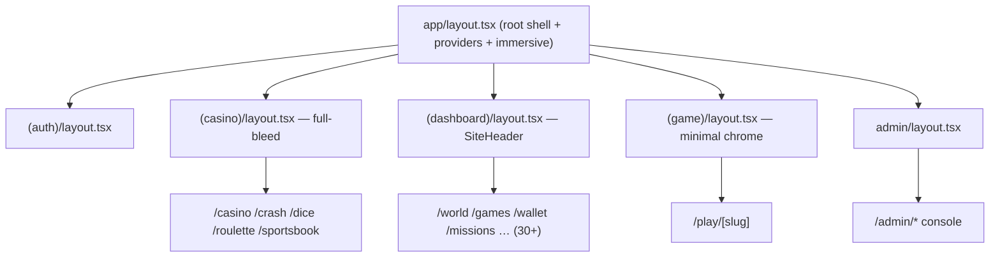

### 5.2 Layouts

Layouts are **nested and persistent** — they don't re-mount on navigation within their subtree, so shared chrome (header, background stage) stays mounted and stateful. Examples grounded in the repo:

- **Root** ([`app/layout.tsx`](../apps/frontend/src/app/layout.tsx)): declares the `<html>`/`<body>`, loads three Google fonts as CSS variables (`--font-sans` Inter, `--font-mono` JetBrains Mono, `--font-display` Space Grotesk), sets metadata + viewport, renders the skip-to-content link, and mounts `<AppProviders>` with the background stack, page content, and every persistent immersive/utility layer.
- **Dashboard** ([`(dashboard)/layout.tsx`](../apps/frontend/src/app/(dashboard)/layout.tsx)): `SiteHeader` + a centered `max-w-[1440px]` `<main id="main-content">` so the ambient background shows through — a premium top-bar shell, **no enterprise sidebar**.
- **Casino** ([`(casino)/layout.tsx`](../apps/frontend/src/app/(casino)/layout.tsx)): a transparent, full-height scroll stage; the themed animated background is supplied per-route by `RouteBackground`, and each lobby/table renders its own header.
- **Game** ([`(game)/layout.tsx`](../apps/frontend/src/app/(game)/layout.tsx)): a 14-px-tall minimal header (back-to-lobby + logo) over a full-bleed play surface.

### 5.3 Template — the transition layer

[`app/template.tsx`](../apps/frontend/src/app/template.tsx) is the key to the platform's cinematic feel. Unlike a layout, a **template re-mounts on every navigation**, so a fresh enter animation plays on each route change. It animates **opacity only** — never a transform or filter on the wrapper — because a transform would create a containing block that breaks `position: fixed` descendants (the backgrounds, HUD, and modals). It respects `prefers-reduced-motion` by returning children unwrapped. See [ADR-005](#23-frontend-adrs).

### 5.4 Loading, error, not-found, global-error

The App Router's special files give us a resilience net for free:

| File | Role | Notes |
| --- | --- | --- |
| [`loading.tsx`](../apps/frontend/src/app/loading.tsx) | Root Suspense fallback | Centered `Spinner` from the UI package during RSC streaming |
| [`error.tsx`](../apps/frontend/src/app/error.tsx) | Route-level error boundary | `'use client'`; logs to `logClientError(error, 'route-error-boundary')`; offers **Try again** (`reset()`) + back-to-lobby |
| [`global-error.tsx`](../apps/frontend/src/app/global-error.tsx) | Root-layout error boundary | Renders its **own** `<html>/<body>`, fully inline-styled and dependency-free so it works even if styling/layout failed |
| [`not-found.tsx`](../apps/frontend/src/app/not-found.tsx) | 404 | Branded, links home |

### 5.5 Metadata & streaming

Metadata is declared statically in the root layout (`title.template = "%s · <appName>"`, description, manifest, icons, `appleWebApp`, Open Graph, robots) and can be overridden per route via the `metadata` export. Pages stream: RSC content flushes progressively, with `loading.tsx` covering suspended segments — so the shell and header paint immediately while data-bound sections hydrate.

### 5.6 RSC / SSR / CSR / hydration

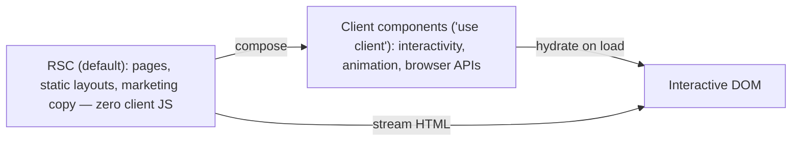

The rule: **RSC unless a component needs state, effects, event handlers, browser APIs, or animation.** All immersive layers, stores, hooks, and forms are client components; page scaffolding and content are server components. `suppressHydrationWarning` on `<html>` accommodates the theme/class attribute set before hydration, and immersive layers that read `window`/clock are **mounted-gated** (render `null` until `useEffect` runs) to avoid hydration mismatch — e.g. `DynamicWorld` and the accessibility menu.

### 5.7 Streaming & hydration in practice

The App Router streams HTML in the order components resolve. Concretely, on a first visit to the home route:

1. The server renders the root layout shell (fonts, metadata, skip link, the immersive-layer *mount points*) and flushes it immediately — the user sees a styled frame almost instantly.
2. RSC page content streams as it resolves; any segment wrapped in Suspense shows `loading.tsx` (the `Spinner`) until its data is ready.
3. On the client, React **hydrates** the interactive islands — the providers, stores, immersive layers, and any `'use client'` component — attaching event handlers and starting effects.
4. `AuthInitializer`'s effect fires the silent refresh; immersive effects (`DynamicWorld`'s clock read, the accessibility menu's `localStorage` read) run *after* mount, which is why they render `null` on the server and first client pass — eliminating hydration mismatch.

This ordering is why the platform feels instant despite heavy immersion: the **shell and content are server-rendered**, and the expensive client work (WebGL, audio, sockets) is deferred to post-hydration effects that never block first paint. The mounted-gating pattern is a recurring idiom — any component that reads a value unavailable or non-deterministic on the server (time, `window`, storage, `matchMedia`) must gate its output on a `mounted` flag set in `useEffect`.

---

## 6. Component Architecture

There are roughly **90 components** in `src/components`, plus the shared primitives in `packages/ui`. They form a clear hierarchy: **design-system primitives → shared app components → domain components → page compositions.**

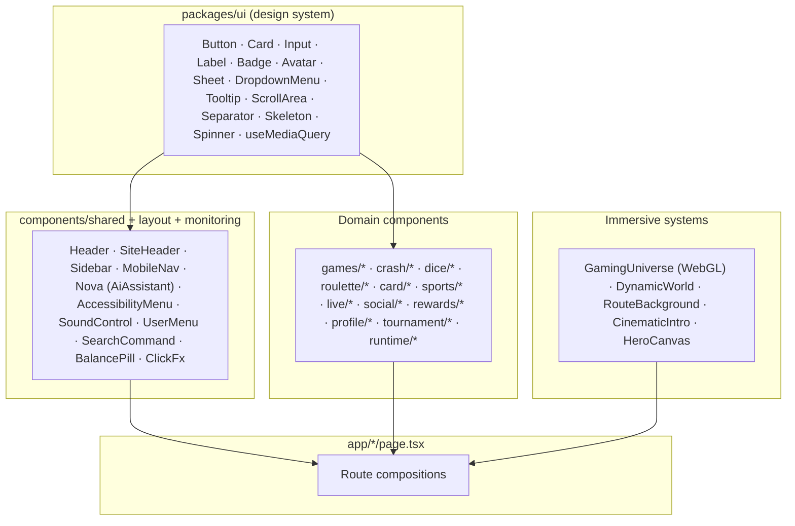

### 6.1 Design-system primitives (`packages/ui`)

Built on **Radix UI** for accessible behavior and **CVA** for variants; consumed as source. The full export set (from [`packages/ui/src/index.ts`](../packages/ui/src/index.ts)): `Avatar`, `Badge`, `Button`, `Card`, `DropdownMenu`, `Input`, `Label`, `ScrollArea`, `Separator`, `Sheet`, `Skeleton`, `Spinner`, `Tooltip`, plus `cn()` and the `useMediaQuery` hook.

- **Purpose:** one accessible, on-brand vocabulary for every surface.
- **Responsibilities:** encapsulate variants, focus states, ARIA, and token usage.
- **Dependencies:** Radix primitives, CVA, `tailwind-merge`.
- **Extension guidance:** add a component to `packages/ui/src/components`, export it from `index.ts`, and drive its variants with CVA + tokens. Never hard-code colors — use token classes.

The `Button` is the archetype: a `cva` with variants `default | destructive | outline | secondary | ghost | link | gradient | neon | gold | glass` and sizes `default | sm | lg | xl | icon`. This is why a "premium gaming" button (`gradient`, `neon`, `gold`, `glass`) is one prop away anywhere in the app.

### 6.2 Layout & navigation

| Component | Purpose |
| --- | --- |
| `SiteHeader` / `header` / `marketing-header` | Premium top bars for app vs. marketing |
| `sidebar` / `mobile-nav` | Admin/dashboard nav and mobile drawer (Radix `Sheet`) |
| `footer` | Global footer |
| `cinematic-background` / `app-background` | Multi-scene backdrops for marketing/home |
| `shared/navigation.ts` | The single source of nav data: `dashboardNav`, `adminNav`, `primaryNav`, `marketingNav` — typed `NavItem[]` mapping labels + `lucide` icons to real routes |

**Why centralize navigation data:** every nav surface reads the same typed arrays, so a route rename or new page is a one-line change that propagates to header, sidebar, and mobile nav consistently.

### 6.3 Immersive systems (the "feel")

| System | Component | Technique |
| --- | --- | --- |
| **WebGL hero** | `hero/gaming-universe.tsx` | **Raw three.js**: instanced meshes + particle points, rotating color "moods", cursor/scroll reactive, capped DPR, offscreen pause, reduced-motion static frame, full disposal on unmount |
| **Cinematic marketing bg** | `marketing/hero-canvas.tsx` | **Canvas-2D** floating casino objects (chips/coins/dice/cards) + sparks, pointer parallax, IntersectionObserver pause |
| **Route background** | `backgrounds/route-background.tsx` | Maps pathname → themed `PageBackground` variant (casino/crash/dice/roulette/sports/esports/arcade), else the multi-scene `CinematicBackground` |
| **Dynamic world** | `backgrounds/dynamic-world.tsx` | Time-of-day tint (real clock) + weather cycle (clear→rain→festival→fog→fireworks→snow) every ~45s, pure CSS, reduced-motion aware |
| **Cinematic intro** | `experience/cinematic-intro.tsx` | One-time per-session intro overlay (skippable, seeded in `sessionStorage`) |
| **Nova assistant** | `shared/ai-assistant.tsx` | Floating companion reading live client state (missions, daily, achievements, friends, events) to surface deterministic next-actions |
| **Click FX / sound** | `shared/click-fx.tsx`, `shared/sound-control.tsx` | Micro-interaction particles + the WebAudio control ([§11](#11-audio-architecture)) |

Every immersive layer is `aria-hidden`, `pointer-events-none` where appropriate, mounted-gated, and reduced-motion aware — immersion never costs accessibility or blocks input. See [§10](#10-animation-architecture) and [§14](#14-accessibility).

### 6.4 Game presentation & runtime

| Category | Components | Purpose |
| --- | --- | --- |
| **Catalog** | `games/game-card`, `game-grid`, `game-shelf`, `featured-carousel`, `games-discovery`, `library-rows`, `home-sections`, `game-cover`, `favorite-button`, `game-card-skeleton` | Browse/discover the catalog (server-backed via `games-api`) |
| **Playable prototypes** | `games/prototype/*` — `crash-game`, `dice-game`, `roulette-game`, `game-fx`, `arcade/{2048,memory,reaction,color-match,plinko}`, `cards/{blackjack,baccarat,dragon-tiger,andar-bahar,lucky-7,casino-war,teen-patti}` | Client-playable games for demo/experience |
| **Table presentation** | `crash/*`, `dice/*`, `roulette/*`, `card/*`, `sports/*` | Rich visualizations (crash graph, roulette wheel, dice faces, playing cards, bet slip, scoreboard) |
| **Server runtime** | `runtime/runtime-harness`, `runtime/game-canvas`, `runtime/action-presets` | The harness that drives a **server-authoritative** runtime via `use-runtime` (fullscreen, latency badge, sound, action presets) |

The distinction matters: **prototype games run entirely on the client** (great for demo mode), while the **runtime harness** connects to the backend's server-authoritative runtime and provably-fair engine ([Backend §13](./BACKEND_ARCHITECTURE.md#13-runtime-backend)). See [§13](#13-gaming-experience).

### 6.5 Ecosystem, social, identity

| Category | Components |
| --- | --- |
| Live | `live/floating-notifications`, `global-live-feed`, `live-now`, `live-ticker` |
| Social | `social/social-feed` |
| Profile / identity | `profile/player-card` |
| Rewards | `rewards/lucky-wheel`, `rewards/mystery-chest` |
| Tournament | `tournament/bracket-viewer` |
| Marketing | `marketing/{hero,feature-grid,animated-number,landing-sections,lobby-sections}` |

Each category is self-contained: purpose (present a slice of the ecosystem), dependencies (stores + mock/ecosystem data in `lib/`), and extension (add a component, wire it to a store or an API module). Charts/cards/forms/dialogs/tables/menus are realized through the UI primitives (`Card`, `DropdownMenu`, `Sheet`, `Input` + React Hook Form) rather than a separate chart library, keeping the bundle lean.

### 6.6 Category deep-dive: purpose, responsibilities, dependencies, extension

The brief calls for each component category to be documented with its **purpose, responsibilities, dependencies, and extension guidance**. The following expands the categories that most shape the platform.

#### Layout components

- **Purpose:** provide the persistent chrome for each experience — the top bar, mobile drawer, footer, and the transparent content stage that lets immersive backgrounds show through.
- **Responsibilities:** render navigation from the centralized `navigation.ts` data; expose the balance pill, level pill, notifications menu, user menu, and search command in the header; open/close the mobile nav via the Radix `Sheet`; keep `#main-content` as the skip-link target.
- **Dependencies:** `packages/ui` primitives (`Button`, `Sheet`, `DropdownMenu`, `Avatar`), `ui-store` (drawer open state), `auth-store` (authenticated affordances), `navigation.ts`.
- **Extension guidance:** to add a header affordance, compose a UI primitive into `site-header`/`header`; to add a nav destination, edit the relevant array in `navigation.ts` — never hard-code links in a layout.

#### Shared components (the utility HUD)

- **Purpose:** the always-available cross-cutting controls that float above every page — accessibility menu, sound control, Nova assistant, click FX, search command, theme toggle, balance/level pills.
- **Responsibilities:** persist user preferences (accessibility), control the audio engine, surface next-actions (Nova), and provide global search — all without belonging to any single page.
- **Dependencies:** `useSound`, `player-profile`, `missions`, `ecosystem-data`, `localStorage`, Framer Motion.
- **Extension guidance:** mount a new global control in the root layout inside `<AppProviders>`; make it client-side, mount-gated if it reads `window`, and keep it non-blocking.

#### Background system

- **Purpose:** deliver the layered, living backdrop — a WebGL universe, a 2D cinematic canvas, per-route themed scenes, and a weather/time-of-day dynamic world.
- **Responsibilities:** choose the correct scene per route (`route-background`), animate GPU-cheaply, pause off-screen, and never intercept input or break `position: fixed` descendants.
- **Dependencies:** three.js (`gaming-universe`), Canvas-2D (`hero-canvas`), `usePathname`, `prefers-reduced-motion`.
- **Extension guidance:** add a `BackgroundVariant`, map routes to it in `route-background`, and follow the immersive-layer rules ([§21.7](#217-add-a-background--immersive-layer)).

#### Game library & catalog components

- **Purpose:** let players browse, discover, and launch games from the server-backed catalog.
- **Responsibilities:** render shelves/grids/carousels, show skeletons while loading, toggle favorites optimistically, and route into a game.
- **Dependencies:** `games-api`, React Query (`useFavorites`), `packages/ui` (`Card`, `Skeleton`, `Badge`), `lib/prototype-games` for client games.
- **Extension guidance:** add a shelf by composing `game-shelf` with a new `games-api` query; register a client game in `prototype-games`.

#### Player profile & avatar system

- **Purpose:** express identity — the player card, avatar studio, stats, trophies, and hall of fame.
- **Responsibilities:** render level/XP/cosmetics, allow avatar customization, and reflect achievements — instantly, from client state, so identity feels responsive and works in demo mode.
- **Dependencies:** `player-profile` store, `lib/cosmetics`, `packages/ui` (`Avatar`, `Card`, `Badge`).
- **Extension guidance:** add a cosmetic type in `lib/cosmetics`, extend the `player-profile` store, and surface it in `player-card`/avatar pages.

#### Community & social components

- **Purpose:** make the world feel populated — friends, feed, clans, mailbox, and live activity.
- **Responsibilities:** render social feeds, live tickers, and floating notifications; drive the "others are playing" energy.
- **Dependencies:** `ecosystem-data`, `leaderboard-mock`, `live/*` components, Framer Motion.
- **Extension guidance:** add a live surface under `live/` and feed it from an API module or ecosystem data.

#### Dashboard, charts, cards, forms, dialogs, tables, menus

- **Purpose:** the structural building blocks of every data-dense surface (wallet, stats, admin, settings).
- **Responsibilities:** present tabular/statistical data and capture input. **Charts** are hand-built with SVG/canvas/transforms (e.g. `crash-graph`, `bracket-viewer`, `marketing/animated-number`) rather than a chart library — this keeps the bundle lean and the visuals on-brand. **Cards** use the UI `Card`; **forms** use React Hook Form + Zod with UI `Input`/`Label`; **dialogs/menus** use Radix (`Sheet`, `DropdownMenu`) for accessible focus management; **tables** are composed from primitives with responsive stacking.
- **Dependencies:** `packages/ui`, React Hook Form, `@hookform/resolvers`, Zod, React Query (data), `lucide-react`.
- **Extension guidance:** compose from UI primitives; for a new chart, build a small dedicated component with the same offscreen/reduced-motion discipline as other canvas work; for a new form, pair a Zod schema with `useForm` + `zodResolver`.

#### Accessibility & audio components

- **Purpose:** give users control over motion, contrast, text size, and sound.
- **Responsibilities:** persist and apply preferences (`accessibility-menu`), and control the WebAudio engine (`sound-control`, `ambient-audio`).
- **Dependencies:** `localStorage`, root-class/font-size manipulation, `useSound`, `lib/sound`.
- **Extension guidance:** add a preference by following the `localStorage` + root-class pattern in `accessibility-menu`; add a sound by extending `lib/sound` ([§21.8](#218-add-a-sound)).

#### Runtime & game FX components

- **Purpose:** host server-authoritative play and render real-time feedback.
- **Responsibilities:** the `runtime-harness` wires `use-runtime` to a `game-canvas`, shows a latency badge, provides action presets and fullscreen, and manages sound; `game-fx` centralizes win/particle effects.
- **Dependencies:** `use-runtime`, `use-fullscreen`, `socket.io-client`, `packages/ui`.
- **Extension guidance:** to add a runtime-driven game, pass its plugin key to the harness; to add an action, extend `action-presets`.

---

## 7. State Management

State is deliberately **split by ownership**. Choosing the wrong tool for a piece of state is the most common source of bugs, so the platform draws hard lines.

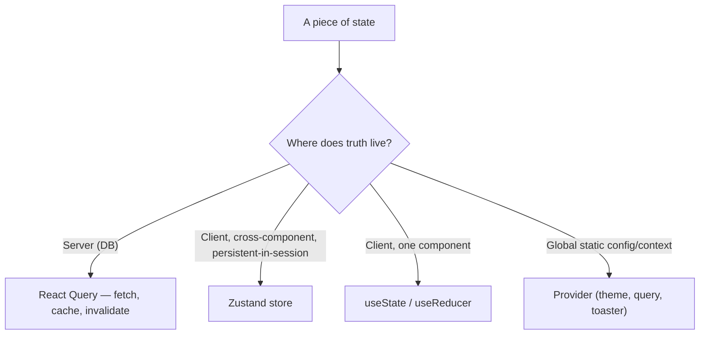

### 7.1 React Query — server state

The single mechanism for anything the backend owns: catalog, favorites, wallet, transactions, tournaments, operations, AI. Configured by `makeQueryClient` ([`lib/query-client.ts`](../apps/frontend/src/lib/query-client.ts)):

| Option | Value | Why |
| --- | --- | --- |
| `staleTime` | 60s | Avoid refetch storms on quick navigations |
| `gcTime` | 5min | Keep caches warm across route changes |
| `queries.retry` | 1 | One retry for transient blips, then surface the error |
| `refetchOnWindowFocus` | false | A gaming UI shouldn't flicker on tab focus |
| `mutations.retry` | 0 | Never silently repeat a mutation |

A **new client is created per `useState(makeQueryClient)`** in `QueryProvider`, and a fresh instance is made per request on the server, so there is **no cross-request state leakage** — critical for SSR correctness. Devtools mount only in development.

### 7.2 Zustand — client state

Seven stores, each with a single responsibility:

| Store | State | Why it exists |
| --- | --- | --- |
| `auth-store` | `user`, in-memory `accessToken`, `isAuthenticated`, `initialized`, `hasPermission`, `hasRole` | Session lives in memory (not localStorage) for XSS safety; mirrors the token into Axios. `super_admin` bypasses permission checks client-side (mirrors the backend guard) |
| `ui-store` | `sidebarOpen`, `mobileNavOpen` | Ephemeral layout chrome |
| `demo-wallet` | `balance` (start 100,000), `reload/spend/credit` | Client-only demo coins — **never** touches the real wallet engine |
| `missions` | daily/weekly mission progress | Drives Nova + missions surfaces |
| `player-profile` | level, XP, daily-claim, cosmetics | Player identity across the ecosystem |
| `game-stats` | local play stats | Session stats for prototypes |
| `sports-slip-store` | bet slip selections | Multi-selection sportsbook slip |
| `useSound` (in `lib/sound.ts`) | `muted`, `volume`, `ambientOn` | Sound engine controls |

**Why Zustand and not Context:** these stores update frequently (balance ticks, mission progress, sound volume) and are read in many places. Context would re-render every consumer on each change; Zustand's selector subscriptions re-render only what actually reads the changed slice. See [ADR-003](#23-frontend-adrs).

### 7.3 Context / providers

Reserved for **stable, global** concerns that rarely change: `ThemeProvider` (next-themes, forced light), `QueryProvider` (React Query client), and the `Toaster` (sonner). These are set once and don't cause render churn.

### 7.4 Local state & persistence

Component-scoped state uses `useState`/`useReducer`. Persistence is intentionally narrow and purpose-fit:

| Persisted | Where | Why |
| --- | --- | --- |
| Access token | **In memory only** | XSS-safe; re-obtained via silent refresh on reload |
| Refresh token | **httpOnly cookie** (server-set) | Not readable by JS; carried by `withCredentials` |
| Accessibility prefs | `localStorage` (`a11y-reduce/contrast/scale`) | Instant, offline, no account needed |
| Intro-seen flag | `sessionStorage` (`gp-intro-seen`) | One cinematic intro per session |

### 7.5 Synchronization

The session is **synchronized on load** by `AuthInitializer` ([§8.2](#82-authentication--session-flow)): a silent `/auth/refresh` using the cookie repopulates the in-memory token and user, so a hard reload seamlessly restores the authenticated app. React Query keeps server state fresh via `staleTime` + explicit `invalidateQueries` after mutations (e.g. `useFavorites` invalidates `['favorite-ids']` and `['favorites']` on toggle).

---

## 8. Data Flow

### 8.1 Read flow (server state)

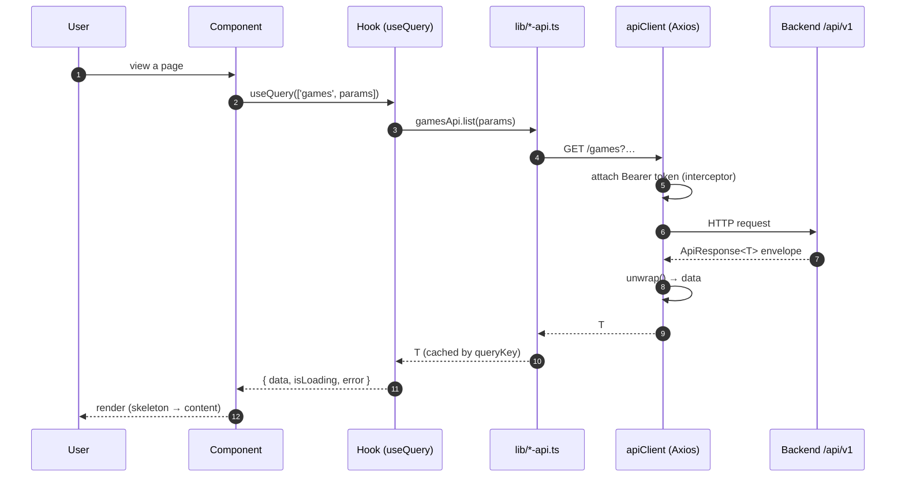

### 8.2 Authentication & session flow

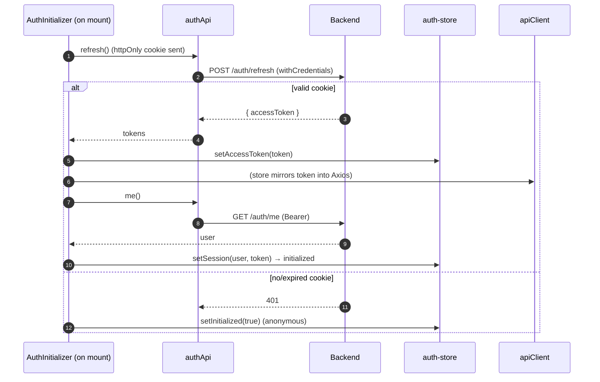

**Why this shape:** the access token never persists to disk (XSS-safe), yet a reload re-authenticates silently. `initialized` gates the UI so auth-dependent effects (like `use-runtime`) wait for the session to resolve before deciding a user is unauthenticated. This mirrors the backend's stateless-JWT + refresh-rotation model ([Backend §7](./BACKEND_ARCHITECTURE.md#7-authentication-architecture)).

### 8.3 Mutation flow (optimistic-friendly)

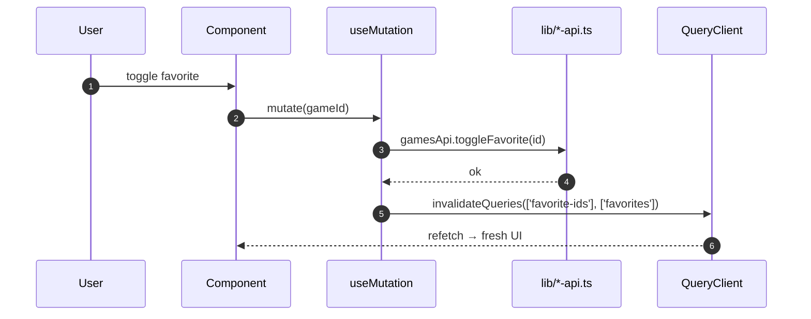

### 8.4 Real-time flow (runtime)

The `use-runtime` hook ([§9.4](#94-real-time-the-runtime-hook)) drives a server-authoritative game session over Socket.IO — create session (REST) → connect (WS with token) → join room → stream `runtime:state`/`runtime:event` → heartbeat latency → auto-reconnect. Component state updates directly from socket events, bypassing React Query because this is **live, ephemeral** state, not cacheable server state.

---

## 9. API Layer

Everything network-related lives in `src/lib`. Components and hooks never call `fetch`/`axios` directly — they call a typed API module.

### 9.1 The Axios client

[`lib/api-client.ts`](../apps/frontend/src/lib/api-client.ts) exports a single configured `apiClient`:

- `baseURL` = `clientConfig.apiUrl` (the versioned `/api/v1`), `withCredentials: true` (carries the refresh cookie), 15s timeout.
- **Request interceptor** injects `Authorization: Bearer <token>` from the in-memory token set via `setAccessToken` (kept in sync by the auth store).
- **Response interceptor** routes errors through `normalizeError` → a `NormalizedApiError` (`statusCode`, `message`, `error`) so every caller handles one predictable error shape.
- **`unwrap<T>()`** strips the backend's standard `ApiResponse<T>` envelope, returning just `data` — so API modules return domain types, not envelopes. This is the client mirror of the backend's `TransformInterceptor` ([Backend §6.2](./BACKEND_ARCHITECTURE.md#62-the-response-envelope)).

### 9.2 Typed API modules

Each backend domain has a matching `lib/<domain>-api.ts`, all typed with `@gaming-platform/types`:

| Module | Covers |
| --- | --- |
| `auth-api` | login, register, refresh, me, logout, 2FA, password reset |
| `games-api` | catalog list/featured/trending/popular/recommended, detail, related, favorites |
| `wallet-api` / `runtime-api` | balances/transactions; runtime session create/join/end |
| `crash/dice/roulette/card/sports-api` | per-game endpoints |
| `tournament-api` / `operations-api` / `ai-api` / `admin-games-api` | progression, ops, AI, admin |

Mock/data helpers (`ecosystem-data`, `leaderboard-mock`, `sports-mock`, `prototype-games`, `cosmetics`, `deck`, `game-result`, `demo-session`) back demo mode and client-only experiences, so the UI renders fully even without the backend — the basis of the Playwright demo-mode E2E ([§20](#20-testing)).

### 9.3 Query & mutation hooks

Data-binding is done with React Query hooks that wrap the API modules. `useFavorites` ([`hooks/use-favorites.ts`](../apps/frontend/src/hooks/use-favorites.ts)) is the pattern: a gated `useQuery(['favorite-ids'])` (only `enabled` when authenticated, `staleTime` 30s) plus a `useMutation` that invalidates the relevant keys on success. Caching, retry, and error surfacing come from the shared query-client defaults ([§7.1](#71-react-query--server-state)).

### 9.4 Real-time: the runtime hook

[`hooks/use-runtime.ts`](../apps/frontend/src/hooks/use-runtime.ts) is the most sophisticated client hook — a small state machine over a Socket.IO connection:

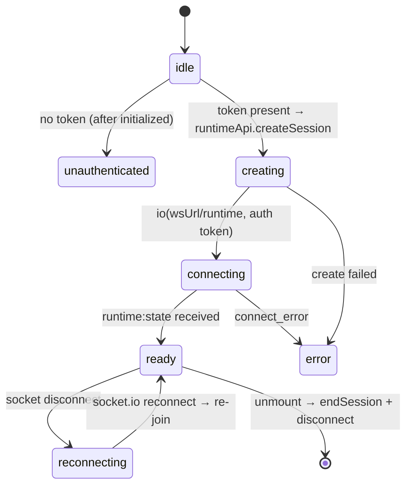

It creates a demo-mode session over REST, opens the `/runtime` namespace with the bearer token in the handshake, joins the runtime room, streams `runtime:state` and `runtime:event` (buffering the last 50 events), measures latency via `runtime:heartbeat`/`ack` every 5s, and re-joins automatically on reconnect. On unmount it ends the session and disconnects. This is the exact client counterpart of the backend `RuntimeGateway` ([Backend §11.2](./BACKEND_ARCHITECTURE.md#112-authentication-on-connect)).

### 9.5 Caching, retry, error handling, optimistic updates

| Concern | Mechanism |
| --- | --- |
| Caching | React Query `queryKey` cache, 60s stale / 5min gc |
| Retry | 1 for queries, 0 for mutations; Axios has no blind retry |
| Error handling | `normalizeError` → uniform shape → toast/boundary |
| Optimistic updates | `onMutate`/`invalidateQueries` pattern (favorites, slips) |
| Envelope | `unwrap()` centralizes the one place the envelope is known |

### 9.6 A worked example: an authenticated read that survives a token expiry

Trace what happens when a player opens `/favorites` with an access token that expired while the tab was backgrounded:

1. The component calls `useQuery(['favorite-ids'])` → `gamesApi.favoriteIds()` → `apiClient.get('/favorites/ids')`.
2. The request interceptor attaches the (now-expired) bearer token; the backend returns `401`.
3. The response interceptor runs `normalizeError`, yielding `{ statusCode: 401, message, error }`; React Query surfaces `isError`.
4. Meanwhile — because the refresh token is an httpOnly cookie — the app's session can be re-established. In the current architecture the reliable recovery path is a reload or an explicit re-auth, at which point `AuthInitializer` silently refreshes and the query refetches successfully. (A transparent axios refresh-retry interceptor is a documented future enhancement; see [§24](#24-future-frontend-roadmap).)
5. The component, seeing `isError`, renders an inline fallback rather than crashing; no uncaught error escapes to the error boundary.

The lesson for extenders: **every API call already returns a normalized error shape**, so components should branch on `isError`/`error` and present a fallback or toast — never assume success. The envelope-unwrap and error-normalization in `api-client` mean a component never touches an Axios error or a raw `ApiResponse` directly.

---

## 10. Animation Architecture

Animation is a **budgeted system**, not sprinkled effects. The guiding rule: **animate compositor-friendly properties (opacity, transform), pause off-screen work, and always honor reduced motion.**

### 10.1 The three animation tiers

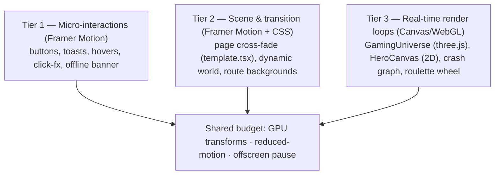

### 10.2 Framer Motion

Used for declarative, interruptible UI motion and exit animations (`AnimatePresence`, e.g. the `OfflineIndicator`). The **page transition** in `template.tsx` animates opacity only over 0.45s with an `[0.16, 1, 0.3, 1]` ease. Every motion component checks `useReducedMotion()` and degrades to no animation.

### 10.3 Three.js WebGL hero

`gaming-universe.tsx` is a **raw three.js** scene: instanced meshes and particle `Points` (few draw calls), color "moods" that rotate ~every 38s and crossfade, and cursor/scroll reactivity. Its performance discipline is explicit and repository-grounded:

| Technique | Effect |
| --- | --- |
| Capped DPR (`min(dpr, 2)`, 1.5 on small screens) | Bounds fragment work on high-density displays |
| `InstancedMesh` + `Points` | Many objects, few draw calls |
| Fewer instances below 768px | Lighter mobile GPUs |
| IntersectionObserver + tab-visibility pause | Zero work when off-screen/hidden |
| Reduced-motion → single static frame | Respects the user, still looks intentional |
| Full disposal on unmount | No GPU memory leak between routes |

### 10.4 Canvas-2D & game FX

`hero-canvas.tsx` renders floating casino objects in Canvas-2D with the same discipline (capped DPR, offscreen pause, reduced-motion static frame, pointer parallax). Game visuals (`crash/crash-graph`, `roulette/roulette-wheel`, `dice/die-face`, `rewards/lucky-wheel`) use targeted canvas/SVG/transform animation, and `games/prototype/game-fx` centralizes win/particle effects.

### 10.5 The dynamic world & particles

`dynamic-world.tsx` layers a time-of-day tint and cycling weather (rain/snow/fog/fireworks/festival) using **pure CSS animations** on `aria-hidden` spans — GPU-cheap and reduced-motion aware (it renders no particles when reduced motion is set, and gates on `mounted` to avoid hydration mismatch).

### 10.6 Motion guidelines

| Guideline | Rule |
| --- | --- |
| Property choice | Prefer `opacity`/`transform`; avoid animating layout, `filter` on large layers, or wrappers that create containing blocks |
| Reduced motion | Every animated component checks `prefers-reduced-motion` (media query or `useReducedMotion`) |
| Off-screen | Pause RAF loops when not visible or tab hidden |
| Fixed descendants | Never transform an ancestor of a `position: fixed` element (why `template.tsx` is opacity-only) |
| Cleanup | Cancel RAF, remove listeners, dispose GPU resources on unmount |

### 10.7 Why opacity-only transitions matter (a subtle but critical decision)

The most important animation decision in the codebase is also the least visible. Because the platform's immersive layers (`RouteBackground`, `DynamicWorld`, the HUD, and modals) are `position: fixed`, they are positioned relative to the **viewport** — *unless* an ancestor establishes a containing block. Any element with a non-`none` `transform`, `filter`, `perspective`, `will-change: transform`, or `contain` becomes the containing block for its fixed descendants, which would snap those backgrounds and modals to the transitioning wrapper and make them jump or clip on every navigation.

`template.tsx` therefore animates **opacity only**. Opacity does not create a containing block, so a fresh page fades in over 0.45s while the fixed immersive layers stay glued to the viewport. This is why you will never find a `transform`/`filter` on a route-transition wrapper in this codebase — and it is the kind of constraint a new engineer must know before "improving" the transition with a slide. See [ADR-005](#23-frontend-adrs).

### 10.8 Micro-interactions

Beyond scenes and transitions, the platform layers small, tactile feedback: `click-fx` emits particle bursts on interaction, buttons carry hover glows and a `sheen` sweep (design-system utilities), toasts animate in via `sonner`, and the offline banner slides in with `AnimatePresence`. Each is cheap, optional, and reduced-motion aware — micro-interactions add polish without competing with the hero for GPU budget.

---

## 11. Audio Architecture

The platform ships an **original WebAudio sound engine** with **no audio files** — every sound is synthesized at runtime. This keeps the bundle tiny, makes sound infinitely tweakable, and avoids licensing.

### 11.1 The engine ([`lib/sound.ts`](../apps/frontend/src/lib/sound.ts))

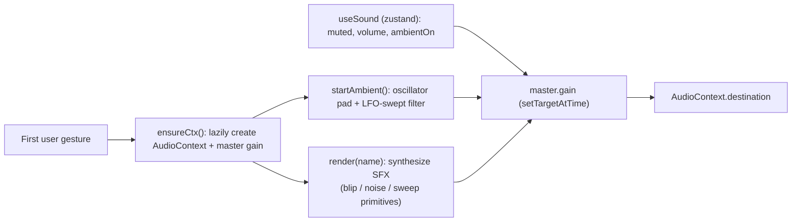

- **Lazy, gesture-gated context:** the `AudioContext` is created on the first user gesture (browser autoplay policy) and **muted by default** until the user enables sound.
- **Synthesis primitives:** `blip` (enveloped oscillator), `noise` (filtered buffer burst), `sweep` (pitch glide) compose ~19 named SFX (`click`, `coin`, `win`, `jackpot`, `rocket`, `explosion`, `cashout`, `wheel`, `diceRoll`, `cardFlip`, `achievement`, …).
- **Route-aware ambience:** six ambience presets (`default`, `casino`, `crash`, `sports`, `arcade`, `esports`) define filter cutoff, LFO sweep rate, and detune; `setAmbience` **morphs** the running pad via `setTargetAtTime` with no restart click.

### 11.2 State & controls

All audio state lives in the `useSound` Zustand store (`muted`, `volume`, `ambientOn`) so the `SoundControl` and `ambient-audio` components stay in sync. `applyVolume()` ramps the master gain smoothly. Toggling mute stops/starts the ambient pad appropriately.

### 11.3 Accessibility

Audio is **off by default** and entirely user-controlled — no sound plays without an explicit gesture and opt-in, which respects users who need silence and complies with autoplay policies. Volume is adjustable and the whole engine can be muted from the persistent `SoundControl`.

---

## 12. Theme System

### 12.1 Light-first — a deliberate, forced choice

The design system's tokens are themeable via CSS variables (the shared preset defines HSL variables consumed by Tailwind), but the application **forces light mode**: `AppProviders` mounts `next-themes` with `forcedTheme="light"` ([`providers/index.tsx`](../apps/frontend/src/providers/index.tsx)). This is intentional — the premium, luminous "gaming universe" aesthetic (soft radial gradients, glassmorphism, glow shadows) is designed for a light canvas. See [ADR-006](#23-frontend-adrs).

> **Engineering note:** a `ThemeToggle` component and the `next-themes` machinery exist, but with `forcedTheme="light"` the toggle is effectively inert at runtime. The token architecture remains dark-capable (the CSS variables can carry a dark palette), so re-enabling a theme switch is a one-line change if product direction changes — the *capability* is retained while the *current product decision* is a single forced value.

### 12.2 Tokens & the shared preset

Tokens live in [`packages/ui`](../packages/ui): `globals.css` declares the CSS variables and the `tailwind.preset.ts` maps them to Tailwind color/shadow/gradient utilities. The app's `tailwind.config.ts` simply extends that preset and scans both app and UI source. The app's own `globals.css` is a single line: `@import '@gaming-platform/ui/styles.css'`.

| Token family | Examples |
| --- | --- |
| Semantic colors | `background`, `foreground`, `primary`, `secondary`, `muted`, `accent`, `card`, `popover`, `destructive`, `success`, `warning`, `ring`, `border`, `input` |
| Gaming accent ramp | `neon`, `violet`, `gold`, `emerald`, `pink` |
| Gradients | `gradient-brand`, `gradient-royal`, `gradient-gold`, `gradient-emerald`, `gradient-sheen` |
| Glows / shadows | `glow-sm`, `glow`, `glow-neon`, `glow-gold`, `glow-pink`, `soft`, `elevated`, `inner-glow` |
| Radius | `sm`→`3xl` derived from `--radius` |

**Why CSS-variable tokens + a shared preset:** the app and the component library render identical colors and glows because they consume the *same* variables. A brand tweak is one variable change, not a find-and-replace across components. Utility classes like `glass`, `sheen`, and `text-gradient` (used in `error.tsx`, buttons) are token-driven building blocks of the glassmorphism language.

### 12.3 Typography & spacing

Three fonts are loaded as CSS variables in the root layout and mapped in the preset: **Inter** (`--font-sans`, body), **Space Grotesk** (`--font-display`, headings), **JetBrains Mono** (`--font-mono`, numerics/code). `display: 'swap'` avoids invisible text during font load. Spacing/containers use Tailwind scale with a centered container capped at `1440px`.

### 12.4 Responsive rules

The preset centers a `1440px` container; components use Tailwind breakpoints and the `useMediaQuery` hook from the UI package for JS-driven responsive behavior. See [§16](#16-responsive-design).

### 12.5 The glassmorphism visual language

The platform's signature look is **glassmorphism over a luminous gradient**: frosted, semi-transparent surfaces that let the animated background bleed through, edged with subtle inner highlights and colored glows. This is achieved with a small set of token-driven utility classes (declared in the UI package's stylesheet and used throughout the app):

| Utility | Effect | Where it's seen |
| --- | --- | --- |
| `glass` / `glass-strong` | Translucent background + backdrop blur + hairline border | Menus, cards, the accessibility panel |
| `sheen` | Animated diagonal light sweep across a surface | Primary/gradient buttons |
| `text-gradient` | Clipped gradient fill on text | Hero headings, the "Oops" error display |
| `glow` / `glow-sm` / `glow-neon` / `glow-gold` / `glow-pink` | Colored drop-glow shadows | Buttons, active cards, pills |
| `gradient-brand` / `gradient-royal` / `gradient-gold` | Brand gradient fills | Buttons, badges, accents |

Because these are token-backed, the entire visual language shifts with a handful of CSS variables. The forced-light canvas is essential to the effect: glassmorphism and soft glows read as premium on a bright, gradient-lit surface and would lose their luminosity on a dark one — which is precisely why [ADR-006](#23-frontend-adrs) forces light. The `Button` component's `gradient`, `neon`, `gold`, and `glass` variants are the most-used entry points into this language; reaching for one of those variants is how a developer stays on-brand without writing bespoke CSS.

### 12.6 Why not runtime theming

A user-facing theme switcher was consciously deferred. Supporting light *and* dark would double the design surface (every glass/glow value needs a dark counterpart that preserves the premium feel) and complicate the immersive layers, which are tuned for a light backdrop. The token system keeps the *capability* (the CSS variables can carry any palette), but the product ships a single, meticulously-tuned light theme. This is a deliberate scope decision, not a technical limitation — and it can be reversed by removing `forcedTheme` and supplying a dark token set.

---

## 13. Gaming Experience

This section documents every major user-facing experience. All are reachable from the centralized navigation (`shared/navigation.ts`) and rendered within their route group's layout.

### 13.1 Experience map

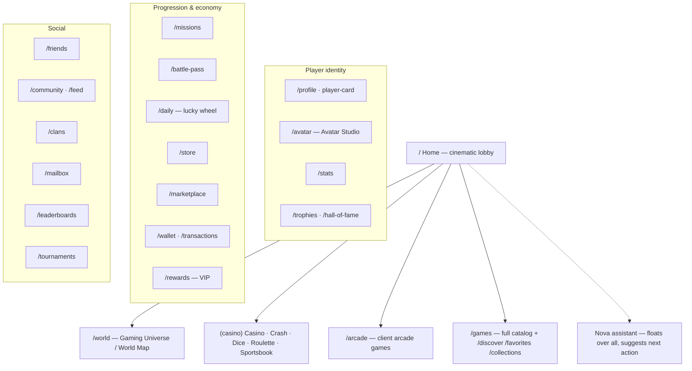

### 13.2 Core surfaces

| Experience | Route | What it is |
| --- | --- | --- |
| **Home / lobby** | `/` | Cinematic marketing + lobby sections, featured/trending shelves, WebGL/canvas hero |
| **World / Gaming Universe** | `/world` | The living world map hub; ties the ecosystem together |
| **Casino** | `/casino` (+ `[variant]`) | Immersive casino lobby and table games |
| **Crash / Dice / Roulette** | `/crash` `/dice` `/roulette` | Signature games with rich presentation (graph, dice, wheel) |
| **Sportsbook** | `/sportsbook` (+ `[matchId]`) | Live scoreboard, match cards, commentary, bet slip |
| **Arcade** | `/arcade` (+ `[slug]`) | Client-playable arcade games (2048, memory, reaction, color-match, plinko) |
| **Play (runtime)** | `/play/[slug]` | Server-authoritative runtime harness ([§9.4](#94-real-time-the-runtime-hook)) |

### 13.3 Identity & cosmetics

`/profile` (with `player-card`), `/avatar` (Avatar Studio), `/stats`, `/trophies`, `/hall-of-fame` express who the player is. The `player-profile` store holds level, XP, and cosmetics; `lib/cosmetics.ts` backs customization. These surfaces are largely client-state driven so they feel instant and work in demo mode.

### 13.4 Progression & economy

`/missions`, `/battle-pass`, `/daily` (lucky wheel + mystery chest), `/store`, `/marketplace`, `/wallet`, `/transactions`, `/rewards`. The `missions` and `demo-wallet` stores drive progress and demo spend; **real** wallet/transaction data comes from `wallet-api` in production. The distinction is strict: demo coins are cosmetic client state; real balances are server truth ([Backend §12](./BACKEND_ARCHITECTURE.md#12-wallet-backend)).

### 13.5 Social & competition

`/friends`, `/community`, `/feed`, `/clans`, `/mailbox`, `/leaderboards`, `/tournaments` (+ `[id]`, bracket viewer). Live surfaces (`live/*`) provide a global feed, live-now shelf, and ticker for a populated, competitive feel.

### 13.5.1 Experience walkthroughs

To ground the map, here is what actually happens on the signature surfaces.

**Home / lobby (`/`).** An RSC page composes marketing and lobby sections. The hero mounts the WebGL `GamingUniverse` (or the 2D `HeroCanvas` for lighter contexts) over a gradient backdrop; below it, `home-sections`/`lobby-sections` render server-backed shelves (`featured`, `trending`, `popular`, `recentlyAdded`, `recommended`) via `games-api`, each a horizontally-scrolling `game-shelf` of `game-card`s with skeleton placeholders while loading. The whole page cross-fades in via `template.tsx`, the dynamic world tints the background by time of day, and Nova floats in the corner with a first suggestion.

**World (`/world`).** The Gaming Universe hub ties the ecosystem together — a map-like surface linking casino, arcade, sports, progression, and social. It is where the "one world" metaphor is strongest: a single place from which every experience is reachable, backed by the `esports`/`arcade` route background variants.

**Casino tables (`/crash`, `/dice`, `/roulette`, `/casino`).** These live in the `(casino)` group's full-bleed layout so the themed background (rockets for crash, cubes for dice, a wheel motif for roulette) fills the screen. Each renders a rich presentation component — `crash/crash-graph` plots the live multiplier curve, `roulette/roulette-wheel` spins, `dice/die-face` animates — while the table logic runs either client-side (demo prototypes) or through the runtime harness (server-authoritative). Sound ambience morphs to the `crash`/`casino` preset on entry.

**Sportsbook (`/sportsbook`, `/sportsbook/[matchId]`).** A live scoreboard, match cards, a commentary feed, and a multi-selection bet slip (`sports/bet-slip` backed by `sports-slip-store`). Selections accumulate in the slip store so a player can build a parlay across matches; `sports-mock`/`sports-api` supply fixtures and odds.

**Arcade (`/arcade`, `/arcade/[slug]`).** Fully client-playable mini-games (`prototype/arcade/{2048,memory,reaction,color-match,plinko}`) that need no backend — ideal for demo mode and instant fun. They read/write the `game-stats` and `demo-wallet` stores.

**Play / runtime (`/play/[slug]`).** The `(game)` group's minimal-chrome layout hosts the `runtime-harness`, which connects to the backend's server-authoritative runtime via `use-runtime`, streams events into the `game-canvas`, shows live latency, and offers fullscreen — the bridge between the cinematic client and the provably-fair backend engine.

### 13.6 Nova — the AI companion

`shared/ai-assistant.tsx` is a floating companion that reads live client state (missions, daily-claim, achievements, friends, live events from `ecosystem-data`) and surfaces **deterministic** next-actions ("Your daily reward is ready", "One mission left to claim"). It is purely client-side and never blocks — the "always something to do" nudge that ties the ecosystem together. It complements the backend's AI insights ([Backend §14](./BACKEND_ARCHITECTURE.md#14-ai-backend)) but is independent of them.

---

## 14. Accessibility

Accessibility is engineered in, not retrofitted. The platform targets **WCAG 2.1 AA** as a practical baseline.

### 14.1 The accessibility menu

`shared/accessibility-menu.tsx` is a persistent floating control (mounted at the root) offering three user-controlled preferences, each persisted to `localStorage` and applied via root classes / font-size:

| Preference | Storage key | Effect |
| --- | --- | --- |
| Reduce motion | `a11y-reduce` | Toggles `.reduce-motion` on `<html>` — layers/animations degrade |
| High contrast | `a11y-contrast` | Toggles `.high-contrast` palette |
| Text size | `a11y-scale` | Sets root `font-size` from `[14,15,16,18,20]` px — everything scales via `rem` |

**Why both an in-app toggle and the OS setting:** the immersive layers respect the OS `prefers-reduced-motion` media query *and* the in-app `.reduce-motion` class, so users get honored whether they set it system-wide or just for this app.

### 14.2 Structural accessibility

| Concern | Implementation |
| --- | --- |
| Skip link | Root layout renders a visually-hidden "Skip to content" link targeting `#main-content` |
| Landmarks | Layouts use `<main id="main-content">`, semantic `<header>`/`<footer>` |
| Focus | Radix primitives manage focus trapping/restoration in menus/sheets/dialogs; visible `focus-visible:ring` on interactive elements |
| ARIA | Immersive layers are `aria-hidden`; status regions (`role="status"`) on the offline indicator; icon-only buttons have `aria-label` |
| Keyboard | Radix components are keyboard-navigable by default; nav and menus are reachable and operable |
| Screen readers | Decorative canvases/particles are hidden; meaningful content is real DOM with labels |
| Reduced motion | Every animation tier checks it; the WebGL hero renders a static frame |

### 14.3 Testing accessibility

Playwright specs exercise the accessibility menu (toggling reduce-motion, contrast, and reading the root font-size), so the a11y controls are covered by automated E2E ([§20](#20-testing)).

---

## 15. Performance

Performance is measured and defended, not assumed.

### 15.1 Bundle strategy

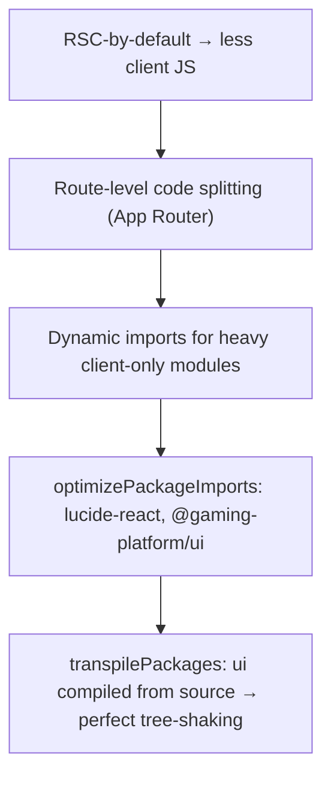

| Technique | Where |
| --- | --- |
| RSC-by-default | Pages/layouts ship zero client JS unless `'use client'` |
| Route code splitting | App Router splits per route automatically |
| `optimizePackageImports` | `next.config.mjs` trims icon/UI imports to used symbols |
| `transpilePackages` | UI compiled from source → tree-shaken, no dead code |
| Image optimization | `next/image` with `remotePatterns` for https hosts |
| Font optimization | `next/font` self-hosts Google fonts with `display: swap` |
| Standalone output | `output: 'standalone'` (Docker) for a minimal server bundle |

### 15.2 Runtime performance

| Concern | Technique |
| --- | --- |
| Animation | GPU transforms, capped DPR, offscreen/tab-hidden pausing, reduced-motion frames |
| Re-renders | Zustand selector subscriptions; React Query caching; memoized derived data (`useMemo`) |
| Network | 60s query stale time, no refetch-on-focus, single retry |
| Hydration | Mounted-gating for clock/window-reading layers to avoid mismatch + re-render |
| Memory | Full teardown of RAF/listeners/GPU resources on unmount |

### 15.3 Web Vitals telemetry

`monitoring/web-vitals-reporter.tsx` reports **LCP, INP, CLS, FCP, TTFB** via the `web-vitals` library to `reportVital`, and installs global `error`/`unhandledrejection` handlers → `logClientError`. Everything funnels through `lib/monitoring.ts`'s `sink()`, which is a **production-safe no-op** unless a host wires `window.__gpMonitor` (e.g. to forward to an APM). Nothing here throws, imports a vendor SDK, or blocks rendering. See [ADR-009](#23-frontend-adrs).

### 15.4 The re-render discipline

Fast frameworks still stutter if components re-render needlessly. The platform enforces a few habits that keep the tree quiet:

- **Selector subscriptions:** Zustand stores are read with narrow selectors (`useAuthStore((s) => s.accessToken)`), so a component re-renders only when the slice it reads changes — not on every store update. The `use-runtime` hook, for instance, subscribes to just `accessToken` and `initialized`.
- **Query cache reuse:** React Query dedupes and caches by `queryKey`, so two components asking for the same data share one fetch and one cache entry; navigating away and back within `gcTime` re-uses the cache instead of refetching.
- **Derived-data memoization:** expensive derivations (Nova's suggestion list, filtered catalogs) are wrapped in `useMemo` keyed on their real inputs.
- **Stable callbacks:** event handlers passed to children (e.g. `sendAction` in `use-runtime`) are `useCallback`-wrapped so children don't re-render on identity churn.
- **Provider stability:** the React Query client is created once (`useState(makeQueryClient)`), never re-instantiated on render.

### 15.5 Deferring the expensive work

The heaviest client work — the WebGL scene, the AudioContext, the Socket.IO connection — is **never** done during render. Each is created inside a `useEffect` after mount and torn down on unmount. This keeps first paint free of GPU/audio/network setup and guarantees that leaving a route reclaims its resources (the hero disposes its three.js objects, the runtime hook ends its session and disconnects, the sound engine can stop its ambient pad). The result is a platform that is visually maximal but computationally disciplined.

### 15.6 Indicative budgets

| Metric | Target (Core Web Vitals "good") |
| --- | --- |
| LCP | < 2.5 s |
| INP | < 200 ms |
| CLS | < 0.1 |
| FCP | < 1.8 s |
| TTFB | < 800 ms |

---

## 16. Responsive Design

The platform is designed **mobile-first and desktop-cinematic**.

| Breakpoint | Width | Behavior |
| --- | --- | --- |
| Mobile | < 640px | Single-column, mobile nav drawer (`Sheet`), fewer WebGL instances, lighter DPR |
| Tablet | 640–1024px | Two-column shelves, condensed header |
| Desktop | 1024–1440px | Full multi-shelf lobby, persistent header, full immersion |
| Large | ≥ 1440px | Container caps at 1440px; content centered, background bleeds edge-to-edge |

Responsive behavior is driven by Tailwind breakpoints (the shared preset centers a `1440px` container) and, where JS decisions are needed, the `useMediaQuery` hook from `packages/ui`. The WebGL hero explicitly reduces instance count and DPR below 768px, and the dashboard main stage uses responsive padding (`px-4 sm:px-6 md:py-8`). Layout adapts rather than merely scaling: the dashboard uses a top-bar shell (no sidebar) so it reads well from phone to widescreen.

### 16.1 Adaptive, not just fluid

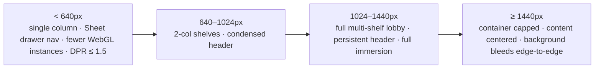

The distinction between **fluid** (everything scales proportionally) and **adaptive** (the layout re-shapes) matters here. Three examples of genuine adaptation in the codebase:

- **Navigation** collapses from a full horizontal bar to a `Sheet` drawer toggled by `ui-store.mobileNavOpen` on small screens — the nav *changes form*, not just size.
- **The WebGL hero** doesn't merely shrink; it renders *fewer instances* and caps DPR lower below 768px, trading visual density for frame rate where GPUs are weaker.
- **Shelves** reflow from multi-column grids to single-column stacks, and horizontally-scrolling carousels become the primary browse affordance on touch.

Text scales via `rem`, so the accessibility text-size stepper ([§14.1](#141-the-accessibility-menu)) composes cleanly with responsive breakpoints — a user on a phone at the largest text size still gets a coherent layout because spacing and type are relative units.

### 16.2 Touch & input

Interactive targets meet comfortable touch sizes (the UI `Button` sizes start at `h-9`/`h-10`), hover-only affordances always have a tap/focus equivalent, and pointer-based parallax (hero canvas) degrades gracefully on touch where `pointermove` is sparse. Fullscreen play (`use-fullscreen`) gives games an immersive mode on both mobile and desktop.

---

## 17. Error Handling

Errors degrade gracefully at every level.

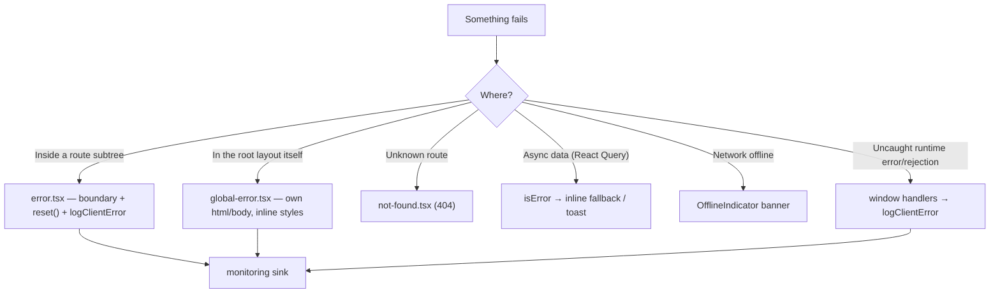

| Layer | Component | Behavior |
| --- | --- | --- |
| Route boundary | `error.tsx` | Catches render/data errors in a subtree; **Try again** (`reset()`) + back-to-lobby; logs to monitoring |
| Root boundary | `global-error.tsx` | Last-resort; renders its own document, dependency-free/inline-styled so it works even if the app shell is broken |
| Not found | `not-found.tsx` | Branded 404 |
| Data errors | React Query | `error`/`isError` surfaced as inline fallbacks or `sonner` toasts |
| Offline | `OfflineIndicator` | Non-blocking banner when `navigator.onLine` is false, auto-hides on reconnect |
| Global handlers | `WebVitalsReporter` | `window.onerror` + `unhandledrejection` → `logClientError` |

**Why two boundaries:** `error.tsx` cannot render if the failure is in the root layout (it needs the layout's `<html>`), so `global-error.tsx` supplies its own document — the belt-and-suspenders pattern that guarantees users never see a blank screen. Loading states use `loading.tsx` (route Suspense) and skeletons (`game-card-skeleton`, UI `Skeleton`) so perceived performance stays high.

### 17.1 Loading states & perceived performance

A fast app that shows a blank screen *feels* slow; a slower app that shows structure *feels* fast. The platform invests in **skeletons and progressive reveal** so the user always sees something meaningful:

| State | Treatment |
| --- | --- |
| Route transition (RSC streaming) | `loading.tsx` `Spinner`, then content streams in |
| Data-bound shelf loading | `game-card-skeleton` placeholders matching the final card shape |
| Individual async values | UI `Skeleton` blocks sized to the incoming content |
| Optimistic actions | Immediate UI change (favorite toggle) before the server confirms |
| Live data pause | `OfflineIndicator` explains *why* data stopped, instead of silent staleness |

Skeletons are sized to match their eventual content, which also **reduces CLS** (cumulative layout shift) — the placeholder occupies the same space the real card will, so nothing jumps when data arrives. This is a direct, measurable link between the loading-state strategy and the Web Vitals the platform reports ([§15.3](#153-web-vitals-telemetry)).

### 17.2 Resilience philosophy

The through-line across all of these mechanisms is **degrade, don't crash**. A failed data fetch shows a fallback; a lost connection shows a banner and keeps the last state; a render error is caught by a boundary with a retry; a broken root layout still renders a self-contained error document; a failed service-worker registration is swallowed. No single failure — data, network, render, or infrastructure — takes the whole app down. This mirrors the backend's fail-closed-but-recoverable posture ([Backend §17](./BACKEND_ARCHITECTURE.md#17-error-handling)) on the client side.

---

## 18. PWA

The platform is installable and offline-tolerant via a **hand-written, dependency-free** service worker — chosen over `next-pwa` to keep the SW minimal, auditable, and production-gated.

### 18.1 Manifest

[`public/manifest.webmanifest`](../apps/frontend/public/manifest.webmanifest): `display: standalone`, `start_url: /`, `theme_color: #7c3aed`, `background_color: #f4f6fc`, categories `games`/`entertainment`, and SVG icons (`icon.svg` any, `icon-maskable.svg` maskable). Linked from the root layout metadata alongside `appleWebApp` config.

### 18.2 Service worker

[`public/sw.js`](../apps/frontend/public/sw.js) implements a deliberately small caching policy:

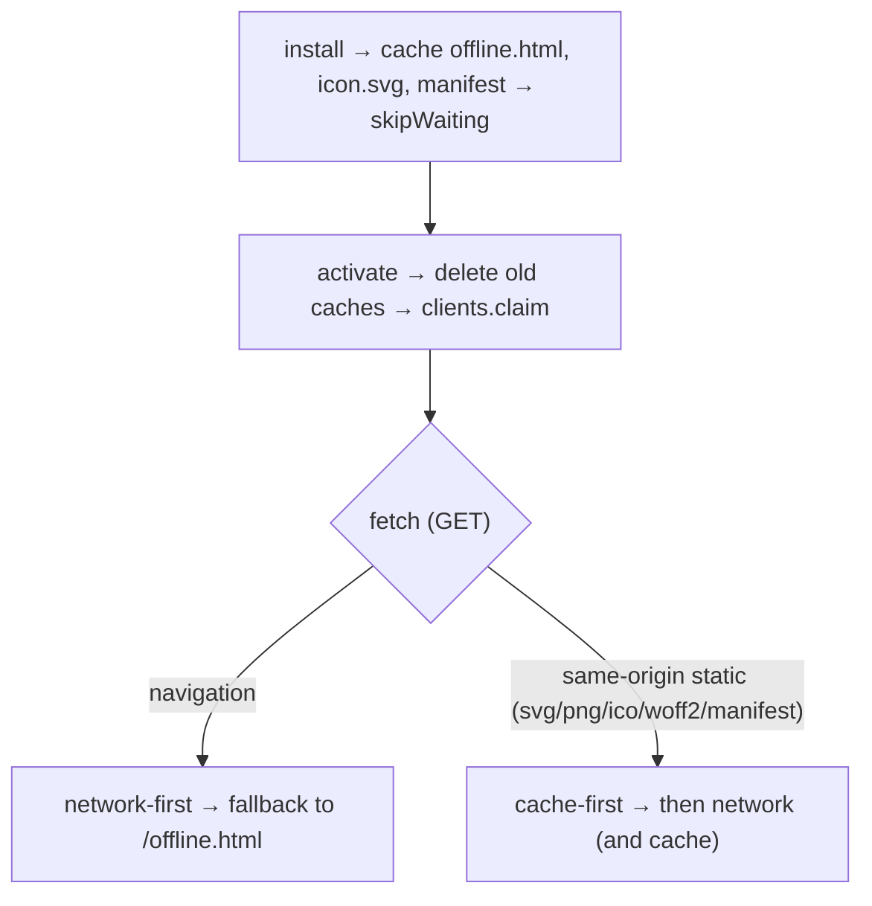

- **Navigations are network-first** so page content is always fresh; the cached `offline.html` shows only when the network is down.
- **Static assets are cache-first** for instant repeat loads.
- Cache is versioned (`gp-shell-v2`) and old caches are purged on activate.

### 18.3 Registration — production only

`monitoring/pwa-register.tsx` registers `/sw.js` **only in production** (`NODE_ENV === 'production'`) and only if `serviceWorker` is supported, on `window.load`, swallowing failures via the monitor. It is intentionally **off in dev/E2E** to avoid cache-staleness while iterating — which is also why the SW never interferes with Playwright runs. See [ADR-010](#23-frontend-adrs).

---

## 19. Security

The frontend's security posture complements the backend's ([Backend §18](./BACKEND_ARCHITECTURE.md#18-security)); the client is treated as **untrusted**, so its job is to handle tokens safely and validate input for UX, not for authority.

### 19.1 Token handling

| Token | Storage | Rationale |
| --- | --- | --- |
| **Access token** | **In-memory only** (Zustand `auth-store`, mirrored to Axios) | Not readable across reloads or by injected scripts persisting to storage — reduces XSS blast radius |
| **Refresh token** | **httpOnly cookie** (set by backend) | Invisible to JS; sent automatically via Axios `withCredentials`; silent refresh on load |

The access token is **never** written to `localStorage`/`sessionStorage`. On reload, `AuthInitializer` silently re-obtains it from the cookie ([§8.2](#82-authentication--session-flow)).

### 19.2 XSS / CSRF considerations

- **XSS:** React escapes by default; the app avoids `dangerouslySetInnerHTML`. The in-memory token means even a transient XSS can't harvest a persisted token. `next.config.mjs` sets `poweredByHeader: false`.
- **CSRF:** the sensitive credential is an httpOnly cookie, but state-changing calls carry the **bearer access token** (which a cross-site form can't read or attach), so classic cookie-based CSRF doesn't grant authority; CORS is locked to configured origins on the backend.
- **Input validation:** Zod schemas + React Hook Form validate on the client for immediate feedback, but the server re-validates every input as the real gate ([Backend §18.5](./BACKEND_ARCHITECTURE.md#185-input-validation)). Client validation is a UX affordance, never a trust boundary.

### 19.3 Demo mode safety

`clientConfig.demoMode` enables a client-only demo login and the demo wallet in development/when explicitly flagged. In **production** (`NODE_ENV=production` without the flag) real authentication is used and the demo wallet never touches the real wallet engine. Demo mode is a design/review affordance, not a production auth path. See [ADR-008](#23-frontend-adrs).

### 19.4 Public config only

`lib/config.ts` exposes only `NEXT_PUBLIC_*` variables — nothing secret ever reaches the browser bundle. API/WS URLs, app name, environment, and the demo flag are the entire public surface.

### 19.5 Client security posture summary

| Concern | Client responsibility | Real authority |
| --- | --- | --- |
| Authentication | Hold access token in memory; silent refresh | Backend verifies JWT + session ([Backend §7](./BACKEND_ARCHITECTURE.md#7-authentication-architecture)) |
| Authorization | `hasPermission`/`hasRole` to *hide* UI | Backend guards enforce access ([Backend §8](./BACKEND_ARCHITECTURE.md#8-authorization-architecture)) |
| Input validation | Zod + RHF for instant feedback | Backend `ValidationPipe` re-validates |
| Token storage | In-memory access, httpOnly cookie refresh | Backend sets/rotates the cookie |
| Config exposure | Only `NEXT_PUBLIC_*` in the bundle | Secrets live server-side only |

The unifying principle: **the client is a convenience layer, never a security boundary.** Client-side permission checks exist purely to avoid showing a user a control they can't use; the server independently enforces every rule. A malicious client that flips `hasPermission` to `true` sees a button that, when clicked, is still rejected by the backend guard. This division — UX affordance on the client, authority on the server — is the single most important security concept for a frontend engineer to internalize on this platform.

---

## 20. Testing

### 20.1 Strategy

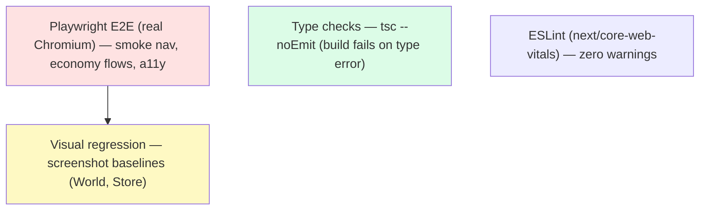

### 20.2 Playwright E2E

[`playwright.config.ts`](../apps/frontend/playwright.config.ts) runs the suite against a **demo-mode dev server** on port 3130 (`NEXT_PUBLIC_DEMO_MODE=true`), so the client-only demo login and wallet work **without the backend** — pages fall back to mock data. Key decisions (repository-grounded):

| Decision | Value | Why |
| --- | --- | --- |
| `workers` | 1, `fullyParallel: false` | Serial against `next dev` avoids overwhelming the on-demand route compiler (parallel navigations caused `ERR_ABORTED`) |
| `retries` | 2 in CI, 1 local | Absorb first-compile flakiness |
| `trace` / `screenshot` | on-first-retry / only-on-failure | Cheap by default, rich on failure |
| Viewport | 1440×900 | Deterministic visual baselines |

### 20.3 Test suites

| Spec | Covers |
| --- | --- |
| `navigation.spec` | Smoke-navigate every major route; assert 200, a visible landmark, and no error text |
| `wallet-missions.spec` | Economy flows — store purchase flips item to Owned/Equipped + toast; daily lucky wheel; missions render claim/in-progress |
| Accessibility spec | Toggles reduce-motion/contrast, asserts root font-size stepping |
| Visual baselines | World/Store screenshots (home hero left flaky-tolerant due to live WebGL canvas) |

Shared helpers (`tests/e2e/helpers.ts`) seed `gp-intro-seen` and `a11y-reduce` before first navigation (via `addInitScript`) so the cinematic intro and heavy motion don't destabilize tests — a good example of designing immersive systems to be *testable*.

### 20.4 Visual regression & flake management

Visual baselines are captured for stable, content-rich surfaces (e.g. World and Store). The interesting engineering problem is the **living background**: the home hero renders a live WebGL canvas whose pixels differ every frame, so a naïve full-page screenshot would be perpetually "changed." The strategy is pragmatic — baseline the deterministic surfaces, treat the WebGL-heavy home hero as flaky-tolerant, and seed `a11y-reduce` before capture so motion settles. This is a concrete example of a broader principle: **immersive systems must be designed to be testable.** Because `DynamicWorld`, the cinematic intro, and heavy motion all honor a reduce-motion flag and a `sessionStorage` intro-seen flag, the E2E harness can neutralize non-determinism with two `addInitScript` lines in `helpers.ts` rather than fighting the animations.

### 20.5 What each layer buys us

| Layer | Catches |
| --- | --- |
| `tsc --noEmit` | Type/contract drift with the backend, `undefined` bugs |
| ESLint (`next/core-web-vitals`) | Anti-patterns, unsafe hooks, perf foot-guns |
| Playwright smoke nav | Routes that 404, fail to mount, or render error text |
| Playwright economy flows | Broken store/wallet/mission interactions |
| Accessibility spec | Regressions in reduce-motion/contrast/text-size |
| Visual baselines | Unintended layout/style changes on stable surfaces |

Notably, running E2E in **demo mode** decouples frontend testing from backend availability: the client-only demo login, demo wallet, and mock data let the entire navigable surface be exercised in CI with just a `next dev` server — no database, no NestJS. This is a direct payoff of the demo-mode architecture ([ADR-008](#23-frontend-adrs)).

### 20.6 Type & lint gates

`tsc --noEmit` and `eslint` run in CI; `next.config.mjs` sets `typescript.ignoreBuildErrors: false` and `eslint.ignoreDuringBuilds: false`, so a type error or lint failure **fails the build**. Performance is guarded by the `next/core-web-vitals` ESLint config plus the runtime Web Vitals reporter.

---

## 21. Extension Guide

Every recipe stays inside the established seams so existing architecture is never broken.

### 21.1 Add a page / route

1. Create `app/<group>/<route>/page.tsx` inside the right route group (`(dashboard)` for authenticated app, `(casino)` for immersive games, etc.).
2. Keep it an **RSC** unless it needs interactivity; drop to `'use client'` only for the interactive parts.
3. Add the route to the relevant array in `shared/navigation.ts` so it appears in nav.
4. If it needs a themed background, add a mapping in `route-background.tsx`.

### 21.2 Add a layout

Create `app/<group>/layout.tsx`. Decide chrome: full-bleed immersive (like casino), shell-with-header (like dashboard), or minimal (like game). Layouts persist across their subtree — put stateful shared chrome here.

### 21.3 Add a store (Zustand)

Create `stores/<name>.ts` with `create<State>()`. Keep it to **one concern**; expose actions, not setters that leak internals. Never mirror server data here — that belongs in React Query.

### 21.4 Add a hook

Create `hooks/use-<name>.ts`. Wrap React Query for server data, `socket.io-client` for real-time, or a browser API. Return a typed result object. Gate on `auth-store.initialized`/`accessToken` if it depends on the session (see `use-runtime`).

### 21.5 Add a component

Put it in the right `components/<domain>` folder. Compose from `packages/ui` primitives; style with token classes; add `'use client'` only if it needs interactivity/animation. If it animates, check `useReducedMotion`.

### 21.6 Add a game

- **Client prototype:** add under `components/games/prototype/*` and register it in `lib/prototype-games.ts`; route it via `/arcade/[slug]` or `/games/[slug]`.
- **Server-authoritative game:** the engine and plugin live on the backend ([Backend §22.6](./BACKEND_ARCHITECTURE.md#226-add-a-runtime-plugin-a-new-game-engine)); on the frontend, drive it through the `runtime-harness` + `use-runtime` with the plugin key. Add a catalog entry so it appears in `/games`.

### 21.7 Add a background / immersive layer

Create it under `components/backgrounds` (or `experience`), make it `aria-hidden` + `pointer-events-none`, mount-gate anything reading `window`/clock, honor reduced motion, and pause off-screen. Wire it into `route-background.tsx` (per-route) or the root layout (global).

### 21.8 Add a sound

Add a new `Sfx` name in `lib/sound.ts` and a `case` in `render()` composed from `blip`/`noise`/`sweep`. Trigger it with `sound.play('<name>')` from a user gesture. For a new ambience, add a preset to the `AMBIENCE` map.

### 21.9 Add an API integration

Add a typed module `lib/<domain>-api.ts` using `apiClient` + `unwrap<T>()` with `@gaming-platform/types`. Consume it via a React Query hook. Never call `axios`/`fetch` from a component.

---

## 22. Coding Standards

### 22.1 React & Next.js

- **RSC by default**; add `'use client'` only for interactivity, browser APIs, or animation.
- **Server/Client boundary is explicit** — pass serializable props across it.
- **Colocate** components with their domain; keep pages thin (compose, don't implement).
- **Suspense & boundaries** — provide `loading`/`error` where data is fetched.

### 22.2 TypeScript

- `strict` mode; no `any` at boundaries; share types via `@gaming-platform/types`.
- `type`-only imports for types; explicit return types on exported functions/hooks.
- Build fails on type errors (`ignoreBuildErrors: false`).

### 22.3 Styling

- Tailwind utilities + token classes only; **never** hard-code colors — use tokens.
- Compose variants with **CVA** in `packages/ui`; merge classes with `cn()`.
- Glassmorphism/gradients via the shared utility classes (`glass`, `sheen`, `text-gradient`, `glow-*`).

### 22.4 Hooks & state

- One concern per hook/store; return typed objects.
- Server state → React Query; client state → Zustand; ephemeral → `useState`.
- Clean up effects (listeners, RAF, sockets, GPU) on unmount.

### 22.5 Naming & structure

| Artifact | Convention | Example |
| --- | --- | --- |
| Component file | `kebab-case.tsx`, PascalCase export | `game-card.tsx` → `GameCard` |
| Hook | `use-<name>.ts` | `use-runtime.ts` |
| Store | `<name>.ts` in `stores/` | `auth-store.ts` |
| API module | `<domain>-api.ts` in `lib/` | `games-api.ts` |
| Route | App Router folders | `(dashboard)/wallet/page.tsx` |

### 22.6 Documentation

Every non-trivial file carries a top-of-file JSDoc explaining its purpose and constraints (as seen throughout the codebase — e.g. `template.tsx`, `sound.ts`, `use-runtime.ts`). Architectural changes update this document or add an ADR ([§23](#23-frontend-adrs)).

---

## 23. Frontend ADRs

Each ADR records the **problem, decision, alternatives, trade-offs, and consequences.**

### ADR-001 — Next.js App Router with RSC-by-default
- **Problem:** deliver a rich, animated app with small bundles and fast first paint.
- **Decision:** App Router; server components by default, client components on purpose.
- **Alternatives:** Pages Router; Vite SPA; Remix.
- **Trade-offs:** (+) less client JS, streaming, nested layouts; (−) server/client boundary discipline required.
- **Consequences:** immersive/interactive parts are explicitly `'use client'`; scaffolding is free of client JS.

### ADR-002 — React Query for server state, not a global store
- **Problem:** mirror backend truth with caching, refetch, and invalidation.
- **Decision:** TanStack Query owns all server state; per-request client factory.
- **Alternatives:** Redux Toolkit Query; SWR; manual fetch + store.
- **Trade-offs:** (+) declarative caching/mutations, no boilerplate; (−) another mental model beside Zustand.
- **Consequences:** no server data in Zustand; invalidation drives freshness.

### ADR-003 — Zustand for client state
- **Problem:** frequently-updating client state (auth, UI, demo, sound) without re-render storms.
- **Decision:** small, selector-based Zustand stores, one per concern.
- **Alternatives:** Context; Redux.
- **Trade-offs:** (+) tiny, ergonomic, targeted re-renders; (−) less ecosystem tooling than Redux.
- **Consequences:** seven focused stores; token mirrored into Axios.

### ADR-004 — Raw three.js for the WebGL hero
- **Problem:** a cinematic, performant living hero scene.
- **Decision:** raw three.js with instancing/points and manual loop + disposal.
- **Alternatives:** React-Three-Fiber; video; Canvas-2D only.
- **Trade-offs:** (+) full control of loop/DPR/disposal, no reconciler on hot path; (−) imperative code.
- **Consequences:** strict perf discipline (DPR cap, offscreen pause, reduced-motion frame, dispose on unmount).

### ADR-005 — Opacity-only page transitions via template.tsx
- **Problem:** smooth route cross-fades without breaking fixed-position immersive layers.
- **Decision:** `template.tsx` animates opacity only; reduced-motion returns children.
- **Alternatives:** transform/slide transitions; layout animations.
- **Trade-offs:** (+) never creates a containing block that breaks `position: fixed`; (−) no directional motion.
- **Consequences:** backgrounds/HUD/modals stay correctly fixed across navigations.

### ADR-006 — Forced light theme
- **Problem:** a consistent premium, luminous aesthetic.
- **Decision:** `forcedTheme="light"` via next-themes; tokens remain theme-capable.
- **Alternatives:** dark-first; user theme switching.
- **Trade-offs:** (+) one polished visual target; (−) theme toggle is inert at runtime.
- **Consequences:** design system is dark-capable but the product ships light.

### ADR-007 — Original WebAudio sound engine (no files)
- **Problem:** rich, contextual audio without bundle bloat or licensing.
- **Decision:** synthesize all SFX/ambience at runtime; gesture-gated, muted by default.
- **Alternatives:** audio-file sprites; a sound library.
- **Trade-offs:** (+) tiny, tweakable, license-free; (−) synthesis code to maintain.
- **Consequences:** route-aware ambience morphs; state in a Zustand store.

### ADR-008 — Client-only demo mode
- **Problem:** enable design review and try-before-auth without backend coupling or risk.
- **Decision:** `demoMode` enables client-only login + demo wallet; production keeps real auth.
- **Alternatives:** seeded backend demo accounts; no demo.
- **Trade-offs:** (+) works offline/without backend, safe; (−) two code paths to keep aligned.
- **Consequences:** demo wallet never touches the real engine; E2E runs in demo mode.

### ADR-009 — Pluggable, production-safe monitoring
- **Problem:** capture Web Vitals + errors without coupling to a vendor SDK.
- **Decision:** report to a `sink()` that is a no-op unless a host wires `window.__gpMonitor`.
- **Alternatives:** bundle Sentry/APM directly.
- **Trade-offs:** (+) zero vendor lock-in, never blocks render; (−) host must wire a sink to persist.
- **Consequences:** dev logs to console; prod is silent-by-default and swappable.

### ADR-010 — Hand-written, production-gated service worker
- **Problem:** installability + offline tolerance without cache-staleness during dev.
- **Decision:** minimal custom SW; registered only in production.
- **Alternatives:** `next-pwa`; no PWA.
- **Trade-offs:** (+) auditable, minimal, no dev interference; (−) manual cache policy.
- **Consequences:** network-first pages, cache-first assets, versioned cache.

### ADR-011 — Design system as source-transpiled workspace package
- **Problem:** one visual language, instant iteration, perfect tree-shaking.
- **Decision:** `@gaming-platform/ui` consumed as source via `transpilePackages`.
- **Alternatives:** pre-built package; inline components.
- **Trade-offs:** (+) HMR on token/variant changes, tree-shaken; (−) app compiles the package.
- **Consequences:** CVA variants + CSS-var tokens shared app-wide.

### ADR-012 — In-memory access token + silent refresh
- **Problem:** keep sessions across reloads without persisting a token to storage.
- **Decision:** token in memory (mirrored to Axios); refresh via httpOnly cookie on load.
- **Alternatives:** localStorage token; session cookie only.
- **Trade-offs:** (+) XSS-safer; (−) a refresh round-trip on each cold load.
- **Consequences:** `AuthInitializer` + `initialized` gate downstream auth logic.

### ADR-013 — Split animation into three budgeted tiers
- **Problem:** cinematic motion that never janks or harms accessibility.
- **Decision:** micro (Framer), scene/transition (Framer+CSS), render-loop (Canvas/WebGL) — all reduced-motion & offscreen-aware.
- **Alternatives:** ad-hoc animation per component.
- **Trade-offs:** (+) predictable perf, one discipline; (−) explicit budgeting effort.
- **Consequences:** every animated layer follows the same rules.

### ADR-014 — Centralized navigation data
- **Problem:** keep every nav surface consistent with real routes.
- **Decision:** typed `NavItem[]` arrays in `shared/navigation.ts` feed all nav.
- **Alternatives:** per-component hard-coded nav.
- **Trade-offs:** (+) one-line route changes propagate; (−) a shared file to maintain.
- **Consequences:** header/sidebar/mobile nav never drift.

### ADR-015 — Client validation as UX, server as authority
- **Problem:** immediate form feedback without trusting the client.
- **Decision:** Zod + React Hook Form on the client; server re-validates everything.
- **Alternatives:** client-only or server-only validation.
- **Trade-offs:** (+) great UX + real safety; (−) schemas maintained on both tiers.
- **Consequences:** the client validates for feel; the backend guards for truth.

### ADR-016 — Envelope unwrapping in one place
- **Problem:** the backend wraps every response; components want domain data.
- **Decision:** `unwrap<T>()` strips the `ApiResponse` envelope in `api-client`.
- **Alternatives:** unwrap per call site.
- **Trade-offs:** (+) one place knows the envelope; (−) a thin indirection.
- **Consequences:** API modules return `T`, not envelopes — clean hooks.

---

## 24. Future Frontend Roadmap

| Phase | Initiative | What changes | Seam it uses |
| --- | --- | --- | --- |
| **1. Real-time** | Multiplayer UI | Shared-room presence, live opponents, spectator views | `use-runtime`, live components |
| **1. Perf** | Route-level dynamic imports for heavy games | Lazy-load prototype/table bundles on demand | Dynamic imports |
| **2. Native** | React Native / Expo shell | Reuse types + API modules for a mobile app | `lib/*-api`, `types` |
| **2. Input** | Gamepad / controller support | Controller navigation for lobby + games | Input layer over nav |
| **3. Accessibility** | Expanded ARIA + captions | Live-region announcements for game events, audio captions | a11y menu + components |
| **3. Rendering** | Offload WebGL to a worker (OffscreenCanvas) | Move the hero render loop off the main thread | `gaming-universe` |
| **4. Theming** | Optional dark/seasonal themes | Re-enable the (retained) theme capability | tokens + `theme-provider` |
| **4. Telemetry** | Wire `window.__gpMonitor` to an APM | Persist Web Vitals/errors to a backend | `lib/monitoring` sink |
| **5. Offline** | Richer PWA caching + background sync | Cache catalog shells; queue actions offline | `sw.js` |
| **5. i18n** | Localization | Extract copy, locale routing | App Router + content |

**Guiding principle:** the current architecture already names the seams (API modules, the runtime hook, the monitoring sink, the token store, the design-system package). Each future initiative swaps or extends an implementation behind a seam rather than re-plumbing the app.

---

## 25. Appendix

### A. Glossary

| Term | Definition |
| --- | --- |
| **RSC** | React Server Component — renders on the server, ships no client JS |
| **Route group** | `(name)` App Router folder that scopes a layout without affecting the URL |
| **Template** | App Router file that re-mounts on every navigation (enables per-route transitions) |
| **Immersive layer** | A root-mounted, `aria-hidden` visual/audio system (background, hero, dynamic world, sound) |
| **Nova** | The client-side AI companion (`ai-assistant`) |
| **Design system** | `@gaming-platform/ui` — tokens + CVA primitives |
| **Token** | A CSS-variable-backed design value (color/shadow/gradient/radius) |
| **CVA** | class-variance-authority — declarative component variants |
| **Envelope** | The backend's uniform `ApiResponse<T>` wrapper, stripped by `unwrap()` |
| **Silent refresh** | Re-obtaining the access token from the httpOnly cookie on load |
| **Demo mode** | Client-only auth + wallet for review/offline; never used as production auth |

### B. Component Index (selected)

| Group | Components |
| --- | --- |
| Immersive | `hero/gaming-universe`, `marketing/hero-canvas`, `backgrounds/{dynamic-world,route-background,page-background}`, `layout/cinematic-background`, `experience/cinematic-intro` |
| Shared | `accessibility-menu`, `ai-assistant`, `sound-control`, `ambient-audio`, `click-fx`, `navigation`, `user-menu`, `notifications-menu`, `search-command`, `balance-pill`, `level-pill`, `logo`, `page-header`, `theme-toggle` |
| Layout | `header`, `site-header`, `marketing-header`, `sidebar`, `mobile-nav`, `footer`, `app-background` |
| Monitoring | `web-vitals-reporter`, `pwa-register`, `offline-indicator` |
| Games | `game-card`, `game-grid`, `game-shelf`, `featured-carousel`, `games-discovery`, `library-rows`, `home-sections`, `game-cover`, `favorite-button`, `game-card-skeleton`, `prototype/*` |
| Domain | `crash/*`, `dice/*`, `roulette/*`, `card/*`, `sports/*`, `live/*`, `social/social-feed`, `profile/player-card`, `rewards/*`, `tournament/bracket-viewer`, `runtime/*` |
| UI primitives (`packages/ui`) | `Avatar`, `Badge`, `Button`, `Card`, `DropdownMenu`, `Input`, `Label`, `ScrollArea`, `Separator`, `Sheet`, `Skeleton`, `Spinner`, `Tooltip` |

### C. Hook Index

| Hook | Purpose |
| --- | --- |
| `use-runtime` | Server-authoritative runtime session over Socket.IO (state machine, heartbeat, reconnect) |
| `use-favorites` | React Query favorites (ids + toggle with invalidation) |
| `use-fullscreen` | Fullscreen API wrapper for the game harness |
| `useMediaQuery` (`packages/ui`) | JS-driven responsive breakpoints |

### D. Store Index

| Store | Concern |
| --- | --- |
| `auth-store` | Session: user, in-memory token, permissions/roles |
| `ui-store` | Sidebar / mobile nav chrome |
| `demo-wallet` | Client-only demo coins |
| `missions` | Daily/weekly mission progress |
| `player-profile` | Level, XP, cosmetics, daily claim |
| `game-stats` | Local play stats |
| `sports-slip-store` | Sportsbook bet slip |
| `useSound` (`lib/sound.ts`) | Mute, volume, ambient |

### E. Route Index (by group)

| Group | Routes |
| --- | --- |
| `(auth)` | `/login`, `/register`, `/forgot-password`, `/reset-password`, `/verify-email` |
| `(casino)` | `/casino[/[variant]]`, `/crash[/[variant]]`, `/dice[/[variant]]`, `/roulette[/[variant]]`, `/sportsbook[/[matchId]]` |
| `(dashboard)` | `/world`, `/dashboard`, `/discover`, `/games[/[slug]]`, `/arcade[/[slug]]`, `/favorites`, `/feed`, `/friends`, `/community`, `/clans`, `/mailbox`, `/daily`, `/missions`, `/battle-pass`, `/store`, `/marketplace`, `/avatar`, `/profile`, `/stats`, `/trophies`, `/hall-of-fame`, `/leaderboards`, `/tournaments[/[id]]`, `/rewards`, `/wallet`, `/transactions`, `/notifications`, `/settings[/security]` |
| `(game)` | `/play/[slug]` |
| `admin` | `/admin`, `/admin/{games,card,roulette,dice,crash,sports,wallet,tournaments,ai,operations,analytics,settings}` |
| root | `/`, `/collections/[slug]` |

### F. Provider Index

| Provider | Role |
| --- | --- |
| `AppProviders` | Composes all client providers + immersive layers + Toaster |
| `ThemeProvider` | next-themes, `forcedTheme="light"` |
| `QueryProvider` | React Query client (per-instance) + Devtools (dev) |
| `AuthInitializer` | Silent refresh + session hydration on mount |

### G. Context / cross-cutting layer Index

| Layer | Mounted at root |
| --- | --- |
| Route background / dynamic world | `RouteBackground`, `DynamicWorld` |
| Utility HUD | `SoundControl`, `AccessibilityMenu`, `AiAssistant`, `ClickFx`, `CinematicIntro` |
| Monitoring | `OfflineIndicator`, `WebVitalsReporter`, `PwaRegister` |
| Feedback | `Toaster` (sonner) |

### H. Dependency Versions

| Package | Version |
| --- | --- |
| `next` | ^15.1.4 |
| `react` / `react-dom` | ^19.0.0 |
| `typescript` | ^5.7.3 |
| `tailwindcss` | ^3.4.17 |
| `framer-motion` | ^11.15.0 |
| `three` | ^0.171.0 |
| `@tanstack/react-query` | ^5.62.11 |
| `zustand` | ^5.0.2 |
| `react-hook-form` | ^7.54.2 |
| `@hookform/resolvers` | ^3.10.0 |
| `zod` | ^3.24.1 |
| `socket.io-client` | ^4.8.1 |
| `axios` | ^1.7.9 |
| `next-themes` | ^0.4.4 |
| `sonner` | ^1.7.1 |
| `lucide-react` | ^0.469.0 |
| `class-variance-authority` | ^0.7.1 |
| `clsx` / `tailwind-merge` | ^2.1.1 / ^2.6.0 |
| `web-vitals` | ^4 |
| `@playwright/test` | ^1.49 |

### I. Useful References

- [System Architecture (master)](./SYSTEM_ARCHITECTURE.md)
- [Backend Architecture](./BACKEND_ARCHITECTURE.md)
- Source: [`apps/frontend/src`](../apps/frontend/src)
- Root layout: [`app/layout.tsx`](../apps/frontend/src/app/layout.tsx) · Transition: [`app/template.tsx`](../apps/frontend/src/app/template.tsx)
- Providers: [`src/providers`](../apps/frontend/src/providers) · Stores: [`src/stores`](../apps/frontend/src/stores) · Hooks: [`src/hooks`](../apps/frontend/src/hooks)
- API layer: [`src/lib`](../apps/frontend/src/lib) · Sound engine: [`src/lib/sound.ts`](../apps/frontend/src/lib/sound.ts)
- Design system: [`packages/ui`](../packages/ui)
- PWA: [`public/manifest.webmanifest`](../apps/frontend/public/manifest.webmanifest), [`public/sw.js`](../apps/frontend/public/sw.js)

---

*End of document — Frontend Architecture, Gaming Universe Platform. Maintained by the Office of the CTO. Changes to frontend architecture must update this document or record a new ADR in [§23](#23-frontend-adrs).*
