# Game Engine SDK — Gaming Universe Platform

> The definitive developer handbook for `@gaming-platform/game-sdk` — the SDK every game engine on the platform is built with. Where [GAME_RUNTIME.md](./GAME_RUNTIME.md) documents the runtime *system* (how a game is hosted, networked, and persisted), this document is the **SDK developer's reference**: every public interface, contract, lifecycle hook, manager API, validator, and extension point, plus the patterns for building a new engine. It is a companion to the master [System Architecture](./SYSTEM_ARCHITECTURE.md), the [Backend Architecture](./BACKEND_ARCHITECTURE.md), the [Frontend Architecture](./FRONTEND_ARCHITECTURE.md), and the [Database Architecture](./DATABASE_ARCHITECTURE.md). It is written so a senior engineer can implement, test, and ship a new game engine **without first reading the SDK source**.

| Field | Value |
| --- | --- |
| **Project Name** | Gaming Universe Platform |
| **Component** | Game Engine SDK (`@gaming-platform/game-sdk`) |
| **SDK Version** | 1.0.0 — isomorphic · 12 managers · 1 plugin base class |
| **Language** | TypeScript 5.7 (strict), ESM, built with `tsup`, tested with `vitest` |
| **Document Version** | 1.0 |
| **Prepared By** | Office of the CTO — Principal Game SDK Group |
| **Status** | Authoritative — single source of truth for the SDK |
| **Last Updated** | V3.0 · Phase 3.2 · Documentation Sprint 6 |

### Revision History

| Version | Date / Milestone | Author | Notes |
| --- | --- | --- | --- |
| 0.1 | SDK GA | Game SDK Group | Runtime, plugin host, lifecycle, managers, RNG |
| 0.5 | V3.0 Sprints 1–5 | Game SDK Group | Replay/result managers, config resolver, theme/localization, six engines built on the SDK |
| 1.0 | V3.0-P3.2 · Sprint 6 | Office of the CTO | Definitive SDK handbook — this document |

---

## Table of Contents

1. [Executive Summary](#1-executive-summary)
2. [SDK Philosophy](#2-sdk-philosophy)
3. [SDK Architecture](#3-sdk-architecture)
4. [Package Structure](#4-package-structure)
5. [Core SDK Components](#5-core-sdk-components)
6. [BaseGamePlugin](#6-basegameplugin)
7. [GameRuntime Integration](#7-gameruntime-integration)
8. [Plugin Registration](#8-plugin-registration)
9. [Lifecycle Hooks](#9-lifecycle-hooks)
10. [Event System](#10-event-system)
11. [State Management APIs](#11-state-management-apis)
12. [Timer APIs](#12-timer-apis)
13. [Replay APIs](#13-replay-apis)
14. [Statistics APIs](#14-statistics-apis)
15. [Asset APIs](#15-asset-apis)
16. [Audio APIs](#16-audio-apis)
17. [Animation APIs](#17-animation-apis)
18. [Configuration APIs](#18-configuration-apis)
19. [Localization APIs](#19-localization-apis)
20. [Theme APIs](#20-theme-apis)
21. [Deterministic RNG](#21-deterministic-rng)
22. [Plugin Validation](#22-plugin-validation)
23. [Error Handling](#23-error-handling)
24. [Testing Strategy](#24-testing-strategy)
25. [Extension Guide](#25-extension-guide)
26. [Coding Standards](#26-coding-standards)
27. [Architecture Decision Records](#27-architecture-decision-records)
28. [Future SDK Roadmap](#28-future-sdk-roadmap)
29. [Appendix](#29-appendix)
30. [SDK Reference](#30-sdk-reference)

---

## 1. Executive Summary

### 1.1 What the SDK is

`@gaming-platform/game-sdk` is the **Enterprise Game Runtime & Plugin Engine** — the reusable framework every game plugs into. Its own `index.ts` describes it precisely: *"Provides the reusable framework every game plugs into: a lifecycle-driven runtime, a sandboxed plugin host, deterministic RNG, and a full set of managers (state, events, assets, audio, animation, statistics, replay, results, timers, config, localization, theme, storage). Isomorphic — runs on the server (authoritative engines) and in the browser (runtime harness)."*

An engine author writes **one class** — a `GamePlugin` (usually by extending `BaseGamePlugin`) — that implements the gameplay unique to their genre. Everything else (the lifecycle, twelve managers, the deterministic RNG, the event bus, save-state, replay, statistics) is provided by the SDK and reused unchanged across every game. The six production engines — `dice`, `crash`, `roulette`, `card`, `lottery`, `sports` — are all built this way.

### 1.2 What the SDK gives an engine author

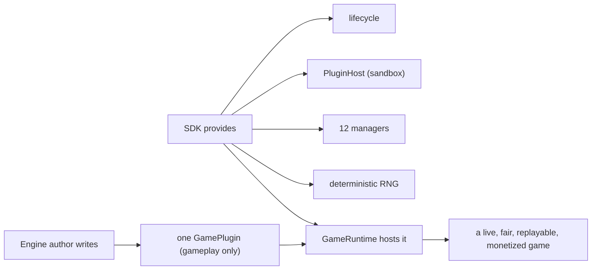

| The author provides | The SDK provides |
| --- | --- |
| `metadata` (key, genre, config, player range) | The lifecycle state machine |
| `createInitialState()` | 12 managers (state, events, timers, replay, results, statistics, assets, audio, animation, storage, localization, theme) + config resolver |
| Genre gameplay in lifecycle hooks | Deterministic `SeededRng` |
| Emitting/handling gameplay events | The `PluginHost` sandbox |
| Producing validated results | Registration + resolution + loading |

### 1.3 Why an SDK at all

Without the SDK, every game would reinvent state versioning, timer cleanup, event delivery, replay recording, config merging, and RNG seeding — and each would do it slightly differently, making the platform inconsistent and each game individually risky. The SDK **factors out everything that is not genre-specific gameplay** into one tested, isomorphic package. The result: a new game is *mostly pure logic plus a small plugin shell*, and it inherits provable fairness, reconnect, replay, and ledgered settlement for free. See [ADR-001](#27-architecture-decision-records).

### 1.3.1 The cost of not having an SDK

To appreciate the SDK's value, consider what building six games *without* it would require. Each game would independently implement: a lifecycle (init/load/start/stop with correct ordering), state versioning and snapshotting, timer tracking and cleanup, an event mechanism, replay recording, a deterministic RNG, config merging, asset preloading with progress, and audio/animation abstractions. Six teams would produce six subtly different implementations — six places for a timer leak, six replay formats, six RNG seedings of varying quality, six lifecycle bugs. Integration with the platform (sessions, sockets, wallet, persistence) would have to be re-wired per game.

The SDK collapses all of that into **one tested implementation**. A game that uses it gets a *correct* lifecycle, *guaranteed* cleanup, *faithful* replay, and *verifiable* determinism for free, and integrates with the runtime host through a single contract. The measurable result is visible in the codebase: the entire dice plugin is a few hundred lines, most of which is dice-specific gameplay, because the SDK carries everything else. This is the return on the SDK abstraction — **write the game, not the platform.**

### 1.4 Isomorphic by design

The single most important architectural fact: the SDK uses **no Node- or DOM-specific APIs**. It runs identically on the server (where the authoritative engine computes outcomes) and in the browser (where the harness renders them). Platform specifics enter only through **injectable drivers**. This is what lets the same engine logic be the source of truth on the server *and* the presentation model on the client. See [§2.1](#21-isomorphic-and-driver-injected) and [GAME_RUNTIME §3.3](./GAME_RUNTIME.md#33-the-isomorphic-boundary).

### 1.5 Scope of this document

This document covers the **SDK** (`packages/game-sdk`): its public interfaces, the `BaseGamePlugin` contract, every manager's API, the RNG, validation, error handling, testing, and how to build a new engine. It references [GAME_RUNTIME.md](./GAME_RUNTIME.md) for the *hosting* concerns (sessions, networking, persistence) that live in the backend `runtime` module, and the four other documents for the tiers the SDK integrates with.

---

## 2. SDK Philosophy

Six principles govern every design decision in the SDK.

### 2.1 Isomorphic and driver-injected

The SDK depends on no platform runtime. Anything platform-specific — loading an asset, playing a sound, scheduling a frame, persisting a key, logging — is expressed as an **injectable driver interface** with a headless default:

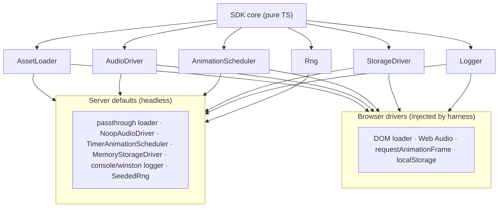

**Why:** determinism and testability. On the server the defaults are cheap and headless, so the authoritative engine computes outcomes with no rendering/audio overhead and is unit-testable without a browser. In the browser, the harness injects real drivers so the same engine drives the UI. See [ADR-002](#27-architecture-decision-records).

### 2.2 Deterministic

All randomness flows through a single seeded RNG (`SeededRng`). The same seed produces the same sequence on any machine. Determinism is the foundation of replay and provable fairness — an outcome is a pure function of `(config, seed, inputs)`. An engine must **never** use `Math.random()` or wall-clock-seeded randomness in its decision path. See [§21](#21-deterministic-rng) and [ADR-006](#27-architecture-decision-records).

### 2.3 Sandboxed plugins

A plugin talks **only** to the `PluginHost` the runtime grants it. It never constructs a manager, opens a socket, or reaches the database. The blast radius of a buggy engine is bounded to the services the host exposes. See [§7](#7-gameruntime-integration) and [ADR-004](#27-architecture-decision-records).

### 2.4 Composition of managers

The runtime is an aggregation of twelve focused managers, each owning one concern. An engine **composes** them (`host.state`, `host.timers`, `host.replay`) rather than reimplementing them, so cross-cutting behavior is uniform across every game. See [§5.4](#54-the-manager-set) and [ADR-014](#27-architecture-decision-records).

### 2.5 Hooks over boilerplate

`BaseGamePlugin` implements the full plugin contract in terms of overridable protected hooks (no-ops by default). A concrete engine overrides only the hooks it needs, and inherits cross-cutting behavior (replay recording on `emitEvent`, resource cleanup on `destroy`) automatically. See [§6](#6-basegameplugin) and [ADR-015](#27-architecture-decision-records).

### 2.6 Fail visibly

Errors in a lifecycle step transition the runtime to `ERROR`, emit a runtime error event, and log — never silently corrupt state. Invalid config, invalid results, and illegal lifecycle transitions all throw at the point of the mistake. See [§23](#23-error-handling).

---

## 3. SDK Architecture

### 3.1 The layered SDK

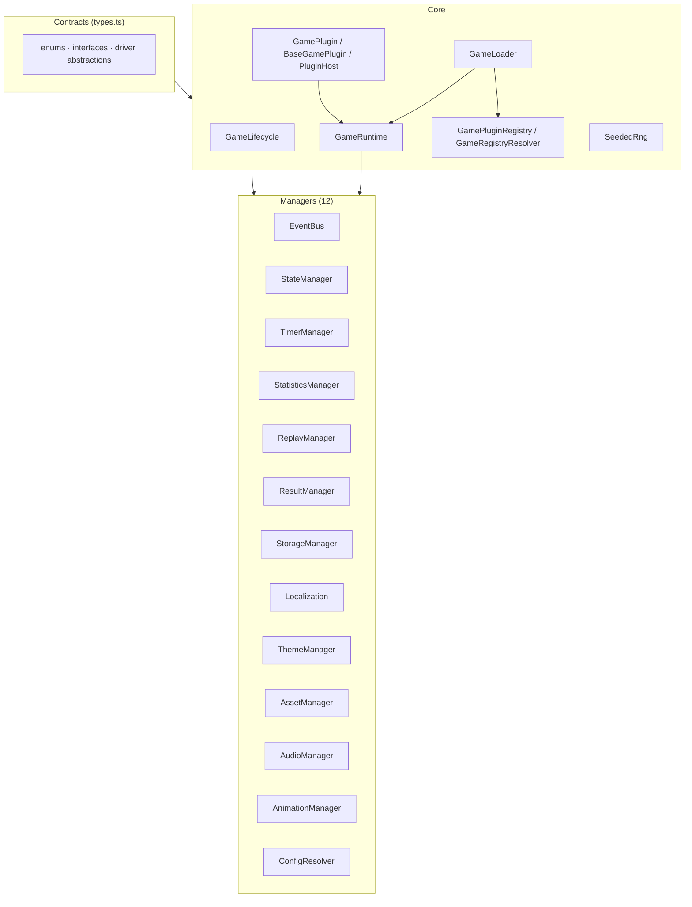

### 3.2 How the pieces relate

| Layer | Members | Role |
| --- | --- | --- |
| **Contracts** | `types.ts` | The isomorphic vocabulary: enums, interfaces, driver abstractions |
| **Core** | `GameRuntime`, `GameLifecycle`, plugin contract, registry, resolver, loader, RNG | The framework that hosts and drives a plugin |
| **Managers** | 12 managers + config resolver | The reusable services a plugin composes |

### 3.3 The dependency direction

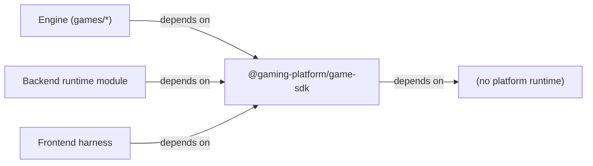

The SDK sits at the bottom of the dependency graph: engines, the backend host, and the frontend harness all depend on it, and it depends on nothing platform-specific. This is why it can be the shared contract across all three tiers — the same `GameContext`, `GameEvent`, and `GameStateSnapshot` types flow from engine to server to browser. See [ADR-019](#27-architecture-decision-records).

### 3.3.1 The SDK / host boundary

A common source of confusion for new engineers is *which* code belongs in the SDK versus the backend runtime module. The line is crisp:

| Concern | SDK (`game-sdk`) | Host (backend `runtime` module) |
| --- | --- | --- |
| Lifecycle, managers, RNG | ✅ owns | consumes |
| Plugin contract | ✅ defines | registers implementations |
| Sessions (Redis records) | — | ✅ owns |
| Persistence (state/replay to DB) | produces snapshots | ✅ owns (Prisma) |
| Networking (WS/REST) | transport-agnostic | ✅ owns (gateway/controller) |
| Provably-fair seed derivation | consumes the seed | ✅ owns (`ProvablyFairService`) |
| Hosting live runtimes | provides `GameRuntime` | ✅ owns the in-memory map |

The mental model: **the SDK is the framework; the host is the deployment.** The SDK knows nothing about NestJS, Redis, PostgreSQL, or Socket.IO — it is pure TypeScript. The host wires the SDK into the platform: it seeds the RNG with provably-fair material, stores sessions in Redis, persists snapshots to PostgreSQL, and streams the event bus over WebSockets. An engine author works almost entirely against the SDK; the host is documented in [GAME_RUNTIME.md](./GAME_RUNTIME.md). This separation is what lets the SDK be unit-tested without any backend and lets the host be tested with mocked services. See [ADR-019](#27-architecture-decision-records).

### 3.4 Build & packaging

The SDK is built with **`tsup`** to dual ESM/CJS output with type declarations, and tested with **`vitest`**. Its `package.json` exports a single entry (`.`) that re-exports everything from `index.ts`. It is consumed as a workspace package (`workspace:*`) by the backend, the frontend, and every engine. See [§4.3](#43-build-configuration).

---

## 4. Package Structure

### 4.1 File layout

```
packages/game-sdk/
├── package.json            # tsup build, vitest test, single "." export
├── tsup.config.ts          # bundler config
├── tsconfig.json
└── src/
    ├── index.ts            # public surface — re-exports everything
    ├── types.ts            # all contracts: enums, interfaces, driver abstractions
    ├── runtime.ts          # GameRuntime (host) + RuntimeDrivers + RUNTIME_EVENTS
    ├── lifecycle.ts        # GameLifecycle state machine + TRANSITIONS
    ├── plugin.ts           # PluginHost, GamePlugin, BaseGamePlugin
    ├── registry.ts         # GamePluginRegistry, GameRegistryResolver, PluginRegistration
    ├── loader.ts           # GameLoader
    ├── rng.ts              # SeededRng, createRng
    ├── rng.spec.ts         # RNG determinism tests
    ├── runtime.spec.ts     # runtime/lifecycle tests
    └── managers/
        ├── event-bus.ts        # GameEventBus
        ├── state-manager.ts    # GameStateManager + structuredCloneSafe
        ├── timer-manager.ts    # GameTimerManager
        ├── statistics-manager.ts # GameStatisticsManager
        ├── replay-manager.ts   # GameReplayManager
        ├── result-manager.ts   # GameResultManager
        ├── storage-manager.ts  # GameStorageManager + MemoryStorageDriver
        ├── localization.ts     # GameLocalization
        ├── theme-manager.ts    # GameThemeManager
        ├── asset-manager.ts    # GameAssetManager
        ├── audio-manager.ts    # GameAudioManager + NoopAudioDriver
        ├── animation-manager.ts # GameAnimationManager + TimerAnimationScheduler + easings
        └── config-resolver.ts  # GameConfigResolver + deepMerge
```

### 4.2 The public surface (`index.ts`)

`index.ts` re-exports the entire public API — types, RNG, lifecycle, plugin, registry, runtime, loader, and all twelve managers. **Everything an engine needs is imported from `@gaming-platform/game-sdk`**; an engine never reaches into a submodule path. The dice engine's imports are the canonical example: `import { BaseGamePlugin, GameGenre, type GameConfig, type GameEvent, type GamePluginMetadata, type PluginRegistration } from '@gaming-platform/game-sdk'`.

### 4.3 Build configuration

| Aspect | Value |
| --- | --- |
| Bundler | `tsup` (`build` = `tsup`, `dev` = `tsup --watch`) |
| Output | ESM (`index.js`) + CJS (`index.cjs`) + types (`index.d.ts`) |
| Module type | `"type": "module"` (ESM-first) |
| Test | `vitest run` |
| Consumed as | `workspace:*` by backend, frontend, engines |

---

## 5. Core SDK Components

### 5.1 Component map

| Component | File | Public export(s) |
| --- | --- | --- |
| Contracts | `types.ts` | `GameLifecycleStatus`, `GameGenre`, `GameMode`, `Logger`, `Rng`, `GameConfig`, `GamePluginMetadata`, `GameContext`, `GameStateSnapshot`, `GameEvent`, `GameResultRecord`, `ReplayFrame`, `StatisticsSnapshot`, asset/audio/animation/storage/theme abstractions |
| Runtime | `runtime.ts` | `GameRuntime`, `RuntimeDrivers`, `RUNTIME_EVENTS` |
| Lifecycle | `lifecycle.ts` | `GameLifecycle`, `LIFECYCLE_EVENT`, `LifecycleChange` |
| Plugin | `plugin.ts` | `PluginHost`, `GamePlugin`, `BaseGamePlugin` |
| Registry | `registry.ts` | `GamePluginRegistry`, `GameRegistryResolver`, `PluginRegistration`, `PluginFactory`, `DynamicPluginLoader`, `AnyGamePlugin` |
| Loader | `loader.ts` | `GameLoader` |
| RNG | `rng.ts` | `SeededRng`, `createRng` |
| Managers | `managers/*` | 12 manager classes + drivers + `deepMerge`, `easings`, `structuredCloneSafe` |

### 5.2 The contract vocabulary (`types.ts`)

The type layer is the SDK's shared language. Key contracts:

| Type | Shape / values | Purpose |
| --- | --- | --- |
| `GameLifecycleStatus` | 12 states (IDLE…DESTROYED, ERROR) | The lifecycle machine's alphabet ([§9](#9-lifecycle-hooks)) |
| `GameGenre` | CARD, ROULETTE, DICE, CRASH, LOTTERY, SPORTS, CUSTOM | Classifies a plugin |
| `GameMode` | `'real' \| 'demo' \| 'replay'` | The session mode |
| `Logger` | debug/info/warn/error | Injectable logging |
| `Rng` | next/int/bool/pick/shuffle/weighted | Deterministic randomness ([§21](#21-deterministic-rng)) |
| `GameConfig` | `{ [key]: unknown }` | Free-form config bag |
| `GamePluginMetadata` | key, name, genre, version, min/max players, capabilities, defaultConfig | Plugin identity ([§8](#8-plugin-registration)) |
| `GameContext` | sessionId, gameId, userId?, mode, locale, currency?, seed, metadata | Per-session runtime context |
| `GameStateSnapshot<T>` | status, version, state, updatedAt | Save/restore unit ([§11](#11-state-management-apis)) |
| `GameEvent<T>` | type, payload, ts, source? | The event envelope ([§10](#10-event-system)) |
| `GameResultRecord` | roundId, outcome, betAmount, winAmount, multiplier?, payload, createdAt | Round result ([§14](#14-statistics-apis)) |
| `ReplayFrame` | seq, ts, type, data | Replay unit ([§13](#13-replay-apis)) |
| `StatisticsSnapshot` | counters, observations | Stats export ([§14](#14-statistics-apis)) |

### 5.2.1 Why the contracts are isomorphic

The `types.ts` header is a design statement: *"Everything here is isomorphic (no Node- or DOM-specific APIs) so the SDK runs on the server (authoritative game engines) and in the browser (runtime harness)."* This is why, for example, `AssetLoader` is `(descriptor) => Promise<unknown>` rather than a DOM-specific `HTMLImageElement` loader, and `AnimationScheduler` is `{ request, cancel, now }` rather than a direct `requestAnimationFrame` reference. The contracts describe *what* a capability does, not *how* a platform provides it. The "how" is supplied by drivers at the edges.

The payoff is that a `GameContext`, a `GameEvent`, and a `GameStateSnapshot` mean exactly the same thing on the server and in the browser — the server produces them authoritatively and the browser consumes them for rendering, with **no translation layer**. The same `GameResultRecord` an engine produces on the server is the shape the frontend types against. This shared vocabulary across tiers is only possible because the contract layer commits to no platform. See [Frontend §9](./FRONTEND_ARCHITECTURE.md#9-api-layer) for how the frontend consumes these types.

### 5.2.2 GameContext — the per-session envelope

`GameContext` deserves special attention because it is what the runtime hands every engine. It carries: `sessionId` and `gameId` (identity), `userId` (owner), `mode` (`real`/`demo`/`replay`), `locale` (for localization), `currency` (for settlement), the **`seed`** (the deterministic material), and a free-form `metadata` bag. The backend builds it from the Redis session record (`buildContext`), so an engine receives a fully-resolved context without knowing anything about Redis, HTTP, or sessions. The `seed` field is the single most important one — it is the engine's source of all randomness, and it is derived server-side from provably-fair material ([§21.3](#213-why-determinism-is-non-negotiable)).

### 5.3 The core runtime trio

- **`GameRuntime`** hosts a plugin, owns every manager, implements `PluginHost`, and drives the lifecycle. Documented in [§7](#7-gameruntime-integration).
- **`GameLifecycle`** enforces the state-transition graph. Documented in [§9](#9-lifecycle-hooks) and [GAME_RUNTIME §5](./GAME_RUNTIME.md#5-runtime-lifecycle).
- **`GameLoader`** resolves a plugin by key and constructs a runtime around it. Documented in [§8.4](#84-loading-a-plugin).

### 5.4 The manager set

The twelve managers (plus the config resolver) are the reusable services a plugin composes through the host:

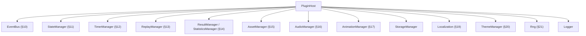

Each manager is documented in its dedicated section (11–20) with its full public API, and summarized in the [SDK Reference](#30-sdk-reference).

---

## 6. BaseGamePlugin

`BaseGamePlugin` is the abstract class most engines extend. It implements the entire `GamePlugin` contract in terms of overridable protected hooks, so a concrete engine writes only its genre gameplay.

### 6.1 The class shape

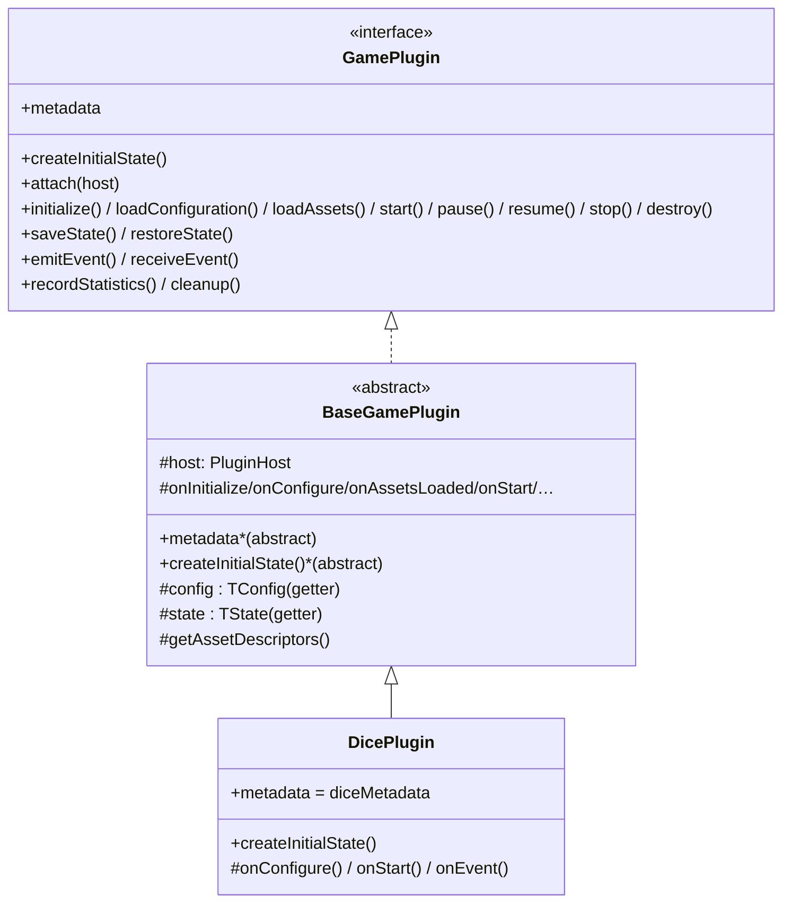

### 6.2 What an engine must provide

An engine subclass declares only two things as required, plus any hooks it needs:

| Required member | Purpose |
| --- | --- |
| `metadata` | The `GamePluginMetadata` (key, genre, config, players, capabilities) |
| `createInitialState()` | The typed initial state for the state manager |

Everything else (`initialize`, `loadConfiguration`, `loadAssets`, `start`, `pause`, `resume`, `stop`, `destroy`, `saveState`, `restoreState`, `emitEvent`, `receiveEvent`, `recordStatistics`, `cleanup`) is **implemented by the base class** in terms of hooks.

### 6.3 The convenience getters

`BaseGamePlugin` provides two protected getters so engine code reads cleanly:

| Getter | Returns | Backed by |
| --- | --- | --- |
| `this.config` | `TConfig` | `this.host.config` |
| `this.state` | `TState` | `this.host.state.get()` |

The dice plugin uses these throughout: `this.config.variant`, `this.state.round`. They keep the sandbox visible (everything routes through `host`) while making the engine ergonomic.

### 6.4 Cross-cutting behavior the base class guarantees

The base class wires cross-cutting behavior so **no engine can forget it**:

| Method | Automatic behavior |
| --- | --- |
| `emitEvent(type, payload)` | Emits on the bus **and** records a `ReplayFrame` |
| `pause()` / `resume()` | Pauses/resumes replay recording (then calls `onPause`/`onResume`) |
| `loadAssets()` | Registers `getAssetDescriptors()` + preloads with progress, then `onAssetsLoaded()` |
| `destroy()` | Calls `onDestroy()` then `cleanup()` |
| `cleanup()` | Clears timers, stops animation, stops all audio, then `onCleanup()` |
| `restoreState(snapshot)` | Restores the state manager first, then `onRestore(snapshot)` |

**Why this matters:** replay fidelity and resource cleanup are guaranteed by the *base class*, not by engine discipline. An engine that emits an event automatically records a replay frame; an engine that is destroyed automatically has its timers and loops cleaned up. This is the single most valuable reuse mechanism in the SDK. See [ADR-015](#27-architecture-decision-records).

### 6.5 The canonical example — `DicePlugin`

The dice engine is the reference implementation. Its structure is exactly what a new engine should follow:

| Element | In `DicePlugin` |
| --- | --- |
| Generic params | `extends BaseGamePlugin<DiceEngineConfig, DiceEngineState>` |
| `metadata` | `diceMetadata` (`key: 'dice-engine'`, genre DICE, players 1–8, capabilities, `defaultConfig`) |
| `createInitialState()` | returns the typed `DiceEngineState` |
| `onConfigure()` | resolves the ruleset from `this.config.variant` + overrides; updates state |
| `onStart()` | `emitEvent('dice:ready', …)` announcing the table |
| `onEvent(event)` | handles `dice:roll` → runs the pure `DiceEngine` |
| Result hand-off | `this.host.results.record({...})`, `statistics.increment/observe`, `replay.record`, `state.update`, `emitEvent('dice:result', …)` |
| Factory + registration | `createDicePlugin()` and `diceRegistration: PluginRegistration` |

Critically, the plugin composes managers through the host and keeps the **pure engine** (`DiceEngine`) separate — the plugin is the thin SDK shell; the engine is the game logic. It also demonstrates the **per-round seed** pattern: `new DiceEngine(this.ruleset, \`${this.host.context.seed}:${round}\`)`, deriving a per-round seed from the session seed + round number (a nonce) so every round is independently deterministic and verifiable.

### 6.6 Annotated walkthrough of a roll

To make the SDK usage concrete, here is what happens inside `DicePlugin` when a `dice:roll` action arrives, annotated with the SDK APIs each step uses:

```mermaid
sequenceDiagram
    autonumber
    participant RT as Runtime
    participant DP as DicePlugin
    participant DE as DiceEngine (pure)
    participant H as PluginHost (managers)
    RT->>DP: receiveEvent({ type: 'dice:roll', payload })
    DP->>DP: onEvent → handleRoll(bets)
    DP->>DP: round = this.state.round + 1
    DP->>DE: new DiceEngine(ruleset, `${host.context.seed}:${round}`)
    DP->>DE: engine.roll(`${host.context.sessionId}:${round}`, bets)
    DE-->>DP: DiceRoundResult (deterministic)
    DP->>H: host.results.record({ roundId, outcome, betAmount, winAmount, multiplier, payload })
    DP->>H: host.statistics.increment('rounds') + observe('total', total)
    DP->>H: host.replay.record('dice:roll', { roundId, values, seed })
    DP->>H: host.state.update(draft => { phase='settled'; round; lastResult; history })
    DP->>DP: emitEvent('dice:result', result) → bus + auto replay frame
```

Every SDK touchpoint is visible: the **seed** comes from `host.context`, the **result** goes to `host.results` (validated), **stats** to `host.statistics`, an explicit **replay frame** to `host.replay`, **state** through `host.state.update` (versioned + cloned), and the outcome is broadcast via `emitEvent` (which the gateway streams and which auto-records a second replay frame). This one method is a complete tour of the SDK's engine-facing API — and it contains no lifecycle, networking, persistence, or money code, because the SDK and host own all of that.

### 6.7 The generic type parameters

`BaseGamePlugin<TConfig, TState>` is generic over the engine's config and state types, which flow through the whole plugin: `this.config` is typed `TConfig`, `this.state` is typed `TState`, `createInitialState()` returns `TState`, and `host.state` is a `GameStateManager<TState>`. This gives an engine author **full type safety** over their own config and state without any casting — the dice plugin's `DiceEngineConfig` and `DiceEngineState` are checked end to end. This is why the SDK is written in strict TypeScript: the generics turn "did I spell that state field right?" into a compile error, which matters for a money-adjacent system.

---

## 7. GameRuntime Integration

The `GameRuntime` is what hosts a plugin. An engine author rarely constructs it directly (the backend `GameLoader` does), but understanding it is essential because it *is* the `PluginHost` an engine talks to.

### 7.1 The PluginHost contract

`PluginHost<TState>` is *"everything a plugin is given by the runtime."* A plugin operates exclusively through it — this is the sandbox boundary.

| Host member | Type | What the engine uses it for |
| --- | --- | --- |
| `context` | `GameContext` | sessionId, userId, mode, locale, **seed**, metadata |
| `config` | `GameConfig` | the resolved effective config |
| `rng` | `Rng` | all randomness ([§21](#21-deterministic-rng)) |
| `bus` | `GameEventBus` | publish/subscribe ([§10](#10-event-system)) |
| `state` | `GameStateManager<TState>` | game state ([§11](#11-state-management-apis)) |
| `timers` | `GameTimerManager` | timers ([§12](#12-timer-apis)) |
| `statistics` | `GameStatisticsManager` | live stats ([§14](#14-statistics-apis)) |
| `replay` | `GameReplayManager` | replay frames ([§13](#13-replay-apis)) |
| `results` | `GameResultManager` | round results ([§14](#14-statistics-apis)) |
| `storage` | `GameStorageManager` | kv persistence |
| `localization` | `GameLocalization` | i18n ([§19](#19-localization-apis)) |
| `theme` | `GameThemeManager` | tokens ([§20](#20-theme-apis)) |
| `assets` | `GameAssetManager` | preloading ([§15](#15-asset-apis)) |
| `audio` | `GameAudioManager` | sound ([§16](#16-audio-apis)) |
| `animation` | `GameAnimationManager` | frame loop ([§17](#17-animation-apis)) |
| `logger` | `Logger` | logging |

### 7.2 How the runtime constructs the host

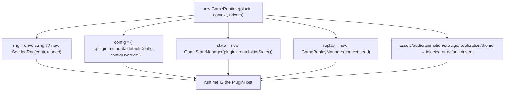

The constructor is where "isomorphic + driver-injected" becomes concrete: each manager gets its injected driver or a headless default, the RNG is seeded from the context, and the config is the plugin defaults merged with any override. The runtime then *is* the `PluginHost` passed to the plugin via `attach(this)`.

### 7.3 RuntimeDrivers — the injection surface

`RuntimeDrivers` is the optional bag of injectables passed at construction:

| Driver | Default (server) | Injected (browser) |
| --- | --- | --- |
| `rng` | `SeededRng(context.seed)` | (usually default — determinism) |
| `assetLoader` | passthrough | DOM loader |
| `audioDriver` | `NoopAudioDriver` | Web Audio driver |
| `animationScheduler` | `TimerAnimationScheduler` | `requestAnimationFrame` |
| `storageDriver` | `MemoryStorageDriver` | localStorage driver |
| `logger` | console logger | winston bridge (server host) |
| `locales` | — | locale dictionaries |
| `themes` | default theme | game themes |
| `configOverride` | — | session/operator overrides |

### 7.3.1 The sandbox in practice

The `PluginHost` sandbox is not a security theater — it is a real, enforced boundary with concrete consequences. Consider what an engine *cannot* do because it only has the host:

| An engine cannot… | Because… | So instead it… |
| --- | --- | --- |
| Open a WebSocket or HTTP call | the host exposes no network | emits events; the gateway streams them |
| Write to the database | the host exposes no DB | produces results; the host persists them |
| Move money | the host exposes no wallet | records a result; the host settles via the bridge |
| Construct a second RNG with a random seed | it uses `host.rng` (seeded) | stays deterministic |
| Leak a timer | it uses `host.timers` (tracked) | is cleaned up on destroy |
| Read another session's state | it only has its own `host` | stays isolated |

This containment is what makes it safe to add a new engine: the worst a buggy or even malicious engine can do is misbehave *within* the services the host grants — produce a wrong result (which the validated host→bridge→wallet chain still settles safely), emit spurious events (isolated per session), or throw (caught by the lifecycle's `fail`). It cannot escalate to the network, the database, or another player's session. This is the SDK-level realization of the platform's server-authoritative security model ([GAME_RUNTIME §15](./GAME_RUNTIME.md#15-runtime-security)).

### 7.4 The runtime's public methods (from the engine's view)

The runtime drives the plugin's lifecycle and relays actions. An engine mostly cares about which of its hooks each method triggers ([§9](#9-lifecycle-hooks)); the backend host calls these methods. Full method behavior is in [GAME_RUNTIME §4.2](./GAME_RUNTIME.md#42-gameruntime--the-host).

---

## 8. Plugin Registration

Registration is how the platform discovers and instantiates an engine. It is entirely data-driven: an engine exports a `PluginRegistration`, and the backend registers it.

### 8.1 The registration contract

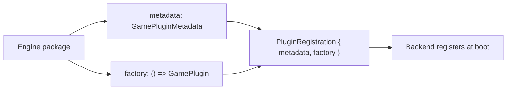

| Type | Definition |
| --- | --- |
| `PluginFactory` | `() => AnyGamePlugin` — creates a fresh plugin instance |
| `PluginRegistration` | `{ metadata: GamePluginMetadata, factory: PluginFactory }` |
| `DynamicPluginLoader` | `() => Promise<PluginRegistration>` — a code-split loader |
| `AnyGamePlugin` | `GamePlugin<any>` — type-erased storage form |

The dice engine exports exactly this: `export const diceRegistration: PluginRegistration = { metadata: diceMetadata, factory: createDicePlugin }`. A **fresh instance per factory call** is important — each session gets its own plugin instance, so no state leaks between sessions.

### 8.2 The registry

`GamePluginRegistry` is an in-memory `Map` keyed by plugin key:

| Method | Purpose |
| --- | --- |
| `register(registration)` | Add a registration |
| `registerPlugin(metadata, factory)` | Convenience registration |
| `has(key)` | Is a key registered? |
| `get(key)` | Get a registration |
| `list()` | All metadata |
| `create(key)` | Instantiate a plugin (throws if unknown) |

### 8.3 The resolver

`GameRegistryResolver` resolves a `PluginFactory` by key, supporting both static and dynamic plugins:

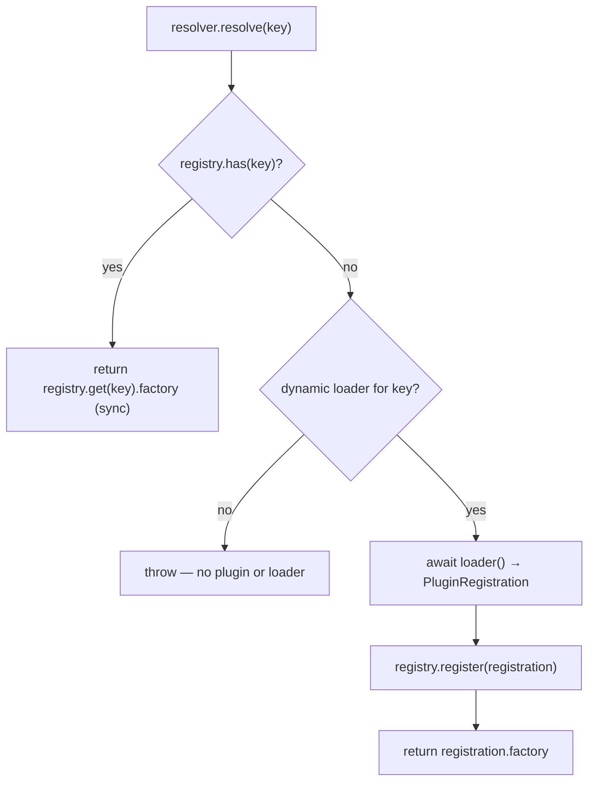

Static plugins (the six registered at boot) resolve **synchronously**; unknown keys fall back to a registered **dynamic loader** (a code-split `import()`) that self-registers on first use. This is the seam for lazy engine loading without platform changes. See [ADR-018](#27-architecture-decision-records).

### 8.4 Loading a plugin

`GameLoader` ties resolution to runtime construction:

| Method | Behavior |
| --- | --- |
| `load(key, context, drivers)` | resolve factory → instantiate plugin → `new GameRuntime(plugin, context, drivers)` |
| `loadAndInitialize(key, context, drivers)` | `load(...)` then `runtime.initialize()` (ends in READY) |

The backend `ActiveRuntimeService` uses `GameLoader` with the registry's resolver to host live runtimes ([GAME_RUNTIME §4.2](./GAME_RUNTIME.md#42-gameruntime--the-host)).

### 8.5 The registration lifecycle end-to-end

```mermaid
sequenceDiagram
    autonumber
    participant ENG as Engine package
    participant BE as RuntimePluginRegistryService (backend)
    participant REG as GamePluginRegistry
    participant RES as GameRegistryResolver
    participant LD as GameLoader
    ENG->>BE: export diceRegistration { metadata, factory }
    BE->>BE: validate(registration) at boot
    BE->>REG: register(registration)
    BE->>RES: new GameRegistryResolver(registry)
    Note over LD: at play time
    LD->>RES: resolve('dice-engine')
    RES-->>LD: factory
    LD->>LD: factory() → DicePlugin; new GameRuntime(...)
```

---

## 9. Lifecycle Hooks

The lifecycle is the ordered sequence of phases a runtime moves through; an engine plugs its gameplay into **hooks** at each phase.

### 9.1 The lifecycle phases and their hooks

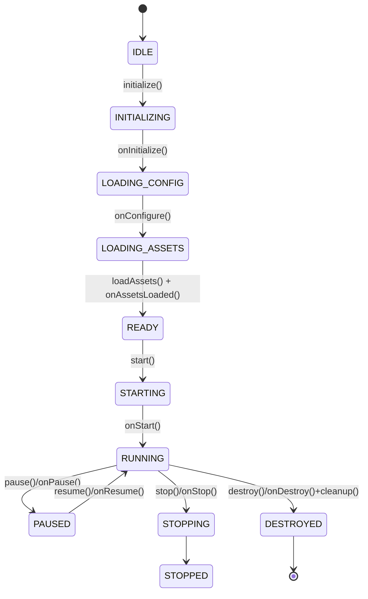

### 9.2 The complete hook table

| Hook | Called during | Default | Typical engine use |
| --- | --- | --- | --- |
| `getAssetDescriptors()` | `loadAssets` | `[]` | Declare assets to preload |
| `onInitialize()` | `initialize` | no-op | One-time setup |
| `onConfigure()` | `loadConfiguration` | no-op | Resolve config → internal model (dice resolves its ruleset here) |
| `onAssetsLoaded()` | `loadAssets` | no-op | Post-preload wiring |
| `onStart()` | `start` | no-op | Announce readiness, kick off the first round (dice emits `dice:ready`) |
| `onPause()` | `pause` | no-op | Suspend timers/animation |
| `onResume()` | `resume` | no-op | Resume |
| `onStop()` | `stop` | no-op | Graceful halt |
| `onDestroy()` | `destroy` | no-op | Final teardown before cleanup |
| `onRestore(snapshot)` | `restoreState` | no-op | React to a restored snapshot |
| `onEvent(event)` | `receiveEvent` | no-op | Handle player actions (dice handles `dice:roll`) |
| `onRecordStatistics()` | `recordStatistics` | no-op | Emit end-of-session stats |
| `onCleanup()` | `cleanup` | no-op | Release engine-specific resources |

### 9.3 Why hooks, not method overrides

An engine overrides `onStart()`, **not** `start()`. This is deliberate: `start()` (in the base class) does cross-cutting work (transitions, event emission) and *then* calls `onStart()`. If an engine overrode `start()` directly, it would have to re-implement — and could forget — that cross-cutting behavior. Hooks let the engine inject genre logic at the right point while the framework guarantees the surrounding behavior. See [ADR-015](#27-architecture-decision-records).

### 9.4 A worked hook sequence (dice)

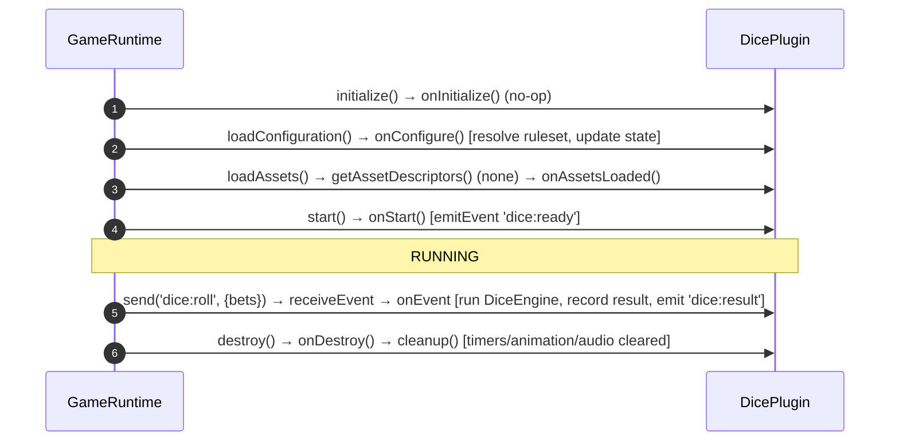

The dice plugin overrides exactly three hooks (`onConfigure`, `onStart`, `onEvent`) and inherits everything else — the minimal footprint the hook model enables.

---

## 10. Event System

`GameEventBus` is the SDK's in-memory publish/subscribe bus — the nervous system connecting managers, the plugin, and (via the runtime) the network.

### 10.1 The GameEvent envelope

Every event is `GameEvent<TPayload>`: `{ type: string, payload: TPayload, ts: number, source?: string }`. `ts` is stamped at emit; `source` identifies the emitter (e.g. the plugin key, `'runtime'`, `'player'`, `'lifecycle'`).

### 10.2 The bus API

| Method | Signature | Purpose |
| --- | --- | --- |
| `on` | `on<T>(type, handler): () => void` | Subscribe; returns unsubscribe |
| `once` | `once<T>(type, handler): () => void` | One-shot subscription |
| `off` | `off<T>(type, handler): void` | Unsubscribe |
| `onAny` | `onAny(handler): () => void` | Subscribe to **every** event |
| `emit` | `emit<T>(type, payload, source?): GameEvent<T>` | Publish; returns the event |
| `listenerCount` | `listenerCount(type?): number` | Diagnostics |
| `clear` | `clear(): void` | Remove all handlers (on destroy) |

### 10.3 Handler isolation

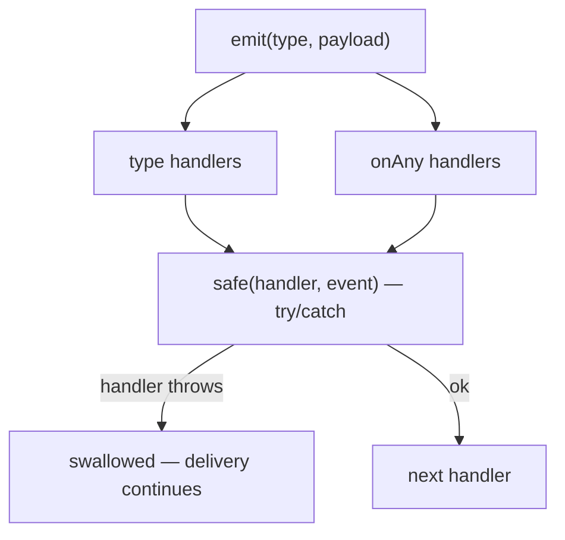

Every delivery goes through a private `safe()` wrapper: *"Isolated: a faulty subscriber must not break event delivery."* One throwing handler never prevents the event from reaching the others — including the gateway that streams to the client. See [ADR-005](#27-architecture-decision-records).

### 10.4 Event flow through the platform

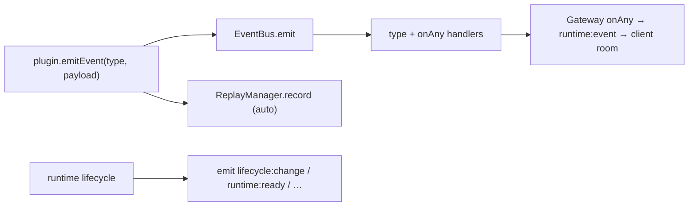

The gateway subscribes with `onAny` so **every** engine event is streamed to the client; `emitEvent` simultaneously records a replay frame, keeping the event stream and replay log consistent by construction. See [GAME_RUNTIME §9](./GAME_RUNTIME.md#9-event-system).

### 10.5 Ordering & determinism

Delivery is **synchronous, in subscription order**, within a single `emit`. Because the authoritative runtime is single-threaded, an action is fully processed (all its events delivered, all frames recorded) before the next begins — giving a **total order** of events per session, which is exactly what replay needs. See [GAME_RUNTIME §9.5](./GAME_RUNTIME.md#95-why-synchronous-single-threaded-delivery-matters).

### 10.6 Event naming conventions

Events are the engine's public interface to the client and the replay log, so naming them consistently matters. The convention across engines is `<genre>:<noun-or-verb>`:

| Event | Direction | Purpose |
| --- | --- | --- |
| `dice:ready` | engine → client | Announce the table (config, bets, limits) on start |
| `dice:roll` | client → engine | A player action (handled in `onEvent`) |
| `dice:result` | engine → client | The settled outcome |
| `runtime:*` | runtime → all | Framework events (`ready`, `started`, `stopped`, `error`, `asset-progress`) |
| `lifecycle:change` | lifecycle → all | `{ from, to }` transitions |

The reserved prefixes `runtime:` and `lifecycle:` belong to the SDK; an engine uses its own genre prefix. Inbound actions (client → engine) and outbound notifications (engine → client) share the namespace but are distinguished by direction and by which side emits them. Keeping names stable is important because they appear in the **replay log** and are consumed by the **client harness** — renaming an event is a breaking change to both. A new engine should document its event vocabulary as part of its public API.

### 10.7 The two ways an engine receives input

An engine gets input through exactly two channels, both mediated by the SDK:

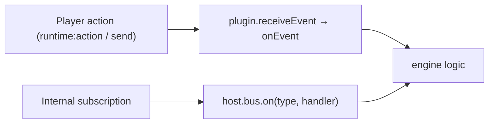

Most gameplay input arrives as a **player action** — the host calls `runtime.send(type, payload)`, which invokes `plugin.receiveEvent` → the `onEvent` hook. An engine may *also* subscribe to specific events via `host.bus.on(...)` if it needs to react to another manager's or the lifecycle's events. The dice plugin uses only `onEvent` (handling `dice:roll`), which is the common case. This dual model — a primary action hook plus optional bus subscriptions — covers both request/response gameplay and reactive gameplay without additional machinery.

---

## 11. State Management APIs

`GameStateManager<TState>` holds the authoritative, versioned game state.

### 11.1 The API

| Method | Signature | Effect |
| --- | --- | --- |
| `get` | `get(): Readonly<TState>` | Current state (read-only) |
| `getVersion` | `getVersion(): number` | Current version |
| `setStatus` | `setStatus(status)` | Record lifecycle status (for snapshots) |
| `set` | `set(next: TState)` | Replace state; version++ |
| `patch` | `patch(partial: Partial<TState>)` | Shallow-merge; version++ |
| `update` | `update(mutator: (draft) => void)` | Clone → mutate draft → commit; version++ |
| `snapshot` | `snapshot(): GameStateSnapshot<TState>` | `{ status, version, state (cloned), updatedAt }` |
| `restore` | `restore(snapshot)` | Replace state/version/status/updatedAt |
| `reset` | `reset()` | Back to the initial state |
| `subscribe` | `subscribe(fn): () => void` | React to changes |

### 11.2 Versioning & notification

Every mutating method (`set`, `patch`, `update`) calls a private `touch()` that increments `version`, updates `updatedAt`, and notifies subscribers. This means **all** state changes are observable uniformly regardless of which method the engine used — the basis for save-state and reactive UI.

### 11.3 Immutability via structuredCloneSafe

`snapshot`, `restore`, `reset`, and `update` all use `structuredCloneSafe` (a `structuredClone` with a `JSON.parse(JSON.stringify(...))` fallback). This guarantees:

- A snapshot is **independent** of live state — a later mutation cannot retroactively change a saved snapshot.
- `update` operates on a **draft clone**, so a throwing mutator cannot leave state half-mutated.

### 11.4 The three mutation patterns

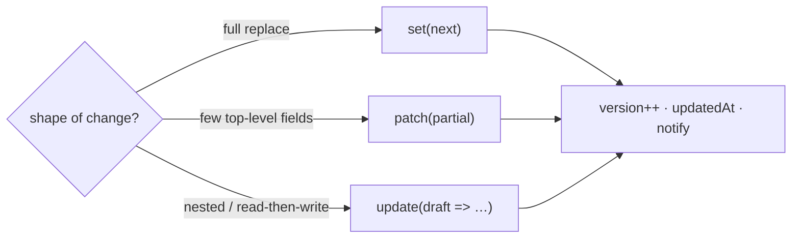

The dice plugin uses `update` for nested mutations: `this.host.state.update((draft) => { draft.phase = 'settled'; draft.round = round; draft.history = [entry, ...draft.history].slice(0, 20); })`. **Golden rule:** never mutate the object returned by `get()` — it's `Readonly<TState>`; use `update()` for in-place-style edits so versioning and cloning are preserved. See [GAME_RUNTIME §8.6](./GAME_RUNTIME.md#86-state-mutation-patterns).

### 11.4.1 The state flow end to end

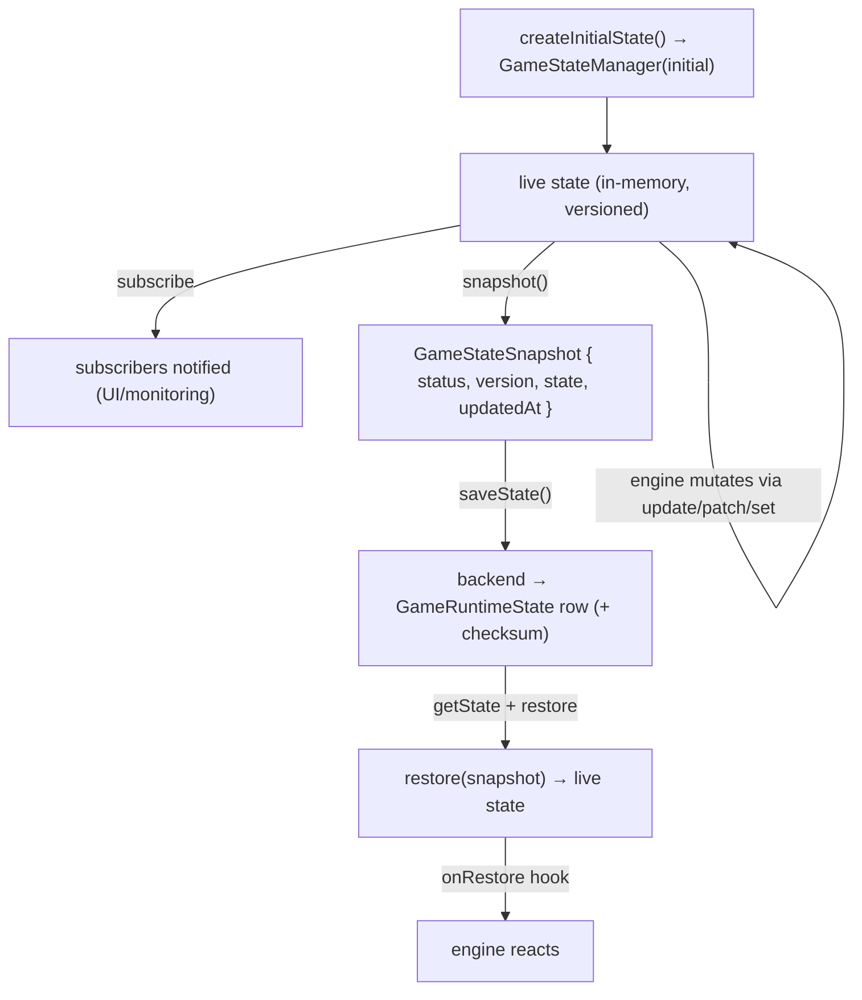

The lifecycle of state is: **created** from `createInitialState()`, **evolved** in memory through versioned mutations, **observed** by subscribers, **snapshotted** for persistence, and **restored** on recovery. Every stage preserves independence via cloning, so a snapshot taken at version 5 is unaffected by a mutation that advances the live state to version 6. This is what makes mid-round recovery ([GAME_RUNTIME §17.4.1](./GAME_RUNTIME.md#1741-worked-recovery-a-node-restart-mid-session)) exact rather than approximate.

### 11.5 Snapshots feed persistence

`saveState()` (on the plugin) returns `state.snapshot()`; the backend persists it as a `GameRuntimeState` row with a checksum ([Database §13.3](./DATABASE_ARCHITECTURE.md#133-runtime-state--replay)). The `version` field doubles as an optimistic-concurrency marker for persisted state.

---

## 12. Timer APIs

`GameTimerManager` tracks every timer the engine schedules so they can be cleared deterministically — the SDK's answer to timer leaks.

### 12.1 The API

| Method | Signature | Purpose |
| --- | --- | --- |
| `setTimeout` | `setTimeout(cb, ms): TimeoutHandle` | Tracked timeout (self-removes on fire) |
| `setInterval` | `setInterval(cb, ms): IntervalHandle` | Tracked interval |
| `clearTimeout` | `clearTimeout(handle)` | Cancel + untrack |
| `clearInterval` | `clearInterval(handle)` | Cancel + untrack |
| `delay` | `delay(ms): Promise<void>` | Cancellable promise delay |
| `clearAll` | `clearAll()` | Cancel every tracked timer |
| `activeCount` | `get activeCount(): number` | Count of live timers (leak detection) |

### 12.2 Why a timer manager

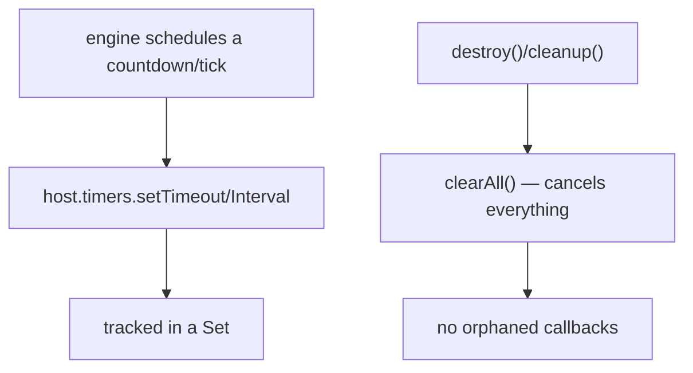

If an engine used raw `setInterval`, a forgotten `clearInterval` would leak a callback for the life of the process — and the platform runs many short-lived runtimes. The manager tracks handles in `Set`s and `clearAll()` (called by `cleanup()`) cancels them all. `activeCount` is a test hook to assert no leaks after teardown. **Golden rule:** engines schedule via `host.timers`, never raw `setTimeout`/`setInterval`. See [ADR-008](#27-architecture-decision-records).

### 12.3 A timer pattern — a crash-style countdown

Many games need a timed phase — a crash multiplier that rises over time, a betting window that closes, a reveal delay. The pattern using `host.timers`:

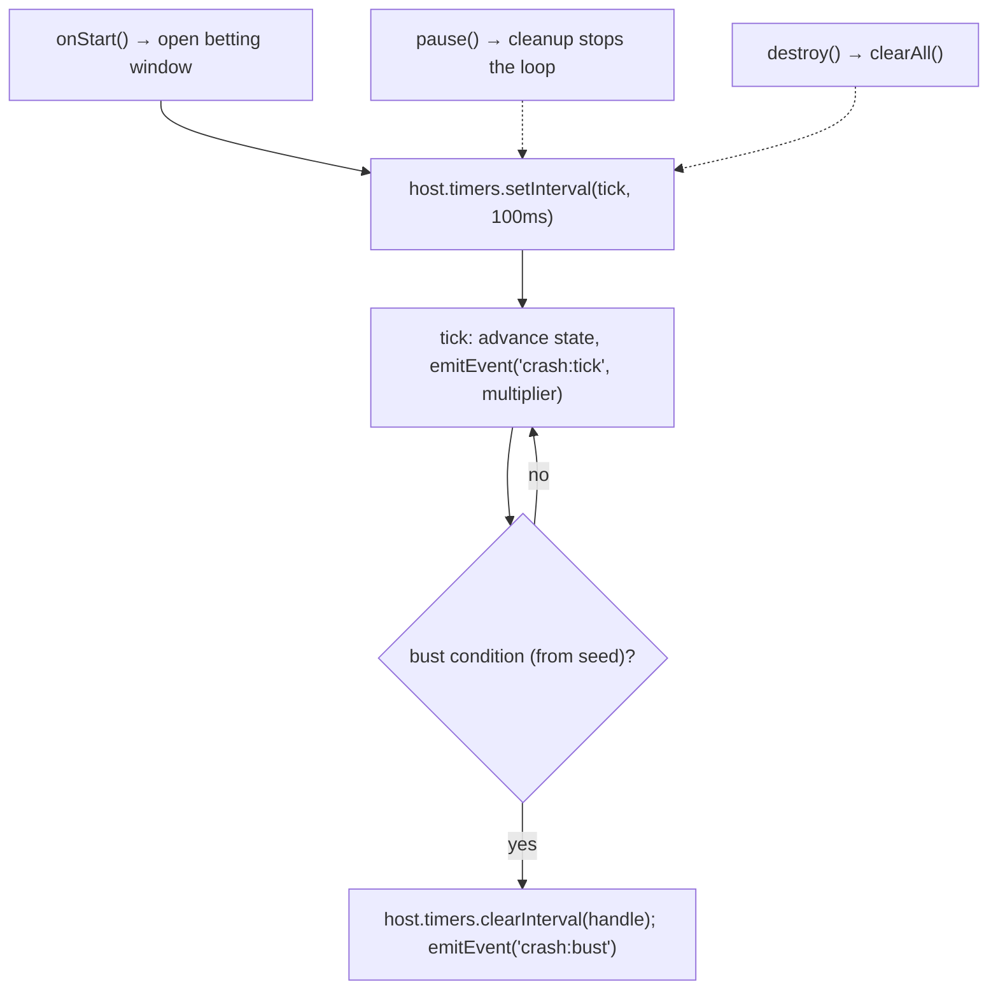

Two properties make this safe: the interval is **tracked**, so `pause()`/`destroy()` cancel it automatically via `cleanup()`; and the bust condition is **derived from the seed**, not wall-clock randomness, so the crash point is deterministic and replayable. `host.timers.delay(ms)` (a cancellable promise) is the async equivalent for a single delay — e.g. `await host.timers.delay(2000)` for a reveal pause that is still cancelled on teardown. The engine never calls raw `setInterval`, so it can never leak a running tick loop after the round ends.

---

## 13. Replay APIs

`GameReplayManager` records the ordered, timestamped frame stream that (with the seed) reconstructs a session.

### 13.1 The API

| Method | Signature | Purpose |
| --- | --- | --- |
| `record` | `record(type, data?): ReplayFrame` | Append a frame `{ seq++, ts, type, data }` |
| `pause` / `resume` | `pause()` / `resume()` | Toggle recording |
| `getFrames` | `getFrames(): readonly ReplayFrame[]` | Read the buffer |
| `serialize` | `serialize(): SerializedReplay` | `{ seed, startedAt, durationMs, frames }` |
| `load` | `load(replay)` | Restore frames for playback |
| `clear` | `clear()` | Reset the buffer |
| `frameCount` | `get frameCount(): number` | Frame count |

### 13.2 Automatic recording

```mermaid
flowchart LR
    EMIT["plugin.emitEvent(type, payload)"] --> BASE["BaseGamePlugin.emitEvent"]
    BASE --> BUS["bus.emit"]
    BASE --> REC["replay.record(type, { payload })"]
    REC --> BUF["frame buffer"]
```

`BaseGamePlugin.emitEvent` records a frame on **every** emitted event, so the replay log faithfully mirrors the event stream without extra engine code. Recording pauses with the lifecycle (`pause()` sets `recording = false`), so paused time doesn't pollute the frame log. Engines may also record explicit frames (the dice plugin records a `dice:roll` frame with the roll's seed).

### 13.3 Serialization & the seed

`serialize()` produces `{ seed, startedAt, durationMs, frames }`. The **seed is the key to reconstruction**: because the RNG is deterministic, re-running the engine with the same seed reproduces outcomes, and the frames supply the exact input ordering. The backend persists this as a `GameReplay` row ([Database §13.3](./DATABASE_ARCHITECTURE.md#133-runtime-state--replay)). See [GAME_RUNTIME §13](./GAME_RUNTIME.md#13-replay-system) for the full replay/verification flow.

### 13.4 The replay flow, end to end

```mermaid
flowchart TD
    subgraph Record["Recording (live)"]
        E["emitEvent(type, payload)"] --> R["replay.record(type, {payload})"]
        R --> B["frame buffer [{ seq, ts, type, data }]"]
    end
    subgraph Persist["Persistence"]
        B --> SER["serialize() → { seed, frames, durationMs }"]
        SER --> ROW["GameReplay row (JsonB frames)"]
    end
    subgraph Verify["Verification / playback"]
        ROW --> LOAD["load(replay)"]
        LOAD --> RNG["new SeededRng(seed) — same sequence"]
        RNG --> RERUN["re-run engine over frames"]
        RERUN --> CMP{"reproduced == recorded?"}
        CMP -->|yes| OK["verified"]
        CMP -->|no| BAD["discrepancy"]
    end
```

The two ingredients — **seed** and **frames** — are each necessary. The seed reproduces all RNG-driven outcomes; the frames reproduce the exact **inputs and their order** (player actions, timing). Neither alone is sufficient: a seed without frames can't know what the player did; frames without a seed can't reproduce the random outcomes those actions triggered. Together they form a complete, self-contained record. This is why the SDK records both automatically, and why a dispute can be resolved from a single `GameReplay` row without touching any other system state. See [ADR-010](#27-architecture-decision-records).

### 13.5 Frame semantics & engine-explicit frames

`BaseGamePlugin.emitEvent` records a frame `{ type, data: { payload } }` for every emitted event, but engines may also record **explicit** frames for data that isn't an event. The dice plugin does this: alongside emitting `dice:result`, it records an explicit `dice:roll` frame carrying `{ roundId, values, seed }` — the per-round seed and the drawn values — so a verifier has the exact material to re-derive that round. The rule of thumb: emit events for things the client should react to; record explicit frames for verification material that must survive in the replay even if it isn't a UI event.

---

## 14. Statistics APIs

Two managers record round outcomes and live aggregates: `GameResultManager` (the settlement source of truth) and `GameStatisticsManager` (live counters/observations).

### 14.1 GameResultManager

| Method | Signature | Purpose |
| --- | --- | --- |
| `record` | `record(input: CreateResultInput): GameResultRecord` | Validate + store a round result |
| `last` | `last(): GameResultRecord \| undefined` | Most recent result |
| `all` | `all(): readonly GameResultRecord[]` | Every result |
| `totals` | `totals(): { rounds, totalBet, totalWin, net }` | Aggregate |
| `clear` | `clear()` | Reset |

`record` **validates**: a non-empty `roundId`, and non-negative numeric `betAmount`/`winAmount` (throws otherwise). This is the single, audited hand-off point to money — *"Results are the settlement source of truth handed to the wallet/ledger by the host."* The dice plugin calls `host.results.record({ roundId, outcome, betAmount, winAmount, multiplier, payload })` after each roll.

### 14.2 GameStatisticsManager

| Method | Signature | Purpose |
| --- | --- | --- |
| `increment` | `increment(key, by=1)` | Bump a counter |
| `observe` | `observe(key, value)` | Record an observation (count/sum/min/max) |
| `getCounter` | `getCounter(key): number` | Read a counter |
| `snapshot` | `snapshot(): StatisticsSnapshot` | `{ counters, observations (with avg) }` |
| `reset` | `reset()` | Clear |

The dice plugin records `statistics.increment('rounds')` and `statistics.observe('total', result.total)` per roll. A `snapshot()` computes `avg = sum / count` for each observation.

### 14.3 The statistics hierarchy

```mermaid
flowchart TD
    LIVE["Live (StatisticsManager, in-memory)"] --> RESULTS["Results (ResultManager)"]
    RESULTS --> PERSIST["GameResult rows (backend)"]
    PERSIST --> PLAYER["PlayerStatistics / GameStatistics"]
    PLAYER --> LB["Leaderboards / Achievements"]
```

Live stats are ephemeral (the manager); durable statistics derive from persisted results ([Database §14](./DATABASE_ARCHITECTURE.md#14-tournament-schema)). Keeping live stats in-memory decouples the engine from the database.

---

## 15. Asset APIs

`GameAssetManager` registers and preloads a game's assets with weighted progress reporting, over an injectable `AssetLoader`.

### 15.1 The API

| Method | Signature | Purpose |
| --- | --- | --- |
| `register` | `register(descriptors: AssetDescriptor[])` | Declare assets |
| `has` | `has(id): boolean` | Is an asset loaded? |
| `get` | `get<T>(id): T \| undefined` | Loaded asset data |
| `progress` | `progress(): AssetProgress` | `{ loaded, total, bytesLoaded, bytesTotal, ratio }` |
| `preloadAll` | `preloadAll(onProgress?): Promise<void>` | Load all, reporting progress |
| `cancel` | `cancel()` | Abort loading |
| `clear` | `clear()` | Drop descriptors + loaded |

### 15.2 The driver model

```mermaid
flowchart LR
    ENG["engine getAssetDescriptors()"] --> REG["assets.register(descriptors)"]
    REG --> PRE["assets.preloadAll(onProgress)"]
    PRE --> LOADER{"AssetLoader"}
    LOADER -->|server| PASS["passthrough — resolves metadata instantly"]
    LOADER -->|browser| DOM["DOM loader — fetches real bytes"]
    PRE --> PROG["progress → RUNTIME_EVENTS.ASSET_PROGRESS"]
```

An `AssetDescriptor` is `{ id, type, url, size? }` where `type` is `'image' | 'audio' | 'video' | 'json' | 'font' | 'spritesheet'`. On the server the default **passthrough loader** resolves metadata only (no bytes), so the LOADING_ASSETS phase runs instantly headlessly; the browser harness injects a real DOM loader. Progress is **byte-weighted** (using each descriptor's `size`, defaulting to 1), so the loading UI is smooth even with mixed asset sizes. See [ADR-002](#27-architecture-decision-records).

---

## 16. Audio APIs

`GameAudioManager` is the sound facade over an injectable `AudioDriver` (`NoopAudioDriver` on the server, Web Audio in the browser).

### 16.1 The API

| Method | Signature | Purpose |
| --- | --- | --- |
| `load` | `load(id, url): Promise<void>` | Preload a sound |
| `play` | `play(id, { loop?, volume? })` | Play (no-op if muted) |
| `stop` / `stopAll` | `stop(id)` / `stopAll()` | Stop one / all |
| `setVolume` | `setVolume(v)` | Master volume (clamped 0–1) |
| `getVolume` | `getVolume(): number` | Read volume |
| `setMuted` | `setMuted(m)` | Mute (stops all when muting) |
| `toggleMute` | `toggleMute(): boolean` | Flip mute, return new state |
| `isMuted` | `isMuted(): boolean` | Read mute |
| `dispose` | `dispose()` | Release the driver |

### 16.2 Why no-op by default

The `NoopAudioDriver` makes audio a **no-op on the server** — the authoritative engine computes outcomes and must not do audio work. The manager still tracks `masterVolume`/`muted` state so the UI controls stay in sync when a real driver is injected. `cleanup()` calls `stopAll()`, so a destroyed runtime is silent. The `AudioDriver` interface (`load/play/stop/stopAll/setMasterVolume/setMuted/dispose`) is what the browser harness implements with Web Audio.

---

## 17. Animation APIs

`GameAnimationManager` drives the per-frame update loop and provides tweens, over an injectable `AnimationScheduler`.

### 17.1 The API

| Method | Signature | Purpose |
| --- | --- | --- |
| `start` | `start(onFrame: (deltaMs) => void)` | Begin the frame loop |
| `stop` | `stop()` | Cancel the loop |
| `isRunning` | `isRunning(): boolean` | Loop state |
| `tween` | `tween({ from, to, durationMs, onUpdate, easing? }): Promise<void>` | Animate a value |

### 17.2 The scheduler & easings

```mermaid
flowchart LR
    START["animation.start(onFrame)"] --> SCHED{"AnimationScheduler"}
    SCHED -->|server default| TIMER["TimerAnimationScheduler (~60fps setTimeout)"]
    SCHED -->|browser| RAF["requestAnimationFrame"]
    START --> LOOP["tick loop: onFrame(deltaMs)"]
    TWEEN["tween(from→to, easing)"] --> UPDATE["onUpdate(value) per frame → resolves at t=1"]
```

The `AnimationScheduler` interface is `{ request(cb), cancel(handle), now() }`. The default `TimerAnimationScheduler` uses a ~16ms `setTimeout` so engine logic is testable headlessly; the browser injects a `requestAnimationFrame` scheduler. The SDK ships easing functions — `linear`, `easeInQuad`, `easeOutQuad`, `easeInOutCubic` — for tweens. `cleanup()` calls `animation.stop()`, so no loop survives teardown.

### 17.3 Where animation belongs — authority vs. presentation

A subtle but important point: on the **server**, animation is almost always irrelevant. The authoritative engine computes *outcomes* (the dice landed on 4-3-6), not *animations* (how the dice tumbled). Animation is a **presentation** concern that runs in the browser harness. So why does the SDK include an animation manager at all?

Because the SDK is isomorphic and the *same* engine code runs in both places. On the server, the `TimerAnimationScheduler` default makes any animation calls cheap no-op-adjacent ticks (they run, but nothing renders), so the engine's logic executes correctly headlessly. In the browser, the harness injects a `requestAnimationFrame` scheduler and the same tween calls drive real visual motion. The determinism guarantee still holds because **outcomes are seed-derived, not animation-derived** — the animation is a visual interpolation *toward* an already-decided outcome. A dice engine computes the result from the seed, emits it, and the client tweens the dice into that position; the tween's duration or easing never changes the result.

```mermaid
flowchart LR
    SEED["seed → outcome (authoritative)"] --> EMIT["emitEvent('dice:result')"]
    EMIT --> CLIENT["client harness"]
    CLIENT --> TWEEN["animation.tween(dice → final position)"]
    TWEEN --> RENDER["visual only — never changes the outcome"]
```

This is the clean division the isomorphic design buys: **the server decides, the client animates.** The animation manager exists so engine code that references animation is valid on both sides, with the driver determining whether it renders. The same reasoning applies to the audio manager (`NoopAudioDriver` on the server) — sound is presentation, so it's a no-op where there is no user, and real where there is.

### 17.4 Frame-loop vs. tween

The manager offers two modes: a **continuous frame loop** (`start(onFrame)` → `stop()`) for ongoing motion (a rising crash multiplier's visual), and a **one-shot tween** (`tween({ from, to, durationMs, onUpdate, easing })`) that resolves a promise when complete (a card flip, a wheel settling). Both go through the injected scheduler, so both are testable headlessly and both are torn down by `stop()`/`cleanup()`. An engine chooses the frame loop for indefinite animation and the tween for a bounded transition — but again, only the presentation tier actually renders either.

---

## 18. Configuration APIs

`GameConfigResolver` resolves the effective game configuration by layering overrides on plugin defaults.

### 18.1 The API

| Member | Signature | Purpose |
| --- | --- | --- |
| `GameConfigResolver<T>` | `new (defaults: T, validator?)` | Construct with defaults + optional validator |
| `resolve` | `resolve(...overrides): T` | Deep-merge overrides onto defaults, then validate |
| `deepMerge` | `deepMerge(base, override): T` | The merge primitive (exported) |

### 18.2 Merge semantics

```mermaid
flowchart LR
    DEF["plugin defaultConfig"] --> MERGE["deepMerge"]
    OV1["operator override"] --> MERGE
    OV2["session override"] --> MERGE
    MERGE --> VAL{"validator?"}
    VAL -->|yes| CHECK["validate → typed config"]
    VAL -->|no| OUT["merged config"]
    CHECK --> OUT
```

`deepMerge` merges objects recursively but **replaces** scalars and arrays: `isPlainObject(current) && isPlainObject(value)` recurses, otherwise the override wins; `undefined` values are skipped. This gives predictable layering — a session can override a nested rule without clobbering sibling rules, but replacing an array (e.g. a bet board) fully replaces it. The runtime itself uses a simpler `{ ...defaultConfig, ...configOverride }` for the top-level merge; `GameConfigResolver` is available for engines that need layered, validated resolution (as the dice engine's variant resolution effectively does). See [ADR-016](#27-architecture-decision-records).

### 18.2.1 A worked config-layering example

Consider a dice game with a default ruleset, an operator adjustment, and a session-specific limit:

```mermaid
flowchart LR
    D["defaults: { faces: 6, houseRules: { triplesBeatBigSmall: true }, limits: { max: 100 } }"] --> M["deepMerge"]
    O["operator: { limits: { max: 500 } }"] --> M
    S["session: { houseRules: { triplesBeatOddEven: true } }"] --> M
    M --> R["resolved: { faces: 6, houseRules: { triplesBeatBigSmall: true, triplesBeatOddEven: true }, limits: { max: 500 } }"]
```

Note the semantics: `houseRules` is an **object**, so the session's `triplesBeatOddEven` **merges** with the default `triplesBeatBigSmall` (both survive); `limits` is an object too, so `max: 500` overrides just that key; a scalar like `faces` is replaced only if an override provides it. If `bets` were an **array**, an override would **replace** it entirely (arrays don't merge) — which is the correct behavior for a bet board, where you want a full swap, not a partial merge. Understanding this — *objects merge, scalars and arrays replace* — is essential to predicting how a session override composes with defaults.

### 18.3 Config as the data-driven lever

Configuration is how the platform is data-driven. The dice engine's `defaultConfig` is `{ variant: DEFAULT_DICE_VARIANT }`; `onConfigure()` resolves the variant + `ruleOverrides` into a full ruleset. A new dice game is a new **variant preset** (config), not code — the engine has *"no per-variant branches."* This is the concrete payoff of treating config as a first-class, resolvable input.

---

## 19. Localization APIs

`GameLocalization` provides lightweight i18n for game UIs with placeholder interpolation and locale fallback.

### 19.1 The API

| Method | Signature | Purpose |
| --- | --- | --- |
| `addDictionary` | `addDictionary(locale, dict)` | Merge a dictionary |
| `setLocale` / `getLocale` | `setLocale(locale)` / `getLocale()` | Active locale |
| `has` | `has(key): boolean` | Is a key present (current or default locale)? |
| `t` | `t(key, vars?): string` | Translate with `{placeholder}` interpolation |

### 19.2 Fallback chain

```mermaid
flowchart LR
    T["t(key, vars)"] --> CUR{"current locale has key?"}
    CUR -->|yes| USE1["use it"]
    CUR -->|no| DEF{"default locale has key?"}
    DEF -->|yes| USE2["use it"]
    DEF -->|no| KEY["fall back to the key itself"]
    USE1 & USE2 & KEY --> INTERP["interpolate {placeholder} from vars"]
```

`t('win.message', { amount: 100 })` resolves the template through the current locale → default locale → the raw key, then replaces `{amount}` with `100` (leaving unknown placeholders intact). The locale comes from `GameContext.locale`; the runtime sets it on construction (`localization.setLocale(context.locale)`). This is a game-UI i18n tool, distinct from the frontend's app-wide localization.

---

## 20. Theme APIs

`GameThemeManager` manages the set of themes a game ships with and resolves design tokens for the current theme.

### 20.1 The API

| Method | Signature | Purpose |
| --- | --- | --- |
| `register` | `register(theme: GameTheme)` | Add a theme |
| `setCurrent` | `setCurrent(name): boolean` | Switch theme (false if unknown) |
| `current` | `current(): GameTheme` | Active theme |
| `tokens` | `tokens(): ThemeTokens` | Current token map |
| `token` | `token(name): string \| number \| undefined` | One token |
| `list` | `list(): string[]` | Theme names |

### 20.2 The token model

A `GameTheme` is `{ name, tokens }` where `tokens` is a `{ [token]: string | number }` map. The SDK ships a `DEFAULT_THEME` (`color.bg`, `color.surface`, `color.primary`, `color.accent`, `color.text`, `radius`). *"The frontend maps these tokens onto CSS variables"* — so a game's visual identity is data the harness renders, consistent with the platform's token-driven design system ([Frontend §12](./FRONTEND_ARCHITECTURE.md#12-theme-system)). If no themes are supplied, the manager falls back to the default theme.

---

## 21. Deterministic RNG

`SeededRng` is the SDK's deterministic random source — the foundation of replay and provable fairness.

### 21.1 The Rng interface

| Method | Signature | Returns |
| --- | --- | --- |
| `next` | `next(): number` | Float in [0, 1) |
| `int` | `int(min, max): number` | Integer in [min, max] inclusive |
| `bool` | `bool(p=0.5): boolean` | True with probability `p` |
| `pick` | `pick<T>(items): T` | Uniform element |
| `shuffle` | `shuffle<T>(items): T[]` | Fisher–Yates (new array) |
| `weighted` | `weighted<T>(items): T` | Weighted pick by `{ value, weight }` |

### 21.2 The algorithm

```mermaid
flowchart LR
    SEED["seed string"] --> HASH["xmur3 hash → 32-bit uint"]
    HASH --> STATE["mulberry32 state"]
    STATE --> NEXT["next() → float in [0,1)"]
    NEXT --> INT["int / bool / pick / shuffle / weighted"]
```

`SeededRng` hashes the seed string with **xmur3** into a 32-bit integer, then generates numbers with **mulberry32** — a fast, deterministic PRNG. Its docstring states the guarantee: *"Identical seeds produce identical sequences on the server and the client — the basis for replay and provably-fair verification."* `createRng(seed)` is a convenience factory.

### 21.3 Why determinism is non-negotiable

```mermaid
flowchart TD
    SEED["Provably-fair seed (server-derived)"] --> RNG["SeededRng(seed)"]
    RNG --> OUTCOME["outcome = f(seed, inputs)"]
    OUTCOME --> REPLAY["reproducible on replay"]
    OUTCOME --> VERIFY["reproducible for provable-fairness verification"]
    BAD["Math.random() / Date.now() seed"] -.forbidden.-> BREAK["breaks replay + fairness"]
```

Because the entire outcome is a pure function of the seed and inputs, a replay re-runs identically and a player can re-derive any outcome from the revealed provably-fair material ([GAME_RUNTIME §15.7](./GAME_RUNTIME.md#157-provably-fair)). The seed itself is HMAC-derived server-side by the `ProvablyFairService`; the engine only needs the resulting string via `context.seed`. **An engine must never introduce non-deterministic randomness into its decision path** — this is the #1 SDK rule. See [ADR-006](#27-architecture-decision-records).

### 21.3.1 Why xmur3 + mulberry32

The choice of `xmur3` (seed hashing) + `mulberry32` (generation) is deliberate and worth understanding:

| Property | Why it matters here |
| --- | --- |
| **Deterministic** | Same seed → same sequence, always — the whole point |
| **Isomorphic** | Pure integer math (`Math.imul`, bit shifts) — runs identically in Node and browsers |
| **Fast** | A single mulberry32 step is a handful of integer ops — engines call `next()` heavily |
| **Well-distributed** | xmur3 spreads a string seed across the 32-bit space so similar seeds diverge |
| **Small state** | A single 32-bit integer — trivial to reason about and reproduce |

The SDK does **not** need a cryptographically-secure RNG for the *generation* step, because security comes from the **provably-fair seed derivation** (HMAC-SHA256, server-side) that produces the seed string; the engine's RNG only needs to be a deterministic, well-distributed function of that seed. Using a fast, small, isomorphic PRNG for generation and a cryptographic HMAC for seed derivation is the right division of labor — cryptographic strength where it guards fairness, speed where the engine consumes randomness. See [GAME_RUNTIME §15.7](./GAME_RUNTIME.md#157-provably-fair).

### 21.3.2 A worked RNG example

Suppose a keno engine draws 20 unique numbers from 1–80 for a seed `s`:

```mermaid
flowchart LR
    S["seed s"] --> RNG["new SeededRng(s)"]
    RNG --> POOL["pool = [1..80]"]
    POOL --> SHUF["rng.shuffle(pool)"]
    SHUF --> DRAW["take first 20"]
    DRAW --> VERIFY["anyone with s reproduces the exact 20"]
```

Because `shuffle` is a deterministic Fisher–Yates driven by `next()`, the same seed always yields the same 20 numbers in the same order. A player who is later shown the seed can re-run `new SeededRng(s).shuffle([1..80]).slice(0,20)` and get the identical draw — provable fairness realized through the SDK's RNG. Every RNG method (`int`, `pick`, `weighted`) has this property, so *any* game construction built on `host.rng` is automatically reproducible.

### 21.4 The per-round nonce pattern

For multi-round games, deriving a fresh seed per round keeps each round independently verifiable. The dice plugin does exactly this: `\`${this.host.context.seed}:${round}\`` — the session seed plus a monotonic round counter. Each round is a deterministic function of a distinct seed, so verifying round N doesn't require replaying rounds 1…N−1.

---

## 22. Plugin Validation

Validation ensures a malformed engine never reaches players. It happens at two levels: the **metadata contract** (the SDK types) and **boot-time validation** (the backend registry service).

### 22.1 The metadata contract

`GamePluginMetadata` is the structural contract every plugin must satisfy (enforced by TypeScript): `key`, `name`, `genre` (a `GameGenre`), `version`, `minPlayers`, `maxPlayers`, `capabilities: string[]`, `defaultConfig: GameConfig`. The dice engine's `diceMetadata` is a complete example.

### 22.2 Boot-time validation

```mermaid
flowchart TD
    REG["for each PluginRegistration at boot"] --> V1{"key matches ^[a-z0-9]+(-[a-z0-9]+)*$ ?"}
    V1 -->|no| THROW["throw — boot fails"]
    V1 -->|yes| V2{"factory is a function?"}
    V2 -->|no| THROW
    V2 -->|yes| V3{"1 ≤ minPlayers ≤ maxPlayers ?"}
    V3 -->|no| THROW
    V3 -->|yes| OK["register"]
```

The backend `RuntimePluginRegistryService.validate` checks: a kebab-case `key` (`^[a-z0-9]+(?:-[a-z0-9]+)*$`), a callable `factory`, and a sane player range (`minPlayers ≥ 1`, `maxPlayers ≥ minPlayers`). A malformed plugin **prevents boot** — fail fast rather than discover a broken game at play time. See [GAME_RUNTIME §6.3](./GAME_RUNTIME.md#63-registration--validation-at-boot) and [ADR-011](#27-architecture-decision-records).

### 22.3 The DTO validation layer

The runtime session DTOs add a third validation layer at the network edge: `CreateRuntimeSessionDto` enforces the same kebab-case `pluginKey` pattern via `class-validator`, so a client can't request a malformed plugin key ([Backend §6](./BACKEND_ARCHITECTURE.md#6-request-lifecycle)). Together, the type contract, boot validation, and DTO validation ensure only well-formed engines and requests reach the runtime.

---

## 23. Error Handling

The SDK's error philosophy is **fail visibly, contain the blast radius**.

### 23.1 Lifecycle errors

```mermaid
flowchart TD
    STEP["a lifecycle step (initialize/start) throws"] --> FAIL["runtime.fail(error)"]
    FAIL --> STATE["state.setStatus(ERROR)"]
    FAIL --> TRANS["lifecycle → ERROR (if allowed)"]
    FAIL --> EMIT["emit RUNTIME_EVENTS.ERROR { message }"]
    FAIL --> LOG["logger.error(...)"]
    FAIL --> RETHROW["rethrow to the caller"]
```

`initialize()` and `start()` wrap their bodies in try/catch and call `fail(error)` on failure. A failed step **always** lands the runtime in a well-defined `ERROR` state, emits an error event, logs, and rethrows — never a half-initialized limbo.

### 23.2 Illegal transitions

`GameLifecycle.transition(to)` throws `Invalid lifecycle transition: X → Y` if `canTransition(to)` is false. An engine that acts out of order (e.g. starts before READY, or after DESTROYED) fails loudly at the exact point of the mistake. See [§9](#9-lifecycle-hooks).

### 23.3 Validation errors

- **ResultManager** throws on an empty `roundId` or negative/NaN `betAmount`/`winAmount` — bad results can't reach settlement.
- **RNG** throws on `pick` from an empty array or `weighted` with non-positive total weight.
- **StorageManager.getJSON** returns `null` on parse failure rather than throwing — a corrupt UI setting degrades gracefully.

### 23.4 Isolated event delivery

The event bus wraps every handler in try/catch (`safe`), so a throwing subscriber never breaks delivery to others. Similarly, `StateManager.notify` ignores subscriber failures. This isolation ensures a bad UI handler can't take down the authoritative event stream. See [§10.3](#103-handler-isolation).

### 23.5 Error-handling responsibilities

| Failure | Handling |
| --- | --- |
| Lifecycle step throws | `fail()` → ERROR + event + log + rethrow |
| Illegal transition | throw with `from → to` |
| Invalid result | ResultManager throws |
| Invalid RNG use | RNG throws |
| Subscriber throws | isolated (swallowed), delivery continues |
| Corrupt stored JSON | `getJSON` returns null |

---

## 24. Testing Strategy

The SDK is designed to be tested **headlessly**, a direct payoff of the isomorphic, driver-injected design.

### 24.1 The test surface

| Spec | Covers |
| --- | --- |
| `rng.spec.ts` | RNG determinism — same seed → same sequence |
| `runtime.spec.ts` | Runtime construction, lifecycle transitions, manager wiring |
| engine `*.spec.ts` (per engine) | Deterministic outcomes, settlement math |

The SDK uses **`vitest`** (`test` = `vitest run`); engines use vitest too; the backend runtime services use Jest ([GAME_RUNTIME §19](./GAME_RUNTIME.md#19-testing)).

### 24.2 Why SDK logic is trivially testable

```mermaid
flowchart LR
    TEST["unit test"] --> SDK["SDK (no Node/DOM APIs)"]
    SDK --> DEF["headless default drivers"]
    DEF --> ASSERT["assert exact outcome for a seed"]
```

Because the SDK uses no Node/DOM APIs and the default drivers are headless, an engine and the full lifecycle run in a plain unit test — no browser, no database, no sockets. Determinism means a test can assert an **exact** outcome for a given seed (`SeededRng` produces a fixed sequence), which is why engine specs pin precise results.

### 24.2.1 A concrete test shape

A representative SDK/engine test reads like this (described, not code): construct a plugin, wrap it in a `GameRuntime` with a fixed `context.seed`, drive `initialize()` then `start()`, assert the status is `RUNNING`, `send('dice:roll', { bets })`, and assert that `runtime.results.last()` has the **exact** expected outcome for that seed. Because the seed is fixed and the engine is deterministic, the expected values are constants — the test is not probabilistic. A second assertion drives `destroy()` and checks `runtime.timers.activeCount === 0` to prove cleanup. This shape — *fixed seed → exact assertion → cleanup check* — is the backbone of engine testing and is only possible because the SDK is deterministic and headless.

### 24.2.2 Testing the lifecycle machine

The lifecycle is independently testable: assert that `initialize()` moves IDLE→READY, that calling `start()` from IDLE throws `Invalid lifecycle transition`, and that any state can move to `ERROR`. These tests pin the state machine's contract so a future change to the `TRANSITIONS` graph that breaks an invariant fails loudly. The `runtime.spec.ts` file exercises exactly this.

### 24.3 Recommended test patterns

| Pattern | How |
| --- | --- |
| Determinism | Seed the RNG; assert the exact sequence/outcome |
| Lifecycle | Drive `initialize`→`start`→`stop`→`destroy`; assert states; assert illegal transitions throw |
| Replay | Record frames, `serialize`, re-run from the seed, compare |
| Cleanup | Assert `timers.activeCount === 0` after `cleanup()` |
| Config | Assert `deepMerge`/`resolve` layering |
| Validation | Assert malformed metadata/results throw |

---

## 25. Extension Guide

This is the step-by-step guide to building a new engine on the SDK, using `DicePlugin` as the template.

### 25.1 The build flow

```mermaid
flowchart LR
    A["1 Write pure engine logic (deterministic)"] --> B["2 Define metadata + config + state types"]
    B --> C["3 Extend BaseGamePlugin"]
    C --> D["4 Override the hooks you need"]
    D --> E["5 Export a PluginRegistration"]
    E --> F["6 Register in RuntimePluginRegistryService"]
    F --> G["7 Add a catalog row; test headlessly"]
```

### 25.2 Step 1 — pure engine logic

Write the game's logic as a **pure, deterministic** module: `(config/ruleset, seed, inputs) → outcome`. Use no ambient randomness — the outcome must be a function of the seed. The dice engine's `DiceEngine` class is the model: constructed with a ruleset + seed, its `roll()` returns a fully-settled `DiceRoundResult`. Keep this logic independent of the SDK where possible so it's unit-testable in isolation.

### 25.3 Step 2 — types

Define three types:

| Type | Example |
| --- | --- |
| Config | `interface KenoConfig extends GameConfig { variant: string }` |
| State | `interface KenoState { phase: '…'; round: number; … }` |
| Metadata | `const kenoMetadata: GamePluginMetadata = { key: 'keno-engine', genre: GameGenre.LOTTERY, minPlayers: 1, maxPlayers: 1, capabilities: [...], defaultConfig: { … } }` |

### 25.4 Step 3–4 — the plugin & hooks

Extend `BaseGamePlugin<Config, State>`, declare `metadata` and `createInitialState()`, and override only the hooks you need:

| Hook | What to do |
| --- | --- |
| `onConfigure()` | Resolve config → your internal ruleset/model; `state.update` to reflect it |
| `getAssetDescriptors()` | Return assets to preload (if any) |
| `onStart()` | `emitEvent` an "engine ready" event with the table/config |
| `onEvent(event)` | Handle player actions: run the pure engine, `results.record(...)`, `statistics` updates, `replay.record`, `state.update`, `emitEvent` the outcome |
| `onRecordStatistics()` | Emit end-of-session stats (optional) |

Use `this.host.context.seed` (with a per-round nonce for multi-round games), `this.config`, and `this.state`. **Never** import the wallet, database, or network — produce a validated result and let the host settle it.

### 25.5 Step 5–7 — register & ship

Export a factory and registration (`export const kenoRegistration: PluginRegistration = { metadata: kenoMetadata, factory: () => new KenoPlugin() }`), add it to the `registrations` array in `RuntimePluginRegistryService`, and add a catalog row whose plugin key matches. It now inherits sessions, provable fairness, reconnect, replay, and ledgered settlement — no platform changes. See [GAME_RUNTIME §20.1](./GAME_RUNTIME.md#201-add-a-runtime-engine-plugin).

### 25.5.1 The anatomy of a minimal engine

A minimal engine has a predictable shape — the smallest thing that plugs into the SDK. Described structurally:

```mermaid
flowchart TD
    PKG["games/keno-engine/src/"] --> LOGIC["engine.ts — pure KenoEngine (seed → draw → settlement)"]
    PKG --> TYPES["types: KenoConfig, KenoState"]
    PKG --> PLUGIN["plugin.ts — KenoPlugin extends BaseGamePlugin"]
    PLUGIN --> META["kenoMetadata (key, genre LOTTERY, players, defaultConfig)"]
    PLUGIN --> INIT["createInitialState()"]
    PLUGIN --> HOOKS["onConfigure / onStart / onEvent"]
    PLUGIN --> REG["kenoRegistration + createKenoPlugin factory"]
    PKG --> INDEX["index.ts — re-export all"]
```

The `onEvent` hook is where a keno round runs, mirroring the dice pattern exactly: derive a per-round seed (`${host.context.seed}:${round}`), run the pure `KenoEngine`, `host.results.record(...)` the settlement, update statistics and replay, `host.state.update(...)` the state, and `emitEvent('keno:result', ...)`. **The engine author writes the keno logic and this thin shell; the SDK provides everything else.** The shape is so consistent that reading one engine (dice) teaches you all of them — a deliberate outcome of the `BaseGamePlugin` contract.

### 25.5.2 What the new engine inherits for free

Once registered, the keno engine automatically has — with **zero** additional code:

| Inherited capability | Provided by |
| --- | --- |
| Provably-fair seeding | `ProvablyFairService` + `context.seed` |
| Server-authoritative hosting | `ActiveRuntimeService` + `GameRuntime` |
| WebSocket streaming | `RuntimeGateway` (via the event bus) |
| Reconnect + save-state | `RuntimeSessionService` + `StateManager` snapshots |
| Deterministic replay | `ReplayManager` (auto-recorded on `emitEvent`) |
| Ledgered settlement | `WalletBridgeService` (fed by `results`) |
| Statistics + leaderboards | `StatisticsManager` + persisted `GameResult` |
| Cleanup | `cleanup()` clearing timers/animation/audio |

This table is the clearest statement of the SDK's value: eight platform-grade capabilities, none of which the engine author writes. See [GAME_RUNTIME §20.1](./GAME_RUNTIME.md#201-add-a-runtime-engine-plugin).

### 25.6 Extending the SDK itself (rare)

| Extension | How |
| --- | --- |
| A new manager | Add under `managers/`, own it on `GameRuntime`, expose via `PluginHost`, keep it isomorphic + driver-injected, export from `index.ts` |
| A new lifecycle hook | Add a protected `onX()` (no-op default) to `BaseGamePlugin`, call it from the matching method — existing engines unaffected |
| A new driver | Define the interface in `types.ts` + a headless default; inject via `RuntimeDrivers` |
| A new lifecycle state | Update the `TRANSITIONS` graph deliberately (rare — validate reachability) |

### 25.7 Golden rules for engine authors

| Rule | Why |
| --- | --- |
| Depend only on the SDK | Portability, isolation, isomorphism |
| Never use `Math.random()`/wall-clock seeds | Breaks replay + fairness |
| Route all randomness through `host.rng` | Determinism |
| Schedule via `host.timers` | No leaks |
| Mutate via `state.update`/`patch` | Versioning + snapshots |
| Produce results; never move money | Single audited settlement path |
| Override hooks, not methods | Preserve cross-cutting behavior |

---

## 26. Coding Standards

### 26.1 SDK patterns

- **Compose managers; never reimplement them.** Use `host.state`, `host.timers`, `host.bus` — the plugin is a composition of runtime services.
- **Hooks over method overrides.** Override `onStart`, not `start`, so cross-cutting behavior is preserved.
- **Emit events for everything meaningful.** The gateway and replay both consume the event stream.
- **Keep the pure engine separate from the plugin shell.** The dice engine (`DiceEngine`) is pure; the plugin (`DicePlugin`) is the SDK adapter — this separation keeps the logic testable and the shell thin.

### 26.2 TypeScript

- Strict mode; generics for typed config/state (`BaseGamePlugin<TConfig, TState>`).
- `type`-only imports for types; import everything from the package root, never a submodule path.
- No `any` in engine code; the registry's `AnyGamePlugin` is an internal type-erasure detail.

### 26.3 Determinism & purity

- All randomness through `host.rng`.
- No I/O, network, or DB in an engine — pure `(config, seed, inputs) → outcome`.
- Per-round seeds via a nonce for multi-round games.

### 26.4 Naming conventions

| Artifact | Convention | Example |
| --- | --- | --- |
| Plugin class | `<Genre>Plugin` | `DicePlugin` |
| Metadata const | `<genre>Metadata` | `diceMetadata` |
| Factory | `create<Genre>Plugin` | `createDicePlugin` |
| Registration | `<genre>Registration` | `diceRegistration` |
| Plugin key | kebab-case | `dice-engine` |
| Config/State types | `<Genre>EngineConfig` / `<Genre>EngineState` | `DiceEngineConfig` |
| Event types | `<genre>:<verb>` | `dice:roll`, `dice:result` |

### 26.4.1 SDK anti-patterns (and their fixes)

Certain mistakes recur when engineers first build an engine on the SDK. Naming them prevents them:

| Anti-pattern | Why it's wrong | Correct approach |
| --- | --- | --- |
| `Math.random()` / `new Date()` seeding in the engine | Breaks replay + provable fairness | Use `host.rng`, seeded from `host.context.seed` |
| Raw `setTimeout`/`setInterval` | Leaks on teardown | `host.timers.*` (tracked) |
| Overriding `start()` instead of `onStart()` | Loses lifecycle transitions/events | Override the `on*` hook |
| Mutating `host.state.get()` in place | Skips versioning; corrupts snapshots | `state.update`/`patch`/`set` |
| Importing the wallet/DB/socket into the engine | Sandbox violation | Produce a result; the host settles/persists/streams |
| A singleton plugin shared across sessions | State leaks between players | A factory that returns a fresh instance |
| Logic inside the plugin shell | Hard to test in isolation | Keep a pure engine class; the plugin is a thin adapter |
| Deep-importing SDK internals (`game-sdk/src/managers/...`) | Brittle to refactors | Import from the package root |
| Emitting money changes as events | Money isn't event-sourced | Record a `GameResultRecord`; the host settles |
| Forgetting to record verification material | Replay can't verify the round | Record an explicit frame with the round seed/inputs |

The unifying theme is the same as the runtime's: **respect the seams.** The SDK's guarantees (determinism, cleanup, sandboxing, replayability, type safety) hold only if engines go through `host` and the hooks, and keep their pure logic separate from the plugin shell. Every anti-pattern above is a reach-around a seam; every fix routes the concern back through the intended manager, hook, or the pure engine.

### 26.5 Manager & driver conventions

| Artifact | Convention |
| --- | --- |
| Manager | `Game<Concern>Manager` |
| Driver interface | `<Concern>Driver` / `<Concern>Loader` / `<Concern>Scheduler` |
| Headless default | `Memory…Driver` / `Noop…Driver` / `Timer…Scheduler` / passthrough |

---

## 27. Architecture Decision Records

Each ADR records the **problem, decision, alternatives, trade-offs, and consequences.**

### ADR-001 — A shared SDK for all engines
- **Problem:** every game reinventing state/timers/events/replay is inconsistent and risky.
- **Decision:** factor all non-genre concerns into one tested SDK.
- **Alternatives:** per-game frameworks; a monolithic game server.
- **Trade-offs:** (+) consistency, reuse, free platform features; (−) a contract to maintain.
- **Consequences:** a new game is mostly pure logic plus a thin plugin shell.

### ADR-002 — Isomorphic + driver injection
- **Problem:** run the same engine on server and browser.
- **Decision:** no Node/DOM APIs; inject drivers with headless defaults.
- **Alternatives:** separate server/client engines.
- **Trade-offs:** (+) one codebase, headless-testable; (−) a driver abstraction.
- **Consequences:** authoritative on the server, presentation in the browser.

### ADR-003 — Enforced lifecycle state machine
- **Problem:** unpredictable runtime states are hard to debug.
- **Decision:** a declared transition graph; illegal transitions throw.
- **Alternatives:** boolean flags.
- **Trade-offs:** (+) predictability, loud failures; (−) maintain the graph.
- **Consequences:** every step lands in a well-defined state.

### ADR-004 — Plugin sandbox via PluginHost
- **Problem:** contain engine bugs.
- **Decision:** plugins operate only through `PluginHost`.
- **Alternatives:** direct service access.
- **Trade-offs:** (+) isolation, portability; (−) indirection.
- **Consequences:** an engine can only misbehave within granted services.

### ADR-005 — Isolated event delivery
- **Problem:** one bad subscriber must not break delivery.
- **Decision:** wrap handlers in try/catch.
- **Alternatives:** let throws propagate.
- **Trade-offs:** (+) robust delivery; (−) swallowed handler errors.
- **Consequences:** the gateway always receives events.

### ADR-006 — Deterministic seeded RNG
- **Problem:** replay + provable fairness need reproducibility.
- **Decision:** a single `SeededRng` (xmur3 + mulberry32) for all randomness.
- **Alternatives:** `Math.random`; per-engine RNG.
- **Trade-offs:** (+) reproducible, verifiable; (−) engines must avoid ambient randomness.
- **Consequences:** outcome = f(seed, inputs).

### ADR-007 — Managers as composition units
- **Problem:** avoid every engine reimplementing timers/state/events.
- **Decision:** twelve focused managers owned by the runtime, exposed via the host.
- **Alternatives:** a monolithic runtime; engine utilities.
- **Trade-offs:** (+) reuse, testability; (−) more classes.
- **Consequences:** engines compose, not reimplement.

### ADR-008 — Tracked timers + deterministic cleanup
- **Problem:** many short-lived runtimes must not leak.
- **Decision:** `TimerManager`/`AnimationManager` track handles; `cleanup()` clears all.
- **Alternatives:** rely on GC.
- **Trade-offs:** (+) no orphans; (−) schedule via managers.
- **Consequences:** destroy leaves no running timers/loops.

### ADR-009 — Versioned, cloned state
- **Problem:** snapshots must be independent and mutations safe.
- **Decision:** `StateManager` versions every change and clones via `structuredCloneSafe`.
- **Alternatives:** shared references; immutable libraries.
- **Trade-offs:** (+) safe save/restore, no shared-ref bugs; (−) clone cost.
- **Consequences:** snapshots never change retroactively.

### ADR-010 — Automatic replay recording
- **Problem:** replay must be faithful without engine discipline.
- **Decision:** `BaseGamePlugin.emitEvent` records a frame on every event.
- **Alternatives:** manual frame recording.
- **Trade-offs:** (+) faithful by construction; (−) implicit behavior to know.
- **Consequences:** the replay log mirrors the event stream.

### ADR-011 — Boot-time plugin validation
- **Problem:** never ship a broken engine.
- **Decision:** validate key/factory/player-range at registration; fail boot on error.
- **Alternatives:** validate lazily.
- **Trade-offs:** (+) fail fast; (−) all engines loaded at boot.
- **Consequences:** adding a game is a validated registration.

### ADR-012 — Result-based settlement hand-off
- **Problem:** engines must not move money.
- **Decision:** engines produce validated `GameResultRecord`s; the host settles.
- **Alternatives:** engines call the wallet.
- **Trade-offs:** (+) single audited path, testable engines; (−) indirection.
- **Consequences:** the worst an engine does is report a wrong result.

### ADR-013 — Config resolver with deep-merge
- **Problem:** layer session/operator overrides on defaults predictably.
- **Decision:** `GameConfigResolver` + `deepMerge` (objects merge, scalars/arrays replace).
- **Alternatives:** shallow merge; ad-hoc merging.
- **Trade-offs:** (+) predictable layering; (−) array-replace semantics to remember.
- **Consequences:** data-driven variants without code.

### ADR-014 — Hooks-based BaseGamePlugin
- **Problem:** engines should write only genre logic.
- **Decision:** implement the contract via overridable no-op hooks.
- **Alternatives:** each engine implements the full interface.
- **Trade-offs:** (+) minimal engine code, uniform cross-cutting behavior; (−) hook discovery.
- **Consequences:** replay recording + cleanup happen uniformly.

### ADR-015 — Override hooks, not methods
- **Problem:** engines must not lose framework behavior.
- **Decision:** lifecycle methods do cross-cutting work then call an `onX()` hook.
- **Alternatives:** allow overriding the methods.
- **Trade-offs:** (+) preserved behavior; (−) two-layer indirection.
- **Consequences:** `start()` always transitions + emits before `onStart()`.

### ADR-016 — Driver interfaces with headless defaults
- **Problem:** platform specifics must not leak into the SDK.
- **Decision:** define `AssetLoader`/`AudioDriver`/`AnimationScheduler`/`StorageDriver` with headless defaults.
- **Alternatives:** conditional platform code.
- **Trade-offs:** (+) isomorphic, testable; (−) more interfaces.
- **Consequences:** the same engine runs headless and in the browser.

### ADR-017 — Single package, single export
- **Problem:** a clear, stable public surface.
- **Decision:** one `.` export re-exporting `index.ts`; engines import from the root.
- **Alternatives:** deep import paths; multiple entry points.
- **Trade-offs:** (+) stable API, easy refactors; (−) a barrel file to maintain.
- **Consequences:** engines never depend on internal paths.

### ADR-018 — Dynamic (code-split) plugin resolution
- **Problem:** support lazy engines without platform changes.
- **Decision:** the resolver falls back to registered dynamic `import()` loaders.
- **Alternatives:** static-only.
- **Trade-offs:** (+) lazy loading; (−) async resolution.
- **Consequences:** unknown keys resolve via a loader and self-register.

### ADR-019 — Transport-agnostic SDK
- **Problem:** the SDK must not assume a networking model.
- **Decision:** expose an event bus; the backend supplies WS/REST.
- **Alternatives:** bake sockets into the SDK.
- **Trade-offs:** (+) reusable, testable; (−) transport wiring in the host.
- **Consequences:** the gateway bridges the bus to the network.

### ADR-020 — Fresh plugin instance per session
- **Problem:** state must not leak between sessions.
- **Decision:** a `PluginFactory` creates a new instance per session/runtime.
- **Alternatives:** a singleton plugin.
- **Trade-offs:** (+) isolation; (−) construction per session (cheap).
- **Consequences:** each runtime owns an independent plugin instance.

### ADR-021 — Pure engine separated from plugin shell
- **Problem:** keep game logic testable and the SDK adapter thin.
- **Decision:** the deterministic engine (e.g. `DiceEngine`) is a separate class from the `GamePlugin` shell.
- **Alternatives:** logic inside the plugin.
- **Trade-offs:** (+) logic testable in isolation, reusable; (−) two classes.
- **Consequences:** the plugin is a thin SDK adapter over pure logic.

---

## 28. Future SDK Roadmap

| Phase | Initiative | What changes | Seam it uses |
| --- | --- | --- | --- |
| **1. Multiplayer contracts** | Multi-player plugin API | Extend `PluginHost` for multiple players in one runtime | `PluginHost`, player range |
| **1. Replay compression** | Frame delta-encoding | Compress the frame log for high-volume replays | `ReplayManager.serialize` |
| **2. Config schemas** | Typed config validators | Ship Zod-style validators via `GameConfigResolver` | `ConfigResolver.validator` |
| **2. Richer animation** | Physics/spring helpers | Extend the animation manager with spring tweens | `AnimationManager` |
| **3. Spectator host API** | Read-only host | A `PluginHost` variant for observers | Host interface |
| **3. Server-side asset pipeline** | Real server asset loading | A server `AssetLoader` for server-rendered games | `AssetLoader` |
| **4. Rollback support** | Deterministic rollback API | State checkpoints + re-simulation from the seed | `StateManager` + RNG |
| **4. AI actor API** | Inject AI players | AI actions via the `send()` path | Event/action path |

**Guiding principle:** the SDK already names its seams — drivers, the manager set, `PluginHost`, the config resolver, and the event bus. Each initiative extends behind a seam (a new driver, a new manager, a richer host) rather than re-architecting the SDK.

---

## 29. Appendix

### A. Glossary

| Term | Definition |
| --- | --- |
| **Plugin** | A game engine implementing `GamePlugin` (usually via `BaseGamePlugin`) |
| **PluginHost** | The sandbox interface the runtime grants a plugin |
| **Manager** | A focused runtime service (state, events, timers, …) |
| **Driver** | An injectable platform-specific implementation (asset/audio/animation/storage) |
| **Hook** | A protected `onX()` method a plugin overrides for genre logic |
| **Registration** | `{ metadata, factory }` describing a plugin to the platform |
| **Resolver** | Resolves a plugin factory by key (static or dynamic) |
| **Seed** | The deterministic RNG input, derived from provably-fair material |
| **Frame** | One `ReplayFrame` in the replay log |
| **Snapshot** | A versioned `GameStateSnapshot` for save/restore |
| **Nonce** | A per-round counter appended to the seed for multi-round determinism |

### B. Interface index

`Logger`, `Rng`, `GameConfig`, `GamePluginMetadata`, `GameContext`, `GameStateSnapshot`, `GameEvent`, `GameResultRecord`, `ReplayFrame`, `StatisticsSnapshot`, `AssetDescriptor`, `LoadedAsset`, `AssetLoader`, `AudioDriver`, `AnimationScheduler`, `StorageDriver`, `LocaleDictionary`, `ThemeTokens`, `GameTheme`, `PluginHost`, `GamePlugin`, `PluginRegistration`, `PluginFactory`, `DynamicPluginLoader`, `RuntimeDrivers`, `LifecycleChange`, `SerializedReplay`, `AssetProgress`, `CreateResultInput`, `ConfigValidator`.

### C. Class index

`GameRuntime`, `GameLifecycle`, `GameLoader`, `GamePluginRegistry`, `GameRegistryResolver`, `GameConfigResolver`, `SeededRng`, `BaseGamePlugin`; managers: `GameEventBus`, `GameStateManager`, `GameTimerManager`, `GameStatisticsManager`, `GameReplayManager`, `GameResultManager`, `GameStorageManager`, `GameLocalization`, `GameThemeManager`, `GameAssetManager`, `GameAudioManager`, `GameAnimationManager`; drivers: `MemoryStorageDriver`, `NoopAudioDriver`, `TimerAnimationScheduler`.

### D. Enum index

| Enum | Values |
| --- | --- |
| `GameLifecycleStatus` | IDLE, INITIALIZING, LOADING_CONFIG, LOADING_ASSETS, READY, STARTING, RUNNING, PAUSED, STOPPING, STOPPED, DESTROYED, ERROR |
| `GameGenre` | CARD, ROULETTE, DICE, CRASH, LOTTERY, SPORTS, CUSTOM |
| `GameMode` (type) | 'real', 'demo', 'replay' |
| `AssetType` (type) | 'image', 'audio', 'video', 'json', 'font', 'spritesheet' |

### E. Manager index

| Manager | Concern | Default driver |
| --- | --- | --- |
| EventBus | pub/sub | — |
| StateManager | versioned state | — |
| TimerManager | tracked timers | — |
| StatisticsManager | counters/observations | — |
| ReplayManager | frame log | — |
| ResultManager | round results | — |
| StorageManager | kv persistence | `MemoryStorageDriver` |
| Localization | i18n | — |
| ThemeManager | tokens | built-in default theme |
| AssetManager | preloading | passthrough loader |
| AudioManager | sound | `NoopAudioDriver` |
| AnimationManager | frame loop | `TimerAnimationScheduler` |
| ConfigResolver | config merge | — |

### F. Hook index

`getAssetDescriptors`, `onInitialize`, `onConfigure`, `onAssetsLoaded`, `onStart`, `onPause`, `onResume`, `onStop`, `onDestroy`, `onRestore`, `onEvent`, `onRecordStatistics`, `onCleanup`. See [§9.2](#92-the-complete-hook-table).

### G. Registered engines

| Key | Genre | Package |
| --- | --- | --- |
| `dice-engine` | DICE | `@gaming-platform/dice-engine` |
| `crash-engine` | CRASH | `@gaming-platform/crash-engine` |
| `roulette-engine` | ROULETTE | `@gaming-platform/roulette-engine` |
| `card-engine` | CARD | `@gaming-platform/card-engine` |
| `lottery-engine` | LOTTERY | `@gaming-platform/lottery-engine` |
| `sports-engine` | SPORTS | `@gaming-platform/sports-engine` |

### H. Useful references

- [System Architecture (master)](./SYSTEM_ARCHITECTURE.md) · §8 Game Engine Architecture
- [Backend Architecture](./BACKEND_ARCHITECTURE.md) · §13 Runtime Backend
- [Frontend Architecture](./FRONTEND_ARCHITECTURE.md) · §9.4 The runtime hook
- [Database Architecture](./DATABASE_ARCHITECTURE.md) · §13 Game Schema
- [Game Runtime Architecture](./GAME_RUNTIME.md) · the runtime system that hosts SDK engines
- SDK source: [`packages/game-sdk/src`](../packages/game-sdk/src)
- Reference engine: [`games/dice-engine/src`](../games/dice-engine/src)

---

## 30. SDK Reference

### 30.1 GameRuntime (host)

| Method | Signature |
| --- | --- |
| constructor | `new GameRuntime(plugin, context, drivers?)` |
| `initialize` | `initialize(): Promise<void>` |
| `start` / `pause` / `resume` / `stop` / `destroy` | lifecycle drivers |
| `send` | `send(type, payload?): GameEvent` |
| `on` | `on<T>(type, handler): () => void` |
| `saveState` / `restoreState` / `recordStatistics` | delegate to plugin |
| `status` | `status(): GameLifecycleStatus` |
| `getPluginMetadata` | returns `metadata` |

`RUNTIME_EVENTS`: `ASSET_PROGRESS`, `ERROR`, `READY`, `STARTED`, `STOPPED`.

### 30.2 BaseGamePlugin (author surface)

| Member | Kind |
| --- | --- |
| `metadata` | abstract required |
| `createInitialState()` | abstract required |
| `this.config` / `this.state` | protected getters |
| `on*` hooks | protected overridable (13) |
| `emitEvent(type, payload?)` | emits + records replay |

### 30.3 GameLifecycle

| Method | Signature |
| --- | --- |
| `current` | `current(): GameLifecycleStatus` |
| `is` | `is(status): boolean` |
| `canTransition` | `canTransition(to): boolean` |
| `transition` | `transition(to): void` (throws if invalid) |

### 30.4 Registry & loader

| Class | Key methods |
| --- | --- |
| `GamePluginRegistry` | `register`, `registerPlugin`, `has`, `get`, `list`, `create` |
| `GameRegistryResolver` | `resolve(key): Promise<PluginFactory>`, `metadata()` |
| `GameLoader` | `load`, `loadAndInitialize` |

### 30.5 Managers — quick reference

| Manager | Key methods |
| --- | --- |
| EventBus | `on`, `once`, `off`, `onAny`, `emit`, `clear`, `listenerCount` |
| StateManager | `get`, `getVersion`, `set`, `patch`, `update`, `snapshot`, `restore`, `reset`, `subscribe` |
| TimerManager | `setTimeout`, `setInterval`, `clearTimeout`, `clearInterval`, `delay`, `clearAll`, `activeCount` |
| StatisticsManager | `increment`, `observe`, `getCounter`, `snapshot`, `reset` |
| ReplayManager | `record`, `pause`, `resume`, `getFrames`, `serialize`, `load`, `clear`, `frameCount` |
| ResultManager | `record`, `last`, `all`, `totals`, `clear` |
| AssetManager | `register`, `has`, `get`, `progress`, `preloadAll`, `cancel`, `clear` |
| AudioManager | `load`, `play`, `stop`, `stopAll`, `setVolume`, `getVolume`, `setMuted`, `toggleMute`, `isMuted`, `dispose` |
| AnimationManager | `start`, `stop`, `isRunning`, `tween` (+ `easings`) |
| StorageManager | `get`, `set`, `getJSON`, `setJSON`, `remove`, `keys` |
| Localization | `addDictionary`, `setLocale`, `getLocale`, `has`, `t` |
| ThemeManager | `register`, `setCurrent`, `current`, `tokens`, `token`, `list` |
| ConfigResolver | `resolve(...overrides)` (+ `deepMerge`) |

### 30.6 SeededRng

| Method | Returns |
| --- | --- |
| `next()` | float [0,1) |
| `int(min,max)` | integer inclusive |
| `bool(p?)` | boolean |
| `pick(items)` | element |
| `shuffle(items)` | new shuffled array |
| `weighted(items)` | weighted element |

`createRng(seed): Rng`.

### 30.7 The build-an-engine checklist

| ✓ | Step |
| --- | --- |
| ☐ | Pure deterministic engine logic (seed-driven) |
| ☐ | Config / State / Metadata types |
| ☐ | `extends BaseGamePlugin<Config, State>` with `metadata` + `createInitialState()` |
| ☐ | Override only needed hooks (`onConfigure`, `onStart`, `onEvent`, …) |
| ☐ | Randomness via `host.rng`; timers via `host.timers` |
| ☐ | Results via `host.results.record`; events via `emitEvent` |
| ☐ | Export `PluginRegistration` (metadata + factory) |
| ☐ | Register in `RuntimePluginRegistryService`; add catalog row |
| ☐ | Headless vitest: determinism, lifecycle, cleanup |

---

### 30.8 The engine author's contract, in one page

If you remember nothing else from this handbook, remember this. To build a game on the platform you write **one pure engine class** (deterministic, seed-driven, no I/O) and **one thin plugin** (`extends BaseGamePlugin<Config, State>`) that declares `metadata` + `createInitialState()` and overrides a handful of hooks. Inside those hooks you use `host.rng` for randomness, `host.timers` for timing, `host.state.update` for state, `host.results.record` for outcomes, `host.replay.record` and `emitEvent` for the record/stream, and `host.statistics` for live stats. You export a `PluginRegistration` and register it. That is the entire contract.

In return, the SDK and its host give you a correct lifecycle, a sandbox that contains your bugs, deterministic and provably-fair execution, faithful replay, guaranteed cleanup, save-state and reconnect, ledgered settlement, and real-time streaming — none of which you write, and all of which are identical across every game. The abstraction's promise is simple: **respect the seams, and the platform carries everything that is not your game.** The six production engines are the proof that the promise holds. Build the next one the same way.

---

*End of document — Game Engine SDK, Gaming Universe Platform. Maintained by the Office of the CTO. Changes to the SDK must update this document or record a new ADR in [§27](#27-architecture-decision-records).*
