# Game Runtime Architecture — Gaming Universe Platform

> The definitive engineering handbook for the platform's **Game Runtime & Plugin Engine**: the isomorphic framework in [`packages/game-sdk`](../packages/game-sdk) and the server-authoritative host in [`apps/backend/src/modules/runtime`](../apps/backend/src/modules/runtime). This document is a companion to the master [System Architecture](./SYSTEM_ARCHITECTURE.md), the [Backend Architecture](./BACKEND_ARCHITECTURE.md), the [Frontend Architecture](./FRONTEND_ARCHITECTURE.md), and the [Database Architecture](./DATABASE_ARCHITECTURE.md). It documents the **complete runtime** — lifecycle, plugins, managers, sessions, events, networking, replay, wallet integration, and fault tolerance — and, above all, **why** each decision was made. It is written so a senior runtime engineer can build, debug, optimize, extend, and maintain any game runtime *without first reading the implementation*.

| Field | Value |
| --- | --- |
| **Project Name** | Gaming Universe Platform |
| **Component** | Game Runtime & Plugin Engine (`@gaming-platform/game-sdk` + `runtime` module) |
| **Runtime Version** | A3 — 12-state lifecycle · 12 managers · 6 registered engines |
| **Document Version** | 1.0 |
| **Prepared By** | Office of the CTO — Principal Runtime Systems Group |
| **Status** | Authoritative — single source of truth for the runtime |
| **Last Updated** | V3.0 · Phase 3.2 · Documentation Sprint 5 |

### Revision History

| Version | Date / Milestone | Author | Notes |
| --- | --- | --- | --- |
| 0.1 | Runtime GA | Runtime Systems Group | SDK lifecycle, plugin host, managers, first engines |
| 0.5 | V3.0 Sprints 1–5 | Runtime Systems Group | Server-authoritative host, provably-fair seeding, save-state + replay persistence |
| 1.0 | V3.0-P3.2 · Sprint 5 | Office of the CTO | Definitive runtime handbook — this document |

### Purpose

The Game Runtime is the reusable framework every game on the platform plugs into. It provides a lifecycle-driven host, a sandboxed plugin contract, a deterministic RNG, and a full set of managers (state, events, assets, audio, animation, statistics, replay, results, timers, config, localization, theme, storage). A single engine (dice, crash, roulette, card, lottery, sports) implements only the gameplay unique to its genre; **everything else — the plumbing that makes a game a *product*** — is the runtime's job.

This document is organized to be read either front-to-back as a narrative (executive summary → overview → architecture → components → lifecycle) or as a reference (jump to a manager in [§25](#25-runtime-reference), a decision in [§22](#22-architecture-decision-records), or an extension recipe in [§20](#20-extension-guide)). Throughout, it cross-references the four companion documents so that a runtime concept — a wallet settlement, a persisted replay, a WebSocket frame — can be traced into the backend, database, and frontend tiers that realize it. Every component, method, state, and event named here exists in the repository; nothing is aspirational except where a section is explicitly marked as roadmap.

---

## Table of Contents

1. [Executive Summary](#1-executive-summary)
2. [Runtime Overview](#2-runtime-overview)
3. [Runtime Architecture](#3-runtime-architecture)
4. [Runtime Components](#4-runtime-components)
5. [Runtime Lifecycle](#5-runtime-lifecycle)
6. [Plugin Architecture](#6-plugin-architecture)
7. [Session Architecture](#7-session-architecture)
8. [State Management](#8-state-management)
9. [Event System](#9-event-system)
10. [Runtime Networking](#10-runtime-networking)
11. [Game Flow](#11-game-flow)
12. [Wallet Integration](#12-wallet-integration)
13. [Replay System](#13-replay-system)
14. [Statistics](#14-statistics)
15. [Runtime Security](#15-runtime-security)
16. [Performance](#16-performance)
17. [Fault Tolerance](#17-fault-tolerance)
18. [Monitoring](#18-monitoring)
19. [Testing](#19-testing)
20. [Extension Guide](#20-extension-guide)
21. [Coding Standards](#21-coding-standards)
22. [Architecture Decision Records](#22-architecture-decision-records)
23. [Future Runtime Roadmap](#23-future-runtime-roadmap)
24. [Appendix](#24-appendix)
25. [Runtime Reference](#25-runtime-reference)

---

## 1. Executive Summary

### 1.1 Purpose

The runtime exists to answer one question well: **how does a deterministic game engine become a live, networked, auditable, monetized product?** The engines themselves are pure — `(config, seed, bet) → outcome` ([System Architecture §8](./SYSTEM_ARCHITECTURE.md)). They know nothing about sessions, sockets, wallets, replays, or players. The runtime wraps that purity in everything a real gaming platform needs: a lifecycle, a plugin sandbox, managers for state/assets/audio/animation, real-time transport, provable fairness, persistence, and cleanup.

The framework lives in one **isomorphic** package (`@gaming-platform/game-sdk`) that runs identically on the server (the authoritative engines) and in the browser (the presentation harness). The backend's `runtime` module hosts live runtimes in memory, binds them to Redis-backed sessions, and streams their events over WebSockets ([Backend §13](./BACKEND_ARCHITECTURE.md#13-runtime-backend)).

### 1.2 Runtime philosophy

Six convictions shape every file in the runtime:

1. **Server-authoritative.** The authoritative `GameRuntime` runs on the server; the client is a presentation harness. Outcomes are computed server-side and streamed to the client, never trusted from it. See [§15](#15-runtime-security).
2. **Deterministic by construction.** Every random decision flows through a single seeded RNG; the same seed always produces the same sequence, on any machine. Determinism is what makes replay and provable fairness *arithmetic*, not a promise. See [§13](#13-replay-system), [§15.6](#156-deterministic-execution).
3. **Plugins are sandboxed.** An engine never constructs its own managers or touches the network — it operates exclusively through the `PluginHost` the runtime grants it. The blast radius of a buggy engine is contained. See [§6](#6-plugin-architecture).
4. **The lifecycle is a law.** State transitions are enforced by an explicit state machine; an illegal transition throws. This makes the runtime's behavior predictable and debuggable. See [§5](#5-runtime-lifecycle).
5. **Everything is cleaned up.** Timers, animation loops, audio, and event handlers are all tracked and torn down deterministically on stop/destroy. A finished game leaks nothing. See [§16](#16-performance).
6. **Isomorphic, driver-injected.** The SDK depends on no Node or DOM API directly; platform specifics (real asset loading, Web Audio, `requestAnimationFrame`, `localStorage`) are injected as drivers. The same logic is testable headlessly and runs in a browser. See [§4](#4-runtime-components).

### 1.3 Goals

| Goal | How the runtime achieves it |
| --- | --- |
| Add a game without changing the platform | Plugin registry + data-driven engines ([§6](#6-plugin-architecture)) |
| Provably fair outcomes | Commit-reveal seed + deterministic RNG ([§15.7](#157-provably-fair)) |
| Reconnect without losing a round | In-memory runtime kept alive + save-state persistence ([§7](#7-session-architecture), [§17](#17-fault-tolerance)) |
| Deterministic replay for disputes | Seed + ordered frame log ([§13](#13-replay-system)) |
| Fully-ledgered money | Results feed the wallet bridge ([§12](#12-wallet-integration)) |
| No memory leaks under load | Tracked timers/animation + idle sweep ([§16](#16-performance)) |
| One framework, many genres | Isomorphic SDK + 12 managers reused by every engine |

### 1.4 Design principles

- **Composition of managers.** The runtime is an aggregation of focused managers, each owning one concern. An engine composes them through the host rather than reimplementing them.
- **Hooks over inheritance depth.** `BaseGamePlugin` implements the full lifecycle contract in terms of overridable protected hooks, so a concrete engine writes only its genre-specific gameplay.
- **Driver injection over hard dependencies.** Assets, audio, animation, storage, and RNG are injectable, so the same engine runs on server and browser with different backends.
- **Events over coupling.** Managers and plugins communicate through an in-memory event bus; the gateway subscribes to that bus to stream to clients.
- **Fail visibly.** Errors transition the lifecycle to `ERROR`, emit a runtime error event, and log — never silently corrupt state.

### 1.5 Responsibilities

| The runtime **does** | The runtime **does not** |
| --- | --- |
| Drive the lifecycle (init → ready → running → stopped → destroyed) | Compute game outcomes (the engine does) |
| Own state, events, timers, statistics, replay, results | Persist to the database directly (the backend session service does) |
| Provide deterministic RNG from a seed | Generate the provably-fair seed (the backend service does) |
| Sandbox the plugin behind `PluginHost` | Talk to the network (the gateway/controller does) |
| Preload assets and report progress | Render pixels (the frontend harness does) |
| Clean up all resources on teardown | Move money (the wallet bridge does, fed by results) |

### 1.6 Non-goals

- **Not a physics engine.** The runtime provides an animation loop and tweens, not collision/physics simulation.
- **Not a networking framework itself.** The SDK is transport-agnostic; the backend gateway supplies WebSockets ([§10](#10-runtime-networking)).
- **Not multiplayer-authoritative yet.** Runtimes are single-session today; shared-room multiplayer is roadmap ([§23](#23-future-runtime-roadmap)).
- **Not a persistence layer.** The SDK holds state in memory; durability is the backend session service's job via Redis + PostgreSQL ([§7](#7-session-architecture)).

---

## 2. Runtime Overview

### 2.1 From click to cleanup

When a player clicks **PLAY**, a precise sequence unfolds across the frontend harness, the backend runtime module, the SDK runtime, and the persistence tier.

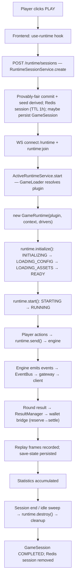

### 2.2 The three tiers of the runtime

The runtime spans three tiers, each with a distinct responsibility:

| Tier | Where | Owns |
| --- | --- | --- |
| **Presentation harness** | Frontend (`use-runtime`, `runtime-harness`, `game-canvas`) | Connect, render events, send actions, latency ([Frontend §9.4](./FRONTEND_ARCHITECTURE.md#94-real-time-the-runtime-hook)) |
| **Host** | Backend `runtime` module | Session binding, live-runtime hosting, WebSocket transport, persistence |
| **Framework** | `@gaming-platform/game-sdk` | Lifecycle, plugin host, 12 managers, deterministic RNG |

### 2.2.1 The eleven steps, mapped to code

The brief's canonical sequence maps precisely onto real components:

| Step | Component & method | Tier |
| --- | --- | --- |
| Player clicks PLAY | `use-runtime` effect | Frontend |
| Session created | `RuntimeSessionService.create` | Backend |
| Runtime created | `ActiveRuntimeService.start` → `GameLoader.load` | Backend/SDK |
| Plugin loaded | `GameRegistryResolver.resolve` → factory | SDK |
| State initialized | `runtime.initialize()` (→ READY) | SDK |
| Game begins | `runtime.start()` (→ RUNNING) | SDK |
| Events generated | engine `emitEvent` → `EventBus` | SDK |
| Wallet updated | result → `WalletBridgeService` reserve/settle | Backend |
| Replay saved | `ReplayManager` + `RuntimeSessionService.saveReplay` | SDK/Backend |
| Statistics updated | `StatisticsManager` + `GameResult` rows | SDK/Backend |
| Runtime destroyed | `runtime.destroy()` → `cleanup()` | SDK |

This mapping is the reader's index into the rest of the document: each step is a section, and each component is documented in [§4](#4-runtime-components).

### 2.3 What "server-authoritative" means concretely

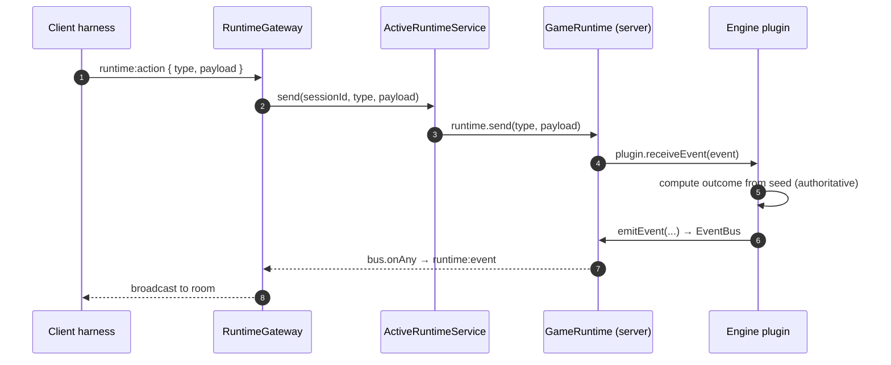

The client **requests** an action; the **server** computes the result inside the authoritative `GameRuntime` and broadcasts the resulting events. The client never decides an outcome — it only renders what the server sends. This is the foundational security property of the runtime ([§15](#15-runtime-security)).

---

## 3. Runtime Architecture

### 3.1 The six layers

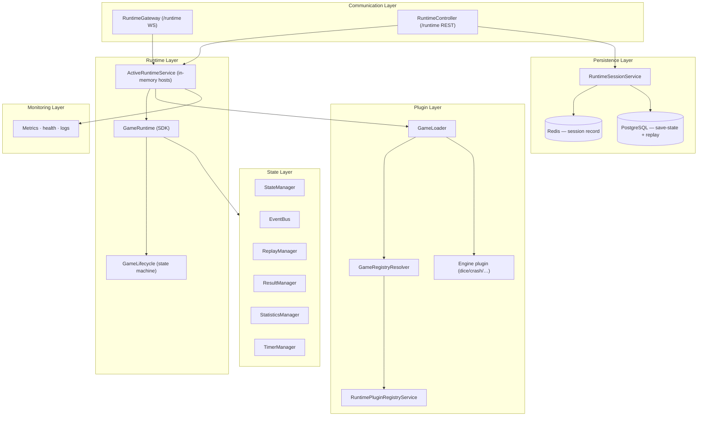

### 3.2 Layer responsibilities

| Layer | Components | Responsibility |
| --- | --- | --- |
| **Runtime** | `GameRuntime`, `GameLifecycle`, `ActiveRuntimeService` | Host a live runtime; drive and enforce the lifecycle |
| **Plugin** | `RuntimePluginRegistryService`, `GameRegistryResolver`, `GameLoader`, engines | Register, validate, resolve, and instantiate engines |
| **State** | `StateManager`, `EventBus`, `ReplayManager`, `ResultManager`, `StatisticsManager`, `TimerManager` | Hold and evolve in-memory game state and its derived streams |
| **Persistence** | `RuntimeSessionService`, Redis, PostgreSQL | Session records (Redis), save-state + replay (PostgreSQL) |
| **Communication** | `RuntimeGateway`, `RuntimeController` | Real-time (WS) and request/response (REST) transport |
| **Monitoring** | Metrics/health/logs | Active-runtime counts, health, structured logs ([§18](#18-monitoring)) |

### 3.3 The isomorphic boundary

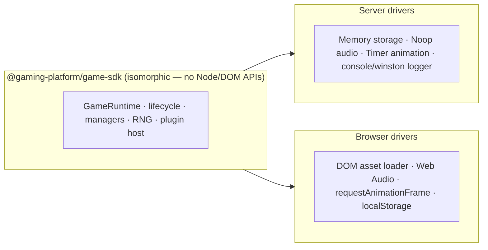

The SDK's `types.ts` header states the rule explicitly: *"Everything here is isomorphic (no Node- or DOM-specific APIs) so the SDK runs on the server (authoritative game engines) and in the browser (runtime harness)."* Platform specifics enter only through injectable **drivers** (`AssetLoader`, `AudioDriver`, `AnimationScheduler`, `StorageDriver`, `Logger`). On the server, the defaults are headless (memory storage, no-op audio, timer-based animation); in the browser, the harness injects DOM-backed drivers. See [ADR-002](#22-architecture-decision-records).

### 3.4 The backend runtime module wiring

The backend `RuntimeModule` composes the host services and transports as a NestJS module ([Backend §5.5](./BACKEND_ARCHITECTURE.md#55-games-runtime--engines)):

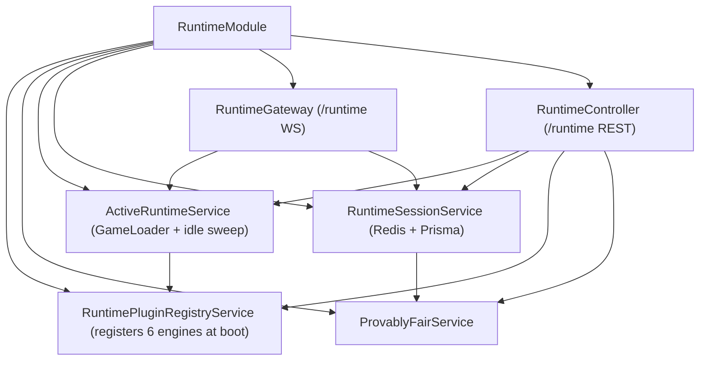

The module **exports** `RuntimePluginRegistryService`, `RuntimeSessionService`, and `ActiveRuntimeService` so other modules can inspect plugins or drive runtimes. Dependency injection wires the dependencies: `ActiveRuntimeService` constructs a `GameLoader` from the registry's resolver; `RuntimeSessionService` injects Prisma, Redis, `ProvablyFairService`, and the registry; the gateway and controller inject all the services they orchestrate. This is the clean seam between the **framework** (SDK, dependency-free) and the **host** (NestJS module, injected) — the SDK knows nothing of NestJS, and the module knows nothing of the SDK's internals beyond its public API.

### 3.4.1 Separation of framework and host

| Concern | Framework (SDK) | Host (backend module) |
| --- | --- | --- |
| Lifecycle & managers | ✅ owns | consumes |
| Determinism (RNG) | ✅ owns | seeds it (provably-fair) |
| Session records | — | ✅ owns (Redis) |
| Persistence (state/replay) | produces snapshots | ✅ owns (Prisma) |
| Transport (WS/REST) | transport-agnostic | ✅ owns (gateway/controller) |
| Plugin registration | provides registry classes | ✅ registers the 6 engines |

This split is why the SDK is unit-testable without NestJS and the host is testable with mocked services — a direct consequence of [ADR-019](#22-architecture-decision-records) (transport-agnostic SDK).

---

## 4. Runtime Components

Every component below exists in the repository. The runtime is an aggregation of a host (`GameRuntime`) and twelve managers, plus the backend services that host and persist it.

### 4.1 Component catalog

| Component | Location | Role |
| --- | --- | --- |
| `GameRuntime` | sdk `runtime.ts` | Hosts one plugin; owns every manager; drives the lifecycle; implements `PluginHost` |
| `GameLifecycle` | sdk `lifecycle.ts` | Enforces the state-transition graph |
| `GameLoader` | sdk `loader.ts` | Resolves a plugin by key and constructs a runtime |
| `GamePluginRegistry` | sdk `registry.ts` | In-memory map of registered plugins |
| `GameRegistryResolver` | sdk `registry.ts` | Resolves static or dynamically-imported plugins |
| `SeededRng` | sdk `rng.ts` | Deterministic isomorphic PRNG (mulberry32) |
| `GameEventBus` | sdk `managers/event-bus.ts` | Typed pub/sub; isolated handlers |
| `GameStateManager` | sdk `managers/state-manager.ts` | Versioned state + snapshot/restore |
| `GameTimerManager` | sdk `managers/timer-manager.ts` | Tracked timers; deterministic cleanup |
| `GameStatisticsManager` | sdk `managers/statistics-manager.ts` | Counters + observations |
| `GameReplayManager` | sdk `managers/replay-manager.ts` | Ordered frame log + serialization |
| `GameResultManager` | sdk `managers/result-manager.ts` | Validated round results (settlement source) |
| `GameStorageManager` | sdk `managers/storage-manager.ts` | Namespaced key-value persistence |
| `GameLocalization` | sdk `managers/localization.ts` | i18n with interpolation |
| `GameThemeManager` | sdk `managers/theme-manager.ts` | Design-token themes |
| `GameAssetManager` | sdk `managers/asset-manager.ts` | Register + preload assets with progress |
| `GameAudioManager` | sdk `managers/audio-manager.ts` | Audio facade over an injectable driver |
| `GameAnimationManager` | sdk `managers/animation-manager.ts` | Frame loop + tweens |
| `GameConfigResolver` | sdk `managers/config-resolver.ts` | Layered config merge + validation |
| `RuntimePluginRegistryService` | backend | Registers/validates the 6 engines at boot |
| `ActiveRuntimeService` | backend | Hosts live runtimes; idle sweep |
| `RuntimeSessionService` | backend | Redis session records; save-state/replay persistence |
| `ProvablyFairService` | backend | Commit-reveal seed + verification |
| `RuntimeGateway` | backend | `/runtime` WebSocket transport |
| `RuntimeController` | backend | `/runtime` REST endpoints |

### 4.2 GameRuntime — the host

`GameRuntime` is the center of the framework. It is constructed with a `GamePlugin`, a `GameContext`, and optional `RuntimeDrivers`, and it **owns every manager** as a public readonly field. It implements `PluginHost`, so the plugin it hosts talks to *it* for every service. Its public surface:

| Method | Effect |
| --- | --- |
| `initialize()` | INITIALIZING → LOADING_CONFIG → LOADING_ASSETS → READY (attaches plugin, loads config + assets) |
| `start()` | STARTING → RUNNING (calls `plugin.start`) |
| `pause()` / `resume()` | RUNNING ↔ PAUSED |
| `stop()` | STOPPING → STOPPED |
| `destroy()` | → DESTROYED; clears the event bus |
| `send(type, payload)` | Deliver a player action to the plugin (`receiveEvent`) |
| `saveState()` / `restoreState()` | Delegate to plugin snapshot/restore |
| `on(type, handler)` | Subscribe to the event bus |
| `status()` | Current lifecycle status |

On construction it resolves drivers with sensible defaults: `rng = drivers.rng ?? new SeededRng(context.seed)`, config = `{ ...plugin.defaultConfig, ...configOverride }`, and each manager gets its injected or default driver. This single constructor is where "isomorphic with injectable drivers" becomes concrete.

### 4.3 The twelve managers

```mermaid
flowchart TD
    GR["GameRuntime (PluginHost)"] --> EB["EventBus — pub/sub"]
    GR --> SM["StateManager — versioned state"]
    GR --> TM["TimerManager — tracked timers"]
    GR --> STM["StatisticsManager — counters/observations"]
    GR --> RPM["ReplayManager — frame log"]
    GR --> RSM["ResultManager — round results"]
    GR --> STO["StorageManager — kv persistence"]
    GR --> LOC["Localization — i18n"]
    GR --> THM["ThemeManager — tokens"]
    GR --> ASM["AssetManager — preloading"]
    GR --> AUM["AudioManager — sound"]
    GR --> ANM["AnimationManager — frame loop"]
    GR --> RNG["SeededRng — determinism"]
```

Each manager is documented in depth in [§8](#8-state-management) (state/results), [§9](#9-event-system) (bus), [§13](#13-replay-system) (replay), [§14](#14-statistics) (statistics), and [§25](#25-runtime-reference) (full reference). The design intent is **separation of concerns**: the plugin never reimplements a timer set or a pub/sub bus — it composes the runtime's managers, which are uniform across every engine.

### 4.4 Manager deep-dives

Because the brief requires every runtime component to be documented, this section gives each manager its purpose, responsibilities, driver model, and the reason it exists as a separate unit.

#### TimerManager

- **Purpose:** own every timer the engine schedules so they can be cancelled deterministically.
- **API:** `setTimeout`, `setInterval`, `clearTimeout`, `clearInterval`, `delay(ms)` (a cancellable promise), `clearAll`, `activeCount`.
- **Why separate:** engines schedule countdowns, tick loops, and delays constantly. If each engine tracked its own handles, one forgotten `clearInterval` would leak a callback for the life of the process. The manager tracks handles in `Set`s and self-removes a timeout on fire, so `clearAll()` (called by `cleanup()`) guarantees zero orphans. `activeCount` is a leak-detection hook for tests.

#### StateManager

- **Purpose:** hold the authoritative, versioned game state and notify on change.
- **API:** `get` (readonly), `set`, `patch`, `update(mutator)`, `snapshot`, `restore`, `reset`, `subscribe`.
- **Why separate:** versioning (every mutation bumps `version`), immutable snapshots (via `structuredCloneSafe`), and subscriber notification are cross-cutting needs of *every* engine. Centralizing them means save-state, replay, and optimistic persistence all work identically regardless of engine.

#### EventBus

- **Purpose:** decouple producers (engine, lifecycle, managers) from consumers (gateway, monitoring, UI).
- **API:** `on`, `once`, `off`, `onAny`, `emit`, `clear`, `listenerCount`.
- **Why separate:** the bus is the single seam between the runtime and the network — the gateway subscribes with `onAny` to stream everything. Isolated delivery (`safe`) makes it robust to bad subscribers.

#### ReplayManager

- **Purpose:** record the ordered, timestamped frame stream that (with the seed) reconstructs a session.
- **API:** `record`, `pause`, `resume`, `getFrames`, `serialize`, `load`, `clear`, `frameCount`.
- **Why separate:** replay recording must be automatic and faithful. Because `BaseGamePlugin.emitEvent` calls `record` on every event, no engine can forget to log a frame — the manager guarantees the replay matches the event stream.

#### ResultManager

- **Purpose:** validate and store the authoritative per-round result — the settlement source of truth.
- **API:** `record`, `last`, `all`, `totals`, `clear`.
- **Why separate:** money settles from results, so results must be validated (non-empty `roundId`, non-negative amounts) at a single, auditable choke point before the host hands them to the wallet bridge.

#### StatisticsManager

- **Purpose:** accumulate live counters and observations for a session.
- **API:** `increment`, `observe`, `getCounter`, `snapshot`, `reset`.
- **Why separate:** live stats (rounds, wins, average bet) are useful to the UI and monitoring but shouldn't couple the engine to the database — the manager is the ephemeral live surface; durable stats derive from persisted results.

#### AssetManager

- **Purpose:** register and preload a game's assets with weighted progress reporting.
- **API/driver:** `register`, `preloadAll(onProgress)`, `get`, `has`, `progress`, `cancel`, `clear`; injectable `AssetLoader` (passthrough default on the server, DOM loader in the browser).
- **Why separate:** the LOADING_ASSETS phase needs uniform progress reporting for the loading UI. On the server (no real assets to load) the passthrough loader resolves metadata instantly, so the same lifecycle runs headlessly.

#### AudioManager & AnimationManager

- **Purpose:** sound playback and the per-frame loop / tweens.
- **Drivers:** `AudioDriver` (`NoopAudioDriver` on the server, Web Audio in the browser) and `AnimationScheduler` (`TimerAnimationScheduler` default ~60fps, `requestAnimationFrame` in the browser).
- **Why separate + no-op defaults:** the authoritative server computes outcomes and must not do audio/rendering work; no-op/timer defaults make the engine logic run headlessly while the browser harness supplies real drivers. `cleanup()` stops both so a destroyed runtime is silent and still.

#### StorageManager, Localization, ThemeManager

- **StorageManager:** namespaced kv persistence (`getJSON`/`setJSON`) over an injectable `StorageDriver` (`MemoryStorageDriver` default, localStorage in the browser) — for UI settings like last-bet.
- **Localization:** `{placeholder}` interpolation with locale fallback (`t(key, vars)`).
- **ThemeManager:** design-token themes the frontend maps to CSS variables.
- **Why separate:** these are UI-facing concerns the engine may drive but that must degrade to safe headless defaults on the server.

#### ConfigResolver

- **Purpose:** resolve the effective config by deep-merging operator/session overrides onto plugin defaults, optionally validating.
- **API:** `resolve(...overrides)` with `deepMerge` semantics (objects merge, scalars/arrays replace).
- **Why separate:** a game's behavior (dice count, payouts, house rules) is data-driven; layering overrides on defaults in one place keeps configuration consistent and testable.

---

## 5. Runtime Lifecycle

The lifecycle is the runtime's backbone. It is a **strictly-enforced state machine** in `lifecycle.ts`: every transition is validated against a declared graph, and an illegal transition throws.

### 5.1 The state machine

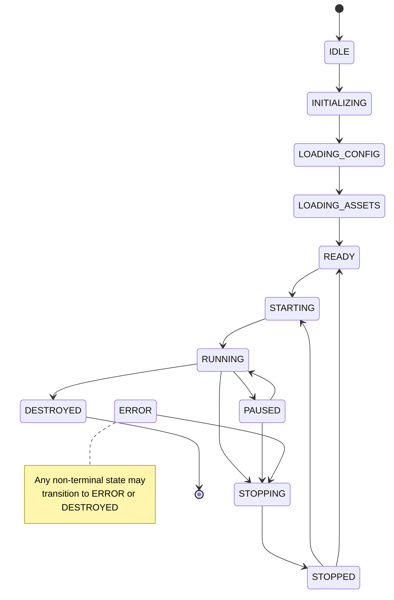

### 5.2 The twelve states

| Status | Meaning | Entered by |
| --- | --- | --- |
| `IDLE` | Constructed, nothing started | initial state |
| `INITIALIZING` | Plugin attached, `initialize()` running | `runtime.initialize()` |
| `LOADING_CONFIG` | `loadConfiguration()` running | after INITIALIZING |
| `LOADING_ASSETS` | Assets preloading, progress emitted | after LOADING_CONFIG |
| `READY` | Fully initialized, awaiting start | after LOADING_ASSETS |
| `STARTING` | `start()` running | `runtime.start()` |
| `RUNNING` | Live gameplay | after STARTING (or resume) |
| `PAUSED` | Suspended; replay recording paused | `runtime.pause()` |
| `STOPPING` | `stop()` running | `runtime.stop()` |
| `STOPPED` | Halted; may restart or return to READY | after STOPPING |
| `ERROR` | A lifecycle step threw | any non-terminal state on failure |
| `DESTROYED` | Torn down; terminal | `runtime.destroy()` |

### 5.3 The transition graph (authoritative)

The `TRANSITIONS` table in `lifecycle.ts` is the law. `canTransition(to)` returns `true` only if `to` is in the current state's allowed set — **except** that any non-`DESTROYED` state may always move to `ERROR` or `DESTROYED`, and `DESTROYED` allows nothing.

| From | Allowed to |
| --- | --- |
| IDLE | INITIALIZING |
| INITIALIZING | LOADING_CONFIG |
| LOADING_CONFIG | LOADING_ASSETS |
| LOADING_ASSETS | READY |
| READY | STARTING |
| STARTING | RUNNING |
| RUNNING | PAUSED, STOPPING |
| PAUSED | RUNNING, STOPPING |
| STOPPING | STOPPED |
| STOPPED | STARTING, READY |
| ERROR | STOPPING |
| DESTROYED | (none — terminal) |
| *any non-terminal* | ERROR, DESTROYED (always) |

**Why enforce transitions:** a state machine turns "the runtime is in a weird state" from a silent bug into a thrown, logged error at the exact point of the illegal transition. `transition()` throws `Invalid lifecycle transition: X → Y` if `canTransition` is false, so a plugin that tries to `start()` before `READY`, or act after `DESTROYED`, fails loudly and debuggably. See [ADR-003](#22-architecture-decision-records).

### 5.4 The initialize activity

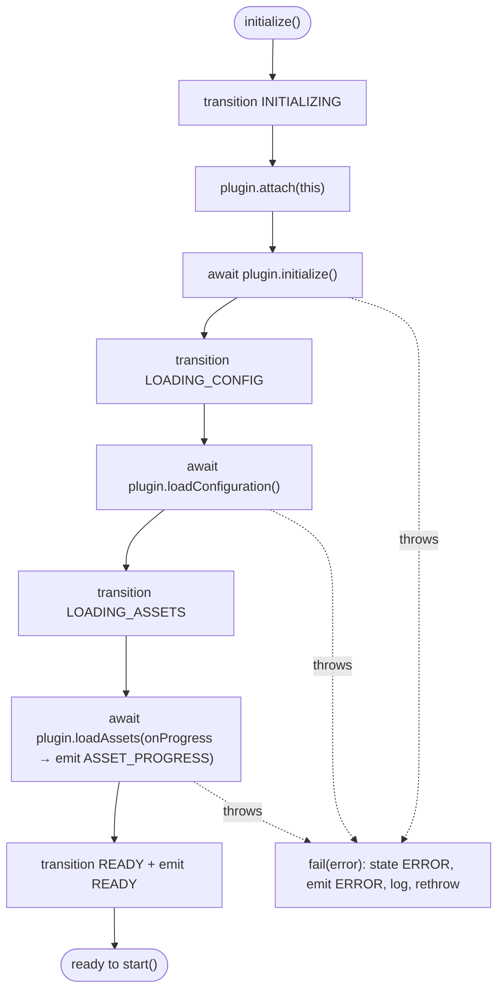

Every lifecycle-driving method (`initialize`, `start`) wraps its body in try/catch and calls `fail(error)` on failure, which sets the state to `ERROR`, emits `RUNTIME_EVENTS.ERROR` with the message, logs, and rethrows. This guarantees a failed step **always** leaves the runtime in a well-defined `ERROR` state rather than a half-initialized limbo.

### 5.4.1 The pause / resume / stop / destroy activities

```mermaid
flowchart TD
    subgraph Pause["pause()"]
        P1["transition PAUSED"] --> P2["state.setStatus(PAUSED)"] --> P3["plugin.pause() → replay.pause() + onPause()"]
    end
    subgraph Resume["resume()"]
        R1["transition RUNNING"] --> R2["state.setStatus(RUNNING)"] --> R3["plugin.resume() → replay.resume() + onResume()"]
    end
    subgraph Stop["stop()"]
        S1["transition STOPPING"] --> S2["await plugin.stop() → onStop()"] --> S3["transition STOPPED + emit STOPPED"]
    end
    subgraph Destroy["destroy()"]
        D1["await plugin.destroy() → onDestroy() + cleanup()"] --> D2["transition DESTROYED"] --> D3["bus.clear()"]
    end
```

Note the ordering discipline: `pause` suspends **replay recording** (so paused time doesn't pollute the frame log) but keeps the runtime resident; `stop` is a clean halt that can be followed by another `start` (STOPPED→STARTING) or a return to READY; `destroy` is terminal and clears the event bus after cleanup. Only `destroy` is irreversible — a stopped runtime is still usable, which is why `STOPPED` allows both `STARTING` and `READY`.

### 5.5 Lifecycle events

Each transition emits a `lifecycle:change` event (`{ from, to }`) on the event bus. The runtime also emits high-level `RUNTIME_EVENTS`: `runtime:ready`, `runtime:started`, `runtime:stopped`, `runtime:error`, and `runtime:asset-progress`. Subscribers (the gateway, monitoring, the harness) react to these without polling the runtime's status.

---

## 6. Plugin Architecture

A **plugin** is a game engine that implements the `GamePlugin` contract. The plugin architecture is what lets the platform add games without changing platform code.

### 6.1 The plugin contract

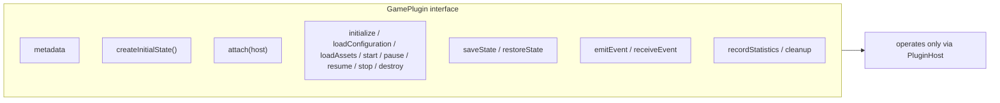

`GamePlugin` declares `metadata` (key, name, genre, version, min/max players, capabilities, defaultConfig), a `createInitialState()`, an `attach(host)`, the full set of lifecycle methods, state save/restore, event send/receive, `recordStatistics`, and `cleanup`. The **`PluginHost`** is the only surface a plugin sees: it exposes `context`, `config`, `rng`, `bus`, and all twelve managers, plus the logger. A plugin **never constructs a manager or touches the network** — this is the sandbox. See [ADR-004](#22-architecture-decision-records).

### 6.2 BaseGamePlugin — hooks over boilerplate

Most engines extend `BaseGamePlugin`, which implements the entire `GamePlugin` contract in terms of **overridable protected hooks** (no-ops by default):

| Lifecycle method | Calls hook | Extra behavior |
| --- | --- | --- |
| `initialize()` | `onInitialize()` | — |
| `loadConfiguration()` | `onConfigure()` | — |
| `loadAssets()` | `getAssetDescriptors()` + `onAssetsLoaded()` | registers + preloads assets, reports progress |
| `start()` | `onStart()` | — |
| `pause()` | `onPause()` | pauses replay recording |
| `resume()` | `onResume()` | resumes replay recording |
| `stop()` | `onStop()` | — |
| `destroy()` | `onDestroy()` + `cleanup()` | — |
| `restoreState()` | `onRestore(snapshot)` | restores state manager first |
| `emitEvent()` | — | emits on bus **and records a replay frame** |
| `receiveEvent()` | `onEvent(event)` | — |
| `recordStatistics()` | `onRecordStatistics()` | — |
| `cleanup()` | `onCleanup()` | clears timers, stops animation + audio |

**Why a base class of hooks:** a concrete engine (e.g. the dice engine's plugin) writes only the gameplay unique to its genre — it overrides `onStart` or `onEvent` and leaves the rest as no-ops. The base class guarantees the *cross-cutting* behavior (replay recording on `emitEvent`, resource cleanup on `destroy`) happens uniformly, so no engine can forget to record a frame or clear a timer. This is the runtime's most important reuse mechanism.

### 6.3 Registration & validation at boot

The backend `RuntimePluginRegistryService` registers **six engines** at construction — `dice`, `crash`, `roulette`, `card`, `lottery`, `sports` — each imported as a `*Registration` from its engine package. Every registration is **validated at boot**:

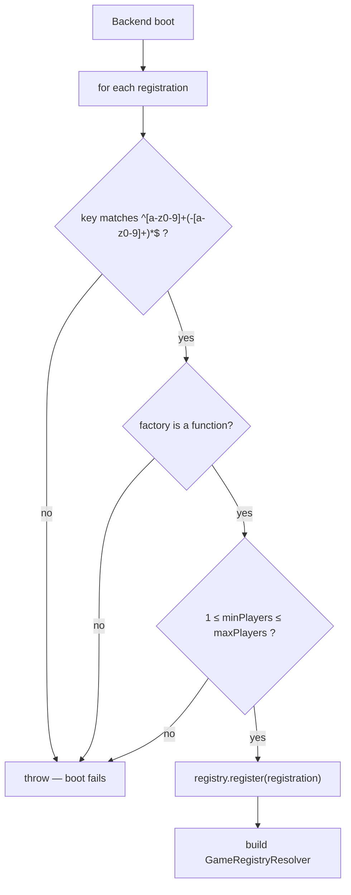

A malformed plugin **prevents boot** — fail fast rather than discover a broken game at play time. See [Backend §13.1](./BACKEND_ARCHITECTURE.md#131-plugin-registry-boot-time) and [ADR-011](#22-architecture-decision-records).

### 6.4 Loading & resolution

`GameRegistryResolver.resolve(key)` returns a `PluginFactory`:

- **Static plugins** (the six registered at boot) resolve **synchronously** from the in-memory `GamePluginRegistry`.
- **Unknown keys** fall back to a registered **dynamic loader** (a code-split `import()`), which is registered into the registry on first use — enabling lazy engine loading without changing platform code.

`GameLoader.load(key, context, drivers)` resolves the factory, instantiates the plugin, and wraps it in a `new GameRuntime(...)`. `loadAndInitialize` additionally runs `initialize()` to land in `READY`.

### 6.5 Plugin metadata & capabilities

| Field | Purpose |
| --- | --- |
| `key` | Unique registry key (kebab-case) — how the client requests a game |
| `name` | Human name |
| `genre` | `GameGenre` (CARD/ROULETTE/DICE/CRASH/LOTTERY/SPORTS/CUSTOM) |
| `version` | Engine version |
| `minPlayers`/`maxPlayers` | Player range (validated at boot) |
| `capabilities` | String flags describing what the engine supports |
| `defaultConfig` | Baseline config merged with session overrides |

### 6.5.1 Worked example — the dice engine as a plugin

The dice engine grounds the whole plugin model. Its pure core, `DiceEngine`, is constructed with a resolved ruleset and a provably-fair seed and produces a **deterministic, fully-settled roll**:

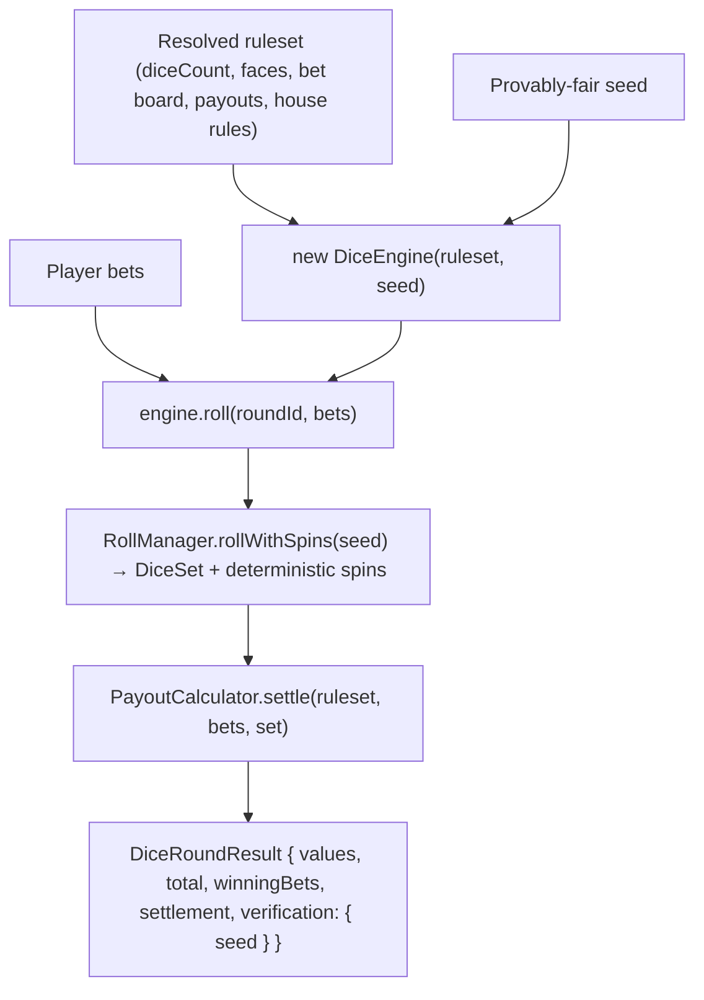

Three properties make it a model plugin:

1. **Purity.** `DiceEngine` imports only its own logic — no sessions, sockets, wallets, or database. It is a function of `(ruleset, seed, bets)`.
2. **Determinism.** The dice come from `ProvablyFairDiceRoller.roll(seed, …)`, so *"The same seed always yields the same dice — enabling replay and verification."* Even the per-die animation `spins` are deterministic, so the client animation reproduces exactly.
3. **Data-driven, no branches.** Its docstring is explicit: *"Fully data-driven: dice count, faces, the bet board, payouts and house rules all come from the ruleset; there are no per-variant branches."* Sic bo, chuck-a-luck, and custom dice variants are **configuration**, not code.

To make it a runtime plugin, a thin `GamePlugin` wrapper (extending `BaseGamePlugin`) holds this engine, exposes `metadata` (`key: 'dice-engine'`, genre DICE, `defaultConfig` = the ruleset), and on a `dice:roll` action calls `engine.roll(...)`, records the result via `host.results.record(...)`, and `emitEvent`s the outcome (which auto-records a replay frame). Everything else — lifecycle, sessions, fairness, wallet settlement, reconnect — is inherited from the runtime. This is the payoff of the architecture: **a new game is mostly pure logic plus a small plugin shell.**

### 6.6 Dependency rules

An engine depends **only** on `@gaming-platform/game-sdk` (for the contract and managers) and its own pure logic. It must not import backend services, the database, the network, or another engine. This keeps engines portable (they run headlessly in tests), isolated (a bug is contained), and isomorphic. The concrete dice engine (`DiceEngine`) exemplifies this: it is a pure, data-driven class — *"Fully data-driven: dice count, faces, the bet board, payouts and house rules all come from the ruleset; there are no per-variant branches"* — that takes a ruleset + seed and returns a deterministic settled roll, with no knowledge of sessions, sockets, or wallets.

---

## 7. Session Architecture

A **runtime session** binds a player to a live runtime with provably-fair material and (optionally) a persisted database session. It is managed by the backend `RuntimeSessionService`, backed by Redis.

### 7.1 Session creation

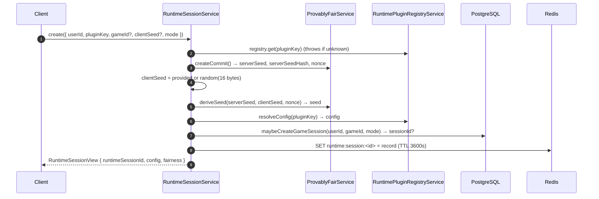

The session record holds everything needed to run and verify the game: `runtimeSessionId`, optional `sessionId` (the persisted `GameSession`), `userId`, `gameId`, `pluginKey`, `mode`, `status`, the derived `seed`, the fairness triple (`serverSeed`, `serverSeedHash`, `clientSeed`, `nonce`), the resolved `config`, and `locale`.

### 7.2 Redis binding & ownership

The session record lives in Redis under `runtime:session:<id>` with a **1-hour TTL**. Every access goes through `getRecord(runtimeSessionId, userId)`, which:

1. Reads the record (throws `NotFoundException` if missing/expired), and
2. **Verifies ownership** — `record.userId !== userId` throws `ForbiddenException('Not your runtime session')`.

This ownership check is the session-layer half of runtime security ([§15.1](#151-ownership--session-validation)): a player can only touch their own session, enforced on every REST call and WebSocket message.

### 7.3 Runtime binding

The Redis session record is **metadata**; the live `GameRuntime` is separate, held in memory by `ActiveRuntimeService`. Binding happens on demand: when a player joins (WS) or sends an action (REST), the host calls `ActiveRuntimeService.start(...)` with the plugin key and a `GameContext` built from the record (`buildContext`). If a runtime for that session already exists, `start` returns it — so a session maps to **at most one** live runtime.

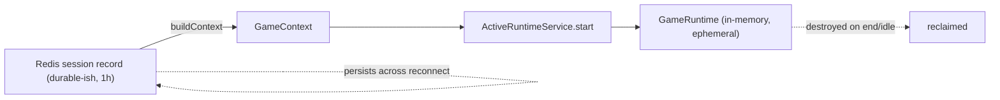

### 7.4 Persisted vs. ephemeral sessions

Not every session touches the database. `maybeCreateGameSession` creates a `GameSession` row **only** when a `gameId` resolves to a real game with an active currency; demo play with no game binding has `sessionId = null`. Operations that require durability — `saveState`, `saveReplay`, `getState`, `listReplays` — call `requirePersisted(record)`, which throws if `sessionId` is null: *"This runtime session is not persisted (no game/currency); state and replay require a persisted session."* This cleanly separates **free demo play** (ephemeral, Redis-only) from **real sessions** (durable, with save-state and replay). See [Database §13.3](./DATABASE_ARCHITECTURE.md#133-runtime-state--replay).

### 7.5 Expiration, cleanup & reconnect

| Concern | Mechanism |
| --- | --- |
| **Session expiration** | Redis TTL 3600s; a stale record simply vanishes |
| **Runtime idle cleanup** | `ActiveRuntimeService` sweeps runtimes idle > 15 min (60s interval) |
| **Explicit end** | `end()` marks `GameSession` COMPLETED and deletes the Redis record |
| **Reconnect** | The runtime is kept alive across a socket disconnect; rejoining re-emits `runtime:state` ([§17.2](#172-reconnect)) |

The two timeouts are complementary: the **Redis TTL** bounds the session metadata's lifetime; the **idle sweep** bounds the in-memory runtime's lifetime. A player who walks away has their live runtime reclaimed after 15 minutes of inactivity while the session record can persist up to an hour for reconnect.

---

## 8. State Management

Game state is held authoritatively in memory by `GameStateManager` and snapshotted for persistence and replay.

### 8.1 The state manager

`GameStateManager<TState>` holds the authoritative, **versioned** state. Every mutation bumps a `version` counter, updates `updatedAt`, and notifies subscribers. It exposes:

| Method | Effect |
| --- | --- |
| `get()` | Read-only current state |
| `set(next)` | Replace state; version++ |
| `patch(partial)` | Shallow-merge; version++ |
| `update(mutator)` | Clone → mutate draft → commit; version++ |
| `snapshot()` | `{ status, version, state (cloned), updatedAt }` |
| `restore(snapshot)` | Replace state/version/status from a snapshot |
| `reset()` | Back to the initial state |
| `subscribe(fn)` | React to changes; returns unsubscribe |

### 8.2 Immutability & cloning

State reads return `Readonly<TState>`, and `snapshot`/`restore`/`reset`/`update` all use `structuredCloneSafe` — `structuredClone` with a `JSON.parse(JSON.stringify(...))` fallback for older runtimes. **Why clone:** snapshots must be independent of live state (a later mutation must not retroactively change a saved snapshot), and `update` operates on a draft clone so a throwing mutator can't leave state half-mutated. This makes save-state and replay reliable.

### 8.3 The three kinds of state

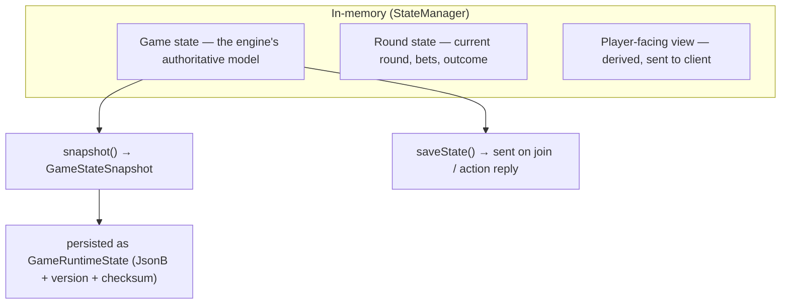

- **Game state** is the engine's authoritative model (held by `StateManager`).
- **Round state** is the current round's data, part of game state.
- **Player-facing state** is what the client receives (`runtime.saveState()` on join/action) — a snapshot, not direct access.

### 8.4 Serialization & persistence

`saveState()` returns a `GameStateSnapshot<TState>` (status + version + cloned state + timestamp). The backend persists it via `RuntimeSessionService.saveState`, which **upserts** a `GameRuntimeState` row (1-1 with the `GameSession`) storing the state as `JsonB`, the `snapshotVersion`, and a **checksum** (`ProvablyFairService.hash(JSON.stringify(state))`). The checksum lets the platform detect tampering or corruption of a persisted snapshot. See [Database §13.3](./DATABASE_ARCHITECTURE.md#133-runtime-state--replay).

### 8.5 Recovery & synchronization

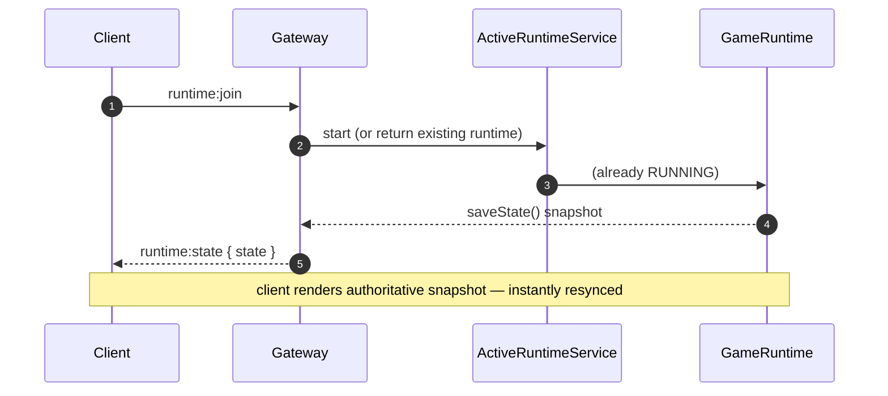

On (re)join, the gateway sends the runtime's current `saveState()` snapshot as `runtime:state`, so a client that connected late or reconnected is **immediately synchronized** with the authoritative in-memory state — no divergence, no client-side reconstruction.

### 8.6 State mutation patterns

Engines have three ways to evolve state through `StateManager`, each suited to a situation:

| Method | Semantics | When to use |
| --- | --- | --- |
| `set(next)` | Replace the whole state object | A full round transition where most fields change |
| `patch(partial)` | Shallow-merge a partial | A few top-level fields change (e.g. `{ phase: 'reveal' }`) |
| `update(mutator)` | Clone → mutate a draft → commit | Nested/complex mutations where a mutator reads-then-writes |

All three **bump the version and notify subscribers**, so state changes are observable uniformly regardless of which method an engine picks. The critical discipline: **never mutate the object returned by `get()`** — it is typed `Readonly<TState>` for a reason. Mutating it in place would skip versioning and notification, and would corrupt any snapshot that shares the reference. `update()` exists precisely so an engine can do read-then-write mutations safely on a clone. This is the runtime's answer to "how do I change nested state without breaking snapshots?" — the manager clones for you.

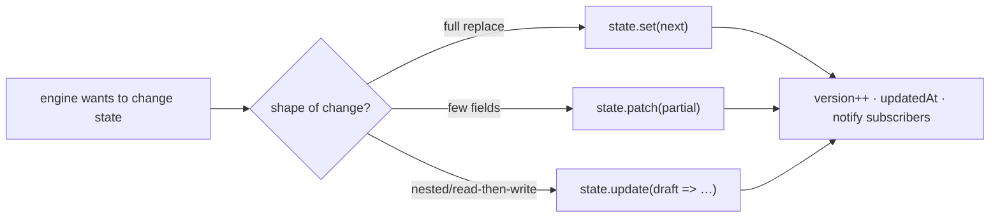

---

## 9. Event System

The event bus is the runtime's nervous system: managers, plugins, and the gateway all communicate through it.

### 9.1 The event bus

`GameEventBus` is a typed, in-memory publish/subscribe bus. A `GameEvent` is `{ type, payload, ts, source }`. The API:

| Method | Purpose |
| --- | --- |
| `on(type, handler)` | Subscribe to a type; returns unsubscribe |
| `once(type, handler)` | One-shot subscription |
| `off(type, handler)` | Unsubscribe |
| `onAny(handler)` | Subscribe to **every** event; returns unsubscribe |
| `emit(type, payload, source)` | Publish; returns the event |
| `listenerCount(type?)` | Diagnostics |
| `clear()` | Remove all handlers (called on destroy) |

### 9.2 Handler isolation

Every delivery goes through a private `safe(handler, event)` that wraps the call in try/catch: *"Isolated: a faulty subscriber must not break event delivery."* **Why isolate:** if one subscriber throws (a buggy UI handler, a failing metric), it must not prevent the event from reaching the other subscribers — including the gateway that streams to the client. Isolation makes the bus robust to partial failure. See [ADR-005](#22-architecture-decision-records).

### 9.3 Publish/subscribe flow

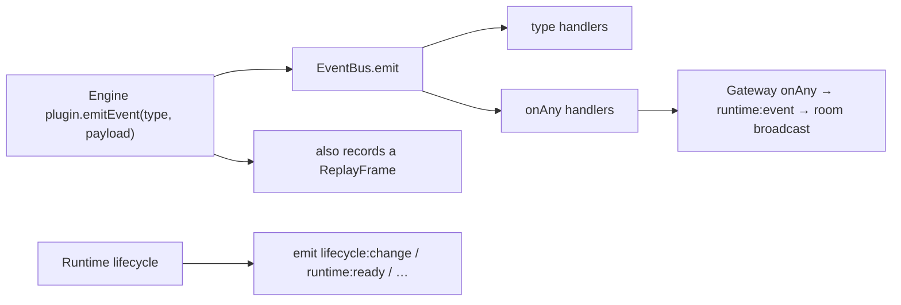

The gateway subscribes with `onAny` (via `ActiveRuntimeService.attachListener`) so that **every** engine event is streamed to the client room as a `runtime:event`. This is the seam between the in-memory bus and the network.

### 9.4 Ordering, consistency & replay

Events are delivered **synchronously in subscription order** within a single `emit` — the bus iterates its handler set and the `onAny` set in order. Because the authoritative runtime is single-threaded (Node's event loop), there is no interleaving of two `emit`s: an action is fully processed (all its events delivered) before the next action begins. This gives a **total order** of events per session, which is exactly what replay needs. When a plugin `emitEvent`s, `BaseGamePlugin` also records a `ReplayFrame`, so the event stream and the replay log stay consistent by construction ([§13](#13-replay-system)).

### 9.5 Why synchronous, single-threaded delivery matters

The synchronous, single-threaded model is not an accident — it is what makes the runtime **replayable and race-free**. Consider two players' actions arriving nearly simultaneously (across two sessions) or two events emitted during one action (within one session):

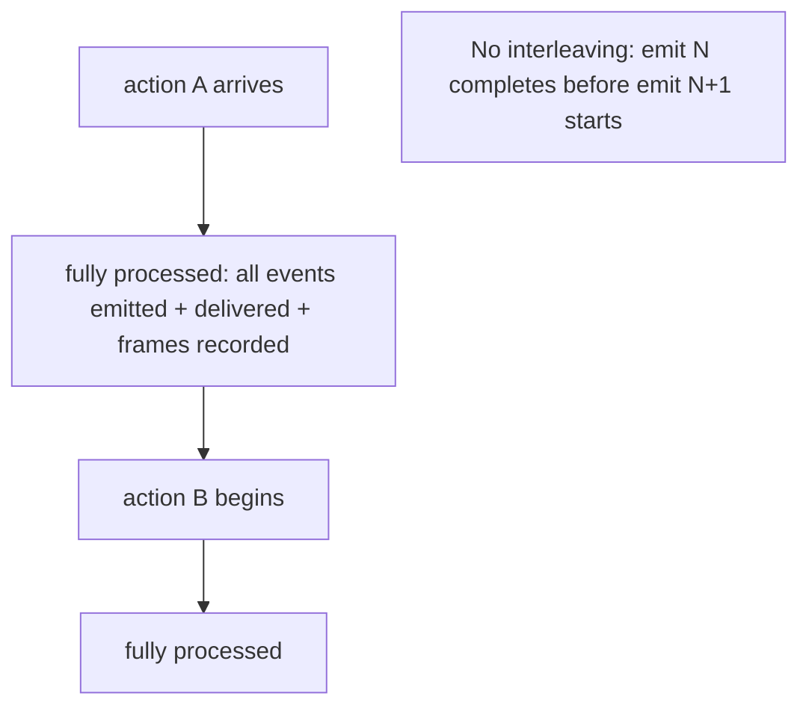

- **Within a session:** an action runs to completion — all its emitted events delivered, all its replay frames recorded — before the next action is dequeued. There is no point at which state is half-updated between two events, so a replay that re-runs actions in recorded order reproduces the exact same intermediate states.
- **Across sessions:** each session's runtime is independent; there is no shared mutable state between runtimes, so two sessions cannot corrupt each other. Node's event loop serializes the JavaScript, so even though many runtimes are "active," only one is executing at any instant.

This is why the runtime needs **no locks** for its in-memory state: the concurrency model is cooperative and deterministic. It is also why a CPU-heavy engine is a concern ([ADR-020](#22-architecture-decision-records)) — it holds the loop — and why the roadmap's multi-node story requires externalizing state rather than adding threads. The determinism that the total event order provides is the same property that makes provable fairness and replay work: **given the seed and the ordered inputs, the outcome is fixed.**

---

## 10. Runtime Networking

The SDK is transport-agnostic; the backend supplies two transports — REST for lifecycle/CRUD and WebSockets for real-time play.

### 10.1 REST surface (`RuntimeController`)

| Method + path | Auth | Purpose |
| --- | --- | --- |
| `GET /runtime/plugins` | public | List registered engines |
| `GET /runtime/plugins/:key` | public | Plugin metadata + default config |
| `GET /runtime/health` | public | Runtime health (Redis, plugin count, active runtimes) |
| `POST /runtime/provably-fair/verify` | public | Verify a seed derivation |
| `POST /runtime/sessions` | bearer | Create a runtime session |
| `GET /runtime/sessions/:id` | bearer | Get a session |
| `GET /runtime/sessions/:id/config` | bearer | Resolved config |
| `POST /runtime/sessions/:id/action` | bearer | Apply an action (server-authoritative) |
| `GET /runtime/sessions/:id/live-state` | bearer | Live in-memory state |
| `POST /runtime/sessions/:id/state` | bearer | Persist a save-state |
| `GET /runtime/sessions/:id/state` | bearer | Restore a save-state |
| `POST /runtime/sessions/:id/replay` | bearer | Store a replay |
| `GET /runtime/sessions/:id/replay` | bearer | List replays |
| `POST /runtime/sessions/:id/end` | bearer | End the session, release resources |

### 10.2 WebSocket surface (`RuntimeGateway`, `/runtime`)

```mermaid
sequenceDiagram
    autonumber
    participant C as Client socket
    participant G as RuntimeGateway
    participant A as ActiveRuntimeService
    C->>G: connect (auth.token)
    G->>G: verifyAccessToken → userId (else disconnect)
    G-->>C: runtime:connected
    C->>G: runtime:join { runtimeSessionId }
    G->>A: start/attach runtime; attachListener(onAny → runtime:event)
    G-->>C: runtime:state { state }
    C->>G: runtime:action { type, payload }
    G->>A: send(sessionId, type, payload)
    A-->>G: engine events (onAny)
    G-->>C: runtime:event (broadcast to room)
    C->>G: runtime:heartbeat { ts }
    G-->>C: runtime:heartbeat:ack { clientTs, serverTs }
    C->>G: runtime:leave / disconnect
```

| Message | Direction | Purpose |
| --- | --- | --- |
| `runtime:connected` | server→client | Handshake acknowledged |
| `runtime:join` | client→server | Join a session room; start/attach runtime |
| `runtime:state` | server→client | Authoritative state snapshot on join |
| `runtime:action` | client→server | Apply a player action |
| `runtime:event` | server→client | Streamed engine event |
| `runtime:heartbeat` / `:ack` | both | Latency measurement |
| `runtime:leave` | client→server | Leave the room |

### 10.3 Authentication, rooms & broadcasting

The gateway authenticates **at the handshake**: it verifies the access token with `verifyAccessToken` from `@gaming-platform/auth` and disconnects immediately if it's missing/invalid ([Backend §11.2](./BACKEND_ARCHITECTURE.md#112-authentication-on-connect)). Each session has a **room** (`runtime:<runtimeSessionId>`); the gateway attaches a single `onAny` listener per session (guarded by a `broadcasting` set to avoid duplicate listeners) that forwards every engine event to that room. Every message handler re-checks ownership via `getRecord(runtimeSessionId, userId)` before acting.

### 10.4 Latency, heartbeat & reconnect

Latency is measured by the heartbeat round-trip: the client sends `runtime:heartbeat { ts }` and the server echoes `runtime:heartbeat:ack { clientTs, serverTs }`, from which the client computes RTT ([Frontend §9.4](./FRONTEND_ARCHITECTURE.md#94-real-time-the-runtime-hook)). On disconnect the runtime is **kept alive** (only the idle sweep reclaims it), so a reconnect + rejoin re-attaches to the same live runtime and re-emits `runtime:state` — seamless recovery.

---

## 11. Game Flow

This section traces a complete real-money round through every tier.

### 11.1 End-to-end round

```mermaid
sequenceDiagram
    autonumber
    participant P as Player
    participant H as Harness (use-runtime)
    participant CT as RuntimeController/Gateway
    participant SS as RuntimeSessionService
    participant AR as ActiveRuntimeService
    participant RT as GameRuntime
    participant EN as Engine
    participant WB as WalletBridge
    P->>H: click PLAY
    H->>CT: POST /runtime/sessions
    CT->>SS: create (seed, session, config)
    SS-->>H: runtimeSessionId + fairness
    H->>CT: WS runtime:join
    CT->>AR: start → runtime.initialize()+start() → RUNNING
    AR-->>H: runtime:state
    P->>H: place bet + action
    H->>CT: runtime:action { type, payload }
    CT->>AR: send → RT.send → EN.receiveEvent
    EN->>EN: deterministic outcome from seed
    EN->>RT: results.record(roundId, outcome, betAmount, winAmount)
    EN->>RT: emitEvent → EventBus → runtime:event → client
    RT->>WB: (host) reserve → settle via wallet bridge
    WB-->>RT: balances updated
    EN->>RT: replay frames recorded; statistics updated
    P->>H: exit
    H->>CT: POST /runtime/sessions/:id/end
    CT->>AR: stop → runtime.destroy() → cleanup
    CT->>SS: end → GameSession COMPLETED, Redis del
```

### 11.2 The flow in stages

| Stage | What happens | Owner |
| --- | --- | --- |
| **Join** | Session created, runtime started, state snapshot sent | Session + Active services |
| **Bet placed** | Action delivered to the engine | Gateway → runtime |
| **Round starts** | Engine transitions its internal round state | Engine |
| **Actions** | Player actions applied server-side | Runtime |
| **Settlement** | `ResultManager` records the authoritative result; wallet bridge reserves+settles | Result manager + wallet bridge |
| **Statistics** | Counters/observations accumulated | Statistics manager |
| **Replay** | Frames recorded on every `emitEvent` | Replay manager |
| **Exit** | Session ended, runtime destroyed, resources released | Controller |

### 11.3 The result as the settlement source of truth

The `GameResultManager` docstring names its role precisely: *"Results are the settlement source of truth handed to the wallet/ledger by the host."* An engine calls `results.record({ roundId, outcome, betAmount, winAmount, multiplier, payload })`; the manager **validates** it (non-empty `roundId`, non-negative `betAmount`/`winAmount`) and stores it. The host reads `results.last()` and drives the wallet bridge's reserve→settle with those exact amounts. The engine decides the outcome; the result manager is the audited hand-off point to money.

---

## 12. Wallet Integration

The runtime never touches balances directly. It produces **results**; the host translates results into money movements through the mandatory `WalletBridgeService` ([Backend §12.3](./BACKEND_ARCHITECTURE.md#123-settlement-flow-the-canonical-game-round)).

### 12.1 The reserve → settle flow

```mermaid
sequenceDiagram
    autonumber
    participant EN as Engine (result)
    participant HOST as Runtime host
    participant WB as WalletBridgeService
    participant WE as WalletEngineService
    EN->>HOST: results.record(bet, win)
    HOST->>WB: reserveBet(userId, currency, betAmount, ref)
    alt demo mode (no currency)
        WB-->>HOST: null (no-op — no real funds)
    else real money
        WB->>WE: reserve (available→locked, LockedFunds, RESERVE txn)
        WE-->>WB: reservationId
    end
    HOST->>WB: settle(reservationId, winAmount, ref)
    WB->>WE: commitReservation (GAME_BET + GAME_WIN + double-entry ledger)
    WE-->>WB: settled + balances
    WB-->>HOST: balances (emitted to client)
```

### 12.2 Consistency & synchronization

| Property | How it holds |
| --- | --- |
| **Atomicity** | The wallet engine settles balance + transaction + ledger in one Prisma interactive transaction ([Backend §12.4](./BACKEND_ARCHITECTURE.md#124-concurrency-the-four-layers)) |
| **Idempotency** | The bet reference / idempotency key make a replayed settlement safe ([Database §19.5](./DATABASE_ARCHITECTURE.md#195-idempotency)) |
| **Demo isolation** | With no currency bound, the bridge is a safe no-op — demo play never touches real funds |
| **Synchronization** | The bridge emits updated balances over the wallet gateway; the client reflects them in real time |

### 12.3 Failure handling & rollback

If a settlement fails, the wallet bridge logs and rethrows so the host (and any retry queue) can react; because operations are idempotent, a retried settlement is safe. Admin corrections use the engine's `rollback`, which posts **compensating** ledger entries rather than mutating history — the ledger is append-only ([Backend §12.7](./BACKEND_ARCHITECTURE.md#127-reporting--failure-recovery)). The runtime's responsibility ends at producing a correct, validated result; the wallet engine owns the money invariants downstream.

### 12.3.1 Stateful vs. stateless settlement

Not all games settle the same way, and the wallet bridge accommodates both shapes ([Backend §12.3](./BACKEND_ARCHITECTURE.md#123-settlement-flow-the-canonical-game-round)):

| Settlement shape | Games | Bridge path |
| --- | --- | --- |
| **Reserve → play → commit** | Crash, multi-step rounds | `reserveBet` before the round, `settle` after — the stake is locked while the round plays out |
| **Reserve-and-commit in one step** | Dice, roulette, card | `settleImmediate` — bet and result occur together, still fully ledgered |

The distinction matters because a crash round has a *duration* during which the stake must be held (`locked`), whereas a dice roll resolves instantly. The runtime host chooses the path based on the engine's shape, but in **both** cases every real-money movement is double-entry ledgered — there is no "fast path" that skips the ledger. The engine itself is unaware of which path is used; it only produces a validated result.

### 12.4 Why the runtime is decoupled from money

The engine computes `betAmount`/`winAmount` but has **no** wallet dependency — it doesn't import the wallet engine or the bridge. This decoupling is deliberate: engines stay pure and testable (a dice roll is verifiable without a database), and the *only* path from a game outcome to a balance change is the audited host→bridge→engine chain. A buggy or malicious engine cannot move money directly; it can only report a result that the host settles through the four-layer-protected wallet engine. See [ADR-012](#22-architecture-decision-records).

---

## 13. Replay System

A replay is a deterministic reconstruction of a session: the **seed** plus an ordered **frame log**. Combined, they reproduce a round exactly.

### 13.1 Recording

`GameReplayManager` records an ordered, timestamped stream of frames. Each `ReplayFrame` is `{ seq, ts, type, data }`. Recording is driven automatically: `BaseGamePlugin.emitEvent` calls `host.replay.record(type, { payload })` on every emitted event, so **the replay log is a faithful record of the event stream** with no extra engine code. Recording pauses/resumes with the lifecycle (`pause()` sets `recording = false`).

```mermaid
flowchart LR
    EMIT["plugin.emitEvent(type, payload)"] --> BUS["EventBus.emit"]
    EMIT --> REC["ReplayManager.record → frame { seq++, ts, type, data }"]
    REC --> BUF["in-memory frame buffer"]
    BUF --> SER["serialize() → { seed, startedAt, durationMs, frames }"]
```

### 13.2 Frames, seed & serialization

`serialize()` produces `{ seed, startedAt, durationMs, frames }`. The **seed is the key**: because the engine's RNG is deterministic ([§15.6](#156-deterministic-execution)), re-running the engine with the same seed reproduces the same outcomes, and the frames provide the exact event ordering and inputs. `load(replay)` restores frames and sequence for playback.

### 13.3 Persistence & storage

The backend `RuntimeSessionService.saveReplay` writes a `GameReplay` row (requires a persisted session): `seed`, `frames` (`JsonB`), `frameCount`, `durationMs`, linked to the `GameSession`. `listReplays` returns metadata (id, seed, frameCount, durationMs, createdAt) without the heavy frame payload. See [Database §13.3](./DATABASE_ARCHITECTURE.md#133-runtime-state--replay).

### 13.4 Playback & verification

```mermaid
flowchart TD
    LOAD["Load GameReplay { seed, frames }"] --> RNG["SeededRng(seed) — same sequence"]
    RNG --> RERUN["Re-run engine deterministically"]
    RERUN --> COMPARE{"Frames match recorded log?"}
    COMPARE -->|yes| VERIFIED["Verified — outcome reproducible"]
    COMPARE -->|no| TAMPER["Discrepancy — investigate"]
```

Playback re-drives the engine from the seed; verification compares the reproduced frames/outcomes to the stored log. Because the seed is derived from provably-fair material ([§15.7](#157-provably-fair)), a player can independently verify that the recorded outcome is exactly what the committed seed produces. This turns "was the game fair?" into a reproducible computation.

### 13.4.1 Compression & storage footprint

Replays are stored as `GameReplay.frames` (`JsonB`) with a `frameCount` and `durationMs` alongside the `seed` ([Database §13.3](./DATABASE_ARCHITECTURE.md#133-runtime-state--replay)). Two properties keep the footprint modest today, and one is a documented future optimization:

| Factor | Current behavior |
| --- | --- |
| Frame granularity | Frames are recorded per **event** (a meaningful gameplay moment), not per animation frame — so a round produces tens of frames, not thousands |
| Seed-derived reconstruction | The seed reproduces all RNG, so frames need only carry **inputs/events**, not full state per frame — inherently compact |
| Column compression | PostgreSQL `JsonB` benefits from TOAST compression for larger payloads |
| Explicit compression | Frame-payload compression (e.g. delta-encoding, columnar frames) is a **roadmap** item ([§23](#23-future-runtime-roadmap)); the current format is uncompressed JSON for simplicity and verifiability |

The design deliberately favors **verifiability over compactness** at this stage: an uncompressed, human-readable frame log is trivial to inspect during a dispute. Because reconstruction is seed-driven, the storage cost is already low, so compression is an optimization to reach for only when replay volume warrants it.

### 13.5 Why frames *and* seed (not just seed)

The seed alone reproduces the RNG sequence, but a full session also depends on **player inputs and timing**. The frame log captures those inputs and their order, so a replay is the deterministic engine *plus* the exact sequence of actions. Storing both makes the replay a complete, self-contained record — sufficient for dispute resolution without access to any other system state. See [ADR-013](#22-architecture-decision-records).

---

## 14. Statistics

`GameStatisticsManager` accumulates per-session statistics as gameplay unfolds.

### 14.1 Counters & observations

| Kind | API | Example |
| --- | --- | --- |
| **Counter** | `increment(key, by=1)` | rounds played, wins, losses |
| **Observation** | `observe(key, value)` | bet size, multiplier, round duration |

A `snapshot()` returns `{ counters, observations }`, where each observation carries `{ count, sum, min, max, avg }`. The manager is a lightweight, in-memory aggregator scoped to one session — the *live* stats surface.

### 14.2 The statistics hierarchy

```mermaid
flowchart TD
    LIVE["Live session stats (StatisticsManager, in-memory)"] --> RECORD["recordStatistics() hook"]
    RECORD --> ROUND["Round stats (GameResult rows)"]
    ROUND --> PLAYER["Player stats (PlayerStatistics, per user+game)"]
    ROUND --> GAME["Game stats (GameStatistics, per game)"]
    PLAYER --> LB["Leaderboards (LeaderboardEntry)"]
    ROUND --> ACH["Achievements (UserAchievement)"]
```

- **Live stats** are the in-memory `StatisticsManager` snapshot.
- **Round stats** are the persisted `GameResult` rows ([Database §13.3](./DATABASE_ARCHITECTURE.md#133-runtime-state--replay)).
- **Player/game stats** aggregate into `PlayerStatistics` / `GameStatistics`.
- **Leaderboards & achievements** derive from results and stats ([Database §14](./DATABASE_ARCHITECTURE.md#14-tournament-schema)).

### 14.3 Synchronization

The engine calls `recordStatistics()` (via the `onRecordStatistics` hook) at meaningful points; the host reads snapshots and persists round outcomes as `GameResult` rows, which feed the downstream aggregates. The in-memory manager is intentionally ephemeral — durable statistics are the database's job, derived from the authoritative results, keeping the runtime lean.

---

## 15. Runtime Security

Runtime security rests on server authority, ownership enforcement, deterministic execution, and provable fairness.

### 15.1 Ownership & session validation

Every session access — REST or WebSocket — passes through `getRecord(runtimeSessionId, userId)`, which throws `ForbiddenException` if the session's `userId` doesn't match the caller. A player can never join, act on, save, replay, or end another player's session. The WebSocket gateway additionally verifies the access token at the handshake and disconnects unauthenticated sockets before any message handler runs.

### 15.2 Input validation

Runtime inputs are validated at two levels: the backend `ValidationPipe` validates the DTOs (`CreateRuntimeSessionDto` enforces the kebab-case `pluginKey` pattern, `SaveStateDto` requires an object + non-negative version, etc.), and the `GameResultManager` validates results (non-empty `roundId`, non-negative amounts). Malformed input is rejected before it reaches the engine or the ledger.

### 15.3 Server authority (cheat prevention)

```mermaid
flowchart TD
    C["Client sends action"] --> SRV["Server computes outcome (authoritative runtime)"]
    SRV --> RES["Result from seed — client cannot influence"]
    RES --> STREAM["Only the outcome is streamed back"]
    C -.cannot.-> DECIDE["decide the outcome"]
```

Because outcomes are computed **only** on the server from the seed, a modified client cannot change a result — it can only render what the server sends. The client proposes an action; the server disposes the outcome. This is the primary anti-cheat property. See [ADR-001](#22-architecture-decision-records).

### 15.4 Plugin isolation

An engine operates solely through `PluginHost` and cannot construct managers, open sockets, or reach the database. A buggy or hostile engine is sandboxed to the services the runtime grants and cannot escalate. Combined with the wallet decoupling ([§12.4](#124-why-the-runtime-is-decoupled-from-money)), the worst an engine can do is produce a wrong *result*, which the validated host→bridge→wallet chain still settles through four concurrency layers.

### 15.5 Replay validation

Persisted save-states carry a **checksum** (`ProvablyFairService.hash(JSON.stringify(state))`), so tampering with a stored snapshot is detectable. Replays carry the **seed**, so any recorded outcome can be re-derived and compared. Together they make runtime persistence verifiable rather than merely stored.

### 15.6 Deterministic execution

`SeededRng` is a `mulberry32` PRNG seeded via an `xmur3` hash of the seed string. Its docstring states the guarantee: *"Identical seeds produce identical sequences on the server and the client — the basis for replay and provably-fair verification."* Every random decision an engine makes — a dice roll, a shuffle, a crash point — flows through this single RNG, so the entire outcome is a deterministic function of the seed. There is **no** non-deterministic randomness (`Math.random`, wall-clock-seeded RNG) anywhere in an engine's decision path. See [ADR-006](#22-architecture-decision-records).

### 15.7 Provably fair

```mermaid
sequenceDiagram
    autonumber
    participant S as Server (ProvablyFairService)
    participant P as Player
    S->>S: createCommit() → serverSeed (32B), serverSeedHash = SHA256(serverSeed), nonce
    S-->>P: publish serverSeedHash up front (commit)
    P->>S: provide clientSeed
    S->>S: seed = HMAC-SHA256(serverSeed, "clientSeed:nonce")
    Note over S: engine runs deterministically from seed
    S-->>P: after round, reveal serverSeed
    P->>P: verify SHA256(serverSeed) == serverSeedHash AND re-derive seed
```

The `ProvablyFairService` commits to a hashed server seed **before** the round, derives the round seed by HMAC-combining server seed, client seed, and nonce, and can later reveal the server seed so the player verifies both the hash and the seed derivation (`POST /runtime/provably-fair/verify`). Because the engine is deterministic, re-deriving the seed reproduces the exact outcome — fairness is not a promise, it's arithmetic the player can reproduce. See [Backend §13.2](./BACKEND_ARCHITECTURE.md#132-provable-fairness) and [ADR-007](#22-architecture-decision-records).

---

## 16. Performance

### 16.1 Memory management

Live runtimes are held in an in-memory `Map` in `ActiveRuntimeService`. Memory is bounded by two mechanisms:

- **Idle sweep:** a 60-second interval sweeps runtimes idle > 15 minutes (`IDLE_TTL_MS`), calling `stop()` (which `destroy()`s the runtime) to reclaim them.
- **Explicit teardown:** `onModuleDestroy` stops **all** runtimes on shutdown.

```mermaid
flowchart TD
    SWEEP["Every 60s: sweep()"] --> ITER["for each active runtime"]
    ITER --> IDLE{"now - lastActiveAt > 15min ?"}
    IDLE -->|yes| STOP["stop() → runtime.destroy() → reclaimed"]
    IDLE -->|no| KEEP["keep alive"]
```

### 16.2 Timer & animation cleanup

The `TimerManager` **tracks every timer** the engine schedules (`setTimeout`/`setInterval`) so `clearAll()` can cancel them deterministically. The `AnimationManager` tracks its loop handle so `stop()` cancels it. `BaseGamePlugin.cleanup()` calls `timers.clearAll()`, `animation.stop()`, and `audio.stopAll()` — so destroying a runtime leaves **no** orphaned callbacks or running loops. This is why the platform can run many short-lived runtimes without leaking. See [ADR-008](#22-architecture-decision-records).

### 16.3 Cleanup guarantees

| Resource | Cleaned up by |
| --- | --- |
| Timers/intervals | `TimerManager.clearAll()` (via `cleanup()`) |
| Animation loop | `AnimationManager.stop()` (via `cleanup()`) |
| Audio | `AudioManager.stopAll()` (via `cleanup()`) |
| Event handlers | `EventBus.clear()` (in `runtime.destroy()`) |
| Live runtime | `ActiveRuntimeService.stop()` (end/idle/shutdown) |
| Session record | Redis TTL / explicit `end()` |

### 16.4 Concurrency & scaling

The authoritative runtime is single-threaded per session (Node's event loop), so there is no intra-session data race — actions are processed one at a time. Across sessions, many runtimes coexist in the same process. Today runtimes are **in-memory on one node**; horizontal scaling requires externalizing runtime state (the documented roadmap item) so the WS tier becomes shardable ([Backend §11.4](./BACKEND_ARCHITECTURE.md#114-scaling-considerations), [§23](#23-future-runtime-roadmap)).

### 16.4.1 Memory profile of a live runtime

Understanding what a live runtime holds in memory clarifies the scaling limits:

| In-memory resident | Held by | Growth |
| --- | --- | --- |
| Game state | `StateManager` | bounded by the engine's state size (small) |
| Replay frames | `ReplayManager` | grows with round length (bounded per session) |
| Results | `ResultManager` | grows with rounds played |
| Statistics | `StatisticsManager` | bounded (fixed set of counters/observations) |
| Event handlers | `EventBus` | bounded (a few subscribers per session) |
| Active timers | `TimerManager` | bounded (few concurrent timers) |

The dominant growth term is the **replay frame buffer** for a long-running session, which is why `end()` and the idle sweep matter: they cap how long any runtime accumulates. For very long sessions, periodic replay flush-and-clear (persist frames, then `replay.clear()`) is the pattern to keep memory flat — the manager supports it (`serialize()` then `clear()`). The per-runtime footprint is otherwise small, which is why a single node can host many concurrent runtimes.

### 16.4.2 Pooling & instantiation cost

The runtime does **not** pool `GameRuntime` instances — each session gets a fresh runtime, and `ActiveRuntimeService.start` returns the existing one if the session already has it (so a session never spawns two). Instantiation is cheap (constructing managers + resolving a plugin factory, all in-memory), so pooling would add complexity without a measurable win. The expensive-per-session resource is the plugin's asset preload, which is why the LOADING_ASSETS phase reports progress and the server's passthrough loader makes it near-instant headlessly.

### 16.5 Isomorphic performance discipline

The default drivers are cheap and headless (memory storage, no-op audio, timer-based animation), so the server runs engine *logic* without any rendering/audio overhead — the server only computes outcomes and streams events. Rendering, audio, and `requestAnimationFrame` live in the browser harness where they belong. This split keeps the authoritative tier lean.

---

## 17. Fault Tolerance

### 17.1 Crash recovery

Because the durable truth is in Redis (session record) and PostgreSQL (save-state, replay, `GameSession`), a lost in-memory runtime is **not** a lost session. On the next action/join, `ActiveRuntimeService.start` reconstructs a fresh runtime from the session context; if a save-state was persisted, it can be restored. The in-memory runtime is a *cache* of live state, not the system of record.

```mermaid
flowchart TD
    CRASH["In-memory runtime lost (crash/idle/restart)"] --> REC["Redis session record survives"]
    REC --> REJOIN["Next join/action → rebuild runtime from context"]
    REJOIN --> RESTORE{"persisted save-state?"}
    RESTORE -->|yes| LOAD["restore GameRuntimeState"]
    RESTORE -->|no| FRESH["fresh initial state"]
```

### 17.2 Reconnect

A socket disconnect does **not** destroy the runtime — the gateway keeps it alive and only the idle sweep reclaims it after 15 minutes. Reconnecting and re-sending `runtime:join` re-attaches to the same live runtime and re-emits `runtime:state`, so an in-progress round survives a flaky connection ([Backend §11.3](./BACKEND_ARCHITECTURE.md#113-rooms-broadcasting--reconnect)).

### 17.3 Retry & idempotency

Settlement retries are safe because wallet operations are idempotent ([§12.2](#122-consistency--synchronization)). A duplicated action that produces the same result reference does not double-settle. The runtime itself is deterministic, so re-running from the same seed yields the same outcome.

### 17.4 Orphan detection & cleanup

| Orphan | Detection & cleanup |
| --- | --- |
| Idle in-memory runtime | Idle sweep (15 min) |
| Expired session record | Redis TTL (1 h) |
| Stale `LockedFunds` (crashed round) | Wallet reconciliation ([Database §12.6](./DATABASE_ARCHITECTURE.md#126-balance-components--optimistic-locking)) |
| Incomplete `GameSession` | Ended explicitly or left ABANDONED per its status enum |

### 17.4.1 Worked recovery: a node restart mid-session

Trace what survives when the backend process restarts while a player is mid-round:

1. **Before the restart.** The player has a Redis session record (`runtime:session:<id>`, TTL 1h), a live in-memory `GameRuntime` in `ActiveRuntimeService`, and — if the session is persisted — a `GameSession` row and possibly a `GameRuntimeState` snapshot.
2. **The restart.** The in-memory `Map` of live runtimes is **lost** (it's process memory). The Redis record and all PostgreSQL rows **survive**.
3. **Reconnect.** The client's socket drops; `use-runtime` reconnects and re-sends `runtime:join`.
4. **Rebuild.** The gateway calls `ActiveRuntimeService.start`, which finds no existing runtime, so it rebuilds one from the session context (`buildContext(record)`) — same plugin, same **seed** (from Redis), same config. Because the engine is deterministic, the rebuilt runtime is consistent with the pre-restart one for any seed-derived state.
5. **State restore (if persisted).** If a `GameRuntimeState` snapshot exists, it can be restored so mid-round progress is recovered exactly (checksum-verified).
6. **Resume.** The player receives a fresh `runtime:state` and continues.

```mermaid
flowchart LR
    R["Node restart"] --> LOST["in-memory runtimes lost"]
    R --> SURV["Redis record + PostgreSQL rows survive"]
    SURV --> REJOIN["client reconnect → runtime:join"]
    REJOIN --> REBUILD["rebuild runtime from context (same seed)"]
    REBUILD --> STATE{"persisted snapshot?"}
    STATE -->|yes| RESTORE["restore GameRuntimeState (checksum-verified)"]
    STATE -->|no| DETERM["deterministic reconstruction from seed"]
    RESTORE --> RESUME["runtime:state → resume"]
    DETERM --> RESUME
```

The key insight: **the in-memory runtime is a cache, not the system of record.** Its loss costs a rebuild, not the session. This is why the runtime tolerates crashes, deploys, and idle eviction without data loss.

### 17.5 Error propagation

Any lifecycle failure routes through `runtime.fail(error)` → `ERROR` state + `runtime:error` event + structured log, and rethrows. The host logs and, for destroy failures, warns without crashing (`stop()` swallows a destroy error after logging). Errors are visible and contained, never silent.

---

## 18. Monitoring

### 18.1 Health

`GET /runtime/health` reports a live picture: Redis reachability (`redis.ping()`), the number of registered plugins, the count of active in-memory runtimes (`active.activeCount()`), and a status of `ok`/`degraded`. This is the runtime's dedicated health surface, complementing the platform health probes ([Backend §15.4](./BACKEND_ARCHITECTURE.md#154-health-probes)).

### 18.2 Metrics & diagnostics

| Signal | Source |
| --- | --- |
| Active runtime count | `ActiveRuntimeService.activeCount()` |
| Registered plugin count | `RuntimePluginRegistryService.list().length` |
| Redis liveness | `redis.ping()` |
| Event throughput | `EventBus.listenerCount()` + emitted events |
| Timer/animation activity | `TimerManager.activeCount`, `AnimationManager.isRunning()` |

### 18.3 Tracing & logs

The `ActiveRuntimeService` bridges the SDK `Logger` to Winston via `toGameLogger()`, so engine logs carry a `GameRuntime` context and flow through the platform's structured, redacted logging pipeline ([Backend §18.6](./BACKEND_ARCHITECTURE.md#186-logging-redaction)). Runtime start/stop and errors are logged with the `runtimeSessionId` and `pluginKey`, so a session is traceable end to end.

### 18.3.1 Alerts

Runtime signals feed the platform's alerting model ([Backend §15.3](./BACKEND_ARCHITECTURE.md#153-alerting)). The runtime-relevant thresholds:

| Alert | Signal | Why it matters |
| --- | --- | --- |
| Redis unavailable | `redis_up < 1` | Session records + provably-fair material live in Redis; loss degrades runtime creation |
| WebSocket disconnect spike | `ws_disconnects` | A surge suggests a gateway or network problem affecting live play |
| Failed settlements | `failed_settlements` | A runtime result that can't settle is a money-integrity event |
| High latency (p95) | `latency_p95_ms` | Slow action round-trips degrade the play experience |

The runtime's own `GET /runtime/health` reports `degraded` when Redis is down, which is the local signal the platform's readiness/alerting consumes. Because a runtime failure that reaches money (a failed settlement) is a **critical** event, it is surfaced at the same severity as a ledger inconsistency — the runtime is treated as part of the financial-integrity surface, not merely a gameplay feature.

### 18.4 Runtime diagnostics in development

`GET /runtime/sessions/:id/live-state` returns the live in-memory snapshot of an active runtime (or `{ active: false }`), and `GET /runtime/plugins/:key` exposes plugin metadata + default config — both invaluable for debugging a live or misbehaving runtime without attaching a debugger.

---

## 19. Testing

The runtime is designed to be testable **headlessly**, which is a direct payoff of the isomorphic, driver-injected design.

### 19.1 What is tested where

| Level | Tooling | Covers |
| --- | --- | --- |
| SDK unit | Vitest (`rng.spec.ts`, `runtime.spec.ts`) | RNG determinism, lifecycle transitions, managers |
| Engine unit | Vitest (per-engine `*.spec.ts`) | Deterministic outcomes, settlement math |
| Provably-fair | Jest (`provably-fair.service.spec.ts`) | Commit/derive/verify |
| Registry | Jest (`runtime-plugin-registry.service.spec.ts`) | Validation, registration |
| Integration/E2E | Jest + Supertest | REST session flow |

### 19.2 Why runtime logic is trivially testable

Because the SDK uses **no** Node/DOM APIs directly and the default drivers are headless, an engine and the full lifecycle can be exercised in a plain unit test — no browser, no database, no sockets. Determinism means a test can assert an exact outcome for a given seed (`SeededRng` produces a fixed sequence), which is why the engine specs can pin precise results. The lifecycle state machine is testable in isolation by asserting that illegal transitions throw.

### 19.3 Test patterns

- **Determinism tests:** seed the RNG, assert the exact sequence/outcome.
- **Lifecycle tests:** drive `initialize`→`start`→`stop`→`destroy`; assert states and that illegal transitions throw.
- **Replay tests:** record frames, serialize, re-run from the seed, compare.
- **Concurrency tests:** many runtimes in one process; assert isolation and cleanup (no leaked timers via `activeCount`).
- **Plugin validation tests:** malformed registrations throw at registration.

---

## 20. Extension Guide

Every recipe preserves existing runtimes and follows the sandbox rules.

### 20.1 Add a runtime (engine plugin)

```mermaid
flowchart LR
    A["1 Build pure engine package under games/*"] --> B["2 Implement GamePlugin (extend BaseGamePlugin)"]
    B --> C["3 Export a PluginRegistration { metadata, factory }"]
    C --> D["4 Add to registrations[] in RuntimePluginRegistryService"]
    D --> E["5 Boot validation accepts it"]
    E --> F["6 Playable via existing runtime + gateway + wallet bridge"]
```

1. Implement the engine as pure `(config, seed, bet) → outcome` logic.
2. Wrap it in a `GamePlugin` — extend `BaseGamePlugin`, define `metadata` (kebab-case `key`, genre, player range, `defaultConfig`), `createInitialState`, and override only the hooks you need (`onStart`, `onEvent`, `getAssetDescriptors`, …).
3. Export a `PluginRegistration`.
4. Add it to the `registrations` array in `RuntimePluginRegistryService`.
5. It inherits provable fairness, sessions, reconnect, replay, and wallet settlement for free.

### 20.2 Add a manager

If a new cross-cutting concern is genuinely runtime-wide, add a manager under `packages/game-sdk/src/managers`, own it as a public field on `GameRuntime`, and expose it via `PluginHost`. Keep it isomorphic and driver-injected (default headless driver + injectable real driver). Update `index.ts` exports.

### 20.3 Add a lifecycle hook

Add a protected `onX()` hook to `BaseGamePlugin` (no-op default) and call it from the corresponding lifecycle method. Existing engines are unaffected (they inherit the no-op); new engines override it. Do **not** add a new lifecycle *state* without updating the `TRANSITIONS` graph — an unreachable or illegal state would break the machine.

### 20.4 Add a replay format

Extend `SerializedReplay` additively (new optional fields), keep the `seed` + `frames` core intact, and version the format if you change frame semantics. The persistence layer (`GameReplay.frames` `JsonB`) accommodates evolving frame shapes without a migration.

### 20.4.1 Debugging a runtime — a field guide

Because the runtime is deterministic and introspectable, most bugs are diagnosable without a debugger. A recommended sequence:

| Symptom | First check | Tool |
| --- | --- | --- |
| Session won't start | Is the plugin registered? | `GET /runtime/plugins` |
| "Invalid lifecycle transition" | Which transition threw? | the thrown error names `from → to` |
| Outcome differs on replay | Is randomness seeded? | grep the engine for `Math.random`/`Date.now` in the decision path |
| State looks stale on the client | Did the mutation go through `StateManager`? | check for in-place `get()` mutation |
| Wrong balance after a round | Is the result validated/correct? | `GET /runtime/sessions/:id/action` returns `lastResult` |
| Runtime "disappeared" | Was it idle-swept? | `GET /runtime/health` → `activeRuntimes`; idle > 15 min is evicted |
| Memory growth | Replay buffer unbounded? | flush + `replay.clear()` on long sessions |
| Events not reaching client | Is the gateway subscribed? | check the `broadcasting` set / `runtime:join` succeeded |

Two properties make this tractable. First, **determinism**: reproduce any bug by re-running with the same seed — the outcome is fixed, so "it only happens sometimes" almost always means non-deterministic randomness snuck into the engine (the #1 runtime bug). Second, **introspection**: `GET /runtime/sessions/:id/live-state` dumps the live in-memory snapshot, and `GET /runtime/health` reports active-runtime and plugin counts — so you can see exactly what the server holds without attaching to the process.

```mermaid
flowchart TD
    BUG["Runtime bug"] --> DET{"Reproducible with the same seed?"}
    DET -->|no| RNG["Non-deterministic randomness in the engine → route through host.rng"]
    DET -->|yes| INTRO["Inspect live-state + health"]
    INTRO --> LC{"Lifecycle error?"}
    LC -->|yes| GRAPH["Check the transition graph — a step ran out of order"]
    LC -->|no| STATE["Trace state mutations + event order"]
```

### 20.5 Golden rules

| Rule | Why |
| --- | --- |
| Engines depend only on the SDK | Portability, isolation, isomorphism |
| Never use non-deterministic randomness | Breaks replay + provable fairness |
| Never touch the network/DB from an engine | Sandbox violation |
| Always route money through results → bridge | Single audited settlement path |
| Always clean up via the managers | No leaked timers/loops |
| Never bypass the lifecycle state machine | Predictability + debuggability |

---

## 21. Coding Standards

### 21.1 Runtime patterns

- **Compose managers; don't reimplement them.** An engine uses `host.timers`, `host.state`, `host.bus` — never its own.
- **Hooks over overrides of the full method.** Override `onStart`, not `start`, so cross-cutting behavior is preserved.
- **Emit events for everything meaningful.** The gateway and replay both consume the event stream; emitting is how state reaches clients and the replay log.
- **Deterministic only.** All randomness flows through `host.rng`.

### 21.2 Dependency injection & drivers

- Inject drivers; default to headless. The SDK's managers all accept an optional driver and fall back to a safe default (memory/no-op/timer). The browser harness injects real drivers; the server uses defaults.
- The backend uses NestJS DI for the runtime services; the SDK uses **constructor injection** of drivers.

### 21.3 State & events

- Mutate state through `StateManager` (`patch`/`update`/`set`) so versioning and subscriber notification are automatic.
- Treat snapshots as immutable (they're cloned) — never mutate a returned snapshot.
- Keep event handlers side-effect-safe; the bus isolates throws, but a well-behaved handler shouldn't rely on that.

### 21.3.1 Runtime anti-patterns (and their fixes)

Certain mistakes recur when engineers first work on the runtime. Naming them prevents them:

| Anti-pattern | Why it's wrong | Correct approach |
| --- | --- | --- |
| `Math.random()` in an engine | Breaks replay + provable fairness | Use `host.rng` (seeded) |
| Mutating `state.get()` in place | Skips versioning/notification; corrupts snapshots | `patch`/`update`/`set` |
| Raw `setTimeout` in an engine | Leaks on teardown | `host.timers.setTimeout` (tracked) |
| Overriding `start()` instead of `onStart()` | Loses cross-cutting behavior | Override the `on*` hook |
| Importing the wallet/DB into an engine | Sandbox violation; couples the engine | Produce a result; the host settles |
| Emitting money changes as events | Money isn't event-sourced here | Record a result; the bridge moves money |
| New lifecycle state without updating `TRANSITIONS` | Unreachable/illegal state | Extend the graph deliberately (rare) |
| Blocking CPU work in an engine tick | Holds the single-threaded loop | Chunk work; yield via timers |
| Reading another session's record | Ownership violation | Always `getRecord(id, userId)` |

The unifying theme: **respect the seams.** The runtime's guarantees (determinism, cleanup, sandboxing, authority) hold only if engines go through the host's managers and never reach around them. Every anti-pattern above is a reach-around; every fix routes the concern back through the intended manager or service.

### 21.4 Managers & naming

| Artifact | Convention | Example |
| --- | --- | --- |
| Manager | `Game<Concern>Manager` | `GameStateManager` |
| Driver interface | `<Concern>Driver` | `AudioDriver` |
| Default driver | `<Kind>...Driver` / `Noop...` | `MemoryStorageDriver`, `NoopAudioDriver` |
| Plugin key | kebab-case | `dice-engine` |
| Lifecycle status | SCREAMING_SNAKE | `LOADING_ASSETS` |
| Runtime event | `runtime:*` / `lifecycle:change` | `runtime:event` |

---

## 22. Architecture Decision Records

Each ADR records the **problem, decision, alternatives, trade-offs, and consequences.**

### ADR-001 — Server-authoritative runtime
- **Problem:** outcomes must be tamper-proof.
- **Decision:** the authoritative `GameRuntime` runs on the server; the client is a presentation harness.
- **Alternatives:** client-authoritative; peer-to-peer.
- **Trade-offs:** (+) cheat-resistant, verifiable; (−) server compute + latency for every action.
- **Consequences:** the client renders streamed events; never decides an outcome.

### ADR-002 — Isomorphic SDK with injected drivers
- **Problem:** run the same game logic on server and browser.
- **Decision:** no Node/DOM APIs in the SDK; inject drivers for assets/audio/animation/storage.
- **Alternatives:** separate server/client engines; Node-only.
- **Trade-offs:** (+) one codebase, headless-testable; (−) a driver abstraction to maintain.
- **Consequences:** default headless drivers on the server, DOM drivers in the harness.

### ADR-003 — Enforced lifecycle state machine
- **Problem:** unpredictable runtime states are hard to debug.
- **Decision:** a declared transition graph; illegal transitions throw.
- **Alternatives:** implicit state via booleans.
- **Trade-offs:** (+) predictability, loud failures; (−) must maintain the graph.
- **Consequences:** every runtime step lands in a well-defined state.

### ADR-004 — Plugin sandbox via PluginHost
- **Problem:** contain the blast radius of engine bugs.
- **Decision:** plugins operate only through `PluginHost`; they never build managers or touch the network.
- **Alternatives:** engines with direct access to services.
- **Trade-offs:** (+) isolation, portability; (−) indirection.
- **Consequences:** an engine can only misbehave within granted services.

### ADR-005 — Isolated event delivery
- **Problem:** one bad subscriber must not break delivery.
- **Decision:** wrap every handler call in try/catch.
- **Alternatives:** let throws propagate.
- **Trade-offs:** (+) robust delivery; (−) swallowed handler errors.
- **Consequences:** the gateway always receives events even if a UI handler throws.

### ADR-006 — Deterministic seeded RNG
- **Problem:** replay and provable fairness require reproducibility.
- **Decision:** a single `SeededRng` (mulberry32) for all randomness.
- **Alternatives:** `Math.random`; per-engine RNG.
- **Trade-offs:** (+) reproducible, verifiable; (−) engines must never use ambient randomness.
- **Consequences:** an outcome is a pure function of the seed.

### ADR-007 — Provably-fair commit-reveal seeding
- **Problem:** players must be able to verify fairness.
- **Decision:** commit `serverSeedHash`, derive via HMAC(serverSeed, clientSeed:nonce), reveal to verify.
- **Alternatives:** trust-us RNG.
- **Trade-offs:** (+) verifiable; (−) seed-management ceremony.
- **Consequences:** any outcome is reproducible from revealed material.

### ADR-008 — Tracked resources + deterministic cleanup
- **Problem:** many short-lived runtimes must not leak.
- **Decision:** `TimerManager`/`AnimationManager` track handles; `cleanup()` clears everything.
- **Alternatives:** rely on GC / manual clearing.
- **Trade-offs:** (+) no orphans; (−) engines must schedule via the managers.
- **Consequences:** destroy leaves no running timers/loops.

### ADR-009 — In-memory active runtimes with idle sweep
- **Problem:** hosting live runtimes must be fast but bounded.
- **Decision:** hold runtimes in a `Map`; sweep idle > 15 min.
- **Alternatives:** persist live state per action; no eviction.
- **Trade-offs:** (+) low latency, bounded memory; (−) live state is single-node (scaling seam).
- **Consequences:** reconnect works within the idle window.

### ADR-010 — Redis session record separate from the live runtime
- **Problem:** sessions must survive reconnects and node restarts; runtimes are ephemeral.
- **Decision:** session metadata + seed in Redis (1 h TTL); runtime rebuilt from context on demand.
- **Alternatives:** couple session and runtime lifetime.
- **Trade-offs:** (+) recovery, decoupling; (−) two lifetimes to reason about.
- **Consequences:** a lost runtime is not a lost session.

### ADR-011 — Boot-time plugin validation
- **Problem:** never ship a broken engine.
- **Decision:** validate key/factory/player-range at registration; fail boot on error.
- **Alternatives:** validate lazily at play time.
- **Trade-offs:** (+) fail fast; (−) all engines loaded at boot.
- **Consequences:** adding a game is a validated registration.

### ADR-012 — Runtime decoupled from money
- **Problem:** engines must not move balances directly.
- **Decision:** engines produce validated results; the host settles via the wallet bridge.
- **Alternatives:** engines call the wallet.
- **Trade-offs:** (+) single audited settlement path, testable engines; (−) an indirection.
- **Consequences:** the worst an engine can do is report a wrong result, still settled safely.

### ADR-013 — Seed + frame replay
- **Problem:** reproduce a full session, not just RNG.
- **Decision:** store the seed and an ordered frame log.
- **Alternatives:** seed-only; full state snapshots per frame.
- **Trade-offs:** (+) complete, compact, verifiable; (−) frames must be recorded faithfully.
- **Consequences:** `emitEvent` auto-records frames.

### ADR-014 — Managers as composition units
- **Problem:** avoid every engine reimplementing timers/state/events.
- **Decision:** twelve focused managers owned by the runtime, exposed via the host.
- **Alternatives:** a monolithic runtime; engine-owned utilities.
- **Trade-offs:** (+) reuse, testability; (−) more classes.
- **Consequences:** engines compose, not reimplement.

### ADR-015 — Hooks-based BaseGamePlugin
- **Problem:** engines should write only genre logic.
- **Decision:** implement the full contract in terms of overridable no-op hooks.
- **Alternatives:** each engine implements the full interface.
- **Trade-offs:** (+) minimal engine code, uniform cross-cutting behavior; (−) hook discovery.
- **Consequences:** replay recording + cleanup happen uniformly.

### ADR-016 — Versioned, checksummed save-state
- **Problem:** persisted state must be restorable and tamper-evident.
- **Decision:** snapshots carry a version; persistence adds a checksum.
- **Alternatives:** raw JSON blobs.
- **Trade-offs:** (+) integrity + optimistic versioning; (−) checksum compute.
- **Consequences:** corrupted/tampered snapshots are detectable.

### ADR-017 — Persisted vs. ephemeral sessions
- **Problem:** demo play shouldn't require a database session.
- **Decision:** only bind a `GameSession` when a game+currency resolves; gate save/replay on persistence.
- **Alternatives:** always persist; never persist.
- **Trade-offs:** (+) free demo play, durable real play; (−) two session shapes.
- **Consequences:** save/replay require a persisted session.

### ADR-018 — Dynamic (code-split) plugin resolution
- **Problem:** support lazy-loaded engines without platform changes.
- **Decision:** the resolver falls back to registered dynamic `import()` loaders.
- **Alternatives:** static-only registration.
- **Trade-offs:** (+) lazy loading, extensibility; (−) async resolution path.
- **Consequences:** unknown keys resolve via a loader and self-register.

### ADR-019 — Transport-agnostic SDK
- **Problem:** the SDK must not assume a networking model.
- **Decision:** the SDK exposes an event bus; the backend supplies WS/REST.
- **Alternatives:** bake sockets into the SDK.
- **Trade-offs:** (+) reusable, testable; (−) transport wiring in the host.
- **Consequences:** the gateway bridges the bus to the network.

### ADR-020 — Single-threaded per-session authority
- **Problem:** avoid intra-session data races.
- **Decision:** rely on Node's event loop; process one action at a time per runtime.
- **Alternatives:** worker threads per session.
- **Trade-offs:** (+) simple, race-free, total event order; (−) CPU-bound engines share the loop.
- **Consequences:** a per-session total order that replay depends on.

---

## 23. Future Runtime Roadmap

| Phase | Initiative | What changes | Seam it uses |
| --- | --- | --- | --- |
| **1. Multiplayer runtime** | Shared-room games | Multiple players in one authoritative runtime | `ActiveRuntimeService`, rooms |
| **1. Spectator mode** | Read-only observers | Join a runtime room without acting | Gateway rooms |
| **2. Distributed runtime** | Externalize live state | Move in-memory runtime state to Redis for multi-node hosting | `ActiveRuntimeService` seam |
| **2. Rollback networking** | Client prediction + server reconciliation | Predict on the client, reconcile against authoritative events | Deterministic engine + events |
| **3. Dedicated servers** | Per-game-type runtime nodes | Route heavy engines to dedicated processes | Plugin registry + loader |
| **3. Cloud runtime** | Autoscaled runtime tier | Scale the WS/runtime tier horizontally | Sticky-less after state externalization |
| **4. AI-assisted runtime** | AI opponents / assistance | Inject AI actors as pseudo-players | `send()` action path |
| **4. Physics improvements** | Richer animation/physics | Extend the animation manager with physics helpers | `AnimationManager` |

**Guiding principle:** the runtime already names the seams — the SDK is transport-agnostic, live state flows through `ActiveRuntimeService`, and sessions are already decoupled from runtimes in Redis. Each initiative externalizes or extends behind a seam rather than re-architecting the runtime.

---

## 24. Appendix

### A. Runtime class index

`GameRuntime`, `GameLifecycle`, `GameLoader`, `GamePluginRegistry`, `GameRegistryResolver`, `GameConfigResolver`, `SeededRng`, `BaseGamePlugin`; managers: `GameEventBus`, `GameStateManager`, `GameTimerManager`, `GameStatisticsManager`, `GameReplayManager`, `GameResultManager`, `GameStorageManager`, `GameLocalization`, `GameThemeManager`, `GameAssetManager`, `GameAudioManager`, `GameAnimationManager`; drivers: `MemoryStorageDriver`, `NoopAudioDriver`, `TimerAnimationScheduler`; backend: `RuntimePluginRegistryService`, `ActiveRuntimeService`, `RuntimeSessionService`, `ProvablyFairService`, `RuntimeGateway`, `RuntimeController`.

### B. Manager index

| Manager | Concern | Default driver |
| --- | --- | --- |
| EventBus | pub/sub | — |
| StateManager | versioned state | — |
| TimerManager | tracked timers | — |
| StatisticsManager | counters/observations | — |
| ReplayManager | frame log | — |
| ResultManager | round results | — |
| StorageManager | kv persistence | `MemoryStorageDriver` |
| Localization | i18n | — |
| ThemeManager | tokens | built-in default theme |
| AssetManager | preloading | passthrough loader |
| AudioManager | sound | `NoopAudioDriver` |
| AnimationManager | frame loop | `TimerAnimationScheduler` |

### C. Plugin index (registered engines)

| Key | Genre | Package |
| --- | --- | --- |
| `dice-engine` | DICE | `@gaming-platform/dice-engine` |
| `crash-engine` | CRASH | `@gaming-platform/crash-engine` |
| `roulette-engine` | ROULETTE | `@gaming-platform/roulette-engine` |
| `card-engine` | CARD | `@gaming-platform/card-engine` |
| `lottery-engine` | LOTTERY | `@gaming-platform/lottery-engine` |
| `sports-engine` | SPORTS | `@gaming-platform/sports-engine` |

### D. Lifecycle index

`IDLE`, `INITIALIZING`, `LOADING_CONFIG`, `LOADING_ASSETS`, `READY`, `STARTING`, `RUNNING`, `PAUSED`, `STOPPING`, `STOPPED`, `ERROR`, `DESTROYED`. See [§5.3](#53-the-transition-graph-authoritative) for the transition table.

### E. Event index

| Event | Emitted by | Meaning |
| --- | --- | --- |
| `lifecycle:change` | lifecycle | `{ from, to }` transition |
| `runtime:ready` | runtime | initialization complete |
| `runtime:started` | runtime | gameplay started |
| `runtime:stopped` | runtime | gameplay stopped |
| `runtime:error` | runtime | a lifecycle step failed |
| `runtime:asset-progress` | runtime | asset preload progress |
| `runtime:connected` | gateway | socket authenticated |
| `runtime:state` | gateway | authoritative snapshot |
| `runtime:event` | gateway | streamed engine event |
| `runtime:heartbeat` / `:ack` | gateway | latency |
| *(engine-defined)* | plugin | genre-specific gameplay events |

### F. Configuration index

| Config concern | Source |
| --- | --- |
| Plugin default config | `GamePluginMetadata.defaultConfig` |
| Session/operator override | `configOverride` in `RuntimeDrivers` |
| Effective config | `{ ...defaultConfig, ...override }` (runtime) or `GameConfigResolver.resolve(...)` (layered deep-merge) |
| Runtime timeouts | `IDLE_TTL_MS` (15 min), `SWEEP_INTERVAL_MS` (60 s), Redis TTL (3600 s) |
| Provably-fair | serverSeed (32 B), serverSeedHash (SHA-256), clientSeed, nonce, seed (HMAC) |

---

## 25. Runtime Reference

### 25.1 Complete lifecycle reference

| Phase | Method | From → To | Plugin hook | Emits |
| --- | --- | --- | --- | --- |
| Construct | `new GameRuntime` | → IDLE | — | — |
| Initialize | `initialize()` | IDLE→INITIALIZING→LOADING_CONFIG→LOADING_ASSETS→READY | `initialize`, `loadConfiguration`, `loadAssets` | asset-progress, ready |
| Start | `start()` | READY→STARTING→RUNNING | `start` | started |
| Pause | `pause()` | RUNNING→PAUSED | `pause` (replay pause) | lifecycle:change |
| Resume | `resume()` | PAUSED→RUNNING | `resume` (replay resume) | lifecycle:change |
| Stop | `stop()` | RUNNING/PAUSED→STOPPING→STOPPED | `stop` | stopped |
| Destroy | `destroy()` | any→DESTROYED | `destroy` + `cleanup` | (bus cleared) |
| Fail | `fail(error)` | any→ERROR | — | error |
| Act | `send(type, payload)` | (no transition) | `receiveEvent` | engine events |

### 25.2 State transition table

See [§5.3](#53-the-transition-graph-authoritative). Rule: `canTransition(to)` is true iff `to ∈ TRANSITIONS[current]`, **or** `to ∈ {ERROR, DESTROYED}` and `current ≠ DESTROYED`.

### 25.3 Hook reference (`BaseGamePlugin`)

| Hook | Called during | Default |
| --- | --- | --- |
| `getAssetDescriptors()` | `loadAssets` | `[]` |
| `onInitialize()` | `initialize` | no-op |
| `onConfigure()` | `loadConfiguration` | no-op |
| `onAssetsLoaded()` | `loadAssets` | no-op |
| `onStart()` | `start` | no-op |
| `onPause()` / `onResume()` | `pause`/`resume` | no-op |
| `onStop()` / `onDestroy()` | `stop`/`destroy` | no-op |
| `onRestore(snapshot)` | `restoreState` | no-op |
| `onEvent(event)` | `receiveEvent` | no-op |
| `onRecordStatistics()` | `recordStatistics` | no-op |
| `onCleanup()` | `cleanup` | no-op |

### 25.4 Manager reference (selected APIs)

| Manager | Key methods |
| --- | --- |
| EventBus | `on`, `once`, `off`, `onAny`, `emit`, `clear`, `listenerCount` |
| StateManager | `get`, `set`, `patch`, `update`, `snapshot`, `restore`, `reset`, `subscribe` |
| TimerManager | `setTimeout`, `setInterval`, `clearTimeout`, `clearInterval`, `delay`, `clearAll`, `activeCount` |
| StatisticsManager | `increment`, `observe`, `getCounter`, `snapshot`, `reset` |
| ReplayManager | `record`, `pause`, `resume`, `getFrames`, `serialize`, `load`, `clear`, `frameCount` |
| ResultManager | `record`, `last`, `all`, `totals`, `clear` |
| AssetManager | `register`, `has`, `get`, `progress`, `preloadAll`, `cancel`, `clear` |
| AudioManager | `load`, `play`, `stop`, `stopAll`, `setVolume`, `setMuted`, `toggleMute`, `dispose` |
| AnimationManager | `start`, `stop`, `isRunning`, `tween` |
| StorageManager | `get`, `set`, `getJSON`, `setJSON`, `remove`, `keys` |
| Localization | `addDictionary`, `setLocale`, `getLocale`, `has`, `t` |
| ThemeManager | `register`, `setCurrent`, `current`, `tokens`, `token`, `list` |
| ConfigResolver | `resolve(...overrides)` |
| SeededRng | `next`, `int`, `bool`, `pick`, `shuffle`, `weighted` |

### 25.5 Plugin reference

| Contract member | Purpose |
| --- | --- |
| `metadata` | key/name/genre/version/players/capabilities/defaultConfig |
| `createInitialState()` | typed initial state |
| `attach(host)` | receive the `PluginHost` |
| lifecycle methods | `initialize`/`loadConfiguration`/`loadAssets`/`start`/`pause`/`resume`/`stop`/`destroy` |
| `saveState` / `restoreState` | snapshot/restore |
| `emitEvent` / `receiveEvent` | publish/consume events |
| `recordStatistics` / `cleanup` | stats + teardown |

### 25.6 Useful references

- [System Architecture (master)](./SYSTEM_ARCHITECTURE.md) · §7 Game Runtime, §8 Game Engine
- [Backend Architecture](./BACKEND_ARCHITECTURE.md) · §13 Runtime Backend, §11 WebSocket, §12 Wallet
- [Frontend Architecture](./FRONTEND_ARCHITECTURE.md) · §9.4 The runtime hook
- [Database Architecture](./DATABASE_ARCHITECTURE.md) · §13 Game Schema (runtime state + replay)
- SDK source: [`packages/game-sdk/src`](../packages/game-sdk/src)
- Host source: [`apps/backend/src/modules/runtime`](../apps/backend/src/modules/runtime)

---

*End of document — Game Runtime Architecture, Gaming Universe Platform. Maintained by the Office of the CTO. Changes to the runtime must update this document or record a new ADR in [§22](#22-architecture-decision-records).*
