# Operations Platform — Gaming Universe Platform

> The definitive SRE and production-operations handbook for the platform's observability and reliability tier: the pure `@gaming-platform/ops-core` package and the backend `operations` module ([`apps/backend/src/modules/operations`](../apps/backend/src/modules/operations)). This document explains every metric, log pipeline, trace flow, health probe, alert rule, queue, circuit breaker, retry policy, and rate limiter — and, above all, **why** each decision was made. It is a companion to the master [System Architecture](./SYSTEM_ARCHITECTURE.md), the [Backend Architecture](./BACKEND_ARCHITECTURE.md), the [Frontend Architecture](./FRONTEND_ARCHITECTURE.md), the [Database Architecture](./DATABASE_ARCHITECTURE.md), the [Game Runtime Architecture](./GAME_RUNTIME.md), the [Game Engine SDK](./GAME_ENGINE_SDK.md), the [Wallet Engine](./WALLET_ENGINE.md), and the [AI Platform](./AI_PLATFORM.md). It is written so a senior SRE can operate, monitor, debug, and extend the platform in production **without first reading the source**.

| Field | Value |
| --- | --- |
| **Project Name** | Gaming Universe Platform |
| **Component** | Operations, Monitoring & Reliability Platform (`@gaming-platform/ops-core` + `operations` module) |
| **Observability Model** | In-process metrics + logs + traces + health; Prometheus exposition; realtime dashboard |
| **Reliability Model** | Circuit breakers · retry with backoff + DLQ · token-bucket rate limiting |
| **Ops Version** | A3 — 4 signals · 10 default alert rules · deterministic primitives |
| **Document Version** | 1.0 |
| **Prepared By** | Office of the CTO — Principal SRE & Platform Engineering Group |
| **Status** | Authoritative — single source of truth for operations |
| **Last Updated** | V3.0 · Phase 3.2 · Documentation Sprint 9 |

### Revision History

| Version | Date / Milestone | Author | Notes |
| --- | --- | --- | --- |
| 0.1 | Ops GA | SRE Group | ops-core (metrics, alerts, resilience, health), operations module |
| 0.5 | V2.0-A1 | SRE Group | Monitoring orchestrator, dashboard gateway, alert center |
| 1.0 | V3.0-P3.2 · Sprint 9 | Office of the CTO | Definitive operations handbook — this document |

---

## Table of Contents

1. [Executive Summary](#1-executive-summary)
2. [Operations Philosophy](#2-operations-philosophy)
3. [High-Level Operations Architecture](#3-high-level-operations-architecture)
4. [Operations Module Overview](#4-operations-module-overview)
5. [Metrics Platform](#5-metrics-platform)
6. [Logging Architecture](#6-logging-architecture)
7. [Distributed Tracing](#7-distributed-tracing)
8. [Health Monitoring](#8-health-monitoring)
9. [Alerting System](#9-alerting-system)
10. [Queue & Background Jobs](#10-queue--background-jobs)
11. [Circuit Breakers](#11-circuit-breakers)
12. [Retry Policies](#12-retry-policies)
13. [Rate Limiting](#13-rate-limiting)
14. [Runtime Monitoring](#14-runtime-monitoring)
15. [Infrastructure Monitoring](#15-infrastructure-monitoring)
16. [WebSocket Monitoring](#16-websocket-monitoring)
17. [Performance Monitoring](#17-performance-monitoring)
18. [Incident Management](#18-incident-management)
19. [Failure Recovery](#19-failure-recovery)
20. [Capacity & Scaling](#20-capacity--scaling)
21. [Security Monitoring](#21-security-monitoring)
22. [Testing Strategy](#22-testing-strategy)
23. [Extension Guide](#23-extension-guide)
24. [Coding Standards](#24-coding-standards)
25. [Architecture Decision Records](#25-architecture-decision-records)
26. [Future Operations Roadmap](#26-future-operations-roadmap)
27. [Appendix](#27-appendix)
28. [Operations Reference](#28-operations-reference)

---

## 1. Executive Summary

### 1.1 What the operations platform is

The operations platform is the **production control plane** of the Gaming Universe Platform — the subsystem that makes the platform observable and reliable. It answers three questions continuously: *Is the platform healthy? What is it doing? What is about to go wrong?* Like the other core subsystems, it is split into two parts:

- **`@gaming-platform/ops-core`** — a pure, dependency-free, **deterministic** package owning the operational primitives: metrics (counters, gauges, histograms with exact percentiles + Prometheus export), configurable alert-rule evaluation, resilience primitives (circuit breaker, retry policy, token-bucket rate limiter), dependency-health rollups, and a trace-context model.
- **The backend `operations` module** — which *wires* those primitives to HTTP, the database, Redis, the wallet, games, and Socket.IO, and drives a real-time operations dashboard.

The `ops-core` index states the split: *"The pure, deterministic core of the Enterprise Operations platform … The backend `operations` module wires these to HTTP, the database, Redis, the wallet, games and Socket.IO."* In practice this means the primitives — a breaker's state machine, an alert's sustain logic, a percentile calculation — are proven correct in a pure, time-injected core, and the backend module is reduced to feeding them live signals and broadcasting the results to operators.

### 1.2 The four observability signals + reliability

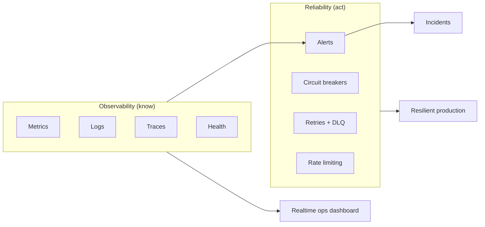

| Pillar | Capability | Core module |
| --- | --- | --- |
| **Metrics** | Counters/gauges/histograms, percentiles, Prometheus | `ops-core/metrics` |
| **Logs** | In-memory ring buffer log explorer | `LogBufferService` |
| **Traces** | Trace/span ids, W3C propagation | `ops-core/health` (trace model) + `TracingService` |
| **Health** | Deep dependency health + rollup | `ops-core/health` |
| **Alerts** | Rule evaluation with sustain windows | `ops-core/alerts` |
| **Circuit breakers** | Fail-fast on unhealthy dependencies | `ops-core/resilience` |
| **Retries + DLQ** | Background jobs with backoff | `ops-core/resilience` + `QueueService` |
| **Rate limiting** | Token bucket | `ops-core/resilience` |

### 1.3 The defining property: in-process and deterministic

The single most important architectural fact: **observability and reliability are in-process and deterministic.** Metrics, logs, traces, health, alerts, breakers, and the queue all run *inside the application process* — no external Prometheus, Jaeger, or broker is *required* for the platform to be observable and resilient. And the primitives are deterministic (time is injected), so they are exhaustively unit-testable, including chaos and recovery scenarios. The platform is production-observable out of the box, with a Prometheus exposition endpoint and an OTLP export path for teams that want external tooling. See [§2](#2-operations-philosophy) and [ADR-001](#25-architecture-decision-records).

### 1.4 Why in-process operations

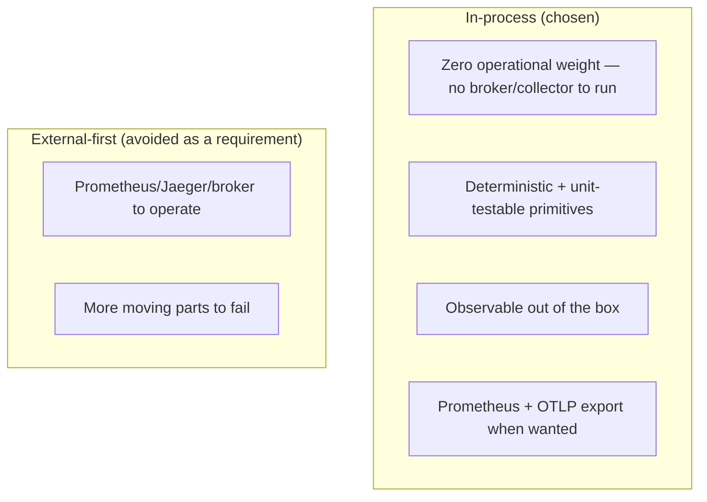

The platform is a single deployable (a modular monolith, [Backend §1](./BACKEND_ARCHITECTURE.md#1-backend-overview)), so in-process observability and resilience avoid the operational weight of running and securing external collectors and brokers — while still exposing standard formats (Prometheus text, OTLP) for teams that want them. This is the right default for a single-node-plus-replicas topology; the seams for external tooling are named and ready. See [ADR-001](#25-architecture-decision-records).

### 1.5 Scope

This document covers the operations platform (`ops-core` + `operations` module): every metric type, log pipeline, trace flow, health probe, alert rule, queue, circuit breaker, retry policy, rate limiter, the monitoring orchestrator, and the realtime dashboard. It references the subsystems it observes (wallet [§14](#14-runtime-monitoring)/[§18.4](#184-the-money-integrity-alerts), runtime, AI) and the deployment tier it monitors ([Backend §20](./BACKEND_ARCHITECTURE.md#20-deployment)).

---

## 2. Operations Philosophy

Six convictions shape the operations platform.

### 2.1 Deterministic, testable primitives

Every ops-core primitive injects the current time rather than reading the clock — *"All are deterministic — the current time is injected — so they are fully unit-testable (including chaos / recovery scenarios)."* This means a circuit breaker's open→half-open→closed transition, an alert's sustain-window firing, and a retry's backoff schedule can all be tested with an injected clock, deterministically. A production reliability primitive you can't test is a liability; determinism makes them provable. See [ADR-002](#25-architecture-decision-records).

### 2.1.1 The in-process choice, in prose

The decision to run observability and reliability *in-process* rather than as external infrastructure deserves fuller reasoning, because it runs against the "always use Prometheus + Jaeger + a broker" default. The reasoning rests on the platform's shape: it is a **single deployable** (a modular monolith), and for that shape, external observability infrastructure adds cost disproportionate to its benefit at the current scale:

- **Operational weight.** Running Prometheus, a Jaeger collector, and a message broker means three more systems to deploy, secure, monitor, back up, and keep available — each a potential failure of its own. For a platform where the app is one process, that's a large multiplier of operational surface.
- **The observability paradox.** External monitoring can fail independently of the app, creating blind spots exactly when you need visibility. In-process observability shares the app's fate — if the app is running, you can see it — which is often what you want during an incident.
- **Latency and simplicity.** In-process metrics are a function call, not a network round-trip. Recording a metric or checking a breaker costs nanoseconds, not a network hop.

The trade-offs are real and acknowledged: metrics are per-instance (not fleet-aggregated), and the queue isn't durable across restarts. But the platform provides the **seams** to close those gaps when scale demands — a Prometheus exposition endpoint for fleet aggregation, a W3C traceparent for distributed tracing, and a `QueueService` interface for a broker-backed swap ([§26](#26-future-operations-roadmap)). The philosophy is "observable and resilient out of the box, with a clear path to external tooling" — not "in-process forever." For a single-deployable platform, this is the pragmatic default. See [ADR-001](#25-architecture-decision-records).

### 2.2 In-process by default, exportable by choice

Observability runs inside the process (bounded memory, no external dependency) and exports standard formats (Prometheus text) for external scraping. The platform is fully observable with nothing extra to run, and integrates with external tooling when a team wants it. See [ADR-001](#25-architecture-decision-records).

### 2.3 Bounded memory

Every in-memory buffer is bounded: the histogram reservoir (4096 samples, ring), the log buffer (1000 entries, ring), the metric registry (one instance per name+labels). Memory stays **flat** regardless of traffic — a critical property for an in-process observability layer that must never become the cause of an out-of-memory incident. See [§5.3](#53-histograms--bounded-exact-percentiles).

### 2.4 Fail-fast, degrade gracefully

Circuit breakers fail fast when a dependency is unhealthy (a `503` rather than a pile-up), and the queue dead-letters after bounded retries rather than looping forever. Health rolls up so a degraded dependency reports `degraded`, not a binary up/down. The platform degrades in controlled steps, not cliffs. See [§11](#11-circuit-breakers), [§19](#19-failure-recovery).

### 2.5 Money integrity is a first-class ops signal

The alert rules treat financial integrity as critical: `failed-settlements` and `wallet-inconsistency` fire at strict thresholds (5 and **0**) with critical severity. The operations platform is not just about CPU and latency — it is the sentinel over the money. A single ledger imbalance pages someone. See [§18.4](#184-the-money-integrity-alerts) and [Wallet §19.3](./WALLET_ENGINE.md#193-reconciliation--the-trial-balance).

### 2.6 Pure core + backend wiring

The pattern is uniform across the platform: a pure core (`ops-core`) owns the primitives; a backend module wires them to real infrastructure. The intelligence (alert evaluation, breaker state machine, percentile math) is pure and testable; the wiring (sampling CPU, pinging Redis, broadcasting to the dashboard) is the backend's job. See [§3.4](#34-the-platform-wide-pure-core-pattern).

---

## 3. High-Level Operations Architecture

### 3.1 The observability + reliability stack

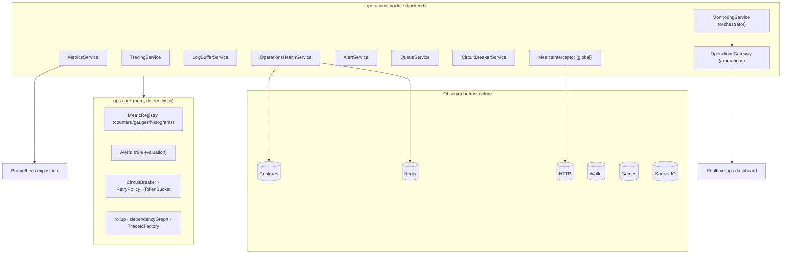

### 3.2 The monitoring loop

The heart of the platform is the `MonitoringService` sampling loop, which runs every 5 seconds:


This loop is the platform's pulse: every 5 seconds it refreshes system gauges, checks health, evaluates all alert rules against live values, and broadcasts the overview to the operations dashboard. A separate 1-second timer measures event-loop lag. See [§17.3](#173-the-monitoring-loop).

### 3.3 The request-path instrumentation

Every HTTP request is instrumented by the global `MetricsInterceptor`:

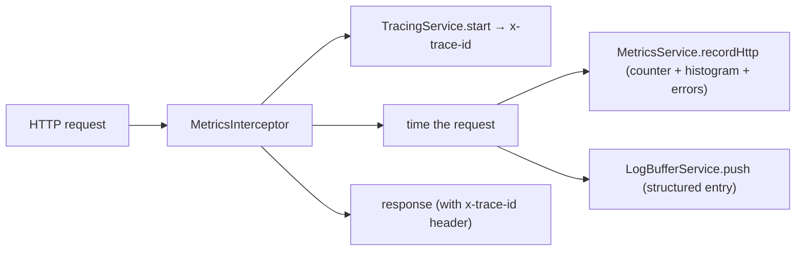

This is how metrics, traces, and logs are populated automatically for **every** endpoint — no per-controller instrumentation needed. See [§5.2](#52-the-http-instrumentation).

### 3.4 The platform-wide pure-core pattern

The operations platform is the fourth instance of a recurring pattern. Recognizing it makes the whole codebase legible:

| Domain | Pure core | Backend module | What the core owns |
| --- | --- | --- | --- |
| **Money** | `wallet-core` | `wallet-engine` | Balance algebra, conservation ([Wallet §1](./WALLET_ENGINE.md#1-executive-summary)) |
| **Games** | `game-sdk` | `runtime` | Lifecycle, determinism ([SDK §1](./GAME_ENGINE_SDK.md#1-executive-summary)) |
| **Intelligence** | `ai-core` | `ai` | Deterministic scoring ([AI §3.4](./AI_PLATFORM.md#34-the-platform-wide-pure-core-pattern)) |
| **Operations** | `ops-core` | `operations` | Metrics/alerts/resilience primitives |

In every case the pure core is dependency-free and exhaustively testable, and the backend module wires it to real infrastructure. For operations, the "proof" the core provides is *deterministic correctness of the primitives* — a breaker trips at exactly the configured threshold, an alert fires at exactly the sustain window, a percentile is exact. An engineer who understands one pure-core-plus-wiring subsystem understands all four.

---

## 4. Operations Module Overview

### 4.1 The module

`OperationsModule` is `@Global` — the observability and reliability services are available to every module without re-importing. Its docstring: *"Enterprise Operations, Monitoring, Reliability & Production platform. Global so the metrics interceptor and resilience/queue/metrics services are available to every module. Observability (metrics, tracing, logs), alerting, health, queues, circuit breakers and the realtime ops dashboard live here."*

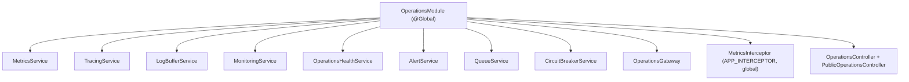

### 4.2 Service catalog

| Service | Purpose | Core module |
| --- | --- | --- |
| `MetricsService` | Central metric collection + derived rates | `MetricRegistry` |
| `TracingService` | Trace/span ids + W3C propagation | `TraceIdFactory` |
| `LogBufferService` | In-memory log explorer | — |
| `MonitoringService` | Sampling orchestrator + overview | (composes all) |
| `OperationsHealthService` | Deep dependency health | `rollup`, `dependencyGraph` |
| `AlertService` | Rule evaluation + incidents | `Alerts` |
| `QueueService` | Background jobs + retry + DLQ | `RetryPolicy` |
| `CircuitBreakerService` | Named breakers | `CircuitBreaker` |
| `MetricsInterceptor` | Global HTTP instrumentation | (uses MetricsService/Tracing/LogBuffer) |
| `OperationsGateway` | Realtime dashboard transport | — |

### 4.3 Exports & controllers

`OperationsModule` exports `MetricsService`, `TracingService`, `QueueService`, `CircuitBreakerService`, `LogBufferService`, and `AlertService` — so any module can record a metric, enqueue a job, or wrap a call in a breaker. It exposes `OperationsController` (`admin/operations`, gated) and `PublicOperationsController` (`operations`, a public status endpoint), plus the `/operations` gateway. See [§28.6](#286-endpoint-index).

### 4.4 The global interceptor

The `MetricsInterceptor` is registered as a global `APP_INTERCEPTOR`, so **every** HTTP request is timed, traced, metriced, and logged automatically ([Backend §6](./BACKEND_ARCHITECTURE.md#6-request-lifecycle)). This is what makes observability zero-effort for feature developers — they write endpoints; the interceptor observes them.

---

## 5. Metrics Platform

The metrics platform records counters, gauges, and histograms with exact percentiles, and exports Prometheus text — all from the pure `ops-core/metrics` module.

### 5.1 The three metric types

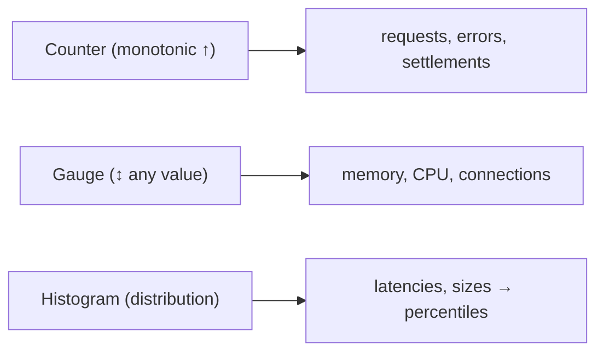

| Type | Behavior | Example |
| --- | --- | --- |
| `Counter` | monotonic increment (non-negative, throws on negative) | `http_requests_total`, `failed_settlements_total` |
| `Gauge` | set/inc/dec to any value | `memory_used_mb`, `cpu_percent`, `ws_connections` |
| `Histogram` | observe values → percentiles | `http_request_duration_ms` |

The `MetricRegistry` holds named, optionally-labelled metrics (`labelKey` sorts labels for a stable key like `http_requests_total{method="GET",route="/games"}`), and `getOrCreate` lazily creates each. `MetricsService` wraps a single registry.

### 5.2 The HTTP instrumentation

`MetricsService.recordHttp(method, route, status, durationMs)` records three metrics per request:

| Metric | Type | Recorded |
| --- | --- | --- |
| `http_requests_total{method,route,status}` | counter | every request |
| `http_request_duration_ms{method,route}` | histogram | every request's latency |
| `http_errors_total{route}` | counter | only when status ≥ 500 |

From these, `MetricsService` derives three key rates read by the dashboard and alerts:

| Derived | Computation |
| --- | --- |
| `errorRate()` | Σ `http_errors_total` / Σ `http_requests_total` (0..1) |
| `latencyP95()` | max p95 across all `http_request_duration_ms` histograms |
| `throughput()` | Σ `http_requests_total` |

### 5.3 Histograms — bounded, exact percentiles

The `Histogram` keeps a **bounded sample reservoir** (4096 samples) for exact percentiles: *"When full it overwrites oldest samples (ring), so memory is bounded while recent percentiles stay accurate."* Its `snapshot()` sorts once and reads p50/p90/p95/p99 plus count/sum/min/max/mean.

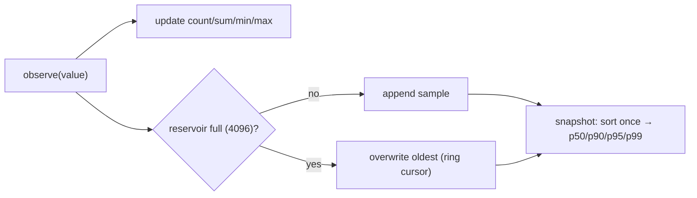

**Why a bounded reservoir:** exact percentiles require the samples, but keeping every sample forever would grow unbounded. The 4096-sample ring keeps memory flat while preserving accurate *recent* percentiles — the right trade-off for a live operational metric where the recent distribution matters most. A single sort per snapshot (not four) keeps snapshotting cheap. See [ADR-003](#25-architecture-decision-records).

### 5.4 Prometheus exposition

`MetricRegistry.prometheus()` emits standard Prometheus text: counters and gauges as lines, histograms as quantile series (`quantile="0.5|0.9|0.95|0.99"`) plus `_count` and `_sum`. This is served at `GET admin/operations/metrics/prometheus`, so an external Prometheus can scrape the platform if a team wants long-term metric storage and Grafana dashboards — the in-process metrics are the source, Prometheus is an optional consumer. See [§26](#26-future-operations-roadmap).

### 5.4.1 A worked metrics snapshot

After a burst of traffic, a `snapshot()` might look like this (illustrative):

```
counters:
  http_requests_total{method="GET",route="/games",status="200"}: 1420
  http_requests_total{method="POST",route="/wallet/settle",status="200"}: 380
  http_errors_total{route="/wallet/settle"}: 3
gauges:
  memory_used_mb: 512
  cpu_percent: 34.2
  event_loop_lag_ms: 4
histograms:
  http_request_duration_ms{method="GET",route="/games"}: { count: 1420, p50: 12, p95: 45, p99: 120, ... }
```

From this, `errorRate()` computes `3 / (1420 + 380 + 3) ≈ 0.0017` (0.17%), well under the 5% alert threshold. `latencyP95()` takes the max p95 across route histograms (45ms here). `throughput()` sums the request counters (1803). These three derived values feed the dashboard and the alert loop. The corresponding Prometheus exposition (`GET admin/operations/metrics/prometheus`) emits these as standard text — counters/gauges as lines and the histogram as `quantile="0.5|0.9|0.95|0.99"` series plus `_count` and `_sum` — so an external Prometheus scraping the endpoint sees a conformant metric set it can store and graph. The key point: the *same* in-process registry serves both the live dashboard (via `snapshot()`) and external Prometheus (via `prometheus()`), so there's one source of truth for metrics with two consumers. See [§5.4](#54-prometheus-exposition).

### 5.5 Label cardinality — the metric-registry hazard

A subtle but important operational rule: **each unique name+labels combination is a separate metric instance** in the registry (`labelKey` builds the key). This means label cardinality directly determines memory. A metric labelled by `route` and `method` has bounded cardinality (a handful of routes × a few methods = dozens of instances). But a metric labelled by `userId` would create a *new instance per user* — millions of them — blowing up the registry's memory. This is why the HTTP instrumentation labels by `method`, `route`, and `status` (all low-cardinality) and **never** by user or request id. High-cardinality dimensions (user id, trace id, wallet id) belong in **logs and traces** (where they're bounded by the ring buffer), not in metric labels. Getting this wrong is the classic way in-process metrics cause an out-of-memory incident — so the platform's convention is strict: low-cardinality labels only. See [§24.2](#242-bounded-resources).

### 5.6 Domain metrics

Beyond HTTP, any module records domain metrics via the exported `MetricsService`: `count(name, labels, by)` for counters (e.g. `wallet_settlements`, `game_rounds`, `failed_settlements_total`), `observe(name, value)` for domain latencies, and `gauge(name, value)` for domain gauges (`ws_connections`). This is how the wallet records settlement failures and the runtime records active runtimes — the metrics platform is a shared instrument every subsystem feeds. See [§14](#14-runtime-monitoring), [§18.4](#184-the-money-integrity-alerts).

---

## 6. Logging Architecture

Logging has two layers: durable structured logs (Winston, [Backend §18.6](./BACKEND_ARCHITECTURE.md#186-logging-redaction)) and an **in-memory log explorer** (`LogBufferService`) for live inspection.

### 6.1 The log buffer

`LogBufferService` is a bounded ring buffer (1000 entries) of recent structured `LogEntry` records: *"An in-memory ring buffer of recent structured log entries powering the Log Explorer. The metrics interceptor feeds request logs here; services can push notable events. Bounded so memory stays flat."*

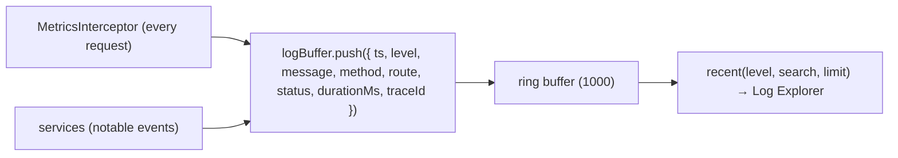

| Method | Purpose |
| --- | --- |
| `push(entry)` | append (ring-overwrite when full) |
| `recent({ level, search, limit })` | most-recent-first, filterable |
| `stats()` | total / errors / warnings counts |

### 6.2 The log entry shape

A `LogEntry` carries `ts`, `level` (info/warn/error), `message`, and request context (`method`, `route`, `status`, `durationMs`, `traceId`). The `traceId` is the crucial field — it links a log entry to its trace and to the request's metrics ([§7](#7-distributed-tracing)). So an operator investigating a slow request can find its log entry, its trace id, and its latency in one place.

### 6.3 The log explorer

`GET admin/operations/logs` serves `recent()` with optional `level` and `search` filters — a live log explorer for operators. Because it's an in-memory ring, it shows the **most recent** activity (the last ~1000 requests/events) with zero external log-aggregation infrastructure. For durable, searchable history, the Winston pipeline writes rotated JSON files with secret redaction ([Backend §18.6](./BACKEND_ARCHITECTURE.md#186-logging-redaction)); the log buffer is the *live* view, Winston is the *durable* record.

### 6.3.1 A worked log investigation

An operator gets a `high-error-rate` alert and wants to see what's erroring. They open the Log Explorer filtered to errors: `GET admin/operations/logs?level=error`. The `recent()` method returns the most-recent-first error entries from the ring buffer:

```
[error] POST /wallet/settle 500 +1240ms (traceId a1b2...)
[error] POST /wallet/settle 500 +980ms  (traceId c3d4...)
[error] GET  /games         500 +45ms   (traceId e5f6...)
```

Immediately the pattern is visible: most errors are on `/wallet/settle`, and they're **slow** (1240ms, 980ms) — suggesting the settlement path is timing out, not failing fast. The operator can narrow further with a search: `?level=error&search=settle` to see only settlement errors. Each entry carries a `traceId`, so a specific error can be correlated to its full trace. This is the Log Explorer's value: during an incident, an operator can filter thousands of recent log lines to the relevant errors in one query, spot the pattern (which route, how slow), and pivot to the trace — all in-process, with no external log-aggregation query language to learn. For the *pattern*, the live ring buffer is ideal; for a full historical audit, the durable Winston logs are there. See [§6.4](#64-why-two-log-layers).

### 6.4 Why two log layers

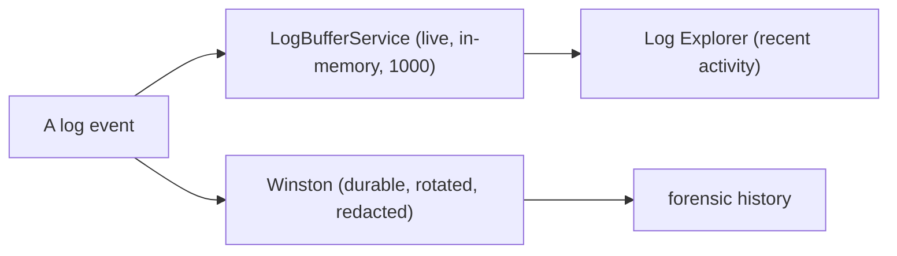

The two layers serve different needs: the ring buffer answers "what's happening right now?" (instant, in-process, no query), and Winston answers "what happened last Tuesday?" (durable, searchable, redacted). Splitting them means the live view is always fast and available even if durable logging has issues, and the durable record is complete even if the process restarts (clearing the ring). See [ADR-004](#25-architecture-decision-records).

---

## 7. Distributed Tracing

Tracing correlates a request across logs, metrics, and services via trace/span ids.

### 7.1 The trace model

`ops-core/health` defines a tiny trace model: a `TraceContext` is `{ traceId, spanId, parentSpanId? }`, and `TraceIdFactory` issues ids deterministically from a counter + seed (*"no Math.random for determinism in tests"*). The backend `TracingService` wraps it with a random per-process seed (`randomBytes(4)`).

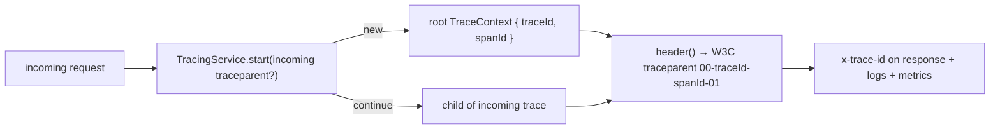

### 7.2 The tracing service

| Method | Purpose |
| --- | --- |
| `start(incomingTraceId?)` | start a root trace, or continue an incoming one |
| `child(parent)` | create a child span |
| `header(ctx)` | W3C-style `traceparent` (`00-<trace>-<span>-01`) |

The `MetricsInterceptor` calls `start(req.headers['x-trace-id'])` on every request, attaches the resulting `traceId` to the response header and to the log entry it pushes. So a request's trace id flows into its **log** (via the buffer entry) and its **response** (via the header), letting an operator correlate a client-reported request with its server-side log and metrics. See [§3.3](#33-the-request-path-instrumentation).

### 7.3 W3C propagation

The `header()` method produces a W3C-`traceparent`-compatible value (`00-<16-hex-trace>-<16-hex-span>-01`), so trace context can propagate to downstream services and be consumed by external tracing tools (Jaeger, an OTLP collector) that speak the standard. Today tracing is primarily *correlation within the process* (linking log↔metric↔response); the W3C format is the seam for full distributed tracing across services as the platform grows. See [§26](#26-future-operations-roadmap).

### 7.3.1 A worked trace correlation

Follow a single request through the correlation chain. A client reports "my wallet page was slow at 14:32." The request arrived with no incoming trace, so the interceptor started a root trace:

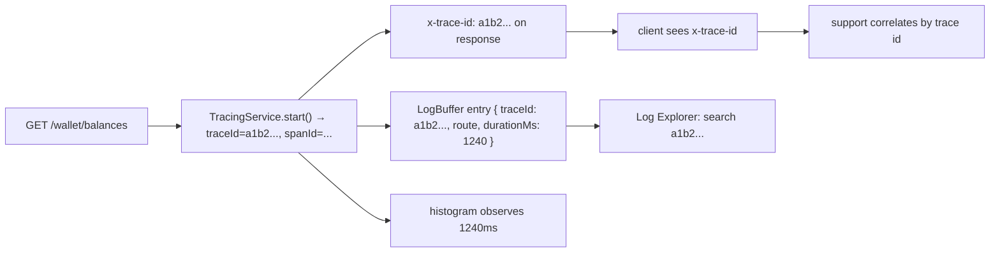

The **same trace id** appears in three places: the response header the client received, the log buffer entry (with the 1240ms duration), and — implicitly — alongside the metric that recorded the slow request. So an operator can take the trace id from the client's report, search the Log Explorer for it, and find the exact log entry showing the request took 1240ms on `/wallet/balances`. This is the value of correlation: a single id ties the client's experience to the server's record. Without it, "a request was slow at 14:32" is a needle in a haystack; with it, it's a direct lookup. The trace id flows automatically because the interceptor sets it on every request — no per-endpoint work.

### 7.4 Why deterministic ids

The `TraceIdFactory` generates ids from a counter + seed rather than randomness, so in tests the ids are predictable and assertions are exact. In production the seed is randomized per process (`randomBytes`), giving unique ids across instances. This is the same "deterministic for tests, seeded for production" pattern as the runtime's RNG ([SDK §21](./GAME_ENGINE_SDK.md#21-deterministic-rng)) — testability without sacrificing production uniqueness.

---

## 8. Health Monitoring

Health monitoring has two tiers: the shallow Terminus liveness/readiness probes ([Backend §15.4](./BACKEND_ARCHITECTURE.md#154-health-probes)) and the **deep operational health** in `OperationsHealthService`.

### 8.1 Deep health

`OperationsHealthService.check()` times each critical dependency and rolls them into an overall status plus the service dependency graph:

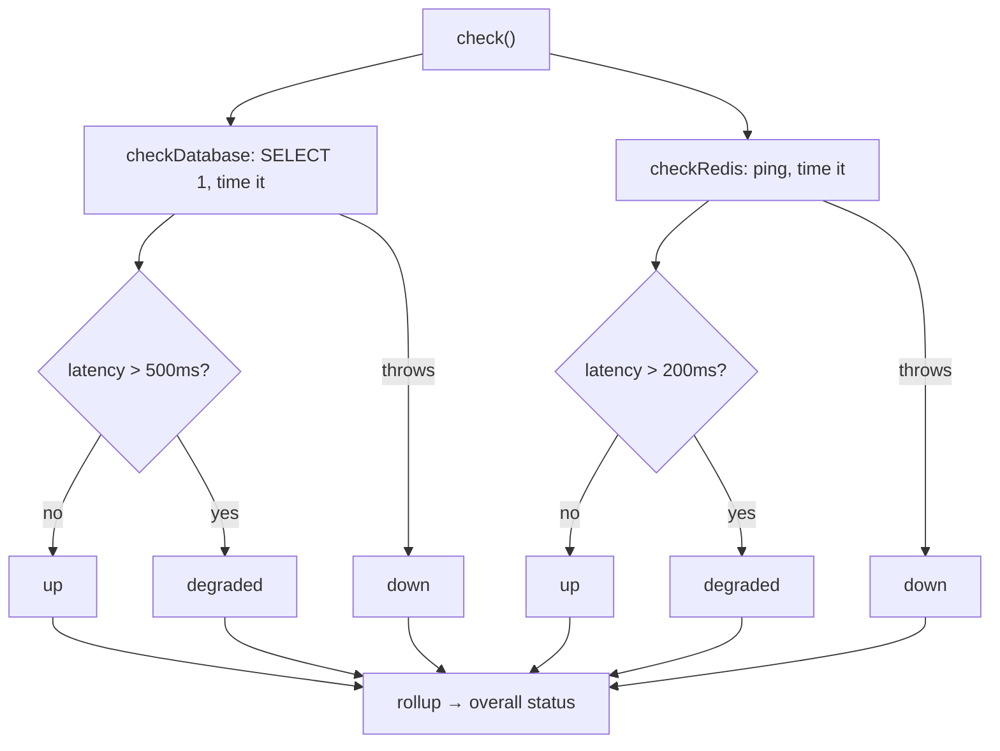

| Dependency | Check | up | degraded | down |
| --- | --- | --- | --- | --- |
| database | `SELECT 1` (timed) | latency ≤ 500ms | latency > 500ms | query throws |
| redis | `ping` (timed) | latency ≤ 200ms | latency > 200ms | ping fails/throws |

Note the **latency-based degradation**: a database that responds slowly is `degraded`, not `up` — a slow dependency is a warning, not a binary healthy/unhealthy. This catches the "everything's technically up but sluggish" state that precedes an outage.

### 8.2 The rollup

`rollup(deps)` from `ops-core/health` computes overall status: *if any critical dependency is `down` → `down`; else if any dependency is `down` or `degraded` → `degraded`; else `up`.* This is the standard health-aggregation logic: a critical failure fails the whole service, a non-critical issue degrades it, otherwise it's healthy.

### 8.3 The dependency graph

`dependencyGraph()` returns the static service dependency graph the dashboard renders:

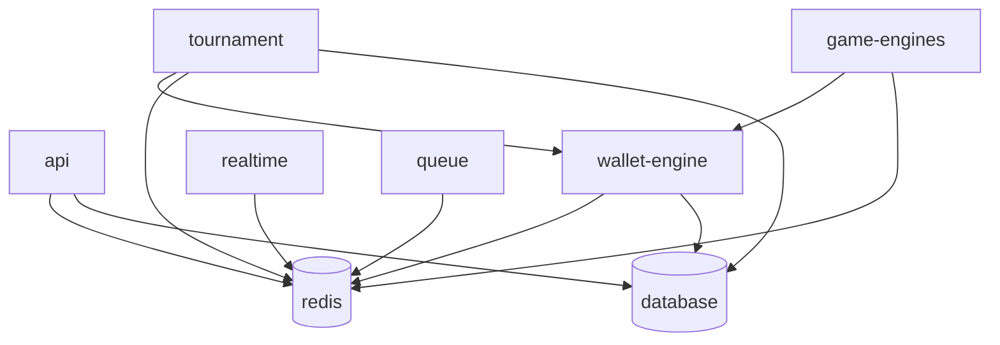

| Service | Depends on |
| --- | --- |
| `api` | database, redis |
| `wallet-engine` | database, redis |
| `game-engines` | redis, wallet-engine |
| `tournament` | database, redis, wallet-engine |
| `realtime` | redis |
| `queue` | redis |

This graph makes dependency chains explicit for operators: if Redis is down, the dashboard shows that api, wallet, games, tournament, realtime, and queue are all affected — an operator immediately understands the blast radius of a Redis outage. See [Backend §3.3](./BACKEND_ARCHITECTURE.md#33-module-dependency-graph).

### 8.3.1 A worked health rollup

Suppose a check returns: database `up` (12ms, critical), redis `degraded` (250ms, critical). The `rollup`:

| Rule | Applies? | Result |
| --- | --- | --- |
| any critical `down`? | no (none down) | — |
| any `down` or `degraded`? | yes (redis degraded) | → **degraded** |
| else | — | — |

Overall status is **degraded** — the platform is functional but a critical dependency (Redis) is slow. The dashboard shows this amber state, and because Redis is in the dependency graph feeding api/wallet/games/tournament/realtime/queue, the operator sees that everything downstream of Redis may be affected. Now suppose Redis fails entirely (`down`, critical): the first rule matches (a critical dependency is down) → overall **down**, and the `redis-down` alert fires. The rollup's three-tier logic (critical-down → down; any-issue → degraded; else up) gives operators a single honest status that distinguishes "slow" from "broken" — a distinction that matters, because a degraded platform can often self-recover while a down one needs intervention. See [ADR-011](#25-architecture-decision-records).

### 8.4 The public status endpoint

`GET operations/status` (public) returns a simple up/degraded/down — for external uptime monitors and status pages, without exposing internal detail. The deep health (`admin/operations/health`) is operator-gated.

---

## 9. Alerting System

Alerting evaluates configurable rules against live metric values and fires incidents when a breach is sustained.

### 9.1 The alert state machine

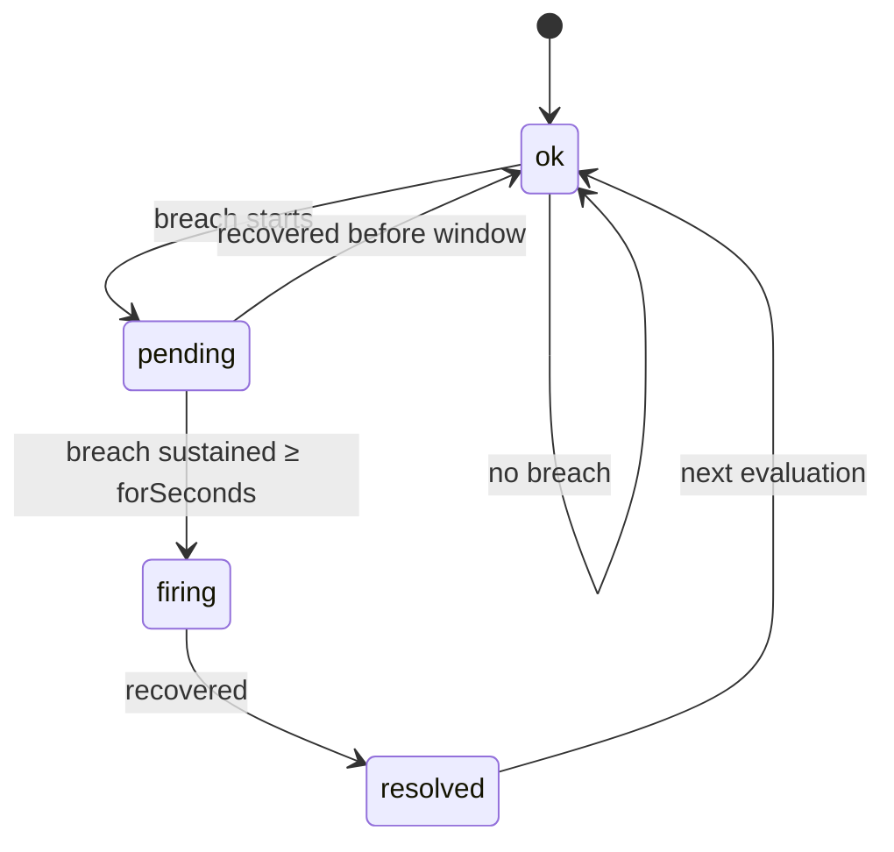

`Alerts.evaluate(rule, state, value, now)` advances an alert's state: on a breach it goes `ok → pending`, and only after the breach is sustained for `forSeconds` does it go `pending → firing`. On recovery a `firing` alert goes `resolved`. **Why the sustain window:** it prevents flapping — a momentary spike (one slow request) doesn't page anyone; only a *sustained* breach fires. A rule with `forSeconds: 0` fires immediately (used for binary conditions like `database_up < 1`). See [ADR-005](#25-architecture-decision-records).

### 9.2 The alert rule

An `AlertRule` is `{ id, name, metric, comparator, threshold, forSeconds, severity, enabled, description? }`. Comparators are `> >= < <= ==`; severities are `info | warning | critical`. The rule watches a **metric key** (matching a value in the monitoring loop's assembled values) and fires when `value <comparator> threshold` holds for `forSeconds`.

### 9.3 The ten default rules

`DEFAULT_ALERT_RULES` defines the platform's baseline monitoring:

| Rule | Metric | Condition | For | Severity |
| --- | --- | --- | --- | --- |
| high-error-rate | `error_rate` | > 0.05 | 60s | **critical** |
| high-latency | `latency_p95_ms` | > 1000 | 120s | warning |
| db-down | `database_up` | < 1 | 0s | **critical** |
| redis-down | `redis_up` | < 1 | 0s | **critical** |
| queue-backlog | `queue_backlog` | > 1000 | 120s | warning |
| memory-threshold | `memory_used_mb` | > 1536 | 120s | warning |
| cpu-threshold | `cpu_percent` | > 85 | 120s | warning |
| ws-disconnect-spike | `ws_disconnects` | > 100 | 60s | warning |
| failed-settlements | `failed_settlements` | > 5 | 60s | **critical** |
| wallet-inconsistency | `wallet_inconsistencies` | > 0 | 0s | **critical** |

The critical rules are the ones that page: an error-rate spike, a database/Redis outage, failed settlements, and — most strictly — **any** wallet inconsistency (threshold 0, immediate). See [§18.4](#184-the-money-integrity-alerts).

### 9.3.1 A worked alert timeline

Trace the `high-error-rate` rule (`error_rate > 0.05` for 60s, critical) through a real error spike. The monitoring loop evaluates every 5s:

| t (s) | error_rate | breaching? | breachedAt | sustained | status |
| --- | --- | --- | --- | --- | --- |
| 0 | 0.02 | no | null | — | ok |
| 5 | 0.08 | yes | 5 | 0s | **pending** |
| 10 | 0.09 | yes | 5 | 5s | pending |
| … | … | yes | 5 | … | pending |
| 65 | 0.07 | yes | 5 | 60s | **firing** → emit alert |
| 70 | 0.09 | yes | 5 | 65s | firing (no re-emit) |
| 120 | 0.03 | no | null | — | **resolved** → emit resolved |
| 125 | 0.02 | no | null | — | ok |

The alert goes `pending` the instant the error rate crosses 5% (t=5), but does **not** fire until the breach has been sustained for the full 60 seconds (t=65). This is the anti-flapping guarantee in action: a single bad 5-second window (say error_rate 0.08 at t=5 then back to 0.02 at t=10) would return to `ok` without ever paging anyone. Only a *genuine, sustained* problem fires. When it fires, the incident is emitted **once** (the t=70 evaluation sees it's already firing and doesn't re-emit). When the rate recovers (t=120), a single `resolved` event is emitted. This clean pending→firing→resolved lifecycle, driven purely by the injected `now` and the metric value, is why alerting is both responsive and quiet. See [ADR-005](#25-architecture-decision-records).

### 9.4 Configurable overrides

`AlertService.rules()` merges the defaults with admin overrides stored as `ApplicationSetting` (scope `alert-rule`, env `production`): *"Built-in rules plus admin-defined overrides … are evaluated against live metric values; sustained breaches fire incidents that broadcast to the alert center."* An operator can tune a threshold (e.g. raise the memory limit for a larger instance) or add a rule via `POST admin/operations/alerts` (`upsertRule`), persisted in the environment-scoped settings table ([Database §16](./DATABASE_ARCHITECTURE.md#16-administration-schema)) — so staging and production have independent alert configs.

### 9.5 The evaluation pipeline

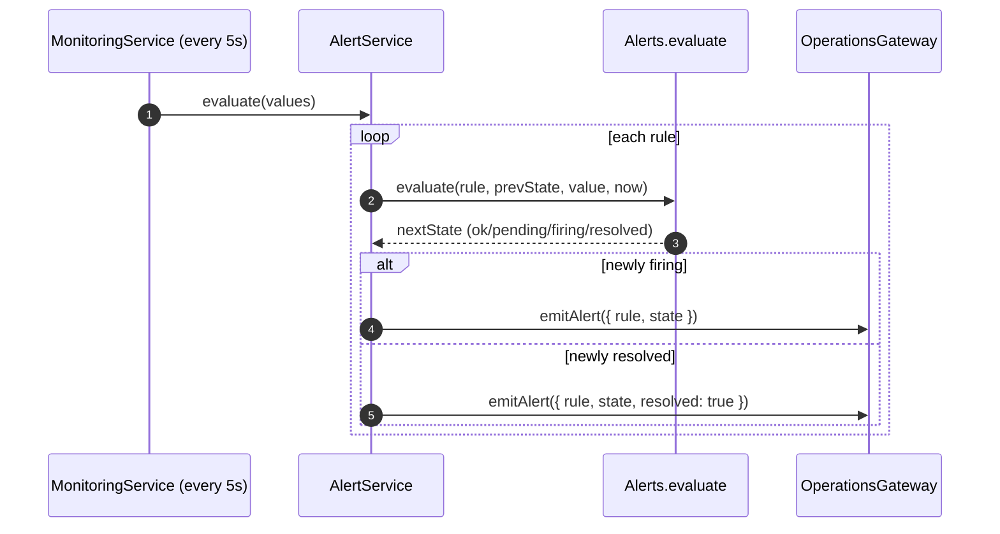

`AlertService.evaluate(values)` runs every rule through `Alerts.evaluate`, tracks per-rule state, and on a *transition* into firing (or out of it) broadcasts to the alert center via the gateway. Only **transitions** emit — a rule that's been firing for 10 minutes doesn't re-emit every 5 seconds. `activeIncidents()` returns the currently-firing set (consumed by the dashboard and the AI assistant's alert summary, [AI §10.4](./AI_PLATFORM.md#104-fact-builders)).

---

## 10. Queue & Background Jobs

The platform runs an **in-process background job queue** with retries, exponential backoff, and a dead-letter queue — no external broker required.

### 10.1 The queue model

`QueueService` is *"A lightweight, dependency-free background job queue with retries, exponential backoff and a dead-letter queue. Workers are registered per queue; a single poll loop drains due jobs. Suitable for settlement retries, notifications and batch processing without pulling in an external broker."*

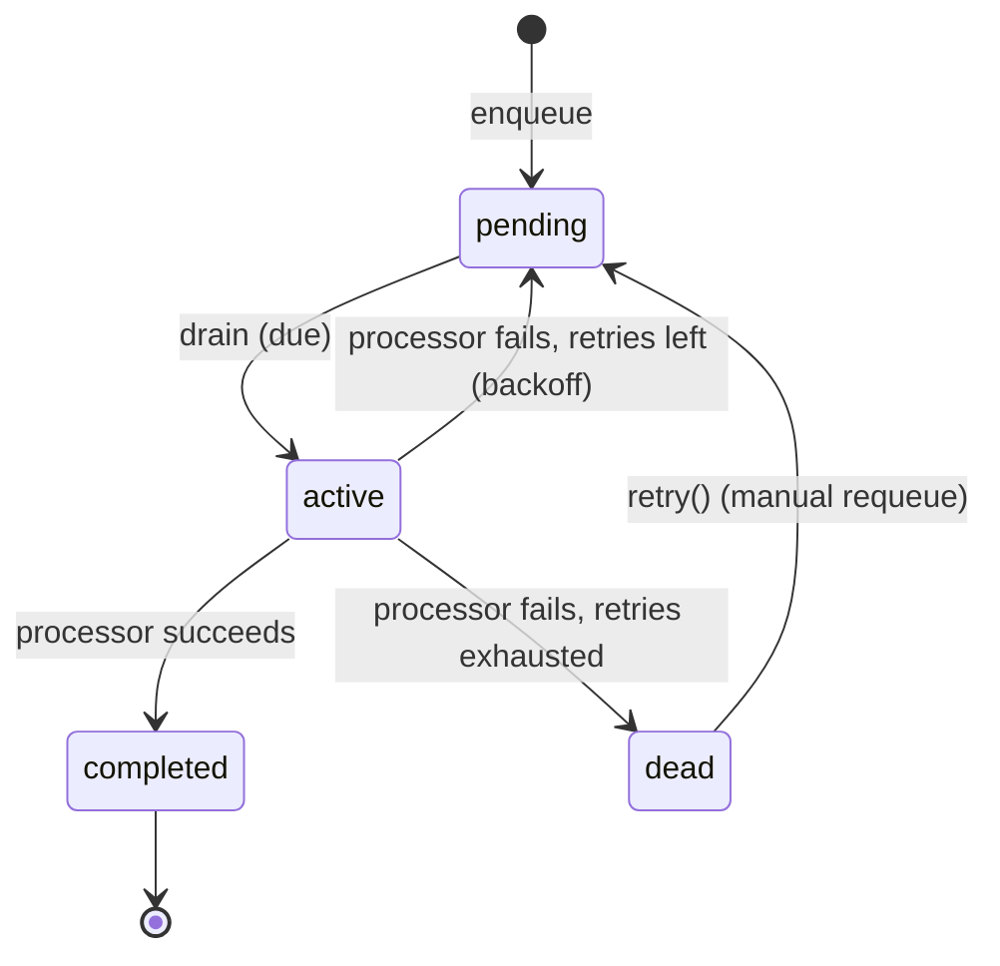

| Status | Meaning |
| --- | --- |
| `pending` | awaiting processing (runnable at `nextRunAt`) |
| `active` | being processed |
| `completed` | succeeded |
| `failed` | (transient) |
| `dead` | exhausted retries — in the dead-letter queue |

### 10.2 The API

| Method | Purpose |
| --- | --- |
| `process(queue, processor)` | register a worker for a queue |
| `enqueue(queue, payload, opts)` | add a job (returns id) |
| `enqueueBatch(queue, payloads)` | add many |
| `drain(now)` | process due jobs once (deterministic, testable) |
| `stats()` | queues, backlog, byStatus, deadLetter count |
| `deadLetters()` | list dead-letter jobs |
| `retry(jobId)` | requeue a dead job |

### 10.3 The drain loop

A single poll loop runs every 250ms (`drain()`), processing every `pending` job whose `nextRunAt` has passed:

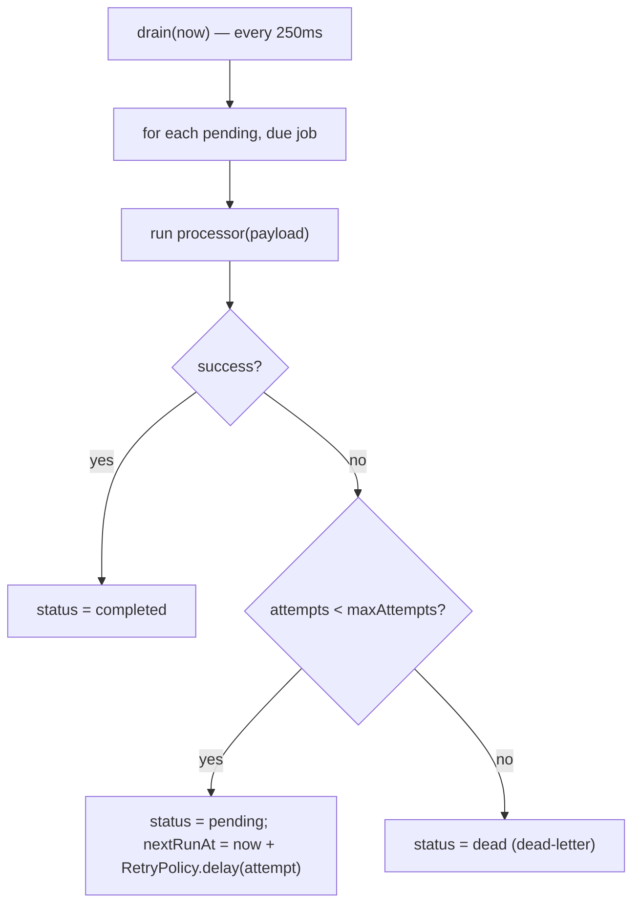

On failure, the job is either **retried with backoff** (`RetryPolicy.delay` — see [§12](#12-retry-policies)) or **dead-lettered** when retries are exhausted. The `drain` method is exposed for **deterministic testing** — a test can call `drain(fixedNow)` and assert the job's state, without waiting for the timer.

### 10.3.1 A worked queue job — a settlement retry

Suppose a game settlement fails transiently (a momentary DB blip). It's enqueued to a `settlement-retry` queue and drained:

| Drain at t | attempts | processor | outcome |
| --- | --- | --- | --- |
| 0ms | 1 | fails (DB blip) | pending, nextRunAt = 500ms |
| 250ms | — | not due yet (250 < 500) | skipped |
| 500ms | 2 | fails (still blipping) | pending, nextRunAt = 500+1000 = 1500ms |
| 1500ms | 3 | **succeeds** (DB recovered) | **completed** |

The job retries with exponential backoff (500ms, then 1000ms), giving the database time to recover between attempts. The 250ms poll skips the job while `nextRunAt` is in the future, then runs it when due. Because the settlement operation is **idempotent** ([Wallet §15](./WALLET_ENGINE.md#15-idempotency)), the retries are safe — even if attempt 2 had partially succeeded before failing, attempt 3 returns the original result rather than double-settling. Had all three attempts failed, the job would `dead`-letter for operator inspection rather than retrying forever. This is exactly the settlement-retry use case the queue was built for: a transient failure recovers automatically with backoff, and a persistent failure surfaces to a human. See [§12.4](#124-retry--idempotency).

### 10.4 Dead-letter handling

Jobs that exhaust their retries become `dead` and are held in the dead-letter queue rather than discarded. Operators can inspect them (`GET admin/operations/queue` shows `deadLetter` count; `deadLetters()` lists them) and manually requeue (`POST admin/operations/queue/:jobId/retry` → `retry()` resets attempts and re-enqueues). This is the standard DLQ pattern: a persistently-failing job doesn't loop forever (which would waste resources and hide the failure) — it parks in the DLQ for human investigation. See [ADR-006](#25-architecture-decision-records).

### 10.5 Why in-process, and its limits

The in-process queue avoids running and operating an external broker (Redis Streams, BullMQ, RabbitMQ) — appropriate for a single deployable handling settlement retries and notifications. Its honest limitation is **durability**: jobs live in process memory, so a restart loses `pending`/`dead` jobs. This is acceptable for the current use cases (retryable, idempotent operations that can be re-triggered), and the documented upgrade path is a broker-backed queue behind the same `QueueService` interface when durability is required ([§26](#26-future-operations-roadmap), [Wallet §28](./WALLET_ENGINE.md#28-future-wallet-roadmap)).

---

## 11. Circuit Breakers

Circuit breakers protect calls to fragile dependencies by failing fast when a dependency is unhealthy — preventing a slow/failing dependency from cascading into a platform-wide pile-up.

### 11.1 The state machine

```mermaid
stateDiagram-v2
    [*] --> closed
    closed --> open: failureThreshold consecutive failures
    open --> half-open: after openMs cooldown (trial request)
    half-open --> closed: successThreshold consecutive successes
    half-open --> open: any failure
    closed --> closed: success (resets failures)
```

`CircuitBreaker` (`ops-core/resilience`) is a classic three-state breaker:

| State | Behavior |
| --- | --- |
| `closed` | requests pass; consecutive failures counted |
| `open` | requests rejected (fail fast) until `openMs` cooldown elapses |
| `half-open` | one trial request allowed; successes close it, a failure re-opens it |

### 11.2 The transitions

- **closed → open:** `failureThreshold` (default 5) consecutive failures trip the breaker (`trip` records `openedAt`).
- **open → half-open:** `canRequest(now)` transitions to `half-open` once `now - openedAt >= openMs` (default 10000ms), allowing a trial.
- **half-open → closed:** `successThreshold` (default 2) consecutive successes close it.
- **half-open → open:** any failure in half-open immediately re-trips.

All transitions inject `now`, so the full lifecycle — including the cooldown and recovery — is deterministically testable. See [§2.1](#21-deterministic-testable-primitives).

### 11.3 The breaker service

`CircuitBreakerService` is a registry of named breakers with `execute(name, fn, config?)`:

```mermaid
flowchart TD
    EXEC["execute(name, fn)"] --> CAN{"canRequest(now)?"}
    CAN -->|no (open)| REJECT["throw 503 ServiceUnavailable"]
    CAN -->|yes| RUN["await fn()"]
    RUN --> OK{"success?"}
    OK -->|yes| SUCC["recordSuccess()"]
    OK -->|no| FAIL["recordFailure(now); rethrow"]
```

`execute` wraps a call: if the breaker is open it throws a `503` immediately (never even attempting the call); otherwise it runs `fn`, records success/failure, and rethrows on error. `states()` returns all breaker states for the dashboard (`GET admin/operations/circuits`). The default config is `{ failureThreshold: 5, successThreshold: 2, openMs: 10000 }`.

### 11.3.1 The named-breaker registry

Breakers are **named and lazily created** — the first `execute('payment-gateway', ...)` creates a breaker for that name; subsequent calls reuse it. This means each fragile dependency gets its **own independent breaker**: a failing payment gateway opens the `payment-gateway` breaker without affecting the `email-provider` breaker. The naming is the isolation boundary — one dependency's outage can't trip another's breaker. `states()` exposes every named breaker's current state, so the dashboard shows, at a glance, which dependencies are healthy (closed), failing (open), or recovering (half-open). An operator seeing `{ "payment-gateway": "open", "email-provider": "closed" }` immediately knows payments are being short-circuited while email is fine. Per-dependency config is supported (`execute(name, fn, config)`), so a flakier dependency can have a more tolerant threshold or a longer cooldown. This registry pattern — named, isolated, independently-configurable breakers — is what lets one platform protect calls to many different fragile dependencies without them interfering.

### 11.4 Why fail fast

```mermaid
flowchart LR
    subgraph NoBreaker["Without a breaker"]
        A["dependency slow/failing"] --> B["every call waits/fails"] --> C["threads/connections pile up"] --> D["cascading failure"]
    end
    subgraph Breaker["With a breaker"]
        E["dependency fails 5×"] --> F["breaker opens → fail fast (503)"] --> G["dependency recovers in cooldown"] --> H["half-open trial → close"]
    end
```

The purpose is to **stop a failing dependency from taking down the caller**. Without a breaker, a slow third-party API means every request waits on it, exhausting the request pool. With a breaker, after a few failures the calls fail fast (503) — freeing resources, giving the dependency time to recover, and periodically probing (half-open) until it's healthy again. This is the standard resilience pattern for protecting a service from its dependencies. See [ADR-007](#25-architecture-decision-records).

### 11.5 A worked breaker scenario

Trace a payment-gateway breaker (defaults: 5 failures / 2 successes / 10s cooldown) through an outage and recovery. Time in ms:

| t | event | state | failures / successes |
| --- | --- | --- | --- |
| 0 | call fails ×5 | closed → **open** (at 5th) | failures=5 → trip, openedAt=t |
| 2000 | call attempted | open → reject **503** | (canRequest: 2000 < openedAt+10000) |
| 8000 | call attempted | open → reject 503 | still in cooldown |
| 10000 | call attempted | open → **half-open** | cooldown elapsed → trial allowed |
| 10000 | trial succeeds | half-open | successes=1 |
| 10500 | call succeeds | half-open → **closed** | successes=2 → close, failures=0 |

The breaker opens after 5 consecutive failures, then **rejects every call for 10 seconds** without even attempting them — this is the crucial protection: during the gateway's outage, the platform doesn't waste resources (threads, connections, timeouts) on calls that will fail. At t=10000 the cooldown elapses and the breaker allows a single **trial** request (half-open). If the trial and one more succeed, the breaker closes and normal operation resumes. But if the trial had **failed** (gateway still down), the breaker would immediately re-open for another 10s — probing periodically without hammering a still-broken dependency. Every transition here is driven by the injected `now`, so this exact scenario is a unit test: fail 5 times, assert open; advance 10s, assert half-open; succeed twice, assert closed. The platform's most important resilience behavior is *verified*, not assumed. See [§22.3](#223-the-deterministic-time-advantage).

---

## 12. Retry Policies

Retries handle *transient* failures by re-attempting with exponential backoff — used by the queue and available for any retryable operation.

### 12.1 The retry policy

`RetryPolicy` (`ops-core/resilience`) computes backoff deterministically:

| Function | Purpose |
| --- | --- |
| `delay(attempt, config)` | backoff (ms) before attempt N, capped at `maxDelayMs` |
| `shouldRetry(attempt, config)` | whether attempt N is allowed |
| `schedule(config)` | the full delay schedule (for tests/docs) |

The delay formula is `baseDelayMs × factor^(attempt-1)`, capped at `maxDelayMs`.

### 12.2 The default schedule

The queue's `DEFAULT_RETRY` is `{ maxAttempts: 3, baseDelayMs: 500, factor: 2, maxDelayMs: 30000 }`, producing the schedule:

```mermaid
flowchart LR
    A1["attempt 1 fails"] --> D1["wait 500ms"]
    D1 --> A2["attempt 2 fails"] --> D2["wait 1000ms"]
    D2 --> A3["attempt 3 fails"] --> DEAD["dead-letter"]
```

| Attempt | Delay before it |
| --- | --- |
| 1 | (immediate) |
| 2 | 500ms |
| 3 | 1000ms |
| (exhausted) | → dead-letter |

### 12.3 Why exponential backoff

Exponential backoff (doubling delay each attempt) is the standard for transient failures: it gives a struggling dependency **increasing breathing room** between retries, avoiding a thundering-herd retry storm that would keep the dependency down. The `maxDelayMs` cap (30s) prevents the delay from growing absurdly. Bounded `maxAttempts` (3) ensures a persistently-failing job dead-letters rather than retrying forever. Because the delay is a pure function of the attempt number, the whole schedule is testable and documentable (`schedule()`). See [ADR-008](#25-architecture-decision-records).

### 12.3.1 The schedule as documentation

`RetryPolicy.schedule(config)` returns the full list of delays a policy will use — *"useful for tests / docs."* For the default `{ maxAttempts: 3, baseDelayMs: 500, factor: 2, maxDelayMs: 30000 }` it returns `[500, 1000]` (the delays before attempts 2 and 3). This is a small but valuable design touch: the retry behavior is not hidden inside the drain loop — it's a pure function you can call to *see* exactly what will happen. A test asserts `schedule(config)` equals `[500, 1000]`; a runbook documents the exact backoff an operator should expect. Consider a more aggressive policy `{ maxAttempts: 5, baseDelayMs: 1000, factor: 3, maxDelayMs: 30000 }`: `schedule` returns `[1000, 3000, 9000, 27000]` — each delay triples until the 30s cap would bite. Being able to compute and assert the schedule turns "retries with backoff" from a vague promise into a precise, testable, documented contract. See [ADR-008](#25-architecture-decision-records).

### 12.4 Retry + idempotency

Retries are only safe for **idempotent** operations — which is why the wallet engine's operations carry idempotency keys ([Wallet §15](./WALLET_ENGINE.md#15-idempotency)). A retried settlement returns the original result rather than double-applying, so the queue can safely retry a failed settlement job. The retry policy provides the *when* (backoff); idempotency provides the *safety*. Together they make at-least-once job delivery correct.

---

## 13. Rate Limiting

Rate limiting protects the platform from abuse and overload. There are two layers: the global HTTP throttler ([Backend §18.4](./BACKEND_ARCHITECTURE.md#184-rate-limiting--replay-protection)) and the reusable **token-bucket** primitive in `ops-core`.

### 13.1 The token bucket

`TokenBucket` (`ops-core/resilience`) is a classic token-bucket limiter with continuous refill:

```mermaid
flowchart LR
    REFILL["tokens refill at refillPerSecond (continuous, time-injected)"] --> BUCKET["bucket (capacity max)"]
    REQ["tryRemove(now, count)"] --> CHECK{"tokens ≥ count?"}
    CHECK -->|yes| ALLOW["consume tokens → allowed"]
    CHECK -->|no| DENY["denied"]
```

| Method | Purpose |
| --- | --- |
| constructor | `(capacity, refillPerSecond, now)` |
| `tryRemove(now, count)` | attempt to consume tokens; returns allowed |
| `available(now)` | current token count |

`refill(now)` adds `elapsed × refillPerSecond` tokens (capped at capacity) based on injected time — so the bucket refills continuously and deterministically.

### 13.2 Why token bucket

A token bucket allows **bursts up to capacity** while enforcing an average rate (the refill rate) — the right model for rate limiting, where you want to permit a legitimate burst of activity but cap sustained throughput. It's superior to a fixed-window counter (which allows 2× the limit at a window boundary) and simpler than a sliding-window log. Because time is injected, the limiter is testable — a test advances `now` and asserts exactly when tokens refill and requests are allowed/denied. See [ADR-009](#25-architecture-decision-records).

### 13.2.1 A worked rate-limit scenario

Consider a bucket with `capacity 10, refillPerSecond 2` protecting a sensitive endpoint. A client bursts 10 requests instantly, then keeps hitting it:

| t (ms) | tokens before | request | tokens after |
| --- | --- | --- | --- |
| 0 | 10 | ×10 allowed | 0 |
| 0 | 0 | ×1 | **denied** |
| 500 | 1 (refilled 0.5s × 2) | ×1 allowed | 0 |
| 1000 | 1 | ×1 allowed | 0 |
| 5000 | 8 (idle 4s × 2, capped at 10) | ×1 allowed | 7 |

The bucket permits the **initial burst of 10** (up to capacity), then throttles to the sustained **refill rate of 2/second** — one request every 500ms. When the client goes idle (t=1000 to t=5000), tokens refill (8 tokens after 4 idle seconds), so a later burst is again permitted up to capacity. This burst-then-sustain behavior is exactly right for rate limiting: it doesn't punish a legitimate flurry of activity, but it caps sustained abuse. Because `now` is injected, this whole scenario is a deterministic test — advance time, assert allowed/denied — verifying the limiter behaves exactly as specified across time. See [ADR-009](#25-architecture-decision-records).

### 13.3 The global HTTP throttler

At the HTTP edge, the global `ThrottlerGuard` enforces `RATE_LIMIT_LIMIT` requests per `RATE_LIMIT_TTL` per client ([Backend §18.4](./BACKEND_ARCHITECTURE.md#184-rate-limiting--replay-protection)) — the first line of defense against brute force and scraping. The `ops-core` `TokenBucket` is the reusable primitive available for finer-grained, per-resource limiting where a service needs it. Together they provide layered rate control from the network edge inward.

---

## 14. Runtime Monitoring

The operations platform observes the game runtime by consuming the metrics the runtime emits and surfacing runtime-specific signals.

### 14.1 Runtime signals

| Signal | Source | Ops surface |
| --- | --- | --- |
| Active runtimes | `ActiveRuntimeService.activeCount()` | runtime health ([Runtime §18.1](./GAME_RUNTIME.md#181-health)) |
| Registered plugins | plugin registry | runtime health |
| WS disconnects | `ws_disconnects_total` counter | `ws-disconnect-spike` alert |
| Failed settlements | `failed_settlements_total` counter | `failed-settlements` alert (critical) |

### 14.2 The runtime's own health

The runtime exposes `GET /runtime/health` ([Runtime §18](./GAME_RUNTIME.md#18-monitoring)) reporting Redis reachability, plugin count, and active-runtime count. This complements the operations platform's deep health — the runtime reports its *domain* health, the operations platform reports *infrastructure* health, and together they give a complete picture. A settlement failure that reaches money is surfaced at **critical** severity, treating the runtime as part of the financial-integrity surface ([Runtime §18.3.1](./GAME_RUNTIME.md#1831-alerts)).

### 14.3 Metrics the runtime feeds

The runtime records domain metrics via the exported `MetricsService`: settlement outcomes, round counts, and disconnect events increment counters that the monitoring loop reads into the alert values (`ws_disconnects`, `failed_settlements`). This is how a runtime problem becomes an operations alert — the runtime instruments its critical events, and the operations platform watches those metrics against thresholds. See [§5.5](#55-domain-metrics).

---

## 15. Infrastructure Monitoring

The operations platform monitors the process and its infrastructure dependencies via the `MonitoringService` sampling loop.

### 15.1 System metrics

`MonitoringService.system()` samples the Node process:

| Metric | Source |
| --- | --- |
| `uptimeSeconds` | `process.uptime()` |
| `memoryUsedMb` | `process.memoryUsage().rss` |
| `memoryTotalMb` | `heapTotal` |
| `cpuPercent` | `process.cpuUsage()` delta / elapsed / cores |
| `eventLoopLagMs` | measured by a 1s timer |
| `pid` | `process.pid` |

### 15.2 Event-loop lag

A dedicated 1-second timer measures **event-loop lag**: it schedules a callback for `now + 1000` and measures how late it actually fires (`now - expected`). A high lag means the event loop is blocked (a CPU-heavy operation starving async work) — a key Node.js health signal that raw CPU% doesn't capture. This is surfaced as the `event_loop_lag_ms` gauge and on the dashboard.

```mermaid
flowchart LR
    T["timer scheduled for now+1000"] --> FIRE["actually fires at T'"]
    FIRE --> LAG["lag = max(0, T' - expected)"]
    LAG --> GAUGE["event_loop_lag_ms gauge"]
    LAG --> SIGNAL["high lag ⇒ blocked event loop"]
```

### 15.3 CPU measurement

`cpuPercent` is computed from the `process.cpuUsage()` delta over the sampling interval, divided by elapsed time and core count, capped at 100. Measuring the *delta* (not cumulative) gives the CPU usage *during the interval*, and dividing by cores normalizes to a percentage of total capacity. This feeds the `cpu-threshold` alert (> 85% for 120s).

### 15.4 Dependency latency

Infrastructure health ([§8](#8-health-monitoring)) times the database (`SELECT 1`) and Redis (`ping`) on every check, so the dashboard shows not just up/down but **how fast** each dependency responds — with latency-based degradation catching slow dependencies before they fail outright.

---

## 16. WebSocket Monitoring

The platform's nine Socket.IO gateways ([Backend §11](./BACKEND_ARCHITECTURE.md#11-websocket-architecture)) are monitored via connection metrics and a dedicated operations dashboard gateway.

### 16.1 The operations dashboard gateway

`OperationsGateway` (`/operations` namespace) is the real-time transport for the ops dashboard. It authenticates at the handshake (via `verifyAccessToken`), joins operators to a room, and pushes live updates:

| Emit | Event | Payload |
| --- | --- | --- |
| `emitOverview` | `operations:overview` | the full monitoring overview (every 5s) |
| `emitAlert` | `operations:alert` | a fired/resolved incident |
| heartbeat | `operations:heartbeat:ack` | latency |

```mermaid
flowchart LR
    MON["MonitoringService (5s loop)"] --> OVER["emitOverview → operations:overview"]
    ALS["AlertService (on transition)"] --> AL["emitAlert → operations:alert"]
    OVER & AL --> ROOM["/operations room"]
    ROOM --> DASH["operator dashboards (live)"]
```

The dashboard receives a fresh overview every 5 seconds and an immediate push when an alert fires or resolves — so operators see the platform's state in real time without polling.

### 16.2 WebSocket health signals

| Signal | Metric | Alert |
| --- | --- | --- |
| Disconnect spike | `ws_disconnects` | `ws-disconnect-spike` (> 100 for 60s, warning) |
| Connections | `ws_connections` gauge | dashboard |

A surge in WebSocket disconnects (`ws-disconnect-spike`) is a warning signal — it suggests a network, gateway, or load problem affecting real-time play ([Runtime §18.3.1](./GAME_RUNTIME.md#1831-alerts)). Because so much of the platform is real-time (game runtimes, live wallet balances, the ops dashboard itself), disconnect health is a meaningful operational signal.

### 16.2.1 The nine gateways under observation

The platform runs nine Socket.IO gateways ([Backend §11.1](./BACKEND_ARCHITECTURE.md#111-namespaces)) — `/runtime`, `/wallet`, `/crash`, `/dice`, `/roulette`, `/sports`, `/tournament`, `/notifications`, and `/operations` itself. Each is a real-time channel whose health matters:

| Gateway | Real-time payload | If it degrades |
| --- | --- | --- |
| `/runtime` | live game events | players lose in-progress games |
| `/wallet` | balance/settlement pushes | balances appear stale |
| `/crash` etc. | game round streams | game UIs freeze |
| `/tournament` | leaderboard updates | rankings lag |
| `/notifications` | user notifications | notifications delayed |
| `/operations` | the ops dashboard | operators lose visibility |

The `ws_disconnects` metric aggregates disconnects across all of them, so a spike (the `ws-disconnect-spike` alert) indicates a systemic real-time problem — a network issue, a load spike, or a gateway fault — affecting live play across the board. Because the platform is so real-time-heavy, WebSocket health is not a niche concern; a real-time transport problem degrades the core player experience. The `/operations` gateway is itself monitored (it's one of the nine), which is a nice recursion: if the ops dashboard's own transport degraded, the disconnect metric would still record it, visible on reconnection.

### 16.3 Gateway authentication monitoring

All gateways authenticate at the handshake and disconnect unauthenticated sockets ([Backend §11.2](./BACKEND_ARCHITECTURE.md#112-authentication-on-connect)). Failed handshakes and forced disconnects are observable through logs and the disconnect metric, so an attack (mass unauthenticated connection attempts) would surface as a disconnect spike and log volume.

---

## 17. Performance Monitoring

Performance monitoring rests on the derived HTTP rates and the system sampling loop.

### 17.1 The performance dashboard signals

`MonitoringService.overview()` assembles the operator's performance view:

| Signal | Source |
| --- | --- |
| `api.throughput` | `MetricsService.throughput()` |
| `api.errorRate` | `MetricsService.errorRate()` |
| `api.latencyP95Ms` | `MetricsService.latencyP95()` |
| `system` | memory, CPU, event-loop lag |
| `queue` | backlog, byStatus |
| `circuits` | breaker states |
| `alerts` | active incidents |

This single `overview` object is the dashboard's data model — health status, system metrics, API performance, queue state, circuit states, and active incidents in one payload, refreshed every 5 seconds.

### 17.2 The performance alert thresholds

Performance is guarded by alert rules: `high-latency` (p95 > 1000ms for 120s), `high-error-rate` (> 5% for 60s), `memory-threshold` (> 1536MB for 120s), `cpu-threshold` (> 85% for 120s), `queue-backlog` (> 1000 for 120s). These encode the platform's performance SLOs as monitored thresholds — a sustained breach of any is a signal that performance has degraded past acceptable. See [§9.3](#93-the-ten-default-rules).

### 17.3 The monitoring loop

```mermaid
sequenceDiagram
    autonumber
    participant TIMER as sampleTimer (5s)
    participant MON as MonitoringService
    participant MS as MetricsService
    participant OH as OperationsHealthService
    participant QS as QueueService
    participant ALS as AlertService
    participant GW as OperationsGateway
    TIMER->>MON: sample()
    MON->>MON: system() — memory, CPU, event-loop lag
    MON->>MS: gauge(memory/cpu/lag)
    MON->>OH: check() — DB + Redis health
    MON->>QS: stats() — backlog
    MON->>MON: assemble values { error_rate, latency_p95, database_up, redis_up, queue_backlog, ... }
    MON->>ALS: evaluate(values)
    MON->>GW: emitOverview(overview)
```

Every 5 seconds the loop refreshes gauges, checks health, assembles the alert values (including money-integrity counters `failed_settlements` and `wallet_inconsistencies`), evaluates all rules, and broadcasts. This single loop is the engine behind alerting and the live dashboard. See [§3.2](#32-the-monitoring-loop).

### 17.3.1 The overview as the single dashboard model

A deliberate design choice is that the entire operations dashboard is driven by **one** payload — the `overview()` object — refreshed every 5 seconds and pushed over the `/operations` gateway. This means the dashboard has no separate data-fetching for health, metrics, queue, circuits, and alerts; it's all in one coherent snapshot taken at one instant. The benefit is **consistency**: every widget on the dashboard reflects the *same* 5-second moment, so an operator never sees a health status from one moment next to a metric from another. The overview is assembled server-side (health + system + api + queue + circuits + alerts) and serialized once, so the dashboard is a pure render of a consistent state. This is why the dashboard feels like a live, unified view rather than a collection of independently-refreshing panels — it *is* one state, broadcast whole. See [§28.3](#283-the-overview-payload).

### 17.4 Client-side performance (Web Vitals)

Complementing server-side monitoring, the frontend reports Core Web Vitals (LCP, INP, CLS, FCP, TTFB) via `web-vitals` to a pluggable sink ([Frontend §15.3](./FRONTEND_ARCHITECTURE.md#153-web-vitals-telemetry)). Server metrics measure the backend; Web Vitals measure the *user's experience*. Together they give end-to-end performance visibility — a fast API with slow client rendering would show good server metrics but poor Web Vitals, isolating the problem to the client.

---

## 18. Incident Management

An incident is a firing alert. The operations platform manages the full incident lifecycle from detection to resolution.

### 18.1 The incident lifecycle

```mermaid
stateDiagram-v2
    [*] --> Detected: metric breaches threshold
    Detected --> Pending: breach starts (within sustain window)
    Pending --> Firing: sustained ≥ forSeconds → incident opens
    Firing --> Broadcast: emitAlert → dashboard alert center
    Broadcast --> Investigated: operator reviews overview + logs + AI summary
    Investigated --> Resolved: metric recovers → resolved
    Resolved --> [*]
```

### 18.2 Incident detection & broadcast

The monitoring loop detects incidents automatically: it evaluates every rule against live values every 5s, and `AlertService` opens an incident on a firing transition, broadcasting it via `emitAlert` to the dashboard's alert center. `activeIncidents()` is the current open-incident set. An operator is notified in real time (the dashboard pushes the alert) — no polling, no delay beyond the sustain window.

### 18.3 Incident investigation

An operator investigating an incident has three tools in one place:

| Tool | Provides |
| --- | --- |
| Overview | the metric that fired + system state + health |
| Log Explorer | recent logs (filterable by level/search) around the incident |
| AI alert summary | a grounded natural-language summary of active incidents ([AI §10.4](./AI_PLATFORM.md#104-fact-builders)) |

The AI assistant's `alertSummary()` reads `activeIncidents()` and narrates them ("2 active incidents: High error rate (critical), Queue backlog (warning)") — so an operator can *ask* what's wrong and get a grounded answer, backed by the real incident state.

### 18.4 The money-integrity alerts

Two alerts elevate financial integrity to critical incidents:

| Alert | Metric | Meaning | Threshold |
| --- | --- | --- | --- |
| `failed-settlements` | `failed_settlements` | game settlements that couldn't complete | > 5 for 60s (critical) |
| `wallet-inconsistency` | `wallet_inconsistencies` | ledger trial-balance discrepancy | > **0** (immediate, critical) |

### 18.4.1 A worked incident — from detection to resolution

Trace a real incident: a Redis slowdown escalating to an outage.

```mermaid
sequenceDiagram
    autonumber
    participant MON as MonitoringService (5s)
    participant OH as Health
    participant ALS as AlertService
    participant GW as Dashboard
    participant OP as Operator
    MON->>OH: check() — Redis ping 250ms
    OH-->>MON: redis degraded (>200ms)
    Note over MON: dashboard shows degraded; no critical alert yet
    MON->>OH: check() — Redis ping throws
    OH-->>MON: redis down (redis_up = 0)
    MON->>ALS: evaluate({ redis_up: 0, ... })
    ALS->>GW: emitAlert(redis-down, critical) — forSeconds 0, immediate
    GW->>OP: alert center: "Redis unavailable (critical)"
    OP->>GW: open overview + logs + AI summary
    Note over OP: graph shows redis affects api/wallet/games/tournament/realtime/queue
    Note over OP: fix Redis
    MON->>OH: check() — Redis ping 30ms
    OH-->>MON: redis up
    MON->>ALS: evaluate({ redis_up: 1 })
    ALS->>GW: emitAlert(redis-down, resolved)
```

The incident is caught in stages: first the health check reports Redis `degraded` (ping > 200ms) — a warning on the dashboard. When Redis fails outright, `redis_up` becomes 0, the `redis-down` rule (threshold < 1, `forSeconds: 0`) fires **immediately** at critical, and the alert center notifies the operator in real time. The operator opens the overview (seeing the health status and the dependency graph, which shows Redis affects api, wallet-engine, game-engines, tournament, realtime, and queue), scans recent logs, and can ask the AI assistant for a grounded incident summary. After fixing Redis, the next 5-second check reports it up, and a `resolved` event closes the incident. Detection-to-notification is bounded by the 5-second loop; the whole lifecycle is automatic except the human fix. This is the operations platform doing its job: turning an infrastructure failure into a timely, contextualized, actionable incident. See [§19](#19-failure-recovery).

### 18.5 The strictest rule

The `wallet-inconsistency` rule is the strictest in the platform: threshold **0**, no sustain window. A single ledger imbalance ([Wallet §19.3](./WALLET_ENGINE.md#193-reconciliation--the-trial-balance)) fires immediately, because in a double-entry system the books *always* balance — a `false` from reconciliation is an impossible-in-a-correct-system event that demands immediate attention. This is the operations platform acting as the sentinel over the money. The `failed_settlements`/`wallet_inconsistencies` counters are fed into the monitoring loop's values from the metrics snapshot, so the wallet's failures become operations incidents. See [§2.5](#25-money-integrity-is-a-first-class-ops-signal).

---

## 19. Failure Recovery

The operations platform both *detects* failures and provides the *mechanisms* to recover from them.

### 19.1 The recovery mechanisms

| Failure | Detection | Recovery mechanism |
| --- | --- | --- |
| Dependency slow/down | health check, db-down/redis-down alerts | circuit breakers fail fast; readiness gates traffic |
| Transient operation failure | job failure | retry with backoff |
| Persistent operation failure | retries exhausted | dead-letter → manual requeue |
| Overload | latency/CPU/memory alerts | rate limiting, breakers, scaling |
| Cascading failure | error-rate alert | circuit breakers isolate the failing dependency |
| Money inconsistency | wallet-inconsistency alert | halt + reconcile ([Wallet §19.3.1](./WALLET_ENGINE.md#1931-what-a-reconciliation-failure-would-mean)) |

### 19.2 Graceful degradation

The platform degrades in controlled steps rather than failing all at once:

```mermaid
flowchart TD
    HEALTHY["healthy"] --> SLOW["dependency slow → degraded (health), high-latency alert"]
    SLOW --> BREAK["dependency fails → breaker opens, fail-fast 503"]
    BREAK --> READY["readiness probe fails → LB pulls the pod"]
    READY --> RECOVER["dependency recovers → breaker half-open → closed → healthy"]
```

Each step is a controlled response: a slow dependency degrades health (a warning), repeated failures open a breaker (fail fast), and a failing readiness probe pulls the instance from the load balancer ([Backend §20.3](./BACKEND_ARCHITECTURE.md#203-health-scaling--rollback)) without killing it (liveness still passes) — so it can recover and rejoin. This staged degradation is what keeps a partial failure from becoming a total outage.

### 19.3 Recovery is testable

Because the resilience primitives inject time, the *recovery* paths are unit-tested: a test opens a breaker (record failures), advances time past `openMs`, asserts `canRequest` returns true (half-open), records successes, and asserts it closes. The retry backoff schedule and the alert resolve transition are similarly tested. This means the platform's failure-recovery behavior is *verified*, not hoped-for — a critical property for reliability code. See [§22](#22-testing-strategy).

---

## 20. Capacity & Scaling

### 20.1 Capacity signals

The operations platform provides the signals that drive capacity decisions:

| Signal | Indicates |
| --- | --- |
| `cpu_percent` sustained high | CPU-bound; scale out |
| `memory_used_mb` sustained high | memory pressure; scale up or investigate leak |
| `event_loop_lag_ms` high | event loop blocked; CPU-heavy work starving async |
| `latency_p95_ms` rising | approaching capacity |
| `queue_backlog` growing | job processing can't keep up |
| `throughput` | current load |

### 20.2 Scaling posture

The HTTP tier is stateless ([Backend §19.5](./BACKEND_ARCHITECTURE.md#195-scalability-posture)), so it scales horizontally behind a load balancer with no coordination. Each instance runs its own in-process operations platform (metrics, health, monitoring loop), so an N-instance deployment has N metric registries. The documented path for **aggregated** cross-instance observability is an external Prometheus scraping each instance's `/metrics/prometheus` endpoint and aggregating — the in-process metrics remain per-instance, Prometheus provides the fleet view. See [§26](#26-future-operations-roadmap).

### 20.3 The bounded-memory guarantee under scale

Critically, the operations platform's memory is **bounded regardless of load**: the histogram reservoir (4096), the log buffer (1000), and the metric registry (one per name+labels) don't grow with traffic. So observability never becomes the cause of a capacity problem — a high-traffic instance uses the same observability memory as a quiet one. This is a deliberate design property ([§2.3](#23-bounded-memory)) that lets the in-process approach scale safely.

### 20.3.1 A worked capacity scenario

Suppose an instance's dashboard shows, under rising load: `throughput` 1800 req/interval and climbing, `latency_p95_ms` 850ms (approaching the 1000ms threshold), `cpu_percent` 78%, `event_loop_lag_ms` 45ms (rising), `queue_backlog` 200 and growing. How does an operator read this?

| Signal | Value | Reading |
| --- | --- | --- |
| throughput | 1800↑ | load is increasing |
| latency p95 | 850ms | approaching the SLO ceiling (1000ms) |
| cpu | 78% | busy but not saturated |
| event-loop lag | 45ms↑ | **the tell** — the loop is starting to block |
| queue backlog | 200↑ | job processing falling behind |

The picture is a platform *approaching* capacity: latency and backlog are rising together, and the **event-loop lag** is the leading indicator — a rising lag means the process is doing more synchronous work per turn than it can keep up with, which will push latency past the SLO before CPU% even saturates. The right response is to **scale out** (add a stateless instance behind the LB) before the `high-latency` alert fires. If instead the operator waited for CPU to hit 85% (the `cpu-threshold` alert), latency would likely already have breached, because on Node a blocked event loop degrades latency ahead of raw CPU saturation. This is why the platform measures event-loop lag explicitly: it's the earliest, truest capacity signal for a Node service, catching the problem while there's still time to act. See [§20.4](#204-event-loop-lag-as-the-node-capacity-signal).

### 20.4 Event-loop lag as the Node capacity signal

For a Node.js platform, **event-loop lag is often the truest capacity signal** — more than CPU%. A single CPU-heavy synchronous operation (a large sort, a big JSON parse) blocks the event loop, starving all async work, even if CPU% looks moderate. The dedicated lag measurement ([§15.2](#152-event-loop-lag)) catches this. A rising lag under load means the process is doing too much synchronous work per event-loop turn — a signal to profile and offload (e.g. to the queue) or scale out. See [Game Runtime §16.4](./GAME_RUNTIME.md#164-concurrency--scaling).

---

## 21. Security Monitoring

The operations platform contributes to security monitoring by surfacing security-relevant signals, complementing the auth/security subsystems.

### 21.1 Security signals in operations

| Signal | Operations surface | Security meaning |
| --- | --- | --- |
| Error-rate spike | `high-error-rate` alert | possible attack or exploitation attempt |
| WS disconnect spike | `ws-disconnect-spike` alert | possible connection-flood attack |
| Rate-limit rejections | throttler + logs | brute-force / scraping |
| Failed settlements | `failed-settlements` alert | possible money-manipulation attempt |
| Wallet inconsistency | `wallet-inconsistency` alert | integrity breach |

### 21.2 The security-event trail

Deep security monitoring lives in the security/auth subsystems: the `SecurityEvent`, `AuditTrail`, and `AdminAuditLog` tables ([Database §16](./DATABASE_ARCHITECTURE.md#16-administration-schema)) record logins, MFA challenges, suspicious activity, and admin actions. The AI fraud module reads this data for behavioural fraud detection ([AI §7](./AI_PLATFORM.md#7-fraud-detection)). The operations platform provides the *infrastructure* view (error rates, disconnect spikes) that can indicate an attack in progress, which correlates with the security subsystems' *forensic* record.

### 21.3 Log redaction as a security control

The durable log pipeline (Winston) redacts secrets — tokens, passwords, seeds, keys — before writing ([Backend §18.6](./BACKEND_ARCHITECTURE.md#186-logging-redaction)). This means the operations logs (both the durable Winston logs and, by extension, the entries fed to the log buffer) never leak sensitive data, so operators can freely inspect logs during an incident without exposure risk. This is a security property of the observability layer itself.

### 21.3.1 Correlating an attack across signals

Consider a credential-stuffing attack. It manifests across multiple operational signals simultaneously, and correlating them is how an operator confirms it's an attack rather than a bug:

| Signal | Attack manifestation |
| --- | --- |
| Rate-limit rejections (logs) | many `429`s from a range of IPs |
| Error rate | elevated `401`s on `/auth/login` |
| `SecurityEvent` (auth) | a spike of `LOGIN_FAILURE` events ([Database §11](./DATABASE_ARCHITECTURE.md#11-authentication-schema)) |
| Log Explorer | a flood of failed-login entries |
| CPU / throughput | elevated load from the request volume |

No single signal proves an attack, but **together** they paint a clear picture: a surge of failed logins, rate-limit rejections, and auth errors from many IPs is credential stuffing, not a code bug. The operations platform provides the *infrastructure* view (rate limits, error rate, load), while the auth subsystem's `SecurityEvent` log provides the *security* view (the failed-login spike), and the AI fraud module can correlate accounts ([AI §7](./AI_PLATFORM.md#7-fraud-detection)). An operator pivots between the Log Explorer (to see the failed-login flood), the metrics (to gauge the volume), and the security events (to confirm the pattern) — three views of one attack. This cross-signal correlation is the essence of security monitoring: the operations platform doesn't replace the security subsystems, it *complements* them, providing the real-time infrastructure signals that reveal an attack in progress while the security tables provide the forensic record. See [§21.2](#212-the-security-event-trail).

### 21.4 The dashboard is operator-gated

The operations dashboard and its data (`admin/operations/*`, the `/operations` gateway) are permission-gated ([Backend §8](./BACKEND_ARCHITECTURE.md#8-authorization-architecture)) — only authorized operators see internal metrics, logs, and health detail. The single public endpoint (`operations/status`) exposes only up/degraded/down, revealing no internal detail to the outside world. So observability is rich for operators and opaque to everyone else.

---

## 22. Testing Strategy

### 22.1 Deterministic primitives are exhaustively testable

Because every ops-core primitive injects time, its behavior is deterministic and fully unit-testable — *"including chaos / recovery scenarios."* `ops-core.spec.ts` (vitest) exercises the metric registry, alert evaluation, circuit breaker, retry policy, token bucket, and health rollup with injected clocks and exact assertions.

### 22.2 Test patterns

| Primitive | Test |
| --- | --- |
| Histogram | observe known values → assert exact percentiles |
| Circuit breaker | fail N times → assert open; advance time → assert half-open; succeed → assert closed |
| Alert | breach for < forSeconds → pending; ≥ forSeconds → firing; recover → resolved |
| Retry policy | assert the exact backoff schedule |
| Token bucket | consume to empty → denied; advance time → refilled → allowed |
| Health rollup | mix of statuses → assert overall |

### 22.3 The deterministic-time advantage

The reason these tests are possible is the injected clock. A circuit breaker's cooldown, an alert's sustain window, and a token bucket's refill all depend on *time elapsed* — and by passing `now` as a parameter rather than calling `Date.now()`, a test can simulate any time progression instantly and assert the exact resulting state. This is the single greatest testing advantage of the deterministic design: **reliability behavior that depends on time is tested without waiting.** A test can verify "the breaker re-opens on a failure after a 10-second cooldown" in microseconds. See [ADR-002](#25-architecture-decision-records).

### 22.3.1 Chaos and recovery testing

The phrase in the ops-core resilience docstring — *"fully unit-testable (including chaos / recovery scenarios)"* — is worth taking literally. Because time is injected, a test can simulate a full chaos scenario deterministically: open a breaker by recording failures, then simulate the dependency staying down (advance time, record a failing half-open trial, assert it re-opens), then simulate recovery (advance time, record successes, assert it closes). The entire failure-and-recovery arc — which in production plays out over tens of seconds — runs in a single synchronous test in microseconds. The same applies to the alert lifecycle (breach → sustain → fire → recover → resolve), the retry schedule (fail → backoff → fail → dead-letter), and the rate limiter (drain → deny → refill → allow). This means the platform's behavior *during and after failures* — the behavior that's hardest to test in traditional systems because it requires real time and real failures — is here fully verified. **Reliability code that can't be tested is a liability; the injected-time design makes the reliability code the most-tested code in the platform.** See [§2.1](#21-deterministic-testable-primitives).

### 22.4 Backend service tests

`operations.spec.ts` covers the service wiring — the queue's drain-and-retry, the alert service's fire/resolve transitions, the monitoring overview assembly. The `drain(now)` method is deliberately exposed for deterministic queue testing: a test enqueues a failing job, drains at successive injected times, and asserts the backoff and eventual dead-lettering.

---

## 23. Extension Guide

### 23.1 Record a metric

Inject the exported `MetricsService` and call `count(name, labels)` (counter), `observe(name, value)` (histogram), or `gauge(name, value)` (gauge). The metric appears automatically in the snapshot, the Prometheus export, and — if you name it to match — the monitoring loop's alert values. **Rule:** use stable names and bounded label cardinality (each name+labels combo is a metric instance).

### 23.2 Add an alert rule

Add an `AlertRule` to `DEFAULT_ALERT_RULES` (or `POST admin/operations/alerts` for a runtime override), specifying the `metric` (matching a value in the monitoring loop), `comparator`, `threshold`, `forSeconds`, and `severity`. If the metric isn't already in the loop's assembled `values`, add it there. The rule is evaluated every 5s automatically.

### 23.3 Add a health check

Add a dependency check to `OperationsHealthService.check()` returning a `DependencyHealth` (name, status, critical, latency). It's included in the rollup and the dashboard automatically. Add the dependency to `dependencyGraph()` if it should appear in the service graph.

### 23.4 Add a background job

Register a worker with `queue.process('my-queue', async (payload) => {...})` at startup, then `queue.enqueue('my-queue', payload)` to schedule. Retries and dead-lettering are automatic. **Rule:** make the processor **idempotent** so retries are safe.

### 23.5 Protect a fragile call with a breaker

Wrap the call in `circuitBreaker.execute('dependency-name', () => call())`. It fails fast (503) when the breaker is open. Tune per-breaker config if the defaults (5 failures / 2 successes / 10s) don't fit.

### 23.6 Add a dashboard signal

Add the value to `MonitoringService.overview()` (and `sample()` if it should drive an alert). It flows to the dashboard via `emitOverview` automatically.

### 23.7 Golden rules for extenders

| Rule | Why |
| --- | --- |
| Keep ops-core pure & time-injected | Determinism, testability |
| Bound every buffer | Flat memory under load |
| Idempotent job processors | Safe retries |
| Stable metric names, low label cardinality | Bounded registry, clean Prometheus |
| Money/integrity failures → critical alerts | The ops platform is the money sentinel |
| Operator-gate internal detail | Security |

---

## 24. Coding Standards

### 24.1 Determinism

- ops-core primitives inject `now` — no `Date.now()` in the pure core's decision logic.
- Ids from counters + seeds (deterministic in tests, seeded in production).

### 24.2 Bounded resources

- Every buffer (histogram reservoir, log buffer) is a bounded ring — memory stays flat.
- Metric label cardinality is bounded (avoid high-cardinality labels like user ids).

### 24.3 Instrumentation

- HTTP is instrumented globally (interceptor) — feature code doesn't instrument requests.
- Domain events are recorded via the exported `MetricsService` (`count`/`observe`/`gauge`).
- Notable events push to the log buffer with a `traceId` for correlation.

### 24.4 Naming conventions

| Artifact | Convention | Example |
| --- | --- | --- |
| Counter | `<domain>_<thing>_total` | `http_requests_total`, `failed_settlements_total` |
| Gauge | `<thing>_<unit>` | `memory_used_mb`, `cpu_percent` |
| Histogram | `<thing>_<unit>` | `http_request_duration_ms` |
| Alert rule id | kebab-case | `high-error-rate` |
| Queue | kebab-case | `settlement-retry` |
| Breaker | dependency name | `payment-gateway` |

### 24.5 Anti-patterns (and fixes)

| Anti-pattern | Fix |
| --- | --- |
| `Date.now()` in ops-core logic | Inject `now` |
| Unbounded metric/log buffer | Bounded ring |
| High-cardinality labels (user id) | Aggregate labels (route, method) |
| Non-idempotent job processor | Make idempotent (retries are safe) |
| Retrying forever | Bounded `maxAttempts` → DLQ |
| Instrumenting each endpoint by hand | Rely on the global interceptor |
| Money failure as a warning | Critical alert |

---

## 25. Architecture Decision Records

Each ADR records the **problem, decision, alternatives, trade-offs, and consequences.**

### ADR-001 — In-process observability + reliability
- **Problem:** observe and protect a single-deployable platform without operational sprawl.
- **Decision:** in-process metrics/logs/traces/health + breakers/queue; Prometheus/OTLP export.
- **Alternatives:** external Prometheus/Jaeger/broker required.
- **Trade-offs:** (+) observable out-of-box, no infra to run; (−) per-instance state, memory-only queue.
- **Consequences:** exportable seams for external tooling.

### ADR-002 — Deterministic, time-injected primitives
- **Problem:** reliability behavior depends on time and must be testable.
- **Decision:** inject `now` into breakers, alerts, retries, rate limiter.
- **Alternatives:** read the clock internally.
- **Trade-offs:** (+) exhaustively testable incl. recovery; (−) callers pass time.
- **Consequences:** recovery paths are verified, not hoped-for.

### ADR-003 — Bounded histogram reservoir
- **Problem:** exact percentiles without unbounded memory.
- **Decision:** a 4096-sample ring reservoir.
- **Alternatives:** keep all samples; sketch (t-digest).
- **Trade-offs:** (+) exact recent percentiles, flat memory; (−) old samples overwritten.
- **Consequences:** accurate live percentiles, bounded RAM.

### ADR-004 — Two log layers (buffer + Winston)
- **Problem:** need live inspection and durable history.
- **Decision:** in-memory ring buffer (live) + Winston (durable, redacted).
- **Alternatives:** one or the other.
- **Trade-offs:** (+) fast live view + complete durable record; (−) two paths.
- **Consequences:** the Log Explorer is instant; history survives restarts.

### ADR-005 — Alert sustain windows
- **Problem:** avoid alert flapping on momentary spikes.
- **Decision:** fire only after a breach is sustained for `forSeconds`.
- **Alternatives:** fire on first breach.
- **Trade-offs:** (+) no flapping; (−) a small detection delay.
- **Consequences:** binary conditions use `forSeconds: 0` for immediate firing.

### ADR-006 — In-process queue with DLQ
- **Problem:** background jobs (settlement retries) without a broker.
- **Decision:** in-memory queue with retry/backoff + dead-letter.
- **Alternatives:** external broker.
- **Trade-offs:** (+) zero infra; (−) not durable across restarts.
- **Consequences:** broker-backed upgrade behind the same interface.

### ADR-007 — Circuit breakers
- **Problem:** stop a failing dependency from cascading.
- **Decision:** three-state breakers that fail fast (503) when open.
- **Alternatives:** unlimited retries/timeouts.
- **Trade-offs:** (+) prevents pile-ups, self-heals; (−) rejects during cooldown.
- **Consequences:** fragile calls wrap in `execute`.

### ADR-008 — Exponential backoff retries
- **Problem:** retry transient failures without a storm.
- **Decision:** exponential backoff, capped, bounded attempts.
- **Alternatives:** fixed-interval retries.
- **Trade-offs:** (+) breathing room, no thundering herd; (−) longer tail latency.
- **Consequences:** exhausted jobs dead-letter.

### ADR-009 — Token-bucket rate limiting
- **Problem:** cap rate while allowing bursts.
- **Decision:** token bucket with continuous refill.
- **Alternatives:** fixed-window counter.
- **Trade-offs:** (+) burst-tolerant, accurate average; (−) slightly more state.
- **Consequences:** testable via injected time.

### ADR-010 — The 5-second monitoring loop
- **Problem:** refresh metrics, health, and alerts continuously.
- **Decision:** a single 5s sampling loop that gauges, checks health, evaluates alerts, broadcasts.
- **Alternatives:** per-signal timers; on-demand only.
- **Trade-offs:** (+) one coherent pulse; (−) 5s granularity.
- **Consequences:** the dashboard refreshes every 5s.

### ADR-011 — Latency-based health degradation
- **Problem:** catch slow dependencies before they fail.
- **Decision:** DB > 500ms / Redis > 200ms → `degraded`.
- **Alternatives:** binary up/down.
- **Trade-offs:** (+) early warning; (−) thresholds to tune.
- **Consequences:** the "up but slow" state is visible.

### ADR-012 — Money integrity as critical alerts
- **Problem:** financial failures must page immediately.
- **Decision:** `failed-settlements` (>5) and `wallet-inconsistency` (>0) at critical.
- **Alternatives:** treat as ordinary metrics.
- **Trade-offs:** (+) money sentinel; (−) strict thresholds.
- **Consequences:** a single ledger imbalance pages.

### ADR-013 — Deterministic trace ids
- **Problem:** correlate requests, testable ids.
- **Decision:** counter + seed ids (random seed in prod).
- **Alternatives:** `Math.random` ids.
- **Trade-offs:** (+) testable + unique; (−) a seed to manage.
- **Consequences:** W3C traceparent for propagation.

### ADR-014 — Global metrics interceptor
- **Problem:** instrument every endpoint without per-controller code.
- **Decision:** a global `APP_INTERCEPTOR` that times/traces/metrics/logs every request.
- **Alternatives:** manual per-endpoint instrumentation.
- **Trade-offs:** (+) zero-effort observability; (−) one interceptor on the hot path.
- **Consequences:** feature devs write endpoints; the interceptor observes.

### ADR-015 — Configurable alert overrides
- **Problem:** thresholds must be tunable per environment.
- **Decision:** merge defaults with `ApplicationSetting` overrides (scope alert-rule, env).
- **Alternatives:** hard-coded thresholds.
- **Trade-offs:** (+) env-specific tuning, no deploy; (−) config to manage.
- **Consequences:** staging and prod have independent alert configs.

### ADR-016 — Realtime dashboard over WebSockets
- **Problem:** operators need live platform state.
- **Decision:** push overviews (5s) and alerts (on transition) over `/operations`.
- **Alternatives:** dashboard polling.
- **Trade-offs:** (+) instant, efficient; (−) socket infra.
- **Consequences:** the dashboard is live without polling.

### ADR-017 — Event-loop lag measurement
- **Problem:** CPU% doesn't capture a blocked event loop.
- **Decision:** a 1s timer measures scheduling lag.
- **Alternatives:** rely on CPU%.
- **Trade-offs:** (+) the true Node capacity signal; (−) a small timer.
- **Consequences:** blocked-loop conditions are visible.

### ADR-018 — Pure ops-core + backend wiring
- **Problem:** consistency with the platform architecture.
- **Decision:** ops-core (pure) + operations module (wiring).
- **Alternatives:** a monolithic ops service.
- **Trade-offs:** (+) testable, consistent; (−) two layers.
- **Consequences:** primitives are verified in isolation.

### ADR-019 — Operator-gated observability
- **Problem:** internal detail must not leak.
- **Decision:** `admin/operations/*` gated; one public up/degraded/down status.
- **Alternatives:** open observability.
- **Trade-offs:** (+) security; (−) operator-only.
- **Consequences:** external monitors see only status.

### ADR-020 — Bounded memory everywhere
- **Problem:** observability must not cause OOM.
- **Decision:** ring buffers for histograms and logs; one metric per name+labels.
- **Alternatives:** unbounded buffers.
- **Trade-offs:** (+) flat memory under any load; (−) old data overwritten.
- **Consequences:** observability memory is load-independent.

### ADR-021 — Prometheus exposition + OTLP seam
- **Problem:** integrate with external tooling when wanted.
- **Decision:** expose Prometheus text; keep an OTLP export path.
- **Alternatives:** proprietary format only.
- **Trade-offs:** (+) standard tooling compatible; (−) a format to maintain.
- **Consequences:** external Prometheus can scrape each instance.

---

## 26. Future Operations Roadmap

| Phase | Initiative | What changes | Seam it uses |
| --- | --- | --- | --- |
| **1. Fleet metrics** | External Prometheus + Grafana | Scrape each instance's `/metrics/prometheus`, aggregate | Prometheus exposition |
| **1. Durable queue** | Broker-backed jobs | Replace in-memory queue with Redis-streams/BullMQ | `QueueService` interface |
| **2. Distributed tracing** | OTLP collector + Jaeger | Export W3C traces to a collector for cross-service tracing | `TracingService` / traceparent |
| **2. Log aggregation** | Ship logs to a store | Forward Winston logs to Loki/ELK for long-term search | Winston pipeline |
| **3. Alerting integrations** | PagerDuty/Slack | Route firing incidents to paging/chat | `AlertService.emitAlert` |
| **3. SLO tracking** | Error budgets | Track SLO burn from the error-rate/latency metrics | Metrics + alerts |
| **4. Anomaly detection** | Learned baselines | Detect anomalies beyond static thresholds | Alert values |
| **4. Autoscaling signals** | HPA on custom metrics | Drive autoscaling from event-loop lag / latency | System metrics |

**Guiding principle:** the operations platform already names its seams — the Prometheus exposition, the W3C traceparent, the `QueueService` interface, the `emitAlert` broadcast, and the alert-values map. Each initiative connects external tooling to an existing seam, without relaxing the invariants: deterministic primitives, bounded memory, and money-integrity-as-critical. Even with external Prometheus, Jaeger, and PagerDuty, the in-process platform remains the source; external tools are consumers.

---

## 27. Appendix

### A. Glossary

| Term | Definition |
| --- | --- |
| **Counter** | A monotonically-increasing metric (requests, errors) |
| **Gauge** | A metric that goes up and down (memory, CPU) |
| **Histogram** | A distribution metric yielding percentiles |
| **Percentile (pN)** | The value below which N% of observations fall |
| **Sustain window** | The `forSeconds` a breach must last before an alert fires |
| **Incident** | A firing alert |
| **Circuit breaker** | A fail-fast guard around a fragile dependency |
| **Dead-letter queue** | Where jobs go after exhausting retries |
| **Token bucket** | A burst-tolerant rate limiter |
| **Event-loop lag** | How late a scheduled callback fires (blocked-loop signal) |
| **Rollup** | Aggregating dependency statuses into one service status |
| **Trace id** | An id correlating a request across logs/metrics/services |

### B. Core module index

| Module | Exports |
| --- | --- |
| `metrics` | `Counter`, `Gauge`, `Histogram`, `MetricRegistry`, `MetricsSnapshot`, `HistogramSnapshot`, `Labels` |
| `alerts` | `Alerts`, `AlertRule`, `AlertState`, `AlertStatus`, `AlertSeverity`, `Comparator`, `emptyAlertState` |
| `resilience` | `CircuitBreaker`, `CircuitState`, `CircuitBreakerConfig`, `RetryPolicy`, `RetryConfig`, `TokenBucket` |
| `health` | `rollup`, `dependencyGraph`, `DependencyHealth`, `HealthStatus`, `TraceContext`, `TraceIdFactory`, `makeId` |

### C. Service index

| Service | Purpose |
| --- | --- |
| `MetricsService` | Metric collection + derived rates |
| `TracingService` | Trace/span ids + propagation |
| `LogBufferService` | In-memory log explorer |
| `MonitoringService` | 5s sampling orchestrator + overview |
| `OperationsHealthService` | Deep dependency health |
| `AlertService` | Rule evaluation + incidents |
| `QueueService` | Background jobs + retry + DLQ |
| `CircuitBreakerService` | Named circuit breakers |
| `MetricsInterceptor` | Global HTTP instrumentation |
| `OperationsGateway` | Realtime dashboard transport |

### D. Metrics index

| Metric | Type |
| --- | --- |
| `http_requests_total{method,route,status}` | counter |
| `http_request_duration_ms{method,route}` | histogram |
| `http_errors_total{route}` | counter |
| `memory_used_mb`, `cpu_percent`, `event_loop_lag_ms` | gauge |
| `ws_disconnects_total`, `failed_settlements_total`, `wallet_inconsistencies_total` | counter |
| Derived: `error_rate`, `latency_p95_ms`, `throughput`, `queue_backlog`, `database_up`, `redis_up` | computed |

### E. Alert rules index

The ten defaults ([§9.3](#93-the-ten-default-rules)): `high-error-rate`, `high-latency`, `db-down`, `redis-down`, `queue-backlog`, `memory-threshold`, `cpu-threshold`, `ws-disconnect-spike`, `failed-settlements`, `wallet-inconsistency`. Critical: error-rate, db-down, redis-down, failed-settlements, wallet-inconsistency.

### F. Endpoint index

| Surface | Endpoints |
| --- | --- |
| `admin/operations` | `GET overview`, `GET health`, `GET metrics`, `GET metrics/prometheus`, `GET system`, `GET logs`, `GET queue`, `POST queue/:jobId/retry`, `GET circuits`, `GET alerts`, `GET alerts/active`, `POST alerts` |
| `operations` (public) | `GET status` |
| `/operations` WS | `operations:connected`, `operations:overview`, `operations:alert`, `operations:heartbeat`/`:ack` |

### G. Configuration index

| Item | Value |
| --- | --- |
| Sample interval | 5000ms |
| Event-loop lag timer | 1000ms |
| Queue poll | 250ms |
| Default retry | maxAttempts 3, base 500ms, factor 2, cap 30000ms |
| Default breaker | failureThreshold 5, successThreshold 2, openMs 10000 |
| Histogram reservoir | 4096 samples |
| Log buffer | 1000 entries |
| DB degraded / down | > 500ms / throws |
| Redis degraded / down | > 200ms / fails |

### H. Circuit / retry / alert state reference

- **Circuit states:** `closed`, `open`, `half-open`.
- **Job states:** `pending`, `active`, `completed`, `failed`, `dead`.
- **Alert states:** `ok`, `pending`, `firing`, `resolved`.
- **Health states:** `up`, `degraded`, `down`.

### I. Useful references

- [System Architecture (master)](./SYSTEM_ARCHITECTURE.md) · §11 Operations Platform
- [Backend Architecture](./BACKEND_ARCHITECTURE.md) · §15 Operations Backend
- [Wallet Engine](./WALLET_ENGINE.md) · §19 Reconciliation (money-integrity alerts)
- [Game Runtime](./GAME_RUNTIME.md) · §18 Monitoring
- [AI Platform](./AI_PLATFORM.md) · §10 grounded alert summaries
- Core: [`packages/ops-core/src`](../packages/ops-core/src)
- Module: [`apps/backend/src/modules/operations`](../apps/backend/src/modules/operations)

---

## 28. Operations Reference

### 28.1 The monitoring loop reference

| Every | Does |
| --- | --- |
| 250ms | queue drain |
| 1000ms | event-loop lag measurement |
| 5000ms | sample: gauges + health + alert evaluation + dashboard broadcast |

### 28.2 The alert value map

The values assembled each cycle and evaluated against rules: `error_rate`, `latency_p95_ms`, `database_up`, `redis_up`, `queue_backlog`, `memory_used_mb`, `cpu_percent`, `ws_disconnects`, `failed_settlements`, `wallet_inconsistencies`.

### 28.3 The overview payload

`overview()` returns: `status`, `generatedAt`, `system` (uptime/memory/CPU/lag/pid), `api` (throughput/errorRate/latencyP95Ms), `health` (status + dependencies + graph), `queue` (backlog/byStatus/deadLetter), `circuits` (states), `alerts` (active incidents).

### 28.4 Resilience defaults

| Primitive | Defaults |
| --- | --- |
| Circuit breaker | 5 failures open, 2 successes close, 10s cooldown |
| Retry | 3 attempts, 500ms×2 backoff, 30s cap |
| Queue | 250ms poll, 3 attempts, then dead-letter |

### 28.5 The operations engineer's contract, in one page

If you remember nothing else: **observability and reliability are in-process, deterministic, and bounded.** The four signals — metrics (counters/gauges/histograms with exact percentiles), logs (a 1000-entry ring explorer + durable Winston), traces (correlating ids), and health (latency-aware dependency rollup) — are collected in-process and refreshed by a 5-second monitoring loop that also evaluates ten default alert rules and broadcasts to a live dashboard. Reliability rests on three primitives: circuit breakers (fail fast on unhealthy dependencies), retries with exponential backoff and a dead-letter queue (for transient failures), and token-bucket rate limiting (burst-tolerant). Every primitive injects time, so every behavior — including recovery — is unit-tested to certainty. Every buffer is bounded, so observability never causes an incident. And money integrity is the first-class signal: a single ledger inconsistency fires a critical alert immediately. Respect these seams — deterministic primitives, bounded memory, in-process by default with export seams, money-as-critical — and the platform stays observable, resilient, and honest about its own health in production. The operations platform is, in the end, the platform's conscience: it watches everything, tells the truth about what it sees, protects the system from its own failures, and pages a human the instant the money stops adding up.

---

*This document completes the platform's core-architecture documentation set: [System](./SYSTEM_ARCHITECTURE.md), [Backend](./BACKEND_ARCHITECTURE.md), [Frontend](./FRONTEND_ARCHITECTURE.md), [Database](./DATABASE_ARCHITECTURE.md), [Game Runtime](./GAME_RUNTIME.md), [Game Engine SDK](./GAME_ENGINE_SDK.md), [Wallet Engine](./WALLET_ENGINE.md), [AI Platform](./AI_PLATFORM.md), and this Operations Platform — nine authoritative handbooks covering every subsystem of the Gaming Universe Platform.*

---

*End of document — Operations Platform, Gaming Universe Platform. Maintained by the Office of the CTO. Changes to the operations platform must update this document or record a new ADR in [§25](#25-architecture-decision-records).*
