# Security Guide — Gaming Universe Platform

> The definitive application-security handbook for the Gaming Universe Platform. It documents every implemented security control — authentication, authorization, session management, API/WebSocket hardening, financial security, cryptography, validation, logging/audit, monitoring, and secure deployment — grounded entirely in the repository. It is a companion to the master [System Architecture](./SYSTEM_ARCHITECTURE.md), [Backend Architecture](./BACKEND_ARCHITECTURE.md), [Frontend Architecture](./FRONTEND_ARCHITECTURE.md), [Database Architecture](./DATABASE_ARCHITECTURE.md), [Game Runtime](./GAME_RUNTIME.md), [Game Engine SDK](./GAME_ENGINE_SDK.md), [Wallet Engine](./WALLET_ENGINE.md), [AI Platform](./AI_PLATFORM.md), [Operations Platform](./OPERATIONS_PLATFORM.md), and [Deployment Guide](./DEPLOYMENT_GUIDE.md). It is written so a security engineer can secure, review, and operate the platform **without first reading the source**.

| Field | Value |
| --- | --- |
| **Project Name** | Gaming Universe Platform |
| **Security Model** | Defense-in-depth · fail-closed · least-privilege · server-authoritative |
| **AuthN** | JWT (HS256) access + rotating refresh · bcrypt · TOTP 2FA · account lockout |
| **AuthZ** | Two-layer RBAC (roles + fine-grained permissions), fail-closed global guards |
| **Crypto** | bcrypt (12 rounds) · SHA-256 token digests · HMAC provably-fair · CSPRNG |
| **Document Version** | 1.0 |
| **Prepared By** | Office of the CISO — Security Architecture Group |
| **Status** | Authoritative — single source of truth for security |
| **Last Updated** | V3.0 · Phase 3.3 · Documentation Sprint 11 |

### Revision History

| Version | Date / Milestone | Author | Notes |
| --- | --- | --- | --- |
| 0.1 | Security GA | Security Group | AuthN/AuthZ, RBAC, guards, audit |
| 0.5 | V2.0-A1 | Security Group | Token rotation + reuse detection, 2FA, secret redaction, CodeQL/Trivy |
| 1.0 | V3.0-P3.3 · Sprint 11 | Office of the CISO | Definitive security handbook — this document |

---

## Table of Contents

1. [Executive Summary](#1-executive-summary)
2. [Security Philosophy](#2-security-philosophy)
3. [Threat Model](#3-threat-model)
4. [Identity & Authentication](#4-identity--authentication)
5. [Authorization & RBAC](#5-authorization--rbac)
6. [Session Management](#6-session-management)
7. [API Security](#7-api-security)
8. [WebSocket Security](#8-websocket-security)
9. [Wallet & Financial Security](#9-wallet--financial-security)
10. [Runtime Security](#10-runtime-security)
11. [AI Security & Trust Boundaries](#11-ai-security--trust-boundaries)
12. [Data Protection](#12-data-protection)
13. [Secrets Management](#13-secrets-management)
14. [Input Validation](#14-input-validation)
15. [Cryptography](#15-cryptography)
16. [Logging & Audit](#16-logging--audit)
17. [Monitoring & Detection](#17-monitoring--detection)
18. [Incident Response](#18-incident-response)
19. [Secure Deployment](#19-secure-deployment)
20. [Compliance Considerations](#20-compliance-considerations)
21. [Security Testing](#21-security-testing)
22. [Security Extension Guide](#22-security-extension-guide)
23. [Secure Coding Standards](#23-secure-coding-standards)
24. [Security Architecture Decision Records](#24-security-architecture-decision-records)
25. [Future Security Roadmap](#25-future-security-roadmap)
26. [Appendix](#26-appendix)
27. [Security Reference](#27-security-reference)

---

## 1. Executive Summary

### 1.1 The security posture

The Gaming Universe Platform is a **money-handling, regulated gaming platform**, so security is not a feature — it is a load-bearing property of every subsystem. The platform's security posture rests on four pillars, each realized by concrete, repository-grounded controls:

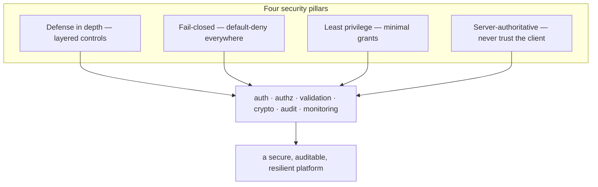

### 1.2 The control map

| Domain | Primary controls | Section |
| --- | --- | --- |
| **Authentication** | JWT + rotating refresh (reuse detection), bcrypt, TOTP 2FA, lockout, timing equalization | [§4](#4-identity--authentication) |
| **Authorization** | Two-layer RBAC, fail-closed global guards, super-admin explicit | [§5](#5-authorization--rbac) |
| **Sessions** | In-memory access token, httpOnly refresh cookie, session liveness, jti blacklist | [§6](#6-session-management) |
| **API** | Helmet, CORS allow-list, global throttling, validation pipe, uniform error envelope | [§7](#7-api-security) |
| **WebSockets** | Handshake token verification, room scoping, ownership checks | [§8](#8-websocket-security) |
| **Financial** | Single authoritative engine, four-layer concurrency, idempotency, double-entry, reconciliation | [§9](#9-wallet--financial-security) |
| **Runtime** | Server-authoritative outcomes, provable fairness, plugin sandbox, ownership | [§10](#10-runtime-security) |
| **AI** | Advisory-only, read-only, grounded narration, no autonomous action | [§11](#11-ai-security--trust-boundaries) |
| **Data** | Hashed secrets, PII isolation, `Restrict` FKs, soft-delete | [§12](#12-data-protection) |
| **Secrets** | Runtime injection, boot validation, log redaction | [§13](#13-secrets-management) |
| **Crypto** | bcrypt (12), SHA-256 digests, HMAC, CSPRNG, constant-time compare | [§15](#15-cryptography) |
| **Audit** | Security events, audit trail, admin audit log — append-only | [§16](#16-logging--audit) |
| **Monitoring** | Metrics/alerts, money-integrity alerts, fraud detection | [§17](#17-monitoring--detection) |
| **Supply chain** | CodeQL, Trivy, audit, Dependabot, SBOM/provenance | [§19](#19-secure-deployment) |

### 1.3 The OWASP Top 10 coverage

The platform maps controls to the OWASP Top 10 (2021), as documented in [Backend §18.1](./BACKEND_ARCHITECTURE.md#181-owasp-top-10-mapping):

| OWASP | Control |
| --- | --- |
| A01 Broken Access Control | Fail-closed global guards; two-layer RBAC; per-row ownership |
| A02 Cryptographic Failures | bcrypt; HS256 JWT pinned iss/aud; SHA-256 token hashing; TLS |
| A03 Injection | Prisma parameterized queries; DTO whitelist validation |
| A04 Insecure Design | Server-authoritative; double-entry ledger; idempotency |
| A05 Security Misconfiguration | Zod env validation (fail-fast); Helmet; CORS; non-root Docker |
| A06 Vulnerable Components | Pinned versions; Dependabot; CodeQL; Trivy |
| A07 Auth Failures | Lockout; rotation + reuse detection; session liveness; 2FA; timing equalization |
| A08 Integrity Failures | Append-only ledger + audit; plugin validation at boot |
| A09 Logging/Monitoring Failures | Structured logs + **secret redaction**; security-event log; alerts |
| A10 SSRF | No user-controlled outbound URLs; one fixed external endpoint (Claude) |

### 1.4 The defining property: fail-closed, server-authoritative

The two most consequential security decisions: **fail-closed** (every route is authenticated by default, every unknown is denied) and **server-authoritative** (the server computes truth — outcomes, balances, permissions — and never trusts the client). Together they mean the *default* posture is secure, and a developer must *explicitly* open a route (`@Public`) or trust a value — the opposite of the dangerous "open until locked down" default. Every worked attack scenario in this document ends the same way: the attacker hits a wall that exists *because* the secure state is the default, not an add-on. See [§2](#2-security-philosophy).

### 1.5 Scope

This document covers the platform's **implemented** security controls. It references the wallet ([Wallet Engine](./WALLET_ENGINE.md)) for financial security, operations ([Operations Platform](./OPERATIONS_PLATFORM.md)) for detection, and deployment ([Deployment Guide](./DEPLOYMENT_GUIDE.md)) for supply-chain and infrastructure security. It documents only controls that exist — no aspirational security is presented as implemented.

---

## 2. Security Philosophy

Six convictions shape every security control.

### 2.1 Defense in depth

No single control is trusted to be sufficient. Authentication has multiple layers (password + lockout + 2FA + session check); money has four concurrency layers; observability watches for what prevention misses. If one control fails, others still protect the asset. See [§9.2](#92-the-four-layer-concurrency-defense).

### 2.1.1 Defense in depth, in prose

Defense in depth is the organizing principle of the whole security model, so it's worth stating plainly why the platform never relies on a single control. Any one control *can* fail — a validation bug, a misconfiguration, a novel bypass, a leaked secret. If the security of an asset depended on one control, that single failure would be a breach. By layering independent controls, the platform ensures that a single failure is *contained* rather than *catastrophic*: the next layer still protects the asset.

The pattern recurs everywhere:

- **Authentication** isn't just a password — it's password + strength/breach checks + lockout + timing equalization + optional 2FA + session liveness. A weak password is still protected by lockout and 2FA.
- **Money** isn't protected by one lock — it's a Redis lock *and* a Serializable transaction *and* an optimistic version check *and* non-negative algebra *and* idempotency *and* double-entry reconciliation. Any one failing leaves the books correct.
- **Secrets** aren't protected by one measure — they're hashed at rest *and* injected at runtime *and* redacted from logs *and* validated at boot. A logging mistake still can't leak them (redaction), and a DB dump still yields nothing (hashing).
- **The whole platform** is protected by prevention (guards, validation) *and* detection (audit logs, alerts, fraud) *and* response (freeze, revoke, rollback). What prevention misses, detection catches; what happens, the audit records.

This layering is deliberate and pervasive. It's why the threat catalog ([§3.2](#32-the-threat-catalog)) lists *multiple* mitigations per threat, and why the worked attack scenarios throughout this document show attackers hitting wall after wall rather than a single gate. The security posture doesn't assume any control is perfect — it assumes each *will* eventually be tested, and ensures the asset survives that test. See [ADR-001](#24-security-architecture-decision-records).

### 2.2 Fail-closed by default

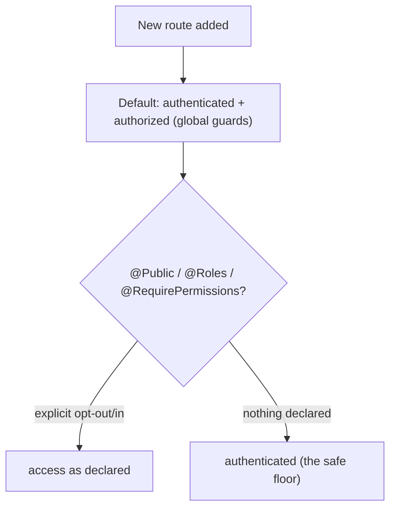

The global guard chain ([§5.1](#51-the-global-guard-chain)) means a new controller is **protected the moment it exists** — a developer must explicitly `@Public()` it to open it. Config validation *refuses to boot* on invalid config. Errors default to a generic `500` rather than leaking internals. The safe state is the default state. See [ADR-001](#24-security-architecture-decision-records).

### 2.3 Least privilege

Every route declares the minimum roles/permissions it needs; the default user role has no elevated permissions; `super_admin` is the only role that bypasses permission checks, and that bypass is explicit and audited. Financial and admin operations are separately gated. See [§5](#5-authorization--rbac).

### 2.4 Server-authoritative — never trust the client

Game outcomes, wallet balances, permissions, and validation are all decided on the server. The client *proposes*; the server *disposes*. A modified client cannot change a game result ([§10](#10-runtime-security)), move money ([§9](#9-wallet--financial-security)), or grant itself access ([§5](#5-authorization--rbac)) — it can only render what the server sends. See [ADR-002](#24-security-architecture-decision-records).

### 2.5 Secure by construction

Security is built into the architecture, not bolted on: the single wallet path makes money auditable, the append-only ledger makes fraud detectable, the plugin sandbox contains engine bugs, the redaction format makes logging safe. The design *prevents* whole classes of vulnerability rather than patching them.

### 2.6 Observable and auditable

Every security-relevant action is logged (security events, audit trail, admin audit log — all append-only), and the operations platform monitors for anomalies (error spikes, disconnect spikes, money inconsistencies). What can't be prevented is detected; what happens is recorded. See [§16](#16-logging--audit), [§17](#17-monitoring--detection).

---

## 3. Threat Model

### 3.1 The trust boundaries

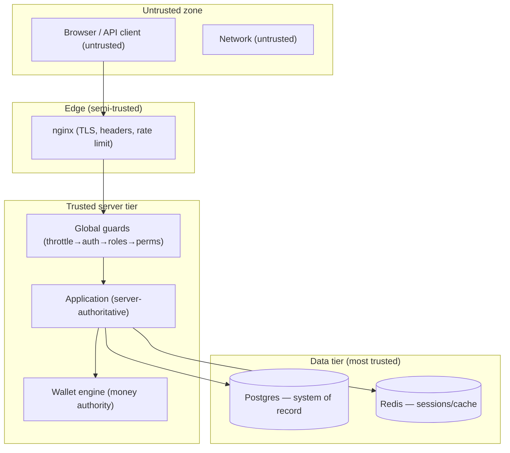

The fundamental boundary: **everything the client sends is untrusted.** The server validates, authenticates, and authorizes every request before acting. The data tier is the most-trusted zone, reachable only through the application (never directly from the client, [Deployment §7.5](./DEPLOYMENT_GUIDE.md#75-network-isolation)).

### 3.2 The threat catalog

| Threat | Attack vector | Primary mitigations |
| --- | --- | --- |
| **Credential theft** | Phishing, breach, stuffing | bcrypt hashing, breach check, 2FA, lockout ([§4](#4-identity--authentication)) |
| **Brute force** | Automated login attempts | Account lockout + global throttling + timing equalization |
| **Token theft (access)** | XSS, interception | In-memory token, 15m lifetime, jti blacklist, session check |
| **Token theft (refresh)** | Cookie theft, replay | httpOnly cookie, rotation, **family reuse detection** |
| **Session hijack** | Stolen session | Per-request session liveness check, revoke-all |
| **Privilege escalation** | Forged claims, missing checks | Signed JWT, fail-closed guards, server-side permission resolution |
| **Injection (SQL)** | Malicious input | Prisma parameterized queries, DTO whitelist |
| **XSS** | Injected scripts | React escaping, in-memory token, CSP (prod) |
| **CSRF** | Cross-site requests | Bearer-token auth (not cookie-authoritative), CORS |
| **Money manipulation** | Race, replay, forged settlement | Four-layer concurrency, idempotency, single authoritative path |
| **Game cheating** | Modified client | Server-authoritative outcomes, provable fairness |
| **Multi-accounting / bots** | Collusion, automation | Fraud detection (device/IP correlation, bot signals) |
| **Data exfiltration** | Compromised access | Hashed secrets, PII isolation, operator-gated data |
| **Secret leakage** | Logs, images, repo | Log redaction, runtime injection, no secrets in images |
| **Supply-chain** | Vulnerable deps/images | CodeQL, Trivy, audit, Dependabot, SBOM |
| **DoS / abuse** | Request/connection floods | Rate limiting, circuit breakers, bounded resources |
| **Prompt injection** | Malicious AI input | LLM narrate-only, no tools, no write access |

### 3.3 The attacker profiles

| Attacker | Capability | Focus |
| --- | --- | --- |
| Opportunistic | Automated tools | Credential stuffing, scraping |
| Fraudster | Multiple accounts, bots | Money manipulation, bonus abuse, collusion |
| Insider | Some access | Privilege escalation, data theft |
| Sophisticated | Targeted | Chained exploits, supply chain |

### 3.4 Out-of-scope (by design)

| Not defended in-app | Handled by |
| --- | --- |
| DDoS at the network layer | Edge/CDN/infrastructure |
| Physical/host security | Infrastructure |
| Payment card data | Tokenized; never stored in full ([§9.6](#96-payment-security)) |
| Social engineering of staff | Operational policy |

---

## 4. Identity & Authentication

Authentication is the trust foundation. It combines password security, rotating tokens, 2FA, and brute-force protection.

### 4.1 The authentication flow

```mermaid
sequenceDiagram
    autonumber
    participant U as User
    participant AS as AuthService
    participant PS as PasswordService
    participant ACC as AccountSecurity
    participant 2FA as TwoFactorService
    participant SS as SessionService
    U->>AS: login(email, password, meta)
    AS->>AS: findByEmail (unknown → dummy bcrypt, equal timing)
    AS->>ACC: isLocked? (lockout / banned / suspended)
    AS->>PS: verifyPassword(password, hash) [bcrypt]
    alt invalid
        AS->>ACC: registerFailedAttempt (lock at threshold)
        AS->>AS: record LOGIN_FAILURE; throw 401
    else valid + 2FA enabled
        AS->>2FA: issue challenge (Redis, 300s)
        AS-->>U: requiresTwoFactor + challengeToken
        U->>AS: verifyTwoFactor(challenge, code)
        AS->>SS: start session (tokens)
    else valid + no 2FA
        AS->>SS: start session (tokens)
    end
```

### 4.2 Password security

Passwords are hashed with **bcrypt** at **12 salt rounds** (`PASSWORD_DEFAULTS.SALT_ROUNDS`, `BCRYPT_SALT_ROUNDS` clamped 8–15). `verifyPassword` uses bcrypt's constant-time comparison. Additional controls:

| Control | Implementation |
| --- | --- |
| Hashing | bcrypt, 12 rounds (adaptive cost) |
| Strength | `PasswordService.assertAcceptable` rejects weak/reused passwords |
| Breach check | Optional HIBP k-anonymity (`PASSWORD_BREACH_CHECK_ENABLED`) |
| No email/username reuse | Rejected if the password contains the email/username |
| Change hygiene | Password change verifies the current password and revokes other sessions |

**Why bcrypt at 12 rounds:** bcrypt is a deliberately-slow, adaptive hash designed to resist offline brute force; 12 rounds is a strong cost that balances security against login latency. See [§15.1](#151-password-hashing).

### 4.3 Timing equalization

`AuthService.login` defends against **account enumeration**: if the email is unknown, it *still* runs a bcrypt comparison against a dummy hash (`'$2a$12$' + 'x'.repeat(53)`), so an unknown email takes the same time as a wrong password. The error message is identical too ("Invalid email or password"). An attacker can't tell whether an email exists by timing or error text. See [Backend §7.3](./BACKEND_ARCHITECTURE.md#73-login-with-optional-2fa).

### 4.4 Brute-force protection (account lockout)

`AccountSecurityService` implements lockout:

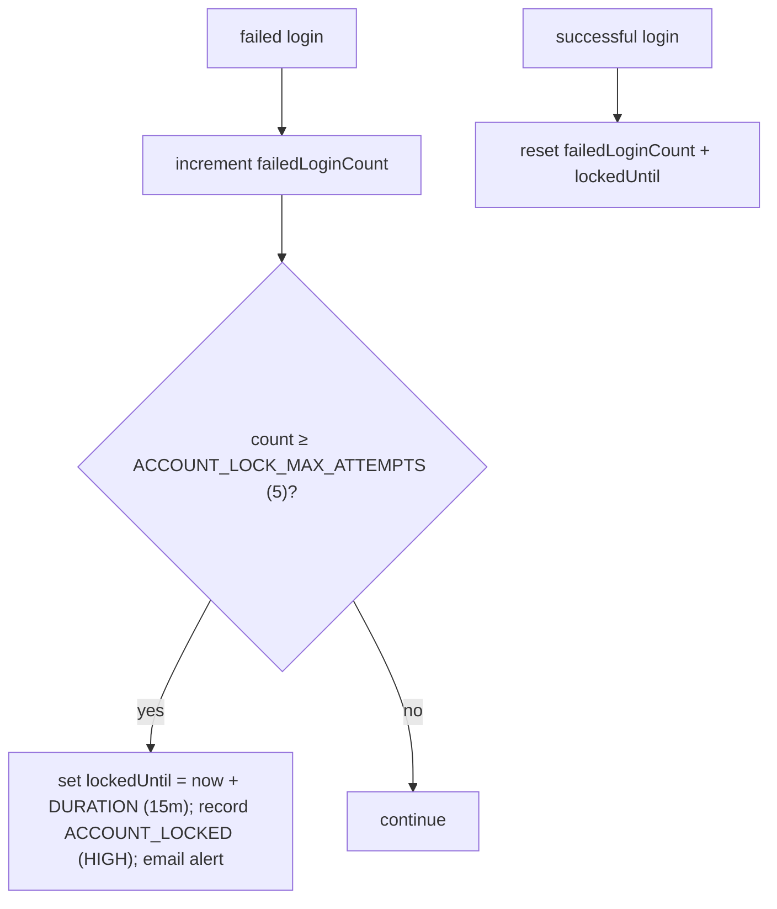

After `ACCOUNT_LOCK_MAX_ATTEMPTS` (default 5) failures, the account locks for `ACCOUNT_LOCK_DURATION_MINUTES` (default 15). A lockout records a **HIGH-severity** security event and sends an email alert. A successful login resets the counter. `SUSPENDED`/`BANNED` accounts are always treated as locked. This bounds brute force to 5 attempts per 15 minutes. See [ADR-003](#24-security-architecture-decision-records).

### 4.4.1 A worked credential-stuffing defense

An attacker has a list of leaked email/password pairs and tries them against the login endpoint. Multiple layers engage:

| Layer | Effect on the attack |
| --- | --- |
| **Global throttler** | 120 req/60s per client → the attack is rate-limited at the edge |
| **Timing equalization** | unknown emails take the same time as wrong passwords → can't enumerate valid accounts |
| **Account lockout** | 5 wrong attempts on one account → locked 15m → can't keep guessing that account |
| **2FA** | even a *correct* password on a 2FA account doesn't grant a session without the TOTP code |
| **SecurityEvent log** | each failure logs `LOGIN_FAILURE`; a lockout logs `ACCOUNT_LOCKED` (HIGH) |
| **Monitoring** | the failure spike surfaces as `high-error-rate` + a `LOGIN_FAILURE` cluster ([§17.2](#172-correlating-an-attack-across-signals)) |

No single control stops credential stuffing alone, but **together** they defeat it: rate limiting slows it, lockout caps per-account guessing, timing equalization prevents finding valid accounts, and 2FA means even a correct leaked password fails without the second factor. Meanwhile the attack is *visible* — the failed-login flood and lockout events let an operator confirm and block the source. This is defense in depth: the attacker faces a wall of independent controls, and even a partial success (a valid password) is stopped by 2FA. The most an attacker gains against a 2FA-enabled account with a leaked password is nothing. See [§17.2](#172-correlating-an-attack-across-signals).

### 4.5 Two-factor authentication (TOTP)

`TwoFactorService` implements RFC-6238 TOTP with recovery codes:

| Aspect | Implementation |
| --- | --- |
| Method | TOTP (`otplib`), QR provisioning (`qrcode`) |
| Setup | Generate secret → QR → verify a code to enable |
| Challenge | On login, a challenge token in Redis (300s TTL), session only after verify |
| Recovery codes | 10 single-use codes, stored as **SHA-256 digests**, consumed on use |
| Issuer | `TWO_FACTOR_ISSUER` |

**Why store recovery codes hashed and single-use:** a recovery code is a credential; storing only its SHA-256 digest means a database compromise doesn't yield usable codes, and consuming a code on use prevents replay. The 2FA challenge lives server-side in Redis (not a client-held token), so it can't be forged. See [§15.3](#153-token-and-secret-hashing).

### 4.6 The token model

| Token | Secret | Lifetime | Storage |
| --- | --- | --- | --- |
| **Access** | `JWT_ACCESS_SECRET` | 15m | in-memory (client) + verified statelessly; jti blacklistable |
| **Refresh** | `JWT_REFRESH_SECRET` | 7d (30d remember-me) | httpOnly cookie + hashed in DB (rotation, reuse detection) |

Tokens are HS256 JWTs with pinned issuer (`gaming-platform`) and audience (`gaming-platform-clients`), signed by separate secrets (each validated ≥16 chars at boot). The short access lifetime + rotating refresh is the core of the session security model ([§6](#6-session-management)).

### 4.7 API keys (machine-to-machine)

`ApiKeyService` + `ApiKeyGuard` provide M2M authentication: keys are `gp_<prefix>_<secret>`, where the **prefix is public** (stored in clear for identification) and the **full key is stored only as a SHA-256 digest**. The `x-api-key` header is verified against the digest; a verified key populates `request.apiKey` with its scopes. See [§15.3](#153-token-and-secret-hashing).

---

## 5. Authorization & RBAC

Authorization is **two-layered and fail-closed**: coarse role checks and fine-grained permission checks, both enforced by global guards.

### 5.1 The global guard chain

```mermaid
flowchart LR
    REQ["request"] --> T["1 ThrottlerGuard (rate limit)"]
    T --> J["2 JwtAuthGuard (authenticate)"]
    J --> R["3 RolesGuard (coarse role)"]
    R --> P["4 PermissionsGuard (fine-grained)"]
    P --> HANDLER["handler"]
    J -.->|@Public| SKIP["skip auth"]
```

Registered as global `APP_GUARD`s in order: `ThrottlerGuard → JwtAuthGuard → RolesGuard → PermissionsGuard` ([Backend §8.1](./BACKEND_ARCHITECTURE.md#81-global-guard-chain)). Each runs only if the previous allowed. Because these are global, the **default is authenticated** — a route must `@Public()` to opt out. This is the fail-closed foundation. See [ADR-001](#24-security-architecture-decision-records).

### 5.2 The RBAC catalog

`rbac.constants.ts` is the single source of truth. Five system roles by level:

| Role | Slug | Level | Permissions |
| --- | --- | --- | --- |
| User | `user` | 10 | (none — baseline) |
| VIP | `vip` | 20 | (none extra) |
| Moderator | `moderator` | 30 | `users:read`, `sessions:read`, `security:read`, `audit:read` |
| Administrator | `admin` | 40 | Moderator + user write/lock/verify, roles read/assign, sessions revoke, games r/w, wallets read, transactions read, analytics read, settings read, feature_flags read |
| Super Admin | `super_admin` | 50 | **all permissions** (+ bypasses every permission check) |

Permissions are `resource:action` slugs (`users:read`, `wallets:adjust`, `feature_flags:write`, …). `RbacBootstrapService` seeds roles and permissions **idempotently on boot**, so a fresh database is immediately governable. See [Backend §8.2](./BACKEND_ARCHITECTURE.md#82-the-rbac-catalog).

### 5.3 How authorization is enforced

```mermaid
flowchart TD
    ROUTE["route handler"] -->|@Roles('admin')| RG["RolesGuard: hasAnyRole(user.role, required)"]
    ROUTE -->|@RequirePermissions('wallets:adjust')| PG["PermissionsGuard mode=all"]
    ROUTE -->|@RequireAnyPermission('a','b')| PGA["PermissionsGuard mode=any"]
    PG --> SA{"super_admin?"}
    PGA --> SA
    SA -->|yes| ALLOW["allow (bypass)"]
    SA -->|no| CHK["granted ⊇ required?"]
    CHK -->|yes| ALLOW
    CHK -->|no| DENY["403 Forbidden"]
```

`RolesGuard` checks `@Roles(...)` against the token's `role` claim (via `hasAnyRole`). `PermissionsGuard` checks `@RequirePermissions`/`@RequireAnyPermission` against the token's `permissions[]` claim (`super_admin` short-circuits to allow; else `every`/`some` set membership). Both throw `ForbiddenException` on failure.

### 5.4 Permissions in the token claim

Permissions are resolved at login/refresh by `RbacService` and carried in the access-token claim, so per-request authorization is a **set-membership check with no database hit** — fast and horizontally scalable. The trade-off: a permission change takes effect at next token refresh; for immediate revocation, session-kill + jti-blacklist apply. Because the token is **signed** (HS256), the claims can't be forged. See [ADR-004](#24-security-architecture-decision-records).

### 5.5 Ownership & resource authorization

Beyond role/permission checks, services enforce **row-level ownership** where a resource is user-scoped. `SessionService.revoke` filters `where: { id, userId }` — a user can only revoke *their* sessions. The wallet endpoints operate only on the authenticated user's wallets. This "authorize the row, not just the route" pattern lives in services because only they know the data model. Admin overrides are separately gated by the corresponding permission. See [Backend §8.4](./BACKEND_ARCHITECTURE.md#84-ownership--resource-access).

### 5.5.1 A worked privilege-escalation attempt

An attacker with a normal `user` account tries to escalate to admin. Consider their options and why each fails:

| Attempt | Defense |
| --- | --- |
| **Edit the JWT to add `admin` role / permissions** | The JWT is **signed** (HS256); tampering invalidates the signature → the token is rejected at verification |
| **Send `role: admin` in a request body** | Roles/permissions come from the *verified token*, never from the request body; `@CurrentUser` reads the token, not the payload |
| **Call an admin endpoint directly** | The `RolesGuard`/`PermissionsGuard` check the token's claims → `403 Forbidden` |
| **Access another user's resource** | Row-level ownership checks (`where: { id, userId }`) → not found / forbidden |
| **Guess an admin route that forgot to declare authz** | Fail-closed: every route is authenticated by default; admin routes declare `@RequirePermissions` — but even an undeclared route is at least authenticated, not open |

The escalation is blocked at every turn because authorization derives from a **signed, server-issued token**, not from anything the client controls. The attacker can't forge claims (signature), can't inject a role (the server ignores client-supplied roles), and can't reach admin functions (the guards check the real claims). The separation of player and admin RBAC ([§5.6](#56-player-rbac-vs-admin-rbac)) adds another wall: even a compromised *player* admin-ish role can't touch the back-office, which requires a separate `AdminUser` identity and admin permissions. And every attempt is logged — a flurry of `403`s from one account is itself a detectable signal. Privilege escalation requires forging a signature the attacker doesn't have the secret for, which is the whole point of signed tokens. See [ADR-004](#24-security-architecture-decision-records).

### 5.6 Player RBAC vs. admin RBAC

The platform maintains **two separate RBAC systems**: player RBAC (`Role`/`Permission`) governs the API surface, and admin RBAC (`AdminRole`/`AdminPermission`) governs the back-office ([Database §16](./DATABASE_ARCHITECTURE.md#16-administration-schema)). `AdminUser` is a separate identity linked 1-1 to `User`. Keeping them separate means a player role can **never** accidentally grant back-office access — a structural least-privilege boundary. See [ADR-012 (Database)](./DATABASE_ARCHITECTURE.md#24-architecture-decision-records).

---

## 6. Session Management

Sessions are **stateless-with-revocation**: JWTs so any instance authorizes without a DB hit, plus Redis-backed checks so a token or session can be killed instantly.

### 6.1 The session lifecycle

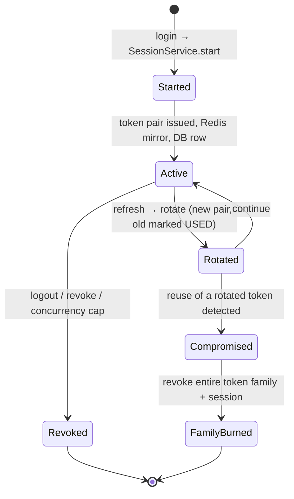

### 6.2 The refresh-token rotation & reuse detection

This is the crown jewel of the session model. On every refresh (`SessionService.rotate`):

```mermaid
flowchart TD
    REFRESH["refresh(token)"] --> VERIFY["verify JWT; look up tokenHash in DB"]
    VERIFY --> STATUS{"record status?"}
    STATUS -->|not ACTIVE (already used/revoked)| REUSE["REUSE DETECTED → burn the whole token family + revoke session + SUSPICIOUS_ACTIVITY (HIGH)"]
    STATUS -->|expired| EXP["mark EXPIRED, reject"]
    STATUS -->|ACTIVE| ROTATE["issue new pair; mark old USED (replacedById); update session"]
```

If a refresh token whose DB record is **not ACTIVE** (already rotated/used) is presented, that's **token reuse** — a signature of a stolen token being replayed. The response is aggressive: `handleReuse` **burns the entire token family** (all tokens in that lineage), revokes the session, and records a HIGH-severity `SUSPICIOUS_ACTIVITY` event. So a stolen refresh token self-destructs the moment either the attacker or the legitimate user uses a rotated member. This defeats refresh-token replay. See [ADR-005](#24-security-architecture-decision-records).

### 6.2.1 A worked token-theft-and-reuse defense

This is the platform's most sophisticated auth defense, so it's worth walking through as an attack. An attacker steals a user's refresh token (say via a transient XSS or a compromised device). Follow what happens:

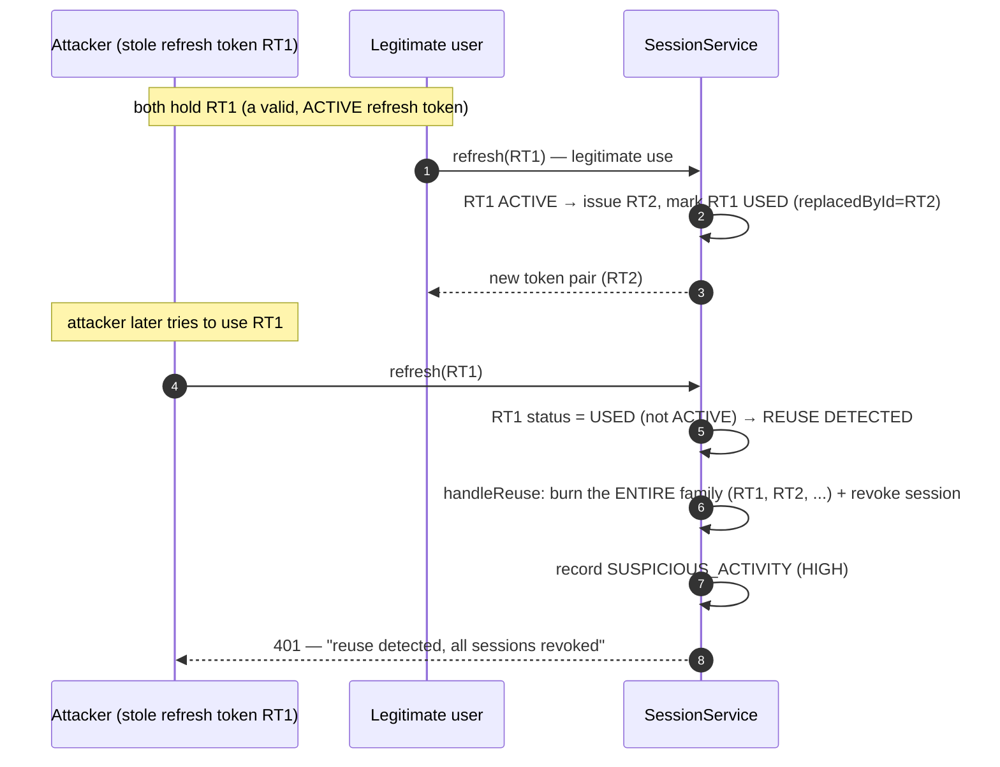

The moment the attacker uses the stolen `RT1` *after* the legitimate user rotated it (RT1→RT2), the system detects that a **used** token is being replayed — a signature of theft, since a legitimate client always holds the *latest* token. The response is decisive: `handleReuse` **burns the entire token family** (including the legitimate `RT2`), revokes the session, and logs a HIGH-severity `SUSPICIOUS_ACTIVITY` event. Both the attacker *and* the legitimate user are logged out — the legitimate user simply re-authenticates (a minor inconvenience), while the attacker is locked out and the theft is flagged for investigation. The crucial property: a stolen refresh token is only useful until *either* party rotates it, at which point reuse is detected and the whole lineage dies. Even the reverse ordering (attacker uses RT1 first, then the user) triggers detection when the user presents the now-used RT1. This defeats refresh-token replay — the token can't be quietly used indefinitely. See [ADR-005](#24-security-architecture-decision-records).

### 6.3 Token storage security

| Token | Storage | Why |
| --- | --- | --- |
| Access | **In-memory only** (client) | Not persisted → XSS can't harvest a stored token; 15m lifetime bounds theft |
| Refresh | **httpOnly cookie** (`AUTH_COOKIE_SECURE` in prod) + **hashed** in DB (`sha256`) | Not readable by JS (XSS-safe); DB stores only a digest |

The refresh token is delivered as an **httpOnly, Secure (prod), scoped** cookie so JavaScript cannot read it, and the database stores only its **SHA-256 hash** — a DB compromise yields no usable tokens. The access token lives in memory and is re-obtained via silent refresh on reload ([Frontend §8.2](./FRONTEND_ARCHITECTURE.md#82-authentication--session-flow)).

### 6.4 Per-request session validation

`JwtStrategy.validate` performs three checks beyond signature/expiry on **every** protected request:

| Check | Purpose |
| --- | --- |
| `type === 'access'` | A refresh token can't be used as an access token |
| jti not blacklisted (`bl:access:<jti>` in Redis) | Logout instantly revokes a still-valid access token |
| Session still active (`SessionService.isActive`, Redis fast-path, DB fallback) | Revoking a session from another device kills all its access tokens |

This is what gives a **stateless** token model **instant revocation**: logout blacklists the jti, and killing a session invalidates all its tokens at the next request. See [Backend §7.5](./BACKEND_ARCHITECTURE.md#75-access-token-validation-jwtstrategyvalidate).

### 6.5 Session concurrency & devices

`SessionService.start` enforces `MAX_CONCURRENT_SESSIONS` (default 5) — the oldest sessions are revoked when the cap is exceeded, limiting how many active sessions an account can hold. Devices are fingerprinted (`deviceFingerprint` = SHA-256 of a client hint + user agent) and tracked, so a user can review and revoke sessions per device. See [§4.7](#47-api-keys-machine-to-machine).

---

## 7. API Security

The API is hardened at the edge (nginx), the framework (Helmet, CORS, throttling, validation), and the response layer (uniform error envelope).

### 7.1 The API request pipeline

```mermaid
flowchart LR
    REQ["request"] --> NGINX["nginx: TLS, headers, body-size cap, server_tokens off"]
    NGINX --> HELMET["helmet: security headers, CSP (prod)"]
    HELMET --> CORS["CORS: allow-list origins, credentials"]
    CORS --> THROTTLE["throttler: rate limit"]
    THROTTLE --> AUTH["auth + authz guards"]
    AUTH --> VALIDATE["ValidationPipe: whitelist, reject unknown, transform"]
    VALIDATE --> HANDLER["handler"]
    HANDLER --> ENVELOPE["uniform response / normalized error"]
```

### 7.2 Security headers (Helmet)

`main.ts` applies **Helmet** globally: CSP enabled in production (relaxed in dev where it breaks tooling), cross-origin-embedder-policy disabled where it would break assets, plus the standard Helmet header set (X-Content-Type-Options, X-Frame-Options, etc.). nginx adds `server_tokens off` (hides the version). See [Backend §18.3](./BACKEND_ARCHITECTURE.md#183-transport-headers--cookies).

### 7.3 CORS

CORS is an **allow-list**: `enableCors({ origin: corsOrigins, credentials: true, methods: [...] })`. `CORS_ORIGINS` is environment-specific — `localhost` in dev, the real domain(s) in staging/production ([Deployment §4.3](./DEPLOYMENT_GUIDE.md#43-the-environment-differences)). Credentials are allowed (for the refresh cookie), but only from the configured origins — a cross-site page can't make a credentialed request.

### 7.4 Rate limiting

The global `ThrottlerGuard` enforces `RATE_LIMIT_LIMIT` requests per `RATE_LIMIT_TTL` (120/60s in prod, 300/60s in dev) — the first defense against brute force and scraping. The `ops-core` `TokenBucket` is the reusable primitive for finer-grained limiting ([Operations §13](./OPERATIONS_PLATFORM.md#13-rate-limiting)). See [ADR-006](#24-security-architecture-decision-records).

### 7.5 Input validation

The global `ValidationPipe` runs with `whitelist: true` (strip unknown properties), `forbidNonWhitelisted: true` (reject unknown properties outright), and `transform: true` (coerce to typed DTOs). Combined with Prisma parameterization, this structurally prevents injection and mass-assignment. See [§14](#14-input-validation).

### 7.6 CSRF posture

The platform is **not vulnerable to classic cookie-based CSRF** because state-changing requests carry the **bearer access token** (which a cross-site form can't read or attach), not a cookie that the browser would auto-send. The refresh cookie exists, but it only refreshes tokens; it doesn't authorize actions. Combined with the CORS allow-list, cross-site request forgery doesn't grant authority. See [Frontend §19.2](./FRONTEND_ARCHITECTURE.md#192-xss--csrf-considerations).

### 7.7 The uniform error envelope

`AllExceptionsFilter` normalizes every error to a standard `ApiErrorResponse`, and unknown/unexpected errors return a **generic** `500` ("Internal server error") with no stack trace or internal detail leaked ([Backend §17.1](./BACKEND_ARCHITECTURE.md#171-one-filter-to-normalize-them-all)). `5xx` errors are logged with a stack + `requestId`; `4xx` are logged at warn. So errors are debuggable server-side (via the requestId) but opaque to the client — no information disclosure.

---

## 8. WebSocket Security

The platform's nine Socket.IO gateways ([Backend §11](./BACKEND_ARCHITECTURE.md#11-websocket-architecture)) authenticate at the handshake and scope broadcasts to rooms.

### 8.1 Handshake authentication

```mermaid
sequenceDiagram
    autonumber
    participant C as Client socket
    participant G as Gateway
    C->>G: connect (auth.token or Authorization header)
    G->>G: verifyAccessToken(token, secrets)
    alt valid
        G->>G: client.data.userId = payload.sub; join user room
        G-->>C: <ns>:connected
    else missing/invalid
        G->>C: disconnect(true)
    end
```

Every gateway verifies the access token at `handleConnection` (via `verifyAccessToken` from `@gaming-platform/auth`, same secrets as HTTP) and **disconnects immediately** if the token is missing or invalid. An unauthenticated socket never reaches a message handler. See [Backend §11.2](./BACKEND_ARCHITECTURE.md#112-authentication-on-connect).

### 8.2 Room scoping & ownership

| Control | Implementation |
| --- | --- |
| User rooms | Wallet/notifications gateways join `<ns>:user:<userId>` — a user only receives their own events |
| Runtime rooms | `runtime:<sessionId>` — events scoped to a session |
| Ownership re-check | Every runtime message re-verifies `getRecord(sessionId, userId)` — a player can't act on another's session ([Runtime §7.2](./GAME_RUNTIME.md#72-redis-binding--ownership)) |

Broadcasts are scoped to rooms, so a player's balance updates and game events go only to that player. The per-message ownership check means even an authenticated socket can't touch a session it doesn't own.

### 8.3 WebSocket-specific threats

| Threat | Mitigation |
| --- | --- |
| Unauthenticated connection | Handshake token verification + immediate disconnect |
| Cross-user event leakage | Room scoping (user/session rooms) |
| Acting on another's session | Per-message ownership check |
| Connection flooding | `ws-disconnect-spike` alert ([Operations §16.2](./OPERATIONS_PLATFORM.md#162-websocket-health-signals)); rate limiting at the edge |

### 8.3.1 A worked WebSocket attack attempt

An attacker tries to snoop on another player's real-time data or act on their session over WebSockets. Both fail:

| Attempt | Defense |
| --- | --- |
| **Connect without a token** | The handshake requires a valid access token → immediate `disconnect(true)`; no message handler is reached |
| **Connect with a forged token** | `verifyAccessToken` rejects the invalid signature → disconnect |
| **Join another user's room to snoop** | Rooms are `<ns>:user:<userId>` derived from the *verified* token's `sub` — the attacker only joins their *own* room |
| **Send an action for another's game session** | Every runtime message re-checks `getRecord(sessionId, userId)` → Forbidden for a session they don't own |

The attacker can't even establish an authenticated socket without a valid token (which requires having authenticated via the HTTP flow), and once connected, they're confined to their own rooms and their own sessions. The room name is *derived from the verified token*, not chosen by the client, so an attacker can't join a room they shouldn't. And the per-message ownership re-check means that even if an attacker somehow guessed another player's session id, acting on it is refused. Real-time data leakage and cross-session actions are both structurally prevented — the same server-authoritative, ownership-enforced discipline as the HTTP API, applied to the socket layer. See [§8.2](#82-room-scoping--ownership).

### 8.4 The proxy consideration

nginx proxies WebSocket upgrades for the `/realtime/` path with the `Upgrade`/`Connection` headers and a `3600s` read timeout ([Deployment §3.2](./DEPLOYMENT_GUIDE.md#32-the-nginx-reverse-proxy)). Because all sockets go through nginx (which sets `X-Forwarded-For`), the gateway sees the real client IP for security logging.

---

## 9. Wallet & Financial Security

The wallet is the most security-critical subsystem. Its security is *architectural*: one authoritative path, structural invariants, and defense in depth.

### 9.1 The single authoritative path

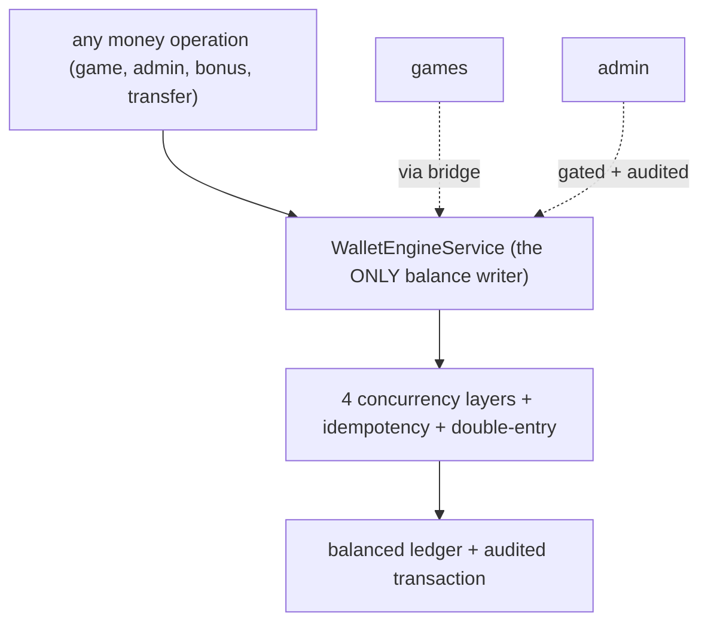

**Only `WalletEngineService` mutates balances** ([Wallet §22.1](./WALLET_ENGINE.md#221-the-single-path-guarantee)). No controller, gateway, game, or other service writes `WalletBalance` directly. This means every balance change is subject to the same controls — there is no back door, and auditing the money reduces to auditing one service. Games settle only through the mandatory `WalletBridgeService` ([Wallet §21](./WALLET_ENGINE.md#21-runtime-integration)). See [ADR-007](#24-security-architecture-decision-records).

### 9.2 The four-layer concurrency defense

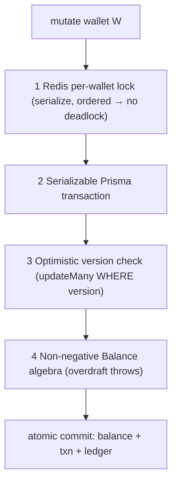

Four **independent** layers protect every balance write ([Wallet §14](./WALLET_ENGINE.md#14-concurrency-model)): a Redis lock (serialize), a Serializable transaction (DB isolation), an optimistic `version` check (retry on conflict), and non-negative balance algebra (overdraft is impossible). Any one failing still leaves the books correct. This defeats race conditions and double-spends. See [Wallet §14.1](./WALLET_ENGINE.md#141-the-four-layers).

### 9.3 Idempotency (replay protection)

Money operations carry an **idempotency key**; a replay returns the original result instead of re-applying. This is enforced at two levels: the application's `replay()` check and the database's `unique(idempotencyKey)`/`unique(reference)` constraints ([Wallet §15](./WALLET_ENGINE.md#15-idempotency)). Even a racing duplicate is rejected by the unique constraint. So a replayed settlement can never double-charge or double-pay — replay attacks on money are structurally impossible. See [ADR-008](#24-security-architecture-decision-records).

### 9.4 Double-entry integrity

Every value movement posts a balanced player↔house journal (`Σ debits = Σ credits`), and the global sum is conserved (`Σ player + Σ system = 0`) ([Wallet §11](./WALLET_ENGINE.md#11-double-entry-ledger)). The `reconcile()` trial balance proves the books balance; the `wallet-inconsistency` alert fires at threshold **0** ([Operations §18.4](./OPERATIONS_PLATFORM.md#184-the-money-integrity-alerts)). This makes financial fraud or corruption **detectable**: any imbalance is a critical, immediate alert.

### 9.5 Append-only correction

Corrections never mutate history — `rollback` posts a **compensating** `ROLLBACK`/`REVERSED` transaction linked to the original ([Wallet §20.3](./WALLET_ENGINE.md#203-rollback--compensation)). The original is immutable. So the financial record is tamper-evident: you can see the error *and* its correction, and nothing is erased. Financial FKs are `Restrict`, so a user/wallet/currency with history can't be deleted ([Database §8.3](./DATABASE_ARCHITECTURE.md#83-cascade-strategy--the-three-delete-behaviors)).

### 9.6 Payment security

Payment instruments store only `last4`/`brand`/tokenized references, **never full card numbers** — PCI-minimizing by design ([Database §21.2](./DATABASE_ARCHITECTURE.md#212-pii--compliance)). Withdrawals carry an approval workflow (`reviewedById`, `approvedAt`, `rejectionReason`). Deposits/withdrawals are quarantined in their own request tables, the boundary between the internal ledger and external gateways ([Wallet §12.5](./WALLET_ENGINE.md#125-idempotency-reservations-and-cash-boundaries)).

### 9.6.1 A worked money-manipulation attempt

An attacker tries to exploit a game to inflate their balance. Consider three attack vectors and how the layered defenses defeat each:

| Attack | Defense that defeats it |
| --- | --- |
| **Modify the client to send a "win"** | Server-authoritative: the *server* computes the outcome from the seed; the client's claimed result is ignored ([§10.1](#101-server-authoritative-outcomes)) |
| **Replay a winning settlement** | Idempotency: the replayed settlement returns the *original* result; the unique `reference`/`idempotencyKey` rejects the duplicate ([§9.3](#93-idempotency-replay-protection)) |
| **Race two withdrawals to overdraw** | Four concurrency layers: the Redis lock serializes them, the version check retries, and the non-negative algebra rejects the overdraft ([§9.2](#92-the-four-layer-concurrency-defense)) |
| **Forge a balance write directly** | Single path: nothing but `WalletEngineService` can write a balance — there's no endpoint or code path to forge ([§9.1](#91-the-single-authoritative-path)) |
| **Corrupt the ledger** | Double-entry: an unbalanced journal can't be posted (`assertBalanced` throws); any imbalance fires the `wallet-inconsistency` alert ([§9.4](#94-double-entry-integrity)) |

Every money-manipulation vector runs into a structural wall. The most instructive is the overdraft race: even if an attacker perfectly times two concurrent withdrawals hoping to spend the same funds twice, the per-wallet Redis lock forces them to serialize, the second reads the post-first balance (version check), and if it somehow tried to overdraw, the `Balance` algebra throws rather than persisting a negative balance. There is no timing window where the attack succeeds, because four independent layers each close it. And if — hypothetically — every layer failed, the `reconcile()` trial balance would immediately detect the resulting imbalance and page an operator ([§18.4](#184-the-money-integrity-incident)). The money is defended in depth *and* continuously verified. See [Wallet §14.3.1](./WALLET_ENGINE.md#1431-a-worked-concurrency-scenario).

### 9.7 Fraud & compliance controls

| Control | Mechanism |
| --- | --- |
| Freeze a wallet | `freeze()` blocks all mutation immediately ([Wallet §22.4](./WALLET_ENGINE.md#224-fraud--compliance-controls)) |
| Reverse fraud | `rollback()` (compensating entry) |
| Detect anomalies | AI fraud module (device/IP correlation, bot signals, [§11](#11-ai-security--trust-boundaries)) |
| Ledger alarm | `reconcile()` + `wallet-inconsistency` alert |
| No overdraft | non-negative algebra |

---

## 10. Runtime Security

The game runtime's security rests on server authority, provable fairness, and plugin isolation.

### 10.1 Server-authoritative outcomes

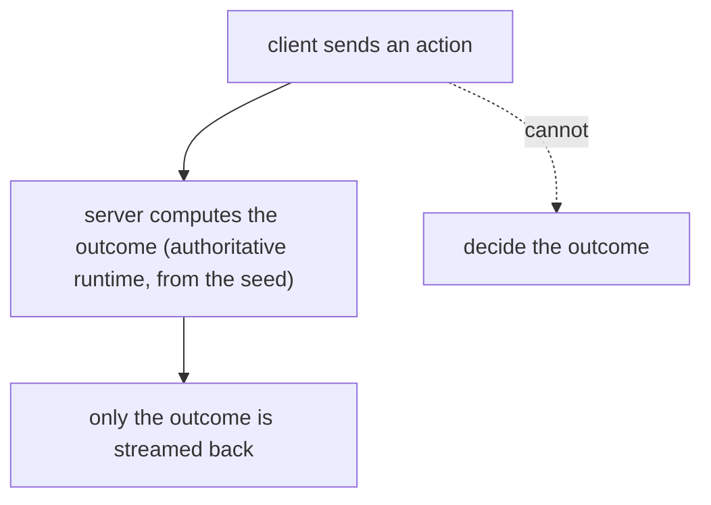

Game outcomes are computed **only** on the server, from a deterministic seed ([Runtime §15.3](./GAME_RUNTIME.md#153-server-authority-cheat-prevention)). A modified client cannot change a result — it can only render what the server sends. This is the primary anti-cheat property. See [ADR-002](#24-security-architecture-decision-records).

### 10.2 Provable fairness

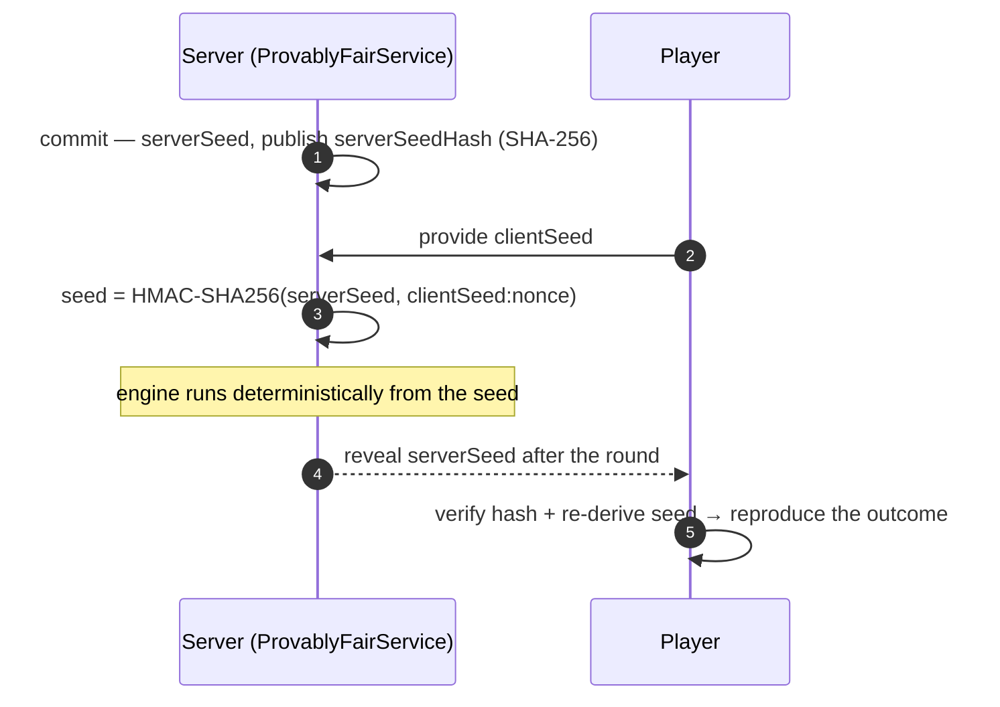

The `ProvablyFairService` commits to a hashed server seed *before* the round, derives the round seed by HMAC, and reveals the server seed after so the player can verify ([Runtime §15.7](./GAME_RUNTIME.md#157-provably-fair)). Because engines are deterministic, the outcome is reproducible arithmetic — fairness is verifiable, not a promise. This defends against the platform (or a compromised instance) rigging outcomes: a player can prove any outcome matches the committed seed.

### 10.3 Plugin isolation (the sandbox)

An engine operates solely through the `PluginHost` — it cannot construct managers, open sockets, reach the database, or move money ([SDK §7.3.1](./GAME_ENGINE_SDK.md#731-the-sandbox-in-practice)). A buggy or hostile engine is sandboxed to the services the host grants; the worst it can do is produce a wrong *result*, which the validated host→bridge→wallet chain still settles safely. This contains the blast radius of an engine vulnerability. See [SDK §15.4](./GAME_ENGINE_SDK.md#154-plugin-isolation).

### 10.4 Runtime ownership & validation

| Control | Implementation |
| --- | --- |
| Session ownership | `getRecord(sessionId, userId)` throws Forbidden for another's session ([Runtime §15.1](./GAME_RUNTIME.md#151-ownership--session-validation)) |
| Input validation | DTO validation (kebab-case plugin key) + result validation (non-negative amounts) |
| Deterministic execution | All randomness via the seeded RNG — no ambient randomness ([Runtime §15.6](./GAME_RUNTIME.md#156-deterministic-execution)) |
| State integrity | Save-states carry a **checksum** — tampering is detectable ([Runtime §15.5](./GAME_RUNTIME.md#155-replay-validation)) |

### 10.4.1 A worked game-cheat attempt

A player wants to cheat a game — to force a win or verify the game isn't cheating *them*. Consider both directions:

**The player tries to cheat the game.** They modify the client to send a "I rolled a 6" message, or to claim a winning outcome. It fails: the **server** computes the dice roll from the seed inside the authoritative runtime ([§10.1](#101-server-authoritative-outcomes)); the client's claimed value is simply ignored. The client can *request* an action ("roll"), but the outcome is the server's to decide, derived deterministically from a seed the client can't control. There is no message the client can send that changes the result — the client renders the server's outcome, it doesn't produce one.

**The player suspects the game is cheating them.** Here the platform *helps* the player: provable fairness ([§10.2](#102-provable-fairness)) lets them verify. Before the round, the server published a hash of its server seed (`serverSeedHash`). The player contributed a client seed. After the round, the server reveals the server seed; the player checks that its SHA-256 matches the committed hash (proving the server didn't change it after seeing the client seed) and re-derives the outcome via HMAC to confirm it matches what they were shown.

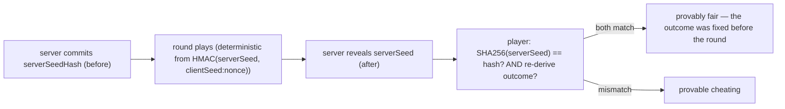

So the game is uncheatable in *both* directions: the player can't rig an outcome (server-authoritative), and the platform can't rig it either without the player being able to prove it (commit-reveal). The commit *before* the round is the key — the server is bound to a seed it can't change after seeing the client's contribution, so it can't cherry-pick a losing outcome. This dual property — anti-cheat *and* anti-house-cheating — is exactly what a trustworthy gaming platform needs, and it's realized through server authority plus HMAC commit-reveal. See [Runtime §15.7](./GAME_RUNTIME.md#157-provably-fair).

### 10.5 The runtime money seam

The runtime is **decoupled from money** — engines produce validated results; the host settles via the bridge ([Runtime §12.4](./GAME_RUNTIME.md#124-why-the-runtime-is-decoupled-from-money)). An engine can't move money directly because it doesn't depend on the wallet. This means a game vulnerability can't directly drain a wallet — it can only report a result that the four-layer-protected wallet engine still settles correctly. See [§9.1](#91-the-single-authoritative-path).

---

## 11. AI Security & Trust Boundaries

The AI platform is designed to be safe to add to a money-handling system: **advisory, read-only, and grounded.**

### 11.1 The AI trust boundary

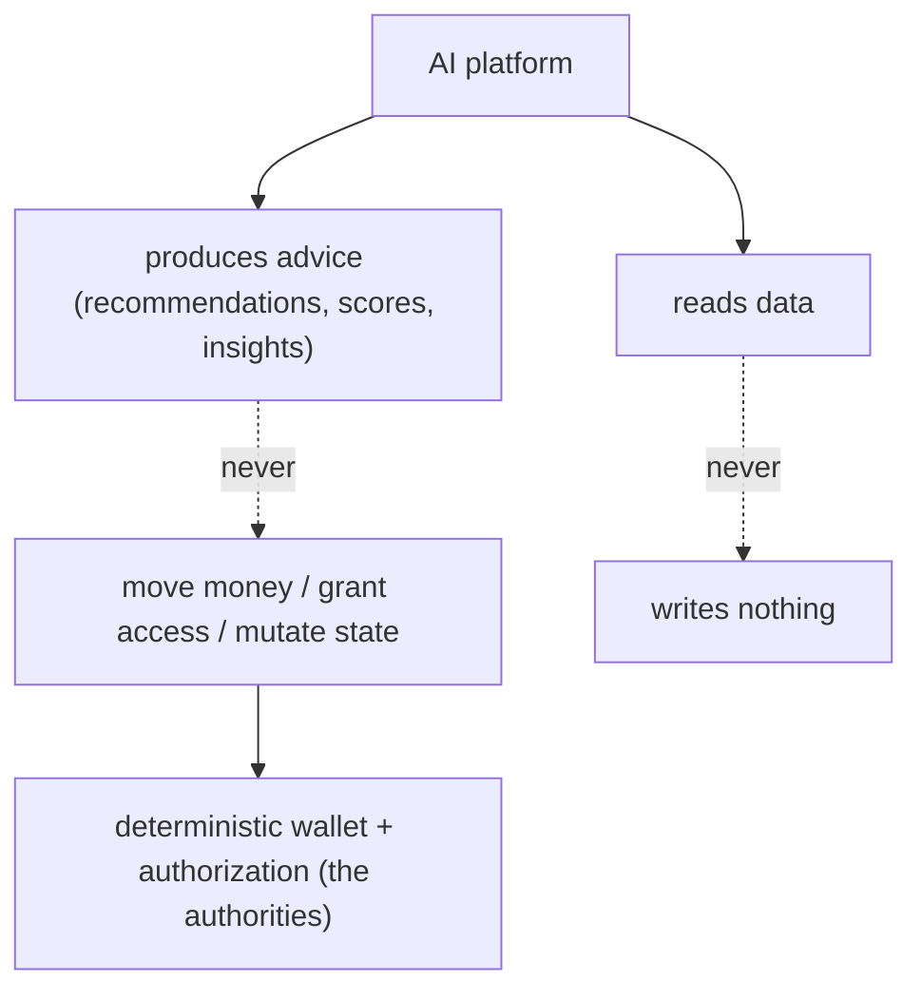

The AI is **advisory** (its outputs influence the UI and inform humans, never take consequential action) and **read-only** (it owns no tables and writes nothing) ([AI §15](./AI_PLATFORM.md#15-trust-boundaries)). A recommendation changes what a player sees; a fraud score informs a human decision; but the AI never *autonomously* freezes a wallet, grants a bonus, or bans an account — those remain deterministic, audited decisions in the wallet and authorization modules. See [ADR-009](#24-security-architecture-decision-records).

### 11.2 The LLM trust boundary

| Control | Implementation |
| --- | --- |
| Grounded narration | The LLM rephrases facts computed deterministically; it never invents numbers ([AI §12.4](./AI_PLATFORM.md#124-why-grounded-narration-not-generation)) |
| No tools, no write access | The LLM can only emit text — it can't act |
| Minimal data | Only aggregated grounded facts cross to the provider — never raw PII/records ([AI §21.1](./AI_PLATFORM.md#211-the-llm-never-sees-secrets-or-raw-pii)) |
| System-prompt constraint | "Answer ONLY from the provided facts; never invent numbers" |
| Prompt-injection resilience | The question only routes; the LLM has no tools; output is verifiable against the facts ([AI §21.4.1](./AI_PLATFORM.md#2141-prompt-injection-resilience)) |

**Why the LLM can't be dangerous:** because it narrates already-computed facts, has no tools, and can't write, even a fully-hijacked LLM can only produce weird prose — not move money or leak data. The blast radius of a prompt-injection attack is "the text is odd," not "an action was taken." This is the practical benefit of the narrate-only design. See [AI §11](./AI_PLATFORM.md#11-analytics-ai).

### 11.3 Fraud detection as a security control

The AI fraud module is explainable and operator-only ([AI §7](./AI_PLATFORM.md#7-fraud-detection)): it correlates devices/IPs across accounts (multi-accounting), detects bots (near-constant action timing), impossible win rates, and velocity — every signal carrying its evidence. Fraud/risk scores are exposed only via permission-gated `admin/ai/*` endpoints; a player never sees their own score. This is AI as a security *sensor* — it surfaces suspicious activity for a human to adjudicate, never acting on it itself.

---

## 12. Data Protection

### 12.1 Secrets are never stored in plaintext

| Secret | Storage |
| --- | --- |
| Passwords | bcrypt hash (`User.passwordHash`) |
| Session tokens | SHA-256 (`Session.tokenHash`) |
| Refresh tokens | SHA-256 (`RefreshToken.tokenHash`) |
| Reset/verification tokens | SHA-256 |
| API keys | SHA-256 (`ApiKey.keyHash`); public prefix in clear |
| 2FA recovery codes | SHA-256, single-use |
| Payment instruments | tokenized; only `last4`/`brand` |

A database dump yields **no usable credentials** — every secret is a one-way digest ([Database §21.1](./DATABASE_ARCHITECTURE.md#211-sensitive-data--hashing)). See [§15.3](#153-token-and-secret-hashing).

### 12.2 PII isolation

PII is concentrated in the `profile` domain (`UserProfile`, `Address`, `Document`, `KycVerification`, `EmergencyContact`), separate from auth and wallet ([Database §21.2](./DATABASE_ARCHITECTURE.md#212-pii--compliance)). Isolating PII/KYC into one domain makes it straightforward to apply stricter access controls, encryption-at-rest, and retention/erasure policies to exactly the tables that need them. See [§20](#20-compliance-considerations).

### 12.3 Referential protection & soft delete

Financial FKs are `Restrict` — a user with transaction history **can't be deleted**, protecting the ledger ([Database §8.3](./DATABASE_ARCHITECTURE.md#83-cascade-strategy--the-three-delete-behaviors)). User-facing entities are **soft-deleted** (`deletedAt`), so deletion is reversible and auditable, and the financial record persists intact ([Database §18.3](./DATABASE_ARCHITECTURE.md#183-soft-delete-vs-hard-delete)). A closed account is invisible to the app but present for the books.

### 12.4 Data in transit & at rest

| Layer | Protection |
| --- | --- |
| In transit | TLS at the nginx edge; `AUTH_COOKIE_SECURE=true` (prod) requires HTTPS |
| At rest | disk/volume encryption (infrastructure); hashing of secrets; tokenized payments |
| Logs | secret redaction ([§16.3](#163-secret-redaction-in-logs)) |

### 12.4.1 A worked data-breach resilience assessment

Suppose the worst: an attacker obtains a full dump of the PostgreSQL database. What can they actually use? The answer reveals how much the hashing discipline limits the damage:

| Data in the dump | Usable? | Why |
| --- | --- | --- |
| Passwords | **No** | bcrypt hashes — must be brute-forced offline, per-password, at cost 12 |
| Session/refresh tokens | **No** | SHA-256 digests — can't be reversed to a usable token |
| API keys | **No** | SHA-256 digests (only the public prefix is clear) |
| 2FA secrets | Partially | present, but 2FA is a *second* factor — a password is still needed |
| Recovery codes | **No** | SHA-256 digests, single-use |
| Card numbers | **No** | not stored — only `last4`/`brand`/tokens |
| PII (profile, addresses) | Yes | present (the residual exposure) |
| Balances / ledger | Yes (read) | present, but **can't be modified** via a dump; and it's internally consistent |

The critical observation: a database compromise yields **no directly-usable credentials**. An attacker can't log in as a user (passwords are bcrypt-hashed and salted), can't replay a session (tokens are digests), can't use an API key (digest), and can't charge a card (not stored). The residual exposure is **PII** — which is exactly why PII is isolated into the `profile` domain ([§12.2](#122-pii-isolation)), so it can be given stricter protection (encryption-at-rest is the roadmap enhancement, [§25](#25-future-security-roadmap)). The ledger is readable but not *modifiable* from a dump, and it's internally consistent (append-only, double-entry). So even a catastrophic breach — full database access — doesn't hand the attacker working credentials or the ability to move money. This is the payoff of the "hash everything at rest" discipline: the blast radius of a breach is bounded to what's *inherently* readable (PII), not the keys to the kingdom. See [ADR-015](#24-security-architecture-decision-records).

### 12.5 Access control on data

The client never touches the database directly — all access is through the application, which authorizes every request ([Deployment §7.5](./DEPLOYMENT_GUIDE.md#75-network-isolation)). Postgres and Redis are not host-exposed in production. Sensitive data (fraud scores, security events, audit logs, PII) is operator-gated via `admin/*` permissions.

---

## 13. Secrets Management

### 13.1 The secret boundary

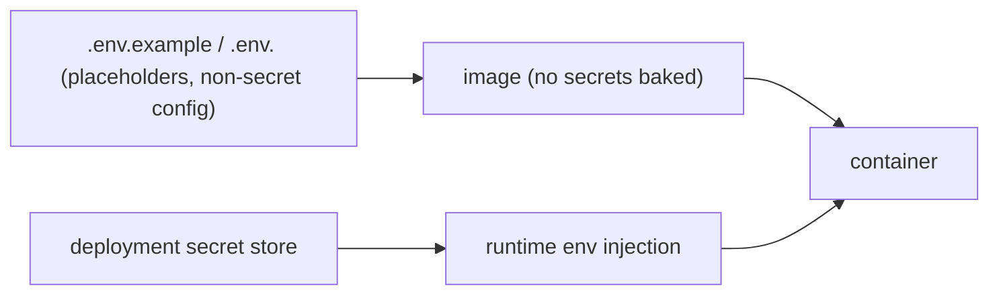

Secrets are **injected at runtime** by the deployment platform, never committed and never baked into an image ([Deployment §12](./DEPLOYMENT_GUIDE.md#12-secrets-management)). Committed `.env` files carry only non-secret config with placeholder secrets (`replace_with_a_long_random_access_secret`). See [ADR-010](#24-security-architecture-decision-records).

### 13.2 The secret inventory

| Secret | Generation | Validation |
| --- | --- | --- |
| `JWT_ACCESS_SECRET` / `JWT_REFRESH_SECRET` | `openssl rand -base64 48` | ≥16 chars (boot fails otherwise) |
| `POSTGRES_PASSWORD` | strong random | — |
| `REDIS_PASSWORD` | strong random | — |
| `MAIL_PASSWORD` | SMTP credential | — |
| `ANTHROPIC_API_KEY` | Anthropic (optional) | — |

### 13.3 Secret hygiene controls

| Control | Implementation |
| --- | --- |
| Never committed | `.gitignore` excludes `.env`; placeholders only |
| Never in the image | Runtime env, not build args (except public `NEXT_PUBLIC_*`) |
| Never logged | Winston redaction ([§16.3](#163-secret-redaction-in-logs)) |
| Validated at boot | Zod schema; secrets < 16 chars → boot fails ([Backend §16.1](./BACKEND_ARCHITECTURE.md#161-validation-at-boot-fail-fast)) |
| Separate secrets | Access and refresh use **different** secrets, so one leak doesn't compromise both |
| Rotatable | Change the injected value + restart; rotation limits blast radius |

**Why separate access/refresh secrets:** if the access secret leaked, an attacker could forge access tokens — but not refresh tokens (different secret), so they couldn't obtain long-lived access. Separating the secrets compartmentalizes the damage of a single leak. See [§15.2](#152-jwt-signing).

### 13.4 A worked secret-leak response

Suppose the `JWT_ACCESS_SECRET` is accidentally exposed (a misconfigured log, a leaked env file). The response and its blast-radius limits:

| Step | Action | Effect |
| --- | --- | --- |
| 1. Rotate | Change the injected `JWT_ACCESS_SECRET`, restart | Old forged access tokens become invalid (wrong signature) |
| 2. Refresh unaffected | `JWT_REFRESH_SECRET` is **different** | Refresh tokens can't be forged with the leaked access secret |
| 3. Sessions survive | Users' refresh tokens still valid | Legitimate users silently re-authenticate; no mass logout needed |
| 4. Investigate | Review logs for forged-token usage | Assess whether the leak was exploited |

The blast radius is **contained by design**: because access and refresh use separate secrets, a leaked *access* secret lets an attacker forge only short-lived (15m) access tokens — not refresh tokens, so they can't obtain *durable* access. Rotating the access secret immediately invalidates any forged tokens (they no longer verify). And because config is **runtime-injected** ([§13.1](#131-the-secret-boundary)), rotation is a config change + restart — the secret isn't baked into an image that would need rebuilding. The short 15-minute access-token lifetime further limits the window: even before rotation, a forged token expires quickly. Contrast a single-secret design where an access-secret leak would compromise refresh tokens too, granting durable access — the separation is precisely what prevents that. The leak is serious but survivable: rotate, and the forged tokens die. See [§13.3](#133-secret-hygiene-controls).

---

## 14. Input Validation

Validation is layered from the network edge to the database.

### 14.1 The validation layers

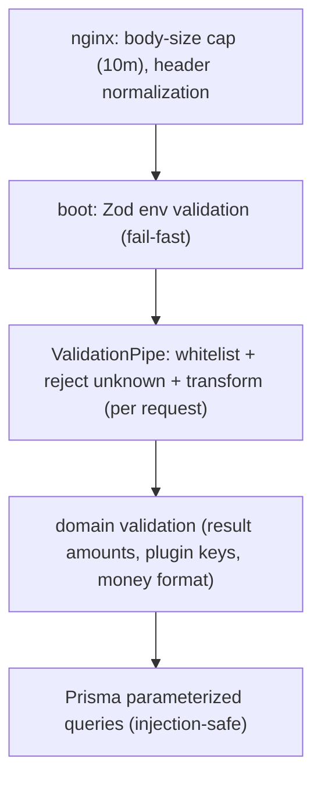

| Layer | Validates |
| --- | --- |
| **Edge** | Request size (`client_max_body_size 10m`), headers |
| **Boot** | Environment config (Zod; refuses to boot on invalid) |
| **Request** | DTOs — `whitelist`, `forbidNonWhitelisted`, `transform` |
| **Domain** | Business rules (non-negative money, kebab-case plugin keys, money-string format) |
| **Persistence** | Prisma parameterization (no string SQL) |

### 14.2 The DTO validation pipe

The global `ValidationPipe` ([Backend §18.5](./BACKEND_ARCHITECTURE.md#185-input-validation)): `whitelist: true` strips properties not in the DTO, `forbidNonWhitelisted: true` **rejects** requests with unknown properties (defeating mass-assignment), and `transform: true` coerces to typed DTOs. `class-validator` decorators enforce field-level rules (e.g. `CreateRuntimeSessionDto`'s kebab-case `pluginKey` pattern, [Runtime §15.2](./GAME_RUNTIME.md#152-input-validation)).

### 14.3 Injection prevention

SQL injection is **structurally prevented** by Prisma's parameterized queries — the application never builds SQL from strings ([Database §21.3](./DATABASE_ARCHITECTURE.md#213-audit--access-control)). Combined with DTO whitelisting, injection and mass-assignment are not possible through the normal request path. The one raw query (`$queryRaw'SELECT 1'` health check) takes no user input.

### 14.4 Money-format validation

Financial amounts are validated by the `Money` parser, which rejects malformed values (`/^[+-]?\d*(\.\d*)?$/`) and by `assertPositive` (throws on non-positive) before any balance calculation ([Wallet §22.5](./WALLET_ENGINE.md#225-amount-validation)). A negative, zero, or malformed amount can never enter a balance operation.

### 14.4.1 A worked injection & mass-assignment attempt

An attacker probes the API with malicious payloads. Two classic attacks, both structurally defeated:

**SQL injection.** The attacker submits `email: "'; DROP TABLE users; --"` to an endpoint. It never reaches SQL as code: Prisma **parameterizes** every query, so the value is bound as a parameter, not interpolated into SQL. The malicious string is treated as a literal email value (which then fails validation as an invalid email). There is no string-concatenated SQL anywhere in the normal request path, so there's no injection surface.

**Mass assignment.** The attacker submits extra fields hoping to set something they shouldn't:

```
POST /auth/register
{ "email": "...", "password": "...", "role": "admin", "isVerified": true, "balance": "999999" }
```

The `ValidationPipe` with `forbidNonWhitelisted: true` **rejects the entire request** because `role`, `isVerified`, and `balance` aren't in the `RegisterDto` — the request fails with a `400` before any handler runs. Even with `whitelist` alone, those fields would be *stripped*; `forbidNonWhitelisted` goes further and rejects the request outright. So an attacker can't sneak privileged fields into a create/update by adding them to the payload — the DTO defines exactly what's accepted, and everything else is refused. Combined with the fact that role/balance are never settable via the request body anyway (roles come from RBAC, balance from the wallet engine), mass assignment has no path to elevate privilege or money. The `whitelist` + `forbidNonWhitelisted` + parameterized-query combination structurally eliminates the two most common API injection classes. See [§14.2](#142-the-dto-validation-pipe).

### 14.5 Client-side validation is UX, not security

The frontend validates with Zod + React Hook Form for immediate feedback, but the **server re-validates everything** ([Frontend §19.2](./FRONTEND_ARCHITECTURE.md#192-xss--csrf-considerations)). Client validation is a UX affordance, never a trust boundary — a modified client that bypasses client validation still hits the server's authoritative validation. See [ADR-015 (AI)](./AI_PLATFORM.md#25-architecture-decision-records).

---

## 15. Cryptography

All cryptographic material is generated with the CSPRNG and stored only as digests.

### 15.1 Password hashing

| Property | Value |
| --- | --- |
| Algorithm | bcrypt (`bcryptjs`) |
| Cost | 12 salt rounds (`BCRYPT_SALT_ROUNDS`, clamped 8–15) |
| Comparison | bcrypt's built-in constant-time compare |

bcrypt is an adaptive, deliberately-slow hash designed to resist offline brute force; 12 rounds is a strong cost. The per-password salt (from `bcrypt.genSalt`) defeats rainbow tables. See [§4.2](#42-password-security).

### 15.2 JWT signing

| Property | Value |
| --- | --- |
| Algorithm | HS256 (HMAC-SHA256) |
| Secrets | Separate access/refresh secrets (≥16 chars) |
| Claims pinned | issuer `gaming-platform`, audience `gaming-platform-clients` |
| Verification | signature + issuer + audience + expiry |

Pinning issuer and audience means a token signed for a different service/audience is rejected, and the separate secrets compartmentalize a leak ([§13.3](#133-secret-hygiene-controls)).

### 15.3 Token and secret hashing

All opaque token material is generated with the CSPRNG (`randomBytes`) and stored only as a **SHA-256 hex digest** (`crypto.util.sha256`):

| Value | Generation | Storage |
| --- | --- | --- |
| Session/refresh/reset/verification tokens | `generateToken` (32 bytes base64url) | SHA-256 |
| API keys | `gp_<prefix>_<secret>` | SHA-256 (prefix in clear) |
| Recovery codes | numeric CSPRNG | SHA-256, single-use |
| Device fingerprint | SHA-256 of hint + UA | stored |
| jti / session family | `randomUUID` | — |

**Why hash opaque tokens:** a token is a bearer credential; storing only its digest means a database compromise yields no usable tokens (SHA-256 is one-way). The token is presented once, verified against the digest, and never recoverable from storage. See [§12.1](#121-secrets-are-never-stored-in-plaintext).

### 15.4 Provably-fair HMAC

Game seeds are derived by **HMAC-SHA256**(serverSeed, `clientSeed:nonce`), with the server committing to a SHA-256 hash of the server seed up front ([Runtime §15.7](./GAME_RUNTIME.md#157-provably-fair)). HMAC provides a keyed, verifiable derivation; the commit-reveal makes outcomes provably fair. See [§10.2](#102-provable-fairness).

### 15.5 Constant-time comparison

`safeEqual` uses `timingSafeEqual` for constant-time comparison of secret material (equalizing timing even on length mismatch), preventing timing side-channels on token/secret comparisons. Password comparison uses bcrypt's constant-time compare; login uses timing equalization ([§4.3](#43-timing-equalization)). Timing attacks on credential comparison are mitigated throughout.

### 15.6 The CSPRNG discipline

All security-relevant randomness uses Node's `crypto` CSPRNG (`randomBytes`, `randomUUID`, `randomInt`) — never `Math.random`. This applies to tokens, API keys, recovery codes, server seeds ([Runtime §13.2](./GAME_RUNTIME.md#132-provable-fairness)), and jti/family ids. (The *game engine's* deterministic RNG is separate — it's seeded by the CSPRNG-derived provably-fair seed, so determinism serves fairness, not security-through-randomness.) See [ADR-011](#24-security-architecture-decision-records).

---

## 16. Logging & Audit

Three append-only logs record every security-relevant action, and the logging pipeline redacts secrets.

### 16.1 The three audit logs

```mermaid
flowchart TD
    ACT{"what happened?"}
    ACT -->|auth/security event| SE["SecurityEvent — logins, MFA, lockouts, suspicious activity"]
    ACT -->|admin action| AAL["AdminAuditLog — back-office actions"]
    ACT -->|entity mutation| AT["AuditTrail — create/update/delete on any entity"]
    SE & AAL & AT --> FORENSIC["append-only forensic record + fraud/incident input"]
```

| Log | Records | Indexed by |
| --- | --- | --- |
| `SecurityEvent` | LOGIN_SUCCESS/FAILURE, MFA_*, ACCOUNT_LOCKED, PASSWORD_CHANGE, SUSPICIOUS_ACTIVITY, … | `[userId, createdAt]`, `[type]`, `[severity]` |
| `AuditTrail` | who did what to which entity (with change set) | `[userId, createdAt]`, `[entityType, entityId]`, `[action]` |
| `AdminAuditLog` | back-office actions | `[adminId, createdAt]`, `[resource, resourceId]` |

Together they answer "who touched this, when, and what did they do" from three angles ([Database §21.3.1](./DATABASE_ARCHITECTURE.md#2131-the-three-log-forensic-model)).

### 16.2 Security event logging

`SecurityEventService.record` writes every authentication-relevant action with type, severity, IP, user agent, and metadata. Critically, it **never lets security logging break the primary flow** — a failed write is caught and logged at warn, so an audit-log failure doesn't fail the user's request (availability), while still surfacing the logging problem. Login history (`recordLogin`) captures success/failure, IP, geo, and failure reason. See [§4.4](#44-brute-force-protection-account-lockout).

### 16.3 Secret redaction in logs

The Winston logging pipeline **redacts secrets** before any transport writes them ([Backend §18.6](./BACKEND_ARCHITECTURE.md#186-logging-redaction)). A recursive `redactFormat` replaces a denylist of keys — `password`, `passwordHash`, `token`, `accessToken`, `refreshToken`, `authorization`, `cookie`, `secret`, `apiKey`, `idempotencyKey`, `twoFactorSecret`, `serverSeed`, `clientSeed`, `creditCard`, `cvv` — with `[REDACTED]`. So even a careless `logger.info(obj)` cannot leak a secret or a fairness seed. This is the defense against OWASP A09 (logging failures). See [ADR-012](#24-security-architecture-decision-records).

### 16.3.1 A worked audit investigation

A player disputes a balance change: "money disappeared from my account." An investigator reconstructs exactly what happened using the three logs:

```mermaid
flowchart TD
    DISPUTE["dispute: unexplained balance change"] --> AT["AuditTrail: entityType=wallet, entityId → who changed it, when"]
    AT --> FOUND{"an admin adjustment?"}
    FOUND -->|yes| AAL["AdminAuditLog: which admin, what action, when"]
    FOUND -->|no| TXN["WalletTransaction: the exact movement (bet/win/deposit), reference, balanceBefore/After"]
    TXN --> SE["SecurityEvent: any suspicious activity on the account?"]
    AT & AAL & TXN & SE --> RESOLVE["complete, evidence-backed answer"]
```

The three append-only logs answer the dispute completely and independently: the `AuditTrail` (indexed by `[entityType, entityId]`) shows every change to that wallet and who made it; if it was an admin adjustment, the `AdminAuditLog` shows which admin and what action; the `WalletTransaction` ledger shows the exact movement with `balanceBefore`/`balanceAfter` and a `reference`; and the `SecurityEvent` log shows whether the account had any suspicious activity (a lockout, a reuse detection) around that time. Because all three are **append-only** and **indexed for interrogation**, the investigator can reconstruct the full timeline with certainty — nothing was overwritten, and every actor is attributable. The player's "money disappeared" resolves to a concrete, evidenced answer: "a `GAME_BET` of X at timestamp T, reference R, balanceBefore B1, balanceAfter B2 — a normal settled bet." This is the value of comprehensive, append-only audit: disputes and incidents are answerable from the record, not from guesswork. See [§16.1](#161-the-three-audit-logs).

### 16.4 Log durability & correlation

Logs are durable (Winston, rotated JSON in prod) and correlatable (every entry carries a `requestId`/`traceId`, [Operations §7](./OPERATIONS_PLATFORM.md#7-distributed-tracing)). A user-reported issue maps to its exact server logs via the request/trace id. The append-only audit logs are the forensic record for incident response ([§18](#18-incident-response)).

---

## 17. Monitoring & Detection

What prevention misses, detection catches. The operations platform monitors for security-relevant anomalies.

### 17.1 The security-relevant alerts

| Alert | Metric | Security signal |
| --- | --- | --- |
| `high-error-rate` | error_rate > 5% | exploitation attempt / attack |
| `ws-disconnect-spike` | ws_disconnects > 100 | connection-flood attack |
| `failed-settlements` | failed_settlements > 5 | money-manipulation attempt |
| `wallet-inconsistency` | wallet_inconsistencies > 0 | **integrity breach (immediate, critical)** |

The `wallet-inconsistency` alert (threshold 0) is the platform's strictest — a single ledger imbalance is a five-alarm event ([Operations §18.4](./OPERATIONS_PLATFORM.md#184-the-money-integrity-alerts)).

### 17.2 Correlating an attack across signals

```mermaid
flowchart TD
    ATTACK["credential-stuffing attack"] --> S1["rate-limit 429s (logs)"]
    ATTACK --> S2["elevated 401s / error rate"]
    ATTACK --> S3["LOGIN_FAILURE spike (SecurityEvent)"]
    ATTACK --> S4["failed-login flood (Log Explorer)"]
    S1 & S2 & S3 & S4 --> CONFIRM["correlated → confirmed attack, not a bug"]
```

No single signal proves an attack, but together — a spike of failed logins, rate-limit rejections, and auth errors from many IPs — they confirm credential stuffing ([Operations §21.3.1](./OPERATIONS_PLATFORM.md#2131-correlating-an-attack-across-signals)). The operations platform provides the infrastructure view; the `SecurityEvent` log provides the security view; the AI fraud module correlates accounts.

### 17.3 Fraud detection

The AI fraud module ([§11.3](#113-fraud-detection-as-a-security-control)) is a continuous detection layer: it scans recently-active accounts for multi-accounting (shared devices/IPs), bots (action-timing regularity), impossible win rates, and velocity — surfacing suspicious accounts to operators. This detects abuse that per-request controls can't (a collusion ring using coordinated accounts).

### 17.4 Detection responsibilities

| Detection | Owner |
| --- | --- |
| Infrastructure anomalies (error/latency/disconnect spikes) | Operations alerts |
| Money integrity | `reconcile()` + wallet-inconsistency alert |
| Auth anomalies (failed-login spikes, lockouts) | SecurityEvent log |
| Fraud/collusion | AI fraud module |
| Code vulnerabilities | CodeQL (CI) |
| Image vulnerabilities | Trivy (release) |
| Dependency vulnerabilities | pnpm audit + Dependabot |

---

## 18. Incident Response

### 18.1 The incident lifecycle

```mermaid
flowchart TD
    DETECT["Detect: alert / anomaly / report"] --> TRIAGE["Triage: severity? scope? money involved?"]
    TRIAGE --> CONTAIN["Contain: freeze wallet / revoke sessions / rollback / rate-limit"]
    CONTAIN --> INVESTIGATE["Investigate: logs + audit trail + traces + fraud data"]
    INVESTIGATE --> REMEDIATE["Remediate: rollback deploy / forward-fix / rotate secrets"]
    REMEDIATE --> VERIFY["Verify: reconcile() + health + alert resolved"]
    VERIFY --> LEARN["Post-incident: root cause + add control/alert"]
```

### 18.2 The containment toolkit

| Threat | Containment action |
| --- | --- |
| Compromised account | `freeze()` wallet, revoke sessions (`revokeAll`), lock account |
| Fraudulent transactions | `rollback()` (compensating entries) |
| Stolen token | jti blacklist (access) / family burn (refresh, automatic on reuse) |
| Bad deploy | rollback workflow ([Deployment §19](./DEPLOYMENT_GUIDE.md#19-rollback-procedures)) |
| Attack in progress | rate limiting, circuit breakers, block at the edge |
| Leaked secret | rotate the injected secret + restart |

Each action uses an existing platform capability — freezing, revoking, rolling back are all audited, reversible operations ([Wallet §22.4.1](./WALLET_ENGINE.md#2241-a-worked-fraud-response)).

### 18.3 Investigation tools

| Tool | Provides |
| --- | --- |
| Log Explorer | recent logs filtered by level/route/trace id ([Operations §6.3](./OPERATIONS_PLATFORM.md#63-the-log-explorer)) |
| SecurityEvent log | auth/security event timeline |
| AuditTrail | entity change history (who/what/when) |
| Trace id | correlate a report to its server logs |
| AI fraud data | account correlation, behavioural signals |
| `reconcile()` | prove money integrity |

### 18.4 The money-integrity incident

The most serious incident class is a **wallet inconsistency** — `reconcile()` returning unbalanced ([Wallet §19.3.1](./WALLET_ENGINE.md#1931-what-a-reconciliation-failure-would-mean)). In a correctly-functioning double-entry system this is impossible, so it implies a bug or corruption. The response: **halt settlement**, investigate the offending journals, reconcile, and only resume when balanced. This is the one incident where the correct action is to *stop the money* until integrity is restored. See [ADR-013](#24-security-architecture-decision-records).

### 18.4.1 A worked incident — account takeover

An account shows signs of takeover (a `SUSPICIOUS_ACTIVITY` event from refresh-token reuse detection, followed by unusual withdrawal attempts). The response:

```mermaid
sequenceDiagram
    autonumber
    participant DET as Detection
    participant OP as Security operator
    participant WAL as Wallet
    participant SESS as Sessions
    participant LOG as Audit logs
    DET->>OP: SUSPICIOUS_ACTIVITY (token reuse) + withdrawal attempts
    OP->>SESS: revokeAll(userId) — kill every session
    OP->>WAL: freeze(walletId) — block all money movement
    OP->>LOG: investigate — SecurityEvent + AuditTrail + login history
    Note over OP: confirm scope: what did the attacker do?
    OP->>WAL: rollback any fraudulent transactions (compensating)
    OP->>WAL: reconcile() — verify integrity
    Note over OP: contact user, reset credentials, re-enable
```

The containment is immediate and uses existing capabilities: `revokeAll` kills every session (logging the attacker out everywhere), `freeze` blocks all money movement on the wallet (so even if the attacker retained access, they can't withdraw). With the account contained, the investigator uses the append-only logs to determine scope — the `SecurityEvent` log shows the reuse detection and any lockouts, the login history shows the attacker's IPs/devices, and the `AuditTrail`/transactions show any actions taken. Fraudulent transactions are reversed with `rollback` (compensating entries, preserving the record), and `reconcile()` confirms the books are intact. Finally the legitimate user is contacted, credentials reset, and the account re-enabled. Every step is an audited, reversible operation, and the money is protected throughout (frozen, then reconciled). Notably, the refresh-token reuse detection ([§6.2.1](#621-a-worked-token-theft-and-reuse-defense)) *automatically* burned the token family the moment reuse occurred — so containment was partly automatic before the operator even acted. This is incident response as the platform enables it: detect (partly automatically), contain (freeze + revoke), investigate (append-only logs), remediate (rollback), verify (reconcile). See [§18.2](#182-the-containment-toolkit).

### 18.5 Post-incident

Every incident concludes with root-cause analysis, verification that money integrity holds (`reconcile()`), and — if a control gap was found — adding a control or an alert so the same class of incident is prevented or detected next time. The append-only audit logs provide the forensic record for the analysis.

---

## 19. Secure Deployment

Security extends through the build and deployment pipeline (DevSecOps).

### 19.1 The supply-chain controls

```mermaid
flowchart LR
    LOCAL["local: husky (commitlint, lint, typecheck)"] --> CI["CI: gate + pnpm audit"]
    CI --> SAST["CodeQL: SAST (security-and-quality)"]
    SAST --> IMG["release: Trivy image scan (CRITICAL/HIGH)"]
    IMG --> SBOM["SBOM + provenance attestations"]
    DEPBOT["Dependabot: weekly (npm, docker, actions)"] -.-> CI
```

| Control | Where |
| --- | --- |
| SAST (code) | CodeQL — JS/TS, security-and-quality, PR + weekly |
| Image scanning | Trivy — CRITICAL/HIGH, release |
| SBOM + provenance | `build-push-action` |
| Dependency audit | `pnpm audit` (gate on critical) |
| Dependency updates | Dependabot (npm, docker, actions) |

Defense in depth for the supply chain: scan the code, the image, and the dependencies, and record what shipped ([Deployment §20.4](./DEPLOYMENT_GUIDE.md#204-supply-chain-security)). See [ADR-014](#24-security-architecture-decision-records).

### 19.2 Container hardening

| Control | Implementation |
| --- | --- |
| Non-root | uid 1001 (`nestjs`/`nextjs`) |
| Minimal image | Alpine + pruned/standalone |
| Proper init | tini (graceful shutdown) |
| Network isolation | app/data not host-published; only nginx exposed ([Deployment §7.5](./DEPLOYMENT_GUIDE.md#75-network-isolation)) |
| Resource limits | bounded CPU/memory (no resource-exhaustion DoS) |

Running as non-root means a container compromise doesn't grant root; network isolation means the database is unreachable from outside the Docker network. See [Deployment §20](./DEPLOYMENT_GUIDE.md#20-production-hardening).

### 19.3 Production hardening (config)

The production environment tightens security: `SWAGGER_ENABLED=false` (no API surface exposure), `AUTH_COOKIE_SECURE=true` (HTTPS-only cookies), `LOG_LEVEL=warn` (no verbose leakage), `CORS_ORIGINS` locked to the real domain, Helmet CSP enabled ([Deployment §20.2](./DEPLOYMENT_GUIDE.md#202-application-hardening-env)).

### 19.4 Secure the release, secure the rollback

Every released image is scanned (Trivy) and attested (SBOM/provenance), so a deploy runs known, traceable artifacts. Rollback re-tags a **previously-scanned** image, so rolling back doesn't run an unscanned artifact ([Deployment §19.2](./DEPLOYMENT_GUIDE.md#192-why-re-tag-not-rebuild)). The CI gate ensures no code merges without passing SAST — so the pipeline itself is a security control.

---

## 20. Compliance Considerations

### 20.1 The compliance-supporting controls

The platform implements controls that *support* compliance (the platform doesn't claim certification, but the architecture is compliance-ready):

| Concern | Supporting control |
| --- | --- |
| **PCI** (card data) | Never store full card numbers — tokenized, `last4`/`brand` only ([§9.6](#96-payment-security)) |
| **GDPR** (right to erasure) | Soft-delete + PII isolation enables scoped erasure/scrubbing ([§12.2](#122-pii-isolation)) |
| **KYC/AML** | `KycVerification` + `Document` model; withdrawal approval workflow |
| **Responsible gaming** | Risk/RG scoring with actionable flags ([AI §8](./AI_PLATFORM.md#8-risk-assessment)) |
| **Audit** | Append-only audit trail, security events, admin audit log |
| **Financial integrity** | Double-entry ledger + reconciliation (auditable books) |
| **Data protection** | Hashed secrets, secret redaction, access control |

### 20.2 Responsible gaming as compliance

The risk/responsible-gaming scoring ([AI §8](./AI_PLATFORM.md#8-risk-assessment)) is a regulatory control: it detects problem-gambling patterns (long sessions, loss chasing, deposit velocity, night play) and surfaces actionable RG flags — a requirement in regulated gaming jurisdictions. The flags are transparent and evidence-carrying, so a compliance officer can audit *why* a player was flagged.

### 20.3 Auditability as compliance

The append-only, indexed audit logs make the platform **auditable**: a regulator or auditor can query who did what, when, to which entity, and confirm the money reconciles. Because the ledger is double-entry and append-only, the financial books are provably consistent at any point in time — the foundation of financial compliance. See [§16](#16-logging--audit).

### 20.4 The compliance-ready architecture

The platform is **compliance-ready by construction**: PII is isolated (scoped controls), money is double-entry (auditable), secrets are hashed (data protection), actions are audited (accountability), and RG is monitored (responsible gaming). Achieving a specific certification is an operational and legal exercise, but the technical controls that certification requires are already implemented. See [ADR-016](#24-security-architecture-decision-records).

---

## 21. Security Testing

### 21.1 The security test surface

| Layer | Test |
| --- | --- |
| SAST | CodeQL (JS/TS, security-and-quality) on every PR + weekly |
| Image scan | Trivy (CRITICAL/HIGH) on release |
| Dependency scan | `pnpm audit` (gate on critical) + Dependabot |
| Auth unit tests | `permissions.guard.spec` (super-admin bypass, deny paths), crypto tests |
| Money property tests | wallet-core conservation/overdraft/idempotency ([Wallet §24](./WALLET_ENGINE.md#24-testing-strategy)) |
| E2E | Playwright (auth flows, [Frontend §20](./FRONTEND_ARCHITECTURE.md#20-testing)) |

### 21.2 Testing the security controls

The deterministic, pure cores make security controls **exhaustively testable**:

| Control | Test |
| --- | --- |
| Authorization | `permissions.guard.spec` asserts `all`/`any` modes, super-admin bypass, unauthenticated denial |
| Non-negative balance | assert `debit`/`reserve` beyond available throws ([Wallet §24.4](./WALLET_ENGINE.md#244-what-to-always-test)) |
| Idempotency | same key twice → one effect |
| Reconciliation | trial balance always balanced |
| Fraud rules | feature set crossing a threshold → expected signal ([AI §22](./AI_PLATFORM.md#22-testing-strategy)) |
| Crypto | `crypto.util.spec` (token generation, hashing, constant-time compare) |

### 21.3 The security regression gate

Because the CI gate runs the full test suite plus CodeQL, a change that breaks an authorization test, a money invariant, or introduces a SAST-flagged pattern **fails CI** and can't merge. The security controls are encoded as executable tests, so a security regression is caught automatically. See [Deployment §24.2](./DEPLOYMENT_GUIDE.md#242-the-quality-gate).

### 21.4 Recommended additional testing

Beyond the implemented automated tests, a security program adds periodic **penetration testing**, **dependency-vulnerability review** (beyond the automated audit), and **secure-code review** for security-sensitive changes (auth, wallet). These are operational-program recommendations layered on the automated foundation.

---

## 22. Security Extension Guide

### 22.1 Add a protected endpoint

A new endpoint is **protected by default** (global guards). To scope it, declare the minimum authorization:

| Need | Decorator |
| --- | --- |
| Public | `@Public()` (opt out of auth) |
| Authenticated only | (nothing — the default) |
| Role-gated | `@Roles('admin')` |
| Permission-gated | `@RequirePermissions('resource:action')` |
| Any-of permissions | `@RequireAnyPermission('a', 'b')` |

Add a new permission to `rbac.constants.ts` if needed (seeded on next boot). Enforce **row-level ownership** in the service where the resource is user-scoped.

### 22.2 Add a security event

Inject `SecurityEventService` and `record({ userId, type, severity, meta })` for any new authentication-relevant action. Use an appropriate `SecurityEventType` and severity (HIGH for suspicious activity). The event is logged append-only and available to monitoring/fraud.

### 22.3 Add a validation rule

Add `class-validator` decorators to the DTO (the `ValidationPipe` enforces them), plus domain validation in the service for business rules. Never trust client input; always re-validate server-side.

### 22.4 Handle a new secret

Add it to `.env.example` as a **placeholder**, consume it via `AppConfigService` (typed), add Zod validation in `env.validation.ts` (fail-fast on invalid), and ensure it's in the log-redaction denylist if it's sensitive. Inject the real value at runtime — never commit it.

### 22.5 Add a money operation

Compose it from existing engine primitives ([Wallet §25.3](./WALLET_ENGINE.md#253-add-a-money-operation)); never write a balance directly. Supply an idempotency key. Post a balanced journal. The four concurrency layers apply automatically.

### 22.6 Golden rules for extenders

| Rule | Why |
| --- | --- |
| Every route declares its authorization | Least privilege, fail-closed |
| Enforce row-level ownership in services | Route auth isn't enough |
| Re-validate all input server-side | Client validation is UX only |
| Hash every secret at rest | DB compromise yields nothing |
| Log security events; redact secrets | Auditability without leakage |
| Money only through the engine | Single authoritative path |
| Never `Math.random` for security | CSPRNG only |

---

## 23. Secure Coding Standards

### 23.1 Authentication & authorization

- Every route is authorized explicitly (or `@Public()`). Default-authenticated is the floor, not the ceiling.
- Resolve permissions server-side; never trust a client-supplied role/permission.
- Enforce ownership at the row level in services.

### 23.2 Cryptography

- CSPRNG (`crypto`) for all security randomness — never `Math.random`.
- Hash secrets at rest (bcrypt for passwords, SHA-256 for tokens).
- Constant-time comparison for secrets (`safeEqual` / bcrypt / timing equalization).
- Separate secrets for separable concerns (access vs refresh).

### 23.3 Input & output

- Validate at the boundary (DTOs); reject unknown properties.
- Parameterized queries only (Prisma); never build SQL from strings.
- Generic error responses; never leak internals or stack traces to clients.
- Escape output (React default); no `dangerouslySetInnerHTML`.

### 23.4 Secrets & logging

- Secrets are runtime env, never committed or baked into images.
- Log security events; never log secrets (redaction is a backstop, not a license).
- Validate config at boot; fail closed on invalid.

### 23.5 Money & runtime

- Balances only through `WalletEngineService`; idempotent; balanced journals.
- Server-authoritative outcomes; deterministic seeded RNG; provable fairness.
- Corrections are compensating entries, never edits.

### 23.6 Anti-patterns (and fixes)

| Anti-pattern | Fix |
| --- | --- |
| A new route with no authorization declared | It's authenticated by default; add `@Roles`/`@RequirePermissions` |
| Trusting a client-supplied user id / role | Use `@CurrentUser` (from the verified token) |
| Storing a token/secret in plaintext | Hash it (SHA-256 / bcrypt) |
| `Math.random()` for a token/id | CSPRNG (`randomBytes`/`randomUUID`) |
| Building SQL from strings | Prisma parameterized queries |
| Logging a request/user object with secrets | Redaction backstop + don't log secrets |
| Client-only validation | Re-validate server-side |
| Writing a balance outside the engine | Use the engine (single path) |

---

## 24. Security Architecture Decision Records

Each ADR records the **problem, decision, alternatives, trade-offs, and consequences.**

### ADR-001 — Fail-closed global guards
- **Problem:** new routes must be secure by default.
- **Decision:** global `Throttler→Jwt→Roles→Permissions` guards; opt out via `@Public`.
- **Alternatives:** per-route opt-in auth (dangerous default).
- **Trade-offs:** (+) default-authenticated, no forgotten routes; (−) must remember `@Public` for public endpoints.
- **Consequences:** a new controller is protected the moment it exists.

### ADR-002 — Server-authoritative everything
- **Problem:** the client is untrusted.
- **Decision:** outcomes, balances, permissions, validation decided server-side.
- **Alternatives:** trust client-supplied values.
- **Trade-offs:** (+) cheat/forgery-resistant; (−) server compute + latency.
- **Consequences:** a modified client can't change truth.

### ADR-003 — Account lockout + timing equalization
- **Problem:** brute force and account enumeration.
- **Decision:** lock after 5 failures for 15m; equalize timing for unknown emails.
- **Alternatives:** no lockout; different error/timing for unknown emails.
- **Trade-offs:** (+) bounds brute force, prevents enumeration; (−) a lockout DoS vector (mitigated by the short duration).
- **Consequences:** 5 attempts per 15m; unknown vs wrong-password indistinguishable.

### ADR-004 — Permissions in the signed token
- **Problem:** authorize per request without a DB hit.
- **Decision:** resolve permissions at login; carry them as signed JWT claims.
- **Alternatives:** DB lookup per request.
- **Trade-offs:** (+) fast, scalable, unforgeable; (−) changes apply at next refresh.
- **Consequences:** instant revocation via session-kill + jti-blacklist.

### ADR-005 — Refresh-token rotation with family reuse detection
- **Problem:** refresh tokens are long-lived and theft-prone.
- **Decision:** rotate on use; burn the whole family on reuse.
- **Alternatives:** static refresh tokens.
- **Trade-offs:** (+) stolen token self-destructs on replay; (−) token bookkeeping.
- **Consequences:** reuse triggers family burn + HIGH security event.

### ADR-006 — Rate limiting (throttler + token bucket)
- **Problem:** brute force, scraping, abuse.
- **Decision:** global throttler + reusable token bucket.
- **Alternatives:** no rate limiting.
- **Trade-offs:** (+) first line of defense; (−) tuning per environment.
- **Consequences:** tightened in prod (120/60s).

### ADR-007 — Single authoritative wallet path
- **Problem:** money must be auditable and consistently controlled.
- **Decision:** only `WalletEngineService` mutates balances.
- **Alternatives:** per-feature balance writes.
- **Trade-offs:** (+) one place to audit/lock/ledger, no back door; (−) a hot dependency.
- **Consequences:** games settle only via the bridge.

### ADR-008 — Idempotency keys on money operations
- **Problem:** replay attacks and retry double-application.
- **Decision:** idempotency keys + unique constraints.
- **Alternatives:** app-only dedup.
- **Trade-offs:** (+) replay structurally impossible; (−) callers supply keys.
- **Consequences:** a replayed settlement returns the original.

### ADR-009 — AI advisory + read-only
- **Problem:** AI must not take consequential action.
- **Decision:** AI reads data, produces advice; never writes or decides.
- **Alternatives:** autonomous AI actions.
- **Trade-offs:** (+) bounded blast radius, human-in-the-loop; (−) needs a human/policy to act.
- **Consequences:** money/access stay deterministic.

### ADR-010 — Runtime-injected secrets
- **Problem:** keep secrets out of the repo and images.
- **Decision:** platform-injected runtime env; placeholders committed.
- **Alternatives:** secrets in `.env`/images.
- **Trade-offs:** (+) secret-free artifacts, one image many envs; (−) a secret store required.
- **Consequences:** the same image runs everywhere with different secrets.

### ADR-011 — CSPRNG for all security randomness
- **Problem:** predictable tokens/ids are exploitable.
- **Decision:** `crypto` CSPRNG for tokens, keys, seeds, ids.
- **Alternatives:** `Math.random`.
- **Trade-offs:** (+) unpredictable; (−) none meaningful.
- **Consequences:** the engine's deterministic RNG is seeded by CSPRNG-derived material.

### ADR-012 — Secret redaction in logging
- **Problem:** logs are a common leak vector.
- **Decision:** a recursive redaction format on a denylist.
- **Alternatives:** rely on developers not logging secrets.
- **Trade-offs:** (+) careless logging can't leak; (−) denylist to maintain.
- **Consequences:** even seeds/tokens never appear in logs.

### ADR-013 — Money integrity as a critical, immediate alert
- **Problem:** a ledger imbalance is catastrophic and must page instantly.
- **Decision:** `wallet-inconsistency` alert at threshold 0, critical.
- **Alternatives:** treat as an ordinary metric.
- **Trade-offs:** (+) instant detection; (−) strict threshold.
- **Consequences:** halt-and-reconcile response.

### ADR-014 — DevSecOps supply-chain controls
- **Problem:** ship secure code, images, and dependencies.
- **Decision:** CodeQL + Trivy + audit + Dependabot + SBOM/provenance.
- **Alternatives:** trust unscanned artifacts.
- **Trade-offs:** (+) defense in depth from source to runtime; (−) more CI steps.
- **Consequences:** the pipeline is a security control.

### ADR-015 — Hashed tokens, tokenized payments
- **Problem:** limit the blast radius of a DB compromise.
- **Decision:** store SHA-256 token digests; only `last4`/`brand` for cards.
- **Alternatives:** encrypted plaintext.
- **Trade-offs:** (+) dump yields nothing usable, PCI-minimizing; (−) can't reverse a token.
- **Consequences:** security by construction.

### ADR-016 — Compliance-ready by construction
- **Problem:** support PCI/GDPR/KYC/RG without a redesign.
- **Decision:** isolate PII, double-entry money, audit everything, RG scoring.
- **Alternatives:** bolt on compliance later.
- **Trade-offs:** (+) the controls compliance requires are already present; (−) certification is still an operational exercise.
- **Consequences:** scoped erasure, auditable books, RG flags exist.

### ADR-017 — Separate access/refresh secrets
- **Problem:** compartmentalize a secret leak.
- **Decision:** access and refresh tokens use different secrets.
- **Alternatives:** one secret for both.
- **Trade-offs:** (+) one leak doesn't compromise both token types; (−) two secrets to manage.
- **Consequences:** an access-secret leak can't forge refresh tokens.

### ADR-018 — In-memory access token + httpOnly refresh cookie
- **Problem:** XSS-resistant token storage.
- **Decision:** access token in memory; refresh in an httpOnly cookie.
- **Alternatives:** tokens in localStorage.
- **Trade-offs:** (+) XSS can't harvest persisted tokens; (−) a refresh round-trip on reload.
- **Consequences:** silent refresh restores the session.

### ADR-019 — Plugin sandbox for game engines
- **Problem:** contain the blast radius of an engine vulnerability.
- **Decision:** engines operate only through the `PluginHost`.
- **Alternatives:** engines with direct service access.
- **Trade-offs:** (+) can't reach network/DB/money; (−) indirection.
- **Consequences:** the worst an engine does is report a wrong result.

### ADR-020 — Separate player and admin RBAC
- **Problem:** prevent player roles from granting back-office access.
- **Decision:** distinct `Role`/`Permission` and `AdminRole`/`AdminPermission`.
- **Alternatives:** one unified RBAC.
- **Trade-offs:** (+) structural least-privilege boundary; (−) two systems.
- **Consequences:** a player role can never grant admin access.

### ADR-021 — Append-only audit logs
- **Problem:** a tamper-evident forensic record.
- **Decision:** append-only SecurityEvent, AuditTrail, AdminAuditLog.
- **Alternatives:** mutable logs.
- **Trade-offs:** (+) tamper-evident, complete; (−) storage growth.
- **Consequences:** who-did-what-when is always answerable.

---

## 25. Future Security Roadmap

| Phase | Initiative | What it adds | Seam it uses |
| --- | --- | --- | --- |
| **1. Secret automation** | Vault / KMS + rotation | Automated secret rotation | Runtime env injection |
| **1. WAF** | Web application firewall at the edge | Block common attack patterns before the app | nginx / edge |
| **2. Passkeys / WebAuthn** | Phishing-resistant auth | Passkeys alongside TOTP | `auth` module |
| **2. Signed audit chain** | Hash-chained audit logs | Cryptographic tamper-evidence | `AuditTrail` |
| **3. Full OTel security telemetry** | Security events to a SIEM | Centralized security monitoring | `SecurityEvent` + OTLP |
| **3. Anomaly detection** | Learned auth-anomaly baselines | Detect novel attack patterns | SecurityEvent + metrics |
| **4. Encryption-at-rest via KMS** | Managed key encryption | Field-level encryption for PII | isolated `profile` domain |
| **4. Pen-test program** | Regular third-party testing | External validation | whole platform |

**Guiding principle:** the security roadmap *strengthens* existing controls behind existing seams — passkeys extend the auth module, a signed audit chain extends the audit trail, KMS encryption extends the isolated PII domain. None require relaxing the invariants: fail-closed, server-authoritative, least-privilege, single money path, hashed secrets. Every enhancement builds on the foundation this document describes.

---

## 26. Appendix

### A. Glossary

| Term | Definition |
| --- | --- |
| **Fail-closed** | The default state is denied/secure; access requires explicit grant |
| **Server-authoritative** | The server decides truth; the client is never trusted |
| **Defense in depth** | Multiple independent controls protecting one asset |
| **Least privilege** | The minimum access needed, and no more |
| **jti** | JWT ID — used for the access-token blacklist |
| **Token family** | A lineage of rotated refresh tokens; reuse burns the family |
| **Timing equalization** | Making success/failure take the same time (anti-enumeration) |
| **Idempotency key** | A key making a replayed operation safe |
| **Double-entry** | Balanced debit+credit entries per money movement |
| **Provably fair** | Commit-reveal seed scheme letting players verify outcomes |
| **Redaction** | Replacing secret values in logs with `[REDACTED]` |
| **CSPRNG** | Cryptographically-secure pseudorandom number generator |

### B. Roles & permissions index

Roles: `user` (10), `vip` (20), `moderator` (30), `admin` (40), `super_admin` (50). Permission slugs (`resource:action`): `users:read/write/delete/lock/verify`, `roles:read/write/assign`, `permissions:read/write`, `sessions:read/revoke`, `security:read`, `audit:read`, `games:read/write`, `wallets:read/adjust`, `transactions:read`, `analytics:read`, `settings:read/write`, `feature_flags:read/write`. See [§5.2](#52-the-rbac-catalog).

### C. Security event types index

`LOGIN_SUCCESS`, `LOGIN_FAILURE`, `LOGOUT`, `PASSWORD_CHANGE`, `PASSWORD_RESET_REQUEST/COMPLETE`, `EMAIL_CHANGE`, `EMAIL_VERIFIED`, `MFA_ENABLED/DISABLED/CHALLENGE`, `ACCOUNT_LOCKED/UNLOCKED`, `TOKEN_REFRESH`, `API_KEY_CREATED/REVOKED`, `SUSPICIOUS_ACTIVITY`. Severities: `INFO`, `LOW`, `MEDIUM`, `HIGH`, `CRITICAL`.

### D. Cryptographic primitives index

| Primitive | Use |
| --- | --- |
| bcrypt (12 rounds) | password hashing |
| HS256 (HMAC-SHA256) | JWT signing (separate access/refresh secrets) |
| SHA-256 | token/key/recovery-code/fingerprint digests |
| HMAC-SHA256 | provably-fair seed derivation |
| `timingSafeEqual` | constant-time secret comparison |
| CSPRNG (`randomBytes`/`randomUUID`/`randomInt`) | tokens, keys, codes, ids, seeds |

### E. Cookies & headers index

| Item | Value |
| --- | --- |
| Refresh cookie | httpOnly, Secure (prod), scoped to `AUTH_COOKIE_DOMAIN`, name `AUTH_COOKIE_NAME` |
| Auth header | `Authorization: Bearer <access token>` |
| API key header | `x-api-key: gp_<prefix>_<secret>` |
| Security headers | Helmet set + CSP (prod); `server_tokens off` (nginx) |
| Forwarded headers | `X-Real-IP`, `X-Forwarded-For`, `X-Forwarded-Proto` (nginx) |

### F. Validation layers index

Edge (body cap) → Boot (Zod env) → Request (ValidationPipe whitelist) → Domain (money/plugin-key rules) → Persistence (Prisma parameterization). See [§14.1](#141-the-validation-layers).

### G. Threat → mitigation matrix

See [§3.2](#32-the-threat-catalog) for the full catalog. Highest-priority: credential theft (2FA + lockout + bcrypt), token theft (rotation + reuse detection + in-memory + jti blacklist), money manipulation (four layers + idempotency + single path), game cheating (server-authoritative + provable fairness).

### H. Incident response quick reference

| Threat | Contain | Investigate | Verify |
| --- | --- | --- | --- |
| Compromised account | freeze + revoke sessions + lock | SecurityEvent + login history | account secured |
| Fraud | rollback + freeze | AuditTrail + fraud data | reconcile |
| Bad deploy | rollback workflow | logs + traces | health + reconcile |
| Attack | rate limit + block | Log Explorer + SecurityEvent | error rate normal |
| Leaked secret | rotate + restart | audit access | secret rotated |

### I. Useful references

- [System Architecture (master)](./SYSTEM_ARCHITECTURE.md) · §18 Security
- [Backend Architecture](./BACKEND_ARCHITECTURE.md) · §7 Auth, §8 Authz, §18 Security
- [Wallet Engine](./WALLET_ENGINE.md) · §22 Security
- [Operations Platform](./OPERATIONS_PLATFORM.md) · §21 Security Monitoring
- [Deployment Guide](./DEPLOYMENT_GUIDE.md) · §20 Production Hardening
- Auth: [`packages/auth/src`](../packages/auth/src) · Crypto: [`apps/backend/src/common/security`](../apps/backend/src/common/security)

---

## 27. Security Reference

### 27.1 The authentication reference

| Item | Value |
| --- | --- |
| Password | bcrypt, 12 rounds |
| Access token | HS256, 15m, in-memory, jti-blacklistable |
| Refresh token | HS256, 7d/30d, httpOnly cookie, hashed in DB, rotated, reuse-detected |
| 2FA | TOTP + 10 single-use SHA-256-hashed recovery codes |
| Lockout | 5 failures → 15m lock (HIGH event + email) |
| Enumeration defense | timing equalization + identical error |

### 27.2 The authorization reference

| Item | Value |
| --- | --- |
| Guard chain | Throttler → Jwt → Roles → Permissions (global, fail-closed) |
| Roles | user/vip/moderator/admin/super_admin (levels 10–50) |
| Permissions | `resource:action` claims in the signed token |
| Super-admin | bypasses permission checks (explicit) |
| Ownership | row-level checks in services |
| Admin RBAC | separate from player RBAC |

### 27.3 The financial-security reference

| Item | Value |
| --- | --- |
| Mutation path | `WalletEngineService` only |
| Concurrency | Redis lock + Serializable tx + version + non-negative algebra |
| Idempotency | key + unique constraints (replay-safe) |
| Integrity | double-entry + `reconcile()` + `wallet-inconsistency` alert (threshold 0) |
| Correction | compensating (append-only) |
| Payments | tokenized (`last4`/`brand` only) |

### 27.4 The crypto reference

| Item | Value |
| --- | --- |
| Passwords | bcrypt 12 |
| Tokens/keys/codes | SHA-256 digest at rest |
| JWT | HS256, separate secrets, pinned iss/aud |
| Fairness | HMAC-SHA256 commit-reveal |
| Randomness | CSPRNG only |
| Comparison | constant-time |

### 27.5 The security engineer's contract, in one page

If you remember nothing else: **fail closed, trust the server, hash the secrets, audit everything.** Every route is authenticated by default and must declare its authorization; permissions ride in a signed token and are checked as fail-closed set membership; ownership is enforced row-by-row. Passwords are bcrypt (12), tokens are stored only as SHA-256 digests, the access token lives in memory and the refresh token in an httpOnly cookie that rotates on every use — and reuse of a rotated token burns the whole family. Money moves through exactly one engine, protected by four concurrency layers and idempotency, posted double-entry so a single imbalance pages someone immediately. Game outcomes and balances are computed server-side and are provably fair; the AI advises but never acts; the client is never trusted. Secrets are injected at runtime, never committed, and redacted from every log. Three append-only logs record who did what. The supply chain is scanned from source (CodeQL) to image (Trivy) to dependencies (audit + Dependabot). Respect these controls — fail-closed guards, server authority, hashed secrets, the single money path, provable fairness, append-only audit, and defense in depth — and the platform stays secure, auditable, and resilient against the threats a money-handling gaming platform faces.

---

*This completes the platform's core documentation set — eleven authoritative handbooks: [System](./SYSTEM_ARCHITECTURE.md), [Backend](./BACKEND_ARCHITECTURE.md), [Frontend](./FRONTEND_ARCHITECTURE.md), [Database](./DATABASE_ARCHITECTURE.md), [Game Runtime](./GAME_RUNTIME.md), [Game Engine SDK](./GAME_ENGINE_SDK.md), [Wallet Engine](./WALLET_ENGINE.md), [AI Platform](./AI_PLATFORM.md), [Operations Platform](./OPERATIONS_PLATFORM.md), [Deployment Guide](./DEPLOYMENT_GUIDE.md), and this Security Guide.*

*End of document — Security Guide, Gaming Universe Platform. Maintained by the Office of the CISO. Changes to security controls must update this document or record a new ADR in [§24](#24-security-architecture-decision-records).*
