<!-- markdownlint-disable MD013 MD033 MD041 -->

# Gaming Universe Platform — System Architecture (Master Document)

| Field | Value |
| --- | --- |
| **Project Name** | Gaming Universe Platform |
| **Product Version** | 3.0 |
| **Document** | System Architecture — Master Reference |
| **Document Version** | 1.0 |
| **Architecture Version** | A3 (post V2.0 production-engineering hardening) |
| **Prepared By** | Office of the CTO — Principal Architecture Group |
| **Audience** | CTO · Technical Architects · Senior Backend/Frontend Engineers · DevOps · QA · Security |
| **Status** | Authoritative — single source of truth |
| **Last Updated** | 2026 (rolling) |

> This is the **definitive architecture reference** for the Gaming Universe Platform. Every subsequent design document, RFC, ADR, or onboarding guide must reference and stay consistent with this document. It is written so that a senior engineer joining the team can understand the entire platform **without reading the source code**.

### Revision History

| Version | Date | Author | Summary |
| --- | --- | --- | --- |
| 0.1 | V1.0 GA | Architecture Group | Initial platform architecture captured post General Availability. |
| 0.5 | V2.0 A1 | Architecture Group | Added production-engineering layer (testing, monitoring, PWA, accessibility). |
| **1.0** | V3.0 P3.1 | Architecture Group | Consolidated master document. Full component, data, runtime, wallet, AI, ops, deployment, security, performance, testing, and extension architecture. |

---

## Table of Contents

1. [Executive Summary](#1-executive-summary)
2. [High-Level Architecture](#2-high-level-architecture)
3. [System Components](#3-system-components)
4. [Frontend Architecture](#4-frontend-architecture)
5. [Backend Architecture](#5-backend-architecture)
6. [Database Architecture](#6-database-architecture)
7. [Game Runtime Architecture](#7-game-runtime-architecture)
8. [Game Engine Architecture](#8-game-engine-architecture)
9. [Wallet Architecture](#9-wallet-architecture)
10. [AI Platform](#10-ai-platform)
11. [Operations Platform](#11-operations-platform)
12. [Frontend Data Flow](#12-frontend-data-flow)
13. [Backend Request Flow](#13-backend-request-flow)
14. [Authentication Flow](#14-authentication-flow)
15. [Wallet Transaction Flow](#15-wallet-transaction-flow)
16. [Runtime Flow](#16-runtime-flow)
17. [Deployment Architecture](#17-deployment-architecture)
18. [Security Architecture](#18-security-architecture)
19. [Performance Architecture](#19-performance-architecture)
20. [Testing Architecture](#20-testing-architecture)
21. [Folder Structure](#21-folder-structure)
22. [Extension Guide](#22-extension-guide)
23. [Coding Standards](#23-coding-standards)
24. [Future Architecture](#24-future-architecture)
25. [Appendix](#25-appendix)

---

## 1. Executive Summary

### 1.1 Purpose

The Gaming Universe Platform is a **production-grade, real-time online gaming ecosystem**. It combines a secure financial core (wallet, ledger, transactions), a pluggable game-runtime host, a catalogue of provably-fair game engines (crash, dice, roulette, card games, sports, lottery), a live tournament and rewards economy, an AI intelligence layer, and a cinematic, AAA-quality player experience delivered as a modern web application and installable PWA.

This document exists to give any engineer — backend, frontend, DevOps, QA, or security — a complete mental model of the system: **what the components are, how they communicate, why each decision was made, and how to extend the platform without eroding its architecture.**

### 1.2 Vision

> *"An online gaming universe players become emotionally attached to — one that feels alive 24 hours a day, is provably fair, financially exact to the cent, and safe to operate at scale."*

The platform is deliberately architected as a **modular monolith** on the backend and a **feature-sliced app-router application** on the frontend, unified in a single **pnpm + Turborepo monorepo**. This gives a small team the velocity of a monolith with clean module boundaries that can be extracted into services later (see [§24 Future Architecture](#24-future-architecture)).

### 1.3 Objectives

| # | Objective | How the architecture delivers it |
| --- | --- | --- |
| O1 | **Financial correctness** | Double-entry ledger, optimistic locking, per-wallet Redis locks, idempotency keys, reconciliation (see [§9](#9-wallet-architecture)). |
| O2 | **Real-time play** | NestJS gateways over Socket.IO with a Redis adapter path for multi-node fan-out (see [§7](#7-game-runtime-architecture)). |
| O3 | **Extensibility** | Plugin-based game runtime + Game SDK; a new engine is a new package, not a rewrite (see [§8](#8-game-engine-architecture), [§22](#22-extension-guide)). |
| O4 | **Security by default** | Global guards (rate-limit → JWT → roles → permissions), Helmet/CSP, CORS allow-lists, secret redaction (see [§18](#18-security-architecture)). |
| O5 | **Operational excellence** | Health/readiness/liveness endpoints, Prometheus metrics, tracing, alerting, circuit breakers, Web Vitals (see [§11](#11-operations-platform)). |
| O6 | **AAA experience** | Next.js 15 / React 19, Three.js WebGL, Framer Motion, cinematic transitions, dynamic world, sound engine (see [§4](#4-frontend-architecture)). |
| O7 | **Deployability** | Multi-stage non-root Docker images, compose + production override, zero-downtime updates, CI/CD (see [§17](#17-deployment-architecture)). |

### 1.4 Target Users

| Persona | Needs | Platform surface |
| --- | --- | --- |
| **Player** | Discover and play games, track identity/progression, socialise, transact safely | Player web app / PWA |
| **VIP / High roller** | Fast payouts, tournaments, cosmetics, status | Wallet, tournaments, cosmetic store, battle pass |
| **Operator / Admin** | Configure games, monitor operations, reconcile finances | Admin console (`/admin`) |
| **Support / Risk** | Investigate accounts, settle disputes, detect fraud | AI platform, operations dashboards, audit logs |
| **Engineer** | Extend safely, debug quickly | This document, SDKs, module boundaries |

### 1.5 Business Goals

- **Retention** — a living world (daily rewards, missions, battle pass, events, social feed) that gives players a reason to return every day.
- **Trust** — provably-fair outcomes and exact accounting build the credibility a gaming brand lives or dies by.
- **Scale-readiness** — the platform can grow from a single Docker host to a horizontally-scaled, multi-node deployment without re-architecture.
- **Time-to-market for new games** — the plugin model means a new title ships as an additive package.

### 1.6 Technical Goals

- **Type safety end-to-end** — strict TypeScript across backend, frontend, and shared packages; shared `@gaming-platform/types` and `@gaming-platform/shared` (Zod schemas) enforce contracts.
- **Deterministic, testable game logic** — engines are pure/seedable so outcomes are reproducible and unit-testable.
- **60 FPS, Lighthouse-90 frontend** — GPU-accelerated animation, code-splitting, lazy WebGL, reduced-motion support.
- **Zero-trust request pipeline** — every request passes rate-limiting, authentication, and authorization before reaching business logic.

### 1.7 Platform Philosophy

The platform is built on four philosophical pillars:

1. **The ledger is the truth.** Money is never represented as a mutable balance field that is "just updated". Every movement is a double-entry ledger record; balances are derivable and reconcilable.
2. **The backend owns correctness; the frontend owns delight.** Game fairness, money, and authorization live server-side. The frontend is a rich, cinematic, but ultimately untrusted client.
3. **Boundaries before services.** We keep clean module boundaries inside a monolith so we can split into services *when the load demands it*, not speculatively.
4. **Everything is observable and reversible.** Health, metrics, tracing, audit trails, idempotency, and rollback are first-class, not afterthoughts.

### 1.8 Core Principles

| Principle | Meaning | Consequence |
| --- | --- | --- |
| **Separation of concerns** | Each module owns one domain | Independent evolution, clear ownership |
| **Dependency inversion** | Modules depend on abstractions (SDK, interfaces) | Engines/plugins are swappable |
| **Fail closed** | Auth/authorization deny by default | Security posture is safe by default |
| **Idempotency** | Financial operations carry idempotency keys | Safe retries, no double-spend |
| **Determinism** | Seedable engines | Reproducible outcomes, provable fairness |
| **Progressive enhancement** | Reduced-motion, offline, PWA | Accessible and resilient UX |
| **Additive extension** | New capability = new module/package | Existing architecture untouched |

---

## 2. High-Level Architecture

The platform follows a **layered, request-driven architecture** with a clear separation between the presentation tier (Next.js), the application tier (NestJS modular monolith), and the data tier (PostgreSQL + Redis), surrounded by cross-cutting AI, monitoring, and operations concerns.

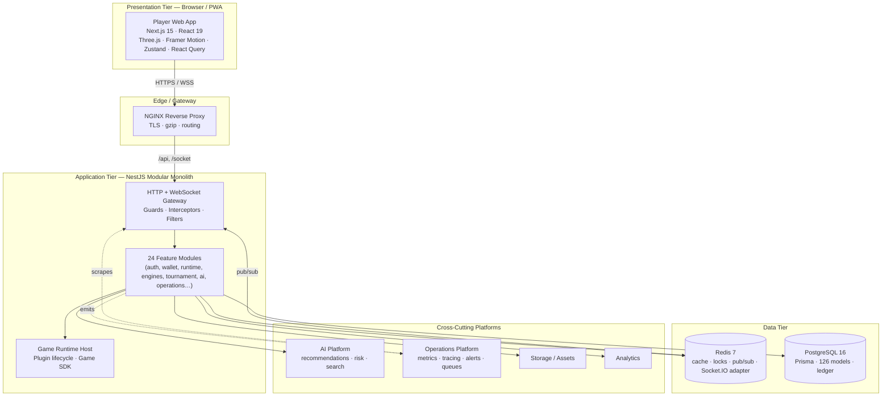

### 2.1 Component responsibilities

| Layer | Component | Responsibility | Why here |
| --- | --- | --- | --- |
| Presentation | **Next.js Web App** | Rendering, animation, client state, PWA shell | React 19 + app router gives hybrid SSR/CSR, streaming, and code-splitting |
| Edge | **NGINX** | TLS termination, gzip, routing `/`, `/api`, `/socket` | Single ingress; offloads TLS; enables blue/green |
| Application | **NestJS Gateway** | Auth, validation, transformation, error normalisation | Cross-cutting concerns centralised via guards/interceptors/filters |
| Application | **Feature Modules** | Domain logic (24 modules) | Modular monolith: strong boundaries, one deployable |
| Application | **Runtime Host** | Load and drive game plugins | Decouples the platform from individual games |
| Data | **Redis 7** | Cache, distributed locks, sorted-set leaderboards, Socket.IO adapter | In-memory speed for hot paths and coordination |
| Data | **PostgreSQL 16** | System of record — accounts, ledger, results | ACID guarantees for money and state |
| Cross-cutting | **AI / Operations / Analytics / Storage** | Intelligence, observability, reporting, assets | Consumed by modules; independently evolvable |

### 2.2 Architectural style & trade-offs

- **Modular monolith (chosen)** over microservices: at the current scale, one deployable with strong internal boundaries maximises development velocity, keeps transactions simple (no distributed sagas for the wallet), and defers operational complexity. The cost — a single scaling/deploy unit — is mitigated by horizontal replication of the stateless app tier.
- **Stateless app tier**: sessions, locks, and ephemeral state live in Redis; truth lives in Postgres. This lets the app tier scale horizontally behind NGINX with `start-first` zero-downtime updates.
- **Real-time via Socket.IO** (not raw WS) for reconnection, rooms, and a drop-in Redis adapter for multi-node fan-out.

---

## 3. System Components

The application tier is organised into **24 NestJS feature modules** plus shared workspace packages. Each module encapsulates one domain and exposes controllers (HTTP), gateways (WebSocket), services (logic), and Prisma-backed persistence.

### 3.1 Module catalogue

| Domain | Module(s) | Responsibility |
| --- | --- | --- |
| **Identity & access** | `auth`, `authorization`, `users`, `security` | Registration, login, JWT + refresh rotation, 2FA, RBAC/permissions, account lockout, session limits |
| **Financial core** | `wallet`, `wallet-engine`, `transactions` | Double-entry ledger, balances, reservations/settlement, idempotency, reconciliation, reporting |
| **Game platform** | `runtime`, `games` | Plugin runtime host, game registry, launch/deep-link resolution |
| **Game engines** | `crash`, `dice`, `roulette`, `card`, `sports` | Domain rules + real-time gateways per engine family |
| **Competition & economy** | `tournament`, plus leaderboard/rewards logic | Tournaments, brackets, leaderboards (Redis sorted sets), rewards |
| **Intelligence** | `ai`, `analytics` | Recommendations, risk/fraud signals, search, segmentation, reporting |
| **Experience services** | `notifications`, `mailer` | In-app + transactional email notifications |
| **Operations** | `operations`, `health`, `redis`, `database` | Metrics, tracing, alerts, queues, circuit breakers, health, infra clients |
| **Administration** | `admin` | Operator console APIs across all domains |

> **Note on frontend "system components":** the player experience introduces additional *client-side* systems — Player Identity, Inventory, Cosmetics, Community, World Map, Accessibility, and PWA. These are implemented in the frontend (stores + libraries) and, where persistence is required, back onto the identity/wallet/notification modules. They are documented in [§4 Frontend Architecture](#4-frontend-architecture) because their architecture is primarily client-side.

### 3.2 Component descriptions

- **Authentication (`auth`)** — issues short-lived JWT access tokens and rotating refresh tokens (httpOnly cookie). Owns registration, login, email verification, password reset, and TOTP two-factor. Delegates identity records to `users`.
- **Authorization (`authorization`)** — RBAC with fine-grained permissions. Exposes global guards (`RolesGuard`, `PermissionsGuard`) and decorators (`@Roles`, `@RequirePermissions`, `@Public`).
- **Users (`users`)** — the canonical player record, profile, status, and preferences.
- **Wallet (`wallet` + `wallet-engine`)** — the financial heart: multi-currency wallets, ledger, reservations, settlement, reconciliation. See [§9](#9-wallet-architecture).
- **Transactions (`transactions`)** — transaction history, references, and reporting projections over the ledger.
- **Runtime (`runtime`)** — hosts game plugins, manages lifecycle and active sessions, mediates between engines and the wallet. See [§7](#7-game-runtime-architecture).
- **Games (`games`)** — the game registry (catalogue, providers, categories, RTP, availability) and dynamic launcher.
- **Engines (`crash`, `dice`, `roulette`, `card`, `sports`)** — provably-fair rule engines with real-time Socket.IO gateways. See [§8](#8-game-engine-architecture).
- **Tournament (`tournament`)** — scheduled competitions, entries, brackets, prize pools; leaderboards backed by Redis sorted sets; rewards issuance.
- **AI (`ai`)** — recommendations, risk/fraud scoring, search, segmentation, and an LLM-integration/prompt layer. See [§10](#10-ai-platform).
- **Analytics (`analytics`)** — event capture and reporting aggregates for business intelligence.
- **Operations (`operations`)** — metrics registry, tracing, alert rules, background queue, circuit breakers, and a log buffer for the Log Explorer. See [§11](#11-operations-platform).
- **Notifications (`notifications`) + Mailer (`mailer`)** — in-app notifications and transactional email (log-only when SMTP is unconfigured).
- **Admin (`admin`)** — operator-facing APIs to configure games, run wallet operations, manage tournaments, and inspect operations.
- **Health / Redis / Database (`health`, `redis`, `database`)** — Terminus health indicators and shared infrastructure clients (Prisma, ioredis).

### 3.3 Module reference matrix

The table below is the canonical reference for module responsibilities, the primary entities each owns, its principal collaborators, and whether it exposes real-time (WebSocket) surfaces. Ownership is exclusive: exactly one module owns each entity, and other modules interact with it only through that module's service interface. This is the discipline that keeps a monolith from degenerating into a "big ball of mud".

| Module | Owns (primary entities) | Depends on | Real-time | Notes |
| --- | --- | --- | --- | --- |
| `auth` | Credentials, tokens, 2FA secrets, challenges | `users`, `redis` | No | Issues/rotates tokens; never stores the profile |
| `authorization` | Roles, permissions, grants | `users` | No | Exposes global guards + decorators |
| `users` | Player record, status | `redis` | No | Canonical identity; referenced by everything |
| `security` | Lockout counters, breach checks, session limits | `redis`, `users` | No | Defensive policy enforcement |
| `wallet` / `wallet-engine` | Wallets, ledger, reservations | `redis`, `transactions` | No | The financial core (see §9) |
| `transactions` | Transaction projections, references | `wallet` | No | Read/reporting over the ledger |
| `runtime` | Runtime sessions, replays | `games`, engines, `wallet` | Yes | The trust broker between engine and money |
| `games` | Game catalogue, providers, categories | `content` | No | Registry + launcher |
| `crash`/`dice`/`roulette`/`card`/`sports` | Round state, engine config | `runtime`, `wallet` | Yes | Provably-fair engines + gateways |
| `tournament` | Tournaments, entries, brackets, leaderboards | `wallet`, `redis` | Optional | Redis sorted sets for rankings |
| `ai` | Recommendation/risk models, prompts | `analytics`, `users` | No | Cross-cutting intelligence |
| `analytics` | Events, aggregates | — | No | BI substrate |
| `notifications`/`mailer` | Notification records, email dispatch | `users` | Optional | In-app + transactional email |
| `operations` | Metrics, alerts, queue, breakers, log buffer | all (observes) | No | Observability + resilience |
| `admin` | Admin operations | all (via services) | No | Operator console API |
| `health`/`redis`/`database` | Health indicators, infra clients | — | No | Shared infrastructure |

**Best practice — inter-module calls:** a module calls another module's *service* (injected via Nest DI), never its repository or Prisma models directly. This preserves invariants (e.g. only `wallet-engine` may write ledger rows) and makes future extraction into a service a mechanical change (swap the in-process service for a client).

**Anti-pattern guarded against:** "reach-around" writes — e.g. a game engine directly decrementing a balance column. The architecture makes this impossible in practice because engines have no Prisma access to wallet tables; they must call `WalletEngineService`.

---

## 4. Frontend Architecture

The frontend is a **Next.js 15 (App Router) / React 19** application, written in strict TypeScript, that presents the platform as a cinematic "Gaming Universe" and installable PWA.

### 4.1 Rendering strategy

| Concern | Approach | Why |
| --- | --- | --- |
| **App Router** | React Server Components by default; `'use client'` at interactive leaves | Minimise client JS; stream server-rendered shells |
| **Layouts** | Nested layouts per route group (`(auth)`, `(casino)`, `(dashboard)`, `(game)`, `admin`) | Each experience gets its own chrome (top-nav, immersive, admin) |
| **`template.tsx`** | Re-mounts per navigation → opacity cross-fade | Cinematic transitions without a hard cut; transform-free to preserve `position: fixed` |
| **Hydration** | Client stores hydrate after mount; intro/dynamic-world gate on `mounted` | Avoid hydration mismatches from time/random-dependent UI |
| **Lazy loading** | `next/dynamic({ ssr:false })` for Three.js hero; route-level code-splitting | Heavy WebGL never blocks first paint; base shared JS ≈ 103 kB |

### 4.2 Route groups

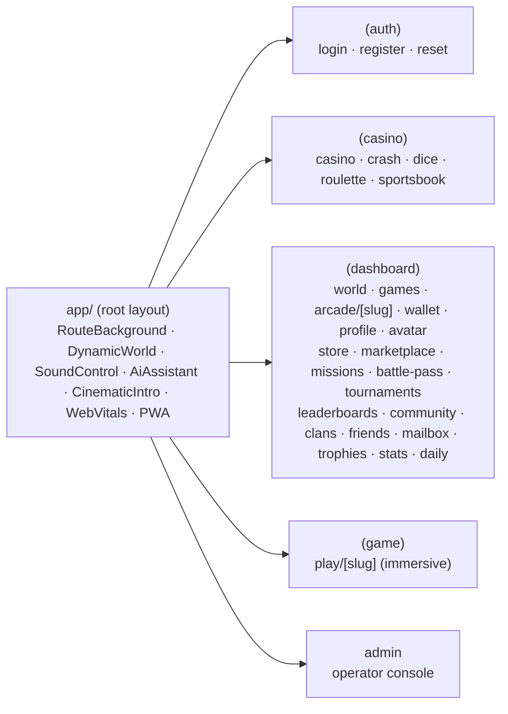

### 4.3 State management & data flow

State is deliberately **split by concern** rather than centralised:

| State kind | Mechanism | Examples |
| --- | --- | --- |
| **Server cache** | React Query (`@tanstack/react-query`) | Games, wallet balances, tournaments, sports fixtures |
| **Global client state** | Zustand stores | `auth-store`, `demo-wallet`, `player-profile`, `missions`, `game-stats`, `sports-slip-store`, `ui-store` |
| **Ephemeral UI** | Local `useState`/`useReducer` | Game round state, modals, form inputs |
| **Cross-cutting providers** | `providers/` | Theme (forced light), React Query client, Auth initializer |

**Why Zustand + React Query rather than a single store:** server data (which needs caching, retries, invalidation) and client identity/game state (which is synchronous and local) have different lifecycles. React Query owns the former; small Zustand stores own the latter. This keeps components thin and testable.

### 4.4 Client libraries (`src/lib`)

| Concern | Modules |
| --- | --- |
| **Typed API clients** | `api-client` (Axios), `auth-api`, `wallet-api`, `games-api`, `crash-api`, `dice-api`, `roulette-api`, `card-api`, `sports-api`, `tournament-api`, `ai-api`, `operations-api`, `runtime-api`, `admin-games-api` |
| **Client game toolkit** | `deck` (card engine), `game-result` (wallet/XP/stats/missions integration), `prototype-games` (registry), `sound` (WebAudio engine) |
| **Identity & economy** | `cosmetics`, `ecosystem-data`, `demo-session`, `leaderboard-mock`, `sports-mock` |
| **Platform** | `config`, `query-client`, `monitoring`, `utils` |

### 4.5 Component organisation

Components are **feature-sliced** under `src/components/`: `layout`, `shared`, `marketing`, `games`, `live`, `hero`, `backgrounds`, `experience`, `monitoring`, `profile`, `rewards`, `social`, plus per-engine folders (`crash`, `dice`, `roulette`, `card`, `sports`) and `runtime`. This co-locates all pieces of a feature and makes ownership obvious.

### 4.6 Animation & immersion stack

| Layer | Technology | Role |
| --- | --- | --- |
| **WebGL hero** | Three.js (raw, lazy) | Cinematic "gaming universe" scene behind the hero |
| **Route/UI motion** | Framer Motion | Page transitions, card physics/tilt, reveals, micro-interactions |
| **Ambient world** | CSS/GPU keyframes | Per-route themed backgrounds + time-of-day/weather dynamic world |
| **Audio** | WebAudio synthesis | Route-aware ambience + SFX (no shipped audio assets) |
| **Feedback** | Canvas/DOM particles | Click ripples, coin/confetti win FX, camera shake |

**Trade-off — raw Three.js over React-Three-Fiber:** R3F's React-19 peer requirements were fragile at build time; raw Three.js gives the same WebGL result, a smaller footprint, and precise lifecycle control (dispose on unmount, pause offscreen). See [§19](#19-performance-architecture).

### 4.7 Performance posture

- Shared First-Load JS held at ~**103 kB**; heavy features are route-split.
- Three.js and per-game components are lazy chunks (`ssr:false`).
- All `requestAnimationFrame`/timers/listeners are cleaned up on unmount; offscreen and tab-hidden animations pause (IntersectionObserver + `visibilitychange`).
- `prefers-reduced-motion` and a user-toggled reduced-motion mode disable non-essential animation.

### 4.8 Providers, hooks, and contexts

Client-wide concerns are composed once in `providers/` and mounted at the root layout:

| Provider | Role | Notes |
| --- | --- | --- |
| `ThemeProvider` (next-themes) | Forces the premium light theme | `forcedTheme="light"` — no dark mode by product decision (ADR-008) |
| `QueryProvider` | React Query client per session | `retry: 1`, `staleTime` 60s, `refetchOnWindowFocus: false`, dev devtools |
| `AuthInitializer` | Silent refresh on mount | Restores a session from the httpOnly refresh cookie; renders nothing |
| `Toaster` (sonner) | Global toast surface | Light theme, top-right |

Reusable hooks (`src/hooks/`) encapsulate cross-page behaviour (favourites, fullscreen, runtime bindings), while feature state lives in Zustand stores. The platform deliberately avoids React Context for high-frequency state (Context re-renders the whole subtree); Zustand's selector subscriptions re-render only consumers of the changed slice — an important performance decision for an animation-heavy UI.

### 4.9 Design system (`@gaming-platform/ui`)

The UI package is the **single source of truth for styling**: design tokens (HSL CSS variables), a shared Tailwind preset, and headless primitives (Button, Card, Badge, Input, Dialog, etc.). Both the app and the package extend the same preset so tokens never drift. Key primitives:

- **Tokens** — semantic colour, radius, shadow, and gradient variables consumed via `hsl(var(--x))`. Changing a token restyles the whole platform.
- **Variants** — `class-variance-authority` drives Button/Badge variants (`gradient`, `neon`, `gold`, `glass`, `hot`, `jackpot`, …).
- **Utilities** — `card-premium`, `glass`, `sheen`, `text-gradient`, `bg-grid`, glow shadows, and gaming keyframes.

**Why a package, not app-local styles:** the design system is shared by the app, admin, and any future client (mobile/web). Centralising it prevents the classic "each page reinvents the card" drift and lets a rebrand be a token change.

### 4.10 Experience & immersion systems (client)

These client-only systems create the "living universe" and are architecturally noteworthy because they run continuously and must stay cheap:

| System | Module | Behaviour | Performance guard |
| --- | --- | --- | --- |
| **Cinematic intro** | `experience/cinematic-intro` | One-shot animated boot per session (sessionStorage) with Skip | Instant-skips under reduced motion |
| **Route background engine** | `backgrounds/route-background` | Picks a themed animated scene per route | Pure CSS/GPU; one mount |
| **Dynamic world** | `backgrounds/dynamic-world` | Time-of-day tint + rotating weather (rain/snow/fog/festival/fireworks) | CSS transforms; mounted-gated |
| **WebGL universe** | `hero/gaming-universe` | Raw Three.js particle/instanced scene | Lazy, DPR-capped, offscreen-pause, disposed |
| **Sound engine** | `lib/sound` | WebAudio-synth ambience + SFX, route-aware | Gesture-gated; muted by default |
| **AI companion (Nova)** | `shared/ai-assistant` | Context-aware suggestions + idle animation | Reads live stores; no polling |
| **Micro-interactions** | `shared/click-fx`, `game-fx` | Click ripples, coin/confetti win FX, camera shake | GPU transforms, auto-clean |
| **Monitoring** | `monitoring/*` | Web Vitals, error logging, offline banner, PWA register | Effect-loaded; listeners cleaned up |
| **Accessibility** | `shared/accessibility-menu` | Reduced-motion, high-contrast, font scaling | Persisted; CSS-class driven |

**Design principle:** every ambient system is *gated* (session, mount, IntersectionObserver, reduced-motion) so it contributes to immersion without contending for the main thread or leaking resources. This is what allows an animation-dense UI to hold 60 FPS.

### 4.11 PWA architecture

The app is an installable PWA: `manifest.webmanifest` (name, icons, theme colour, standalone display), SVG app icons (`any` + `maskable`), an offline fallback page, and a **production-only service worker** (`sw.js`) that is network-first for navigations (fresh content, offline fallback) and cache-first for static assets. The SW is registered only in production to avoid cache-staleness during development and E2E. See [§17](#17-deployment-architecture) and [§20](#20-testing-architecture).

---

## 5. Backend Architecture

The backend is a **NestJS 10** application using the framework's dependency-injection, module, and lifecycle systems. It runs a versioned HTTP API (`/api/v1`) and Socket.IO gateways.

### 5.1 Building blocks

| NestJS primitive | Role in this platform | Examples |
| --- | --- | --- |
| **Module** | Domain boundary + DI scope | `WalletModule`, `RuntimeModule`, `OperationsModule` |
| **Controller** | HTTP endpoint mapping | `AuthController`, `WalletController` |
| **Gateway** | WebSocket endpoint (Socket.IO) | Crash/round gateways |
| **Service** | Business logic, injectable | `WalletService`, `RuntimeService` |
| **Repository/Prisma** | Persistence | `PrismaService` (shared) |
| **DTO** | Request/response contracts | Zod/class-validator DTOs |
| **Guard** | Access control | `JwtAuthGuard`, `RolesGuard`, `PermissionsGuard`, `ThrottlerGuard` |
| **Decorator** | Metadata/ergonomics | `@Public`, `@Roles`, `@CurrentUser`, `@RequirePermissions` |
| **Interceptor** | Cross-cutting response shaping | `LoggingInterceptor`, `TransformInterceptor` |
| **Filter** | Error normalisation | `AllExceptionsFilter` |
| **Middleware** | Pre-routing concerns | `RequestIdMiddleware` |

### 5.2 Global pipeline (application-wide)

Registered once (in `app.module.ts` / `main.ts`) and applied to every request:

```mermaid
flowchart LR
  Req[HTTP Request] --> MW[RequestId Middleware]
  MW --> RL[ThrottlerGuard\nrate limiting]
  RL --> JWT[JwtAuthGuard\n@Public bypass]
  JWT --> Roles[RolesGuard]
  Roles --> Perm[PermissionsGuard]
  Perm --> VP[ValidationPipe\nwhitelist + transform]
  VP --> Ctrl[Controller]
  Ctrl --> Svc[Service]
  Svc --> Repo[Prisma]
  Repo --> DB[(PostgreSQL)]
  Svc --> TI[TransformInterceptor\nenvelope]
  TI --> Res[Response]
  Svc -. errors .-> EF[AllExceptionsFilter]
```

**Why global guards in this order:** rate-limiting first (cheapest rejection, DoS resistance), then authentication (identity), then authorization (roles → permissions). Validation runs after access control so we never validate a payload we would reject anyway. Every response is wrapped by `TransformInterceptor` into a consistent envelope, and all errors flow through `AllExceptionsFilter` for uniform shape and safe messages.

### 5.3 Real-time (WebSockets)

Engine gateways use **Socket.IO** with a CORS-restricted origin allow-list. Timers/intervals inside gateways are cleaned up in `onModuleDestroy`. For multi-node deployments the **Socket.IO Redis adapter** fans out broadcasts across replicas (documented as the scale-out path).

### 5.4 Caching & coordination (Redis)

| Use | Pattern |
| --- | --- |
| **Hot reads** | Cache-aside with TTL (`allkeys-lru` in production) |
| **Distributed locks** | Per-wallet lock keys guard concurrent settlement |
| **Leaderboards** | Sorted sets (`ZADD`/`ZRANGE`) |
| **Pub/Sub** | Socket.IO adapter + cross-node events |

### 5.5 Transactions & consistency

Financial and multi-step operations run inside **Prisma interactive transactions** with **optimistic locking** (version columns) and **idempotency keys**. See [§9](#9-wallet-architecture) and [§15](#15-wallet-transaction-flow).

### 5.6 Configuration & lifecycle

- Typed configuration is validated at boot (Zod). The process **fails fast** on missing/invalid environment.
- `enableShutdownHooks()` drains connections on SIGTERM so container orchestration can perform graceful, zero-downtime rollouts.

---

## 6. Database Architecture

The system of record is **PostgreSQL 16**, accessed through **Prisma 6**. The schema is large and domain-partitioned: **126 models** and **69 enums** across sixteen schema files.

### 6.1 Schema domains

Prisma's split-schema layout keeps the model organised by domain:

| Schema file | Domain | Representative concerns |
| --- | --- | --- |
| `base` | Shared base types & mixins | Common columns, audit fields |
| `enums` | Global enumerations | Statuses, types (69 enums) |
| `auth` | Identity & access | Users, credentials, tokens, 2FA, roles, permissions |
| `sessions` | Session management | Active sessions, refresh lineage |
| `profile` | Player identity | Profile, preferences, progression |
| `wallet` | Financial core | Wallets, ledger entries, transactions, reservations |
| `games` | Game domain | Game state, rounds, results |
| `game-registry` | Catalogue | Games, providers, categories, RTP, availability |
| `game-runtime` | Runtime | Plugin registration, runtime sessions, replays |
| `content` | Content | Collections, banners, editorial |
| `promotions` | Economy | Rewards, bonuses, promotions |
| `notifications` | Messaging | Notification records |
| `localization` | i18n | Locale content |
| `analytics` | BI | Events, aggregates |
| `admin` | Operator | Admin users, operations records |
| `infrastructure` | Platform | Infra-level bookkeeping |

### 6.2 Data-modelling principles

| Principle | Implementation | Why |
| --- | --- | --- |
| **Double-entry ledger** | Every money movement = paired debit/credit rows | Balances are derivable & reconcilable; no "lost" money |
| **Optimistic concurrency** | `version` columns on hot rows (wallets) | Safe concurrent settlement without long DB locks |
| **Auditing** | Created/updated timestamps + audit records | Traceability for finance and support |
| **Soft deletes** | Status/`deletedAt` semantics where history matters | Preserve history; never hard-delete financial data |
| **Idempotency** | Unique idempotency keys on financial writes | Safe retries |
| **Indexing** | Composite indexes on hot lookups (userId, reference, createdAt) | Predictable query performance |

### 6.3 Migration & environments

- **Forward-only, additive migrations** (Prisma). New releases apply pending migrations via `prisma migrate deploy` before the new app version starts.
- For a fresh prototype database with no migration history, `prisma db push` syncs the schema.
- Backups: nightly `pg_dump` (custom format, parallel) plus before each migration; continuous archiving / PITR in managed Postgres. See [§17](#17-deployment-architecture).

### 6.4 Key entity relationships (conceptual)

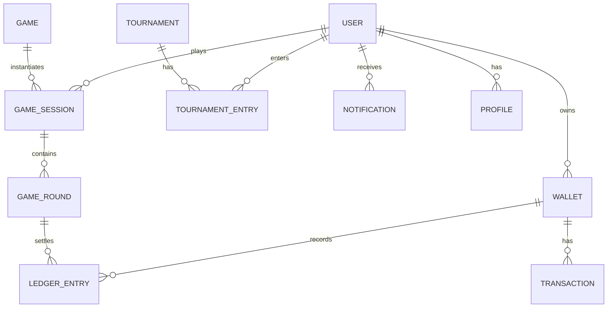

### 6.5 Indexing, soft deletes, auditing, and statistics

**Indexing strategy.** Indexes are added to match the *actual* hot query paths, not speculatively. The dominant patterns are: lookups by `userId` (everything a player owns), by `reference`/idempotency key (financial writes), and range scans by `createdAt` (history and reporting). Composite indexes (`userId, createdAt`) serve the common "this player's recent X" query. Over-indexing is avoided because every index taxes writes — and the ledger is write-heavy.

**Soft deletes.** Records whose history matters (financial rows, results, audit trails) are **never hard-deleted**. Deletion is expressed as a status transition or `deletedAt` timestamp so history and reconciliation remain intact. Truly ephemeral rows (e.g. expired one-time tokens) may be pruned.

**Auditing.** Created/updated timestamps are standard; sensitive domains (wallet, admin actions) additionally write audit records capturing who did what and when. This is a regulatory and support necessity for a money-handling system.

**Statistics & analytics.** Game results and rounds feed statistics (recent results, hot/cold numbers, RTP, streaks) surfaced live in the UI, and analytics aggregates power operator dashboards. These are read-optimised projections; the raw immutable events remain the source of truth.

**Why Prisma's split schema.** A 126-model schema in one file is unmaintainable. Splitting by domain (`wallet.prisma`, `auth.prisma`, `games.prisma`, …) mirrors the module boundaries, so a developer working on wallets reads one focused file, and schema ownership aligns with code ownership.

---

## 7. Game Runtime Architecture

The **Game Runtime** is the host that turns the platform into a *gaming platform*: it loads game plugins, manages their lifecycle, drives real-time events, and mediates every financial interaction through the wallet. Games never touch the wallet directly.

### 7.1 Plugin model

Games are **plugins** conforming to a contract defined by the **Game SDK** (`@gaming-platform/game-sdk`). A plugin declares its identity, configuration schema, and lifecycle hooks. The runtime discovers/registers plugins and exposes them through the game registry.

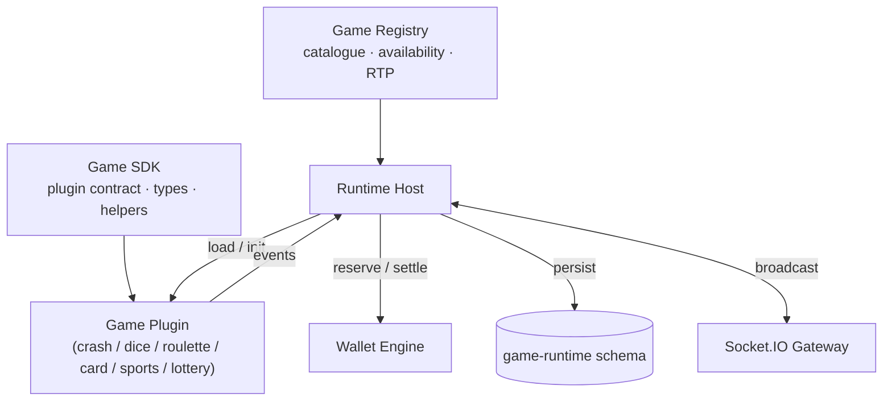

### 7.2 Runtime lifecycle

| Phase | Responsibility |
| --- | --- |
| **Register** | Plugin declared to the registry (metadata, config schema, launcher key) |
| **Open / Launch** | Player launches a game → runtime resolves the plugin and creates a runtime session |
| **Play loop** | Plugin drives rounds, emits events; runtime brokers bets/reservations with the wallet |
| **Settle** | On outcome, runtime instructs the wallet to commit/settle; results persist |
| **Replay** | Rounds are recorded so a session can be reconstructed/audited |
| **Close** | Session finalised; resources released |

### 7.3 State machine, events, and persistence

Each plugin exposes a **deterministic state machine** (idle → betting → resolving → settled). The runtime persists round state and a **replay log** so any round can be reconstructed for audit or dispute resolution — critical for provable fairness. Events (round start, tick, result, cash-out) flow over Socket.IO to subscribed clients.

### 7.4 SDK services

The Game SDK provides shared services so plugins don't re-implement cross-cutting concerns: asset loading, localization, animation timing hints, audio cues, and statistics reporting. This keeps individual engines focused purely on rules.

### 7.5 SDK service responsibilities

| SDK service | What it provides | Why it belongs in the SDK, not each engine |
| --- | --- | --- |
| **Asset loading** | Lazy, cached retrieval of art/audio manifests | Every game needs it; caching once avoids duplication |
| **Localization** | Locale-aware strings and formats | Consistent i18n across all titles |
| **Animation timing** | Canonical durations/easing hints | Uniform "feel" and reduced-motion compliance |
| **Audio cues** | Named cue triggers routed to the sound engine | Engines stay presentation-agnostic |
| **Statistics reporting** | A uniform `record(result)` sink | One integration point for history/RTP/streaks |

**Determinism contract.** The runtime guarantees each plugin a **seed** at round start and expects a **pure outcome** in return. The plugin must not read wall-clock time or generate its own entropy for the outcome — otherwise the round would not be reproducible. Presentation randomness (particle jitter) is fine; *outcome* randomness must derive from the seed. This contract is what makes the whole catalogue provably fair and auditable.

**Persistence & replay.** The runtime writes each round's seed, inputs, and outcome to the `game-runtime` schema. A replay is a deterministic re-execution of the engine with the stored seed/inputs — invaluable for dispute resolution ("show me exactly what happened in round #48213") and for regression-testing an engine against historical rounds.

---

## 8. Game Engine Architecture

Game engines are **domain packages** (`games/*`) implementing provably-fair rules. Each is deterministic and seedable so outcomes are reproducible and unit-testable.

### 8.1 Engine catalogue

| Engine | Package | Mechanic | Fairness model |
| --- | --- | --- | --- |
| **Crash** | `crash-engine` | Rising multiplier; cash out before bust | Seed → bust point from a defined distribution + house edge |
| **Dice** | `dice-engine` | Over/under a target roll | Seed → uniform roll; win chance ↔ payout by house edge |
| **Roulette** | `roulette-engine` | European single-zero wheel | Seed → pocket; semantic red/black/parity payouts |
| **Card** | `card-engine` | Blackjack, baccarat, dragon-tiger, andar-bahar, teen-patti, etc. | Seed → shuffled shoe; rule-specific evaluation |
| **Sports** | `sports-engine` | Fixtures, markets, odds, bet settlement | Data-driven markets; deterministic settlement |
| **Lottery** | `lottery-engine` | Draw-based | Seed → draw |

> **Arcade** games (2048, memory, reaction, color-match, plinko) are skill/casual titles surfaced primarily as client prototypes and are not wagered against the ledger in the same way; they integrate with XP/stats/missions.

### 8.2 Engine design contract

Every engine adheres to the same shape:

1. **Config** — a rule set (limits, edge, variants) validated by schema.
2. **Seedable RNG** — deterministic given a seed (provably fair).
3. **Pure evaluation** — `(config, seed, bet) → outcome` with no side effects.
4. **Statistics** — exposes distributions (recent results, hot/cold, RTP) for UI.

**Why pure + seedable:** purity makes engines trivially unit-testable and side-effect-free; seedability makes outcomes reproducible and auditable, which is the foundation of *provable fairness*.

### 8.3 Adding a new game (architecture only)

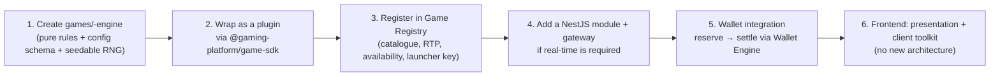

No existing engine, module, or the wallet is modified — the new game is **additive**. See [§22](#22-extension-guide).

### 8.4 Per-engine architecture notes

**Crash.** The engine models a rising multiplier `m(t)` that grows over time until a *bust point* drawn from a house-edge-adjusted distribution (a seeded random `r` mapped through `bust ≈ (1 − edge) / (1 − r)`, clamped). A player cashes out before bust to win `stake × m(cashout)`. The design is a pure function of `(seed, edge)`; the graph/rocket animation is presentation only. Real-time ticks broadcast over the gateway; the round's replay log records the seed and bust so any round can be re-verified.

**Dice.** The player chooses a target and direction (over/under); the engine draws a uniform value in `[0, 100)` from the seed. Win chance is the covered range; the fair multiplier is `(100 − edge) / winChance`. Because chance and payout are inverse, RTP is constant across bet configurations — a property the UI surfaces live.

**Roulette.** European single-zero (0–36). The seed selects a pocket; the engine evaluates the standard bet families (straight, red/black, odd/even, dozens, columns) with their canonical payouts (35:1 straight, even-money outside). The wheel-spin physics are a presentational easing to the pre-decided pocket — the *outcome is decided before the animation*, which is the correct model for a provably-fair server-authoritative game.

**Card.** A shared shoe abstraction (`packages/games/card-engine` + client `lib/deck`) provides seeded shuffling and rank/suit helpers. On top of it sit rule modules per title — Blackjack (hit/stand/double, dealer-to-17, 3:2 blackjack), Baccarat (player/banker/tie with the third-card rule), Dragon Tiger, Andar Bahar, Lucky 7, Casino War, and Teen Patti (three-card hand ranking). Each is a pure evaluator over a seeded shoe, so the same seed reproduces the same deal.

**Sports.** Data-driven: competitions → matches → markets → selections with decimal odds. Settlement is deterministic given the final result. The frontend enriches live matches with statistics, commentary, and timelines; when no live feed is present, deterministic mock fixtures keep the surface fully populated (never an empty state).

**Lottery.** Draw-based outcomes from a seed; the simplest engine, included to demonstrate the plugin contract's generality.

**Common invariant:** every engine is `(config, seed, bet) → outcome` with no I/O. Persistence, money, and broadcasting are the runtime's job, not the engine's — a separation that keeps engines trivially unit-testable and auditable.

---

## 9. Wallet Architecture

The wallet is the platform's **financial system of record**. Its guiding rule: *money is never a mutable number that we "just update" — it is the running total of an immutable, double-entry ledger.*

### 9.1 Core concepts

| Concept | Definition | Purpose |
| --- | --- | --- |
| **Wallet** | A player's balance in a currency, with `available`, `locked`, `pending`, `total` | Multi-currency, multi-purpose (main, bonus, reward) |
| **Ledger entry** | An immutable debit/credit record | The source of truth |
| **Reservation** | Funds locked for an in-flight bet | Prevents double-spend during play |
| **Settlement** | Commit of a reservation to a final debit/credit | Realises the outcome |
| **Transaction** | A player-facing record projected over ledger entries | History/reporting |
| **Idempotency key** | Unique key per financial intent | Safe retries |

### 9.2 Correctness mechanisms

| Mechanism | Problem it solves |
| --- | --- |
| **Double-entry ledger** | Guarantees the books always balance; enables reconciliation |
| **Optimistic locking (version column)** | Two concurrent settlements can't both win a stale read |
| **Per-wallet Redis lock** | Serialises high-contention operations on one wallet across nodes |
| **Idempotency keys** | A retried bet/settlement is applied exactly once |
| **Reconciliation** | Sum of debits vs credits verified; drift is detectable and reportable |

### 9.3 Reservation → settlement model

```mermaid
sequenceDiagram
  participant G as Game Runtime
  participant W as Wallet Engine
  participant L as Ledger
  participant R as Redis Lock
  G->>W: reserve(userId, amount, idemKey)
  W->>R: acquire per-wallet lock
  W->>W: check available >= amount (optimistic version)
  W->>L: write reservation (locked += amount)
  W-->>G: reservationId
  Note over G: round resolves
  G->>W: settle(reservationId, outcome, idemKey)
  W->>R: acquire per-wallet lock
  W->>L: write paired debit/credit (double entry)
  W->>W: bump version; unlock funds
  W-->>G: settlementResult
```

### 9.4 Reporting & reconciliation

Operators can pull revenue/exposure reports and run a **reconciliation** that verifies `Σ debits == Σ credits` and reports any difference. Because balances are derived from the ledger, discrepancies are *detectable*, not silent.

### 9.5 Wallet types and balance components

A player may hold multiple wallets, and each wallet's total is decomposed into components rather than a single scalar. This separation is essential for correctness and for features like bonuses and pending withdrawals.

| Wallet type | Purpose |
| --- | --- |
| **Main / cash** | Real spendable balance |
| **Bonus** | Promotional funds with wagering requirements before conversion |
| **Reward / loyalty** | Points/loyalty currency |

| Balance component | Meaning |
| --- | --- |
| `available` | Spendable now |
| `locked` | Reserved for in-flight bets |
| `pending` | Awaiting clearance (e.g. withdrawal in progress) |
| `total` | `available + locked + pending` |

**Why decompose the balance:** a single "balance" number cannot express that funds are simultaneously reserved for a live round *and* not yet spendable. Modelling `available/locked/pending` explicitly makes double-spend structurally impossible — you can only reserve against `available`.

### 9.6 Reservation lifecycle & failure recovery

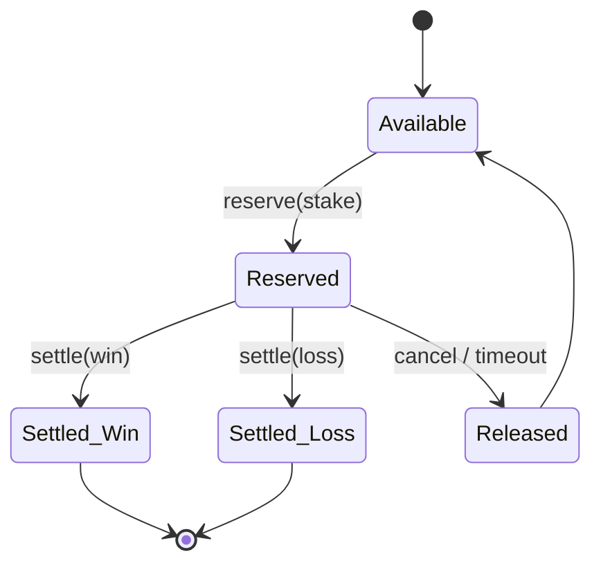

A process crash between *reserve* and *settle* is the classic failure case. Because the reservation is a durable ledger fact (not an in-memory flag), the funds remain *reserved* — never lost and never double-spent. A reconciliation job (or a corrective settlement keyed by the original idempotency key) resolves orphaned reservations. **This is the single most important reliability property of the financial core.**

### 9.7 Concurrency model in depth

Two players — or two tabs — settling the same wallet concurrently is guarded by three layers working together:

1. **Per-wallet Redis lock** serialises settlement across nodes (coarse-grained, short-held).
2. **Optimistic version column** catches any stale read that slips through (fine-grained, DB-enforced).
3. **Idempotency key** makes a retried settlement a no-op (exactly-once semantics).

Using all three is defence-in-depth: the Redis lock keeps contention low, the version column is the correctness backstop even if Redis is unavailable, and idempotency handles client/network retries.

---

## 10. AI Platform

The AI platform is a cross-cutting intelligence layer consumed by other modules and the frontend.

| Capability | Description | Consumers |
| --- | --- | --- |
| **Recommendations** | "Recommended for you" games, missions, challenges based on play history | Home lobby, Nova assistant |
| **Search** | Semantic/typo-tolerant game and content search | Search overlay (⌘K) |
| **Fraud / Risk** | Behavioural signals, anomaly scoring | Wallet/ops/admin review |
| **Segmentation** | Player cohorts (new, VIP, at-risk) | Promotions, retention |
| **Analytics** | Engagement/economy metrics | Operator dashboards |
| **LLM integration + Prompt Manager** | Managed prompts for assistant/insights | AI assistant, admin insights |

### 10.1 Data flow

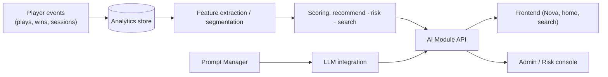

The **Nova AI companion** on the frontend surfaces these signals as context-aware nudges (claim daily reward, finish a mission, an achievement close to unlocking, a live event, a recommended game), reading live client state and the AI recommendations.

### 10.2 Model & prompt lifecycle

The AI module treats models and prompts as **versioned, governed assets** rather than ad-hoc calls:

| Stage | Concern |
| --- | --- |
| **Feature extraction** | Derive stable features from analytics events (play frequency, stake profile, game affinity) |
| **Scoring** | Produce recommendation/risk/segment scores; deterministic and explainable where possible |
| **Prompt management** | LLM prompts are named, versioned, and parameterised — never inline string concatenation |
| **Guardrails** | Inputs/outputs are validated; the LLM never sees secrets or raw PII |
| **Serving** | Scores/insights are exposed through the AI module API and cached where appropriate |

**Why a Prompt Manager:** treating prompts as code (versioned, reviewable, testable) is what turns "we call an LLM sometimes" into a maintainable capability. It also isolates the rest of the platform from any specific model/provider — the AI module is the single seam through which intelligence flows, so swapping or upgrading a model is a contained change.

**Trust boundary for AI:** AI outputs are **advisory**. A recommendation influences the UI; a risk score informs a human/operator decision. AI never *autonomously* moves money or grants access — those remain deterministic, server-authoritative decisions in the wallet and authorization modules.

---

## 11. Operations Platform

The Operations platform provides the observability and resilience needed to run a real-money system.

| Capability | Implementation | Surface |
| --- | --- | --- |
| **Health** | Terminus deep `/health`, `/health/liveness`, `/health/readiness`; public `/operations/status` | Orchestrator probes |
| **Metrics** | Prometheus exposition (`/admin/operations/metrics/prometheus`) | Prometheus/Grafana |
| **Tracing** | OpenTelemetry OTLP hook + per-request `x-trace-id` | APM |
| **Logging** | Structured JSON with secret/PII redaction; Log Explorer ring buffer | Aggregator (Loki/ELK/CloudWatch) |
| **Alerting** | Default alert rules (DB/Redis down, failed settlements, wallet inconsistency) | On-call pager |
| **Queues** | Background queue with drain + cleanup on shutdown | Async work |
| **Circuit breakers / retries** | Guard flaky dependencies | Resilience |
| **Web Vitals** | Client LCP/INP/CLS/FCP/TTFB → monitoring sink | Frontend RUM |

### 11.1 Health & readiness semantics

- **Liveness** — is the process alive? (container `HEALTHCHECK`).
- **Readiness** — are dependencies (DB, Redis) reachable? (K8s readiness / load-balancer gating).
- **Deep health** — full dependency-aware status for dashboards.

Separating these prevents a slow dependency from killing a live pod, while still removing it from rotation.

### 11.2 Resilience primitives

| Primitive | Behaviour | Where used |
| --- | --- | --- |
| **Background queue** | Async work with graceful drain + cleanup on shutdown | Notifications, deferred processing |
| **Circuit breaker** | Trips open after repeated failures; fast-fails until half-open probe succeeds | Wrapping flaky dependencies |
| **Retry with backoff** | Bounded retries for transient errors | Idempotent operations only |
| **Log buffer** | In-memory ring buffer of recent structured logs | Powers the admin Log Explorer without a full log store |

**Why circuit breakers matter here:** in a real-money system, a hung dependency must not cascade into stuck reservations. A breaker converts a slow failure into a fast, observable one, and the alert rules page on-call before players notice.

### 11.3 Alerting model

Default alert rules cover the operational risks that map to money and availability: database/Redis unreachable, elevated error rate, failed settlements, and wallet reconciliation drift. Alerts are emitted as `operations:alert` events and are designed to be wired to Prometheus Alertmanager and an on-call pager. The philosophy is **alert on symptoms that matter to players and the ledger**, not on every metric wobble.

### 11.4 The four observability signals

The platform implements all four pillars so an operator can answer *"is it healthy, how is it behaving, what happened, and where is it slow?"*:

| Signal | Mechanism | Answers |
| --- | --- | --- |
| **Health** | Terminus probes | Is it up and ready? |
| **Metrics** | Prometheus counters/histograms | How is it behaving over time? |
| **Logs** | Structured JSON (redacted) | What exactly happened? |
| **Traces** | OpenTelemetry + `x-trace-id` | Where is the latency? |

Client-side, **Web Vitals** (LCP/INP/CLS/FCP/TTFB) extend observability into the browser, so frontend regressions are visible in the same monitoring discipline as backend ones.

---

## 12. Frontend Data Flow

A representative read/write cycle from a page to the database and back:

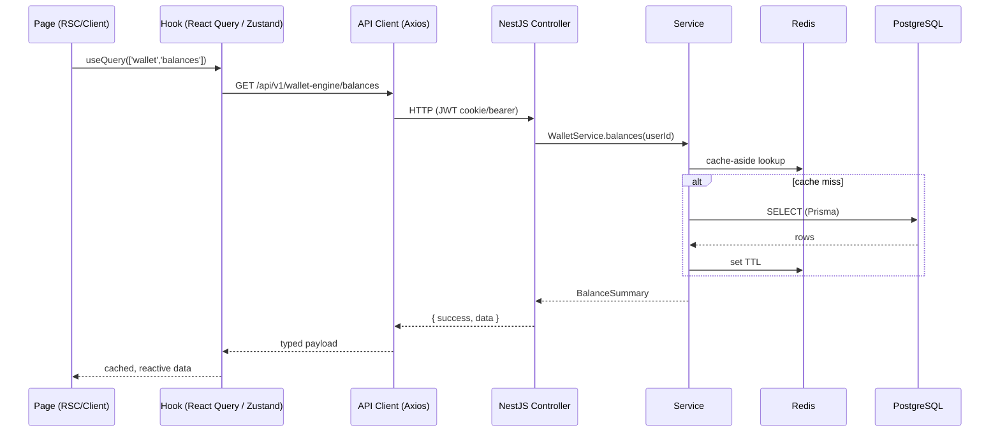

**Design notes:** React Query dedupes/caches and manages retries and `refetchInterval` (e.g. balances every 30s). In *demo mode*, financial reads are served entirely client-side from the demo wallet store — no backend round-trip — so the demo experience is instant and never errors.

---

## 13. Backend Request Flow

```mermaid
flowchart TD
  A[HTTP Request] --> B[RequestId Middleware\nx-request-id]
  B --> C[ThrottlerGuard]
  C --> D{@Public?}
  D -- no --> E[JwtAuthGuard]
  D -- yes --> F[Controller]
  E --> G[RolesGuard]
  G --> H[PermissionsGuard]
  H --> I[ValidationPipe]
  I --> F[Controller]
  F --> J[Service]
  J --> K[Prisma Repository]
  K --> L[(PostgreSQL)]
  J --> M[TransformInterceptor\nresponse envelope]
  M --> N[HTTP Response]
  J -. throws .-> O[AllExceptionsFilter]
  O --> N
```

Every response shares a consistent envelope (`success`, `statusCode`, `message`, `data`, `timestamp`, `path`, `requestId`), and every error is normalised by `AllExceptionsFilter` so clients get predictable, safe error shapes.

---

## 14. Authentication Flow

```mermaid
sequenceDiagram
  participant U as User
  participant FE as Frontend
  participant A as Auth Module
  participant DB as PostgreSQL
  U->>FE: register(email, password)
  FE->>A: POST /auth/register
  A->>DB: create user (hashed password)
  A-->>FE: user + tokens (access + httpOnly refresh)
  U->>FE: login(email, password)
  FE->>A: POST /auth/login
  A->>DB: verify credentials, lockout checks
  alt 2FA enabled
    A-->>FE: requiresTwoFactor + challengeToken
    U->>FE: TOTP code
    FE->>A: POST /auth/2fa/verify
  end
  A-->>FE: session { user, accessToken }
  Note over FE: access token in memory; refresh in httpOnly cookie
  FE->>A: (later) POST /auth/refresh (cookie)
  A-->>FE: rotated access token
  U->>FE: logout
  FE->>A: POST /auth/logout (clears session)
```

| Aspect | Decision | Why |
| --- | --- | --- |
| **Access token** | Short-lived JWT, in memory | Minimise exposure; XSS can't read httpOnly |
| **Refresh token** | Rotating, httpOnly cookie | Survives reloads; mitigates token theft |
| **2FA** | TOTP challenge on login | Account protection |
| **RBAC** | Global roles + permissions guards | Fine-grained, fail-closed authorization |
| **Lockout / session limits** | Attempt caps, concurrent-session cap | Brute-force + account-sharing defence |
| **Demo mode** | Dev-only client session, any non-empty credentials | Frictionless design review; **production auth untouched** |

---

## 15. Wallet Transaction Flow

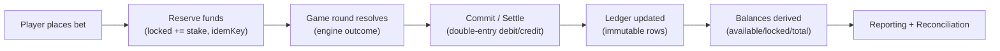

Each transition is idempotent (keyed), guarded by the per-wallet lock, and optimistic-locked against the wallet's version. A crash between *reserve* and *settle* leaves funds *reserved* (never lost); reconciliation and a corrective settlement recover the state. See [§9](#9-wallet-architecture).

---

## 16. Runtime Flow

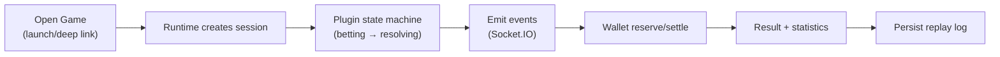

The runtime is the **only** component that both talks to a game plugin and to the wallet, keeping the trust boundary crisp: engines compute outcomes; the runtime applies them financially and records replays.

---

## 17. Deployment Architecture

### 17.1 Topology

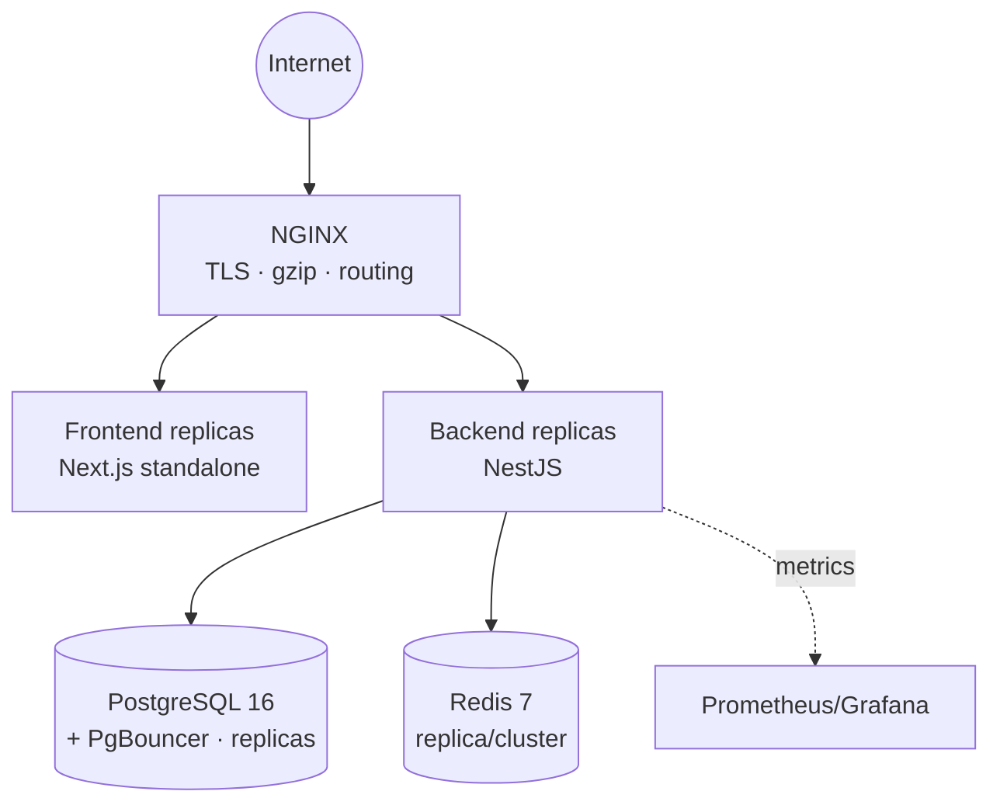

### 17.2 Containerisation

| Practice | Detail | Why |
| --- | --- | --- |
| **Multi-stage builds** | `turbo prune --docker` → minimal context, optimal layer caching | Small images, fast rebuilds |
| **Non-root** | Run as uid 1001 (`nestjs`/`nextjs`) | Reduced blast radius |
| **`tini` init** | PID-1 signal handling / zombie reaping | Clean SIGTERM → graceful shutdown |
| **`HEALTHCHECK`** | Backend → `/health/liveness`; frontend → `/` | Orchestrator can replace unhealthy tasks |
| **Standalone output** | Next.js standalone (`BUILD_STANDALONE`) | Tiny runtime image |

### 17.3 Compose & production override

- `docker-compose.yml` — dev/staging reference stack with DB/Redis/app healthchecks, dependency ordering, and a profile-gated `migrate` service.
- `docker-compose.prod.yml` — resource limits/reservations, 2× replicas for app tiers, **`start-first` zero-downtime** updates with auto-rollback, log rotation, Redis `allkeys-lru`.

### 17.4 CI/CD

| Workflow | Trigger | Responsibility |
| --- | --- | --- |
| `ci.yml` | push/PR | install → prisma generate → typecheck → lint → **test** → build → dependency audit → docker build |
| `codeql.yml` | push/PR + weekly | SAST (TS/JS) |
| `release.yml` | `v*` tag | buildx → SBOM + provenance → Trivy scan → push GHCR → GitHub Release |
| `rollback.yml` | manual | re-tag a known-good image to `:rollback`/`:latest` (no rebuild) |

### 17.5 Scaling & DR

Stateless app tiers scale horizontally (HPA on CPU/latency). Postgres scales vertically first, then read replicas + PgBouncer. Redis gains a replica/cluster and `allkeys-lru`. DR targets: RPO ≤ 5 min (PITR/WAL), RTO ≤ 30 min; quarterly restore drills.

### 17.6 Environment configuration

Configuration is environment-driven and **validated at boot** (Zod); the process fails fast on a missing or invalid variable, so a misconfigured deployment never limps along in a half-broken state. Environment-specific overrides layer on top of a base `.env`:

| Layer | Loaded when | Purpose |
| --- | --- | --- |
| `.env` | always | Base defaults |
| `.env.development` | `NODE_ENV=development` | Local-friendly, debug logging, Swagger on |
| `.env.staging` | staging | Pre-prod parity |
| `.env.production` | production | Hardened: `SWAGGER_ENABLED=false`, `AUTH_COOKIE_SECURE=true`, strict `CORS_ORIGINS` |

Key production-critical variables: `DATABASE_URL` (via PgBouncer with a connection limit), `REDIS_URL`, JWT access/refresh secrets (≥32 chars, from a vault), `CORS_ORIGINS` (exact front-end origins — this also restricts WebSocket origins), and the observability hooks `OTEL_EXPORTER_OTLP_ENDPOINT` / `SENTRY_DSN`. The frontend consumes only `NEXT_PUBLIC_*` variables in the browser.

### 17.7 Release & rollback discipline

A release is a **tagged, scanned, attested artifact**: `release.yml` builds the images with build-cache, attaches an SBOM and provenance, scans with Trivy, and pushes to GHCR tagged by semver, `major.minor`, commit SHA, and `latest`. A rollback is a **re-tag of a known-good image** (`rollback.yml`) — no rebuild — so recovery is fast and uses an already-scanned artifact. Because RC migrations are additive, an app rollback rarely needs a schema rollback; when a destructive change is unavoidable it ships as an expand→contract two-phase migration so each app version is compatible with both schema states.

---

## 18. Security Architecture

Security is layered and **fail-closed**.

| Domain | Control |
| --- | --- |
| **Authentication** | JWT access + rotating refresh (httpOnly), TOTP 2FA, account lockout, session limits |
| **Authorization** | Global `RolesGuard` + `PermissionsGuard`, deny-by-default |
| **Transport / headers** | Helmet, CSP (production), HSTS via NGINX |
| **CORS** | Exact origin allow-list for HTTP **and** WebSocket |
| **Rate limiting** | Global `ThrottlerGuard` |
| **Input validation** | Whitelisting `ValidationPipe` (strip unknown fields, transform) |
| **Secrets** | Env-injected via secret store; never committed; `.env.*` are templates |
| **Cookies** | `httpOnly`, `secure` (prod), `sameSite` |
| **Logging** | Structured JSON with **secret/PII redaction** |
| **Audit** | Financial and admin actions recorded |
| **Supply chain** | CI dependency audit + CodeQL SAST + Trivy image scan + SBOM/provenance |
| **OWASP posture** | Addresses injection (validation/Prisma), broken auth (JWT/2FA/lockout), access control (guards), misconfig (fail-fast config), etc. |

**Trust boundary:** the frontend is untrusted. All fairness, money, and authorization decisions are server-side; the client is a presentation layer.

### 18.1 OWASP Top 10 mapping

| OWASP (2021) | Risk | Mitigation in this platform |
| --- | --- | --- |
| A01 Broken Access Control | Unauthorised actions | Global fail-closed `RolesGuard`/`PermissionsGuard`; server-authoritative money/fairness |
| A02 Cryptographic Failures | Data exposure | Hashed passwords (bcrypt/argon2), TLS at edge, httpOnly/secure cookies, secrets in a vault |
| A03 Injection | SQL/command injection | Prisma parameterised queries; whitelisting `ValidationPipe`; no string SQL |
| A04 Insecure Design | Design-level flaws | Ledger + reservations design; trust boundary; threat-modelled financial flows |
| A05 Security Misconfiguration | Unsafe defaults | Fail-fast typed config; `SWAGGER_ENABLED=false` and secure cookies in prod; Helmet/CSP |
| A06 Vulnerable Components | Supply chain | CI dependency audit, CodeQL SAST, Trivy image scan, SBOM + provenance |
| A07 Auth Failures | Credential attacks | Lockout, session limits, 2FA, refresh rotation, breach checks |
| A08 Software/Data Integrity | Tampering | Signed provenance on images; server-authoritative outcomes; audit logs |
| A09 Logging/Monitoring Failures | Blind operations | Structured logs (redacted), metrics, tracing, alerts, Web Vitals |
| A10 SSRF | Server-side request forgery | No user-controlled outbound fetch in the request path; strict egress |

### 18.2 Secret & credential handling

Secrets are never committed; `.env.*` files are templates documenting variables. In production, secrets are injected via the platform secret store (Kubernetes Secrets, Swarm secrets, or a managed vault). Log output is passed through a redaction formatter that masks tokens, passwords, and PII before it ever reaches the aggregator — so a leaked log can't leak a credential.

---

## 19. Performance Architecture

| Layer | Technique | Effect |
| --- | --- | --- |
| **Bundle** | Route-level code-splitting; shared JS ≈ 103 kB; lazy `ssr:false` Three.js/games | Fast first paint |
| **Caching** | React Query (client), Redis cache-aside (server) | Fewer round-trips, hot reads |
| **Rendering** | RSC by default; `'use client'` only at leaves | Minimal client JS |
| **Animations** | GPU transforms/opacity; CSS keyframes; Framer Motion | 60 FPS; no layout thrash |
| **WebGL** | Instanced meshes, capped DPR, offscreen/tab-hidden pause, full disposal | Cheap, leak-free |
| **Memoisation & virtualization** | Memoised selectors; virtualised long lists where needed | Stable render cost |
| **Images** | Next/Image lazy loading; generated cover art (no external assets) | No layout shift; light payload |
| **Reduced motion** | Media query + user toggle disable non-essential motion | Accessibility + performance |
| **DB** | Connection pooling (PgBouncer), composite indexes | Predictable latency at scale |

---

## 20. Testing Architecture

| Level | Tooling | Scope |
| --- | --- | --- |
| **Unit** | Jest (backend) | 77 tests / 19 suites — engines, wallet concurrency, tournament scoring, critical services |
| **Integration** | Jest + module test harness | Cross-module flows |
| **E2E** | Playwright | Auth/demo login, 24-route navigation, playable games, wallet/missions economy, store/avatar/profile, social, world/daily, accessibility |
| **Visual regression** | Playwright `toHaveScreenshot` | `/`, `/world`, `/store` at desktop/tablet/mobile with HUD masking |
| **Performance** | Bench/load/profiling harnesses (`tools/perf`, `tools/load`, `tools/profiling`) + Web Vitals | Startup, throughput, latency, RUM |
| **Static** | typecheck (tsc) + ESLint (0-warnings) | Types + lint gates |
| **CI gates** | `ci.yml` | typecheck → lint → test → build → audit → docker |

**Testing philosophy:** unit tests concentrate on the highest-risk logic (money, fairness); E2E proves the user-visible flows end-to-end; visual regression guards the AAA presentation. E2E runs against a demo-mode server so client flows work without the backend; CI should run E2E against a production build for stability.

### 20.1 The testing pyramid, applied

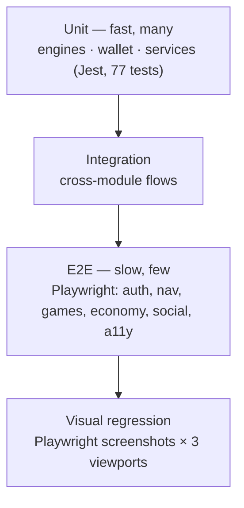

The pyramid is deliberately bottom-heavy: the most valuable, cheapest tests cover pure game/wallet logic where a bug is most costly. E2E is intentionally a thin, high-signal layer — it proves the app *mounts and the critical journeys work*, not every branch. Visual regression is the top guard for the presentation layer that unit tests can't see.

### 20.2 E2E design decisions

| Decision | Rationale |
| --- | --- |
| Skip the cinematic intro via `sessionStorage` init script | Deterministic, fast tests without the 3.4s overlay |
| Demo-mode server (`NEXT_PUBLIC_DEMO_MODE=true`) | Client flows (login, wallet, games) run without a backend |
| Serial workers against `next dev` | Avoids overwhelming the on-demand route compiler (parallel navigations caused `ERR_ABORTED`) |
| Role/text locators, generous timeouts | Resilient to animation timing; no brittle CSS selectors |
| HUD/live-number masking in visual tests | Tolerates non-deterministic floats and animated elements |

### 20.3 Coverage posture (honest)

Backend unit coverage is **targeted, not broad** — concentrated on financial and game-fairness critical paths rather than maximising a percentage. Breadth is additionally enforced by a clean typecheck, lint (0 warnings), and a full production build across the workspace. Expanding automated coverage (integration/e2e across every module and the frontend route matrix) is the highest-value ongoing investment and is tracked as a post-GA priority.

---

## 21. Folder Structure

```text
Hire/ (monorepo root — pnpm@9.15.0 + Turborepo, Node ≥20)
├── apps/
│   ├── backend/            NestJS 10 application
│   │   └── src/
│   │       ├── modules/    24 feature modules (auth, wallet, runtime, engines, ai, operations…)
│   │       ├── common/     guards, decorators, interceptors, filters, dto, middleware
│   │       ├── config/     typed config + Zod validation
│   │       ├── logger/     winston config (redaction)
│   │       └── main.ts     bootstrap (helmet, cors, versioning, shutdown hooks)
│   └── frontend/           Next.js 15 / React 19 app
│       ├── src/
│       │   ├── app/        App Router: (auth) (casino) (dashboard) (game) admin + layout/template/error/global-error
│       │   ├── components/ feature-sliced UI (layout, shared, games, live, hero, backgrounds, experience, monitoring, profile, social, rewards, engine folders)
│       │   ├── stores/     zustand: auth · demo-wallet · player-profile · missions · game-stats · sports-slip · ui
│       │   ├── lib/        API clients + client game toolkit + cosmetics + monitoring + config
│       │   ├── providers/  theme · query · auth initializer
│       │   ├── hooks/      reusable hooks
│       │   └── styles/     global styles (imports UI package tokens)
│       ├── public/         manifest.webmanifest · icons · offline.html · sw.js · robots.txt
│       ├── tests/e2e/      Playwright specs + helpers + snapshots
│       └── playwright.config.ts
├── packages/
│   ├── ui/                 design system (tokens, Tailwind preset, primitives)
│   ├── types/              shared TypeScript types
│   ├── shared/             shared Zod schemas + utilities
│   ├── database/           Prisma schema (16 domain files, 126 models, 69 enums) + client
│   ├── game-sdk/           plugin contract + runtime helpers
│   ├── wallet-core/        wallet/ledger domain logic
│   ├── ai-core/            AI domain logic
│   ├── ops-core/           operations domain logic
│   ├── tournament-core/    tournament domain logic
│   ├── auth/               auth domain logic
│   └── config/             shared config
├── games/                  engine packages: crash-engine · dice-engine · roulette-engine · card-engine · sports-engine · lottery-engine
├── docker/                 Dockerfiles + compose + prod override
├── docs/                   architecture, RC reports, release notes, this document
├── tools/                  perf / load / profiling harnesses
└── .github/workflows/      ci · release · rollback · codeql
```

**Why this layout:** `apps/*` are deployables; `packages/*` are shared libraries; `games/*` are engine plugins. Turborepo caches builds across the graph, and `turbo prune --docker` extracts a minimal per-app subgraph for images.

---

## 22. Extension Guide

The platform is designed for **additive extension** — new capabilities arrive as new modules/packages without modifying existing architecture.

### 22.1 Add a game

1. Create `games/<name>-engine` — pure, seedable rules + config schema.
2. Wrap it as a plugin via `@gaming-platform/game-sdk`.
3. Register it in the game registry (metadata, RTP, availability, launcher key).
4. Add a NestJS module + Socket.IO gateway if real-time is required.
5. Integrate with the wallet via reserve/settle (never touch the ledger directly).
6. Build the frontend presentation using existing primitives and the client toolkit.

### 22.2 Add a backend module

Create `apps/backend/src/modules/<name>/` with a `*.module.ts`, controller(s), service(s), DTOs, and Prisma access. Register in `app.module.ts`. Reuse global guards/interceptors/filters — do not re-implement cross-cutting concerns.

### 22.3 Add a frontend page

Add a route under the appropriate route group in `app/`. Reuse the shell (`SiteHeader`), design-system primitives (`@gaming-platform/ui`), and existing stores/hooks. If the route needs a themed background or ambience, register it in `route-background` and the sound `ambienceFor` map.

### 22.4 Add a feature / service / AI capability

- **Feature** — feature-slice its components under `components/<feature>/` and a store under `stores/` if it needs global state.
- **Service** — add a service to the owning module; expose via controller if it needs an endpoint.
- **AI capability** — add to the `ai` module and expose through the AI API; surface it in the frontend (e.g. Nova) via `ai-api`.

**Golden rule:** extensions depend on abstractions (SDK, module interfaces, design tokens) and never fork existing behaviour.

### 22.5 Worked example — adding a "Keno" game end-to-end

To make the extension model concrete, here is the full path for a hypothetical **Keno** title, touching only additive surfaces:

1. **Engine** — create `games/keno-engine`: a pure `(config, seed, picks) → { drawn, hits, multiplier }` function. Config declares the number pool, spots, and pay table. Unit-test it with fixed seeds (deterministic).
2. **Plugin** — wrap the engine with the Game SDK: declare identity, config schema, and lifecycle hooks (`onRoundStart`, `onResolve`). No platform code changes.
3. **Registry** — register Keno in the game registry (`game-registry` schema): name, provider, category, RTP, availability window, launcher key. It now appears in the catalogue and launcher automatically.
4. **Module (optional real-time)** — if Keno needs live shared draws, add `apps/backend/src/modules/keno/` with a Socket.IO gateway; otherwise the request/response runtime path suffices.
5. **Wallet** — the runtime brokers `reserve(stake)` before the draw and `settle(win)` after, using the existing Wallet Engine. Keno never touches the ledger.
6. **Frontend** — add a presentation component under `components/games/` (or a client prototype under `components/games/prototype/`), register it in `lib/prototype-games` if it should appear in the games hub, and reuse `settleRound()` to update wallet/XP/stats/missions. Add a themed background + ambience mapping if desired.
7. **Tests** — unit-test the engine; add a Playwright smoke that launches Keno and asserts a round resolves.

At no point is an existing engine, the wallet, the runtime contract, or another module modified. The new game is a set of **new files** that plug into stable seams — the defining property of a well-factored platform.

### 22.6 Extension checklist

| Adding… | Create | Reuse | Never modify |
| --- | --- | --- | --- |
| A game | engine pkg + plugin + registry entry | Game SDK, Wallet Engine, runtime | existing engines, ledger |
| A module | `modules/<name>/` | global guards/interceptors/filters, Prisma | the global pipeline |
| A page | route under a route group | `SiteHeader`, design tokens, stores | shared layouts' contracts |
| A store | `stores/<name>.ts` | zustand patterns | other stores' shape |
| An AI capability | logic in `ai` + `ai-api` client | analytics substrate | model boundaries |

---

## 23. Coding Standards

| Area | Standard |
| --- | --- |
| **Language** | Strict TypeScript everywhere; `noUncheckedIndexedAccess` respected |
| **Naming** | `PascalCase` types/components/classes; `camelCase` values; `kebab-case` files/folders |
| **Folder organisation** | Feature-sliced (frontend), domain-modular (backend), one concern per file |
| **React** | Server Components by default; `'use client'` only at interactive leaves; clean up all timers/listeners/rAF on unmount |
| **NestJS** | One module per domain; cross-cutting concerns via guards/interceptors/filters; DI over singletons |
| **Contracts** | Shared types (`@gaming-platform/types`) + Zod schemas (`@gaming-platform/shared`); DTOs validated |
| **State** | React Query for server cache; Zustand for local/global client state; no prop-drilling of global state |
| **Testing** | Unit-test pure logic (engines/wallet); E2E the user flows; keep tests deterministic (seeded) |
| **Documentation** | Public modules/components documented; this master doc is the source of truth |
| **Git** | Conventional commits; commit/push only on request; branch off default; PRs use the template |
| **Quality gates** | typecheck + lint (0 warnings) + tests + build must pass before merge |

### 23.1 Git & review workflow

| Practice | Rule |
| --- | --- |
| **Branching** | Feature branches off the default branch; never commit directly to `main` |
| **Commits** | Conventional-commit style; small, coherent, reversible; commit/push only when explicitly intended |
| **Pull requests** | Use the PR template; must be green on all CI gates before merge; include a short "why" |
| **Reviews** | At least one reviewer for non-trivial changes; security-sensitive areas (auth, wallet) require extra scrutiny |
| **Hooks** | Husky pre-commit (lint-staged: eslint --fix + prettier) and commit-msg (commitlint) keep the tree clean before CI |
| **No hook bypass** | `--no-verify` / signing bypass only with explicit approval |

### 23.2 Definition of done

A change is "done" when: it compiles (typecheck), passes lint with **zero warnings**, has tests for new logic (especially money/fairness), builds in production mode, updates relevant docs (this document for architectural changes; an ADR for decisions), and introduces no new empty states, layout shifts, memory leaks, or accessibility regressions.

---

## 24. Future Architecture

| Horizon | Direction | Architectural impact |
| --- | --- | --- |
| **V3** | Persistence of client identity/cosmetics (localStorage → backend sync); AI-driven personalised home; Lighthouse/CI certification | Additive; harden existing seams |
| **V4** | Extract high-load modules (wallet, runtime) into services behind the existing boundaries | Boundaries already drawn; introduce message bus + sagas where cross-service transactions appear |
| **Cloud-native** | Kubernetes + Helm; probes map 1:1 to existing healthchecks; autoscaling | Manifests only; app already stateless |
| **Multiplayer** | Shared real-time tables; authoritative server state; Socket.IO Redis adapter default-on | Runtime + gateway extension |
| **Mobile** | React Native / Expo client reusing shared types + API clients | New app consuming the same API |
| **Microservices** | Selective decomposition driven by load, not speculation | Strangler-fig around modules |
| **AI expansion** | Real-time risk, dynamic difficulty, LLM copilots for support/ops | Grow the AI module + prompt manager |

**Guiding principle for the future:** *split when the load demands it.* The modular monolith with clean boundaries is the deliberate substrate that makes each of these evolutions incremental rather than a rewrite.

---

## 25. Appendix

### 25.1 Glossary

| Term | Definition |
| --- | --- |
| **Ledger** | Immutable double-entry record of all money movements |
| **Reservation** | Funds locked for an in-flight bet, pre-settlement |
| **Settlement** | Final commit of a bet outcome to the ledger |
| **Idempotency key** | Unique key ensuring an operation applies exactly once |
| **Provably fair** | Deterministic, seed-verifiable game outcomes |
| **Plugin** | A game implementing the Game SDK contract, hosted by the runtime |
| **Runtime session** | A live instance of a launched game |
| **Replay log** | Recorded round events enabling reconstruction/audit |
| **Modular monolith** | One deployable with strong internal module boundaries |
| **Demo mode** | Dev-only, client-side session/wallet for frictionless review |
| **RUM** | Real-User Monitoring (Web Vitals) |

### 25.2 Abbreviations

| Abbr | Meaning | Abbr | Meaning |
| --- | --- | --- | --- |
| RBAC | Role-Based Access Control | SSR | Server-Side Rendering |
| RSC | React Server Components | PWA | Progressive Web App |
| JWT | JSON Web Token | TOTP | Time-based One-Time Password |
| PITR | Point-In-Time Recovery | RTO/RPO | Recovery Time/Point Objective |
| SBOM | Software Bill of Materials | SAST | Static Application Security Testing |
| HPA | Horizontal Pod Autoscaler | OTLP | OpenTelemetry Protocol |
| RTP | Return To Player | LRU | Least Recently Used |

### 25.3 Technology stack

| Tier | Technology | Version |
| --- | --- | --- |
| Monorepo | pnpm + Turborepo | pnpm@9.15.0 |
| Runtime | Node.js | ≥ 20 |
| Frontend | Next.js / React | 15.x / 19.x |
| 3D / motion | Three.js / Framer Motion | 0.171 / 11.x |
| Client state | Zustand / React Query | 5.x / 5.x |
| Backend | NestJS | 10.x |
| ORM / DB | Prisma / PostgreSQL | 6.x / 16 |
| Cache / realtime | Redis (ioredis) / Socket.IO | 7 / 4.x |
| Testing | Jest / Playwright | — |
| Monitoring | web-vitals / Prometheus / OpenTelemetry | — |
| Container | Docker / NGINX | multi-stage / 1.27 |

### 25.4 Key dependencies (rationale)

| Dependency | Why chosen |
| --- | --- |
| **NestJS** | Opinionated DI/module system → clean boundaries and testability |
| **Prisma** | Type-safe queries, migrations, split schema for a 126-model domain |
| **Redis** | Locks, cache, sorted-set leaderboards, Socket.IO adapter in one engine |
| **Next.js App Router** | Hybrid RSC/CSR, streaming, code-splitting, PWA-friendly |
| **Three.js (raw)** | WebGL immersion without R3F's React-19 peer friction |
| **Zustand + React Query** | Right tool per state lifecycle (local vs server cache) |
| **Playwright** | Cross-browser E2E + built-in visual regression |

### 25.5 Useful links (internal docs)

| Document | Purpose |
| --- | --- |
| `docs/ARCHITECTURE.md` | Legacy/overview architecture notes |
| `docs/DEPLOYMENT.md` | Deployment procedures |
| `docs/DEVELOPMENT.md` | Local development setup |
| `docs/release-candidate-1.md` | RC1 — performance validation |
| `docs/release-candidate-2-security.md` | RC2 — security audit |
| `docs/release-candidate-3-deployment.md` | RC3 — deployment/DevOps |
| `docs/final-release-report.md` | GA readiness report |
| `docs/ai-platform.md`, `operations-platform.md`, `tournament-engine.md`, `wallet-engine.md`, `game_inventory.md` | Subsystem deep-dives |

### 25.6 Architecture Decision Records (ADR summary)

| ADR | Decision | Status | Rationale (why) |
| --- | --- | --- | --- |
| ADR-001 | Modular monolith over microservices | Accepted | Velocity + simple transactions now; boundaries enable later split |
| ADR-002 | Double-entry ledger as system of record | Accepted | Financial correctness, reconciliation, auditability |
| ADR-003 | Plugin-based game runtime + SDK | Accepted | Additive game onboarding; trust boundary around money |
| ADR-004 | Stateless app tier; state in Redis/Postgres | Accepted | Horizontal scale + zero-downtime deploys |
| ADR-005 | Global fail-closed guard pipeline | Accepted | Zero-trust request handling |
| ADR-006 | Split Zustand + React Query state | Accepted | Correct tool per state lifecycle |
| ADR-007 | Raw Three.js instead of React-Three-Fiber | Accepted | React-19 compatibility + smaller footprint + lifecycle control |
| ADR-008 | Forced light theme, design-token system | Accepted | Consistent premium brand; single source for styling |
| ADR-009 | Demo mode client-only; production auth untouched | Accepted | Frictionless review without weakening prod security |
| ADR-010 | Opacity-only page transitions | Accepted | Cinematic feel without breaking `position: fixed` |

---

> **End of master document.** This architecture is authoritative. Propose changes via an ADR referencing the affected sections; upon acceptance, update this document and bump the Architecture Version in the cover table.
