# Testing Guide — Gaming Universe Platform

> The definitive QA and test-automation handbook for the Gaming Universe Platform. It documents every test suite, runner, helper, fixture, and CI stage that **actually exists** in the repository — the Vitest specs across the pure packages and game engines, the Jest suites across the backend, and the Playwright E2E + visual-regression suites across the frontend. It is a companion to the eleven architecture handbooks — [System](./SYSTEM_ARCHITECTURE.md), [Backend](./BACKEND_ARCHITECTURE.md), [Frontend](./FRONTEND_ARCHITECTURE.md), [Database](./DATABASE_ARCHITECTURE.md), [Game Runtime](./GAME_RUNTIME.md), [Game Engine SDK](./GAME_ENGINE_SDK.md), [Wallet Engine](./WALLET_ENGINE.md), [AI Platform](./AI_PLATFORM.md), [Operations Platform](./OPERATIONS_PLATFORM.md), [Deployment Guide](./DEPLOYMENT_GUIDE.md), and [Security Guide](./SECURITY_GUIDE.md). It is written so a QA engineer, SDET, or developer can understand, run, extend, and debug the platform's tests **without first reading the source**.

| Field | Value |
| --- | --- |
| **Project Name** | Gaming Universe Platform |
| **Test runners** | Vitest 2.1.9 (packages/engines) · Jest + ts-jest (backend) · Playwright 1.49 (frontend E2E + visual) |
| **Orchestration** | Turborepo (`test`, `test:e2e` tasks) |
| **Test files** | ~42 spec files · ~250 test cases |
| **Standouts** | 10,000-op wallet stress test · RC1 cross-module integration gate · exact-percentile load test |
| **Document Version** | 1.0 |
| **Prepared By** | Office of the CTO — Principal QA & Test Automation Group |
| **Status** | Authoritative — single source of truth for testing |
| **Last Updated** | V3.0 · Phase 3.3 · Documentation Sprint 12 |

### Revision History

| Version | Date / Milestone | Author | Notes |
| --- | --- | --- | --- |
| 0.1 | Test GA | QA Group | Vitest core specs, Jest backend specs |
| 0.5 | V2.0-A1 | QA Group | Playwright E2E + visual regression, RC integration gate, CI test stage |
| 1.0 | V3.0-P3.3 · Sprint 12 | Office of the CTO | Definitive testing handbook — this document |

---

## Table of Contents

1. [Executive Summary](#1-executive-summary)
2. [Testing Philosophy](#2-testing-philosophy)
3. [Testing Architecture](#3-testing-architecture)
4. [Test Pyramid](#4-test-pyramid)
5. [Repository Test Organization](#5-repository-test-organization)
6. [Unit Testing](#6-unit-testing)
7. [Integration Testing](#7-integration-testing)
8. [End-to-End Testing](#8-end-to-end-testing)
9. [Runtime & Game Engine Testing](#9-runtime--game-engine-testing)
10. [Wallet Integrity Testing](#10-wallet-integrity-testing)
11. [AI Platform Testing](#11-ai-platform-testing)
12. [Operations & Monitoring Testing](#12-operations--monitoring-testing)
13. [Performance & Load Testing](#13-performance--load-testing)
14. [Security Testing](#14-security-testing)
15. [Accessibility Testing](#15-accessibility-testing)
16. [Visual Regression Testing](#16-visual-regression-testing)
17. [Browser Compatibility](#17-browser-compatibility)
18. [Manual QA Procedures](#18-manual-qa-procedures)
19. [CI Testing Pipeline](#19-ci-testing-pipeline)
20. [Test Data Strategy](#20-test-data-strategy)
21. [Writing New Tests](#21-writing-new-tests)
22. [Coverage Strategy](#22-coverage-strategy)
23. [Debugging Failed Tests](#23-debugging-failed-tests)
24. [Testing ADRs](#24-testing-adrs)
25. [Future Testing Roadmap](#25-future-testing-roadmap)
26. [Appendix](#26-appendix)
27. [Testing Reference](#27-testing-reference)

---

## 1. Executive Summary

### 1.1 What is tested

The platform's tests span three runners, matched to what they test:

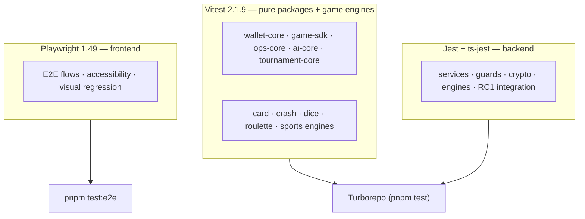

| Layer | Runner | Location | ~Cases |
| --- | --- | --- | --- |
| Pure package logic | Vitest | `packages/*/src/*.spec.ts` | ~71 |
| Game engine logic | Vitest | `games/*/src/*.spec.ts` | ~80 |
| Backend units + integration | Jest | `apps/backend/src/**/*.spec.ts` | ~80 |
| Frontend E2E + visual | Playwright | `apps/frontend/tests/e2e/*.spec.ts` | ~22 |

### 1.2 The testing strategy in one picture

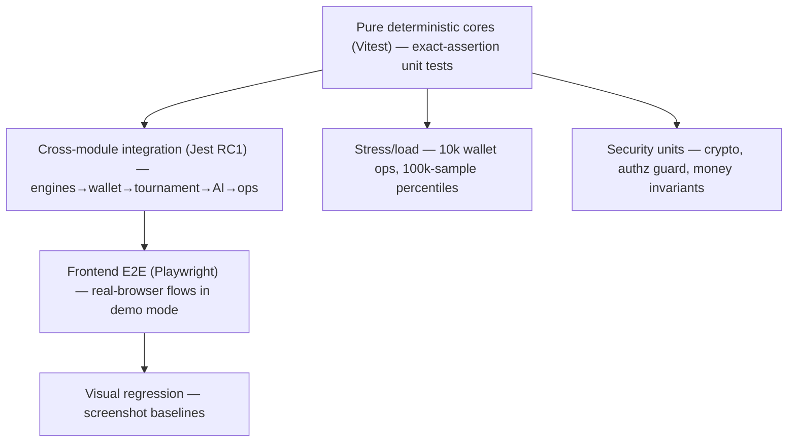

The strategy exploits the platform's architecture: because the hard logic lives in **pure, deterministic cores** ([Wallet §1.3](./WALLET_ENGINE.md#13-why-a-pure-core-plus-a-persistent-mirror), [SDK §1](./GAME_ENGINE_SDK.md#1-executive-summary), [AI §2](./AI_PLATFORM.md#2-ai-platform-philosophy), [Operations §2.1](./OPERATIONS_PLATFORM.md#21-deterministic-testable-primitives)), the base of the pyramid is broad, cheap, and asserts *exact* values. The RC1 integration test composes the real cores together as the platform wires them. Playwright covers the user-facing flows in the real browser.

### 1.3 The defining property: testable by construction

The single most important testing fact: **the platform is designed to be testable.** Determinism is pervasive — money algebra, game outcomes, RNG, alert evaluation, and fraud scoring are all pure functions of their inputs, so tests assert *exact* outcomes (not statistical tolerances). Time is injected into the resilience primitives, so recovery scenarios are testable without waiting. And the immersive frontend is built to be neutralized for tests (reduced-motion + intro-skip flags). This isn't luck — it's an architectural choice repeated across every subsystem. See [§2](#2-testing-philosophy).

### 1.4 The standout suites

| Suite | What makes it notable |
| --- | --- |
| **wallet-core** 10,000-op stress test | 10k concurrent wallet operations → proves `isConserved`, `globalNet=0`, `ledgerBalanced`, no negatives |
| **rc1-e2e** integration gate | Composes all engine cores → wallet → tournament → AI → ops in one deterministic test |
| **ops-core** percentile load test | Exact percentiles over 100,000 samples |
| **game-sdk rng** determinism | Same seed → identical sequence (the fairness/replay foundation) |

### 1.5 Scope

This document covers the **implemented** tests. It references each subsystem's own testing section — Wallet ([§24](./WALLET_ENGINE.md#24-testing-strategy)), Runtime ([§19](./GAME_RUNTIME.md#19-testing)), SDK ([§24](./GAME_ENGINE_SDK.md#24-testing-strategy)), AI ([§22](./AI_PLATFORM.md#22-testing-strategy)), Operations ([§22](./OPERATIONS_PLATFORM.md#22-testing-strategy)), Frontend ([§20](./FRONTEND_ARCHITECTURE.md#20-testing)), Backend ([§21](./BACKEND_ARCHITECTURE.md#21-testing-strategy)), Security ([§21](./SECURITY_GUIDE.md#21-security-testing)) — and unifies them. It documents only tests that exist; nothing is invented.

---

## 2. Testing Philosophy

Six convictions shape the test strategy.

### 2.1 Determinism enables exact assertions

Because the platform's cores are deterministic, tests assert **exact** values, not probabilistic ranges. `Money.add('0.1', '0.2')` is asserted to be **exactly** `'0.3'`; a seeded RNG's sequence is asserted identical across instances; an alert fires at **exactly** the sustain window. This is far stronger than "roughly right" — a deterministic test that passes proves the logic is *correct*, and a failure points to the exact regression. See [ADR-001](#24-testing-adrs).

### 2.1.1 Testability by construction, in prose

The single most important thing to understand about the platform's tests is that they are *possible* because the architecture was built to make them possible. This isn't a happy accident — it's a deliberate, repeated choice across every subsystem, and it's what gives the test suite its unusual strength.

Consider what "testable by construction" means concretely, subsystem by subsystem:

- **The wallet** is a pure algebra (`wallet-core`) separate from its Prisma persistence. So the money logic is tested with a reference aggregate in memory — no database — and its invariants (`isConserved`, `ledgerBalanced`) are *checkable functions* you can call after any operation. The 10,000-op stress test is only possible because the algebra is pure and in-memory.
- **The game engines** are deterministic — `(config, seed, bet) → outcome`. So a test asserts the *exact* outcome for a seed, because the outcome is a constant. Fairness is testable because determinism is guaranteed.
- **The resilience primitives** inject time. So a test simulates a 10-second breaker cooldown by advancing an integer, not by waiting — recovery scenarios test in microseconds.
- **The AI** is rule-based and model-free. So a fraud score is an exact function of features, asserted exactly — no model to mock, no statistical tolerance.
- **The frontend's immersion** is neutralizable — a `reduce-motion` class and an `intro-seen` flag turn off the animations and the cinematic intro. So E2E and visual tests run against a calm, deterministic variant.

In each case, a design decision made for *other* reasons (money correctness, provable fairness, resilience, explainability, accessibility) *also* made the code testable. The determinism that serves fairness serves testing; the injected time that serves resilience serves recovery tests; the reduce-motion that serves accessibility serves visual regression. **Testability is a side effect of good design here, not a separate effort.** When you write new code, the discipline is to preserve these properties — keep logic pure, inject time, stay deterministic — and the testability comes for free. See [§21.6](#216-the-golden-rules).

### 2.2 Test the pure core in isolation

The hard logic (money, fairness, scoring, resilience) lives in pure packages with no I/O, so it's unit-tested with hand-crafted inputs and no database, network, or browser. The `wallet-core` reference engine is *"the basis for its property tests"* — its invariants (`isConserved`, `ledgerBalanced`) are checkable after any operation sequence. See [§6](#6-unit-testing).

### 2.3 Invariant-based testing for correctness-critical code

Money and fairness aren't tested only with example cases — they're tested against **invariants** that must hold regardless of input: the books always conserve (`Σ = 0`), balances never go negative, journals always balance. The 10,000-op stress test asserts these invariants after a random operation schedule. An invariant that holds across 10,000 random operations is strong evidence of correctness. See [§10](#10-wallet-integrity-testing).

### 2.4 Integration proves modules compose

Beyond unit tests, the RC1 integration test composes the **real** engine cores exactly as the platform wires them (game round → wallet → tournament → AI → ops), proving the modules integrate correctly and the books stay conserved through a full player journey. See [§7](#7-integration-testing).

### 2.5 E2E in the real browser, demo mode

Frontend E2E runs in a real Chromium browser against a **demo-mode** dev server, so the client-only demo login and wallet work without the backend — the full navigable surface is exercised in CI with just `next dev`. Immersive systems are designed to be neutralized (reduced-motion + intro-skip) so tests are deterministic. See [§8](#8-end-to-end-testing).

### 2.6 Testability is an architectural property

The tests are possible because the architecture makes them possible: pure cores, injected time, deterministic RNG, and neutralizable immersion. When you write new code, preserving these properties is what keeps the code testable. See [§21](#21-writing-new-tests).

---

## 3. Testing Architecture

### 3.1 The three-runner architecture

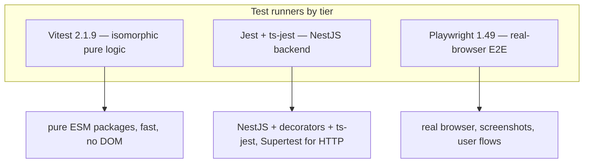

| Runner | Version | Why chosen |
| --- | --- | --- |
| **Vitest** | 2.1.9 | Fast, ESM-native, ideal for the isomorphic pure packages + engines; `vitest run --passWithNoTests` |
| **Jest** | (ts-jest) | The NestJS-idiomatic runner; `ts-jest` transforms TS; Supertest available for HTTP e2e |
| **Playwright** | 1.49 | Real-browser E2E + first-class screenshot/visual-regression + tracing |

### 3.2 The Turborepo orchestration

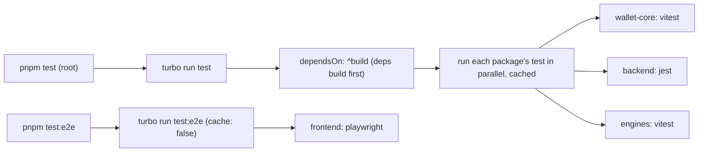

Turbo orchestrates tests across the monorepo. The `test` task `dependsOn: ["^build"]` (dependencies build first, so a package tests against built deps) and outputs `coverage/**` (cached). The `test:e2e` task is `cache: false` (E2E is never cached — it must run against the live app). Each package/app declares its own `test` script that invokes its runner. See [§19](#19-ci-testing-pipeline).

### 3.3 The runner configs

| Config | Purpose |
| --- | --- |
| `apps/backend/jest.config.js` | ts-jest, `testRegex: .spec.ts$`, `rootDir: src`, `testEnvironment: node`, coverage from `**/*.(t\|j)s` |
| `apps/backend/test/jest-e2e.json` | `.e2e-spec.ts$`, node env (Supertest HTTP e2e) |
| `apps/frontend/playwright.config.ts` | Chromium, `workers: 1`, `fullyParallel: false`, demo-mode dev server `:3130` |
| package `test` scripts | `vitest run --passWithNoTests` |

**Why `--passWithNoTests`:** a package with no tests (e.g. a types-only package) doesn't fail the pipeline — the test command succeeds with zero tests. This lets `turbo run test` span every package uniformly, running tests where they exist and passing where they don't. See [ADR-003](#24-testing-adrs).

---

## 4. Test Pyramid

### 4.1 The pyramid

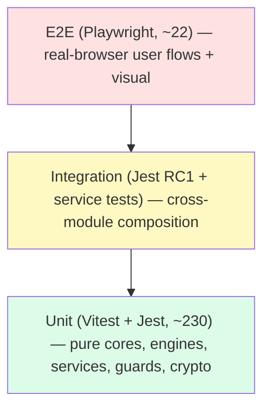

The pyramid is **broad at the base**: the vast majority of tests are fast, deterministic unit tests of the pure cores and engines. A focused integration layer (RC1 + backend service tests) proves composition. A small, high-value E2E layer covers the user-facing flows. This is the textbook shape — cheap tests catch most bugs, expensive tests cover what only end-to-end can.

### 4.2 The distribution

| Layer | Count | Runner | Speed | Determinism |
| --- | --- | --- | --- | --- |
| Unit (pure cores + engines) | ~151 | Vitest | ms | exact |
| Unit (backend services/guards/crypto) | ~76 | Jest | ms–s | exact |
| Integration (RC1 cross-module) | 4 | Jest | ms | exact (no DB/network) |
| E2E (flows + accessibility) | ~21 | Playwright | s | resilient (demo mode) |
| Visual regression | 1 spec (multi-viewport) | Playwright | s | tolerance-based |

### 4.3 Why this shape

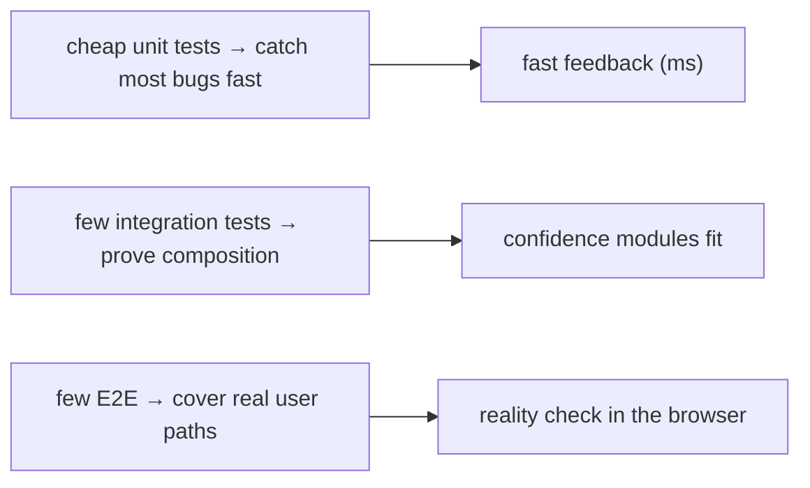

The pyramid is inverted-cost: unit tests are cheap and run in milliseconds, so there are many; E2E tests are expensive (spin up a browser + dev server) and slower, so there are few but high-value. The platform's determinism pushes even more coverage into the cheap base — an exact-assertion unit test of the wallet algebra provides more certainty than an E2E test could, at a fraction of the cost. This is why money and fairness are unit-tested exhaustively and E2E focuses on user journeys. See [ADR-002](#24-testing-adrs).

---

## 5. Repository Test Organization

### 5.1 Where tests live

Tests are **co-located** with the code they test (except Playwright E2E, which lives in a dedicated `tests/` directory):

```
packages/
  wallet-core/src/wallet-core.spec.ts      # Vitest — money/balance/ledger/engine
  game-sdk/src/rng.spec.ts                 # Vitest — RNG determinism
  game-sdk/src/runtime.spec.ts             # Vitest — runtime lifecycle
  ops-core/src/ops-core.spec.ts            # Vitest — metrics/alerts/resilience
  ai-core/src/ai-core.spec.ts              # Vitest — embeddings/recommend/fraud/risk/segment/search
  tournament-core/src/tournament-core.spec.ts # Vitest — tournament engine
games/
  {card,crash,dice,roulette,sports}-engine/src/engine.spec.ts  # Vitest — engine logic
  {crash,dice}-engine/src/index.spec.ts    # Vitest — registration/exports
apps/backend/src/
  integration/rc1-e2e.spec.ts              # Jest — cross-module integration gate
  common/security/crypto.util.spec.ts      # Jest — crypto primitives
  logger/winston.config.spec.ts            # Jest — log redaction
  modules/**/services/*.spec.ts            # Jest — service unit tests
  modules/authorization/guards/permissions.guard.spec.ts  # Jest — authz
apps/frontend/tests/e2e/
  *.spec.ts                                # Playwright — E2E + visual
  helpers.ts                               # shared E2E helpers
  visual.spec.ts-snapshots/*.png           # visual baselines
```

### 5.2 Packages with tests

| Package | Runner | Spec | Focus |
| --- | --- | --- | --- |
| `wallet-core` | Vitest | `wallet-core.spec.ts` | money, balance, ledger, lifecycle, engine, 10k stress |
| `game-sdk` | Vitest | `rng.spec.ts`, `runtime.spec.ts` | deterministic RNG, runtime lifecycle |
| `ops-core` | Vitest | `ops-core.spec.ts` | metrics, alerts, resilience, health |
| `ai-core` | Vitest | `ai-core.spec.ts` | embeddings, recommend, fraud, risk, segment, search |
| `tournament-core` | Vitest | `tournament-core.spec.ts` | tournament engine |

### 5.3 Engines with tests

| Engine | Spec files | Cases |
| --- | --- | --- |
| `card-engine` | `engine.spec.ts` | 13 |
| `crash-engine` | `engine.spec.ts`, `index.spec.ts` | 17 + 2 |
| `dice-engine` | `engine.spec.ts`, `index.spec.ts` | 15 + 2 |
| `roulette-engine` | `engine.spec.ts` | 17 |
| `sports-engine` | `engine.spec.ts` | 14 |

*(The `lottery-engine` currently has no dedicated spec; it is exercised through the runtime plugin registry and is a documented coverage gap, [§22.4](#224-coverage-gaps).)*

### 5.4 Backend test inventory

| Spec | Focus | Cases |
| --- | --- | --- |
| `integration/rc1-e2e.spec.ts` | cross-module integration | 4 |
| `common/security/crypto.util.spec.ts` | token gen, hashing, constant-time | 6 |
| `logger/winston.config.spec.ts` | secret redaction | 2 |
| `modules/ai/services/ai.spec.ts` | AI service wiring | 4 |
| `modules/auth/services/password.service.spec.ts` | password strength/hashing | 8 |
| `modules/auth/services/token.service.spec.ts` | JWT signing/verify | 3 |
| `modules/authorization/guards/permissions.guard.spec.ts` | authorization | 6 |
| `modules/{card,crash,dice,roulette,sports}/services/*-engine.service.spec.ts` | per-game service | 3–4 each |
| `modules/games/repository/game.repository.spec.ts` | catalog queries | 6 |
| `modules/games/services/slug.util.spec.ts` | slug generation | 6 |
| `modules/operations/services/operations.spec.ts` | ops services | 3 |
| `modules/runtime/services/provably-fair.service.spec.ts` | fairness | 4 |
| `modules/runtime/services/runtime-plugin-registry.service.spec.ts` | plugin validation | 4 |
| `modules/tournament/services/tournament.spec.ts` | tournament service | 2 |
| `modules/wallet-engine/services/wallet-settlement.spec.ts` | settlement semantics | 3 |

### 5.5 Frontend E2E inventory

| Spec | Focus | Cases |
| --- | --- | --- |
| `navigation.spec.ts` | smoke-navigate 23 routes | 1 (loop) |
| `auth.spec.ts` | login flows (demo + email) | 3 |
| `wallet-missions.spec.ts` | store purchase, daily spin, missions | 3 |
| `accessibility.spec.ts` | a11y toggles (contrast, motion, font) | 3 |
| `games.spec.ts` | crash launch, blackjack deal | 2 |
| `social.spec.ts` | friends, leaderboards, community, clans | 4 |
| `world-daily.spec.ts` | world map, daily spin/claim | 2 |
| `store-avatar-profile.spec.ts` | store, avatar studio, player card | 3 |
| `visual.spec.ts` | visual regression (3 routes × 3 viewports) | 1 (matrix) |

---

## 6. Unit Testing

Unit tests are the broad base of the pyramid — fast, deterministic, exact.

### 6.1 The pure-core unit tests (Vitest)

The pure packages are unit-tested with hand-crafted inputs and exact assertions. Vitest's `describe`/`it`/`expect` structure the specs. Examples of the exactness:

| Assertion | From |
| --- | --- |
| `Money.add('0.1', '0.2') === '0.3'` (no float drift) | `wallet-core.spec` |
| `new SeededRng('seed-123')` sequence identical to a second instance | `rng.spec` |
| `embed('card game')` magnitude ≈ 1 (unit vector) | `ai-core.spec` |
| Alert fires at exactly 61s (past the 60s window) | `ops-core.spec` |
| `Lifecycle.transition('SETTLED', 'RESERVED')` throws | `wallet-core.spec` |

### 6.2 The backend unit tests (Jest)

Backend services, guards, and utilities are unit-tested with Jest + ts-jest:

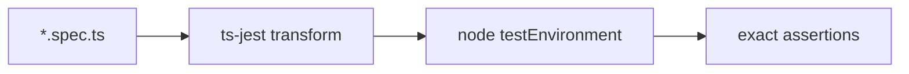

| Test | What it asserts |
| --- | --- |
| `crypto.util.spec` | token generation (length/format), SHA-256 hashing, constant-time `safeEqual` |
| `permissions.guard.spec` | `all`/`any` permission modes, **super-admin bypass**, unauthenticated denial |
| `password.service.spec` | hashing, strength rejection (8 cases) |
| `token.service.spec` | JWT sign/verify with pinned iss/aud |
| `winston.config.spec` | secret redaction (the denylist replaces values with `[REDACTED]`) |
| `slug.util.spec` | slug generation edge cases |
| `game.repository.spec` | catalog query construction |

### 6.3 The authorization unit test (worked example)

`permissions.guard.spec.ts` is the security-critical authorization test ([Security §21.2](./SECURITY_GUIDE.md#212-testing-the-security-controls)). It asserts the guard's full contract:

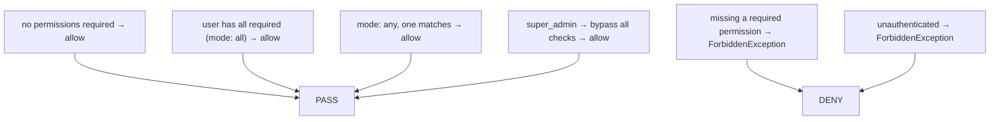

Six cases pin the authorization behavior: the allow paths (`all`/`any` modes satisfied, super-admin bypass), and the deny paths (missing permission, unauthenticated). Because these are exact, a regression that broke the super-admin bypass or the deny path would fail immediately. This is how a security control becomes an executable, regression-proof contract. See [§14](#14-security-testing).

### 6.4 Unit-test characteristics

| Property | Value |
| --- | --- |
| Speed | milliseconds per test |
| Dependencies | none (pure) or mocked (services) |
| Determinism | exact |
| Isolation | each test independent |
| Assertion style | exact equality / exact throw |

---

## 7. Integration Testing

Integration tests prove that modules **compose** correctly — the level between unit and E2E.

### 7.1 The RC1 cross-module integration gate

`rc1-e2e.spec.ts` is the platform's integration gate. It imports the **real** engine cores and composes them exactly as the running platform wires them:

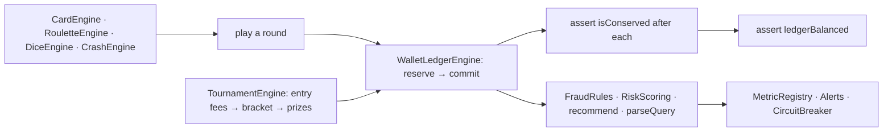

Its docstring is precise: *"Exercises the real engine cores composed together exactly as the running platform wires them (game round → wallet settlement → tournament → prizes → leaderboard → AI → ops), proving the modules integrate correctly and the books stay conserved through a full player journey. Pure and deterministic — no DB or network — so it runs in CI as the integration gate."*

### 7.2 The four RC1 tests

| Test | Composes | Asserts |
| --- | --- | --- |
| Settles every game engine through the wallet | Card + Roulette + Dice + Crash → wallet reserve/commit | `isConserved` after each round; `ledgerBalanced`; balance ≥ 0 |
| Paid tournament end-to-end | Wallet (entry fees) + TournamentEngine (bracket) + prizes | books conserved through fees → bracket → payouts |
| AI over the journey | FraudRules + RiskScoring + recommend + parseQuery | scores/recommendations from the journey data |
| Ops over the journey | MetricRegistry + Alerts + CircuitBreaker | metrics recorded, alerts evaluated |

### 7.3 Why integration is pure

The RC1 test is **pure and deterministic — no DB or network** — so it runs in CI in milliseconds as a gate. It doesn't mock the modules; it uses the *real* cores, composed as the platform composes them. This proves the modules genuinely fit together (their contracts align) without the cost and flakiness of a full stack. Because the cores are pure, the integration is testable without infrastructure — a direct benefit of the pure-core architecture. See [ADR-004](#24-testing-adrs).

### 7.3.1 A worked RC1 walkthrough

Follow the first RC1 test — settling every game engine through the wallet — step by step, because it's the clearest demonstration of the modules composing:

```mermaid
sequenceDiagram
    autonumber
    participant W as WalletLedgerEngine
    participant C as CardEngine (dragon-tiger)
    participant R as RouletteEngine (european)
    participant D as DiceEngine (sic-bo)
    participant X as CrashEngine (crash)
    W->>W: open('player', '10000')
    C->>C: playRound('c1', dragon bet 10) → settlement
    W->>W: reserve(totalBet) → commit(totalWin); assert isConserved()
    R->>R: spin('r1', red bet 10) → settlement
    W->>W: reserve → commit; assert isConserved()
    D->>D: roll('d1', big bet 10) → settlement
    W->>W: reserve → commit; assert isConserved()
    X->>X: playRound('x1', bet 10, autoCashout 2) → settlement
    W->>W: reserve → commit; assert isConserved()
    W->>W: assert ledgerBalanced(); balance >= 0
```

Each of the four *real* engine cores (card, roulette, dice, crash) plays a round with a fixed seed, producing a settlement (`totalBet`/`totalWin`). The wallet then runs the **canonical flow** — reserve the stake, commit with the winnings — exactly as the production `WalletBridgeService` does ([Wallet §21](./WALLET_ENGINE.md#21-runtime-integration)). After *each* round the test asserts `isConserved()`, and at the end `ledgerBalanced()` and balance ≥ 0. This proves something no unit test can: that the engines' settlement output (`totalBet`/`totalWin`) is *compatible* with the wallet's `reserve`/`commit` inputs — the module contracts align. If an engine changed its settlement shape, or the wallet changed its reserve/commit signature, this test would fail, catching an integration break that unit tests (each testing one module in isolation) would miss. The other three RC1 tests extend this to tournaments (entry fees → bracket → prizes, books conserved), AI (scoring the journey), and ops (metrics/alerts over the journey) — proving the *whole* module graph composes. And it's all pure and deterministic, so it runs as a fast CI gate. See [ADR-004](#24-testing-adrs).

### 7.4 The backend service integration tests

Beyond RC1, the backend service specs (per-game engine services, tournament, operations, AI) integrate a service with its dependencies (often the pure core it wraps + mocks for Prisma/Redis). These verify the *wiring* — that the service correctly extracts inputs, calls the core, and returns results. The `wallet-settlement.spec` is a good example: it locks the financial semantics the backend engine guarantees by exercising the `wallet-core` reference aggregate ([§10.2](#102-the-settlement-semantics-tests)).

---

## 8. End-to-End Testing

E2E tests run in a real Chromium browser via Playwright, against a demo-mode dev server.

### 8.1 The Playwright architecture

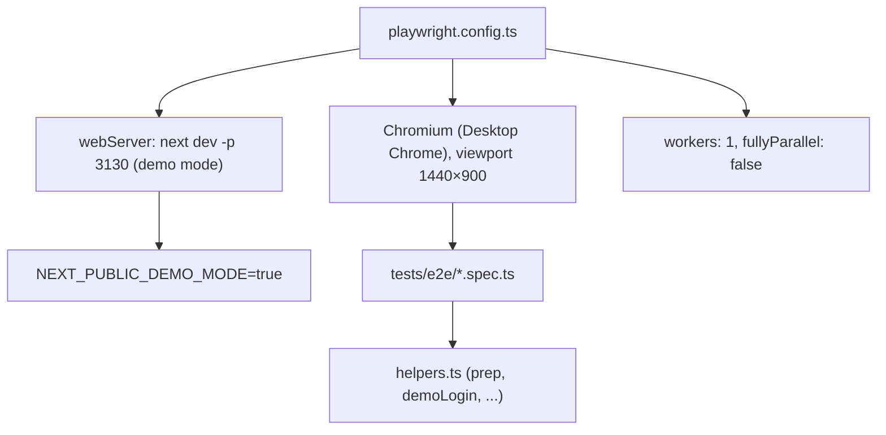

| Config | Value | Why |
| --- | --- | --- |
| Browser | Chromium (Desktop Chrome) | primary target |
| Viewport | 1440×900 | deterministic visual baselines |
| Workers | 1, `fullyParallel: false` | serial against `next dev` avoids overwhelming the on-demand compiler (parallel navigations caused `ERR_ABORTED`) |
| Dev server | `next dev -p 3130`, `NEXT_PUBLIC_DEMO_MODE=true` | client-only demo login + wallet work without the backend |
| Retries | 2 (CI), 1 (local) | absorb first-compile flakiness |
| Trace | on-first-retry | cheap by default, rich on failure |
| Screenshot | only-on-failure | debugging artifacts |

### 8.2 The E2E execution lifecycle

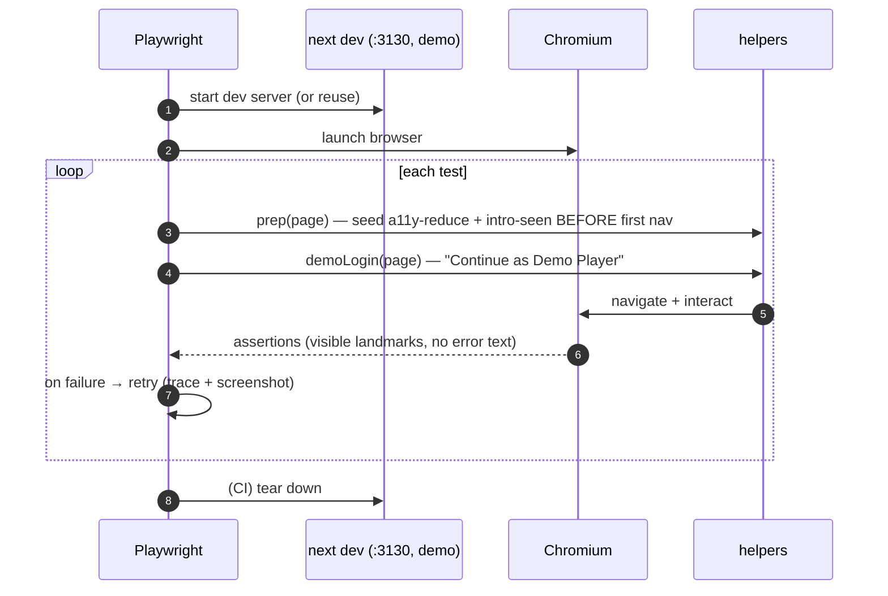

### 8.3 The E2E helpers

`helpers.ts` provides the shared utilities that make E2E deterministic:

| Helper | Purpose |
| --- | --- |
| `prep(page)` | Seeds `gp-intro-seen=1` (sessionStorage) + `a11y-reduce=1` (localStorage) **before** first navigation via `addInitScript` — skips the cinematic intro and calms motion |
| `demoLogin(page)` | Signs in via "Continue as Demo Player"; soft-waits for `/` + the authenticated header |
| `authIndicator(page)` | Locator for the authenticated header (reload-coins / deposit pill) |
| `accessibilityButton(page)` | The floating a11y toggle |
| `rootFontSize(page)` / `htmlHasClass(page, cls)` | Read a11y state |
| `ERROR_TEXTS` | Error strings that must never appear (`Something went wrong`, `404`, …) |
| `VISIBLE_TIMEOUT` | 15s generous timeout for the animation-heavy UI |

**Why `prep()` seeds flags before navigation:** `addInitScript` runs on every document *before* app code, so the intro-seen and reduce-motion flags are already set on first paint. This neutralizes the two biggest sources of E2E non-determinism — the one-time cinematic intro overlay and the motion-heavy UI — making tests deterministic. This is the payoff of designing immersive systems to be testable ([Frontend §20.4](./FRONTEND_ARCHITECTURE.md#204-visual-regression--flake-management)). See [ADR-005](#24-testing-adrs).

### 8.4 The E2E test suites

| Suite | Coverage |
| --- | --- |
| `navigation` | Smoke-navigate every major route (23), assert 200, a visible landmark, no error text |
| `auth` | Login page renders; demo login lands authenticated; email+password demo login |
| `wallet-missions` | Store purchase flips item to Owned/Equipped + toast; daily spin reacts; missions render claim/in-progress |
| `games` | Crash launch starts a round + multiplier reacts; blackjack deal reveals cards |
| `social` | Friends online/offline, leaderboards podium, community, clans chat |
| `world-daily` | World map district navigation; daily spin + claim |
| `store-avatar-profile` | Store category switch + preview + buy/equip; avatar randomize + SVG update; player card |
| `accessibility` | a11y toggles ([§15](#15-accessibility-testing)) |
| `visual` | Visual regression ([§16](#16-visual-regression-testing)) |

### 8.4.1 A worked E2E test walkthrough

Follow the `wallet-missions` store-purchase test to see how a resilient E2E flow is structured:

```mermaid
sequenceDiagram
    autonumber
    participant T as Test
    participant P as prep()
    participant L as demoLogin()
    participant B as Browser (/store)
    T->>P: seed a11y-reduce + intro-seen (before nav)
    T->>L: "Continue as Demo Player" → authenticated
    T->>B: goto /store; wait domcontentloaded
    T->>B: assert heading "Cosmetic Store" visible
    T->>B: find Buy buttons; assert count > 0
    T->>B: click first Buy
    T->>B: assert SOME reaction: "Purchased" toast OR Equip/Equipped OR "Owned"
```

The structure is the template for every E2E flow: `prep()` neutralizes the intro and motion *before* navigation; `demoLogin()` establishes an authenticated session (client-only, no backend); the test navigates and interacts using **role-based locators** (`getByRole('button', { name: /^Buy$/ })`); and it asserts a **resilient** outcome — *some* sign of success (a "Purchased" toast, an "Equip"/"Equipped" control, or an "Owned" badge), via a `.or()` chain, rather than an exact balance number. This resilience is deliberate: the demo data and the exact prices vary, so asserting "the balance is now exactly 4,850" would be brittle, while "the item flipped to owned and a toast appeared" is robust and still proves the purchase flow works. The `VISIBLE_TIMEOUT` (15s) accommodates the animation-heavy UI. This one test exercises the real store component, the demo wallet spend, the cosmetics state, and the toast system — an end-to-end proof that the economy flow works in the browser, without a single backend call. See [ADR-017](#24-testing-adrs).

### 8.5 Resilience over exactness in E2E

E2E assertions stay **resilient** — they check for *some* expected element or reaction, never exact numbers, because the demo data and animations vary. The `wallet-missions` spec asserts a purchase produces "some expected element/toast, never exact numbers." This makes E2E robust against demo-data changes while still proving the flow works. E2E answers "does the flow work in the browser?", not "is this exact value right?" — the latter is the unit tests' job.

---

## 9. Runtime & Game Engine Testing

The game engines and runtime SDK are tested for **determinism** and **correctness** — the foundation of provable fairness.

### 9.1 The engine test coverage

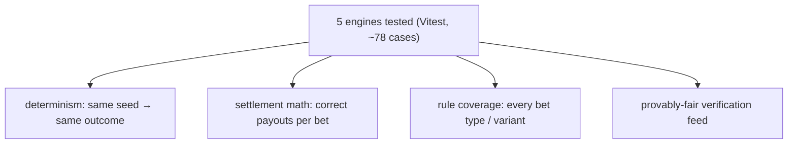

| Engine | Cases | Tests |
| --- | --- | --- |
| `crash-engine` | 17 + 2 | bust point from seed, cashout, multiplier curve, registration |
| `roulette-engine` | 17 | number/color/parity bets, European/American variants, payouts |
| `dice-engine` | 15 + 2 | Sic Bo / variants, bet board, triples, registration |
| `sports-engine` | 14 | markets, odds, settlement |
| `card-engine` | 13 | card variants (dragon-tiger, etc.), deals, settlement |

Each engine test asserts **exact outcomes for a given seed** — because the engines are deterministic ([SDK §21](./GAME_ENGINE_SDK.md#21-deterministic-rng)), the expected value is a constant, not a distribution.

### 9.2 The runtime testing flow

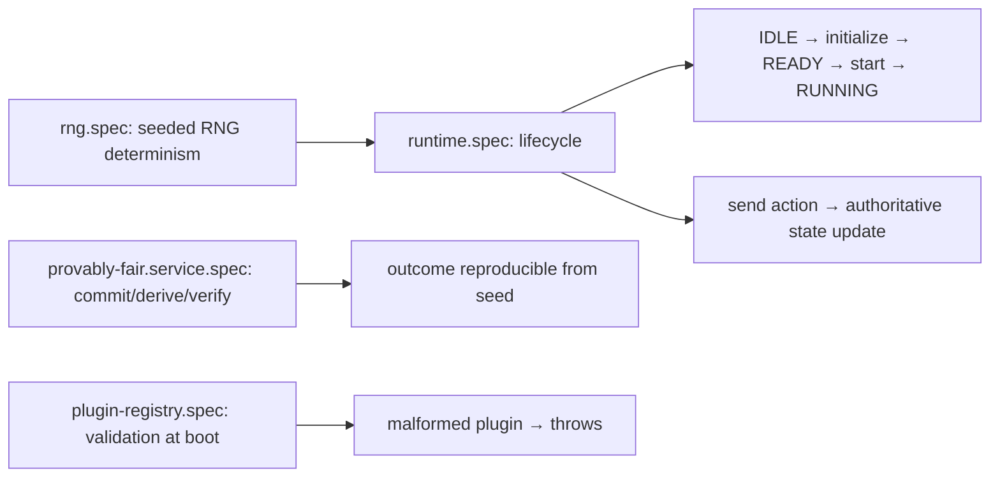

### 9.3 The SDK RNG determinism tests

`rng.spec.ts` proves the property that everything else depends on — **determinism**:

| Test | Assertion |
| --- | --- |
| deterministic for identical seeds | two `SeededRng('seed-123')` produce identical 10-element sequences |
| differs across seeds | `'a'` and `'b'` seeds produce different sequences |
| floats in [0, 1) | 1000 samples all in range |
| int inclusive range | 1000 `int(1,6)` all in [1,6] |
| shuffle is a permutation | output is a reordering of the input |
| weighted honors weights | weight 9:1 → the heavy option wins more |

**Why this test matters most:** the entire provable-fairness and replay system rests on the RNG being deterministic. If `rng.spec` passes, the same seed always produces the same sequence — which means the same game outcome, reproducibly. A failure here would break fairness verification and replay. See [§9.4](#94-the-provably-fair-tests).

### 9.3.1 A worked engine determinism example

The `ai-core.spec` and `rng.spec` both hinge on the same principle, best seen in the RNG's determinism test. Two independently-constructed `SeededRng('seed-123')` instances generate their first 10 values, and the test asserts the sequences are **identical**:

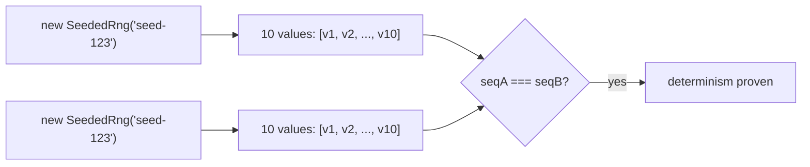

This tiny test underpins the entire fairness and replay system. If two RNG instances with the same seed produced *different* sequences, then a game outcome couldn't be reproduced from its seed — provable fairness ([§9.4](#94-the-provably-fair-tests)) and replay ([Runtime §13](./GAME_RUNTIME.md#13-replay-apis)) would both be broken. By asserting the sequences are exactly equal, the test locks in the property that everything else depends on: **same seed → same outcome, always.** The complementary test (different seeds → different sequences) proves the RNG actually *uses* the seed (a broken RNG that ignored the seed would produce identical sequences for `'a'` and `'b'`, and this test would catch it). Together they pin the RNG's contract: deterministic in the seed, sensitive to the seed. Every game engine's outcome tests build on this — because the RNG is deterministic, a dice roll from seed `s` is a constant, so the dice test can assert the exact faces. The determinism test is small but load-bearing; it's the foundation of the whole fairness stack. See [§9.3](#93-the-sdk-rng-determinism-tests).

### 9.4 The provably-fair tests

`provably-fair.service.spec.ts` (4 cases) verifies the commit-reveal fairness: the server commits to a seed hash, derives the round seed by HMAC, and a verification re-derives and matches. This proves the fairness mechanism itself is correct — a player *could* verify an outcome, because the derivation is deterministic and checkable ([Security §10.2](./SECURITY_GUIDE.md#102-provable-fairness)).

### 9.5 The runtime lifecycle tests

`runtime.spec.ts` (5 cases) drives a test `CounterPlugin` through the full lifecycle: it asserts the runtime transitions IDLE → READY (after `initialize`) → RUNNING (after `start`), and that a `send('increment')` action updates the **authoritative** state (with a config override). This proves the SDK's lifecycle state machine and the server-authoritative action model ([Runtime §5](./GAME_RUNTIME.md#5-runtime-lifecycle), [SDK §6.6](./GAME_ENGINE_SDK.md#66-annotated-walkthrough-of-a-roll)).

### 9.6 The plugin validation test

`runtime-plugin-registry.service.spec.ts` (4 cases) verifies that a malformed plugin (bad key, non-function factory, invalid player range) is **rejected at registration** ([SDK §22.2](./GAME_ENGINE_SDK.md#222-boot-time-validation)) — the fail-fast boot validation that prevents shipping a broken game.

---

## 10. Wallet Integrity Testing

The wallet is tested to the highest standard: **invariants** proven across example cases, semantics, and a 10,000-operation stress test.

### 10.1 The wallet verification flow

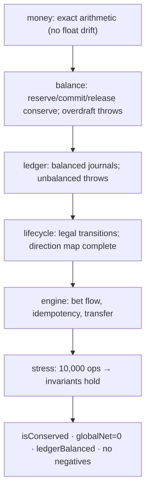

### 10.2 The settlement semantics tests

`wallet-settlement.spec.ts` (backend, 3 cases) locks the financial semantics against the `wallet-core` reference aggregate (*"the same algebra the Prisma-backed engine mirrors"*):

| Test | Asserts |
| --- | --- |
| reserve → settle a win | `net === '15'`, balance `115`, `isConserved`, `ledgerBalanced` |
| refund a released round | reserve locks, release restores, `isConserved` |
| never permits an overdraft | reserve beyond balance throws; total ≥ 0 |

### 10.3 The wallet-core unit tests

`wallet-core.spec.ts` (16 cases) is the money algebra's exhaustive test — exact arithmetic (`Money.add('0.1','0.2') === '0.3'`), balance conservation (reserve conserves total; commit consumes the stake), overdraft rejection, optimistic version increment, balanced journals, lifecycle transitions, the direction map (every transaction type has a direction), and the engine bet flow (win, loss, idempotent replay, blocked double-commit, atomic transfer).

### 10.4 The 10,000-operation stress test

The crown jewel of the wallet tests: a stress test that runs **10,000 operations** across 50 wallets with a deterministic pseudo-random schedule (no `Math.random` — reproducible), then asserts the invariants held:

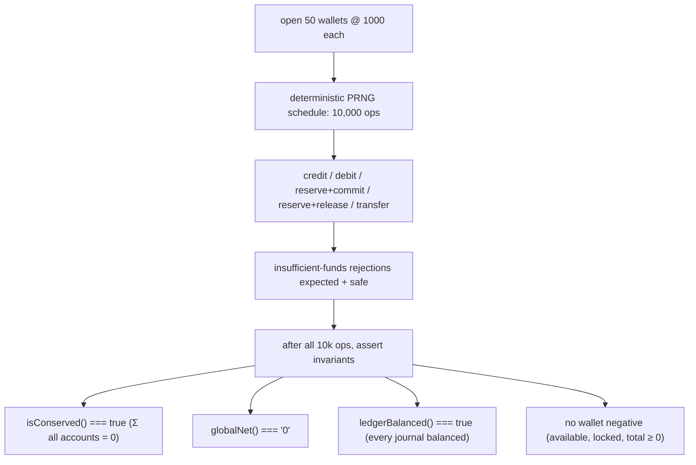

The test proves the wallet is **corruption-free under load**: after 10,000 mixed operations (including expected insufficient-funds rejections that must *not* corrupt state), the books still conserve (`Σ = 0`), every journal is still balanced, and no balance went negative. This is invariant-based testing at its strongest — the invariants hold across a large, varied operation schedule, which is powerful evidence of correctness that no set of example cases could match. The deterministic PRNG makes the stress test **reproducible** — a failure can be re-run identically to debug. See [ADR-006](#24-testing-adrs) and [Wallet §24.2](./WALLET_ENGINE.md#242-property-testing-the-algebra).

### 10.4.1 A worked stress-test analysis

To appreciate why the 10,000-op stress test is such strong evidence, consider what it actually exercises. It opens 50 wallets at 1000 each (50,000 total in the system), then runs 10,000 operations drawn from five kinds — credit, debit, reserve+commit, reserve+release, transfer — against random wallets with random amounts, on a deterministic schedule. Many of those operations will *fail* (an insufficient-funds debit, an over-reserve), and the test **expects** those failures — they're caught and ignored *"Insufficient-funds rejections are expected and safe — they must not corrupt any balance."*

The insight is in what's asserted *after* the chaos:

| Invariant | Why a failure here would be catastrophic |
| --- | --- |
| `isConserved()` = true | money was created or destroyed — the platform is insolvent-by-bug |
| `globalNet() === '0'` | the books don't sum to zero — accounting is broken |
| `ledgerBalanced()` = true | a journal posted unbalanced — double-entry is broken |
| no negative balances | an overdraft persisted — a player owes money |

A single one of these failing after 10,000 mixed operations (including many rejected ones) would reveal a corruption bug that no example-based test would catch — because the bug might only manifest under a specific interleaving of operations. By running 10,000 varied operations and asserting the invariants held, the test covers an enormous space of operation sequences in milliseconds. And because the schedule is **deterministic** (a seeded LCG, no `Math.random`), if it ever failed, an engineer could re-run the *exact same* 10,000-op sequence to debug — the failure is perfectly reproducible. This is invariant-based property testing at its most valuable: strong correctness evidence for the most safety-critical code in the platform, reproducibly. It's the test-time counterpart of the production `reconcile()` + `wallet-inconsistency` alert — the same invariants, checked at build time. See [ADR-006](#24-testing-adrs), [ADR-021](#24-testing-adrs).

### 10.5 The financial-integrity assertions

| Invariant | Assertion |
| --- | --- |
| Conservation | `engine.isConserved() === true`, `globalNet() === '0'` |
| Balanced journals | `engine.ledgerBalanced() === true` |
| No negatives | `Money.isNegative(available/locked) === false`, `total ≥ 0` |
| Idempotency | replayed commit returns identical result, balance unchanged |
| No double-settle | committing a released reservation throws |

These are the same invariants the runtime `wallet-inconsistency` alert watches in production ([Operations §18.4](./OPERATIONS_PLATFORM.md#184-the-money-integrity-alerts)) — tested at build time, monitored at runtime.

---

## 11. AI Platform Testing

The AI core is tested for **determinism and explainability** — same features, same score, with evidence.

### 11.1 The AI test coverage

`ai-core.spec.ts` (16 cases) covers all five capabilities:

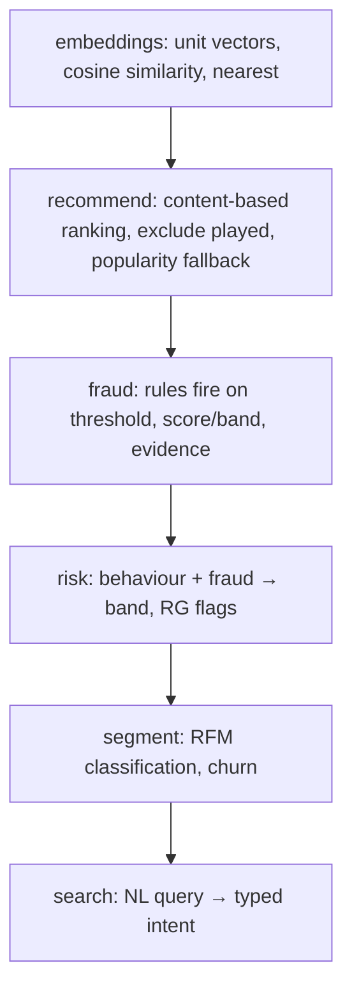

| Capability | Example assertion |
| --- | --- |
| Embeddings | `tokenize('Show me CARD games!') === ['card','games']`; `embed('card game')` magnitude ≈ 1; similar text scores higher |
| Recommendations | `recommend(games, {history:['teen-patti']})` → `andar-bahar` first (nearest card game), excludes played; no history → highest popularity (`crash`) |
| Fraud | features crossing a threshold → expected signal type + score |
| Risk | behaviour features → expected band + RG flags |
| Segmentation | RFM → expected segment + churn |
| Search | query string → expected `SearchIntent` |

### 11.2 Why AI tests assert exact outcomes

Because the AI core is **deterministic** ([AI §22.1](./AI_PLATFORM.md#221-the-pure-core-is-exhaustively-testable)), a given feature set produces a constant score — so tests assert *exact* results, not "roughly this segment." The recommendation test asserts `andar-bahar` is ranked *first* for a card-game history (exact ordering), and `crash` first with no history (exact popularity fallback). This exactness is only possible because the AI is rule-based and model-free — the single greatest testing advantage of that design choice. See [ADR-001](#24-testing-adrs).

### 11.2.1 A worked recommendation test

The recommender tests exercise three distinct behaviors, each a separate assertion path:

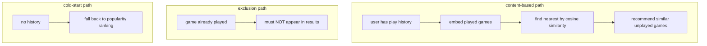

The **content-based test** seeds a user with a play history, then asserts the recommendations are games *near* the played ones in embedding space — proving the cosine-similarity nearest-neighbor logic works. The **exclusion test** asserts that a game the user has already played never appears in their recommendations — a correctness guarantee (don't recommend what they've done), tested explicitly because it's an easy invariant to break during refactors. The **cold-start test** gives a user *no* history and asserts the recommender falls back to popularity ranking rather than returning nothing — proving the system degrades gracefully for new users. Each path is a different code branch, and each has its own test, so a change that breaks one (say, the exclusion filter) fails a specific, named test rather than silently shipping bad recommendations. The embeddings themselves are tested separately (unit vectors, cosine bounds, nearest-neighbor ordering), so the recommender tests can trust the embedding layer and focus purely on ranking and filtering logic. This layering — tested embeddings underneath tested ranking — is what lets each test stay small and targeted. See [AI Platform §7](./AI_PLATFORM.md#7-recommendations) and [ADR-006](#24-testing-adrs).

### 11.3 The backend AI service test

`ai.spec.ts` (4 cases) tests the backend AI service wiring — that the service extracts features from (mocked) data and calls the core correctly. The pure core proves the *algorithm*; the service spec proves the *wiring*.

### 11.4 Testing grounding & the trust boundary

The AI tests encode the safety invariants: fraud/risk outputs carry their evidence (explainability), and the grounding contract (the LLM narrates facts, never invents) is testable by asserting the local provider returns the facts unchanged ([AI §22.3.2](./AI_PLATFORM.md#2232-testing-grounding-and-fallback)). A regression that let the AI fabricate a number or drop evidence would fail these tests.

---

## 12. Operations & Monitoring Testing

The operations primitives are tested deterministically via **injected time** — including chaos and recovery.

### 12.1 The ops-core test coverage

`ops-core.spec.ts` (11 cases) tests the four primitive families:

| Family | Tests |
| --- | --- |
| Metrics | counters/gauges/observe, **exact percentiles over 100k samples**, Prometheus export |
| Alerts | sustain-window firing/resolving, enabled flag |
| Resilience | circuit breaker states, retry schedule, token bucket |
| Health | dependency rollup, trace-id factory |

### 12.2 The exact-percentile load test

A standout ops test observes **100,000 samples** into a histogram and asserts exact percentiles:

```mermaid
flowchart LR
    OBS["observe(1..100,000) into Histogram(200000)"] --> SNAP["snapshot()"]
    SNAP --> A1["count === 100,000"]
    SNAP --> A2["min === 1, max === 100,000"]
    SNAP --> A3["p50 ∈ [49000, 51000]"]
    SNAP --> A4["p99 ≥ 98000"]
```

This proves the histogram computes accurate percentiles at scale — the p50 of 1..100,000 is ~50,000, p99 ~99,000. It's both a correctness test (percentiles are right) and a load test (100k observations). See [§13](#13-performance--load-testing).

### 12.3 The alert sustain-window test

`ops-core.spec` tests the alert state machine with **injected time**: a breach at t=0 → `pending`; still `pending` at t=30s (< 60s window); `firing` at t=61s (sustained); `resolved` at t=70s (recovered). This deterministically verifies the anti-flapping sustain window ([Operations §9.1](./OPERATIONS_PLATFORM.md#91-the-alert-state-machine)) without waiting 61 real seconds — the injected-time design makes it testable in microseconds. See [ADR-007](#24-testing-adrs).

The sustain window is precisely the property that would be impossible to test *reliably* without injected time. Consider the two failure modes it guards against:

```mermaid
sequenceDiagram
    participant M as Metric
    participant A as AlertManager (injected clock)
    M->>A: breach @ t=0 → evaluate()
    A-->>A: state = pending (window not elapsed)
    M->>A: still breaching @ t=30s → evaluate()
    A-->>A: state = pending (30 < 60)
    M->>A: still breaching @ t=61s → evaluate()
    A-->>A: state = firing (61 ≥ 60, sustained)
    M->>A: recovered @ t=70s → evaluate()
    A-->>A: state = resolved
```

The first failure mode is a **flapping alert**: a metric that briefly crosses the threshold and immediately recovers should *not* page anyone. The test proves this by breaching at t=0 and checking the state is still `pending` (not `firing`) at t=30s — the alert holds its fire until the breach is *sustained* past the 60-second window. The second failure mode is a **stuck alert**: an alert that fires and never clears even after the metric recovers. The test proves the recovery path by advancing to t=70s after the metric drops and asserting `resolved`. With real wall-clock time, testing this would mean sleeping 61+ seconds per case (slow, and flaky under CI load — a sleepy runner might tick past the boundary unpredictably). Injecting the clock collapses the whole timeline into microseconds *and* makes the boundary conditions exact — the test can check t=59s vs t=61s precisely, something a real sleep could never guarantee. This is the general lesson of the operations suite: **make time an input, and time-dependent behavior becomes ordinary deterministic logic you can assert.** See [Operations §22.3](./OPERATIONS_PLATFORM.md#223-testing-with-injected-time).

### 12.3.1 A worked percentile-test analysis

The 100,000-sample percentile test is both a correctness test and a load test, so it's worth understanding what it proves. It observes the integers 1 through 100,000 into a histogram, then checks the snapshot:

| Assertion | Reasoning |
| --- | --- |
| `count === 100,000` | every observation was recorded (no drops) |
| `min === 1`, `max === 100,000` | the extremes are tracked exactly |
| `p50 ∈ [49000, 51000]` | the median of 1..100,000 is ~50,000 |
| `p99 ≥ 98000` | the 99th percentile is ~99,000 |

The p50 tolerance (`[49000, 51000]`) is interesting: it's not asserting *exactly* 50,000, because the histogram uses a **bounded reservoir** ([Operations §5.3](./OPERATIONS_PLATFORM.md#53-histograms--bounded-exact-percentiles)) — with a 200,000-sample capacity here, all 100,000 fit, so the percentile is exact, but the test allows a small band to be robust to the reservoir's sampling behavior. This test proves two things at once: **correctness** (the percentile math is right — p50 ≈ median, p99 ≈ 99th) and **scale** (the histogram handles 100,000 observations accurately and without dropping any). It's a load test that lives in the unit suite because the histogram is pure and in-memory — observing 100,000 integers takes milliseconds. If the histogram's percentile calculation had an off-by-one or the reservoir dropped samples, this test would catch it. This is why the platform's metrics can be trusted in production: their accuracy at scale is a tested property. See [ADR-008](#24-testing-adrs).

### 12.4 The resilience tests (chaos & recovery)

Because time is injected, the circuit breaker's full open→half-open→closed lifecycle, the retry backoff schedule, and the token bucket's refill are all deterministically testable — including the **recovery** paths that are hardest to test in traditional systems ([Operations §22.3.1](./OPERATIONS_PLATFORM.md#2231-chaos-and-recovery-testing)). A test opens a breaker, advances time past the cooldown, and asserts it half-opens — the whole chaos-and-recovery arc runs synchronously. `operations.spec.ts` (backend, 3 cases) tests the ops service wiring.

---

## 13. Performance & Load Testing

The platform has **in-test** performance/load coverage rather than a separate load-testing harness — the load tests live inside the unit suites.

### 13.1 The in-test load coverage

```mermaid
flowchart TD
    L1["wallet-core: 10,000-op stress → invariants under load"] --> PROVE1["no corruption under load"]
    L2["ops-core: 100,000-sample percentiles → accuracy at scale"] --> PROVE2["metrics accurate at scale"]
    L3["rng.spec: 1000-iteration range checks"] --> PROVE3["RNG stable over many draws"]
```

| Load test | Scale | Proves |
| --- | --- | --- |
| Wallet stress | 10,000 operations | financial integrity under load |
| Percentile accuracy | 100,000 samples | metric accuracy at scale |
| RNG range | 1,000 iterations | RNG stability |
| Weighted RNG | 1,000 iterations | weight distribution |

### 13.2 Why load tests live in the unit suites

Because the correctness-critical logic is pure and in-memory, "load" is just running the logic many times — no infrastructure needed. The 10,000-op wallet test and the 100k-sample percentile test run in milliseconds, so they belong in the fast unit suite, not a separate slow harness. This is a benefit of the pure-core design: load testing the *logic* is cheap. Load testing the *deployed system* (HTTP throughput, database under concurrency) is a documented future addition ([§25](#25-future-testing-roadmap)). See [ADR-008](#24-testing-adrs).

### 13.3 Runtime performance monitoring (not a test, but related)

Production performance is *monitored* rather than load-tested pre-deploy: the operations platform tracks throughput, latency p95, CPU, and event-loop lag ([Operations §17](./OPERATIONS_PLATFORM.md#17-performance-monitoring)), and the frontend reports Core Web Vitals ([Frontend §15.3](./FRONTEND_ARCHITECTURE.md#153-web-vitals-telemetry)). The performance *thresholds* (alert rules) encode the SLOs ([§13.4](#134-performance-thresholds)).

### 13.4 Performance thresholds

The alert rules ([Operations §9.3](./OPERATIONS_PLATFORM.md#93-the-ten-default-rules)) encode the performance thresholds the platform monitors:

| Threshold | Value |
| --- | --- |
| p95 latency | > 1000ms (120s) → warning |
| error rate | > 5% (60s) → critical |
| memory | > 1536MB (120s) → warning |
| CPU | > 85% (120s) → warning |
| queue backlog | > 1000 (120s) → warning |
| Core Web Vitals | LCP < 2.5s, INP < 200ms, CLS < 0.1 |

---

## 14. Security Testing

Security controls are tested as **executable contracts** across CI security scanning and unit tests.

### 14.1 The security test layers

```mermaid
flowchart LR
    SAST["CodeQL — SAST (JS/TS, security-and-quality)"] --> IMG["Trivy — image scan (CRITICAL/HIGH)"]
    IMG --> DEP["pnpm audit — dependency scan (gate on critical)"]
    DEP --> UNIT["security unit tests — authz, crypto, money"]
```

| Layer | Tool | What it catches |
| --- | --- | --- |
| SAST | CodeQL | code-level security patterns (injection, unsafe deserialization) |
| Image scan | Trivy | image CVEs |
| Dependency scan | pnpm audit + Dependabot | vulnerable dependencies |
| Authorization | `permissions.guard.spec` | authz bypass regressions |
| Cryptography | `crypto.util.spec` | token/hash/constant-time regressions |
| Money integrity | `wallet-core.spec`, `wallet-settlement.spec` | financial-invariant regressions |
| Log safety | `winston.config.spec` | secret-leakage regressions |

### 14.2 The security unit tests

The security-critical controls are encoded as unit tests ([Security §21.2](./SECURITY_GUIDE.md#212-testing-the-security-controls)):

| Control | Test | Assertion |
| --- | --- | --- |
| Authorization | `permissions.guard.spec` | super-admin bypass, `all`/`any` modes, unauthenticated denial |
| Token generation/hashing | `crypto.util.spec` | correct format, SHA-256 digest, constant-time compare |
| Password hashing | `password.service.spec` | bcrypt hashing, strength rejection |
| JWT | `token.service.spec` | sign/verify with pinned iss/aud |
| Secret redaction | `winston.config.spec` | denylist keys → `[REDACTED]` |
| Overdraft prevention | `wallet-core.spec` | reserve/debit beyond balance throws |

### 14.3 The security regression gate

Because CI runs the full test suite plus CodeQL, a change that breaks an authorization test, a money invariant, a crypto test, or introduces a SAST-flagged pattern **fails CI and can't merge** ([Security §21.3](./SECURITY_GUIDE.md#213-the-security-regression-gate)). Security controls are regression-proofed as executable tests — the `permissions.guard.spec` super-admin-bypass test, for instance, means a change that accidentally removed the bypass (or broke the deny path) fails immediately. See [§19](#19-ci-testing-pipeline).

### 14.4 The log-redaction test

`winston.config.spec.ts` (2 cases) verifies the **secret redaction** ([Security §16.3](./SECURITY_GUIDE.md#163-secret-redaction-in-logs)) — that the recursive redact format replaces denylisted keys (`password`, `token`, `secret`, seeds, …) with `[REDACTED]`. This is a security *and* a compliance test: it proves logs can't leak secrets, which is the defense against OWASP A09.

---

## 15. Accessibility Testing

Accessibility is E2E-tested via Playwright, exercising the floating a11y controls.

### 15.1 The accessibility tests

`accessibility.spec.ts` (3 cases) tests the a11y control ([Frontend §14.1](./FRONTEND_ARCHITECTURE.md#141-the-accessibility-menu)):

```mermaid
flowchart TD
    OPEN["open the accessibility menu"] --> HC["high-contrast toggle: flips .high-contrast on <html>"]
    OPEN --> RM["reduce-motion toggle: flips .reduce-motion class"]
    OPEN --> FS["font-size stepper: changes root font-size"]
```

| Test | Asserts |
| --- | --- |
| high contrast | toggling adds/removes `.high-contrast` on `<html>` (via `htmlHasClass` poll) |
| reduce motion | the toggle *flips* the `.reduce-motion` class (either direction) |
| font size | the stepper changes the root font-size (`rootFontSize`) |

### 15.2 The reduce-motion nuance

The `prep()` helper seeds `a11y-reduce=1`, so the reduce-motion toggle **starts ON** — the test asserts the toggle *flips* the class rather than assuming a starting state. This is a good example of test robustness: the test accommodates the seeded state rather than assuming a clean slate, so it works whether prep seeded the flag or not.

### 15.3 Structural accessibility (asserted in every E2E)

Beyond the dedicated a11y spec, **every** navigation E2E asserts a visible **landmark** (`main` or a top-level heading) — proving each page has proper semantic structure ([Frontend §14.2](./FRONTEND_ARCHITECTURE.md#142-structural-accessibility)). And because Playwright uses **role-based locators** (`getByRole('button', ...)`, `getByRole('heading', ...)`, `getByRole('switch', ...)`), the tests inherently verify ARIA roles are present and correct — an accessible element is a testable element. See [§8.3](#83-the-e2e-helpers).

### 15.4 Why accessibility is E2E-tested

Accessibility is a *rendered-behavior* property — whether toggling a control changes the `<html>` class and font-size — so it's tested end-to-end in the real browser, not in a unit test. The role-based locators double as accessibility assertions (an element found by role has that role). This is accessibility testing woven into the E2E fabric, not a separate afterthought. See [ADR-009](#24-testing-adrs).

---

## 16. Visual Regression Testing

Visual regression uses Playwright's screenshot comparison across three viewports.

### 16.1 The visual regression pipeline

```mermaid
flowchart TD
    ROUTES["3 routes: / /world /store"] --> VP["3 viewports: desktop 1440, tablet 768, mobile 375"]
    VP --> PREP["prep: a11y-reduce (calm motion) + demoLogin"]
    PREP --> PAINT["wait for main/header visible"]
    PAINT --> MASK["mask floating widgets + tabular-nums (live tickers)"]
    MASK --> SNAP["toHaveScreenshot(slug-viewport.png)"]
    SNAP --> COMPARE["compare vs baseline, maxDiffPixelRatio 0.03"]
```

### 16.2 The visual matrix

`visual.spec.ts` snapshots **3 routes × 3 viewports**:

| Route | desktop (1440) | tablet (768) | mobile (375) |
| --- | --- | --- | --- |
| `/` (home) | (flaky — WebGL) | (flaky — WebGL) | ✅ `home-mobile` |
| `/world` | ✅ | ✅ | ✅ |
| `/store` | ✅ | ✅ | ✅ |

The baselines (7 committed PNGs) confirm the coverage: `home-mobile`, `store-{desktop,tablet,mobile}`, `world-{desktop,tablet,mobile}`. The home desktop/tablet are flaky-tolerant due to the live WebGL hero ([Frontend §20.4](./FRONTEND_ARCHITECTURE.md#204-visual-regression--flake-management)).

### 16.3 The flake-management technique

Visual regression on an animation-rich app requires neutralizing non-determinism:

| Technique | Purpose |
| --- | --- |
| `prep()` seeds `a11y-reduce=1` | calms motion |
| `animations: 'disabled'` | freezes CSS animations |
| **masks** on floating widgets (Nova, sound, accessibility, reload-coins) | ignore independently-animating overlays |
| **mask** on `.tabular-nums` | ignore live-ticking numbers |
| `maxDiffPixelRatio: 0.03` | allow residual jitter (3%) |
| `fullPage: false` | viewport only |

**Why masks + tolerance:** the platform's living background and live number tickers change every frame, so a naïve screenshot would always "differ." Masking the independently-animating elements and allowing a small pixel-diff ratio makes the comparison stable while still catching real layout/style regressions. This is a concrete example of designing immersive systems to be testable — the `.tabular-nums` class and `aria-label`s on floating widgets make them maskable. See [ADR-010](#24-testing-adrs).

### 16.3.1 A worked visual test flow

Follow the `/store @ desktop` visual test through one run:

```mermaid
flowchart TD
    A["prep: seed a11y-reduce (calm motion) + demoLogin"] --> B["setViewportSize 1440×900"]
    B --> C["goto /store; wait domcontentloaded"]
    C --> D["assert main/header visible (content painted)"]
    D --> E["build masks: Nova/sound/a11y buttons, reload-coins pill, .tabular-nums"]
    E --> F["toHaveScreenshot('store-desktop.png', maxDiffPixelRatio 0.03, animations disabled, mask)"]
    F --> G{"diff ≤ 3%?"}
    G -->|yes| PASS["pass"]
    G -->|no| DIFF["fail → expected/actual/diff images"]
```

The sequence is careful about determinism: `prep()` calms motion, the viewport is fixed, the test *waits for content to paint* (asserting `main`/`header` visible) before snapshotting, and it **masks** the elements that animate independently — the floating Nova/sound/accessibility buttons, the reload-coins pill, and every `.tabular-nums` element (live-ticking numbers). Then `toHaveScreenshot` compares against the committed `store-desktop.png` baseline with `animations: 'disabled'` and a 3% pixel-diff tolerance. If a developer changed the store's layout or colors, the diff would exceed 3% and the test would fail with an expected/actual/diff image trio for review. If the change was intended, `--update-snapshots` regenerates the baseline. The masks are the key to stability: without masking `.tabular-nums`, the balance pill's ticking number would differ every run and the test would always fail — masking it means the comparison ignores the parts that *should* vary and catches the parts that shouldn't. This is why the store gets baselines at all three viewports while the home page's desktop/tablet are flaky-tolerant (the WebGL hero can't be masked cleanly). See [ADR-010](#24-testing-adrs).

### 16.4 Generating and updating baselines

Baselines are generated on the first run (`playwright test --update-snapshots`, exposed as `pnpm test:e2e:update`). A deliberate UI change updates the baselines; an accidental regression fails the comparison. The baselines are committed (`visual.spec.ts-snapshots/*.png`) so CI compares against them. See [§21.5](#215-writing-a-visual-test).

---

## 17. Browser Compatibility

### 17.1 The target browser

Playwright is configured for **Chromium** (Desktop Chrome) as the single project. This is the primary tested target — the platform is a modern web app targeting evergreen browsers.

```mermaid
flowchart LR
    PW["Playwright projects"] --> CHROME["chromium (Desktop Chrome) — the tested target"]
    CHROME -.roadmap.-> FIREFOX["firefox"]
    CHROME -.roadmap.-> WEBKIT["webkit (Safari)"]
```

### 17.2 Cross-browser posture

The current E2E suite runs on Chromium. Playwright *supports* Firefox and WebKit projects, and adding them is a config change (a documented future enhancement, [§25](#25-future-testing-roadmap)). The platform uses standard, cross-browser web APIs (React 19, standard CSS, standard WebSockets), and progressive enhancement for immersive features (WebGL/audio degrade gracefully, [Frontend §10](./FRONTEND_ARCHITECTURE.md#10-animation-architecture)), so cross-browser risk is low — but Chromium is the *tested* target today. This is documented honestly as the current state, not overstated.

### 17.3 Responsive/viewport coverage

Cross-*viewport* coverage is real and tested: the visual regression suite runs at desktop (1440), tablet (768), and mobile (375) ([§16.2](#162-the-visual-matrix)), and the frontend's responsive design adapts across breakpoints ([Frontend §16](./FRONTEND_ARCHITECTURE.md#16-responsive-design)). So while browser-engine coverage is Chromium-only, **viewport** coverage spans the three device classes.

---

## 18. Manual QA Procedures

### 18.1 Where manual QA fits

The automated suite covers correctness (units), integration (RC1), and user flows (E2E). Manual QA complements it for what automation can't easily assert — subjective quality, exploratory testing, and pre-release validation.

```mermaid
flowchart TD
    AUTO["Automated (units + E2E + visual)"] --> COVERS["correctness, flows, layout"]
    MANUAL["Manual QA"] --> EXPLORE["exploratory, subjective feel, edge cases"]
    MANUAL --> DEPLOY["post-deploy verification"]
    MANUAL --> A11Y["screen-reader / assistive-tech validation"]
```

### 18.2 The post-deploy verification checklist

The most important manual procedure is **post-deploy verification** ([Deployment §16.3](./DEPLOYMENT_GUIDE.md#163-post-deploy-verification)):

| Check | How |
| --- | --- |
| Health | `GET /api/v1/health` returns 200 |
| Dashboard | ops overview shows `status: up`, no firing alerts |
| Money integrity | `reconcile()` balanced; no settlement alerts |
| Smoke | key routes load, demo login works |

### 18.3 Exploratory testing areas

| Area | Focus |
| --- | --- |
| Immersive feel | WebGL hero, sound, dynamic world (subjective — automation checks presence, not feel) |
| Game play | actual game rounds, edge cases in bet handling |
| Assistive tech | screen-reader navigation (automation checks roles; a human checks the experience) |
| Cross-browser | Firefox/Safari (until automated) |
| Real-money flows | staging validation of the wallet with real currency binding |

### 18.4 Why manual QA remains necessary

Automation asserts *presence* and *behavior* (is the button there? does clicking it change the class?), but not *quality* (does the animation feel smooth? is the screen-reader experience coherent?). Manual QA covers the subjective and exploratory dimensions, and validates the post-deploy state in the real environment. The two are complementary: automation is the regression-proof foundation; manual QA is the human judgment layer on top.

---

## 19. CI Testing Pipeline

Tests run in CI on every push/PR via GitHub Actions.

### 19.1 The CI execution flow

```mermaid
flowchart TD
    PUSH["push / PR to main·develop"] --> CI["ci.yml"]
    CI --> VERIFY["verify job"]
    VERIFY --> V1["setup pnpm 9.15.0 + node 20"]
    V1 --> V2["install --frozen-lockfile"]
    V2 --> V3["db:generate (Prisma client)"]
    V3 --> V4["typecheck"]
    V4 --> V5["lint"]
    V5 --> V6["test (turbo run test → jest + vitest)"]
    V6 --> V7["build"]
    CI --> AUDIT["audit job: pnpm audit"]
    CI --> DOCKER["docker job (needs verify): build images"]
    PUSH --> CODEQL["codeql.yml: SAST"]
```

### 19.2 The CI test stage

The `verify` job's `test` step runs `pnpm test` → `turbo run test`, which executes **every** package's and the backend's test suite (Vitest + Jest) across the monorepo, cached. This is the test gate — the full unit + integration suite must pass. It runs *after* typecheck and lint (fail fast on cheaper checks) and *before* build.

| CI stage | Command | Runner |
| --- | --- | --- |
| Typecheck | `pnpm typecheck` | tsc |
| Lint | `pnpm lint` | eslint |
| **Test** | `pnpm test` (`turbo run test`) | **Vitest + Jest** |
| Build | `pnpm build` | turbo |
| Audit | `pnpm audit` | pnpm |
| Docker | build images | docker |
| SAST | CodeQL | codeql |

### 19.3 Where E2E runs

The Playwright E2E suite is `pnpm test:e2e` (`turbo run test:e2e`, `cache: false`). It's separate from the unit-test gate because it requires spinning up the dev server and a browser (slower, heavier). E2E is run against the app; the config's `reuseExistingServer` (non-CI) and `forbidOnly` (CI) settings tune it for local vs CI. The unit/integration gate (`pnpm test`) is the primary merge gate; E2E is the browser-level validation.

### 19.4 The CI quality gate

```mermaid
flowchart LR
    LOCAL["local: husky (lint-staged, commitlint, pre-push typecheck)"] --> CI["CI: typecheck + lint + test + build + audit + docker + CodeQL"]
    CI --> GREEN["all green → mergeable"]
```

Nothing merges unless CI is fully green — including the test stage ([Deployment §24.2](./DEPLOYMENT_GUIDE.md#242-the-quality-gate)). Local Husky hooks catch issues before CI (`pre-push` runs typecheck). This gate is what makes every commit on the default branch releasable — it compiled, linted, **tested**, and built as an image. See [§14.3](#143-the-security-regression-gate).

### 19.5 Concurrency & caching

CI uses `concurrency: cancel-in-progress` (a new push cancels the superseded run) and Turbo caches test outputs (`coverage/**`), so only changed packages re-test. This keeps the test gate fast despite the large monorepo — an unchanged package's cached test result is reused. See [Deployment §9.3.1](./DEPLOYMENT_GUIDE.md#931-why-the-ci-gate-is-shaped-this-way).

### 19.6 A worked CI run

Trace a single pull request that touches `packages/wallet-core` through the gate:

```mermaid
flowchart TD
    PUSH["push to PR branch"] --> INSTALL["pnpm install --frozen-lockfile"]
    INSTALL --> BUILD["turbo build (^build for test deps)"]
    BUILD --> AFFECTED["Turbo: wallet-core changed → wallet-core + dependents re-test; rest cached"]
    AFFECTED --> UNIT["Vitest: wallet-core suite incl. 10,000-op stress test"]
    AFFECTED --> JEST["Jest: backend incl. rc1-e2e integration gate (imports wallet-core)"]
    UNIT --> GATE{"all green?"}
    JEST --> GATE
    GATE -->|yes| E2E["Playwright E2E (demo-mode)"]
    GATE -->|no| FAILFAST["fail → PR blocked, images/traces attached"]
    E2E --> MERGE["mergeable"]
```

The interesting property here is what Turbo's dependency graph forces: a change to `wallet-core` doesn't just re-run the wallet-core suite — it re-runs **everything that imports wallet-core**, including the backend's `rc1-e2e` integration gate (which composes the real `WalletLedgerEngine` with every other engine). So a change that broke wallet-core's contract would fail *twice*: once in the focused unit suite (with an exact assertion pointing at the regression) and once in the integration gate (proving the break propagates to real cross-module flows). Meanwhile, the ~35 other packages that *don't* depend on wallet-core reuse their cached test results — Turbo doesn't waste minutes re-running the AI or ops suites when only the wallet changed. The `^build` dependency ensures every package under test is built first (so the integration gate imports compiled, current code, not stale artifacts). If the unit or integration stage fails, the run stops before E2E — fail-fast saves the expensive browser stage for changes that pass the cheap deterministic gates first. This is the pyramid enforced by the pipeline itself: cheap, fast, deterministic tests gate the slow ones. See [§4](#4-the-test-pyramid) and [ADR-018](#24-testing-adrs).

---

## 20. Test Data Strategy

### 20.1 The three data sources

```mermaid
flowchart TD
    PURE["Pure tests: hand-crafted fixtures (inline data)"] --> DETERM["deterministic, exact"]
    E2E["E2E: demo-mode client data + mock helpers"] --> NOBACKEND["no DB/backend needed"]
    STRESS["Stress: deterministic PRNG-generated schedule"] --> REPRO["reproducible load"]
```

| Test layer | Data source |
| --- | --- |
| Pure unit (Vitest) | inline hand-crafted fixtures (e.g. the `games: RecItem[]` array in `ai-core.spec`) |
| Backend unit (Jest) | inline fixtures + mocked Prisma/Redis |
| Integration (RC1) | real engine cores producing real data (no fixtures needed) |
| E2E (Playwright) | demo-mode client data (`ecosystem-data`, mocks) + demo login |
| Stress | deterministic PRNG-generated operation schedule |

### 20.2 Fixtures are inline and minimal

The pure tests use **inline fixtures** — small, hand-crafted data defined in the spec (e.g. `ai-core.spec`'s four `RecItem` games with weighted category text, `wallet-core.spec`'s wallets opened with known balances). This keeps tests self-contained and the fixtures visible: you can read the test and see exactly what data produces the asserted result. There's no external fixture-loading machinery — the data is right there.

This inline discipline has a subtle payoff for **failure diagnosis**. When a test fails, the engineer doesn't have to hunt through a fixtures directory or a seed script to reconstruct what data drove the assertion — the input is co-located with the expectation, a few lines above the failing line. The `wallet-settlement.spec` case that reserves 10, settles a win of 25, and asserts a net of 15 reads as a single self-contained story: open with balance 100, reserve 10 (available → 90), settle win 25 (available → 115, net +15), all visible in one screenful. Compare a fixture-file approach where the "100" lives in one file, the "reserve 10" in a helper, and the assertion in a third — a failure would send the reader on a three-file scavenger hunt before they even understand the scenario. Inline fixtures trade a little repetition across specs for a large gain in local readability, and for a test suite whose whole value is *fast, unambiguous failure signals*, that trade is exactly right — the reader sees the entire cause-and-effect chain without leaving the failing test. See [§8.4.1](#841-a-worked-e2e-test-walkthrough) and [Wallet §22](./WALLET_ENGINE.md#22-testing-the-wallet).

### 20.3 E2E runs on demo data

E2E tests run against **demo mode** ([Frontend §20.2](./FRONTEND_ARCHITECTURE.md#202-playwright-e2e)): the client-only demo login and demo wallet, backed by mock data (`ecosystem-data`, `leaderboard-mock`, `sports-mock`, `prototype-games`), so the full navigable surface works without a database or backend. This decouples E2E from backend/data availability — a huge simplification that lets E2E run in CI with just `next dev`. See [ADR-005](#24-testing-adrs).

### 20.4 Deterministic pseudo-randomness

The stress test needs *variety* (many different operations) but *reproducibility* (a failure must be re-runnable). It uses a **deterministic PRNG** (a linear congruential generator seeded with a constant, `s = (s * 1103515245 + 12345) & 0x7fffffff`) — explicitly *"no Math.random — reproducible."* So the 10,000-op schedule is varied yet identical across runs. This is the right pattern for stress/property testing: deterministic variety. See [§10.4](#104-the-10000-operation-stress-test).

### 20.5 No test database

Notably, the unit and integration tests use **no test database** — the pure cores need none, and backend service tests mock Prisma/Redis. This keeps the test suite fast and hermetic (no external state to set up or clean). Database-backed integration testing (against a real test Postgres) is a documented future enhancement ([§25](#25-future-testing-roadmap)).

---

## 21. Writing New Tests

### 21.1 Choosing the layer

```mermaid
flowchart TD
    WHAT{"what are you testing?"} -->|pure logic| VITEST["Vitest unit test (co-located .spec.ts)"]
    WHAT -->|backend service/guard| JEST["Jest unit test (co-located .spec.ts)"]
    WHAT -->|module composition| RC["extend rc1-e2e or a service spec"]
    WHAT -->|user flow| PW["Playwright E2E (tests/e2e)"]
    WHAT -->|layout| VIS["Playwright visual (visual.spec)"]
```

| Testing | Layer | Runner |
| --- | --- | --- |
| Pure algorithm (money, RNG, scoring) | unit | Vitest |
| Backend service/guard/util | unit | Jest |
| Cross-module behavior | integration | Jest (RC1-style) |
| User-facing flow | E2E | Playwright |
| Visual layout | visual | Playwright |

### 21.2 Writing a pure unit test (Vitest)

Import from `vitest` (`describe`, `it`, `expect`), construct inline fixtures, call the pure function, assert the **exact** result. Follow the existing patterns: `wallet-core.spec` asserts exact money strings; `ai-core.spec` asserts exact rankings. Because the logic is deterministic, the expected value is a constant.

### 21.3 Writing a backend unit test (Jest)

Co-locate a `.spec.ts` (the `testRegex` picks it up). Mock external dependencies (Prisma, Redis) with Jest mocks; test the service's logic in isolation. The `permissions.guard.spec` pattern — mock the reflector, construct execution contexts, assert allow/deny — is the model for guard tests.

### 21.4 Writing an E2E test (Playwright)

Import from `@playwright/test` and the shared `helpers`. In `beforeEach`, call `prep(page)` (skip intro, calm motion) and, if the flow needs auth, `demoLogin(page)`. Use **role-based locators** (`getByRole`) for accessibility and robustness. Assert **resilient** conditions (some element/reaction, not exact numbers). Use `VISIBLE_TIMEOUT` for the animation-heavy UI. Follow `wallet-missions.spec` / `social.spec` as models.

### 21.5 Writing a visual test

Add a route to `visual.spec`'s `ROUTES`, ensure content paints (`await expect(main/header).toBeVisible()`), **mask** floating widgets and `.tabular-nums`, set `animations: 'disabled'` and a `maxDiffPixelRatio`, and generate the baseline with `--update-snapshots`. Follow the existing matrix pattern.

### 21.6 The golden rules

| Rule | Why |
| --- | --- |
| Keep the logic pure → unit-testable | Exact assertions, fast |
| Inject time → recovery-testable | No waiting for real time |
| Deterministic fixtures/schedules | Reproducible |
| Role-based E2E locators | Accessibility + robustness |
| Resilient E2E assertions | Robust to demo-data variation |
| Assert invariants for money | Correctness under any input |
| Mask animations in visual tests | Stable comparison |

---

## 22. Coverage Strategy

### 22.1 The coverage posture

Coverage is **targeted, not uniform** ([Backend §21.4](./BACKEND_ARCHITECTURE.md#214-coverage-posture-honest)): the pure cores and correctness-critical paths (money, fairness, authz, crypto) are tested exhaustively; thin controllers, DTOs, and glue are exercised through integration/E2E rather than chased for line coverage. Jest collects coverage (`collectCoverageFrom: **/*.(t|j)s`, output `coverage/`), and Turbo caches the `coverage/**` output.

### 22.2 Coverage priorities

```mermaid
flowchart TD
    HIGH["Highest priority: money, fairness, authz, crypto"] --> EXHAUST["exhaustive (invariants + examples + stress)"]
    MED["Medium: engine logic, services, AI, ops"] --> THOROUGH["thorough (determinism + edge cases)"]
    LOW["Lower: thin controllers, DTOs, glue"] --> INTEG["via integration/E2E"]
```

| Priority | Areas | Approach |
| --- | --- | --- |
| Highest | wallet-core, provably-fair, authz, crypto | invariants + examples + stress; exact assertions |
| High | game engines, SDK runtime, AI core, ops core | determinism + edge cases; ~13–17 cases each |
| Medium | backend services, tournament | wiring + happy path + key edges |
| Lower | controllers, DTOs | E2E flows + integration |

### 22.3 Why targeted, not uniform

Chasing 100% line coverage would spend effort testing trivial glue (a getter, a DTO) that E2E already exercises, while the *value* is in exhaustively testing the correctness-critical logic. The strategy concentrates test effort where a bug would be most costly — money (10k-op stress + invariants), fairness (determinism + verification), and authorization (full guard contract). A thin controller is covered adequately by an E2E flow; the wallet algebra deserves invariant-based stress testing. This is coverage *by value*, not by line count. See [ADR-011](#24-testing-adrs).

### 22.4 Coverage gaps

Honestly documented gaps (candidates for future work, [§25](#25-future-testing-roadmap)):

| Gap | Status |
| --- | --- |
| `lottery-engine` unit spec | no dedicated spec (exercised via registry) |
| Database-backed integration (real Postgres) | mocked today |
| Cross-browser E2E (Firefox/WebKit) | Chromium only |
| Deployed-system load testing | in-test load only |
| Some backend controllers | via E2E, not unit |

Documenting gaps is itself a coverage discipline — a known gap can be prioritized; an unknown gap is a surprise. See [§25](#25-future-testing-roadmap).

---

## 23. Debugging Failed Tests

### 23.1 The debugging decision tree

```mermaid
flowchart TD
    FAIL["test fails"] --> TYPE{"which runner?"}
    TYPE -->|Vitest/Jest unit| UNIT["exact assertion diff → the logic changed; is it a regression or an intended change?"]
    TYPE -->|RC1 integration| INTEG["a module contract broke → which engine/wallet/tournament assertion failed?"]
    TYPE -->|Playwright E2E| E2E["open the trace + screenshot (on-first-retry); did a selector break or a flow change?"]
    TYPE -->|Visual| VIS["compare the diff image → real regression or animation jitter?"]
```

### 23.2 Debugging unit test failures

A failed unit test shows an **exact diff** (expected vs received). Because the logic is deterministic, the failure is reproducible — re-run and it fails identically. Ask: is this a *regression* (the code broke) or an *intended change* (the expected value should update)? For the wallet stress test, the deterministic PRNG means a failure is re-runnable with the same schedule — invaluable for debugging a concurrency-invariant break.

### 23.3 Debugging E2E failures

```mermaid
flowchart LR
    E2EFAIL["E2E fails"] --> RETRY["retries (2 CI/1 local) → flaky or real?"]
    RETRY --> TRACE["trace on-first-retry → step-by-step replay"]
    TRACE --> SHOT["screenshot only-on-failure → visual state at failure"]
    SHOT --> DIAGNOSE["selector broken? flow changed? timing?"]
```

Playwright's `trace: on-first-retry` and `screenshot: only-on-failure` provide rich debugging artifacts: the trace is a step-by-step replay (with DOM snapshots, network, console), and the screenshot shows the exact visual state at failure. The retries distinguish flaky from real (a test that passes on retry was flaky; one that fails consistently is a real break). Common E2E failure causes: a changed selector (the UI moved), a changed flow, or a timing issue (increase `VISIBLE_TIMEOUT` or add a wait). See [§8.1](#81-the-playwright-architecture).

### 23.4 Debugging visual failures

A visual failure produces a **diff image** (Playwright generates expected/actual/diff). Inspect it: is it a *real* regression (a layout/style change) or *animation jitter* (a masked element leaked, or the tolerance is too tight)? If it's an intended change, update the baseline (`--update-snapshots`); if it's jitter, add a mask or raise `maxDiffPixelRatio`. The home-desktop flakiness (live WebGL) is the known case where jitter dominates. See [§16.3](#163-the-flake-management-technique).

### 23.5 The flake-management history

The E2E suite's serial execution (`workers: 1`) exists *because* of a debugged flake: parallel navigations against `next dev` caused `ERR_ABORTED` (the on-demand compiler was overwhelmed). The fix — serial execution — is documented in the config comment. This is a lesson: E2E flakiness against a dev server is often a *concurrency* problem, and serializing is the fix. Similarly, the `prep()` intro-skip and reduce-motion seeding fixed intro-overlay and motion flakiness. See [Frontend §20.2](./FRONTEND_ARCHITECTURE.md#202-playwright-e2e).

### 23.5.1 A worked debugging session

An engineer changes the wallet's `commitReserved` and the wallet-core suite fails. Follow the debug:

```mermaid
flowchart TD
    RUN["pnpm --filter wallet-core test"] --> FAIL["FAIL: 'reserves and settles a winning bet' — expected available 115, received 105"]
    FAIL --> READ["read the exact diff: net was 5 not 15"]
    READ --> HYPOTH["hypothesis: the win (25) wasn't fully credited"]
    HYPOTH --> INSPECT["inspect commitReserved: did the change drop the win credit?"]
    INSPECT --> ROOT["root cause: the change consumed the stake but skipped crediting the win"]
    ROOT --> FIX["fix + re-run: all green"]
```

The debug is fast because the failure is **exact and deterministic**: the test says "expected available 115, received 105" — a precise 10-unit discrepancy that immediately points at the win credit (the win was 25, the stake 10, so 100 − 10 + 25 = 115; getting 105 means the +25 win credit was dropped or halved). The engineer doesn't have to reproduce a flaky failure or reason about timing — the assertion pinpoints the regression. Then the **stress test** provides a second signal: if the change also broke conservation, `isConserved()` would fail, revealing that money leaked. Between the exact example assertion (which localizes *what* broke) and the invariant assertion (which reveals *integrity* damage), the debug is a matter of reading the diff and inspecting the changed function. This is the payoff of deterministic, exact-assertion testing: a failure is a precise, reproducible signpost, not a mystery. Contrast a probabilistic test that "sometimes fails" — the engineer would waste time reproducing it before even starting to debug. See [§23.2](#232-debugging-unit-test-failures).

### 23.6 Running tests locally

| Command | Purpose |
| --- | --- |
| `pnpm test` | full unit + integration suite (all packages) |
| `pnpm --filter @gaming-platform/wallet-core test` | one package |
| `pnpm test:e2e` | Playwright E2E |
| `pnpm --filter @gaming-platform/frontend test:e2e:ui` | Playwright UI mode (interactive debugging) |
| `pnpm --filter @gaming-platform/frontend test:e2e:update` | update visual baselines |

---

## 24. Testing ADRs

Each ADR records the **problem, decision, alternatives, trade-offs, and consequences.**

### ADR-001 — Deterministic cores → exact assertions
- **Problem:** correctness-critical logic must be verifiable to certainty.
- **Decision:** pure deterministic cores tested with exact-value assertions.
- **Alternatives:** probabilistic/tolerance-based tests.
- **Trade-offs:** (+) exact, reproducible, strong; (−) requires deterministic design.
- **Consequences:** money/fairness/scoring assert exact outcomes.

### ADR-002 — Test pyramid weighted to the base
- **Problem:** maximize confidence per test-dollar.
- **Decision:** many cheap unit tests, few expensive E2E.
- **Alternatives:** E2E-heavy (ice-cream cone).
- **Trade-offs:** (+) fast feedback, cheap coverage; (−) E2E gaps must be chosen well.
- **Consequences:** ~230 unit, ~22 E2E.

### ADR-003 — `--passWithNoTests` for uniform orchestration
- **Problem:** run tests across all packages uniformly.
- **Decision:** `vitest run --passWithNoTests` so test-less packages pass.
- **Alternatives:** only invoke test where specs exist.
- **Trade-offs:** (+) one `turbo run test` spans everything; (−) a test-less package silently passes.
- **Consequences:** `pnpm test` covers the whole monorepo.

### ADR-004 — Pure cross-module integration (RC1)
- **Problem:** prove modules compose without a full stack.
- **Decision:** compose the real cores in a pure, deterministic integration test.
- **Alternatives:** full-stack integration (DB + network).
- **Trade-offs:** (+) fast, deterministic, runs in CI; (−) doesn't test the DB/network wiring.
- **Consequences:** RC1 is the integration gate.

### ADR-005 — E2E in demo mode
- **Problem:** run E2E without a backend/database.
- **Decision:** Playwright against a demo-mode dev server (client-only auth/wallet + mocks).
- **Alternatives:** full-stack E2E.
- **Trade-offs:** (+) simple, fast, no infra; (−) doesn't exercise the real backend.
- **Consequences:** the navigable surface tests with just `next dev`.

### ADR-006 — Invariant-based stress testing for money
- **Problem:** prove the wallet is corruption-free under load.
- **Decision:** a 10,000-op deterministic stress test asserting invariants.
- **Alternatives:** example-based tests only.
- **Trade-offs:** (+) strong evidence across varied ops; (−) more complex test.
- **Consequences:** conservation/no-negative proven under load.

### ADR-007 — Injected time for resilience tests
- **Problem:** test time-dependent behavior (breakers, alerts) without waiting.
- **Decision:** inject `now` into the primitives; tests advance time.
- **Alternatives:** real-time waits; mocked timers.
- **Trade-offs:** (+) fast, deterministic recovery tests; (−) callers pass time.
- **Consequences:** chaos/recovery arcs test in microseconds.

### ADR-008 — Load tests inside the unit suites
- **Problem:** load-test the correctness-critical logic cheaply.
- **Decision:** run the pure logic at scale (10k ops, 100k samples) as unit tests.
- **Alternatives:** a separate load harness.
- **Trade-offs:** (+) fast, in CI, no infra; (−) doesn't load-test the deployed system.
- **Consequences:** logic load-tested; system load-testing is future work.

### ADR-009 — Accessibility via E2E + role locators
- **Problem:** test accessibility as rendered behavior.
- **Decision:** Playwright a11y toggle tests + role-based locators throughout.
- **Alternatives:** unit-test a11y; a separate a11y tool.
- **Trade-offs:** (+) tests real behavior, role locators double as a11y checks; (−) no automated WCAG audit.
- **Consequences:** toggles + landmarks + roles are E2E-verified.

### ADR-010 — Masked, tolerance-based visual regression
- **Problem:** visual-test an animation-rich app stably.
- **Decision:** mask animating elements, disable animations, allow a small diff ratio.
- **Alternatives:** exact pixel match (always flaky); no visual tests.
- **Trade-offs:** (+) stable, catches real regressions; (−) tuning masks/tolerance.
- **Consequences:** 3 routes × 3 viewports baselined.

### ADR-011 — Targeted coverage by value
- **Problem:** where to spend test effort.
- **Decision:** exhaustive tests for money/fairness/authz/crypto; integration/E2E for glue.
- **Alternatives:** uniform 100% line coverage.
- **Trade-offs:** (+) effort where bugs are costliest; (−) some low lines uncovered.
- **Consequences:** money has stress + invariants; controllers via E2E.

### ADR-012 — Three runners matched to tiers
- **Problem:** test isomorphic packages, NestJS, and the browser.
- **Decision:** Vitest (packages), Jest (backend), Playwright (frontend).
- **Alternatives:** one runner everywhere.
- **Trade-offs:** (+) each runner fits its tier; (−) three toolchains.
- **Consequences:** Vitest fast for ESM, Jest idiomatic for Nest, Playwright for the browser.

### ADR-013 — Co-located tests
- **Problem:** keep tests discoverable next to code.
- **Decision:** `.spec.ts` co-located with the source (E2E in `tests/`).
- **Alternatives:** a separate test tree.
- **Trade-offs:** (+) tests next to code, easy to find; (−) source dirs have specs.
- **Consequences:** a package's tests live in its `src`.

### ADR-014 — Turbo-orchestrated, cached tests
- **Problem:** run the monorepo's tests fast.
- **Decision:** `turbo run test`, cached, `^build`-ordered.
- **Alternatives:** run each package manually.
- **Trade-offs:** (+) cached, parallel, ordered; (−) a build tool.
- **Consequences:** unchanged packages skip re-testing.

### ADR-015 — Serial E2E execution
- **Problem:** parallel E2E against `next dev` caused `ERR_ABORTED`.
- **Decision:** `workers: 1`, `fullyParallel: false`.
- **Alternatives:** parallel workers.
- **Trade-offs:** (+) stable; (−) slower E2E.
- **Consequences:** E2E runs serially (can bump after a prod build).

### ADR-016 — Intro-skip + reduce-motion for E2E determinism
- **Problem:** the cinematic intro and motion cause E2E flakiness.
- **Decision:** `prep()` seeds `gp-intro-seen` + `a11y-reduce` before first nav.
- **Alternatives:** wait out the animations.
- **Trade-offs:** (+) deterministic, fast; (−) tests a calmed variant.
- **Consequences:** immersive systems are neutralizable for tests.

### ADR-017 — Resilient E2E assertions
- **Problem:** demo data and animations vary.
- **Decision:** assert *some* expected element/reaction, not exact values.
- **Alternatives:** exact assertions in E2E.
- **Trade-offs:** (+) robust to variation; (−) less precise.
- **Consequences:** E2E proves flows; units prove exact values.

### ADR-018 — CodeQL + Trivy + audit as security tests
- **Problem:** catch security issues in CI.
- **Decision:** SAST (CodeQL) + image scan (Trivy) + dependency audit.
- **Alternatives:** manual security review only.
- **Trade-offs:** (+) automated, gated; (−) CI time.
- **Consequences:** the pipeline is a security test layer.

### ADR-019 — Reference aggregate as the wallet test oracle
- **Problem:** verify the money algebra independently of persistence.
- **Decision:** the `WalletLedgerEngine` reference aggregate with checkable invariants.
- **Alternatives:** test only against the DB-backed engine.
- **Trade-offs:** (+) fast, invariant-checkable; (−) tests the algebra, not the Prisma wiring.
- **Consequences:** the backend mirrors the tested algebra.

### ADR-020 — No test database (mock/pure)
- **Problem:** keep tests fast and hermetic.
- **Decision:** pure tests + mocked Prisma/Redis; no test DB.
- **Alternatives:** a real test Postgres.
- **Trade-offs:** (+) fast, no setup/teardown; (−) DB wiring untested at unit level.
- **Consequences:** DB-backed integration is future work.

### ADR-021 — Deterministic pseudo-randomness in tests
- **Problem:** stress tests need variety + reproducibility.
- **Decision:** a seeded LCG (no `Math.random`) for stress schedules.
- **Alternatives:** `Math.random` (non-reproducible).
- **Trade-offs:** (+) varied yet reproducible; (−) not "true" randomness (fine for testing).
- **Consequences:** a stress failure is re-runnable identically.

---

## 25. Future Testing Roadmap

| Phase | Initiative | What it adds | Seam it uses |
| --- | --- | --- | --- |
| **1. DB integration** | Real test Postgres | Test the Prisma-backed engine + migrations against a real DB | `jest-e2e.json` + Testcontainers |
| **1. lottery-engine spec** | Fill the engine gap | Unit-test the lottery engine like the others | `games/lottery-engine` |
| **2. Cross-browser E2E** | Firefox + WebKit projects | Playwright projects for the other engines | `playwright.config.ts` |
| **2. Backend HTTP e2e** | Supertest suites | Exercise real API endpoints (auth, wallet) | `.e2e-spec.ts` config |
| **3. System load testing** | k6 / Artillery | Load-test the deployed system (throughput, DB concurrency) | deployed stack |
| **3. Automated a11y audit** | axe-core in Playwright | WCAG rule auditing beyond role checks | E2E |
| **4. Mutation testing** | Stryker | Verify the tests actually catch mutations | Vitest/Jest |
| **4. Contract tests** | Frontend↔backend contract | Assert the shared types stay in sync | `@gaming-platform/types` |

**Guiding principle:** the roadmap fills documented gaps ([§22.4](#224-coverage-gaps)) using existing seams — a real test DB behind the existing `jest-e2e.json` config, more Playwright projects behind the existing config, a lottery spec matching the existing engine-spec pattern. None require re-architecting the test strategy; each extends the foundation this document describes. The pure-core, deterministic, invariant-based approach that makes the current tests strong is preserved throughout.

---

## 26. Appendix

### A. Glossary

| Term | Definition |
| --- | --- |
| **Unit test** | Tests one unit in isolation (pure function, service, guard) |
| **Integration test** | Tests modules composed together (RC1) |
| **E2E test** | Tests a user flow in a real browser (Playwright) |
| **Visual regression** | Screenshot comparison against a baseline |
| **Invariant test** | Asserts a property holds regardless of input (conservation, no-negative) |
| **Stress test** | Runs many operations to test under load (10k wallet ops) |
| **Fixture** | Test input data (inline in the pure tests) |
| **Mock** | A stand-in for a dependency (Prisma/Redis in Jest) |
| **Baseline** | The reference screenshot for visual comparison |
| **Flake** | A test that passes/fails non-deterministically |
| **Determinism** | Same input → same output (enables exact assertions) |
| **Injected time** | Passing `now` as a parameter (enables recovery tests) |

### B. Test file index (42 files)

See [§5](#5-repository-test-organization). Vitest: 5 packages (wallet-core, game-sdk×2, ops-core, ai-core, tournament-core) + 5 engines (card, crash×2, dice×2, roulette, sports). Jest: 19 backend specs. Playwright: 9 E2E specs + helpers + 7 visual baselines.

### C. Test runner index

| Runner | Version | Config | Scope |
| --- | --- | --- | --- |
| Vitest | 2.1.9 | (defaults) | packages + engines |
| Jest | ts-jest | `jest.config.js`, `jest-e2e.json` | backend |
| Playwright | 1.49 | `playwright.config.ts` | frontend E2E + visual |
| Turbo | 2.3 | `turbo.json` (test, test:e2e) | orchestration |

### D. Test suite responsibility index

| Suite | Responsibility |
| --- | --- |
| wallet-core.spec | money algebra correctness + 10k stress |
| wallet-settlement.spec | settlement semantics |
| rc1-e2e.spec | cross-module integration |
| rng.spec | RNG determinism |
| runtime.spec | runtime lifecycle |
| provably-fair.service.spec | fairness verification |
| plugin-registry.spec | plugin validation |
| ai-core.spec | AI algorithm correctness |
| ops-core.spec | metrics/alerts/resilience |
| permissions.guard.spec | authorization |
| crypto.util.spec | cryptographic primitives |
| winston.config.spec | secret redaction |
| engine.spec (×5) | game outcome/settlement |
| E2E specs | user flows + a11y + visual |

### E. Helper & fixture index

| Helper | File |
| --- | --- |
| `prep`, `demoLogin`, `authIndicator`, `accessibilityButton`, `rootFontSize`, `htmlHasClass`, `ERROR_TEXTS`, `VISIBLE_TIMEOUT` | `tests/e2e/helpers.ts` |
| Inline `RecItem[]` fixtures | `ai-core.spec` |
| `CounterPlugin` test plugin | `runtime.spec` |
| Deterministic PRNG (LCG) | `wallet-core.spec` (stress) |

### F. Mock strategy index

| Layer | Mock |
| --- | --- |
| Pure tests | none (inline fixtures) |
| Backend services | Jest mocks for Prisma/Redis |
| Backend guards | mocked reflector + execution context |
| E2E | demo-mode client data + mock helpers |

### G. Coverage goal index

| Area | Goal |
| --- | --- |
| Money/fairness/authz/crypto | exhaustive (invariants + stress) |
| Engines / SDK / AI / ops | thorough (determinism + edges) |
| Services | wiring + happy path + key edges |
| Controllers/DTOs | via E2E/integration |

### H. CI stage index

| Stage | Command |
| --- | --- |
| Typecheck | `pnpm typecheck` |
| Lint | `pnpm lint` |
| Test | `pnpm test` (Vitest + Jest) |
| Build | `pnpm build` |
| Audit | `pnpm audit` |
| Docker | build images |
| SAST | CodeQL |
| E2E | `pnpm test:e2e` (Playwright) |

### I. Useful references

- [Backend Architecture](./BACKEND_ARCHITECTURE.md) · §21 Testing Strategy
- [Frontend Architecture](./FRONTEND_ARCHITECTURE.md) · §20 Testing
- [Wallet Engine](./WALLET_ENGINE.md) · §24 Testing Strategy
- [Game Engine SDK](./GAME_ENGINE_SDK.md) · §24 Testing Strategy
- [Operations Platform](./OPERATIONS_PLATFORM.md) · §22 Testing Strategy
- [Deployment Guide](./DEPLOYMENT_GUIDE.md) · §9 CI/CD, §24 Quality gate
- [Security Guide](./SECURITY_GUIDE.md) · §21 Security Testing
- Configs: [`playwright.config.ts`](../apps/frontend/playwright.config.ts), [`jest.config.js`](../apps/backend/jest.config.js)

---

## 27. Testing Reference

### 27.1 The command reference

| Command | Purpose |
| --- | --- |
| `pnpm test` | full unit + integration suite (turbo → Vitest + Jest) |
| `pnpm test:e2e` | Playwright E2E |
| `pnpm --filter <pkg> test` | one package's tests |
| `pnpm --filter @gaming-platform/frontend test:e2e:ui` | Playwright UI (interactive) |
| `pnpm --filter @gaming-platform/frontend test:e2e:update` | update visual baselines |

### 27.2 The test-count reference

| Group | Files | Cases |
| --- | --- | --- |
| Pure packages (Vitest) | 6 specs | ~71 |
| Game engines (Vitest) | 7 specs | ~80 |
| Backend (Jest) | 19 specs | ~80 |
| Frontend E2E (Playwright) | 9 specs | ~22 |
| **Total** | **~42** | **~253** |

### 27.3 The invariant reference (wallet)

| Invariant | Assertion |
| --- | --- |
| Conservation | `isConserved()`, `globalNet() === '0'` |
| Balanced journals | `ledgerBalanced()` |
| No negatives | `!isNegative(available/locked)`, `total ≥ 0` |
| Idempotency | replay returns identical result |
| No double-settle | commit-after-release throws |

### 27.4 The E2E config reference

| Setting | Value |
| --- | --- |
| Browser | Chromium |
| Viewport | 1440×900 |
| Workers | 1 (serial) |
| Dev server | `next dev -p 3130`, demo mode |
| Retries | 2 (CI) / 1 (local) |
| Trace | on-first-retry |
| Screenshot | only-on-failure |
| Visual tolerance | `maxDiffPixelRatio: 0.03` |

### 27.5 The QA engineer's contract, in one page

If you remember nothing else: **the platform is testable because it's deterministic, and the tests exploit that.** The base of the pyramid is broad — ~150 Vitest unit tests of the pure cores and game engines, asserting *exact* outcomes because the logic is deterministic. Money is tested to the highest standard: exact arithmetic, the reserve/commit/release semantics, and a 10,000-operation stress test that proves the books conserve, balance, and never go negative under load. The RC1 integration test composes the real engine cores → wallet → tournament → AI → ops as the platform wires them, proving the modules fit — purely, in milliseconds, as the CI gate. Backend services, guards, and crypto are Jest-tested (the authorization guard's super-admin bypass and the secret-redaction format are executable security contracts). The frontend runs ~22 Playwright E2E tests in a real Chromium browser against a demo-mode dev server, with role-based locators (which double as accessibility checks), resilient assertions, and intro-skip + reduce-motion seeding for determinism — plus visual regression across three viewports with masked animations. All of it runs through `turbo run test` in CI, gating every merge, alongside CodeQL, Trivy, and pnpm audit. To add a test, pick the layer (pure→Vitest, service→Jest, flow→Playwright), keep the logic deterministic, inject time for recovery paths, use role-based E2E locators, and assert invariants for money. Respect these patterns — deterministic exact-assertion units, invariant-based money tests, pure cross-module integration, demo-mode E2E, masked visual regression — and the platform stays regression-proof from the money algebra to the browser.

---

*This completes the platform's core documentation set — twelve authoritative handbooks: [System](./SYSTEM_ARCHITECTURE.md), [Backend](./BACKEND_ARCHITECTURE.md), [Frontend](./FRONTEND_ARCHITECTURE.md), [Database](./DATABASE_ARCHITECTURE.md), [Game Runtime](./GAME_RUNTIME.md), [Game Engine SDK](./GAME_ENGINE_SDK.md), [Wallet Engine](./WALLET_ENGINE.md), [AI Platform](./AI_PLATFORM.md), [Operations Platform](./OPERATIONS_PLATFORM.md), [Deployment Guide](./DEPLOYMENT_GUIDE.md), [Security Guide](./SECURITY_GUIDE.md), and this Testing Guide.*

*End of document — Testing Guide, Gaming Universe Platform. Maintained by the Office of the CTO. Changes to the test strategy must update this document or record a new ADR in [§24](#24-testing-adrs).*
