# Wallet Engine — Gaming Universe Platform

> The definitive engineering handbook for the platform's financial core: the pure `@gaming-platform/wallet-core` package and the backend `wallet-engine` module ([`apps/backend/src/modules/wallet-engine`](../apps/backend/src/modules/wallet-engine)). This is the money. Every balance, every bet, every win, every deposit, and every withdrawal on the Gaming Universe Platform flows through the components documented here. It is a companion to the master [System Architecture](./SYSTEM_ARCHITECTURE.md), the [Backend Architecture](./BACKEND_ARCHITECTURE.md), the [Frontend Architecture](./FRONTEND_ARCHITECTURE.md), the [Database Architecture](./DATABASE_ARCHITECTURE.md), the [Game Runtime Architecture](./GAME_RUNTIME.md), and the [Game Engine SDK](./GAME_ENGINE_SDK.md). It is written so a senior financial-systems engineer can operate, debug, reconcile, and extend the wallet **without first reading the source**.

| Field | Value |
| --- | --- |
| **Project Name** | Gaming Universe Platform |
| **Component** | Wallet & Financial Engine (`@gaming-platform/wallet-core` + `wallet-engine` module) |
| **Financial Model** | Double-entry ledger · exact `Decimal(38,18)` money · optimistic + pessimistic concurrency |
| **Engine Version** | A3 — 8 wallet types · 21 transaction types · double-entry conservation |
| **Document Version** | 1.0 |
| **Prepared By** | Office of the CTO — Principal Financial Systems Group |
| **Status** | Authoritative — single source of truth for the wallet |
| **Last Updated** | V3.0 · Phase 3.2 · Documentation Sprint 7 |

### Revision History

| Version | Date / Milestone | Author | Notes |
| --- | --- | --- | --- |
| 0.1 | Wallet GA | Financial Systems Group | Wallet-core algebra, double-entry ledger, engine service |
| 0.5 | V3.0 Sprints 1–5 | Financial Systems Group | Bonus/reward wallets, reporting, reconciliation, runtime bridge |
| 1.0 | V3.0-P3.2 · Sprint 7 | Office of the CTO | Definitive wallet handbook — this document |

---

## Table of Contents

1. [Executive Summary](#1-executive-summary)
2. [Financial Architecture](#2-financial-architecture)
3. [Wallet Philosophy](#3-wallet-philosophy)
4. [Wallet Types](#4-wallet-types)
5. [Wallet Lifecycle](#5-wallet-lifecycle)
6. [Wallet Engine Architecture](#6-wallet-engine-architecture)
7. [Wallet Components](#7-wallet-components)
8. [Wallet State Machine](#8-wallet-state-machine)
9. [Reservation Flow](#9-reservation-flow)
10. [Settlement Flow](#10-settlement-flow)
11. [Double-Entry Ledger](#11-double-entry-ledger)
12. [Ledger Entries](#12-ledger-entries)
13. [Transaction Lifecycle](#13-transaction-lifecycle)
14. [Concurrency Model](#14-concurrency-model)
15. [Idempotency](#15-idempotency)
16. [House Wallet](#16-house-wallet)
17. [Bonus & Reward Wallets](#17-bonus--reward-wallets)
18. [Currency Handling](#18-currency-handling)
19. [Reporting & Reconciliation](#19-reporting--reconciliation)
20. [Failure Recovery](#20-failure-recovery)
21. [Runtime Integration](#21-runtime-integration)
22. [Security](#22-security)
23. [Performance](#23-performance)
24. [Testing Strategy](#24-testing-strategy)
25. [Extension Guide](#25-extension-guide)
26. [Coding Standards](#26-coding-standards)
27. [Architecture Decision Records](#27-architecture-decision-records)
28. [Future Wallet Roadmap](#28-future-wallet-roadmap)
29. [Appendix](#29-appendix)
30. [Wallet Reference](#30-wallet-reference)

---

## 1. Executive Summary

### 1.1 What the wallet engine is

The wallet engine is the **authoritative financial system** of the platform — the single subsystem responsible for the money supply. It is split into two parts:

- **`@gaming-platform/wallet-core`** — a pure, dependency-free package that owns the *algebra* of money: exact decimal arithmetic (`Money`), non-negative balance operations (`Balance`), the double-entry ledger builder (`Ledger`), the transaction lifecycle state machine (`Lifecycle`), reservations, and an in-memory reference aggregate (`WalletLedgerEngine`) that *proves* the books are always conserved.
- **The backend `wallet-engine` module** — which *mirrors* that algebra onto PostgreSQL with optimistic locking, Redis locks, and idempotency keys, exposes REST/WebSocket APIs, and provides the mandatory integration seam (`WalletBridgeService`) every game settles through.

The `wallet-core` index states the relationship precisely: *"The pure, exact-arithmetic domain core … The backend `wallet-engine` module mirrors these operations onto Postgres with optimistic locking, Redis locks and idempotency keys."* In other words, correctness is proven once in a pure, in-memory model and then faithfully reproduced against durable storage — the backend adds persistence and concurrency, but invents no new financial rules of its own.

### 1.2 The one invariant that matters most

Everything in this document serves a single invariant: **the books always balance.** Formally, in the reference engine:

```
Σ player balances + Σ system accounts ≡ 0
```

Every value movement posts a balanced double-entry journal (`Σ debits = Σ credits`), and no player balance component can ever go negative. If these hold, the platform's money is provably correct; if either could be violated, the platform is insolvent-by-bug. The entire architecture — exact `bigint` money, non-negative balance algebra, double-entry posting, four-layer concurrency control, idempotency, and reconciliation — exists to make these invariants **structurally impossible to violate**. See [§11](#11-double-entry-ledger) and [§14](#14-concurrency-model).

### 1.3 Why a pure core plus a persistent mirror

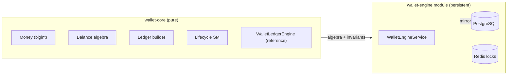

The pure core is **trivially testable and provably correct** — its `WalletLedgerEngine` is an in-memory aggregate whose property tests assert `isConserved()` and `ledgerBalanced()` after any sequence of operations. The backend then mirrors that exact algebra onto durable storage, adding only the concerns a database brings (persistence, concurrency, idempotency). This separation means the *correctness* of the money model is verified in isolation, and the backend's job is reduced to faithfully reproducing verified operations. See [ADR-001](#27-architecture-decision-records).

### 1.4 Responsibilities

| The wallet engine **does** | The wallet engine **does not** |
| --- | --- |
| Own every balance mutation (single code path) | Decide game outcomes (the engine/runtime does) |
| Post double-entry ledger journals | Render balances (the frontend does) |
| Enforce non-negative balances + optimistic versioning | Hold ephemeral game state (the runtime does) |
| Guarantee idempotent, atomic money operations | Talk to payment gateways directly (the payments layer does) |
| Provide reporting + reconciliation | Compute provably-fair seeds (the runtime does) |
| Expose the mandatory game-settlement bridge | Let any other module write a balance |

### 1.5 Non-goals

- **Not a payments processor.** Deposits/withdrawals are modeled ([Database §12](./DATABASE_ARCHITECTURE.md#12-wallet-schema)), but gateway integration is the payments layer's concern.
- **Not event-sourced.** State is current balances + an append-only ledger and transaction log, not a global event stream ([Database ADR-018](./DATABASE_ARCHITECTURE.md#24-architecture-decision-records)).
- **Not multi-currency conversion at settlement.** A wallet is single-currency; FX is a separate concern ([§18](#18-currency-handling)).

---

## 2. Financial Architecture

### 2.1 Where the wallet sits

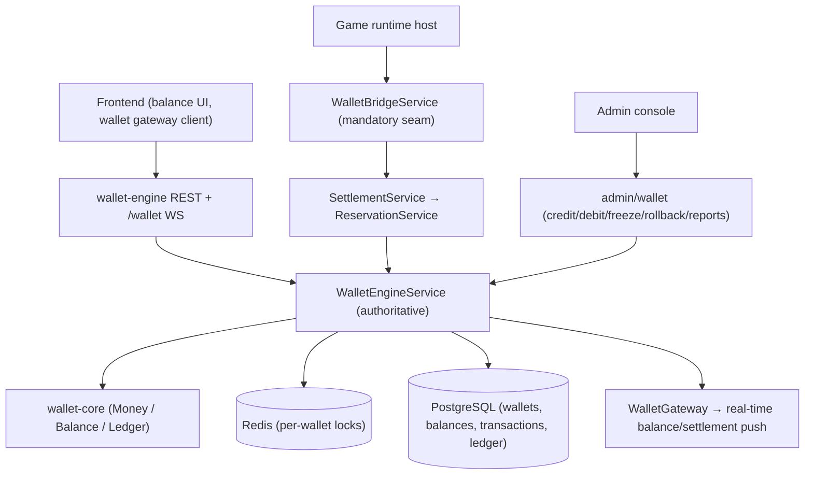

The `WalletEngineService` is the **single choke point** for balance mutations. The runtime settles through the bridge; player-facing reads/transfers go through the REST controller; admin corrections go through the admin controller; and *every* one of these ultimately calls the engine, which alone writes balances and posts journals. Nothing else in the platform touches a balance. See [Backend §12](./BACKEND_ARCHITECTURE.md#12-wallet-backend).

### 2.2 The financial data model (recap)

The persistence side is documented fully in [Database §12](./DATABASE_ARCHITECTURE.md#12-wallet-schema). The engine operates over these tables:

| Table | Role |
| --- | --- |
| `Wallet` | A user's account for one currency + type; unique `[userId, currencyId, type]` |
| `WalletBalance` | 1-1 balance: `available` / `locked` / `pending` / `total` + `version` |
| `WalletTransaction` | Immutable movement record; unique `reference` + `idempotencyKey` |
| `Ledger` / `LedgerEntry` | Double-entry journal header + DEBIT/CREDIT lines |
| `LockedFunds` | Reservation records (LOCKED → RELEASED) |
| `TransactionType` / `TransactionStatus` | Lookup tables for type/status codes |
| `BonusWallet` / `RewardWallet` | Bonus balance + wagering; loyalty points |
| `Currency` | Currency master (per-currency house wallets) |

### 2.3 The layered financial stack

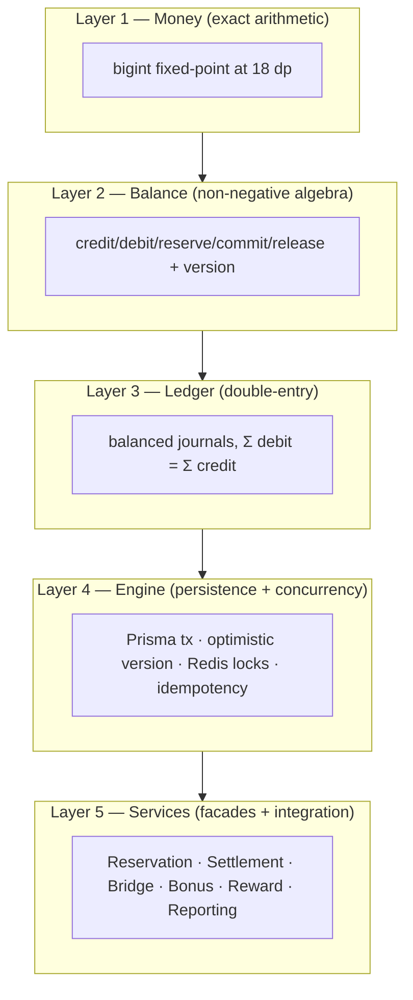

Each layer builds on the guarantees of the one below: exact money → non-negative balances → balanced journals → atomic persistence → typed facades. A bug at a higher layer cannot violate a lower layer's invariant, because the lower layer enforces it structurally (e.g. `Balance` throws on any negative result regardless of what the engine asks).

---

## 3. Wallet Philosophy

Seven convictions shape every decision in the wallet engine.

### 3.1 Money is exact — never floating point

`money.ts` opens with the rationale: *"Using `bigint` eliminates floating-point drift — the root cause of balance corruption — so every operation is exact."* Amounts are decimal strings at the boundaries, scaled internally to `bigint` at 18 fractional digits, matching the database `Decimal(38,18)` columns. A JS `number` never participates in a balance calculation. See [§18.1](#181-exact-decimal-money) and [ADR-002](#27-architecture-decision-records).

### 3.1.1 Why exact money, in prose

It is worth dwelling on why floating-point money is banned, because it is the most common and most catastrophic mistake in financial software. A JS `number` is an IEEE-754 double, which cannot exactly represent many decimal fractions — `0.1 + 0.2 === 0.30000000000000004`. Over millions of transactions, these tiny errors accumulate, and balances drift from their true value. In a gaming platform, that drift is money appearing or disappearing — an accounting catastrophe and a regulatory failure. The `Money` core eliminates the possibility entirely by working in **scaled integers** (`bigint` at 18 dp): `0.1` becomes the integer `100000000000000000`, and integer arithmetic is exact. The decimal string is only the human-readable boundary form; all arithmetic happens in exact integers. This is the same technique banks use, and it is non-negotiable for a system whose correctness *is* its balances. See [ADR-002](#27-architecture-decision-records).

### 3.2 Balances cannot go negative

The `Balance` algebra rejects any operation that would drive `available`, `locked`, or `pending` below zero — *"the structural guarantee against overdrafts and balance corruption."* Insufficient-funds is a thrown error at the algebra level, not a check the engine might forget. See [§7.2](#72-balance--the-non-negative-algebra).

### 3.3 The books always balance (double-entry)

Every movement posts two equal-and-opposite entries (player ↔ counterparty), so `Σ debits = Σ credits` always. The ledger builder *enforces* this: `assertBalanced` throws on any unbalanced journal. See [§11](#11-double-entry-ledger).

### 3.4 One authoritative path

There is exactly one code path that mutates a balance — `WalletEngineService`. Facades (reservation, settlement, bridge, bonus) and admin operations all funnel through it. No module writes `WalletBalance` directly. This is what makes the money auditable: there is one place to reason about. See [ADR-004](#27-architecture-decision-records).

### 3.5 Concurrency is defended in depth

A balance write is protected by **four independent layers** — a Redis per-wallet lock, a Serializable database transaction, an optimistic `version` check, and the non-negative `Balance` algebra. Any one failing still leaves the books correct. See [§14](#14-concurrency-model).

### 3.6 Every operation is idempotent

Money operations carry an idempotency key; a replay returns the original result rather than applying the mutation twice. Combined with unique `reference` constraints, double-settlement is structurally impossible. See [§15](#15-idempotency).

### 3.7 History is append-only

Transactions and ledger entries are never mutated or deleted. A correction is a **compensating** transaction (a `ROLLBACK`/`REVERSED` entry), not an edit. The financial record is evidence. See [§20.3](#203-rollback--compensation).

---

## 4. Wallet Types

A user holds multiple wallets distinguished by **type** and **currency**. The `wallet-core` `WalletType` enumerates the eight types.

### 4.1 The eight wallet types

| Type | Purpose |
| --- | --- |
| `MAIN` | The primary spendable wallet (default; `isPrimary`) |
| `BONUS` | Promotional credit with wagering requirements ([§17.1](#171-bonus-wallets)) |
| `REWARD` | Loyalty points balance ([§17.2](#172-reward-wallets)) |
| `LOCKED` | Funds locked for a specific purpose |
| `TOURNAMENT` | Tournament entry/prize balance |
| `PROMOTIONAL` | Promotional funds |
| `CASH` | The type used for **house/system** wallets ([§16](#16-house-wallet)) |
| `VIRTUAL` | Virtual/demo-adjacent currency balance |

The full list is `WALLET_TYPES` in `wallet-core/types.ts`, mirrored by the database `WalletType` enum ([Database §29 C](./DATABASE_ARCHITECTURE.md#c-enum-index)). A `Wallet` row is unique per `[userId, currencyId, type]`, so a user has at most one wallet of each type per currency.

### 4.2 Wallet status

| Status | Meaning | Effect |
| --- | --- | --- |
| `ACTIVE` | Normal | All operations permitted |
| `FROZEN` | Admin-frozen | Mutations rejected (`Wallet is frozen`) |
| `SUSPENDED` | Suspended | Mutations rejected |
| `CLOSED` | Closed | Terminal |

The engine checks `wallet.status !== ACTIVE` before a credit/debit and throws a `ConflictException` if the wallet is not active — so freezing a wallet immediately blocks money movement. See [§8](#8-wallet-state-machine).

### 4.3 Balance components

Every wallet's balance (`WalletBalance` / `BalanceState`) has four money components plus a version:

| Component | Meaning |
| --- | --- |
| `available` | Spendable now |
| `locked` | Reserved for an in-flight bet (a `LockedFunds` reservation) |
| `pending` | In-flight deposit/withdrawal |
| `total` | `available + locked + pending` (a conserved invariant) |
| `version` | Optimistic-lock counter (bumped on every write) |

`Balance.total()` computes `Money.sum([available, locked, pending])`; the invariant `total = available + locked + pending` is **conserved** by transfers between components (reserve/release) and changed only by external credit/debit. See [§7.2](#72-balance--the-non-negative-algebra).

---

## 5. Wallet Lifecycle

### 5.1 Wallet creation

Wallets are created **lazily** on first use. `WalletEngineService.getOrCreateWallet(userId, currencyId, type = MAIN)` upserts a `Wallet` with a zero `WalletBalance` (`available/locked/pending/total = 0`), so a player never has to "open" a wallet — it materializes when first touched. The `MAIN` wallet is marked `isPrimary`.

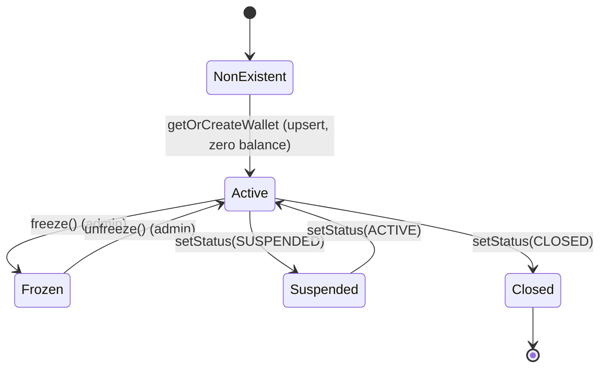

### 5.2 The money-in / money-out lifecycle

Over its life a wallet accumulates value through credits and sheds it through debits, with reservations moving value between `available` and `locked` during play:

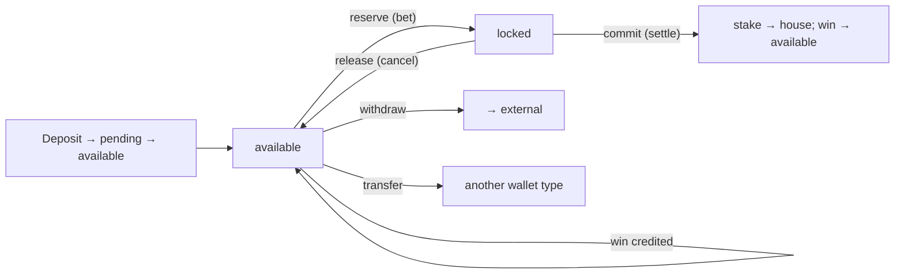

### 5.2.1 A wallet's full financial life

To tie the lifecycle together, trace one wallet from creation to closure:

1. **Materialize.** A player first plays a currency; `getOrCreateWallet` upserts a `MAIN` wallet with a zero balance. No explicit "open account" step.
2. **Fund.** A deposit moves through `pending` → `available` (`addPending` then `settlePending`), or is credited directly on confirmation. The balance grows; a `DEPOSIT` transaction and journal are posted.
3. **Play.** Each bet reserves (`available → locked`), then commits (stake → house, win → available) or releases. `locked` rises and falls; `available` reflects wins and losses; every round is ledgered.
4. **Earn & convert.** Play accrues loyalty points (reward wallet) and may clear a bonus, which converts into `MAIN` via `engine.credit(BONUS_CREDIT)`.
5. **Transfer.** The player moves funds between wallet types (e.g. `TOURNAMENT` → `MAIN`) via `transfer`, posting `TRANSFER_OUT`/`TRANSFER_IN`.
6. **Withdraw.** A withdrawal debits `available` toward `__external__`, posting a `WITHDRAWAL` transaction after approval.
7. **Freeze (if needed).** Compliance or fraud freezes the wallet; all mutation is blocked until unfrozen.
8. **Close.** The account is soft-closed; the wallet's status becomes `CLOSED`, but its transaction and ledger history remain forever (financial FKs are `Restrict`, [Database §8.3](./DATABASE_ARCHITECTURE.md#83-cascade-strategy--the-three-delete-behaviors)).

Every step in this life is a movement through the one authoritative engine, ledgered and idempotent. There is no stage — funding, play, bonus, transfer, withdrawal, correction — that bypasses the double-entry books. This is the wallet's central promise realized over a full account lifetime: **every cent is always accounted for.**

### 5.3 Freeze / unfreeze / close

Admin operations control the wallet's status. `freeze(walletId)` sets `FROZEN`; `unfreeze` sets `ACTIVE`; `setStatus` handles the general case. A non-active wallet rejects credit/debit at the engine, and the balance cache is invalidated on status change. This is the operational lever for compliance holds and fraud response ([§22](#22-security)).

---

## 6. Wallet Engine Architecture

### 6.1 The module

`WalletEngineModule` is `@Global` — the financial backbone is available platform-wide without re-importing. Its docstring is emphatic: *"Every balance movement flows through WalletEngineService (atomic, idempotent, optimistically-locked, double-entry ledgered). Game engines integrate exclusively via WalletBridgeService, which is exported."*

```mermaid
flowchart TD
    MOD["WalletEngineModule (@Global)"] --> WE["WalletEngineService (authoritative)"]
    MOD --> WB["WalletBalanceService (reads)"]
    MOD --> WT["WalletTransactionService (history)"]
    MOD --> WL["WalletLedgerService (reconciliation)"]
    MOD --> RS["ReservationService"]
    MOD --> SS["SettlementService"]
    MOD --> BR["WalletBridgeService (game seam)"]
    MOD --> BW["BonusWalletService"]
    MOD --> RW["RewardWalletService"]
    MOD --> SA["SystemAccountService (house)"]
    MOD --> WR["WalletReportingService"]
    MOD --> GW["WalletGateway (/wallet WS)"]
    MOD --> CT["WalletEngineController + AdminWalletController"]
```

### 6.2 The service dependency graph

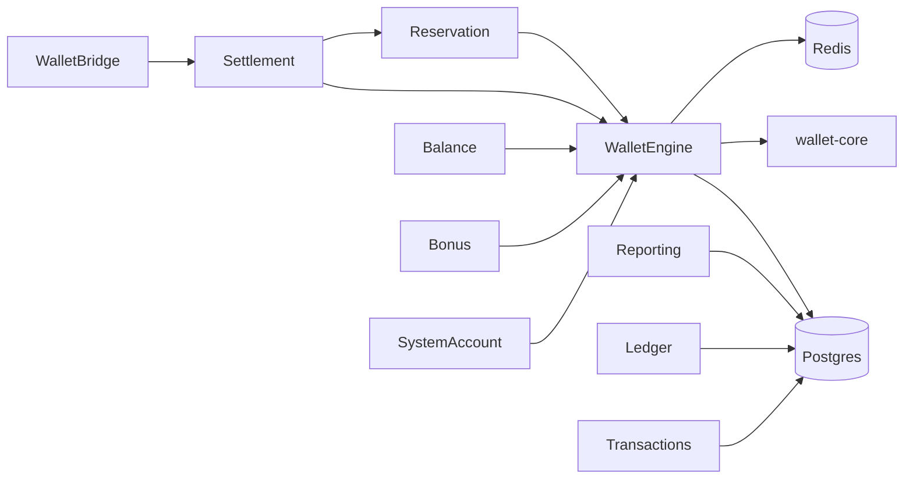

The engine sits at the center; the reservation/settlement/bridge services are **thin facades** that orchestrate engine primitives; reporting/ledger/transaction services are **read-only** over the database. The bonus/reward services manage their own tables but route real-money conversions through the engine.

### 6.3 What is exported

The module exports the engine and its facades (`WalletEngineService`, `WalletBalanceService`, `WalletTransactionService`, `WalletReportingService`, `SettlementService`, `ReservationService`, `BonusWalletService`, `RewardWalletService`, and **`WalletBridgeService`**) so games and other modules integrate through them — but **only** the engine mutates balances.

---

## 7. Wallet Components

This section documents every financial component with its responsibility and API surface.

### 7.1 Money — exact arithmetic (`wallet-core/money.ts`)

`Money` is the canonical value type — a decimal **string** at the boundary, scaled internally to `bigint` at 18 dp.

| Member | Purpose |
| --- | --- |
| `parseMoney` / `formatMoney` | string ↔ scaled bigint (validated) |
| `of` | normalize a value |
| `add` / `sub` / `neg` / `abs` / `mul` | arithmetic (mul divides by FACTOR for scale) |
| `cmp` / `eq` / `gt` / `gte` / `lt` / `lte` | comparison |
| `isZero` / `isNegative` / `isPositive` | predicates |
| `min` / `max` / `sum` | aggregation |
| `ZERO` | the zero constant |

`parseMoney` validates the format (`/^[+-]?\d*(\.\d*)?$/`) and throws `MoneyError` on invalid input, so a malformed amount can't silently corrupt a balance. `mul` performs `(a * b) / FACTOR` to keep scale (e.g. stake × multiplier).

### 7.2 Balance — the non-negative algebra (`wallet-core/balance.ts`)

`Balance` operates on a `BalanceState` (`available`, `locked`, `pending`, `version`), returning a **new immutable state** with an incremented version on every operation and **rejecting any negative result**.

| Operation | Effect | Guard |
| --- | --- | --- |
| `total(state)` | `available + locked + pending` | — |
| `credit(state, amount)` | `available += amount` | positive amount |
| `debit(state, amount)` | `available -= amount` | sufficient available |
| `reserve(state, amount)` | `available → locked` | sufficient available |
| `commitReserved(state, amount)` | `locked -= amount` (stake leaves) | sufficient locked |
| `releaseReserved(state, amount)` | `locked → available` | sufficient locked |
| `addPending(state, amount)` | `pending += amount` | positive |
| `settlePending(state, amount)` | `pending → available` | sufficient pending |
| `dropPending(state, amount)` | `pending -= amount` (deposit failed) | sufficient pending |

The private `next()` helper increments `version` and throws `BalanceError` if any component would be negative. This is the structural overdraft guarantee: the engine *cannot* produce a negative balance because the algebra refuses to. See [ADR-003](#27-architecture-decision-records).

### 7.3 Ledger — double-entry builder (`wallet-core/ledger.ts`)

`Ledger` constructs balanced journals. A `LedgerEntryDraft` is `{ account, walletRef, direction, amount }` where `account` is `'player' | 'house' | 'external' | 'bonus' | 'reward' | 'locked'`.

| Member | Purpose |
| --- | --- |
| `totals(entries)` | sum debits and credits |
| `assertBalanced(entries)` | throw `LedgerError` unless `Σ debit = Σ credit` |
| `simple({...})` | build a two-sided player↔counterparty journal |

`simple` creates a player entry and an equal-and-opposite counterparty entry, then `assertBalanced`s — so a journal is balanced by construction. See [§11](#11-double-entry-ledger).

### 7.4 Lifecycle — transaction state machine (`wallet-core/lifecycle.ts`)

`Lifecycle` enforces the transaction state machine (`TRANSITIONS`): `isFinal`, `canTransition`, and `transition` (which throws `LifecycleError` on an illegal move). See [§13](#13-transaction-lifecycle).

### 7.5 Reservation — reservation state machine (`wallet-core/reservation.ts`)

`ReservationState.assert(from, to)` enforces `RESERVED → COMMITTED | RELEASED` (each once, both terminal). See [§9](#9-reservation-flow).

### 7.6 WalletLedgerEngine — the reference aggregate (`wallet-core/engine.ts`)

An in-memory, atomic aggregate that is *"the reference implementation of the engine's money invariants and the basis for its property tests."* It maintains player wallets (via `Balance`), signed system accounts (`__house__`, `__external__`), reservations, and posted journals, and exposes:

| Method | Purpose |
| --- | --- |
| `open` / `balance` | create / read a wallet |
| `credit` / `debit` | external money in/out (mirrored against `__external__`) |
| `reserve` / `commit` / `release` | the reservation lifecycle |
| `transfer` | player-to-player |
| `globalNet` / `isConserved` | assert `Σ = 0` |
| `ledgerBalanced` | assert every journal balances |

Its idempotent wrapper replays stored results for a known key. This class **proves the algebra is corruption-free** — the backend mirrors it onto Postgres. See [§24](#24-testing-strategy).

### 7.7 The backend engine service (`WalletEngineService`)

The authoritative service. Public operations:

| Method | Effect |
| --- | --- |
| `getOrCreateWallet` / `getWallets` / `getWalletById` | wallet reads/creation |
| `credit` / `debit` | available-balance mutation + journal |
| `reserve` | available → locked + `LockedFunds` + `RESERVE` txn |
| `commitReservation` | consume stake (`GAME_BET`) + credit win (`GAME_WIN`) + journals |
| `releaseReservation` | locked → available + `RESERVE_RELEASE` txn |
| `transfer` | between a user's wallet types (`TRANSFER_OUT`/`TRANSFER_IN`) |
| `setStatus` / `freeze` / `unfreeze` | wallet status |
| `rollback` | reverse a transaction (compensating `ROLLBACK`) |

Documented in depth across [§9](#9-reservation-flow)–[§16](#16-house-wallet).

---

## 8. Wallet State Machine

### 8.1 Wallet status transitions

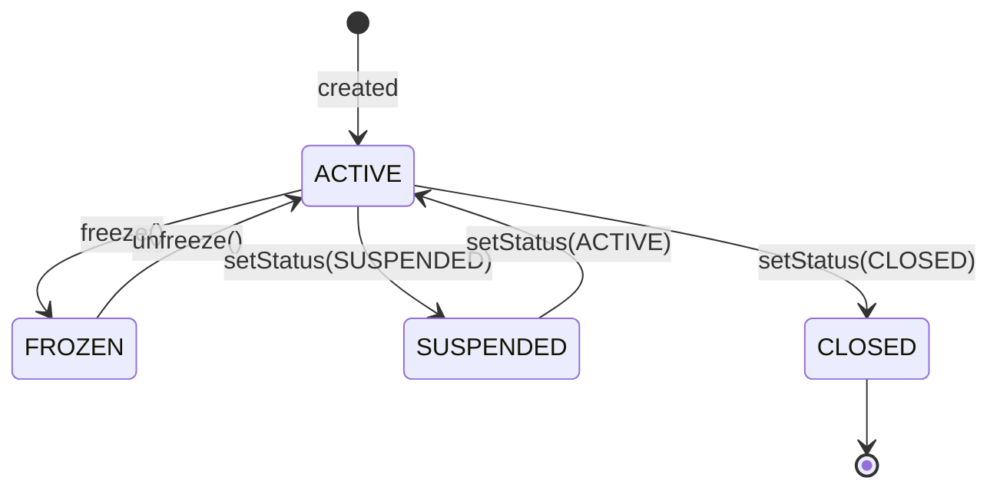

### 8.2 Status gates on operations

| Operation | Requires status |
| --- | --- |
| `credit` / `debit` | `ACTIVE` (else `ConflictException`) |
| `reserve` / `commit` / `release` | operates on the wallet (status enforced on the available-delta paths) |
| `freeze` / `unfreeze` / `setStatus` | admin |

Freezing a wallet is the immediate operational control: `applyAvailableDelta` checks `wallet.status !== WalletStatus.ACTIVE` and throws `Wallet is frozen` (etc.), so no credit/debit can proceed while frozen. On any status change the balance cache key is deleted so reads reflect the new status.

### 8.3 Balance component invariant

The wallet's balance components obey `total = available + locked + pending` at all times. The state machine of *components* is driven by the `Balance` operations:

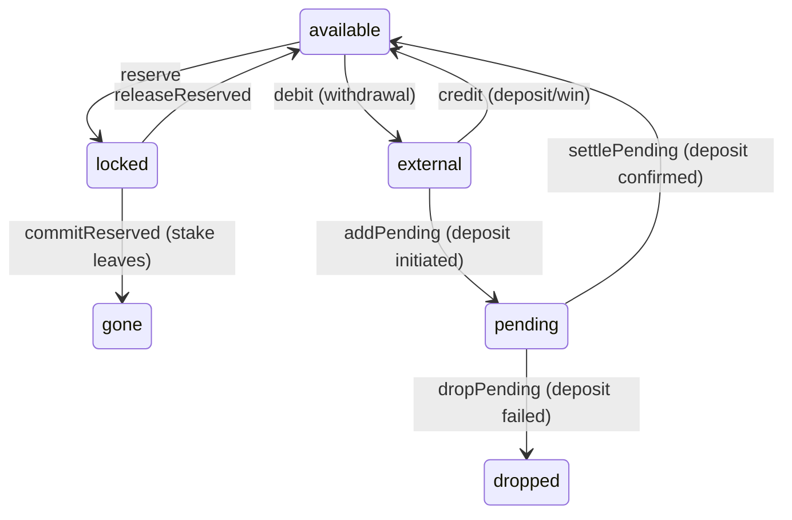

---

## 9. Reservation Flow

A reservation locks a stake before a bet plays out, moving value from `available` to `locked` and recording a `LockedFunds` row.

### 9.1 The reservation state machine

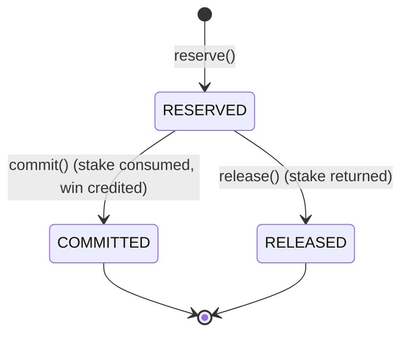

`RESERVATION_TRANSITIONS` allows `RESERVED → COMMITTED | RELEASED`; both targets are terminal, so a reservation is committed or released **exactly once**. `ReservationState.assert` throws on any other transition — you cannot commit an already-released reservation, or release a committed one. See [ADR-005](#27-architecture-decision-records).

### 9.2 Reserve — the engine primitive

`WalletEngineService.reserve(userId, currencyId, amount, reference, idempotencyKey)`:

```mermaid
sequenceDiagram
    autonumber
    participant CALL as Caller (bridge)
    participant WE as WalletEngineService
    participant BAL as Balance (core)
    participant DB as Postgres (tx)
    CALL->>WE: reserve(user, currency, amount, ref)
    WE->>WE: assertPositive(amount); acquire Redis lock; open Serializable tx
    WE->>DB: SELECT wallet FOR UPDATE (lockWalletRow)
    alt idempotent replay
        WE-->>CALL: return existing reservation
    else new
        WE->>BAL: Balance.reserve(state, amount) (available→locked)
        WE->>DB: writeBalance (version check)
        WE->>DB: INSERT LockedFunds (status LOCKED, reason=ref)
        WE->>DB: recordTxn(RESERVE, status RESERVED)
        WE-->>CALL: { reservationId, wallet }
    end
```

The reservation records a `LockedFunds` row (`status: LOCKED`, `reason: reference`) and a `RESERVE` transaction with status `RESERVED`. The balance moves `available -= stake`, `locked += stake`, `total` unchanged (a component transfer, not a value change).

### 9.2.1 The release path — cancelling an unplayed bet

Not every reservation commits; a round can be cancelled before it settles (a disconnect, a timeout, a void). `releaseReservation` returns the locked stake to available:

| Step | available | locked | LockedFunds | Transaction |
| --- | --- | --- | --- | --- |
| After reserve 100 | 400 | 100 | LOCKED | RESERVE (RESERVED) |
| After release | 500 | 0 | RELEASED | RESERVE_RELEASE (CANCELLED) |

The release is a pure component transfer (`locked → available`) — no money enters or leaves the wallet, `total` is unchanged, and no house journal is posted (nothing was won or lost). The `LockedFunds` row transitions LOCKED → RELEASED, and a `RESERVE_RELEASE` transaction records the cancellation. This is why the reservation model matters: a stake is *held*, not *spent*, until the round commits, so cancelling is a clean, lossless reversal. A crashed round that never commits leaves a stale `LOCKED` row that reconciliation can detect and release ([§20.4](#204-orphan-detection)).

### 9.2.2 Why reserve-then-commit instead of debit-then-credit

A naïve design would debit the stake when the bet is placed and credit the winnings when it resolves. The reserve model is better for three reasons: (1) **the funds are visibly held** — a player (and the platform) can see `locked` funds distinct from `available`, so the money isn't ambiguously "gone" mid-round; (2) **cancellation is lossless** — releasing a reservation is a clean transfer back, whereas reversing a debit requires a compensating credit; and (3) **it models reality** — a placed bet is a commitment of funds, not yet a loss, and the balance components express exactly that. The reserve→commit lifecycle is the financial-industry pattern for held funds (an authorization hold on a card is the same idea). See [ADR-016](#27-architecture-decision-records).

### 9.3 The ReservationService & SettlementService facades

`ReservationService` is a thin, typed facade over the engine's reservation primitives (`reserve`, `commit`, `release`). `SettlementService` drives the canonical game flow on top of it: `reserveStake`, `settle` (commit), `cancel` (release), and `rollback`. Their docstrings name the flow: *"reserve → (play) → commit (stake consumed, winnings credited), or release on cancellation, or rollback on correction."* Games never call the engine directly — they go through the bridge → settlement → reservation → engine chain.

---

## 10. Settlement Flow

Settlement is the **commit** of a reservation: the stake is consumed (leaves the player toward the house) and any winnings are credited (flow house toward the player), atomically, with a double-entry journal for each leg.

### 10.1 The settlement sequence

```mermaid
sequenceDiagram
    autonumber
    participant BR as WalletBridge
    participant WE as WalletEngineService
    participant BAL as Balance (core)
    participant SA as SystemAccount (house)
    participant DB as Postgres (tx)
    BR->>WE: commitReservation(reservationId, winAmount, ref)
    WE->>DB: find LockedFunds; lock wallet row
    alt already resolved
        WE-->>BR: idempotent — return existing bet txn
    else LOCKED
        WE->>BAL: commitReserved(state, stake) (locked -= stake)
        opt win > 0
            WE->>BAL: credit(state, win) (available += win)
        end
        WE->>DB: writeBalance (version check)
        WE->>DB: LockedFunds → RELEASED
        WE->>SA: houseWallet(currency)
        WE->>DB: recordTxn(GAME_BET, SETTLED) + postJournal(player DEBIT / house CREDIT)
        opt win > 0
            WE->>DB: recordTxn(GAME_WIN, SETTLED) + postJournal(house DEBIT / player CREDIT)
        end
        WE-->>BR: { transactionId, reference:ref:bet, wallet }
    end
```

### 10.2 The two legs of a settled round

A settled round posts up to **two** balanced journals:

| Leg | Transaction | Journal (player / house) | Balance effect |
| --- | --- | --- | --- |
| **Bet** | `GAME_BET` (SETTLED), ref `<ref>:bet` | player DEBIT stake / house CREDIT stake | `locked -= stake` |
| **Win** (if > 0) | `GAME_WIN` (SETTLED), ref `<ref>:win` | house DEBIT win / player CREDIT win | `available += win` |

The stake flows player → house; the win flows house → player. Namespacing the references (`<ref>:bet`, `<ref>:win`) makes each leg independently idempotent and traceable. A losing round posts only the bet leg; a winning round posts both. Net exposure to the house is `stake − win`.

### 10.3 Idempotent settlement

If the reservation is already resolved (not `LOCKED`), `commitReservation` is **idempotent**: it looks up the existing `<ref>:bet` transaction and returns it rather than settling again. This makes a retried settlement safe — a double-submitted commit cannot double-charge or double-pay. See [§15](#15-idempotency).

### 10.3.1 A worked settlement — numbers

Trace a concrete winning round. A player with `available = 500` bets `100` and wins `250` (a 2.5× multiplier). Follow the balances and the ledger:

| Step | available | locked | house (system) | Journal posted |
| --- | --- | --- | --- | --- |
| Start | 500 | 0 | H | — |
| Reserve 100 | 400 | 100 | H | RESERVE txn; LockedFunds LOCKED |
| Commit — bet leg | 400 | 0 | H+100 | player DEBIT 100 / house CREDIT 100 (`GAME_BET`) |
| Commit — win leg | 650 | 0 | H+100−250 = H−150 | house DEBIT 250 / player CREDIT 250 (`GAME_WIN`) |
| End | **650** | 0 | H−150 | — |

The player's net is `+150` (won 250, staked 100); the house's net is `−150` (the mirror). Both journals balance (100=100, 250=250), and the global sum is conserved: the player gained exactly what the house lost. Note the intermediate state after the bet leg — the stake has left the player (`locked` cleared, house credited) *before* the win is credited — but because both legs are in **one transaction**, no observer ever sees the partial state. A losing round would stop after the bet leg: `available` stays at 400, house keeps `+100`.

### 10.3.2 Why capture `balanceBefore`/`balanceAfter`

Each `WalletTransaction` snapshots `balanceBefore` and `balanceAfter`. In the example, the `GAME_BET` transaction records the total balance before and after that leg. This makes every transaction **self-auditing**: you can verify a transaction's effect in isolation (`balanceAfter − balanceBefore` should equal the signed amount) without replaying the whole history, and a discrepancy in a single row is immediately localizable. It is also what lets the `rollback` operation determine the original direction (`balanceAfter < balanceBefore` ⇒ it was a debit) to post the correct reversal.

### 10.4 Stateless settlement — `settleImmediate`

For stateless games (dice, roulette, card) where the bet and result occur together, the bridge's `settleImmediate` reserves and commits in **one step** — still fully ledgered. It reserves the stake (`<ref>:rsv` idempotency), then settles, so even instant games post the same double-entry journals as multi-step games. There is no "fast path" that skips the ledger. See [§21.2](#212-stateful-vs-stateless-settlement).

---

## 11. Double-Entry Ledger

The double-entry ledger is the mechanism that makes the money **provably correct**. Every value movement is recorded as two equal-and-opposite entries.

### 11.1 The principle

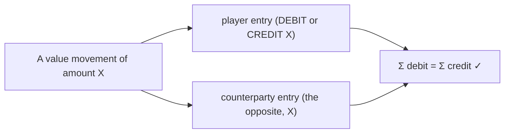

The `Ledger` builder's docstring states it: *"Every balance movement is recorded as two equal-and-opposite entries (player ↔ counterparty) so the books always balance: Σ debits = Σ credits. The builder enforces this invariant."* `assertBalanced` throws if debits ≠ credits, so an unbalanced journal cannot be posted.

### 11.2 The backend posting

`WalletEngineService.postJournal` creates a `Ledger` row (reference `ldg-<ref>`, status `POSTED`, linked to the `WalletTransaction`) with **two** `LedgerEntry` rows: the player wallet with `playerDirection` and the house wallet with the opposite direction, both `POSTED`, same currency and amount. The counterparty is resolved by `SystemAccountService.houseWallet(currencyId)` ([§16](#16-house-wallet)).

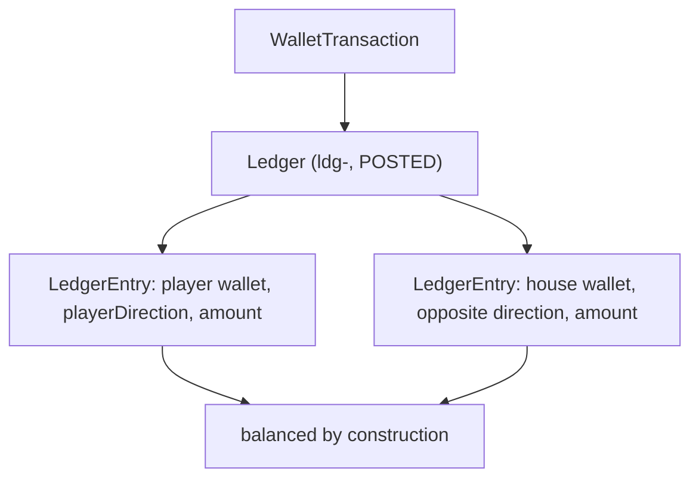

### 11.3 Global conservation

Because every movement posts a balanced pair, the sum of all accounts is invariant. The reference `WalletLedgerEngine` proves it: `isConserved()` checks that `Σ player totals + Σ system accounts === 0`, and `open`/`credit`/`debit` mirror external money against a signed `__external__` account so even deposits and withdrawals conserve. This is the mathematical statement of solvency: **money is neither created nor destroyed, only moved.** See [ADR-006](#27-architecture-decision-records).

### 11.3.1 A worked conservation proof

The reference `WalletLedgerEngine` makes conservation checkable. Follow a short session and watch the global net stay at exactly zero:

| Operation | Player A | Player B | `__house__` | `__external__` | Σ |
| --- | --- | --- | --- | --- | --- |
| A deposits 1000 | 1000 | 0 | 0 | −1000 | 0 |
| B deposits 500 | 1000 | 500 | 0 | −1500 | 0 |
| A bets 200, loses | 800 | 500 | +200 | −1500 | 0 |
| B bets 100, wins 300 | 800 | 700 | +200−300 = −100 | −1500 | 0 |
| A withdraws 300 | 500 | 700 | −100 | −1200 | 0 |

At every step, `Σ player balances + Σ system accounts = 0`. Deposits pull from `__external__` (the outside world), bets move value to/from `__house__`, and withdrawals push back to `__external__`. `isConserved()` returns `true` after each operation because every movement posted a balanced journal. This is not a coincidence to be tested occasionally — it is a **structural consequence** of double-entry posting, and the property tests assert it holds for *arbitrary* sequences. If a code change ever broke conservation, a property test would fail immediately with the exact sequence that broke it.

### 11.3.2 The external account — modeling the outside world

The `__external__` system account is subtle but important: it represents money **outside** the platform (a player's bank/card). When a player deposits, money enters the platform from `__external__` (which goes negative); when they withdraw, it returns. Modeling the outside world as a signed account is what lets deposits and withdrawals **also** conserve — without it, a deposit would appear to create money from nowhere. With it, a deposit is a transfer from `__external__` to the player, and the global sum stays zero. This completeness is why the reference engine can prove solvency across the full money lifecycle, not just the gaming loop.

### 11.4 Player wallets vs. system accounts

| Account kind | Sign constraint | Examples |
| --- | --- | --- |
| **Player wallet** | Non-negative (via `Balance`) | user MAIN/BONUS/etc. |
| **System account** | Signed (can be negative) | `__house__`, `__external__` (reference engine); house `CASH` wallet (backend) |

Player wallets can never go negative — that would be an overdraft. System accounts are *signed* because they represent the platform's net position (the house holds negative liability against players' positive balances). This asymmetry is deliberate and correct: a player's balance is a real asset that must stay ≥ 0, while the house account is a bookkeeping counterparty.

---

## 12. Ledger Entries

### 12.1 Ledger direction

`LedgerDirection` is `DEBIT | CREDIT`. In this model, from the **player's** perspective:

| Direction | Player-side meaning |
| --- | --- |
| `DEBIT` | funds leave the player wallet (bet stake, withdrawal, transfer-out) |
| `CREDIT` | funds enter the player wallet (win, deposit, refund, transfer-in) |

The counterparty (house/external) always receives the **opposite** direction, so the journal nets to zero.

### 12.2 Transaction-type direction map

`wallet-core/types.ts` declares `TRANSACTION_DIRECTION`, mapping each of the 21 transaction type codes to its player-side direction:

| CREDIT (funds enter player) | DEBIT (funds leave player) |
| --- | --- |
| DEPOSIT, GAME_WIN, REFUND, ROLLBACK, ADJUSTMENT, BONUS_CREDIT, REFERRAL_REWARD, TOURNAMENT_PRIZE, CASHBACK, PROMOTION_REWARD, ADMIN_ADJUSTMENT, TRANSFER_IN, UNLOCK, RESERVE_RELEASE | WITHDRAWAL, GAME_BET, BONUS_DEBIT, PENALTY, TRANSFER_OUT, LOCK, RESERVE |

This map is the single source of truth for "does this transaction add to or subtract from the player's available balance," used to build the correct journal direction for each type.

### 12.3 Ledger entry statuses

`LedgerEntry.status` and `Ledger.status` use `LedgerEntryStatus` (`PENDING | POSTED | REVERSED`). The engine posts entries as `POSTED` immediately (they are settled in the same transaction as the balance write). `REVERSED` is used for corrections. See [Database §12](./DATABASE_ARCHITECTURE.md#12-wallet-schema).

### 12.3.1 The ledger entry account taxonomy

A `LedgerEntryDraft` names its `account` as one of `player | house | external | bonus | reward | locked`. This taxonomy classifies *what kind* of account each side of a journal touches, which matters for reporting and reconciliation:

| Account | Represents | Sign |
| --- | --- | --- |
| `player` | A user's real wallet | non-negative |
| `house` | The platform's gaming counterparty | signed |
| `external` | The outside world (banks/cards) | signed |
| `bonus` | Promotional balance | non-negative |
| `reward` | Loyalty points | non-negative |
| `locked` | Reserved funds | non-negative |

In the backend's `postJournal`, the two entries are the player wallet and the house wallet, both concrete `LedgerEntry` rows referencing real wallet ids. The `account` taxonomy in the pure core lets the reference engine reason about *categories* of accounts (e.g. "all player balances must be non-negative; system accounts may be signed") independent of concrete wallet ids. This separation — logical account category versus physical wallet row — is what lets the same double-entry algebra serve both the in-memory proof and the persistent implementation.

### 12.4 Reading the ledger — `WalletLedgerService`

| Method | Purpose |
| --- | --- |
| `entriesForWallet(walletId, limit)` | a wallet's ledger entries (newest first) |
| `recentLedgers(limit)` | recent journals with entries |
| `reconcile()` | the trial balance (see [§19.3](#193-reconciliation--the-trial-balance)) |

---

## 13. Transaction Lifecycle

Every balance movement produces a `WalletTransaction` whose status follows a strict state machine.

### 13.1 The transaction states

`TransactionStatusCode` has ten values; `FINAL_STATUSES` are terminal:

| Status | Terminal? | Meaning |
| --- | --- | --- |
| `PENDING` | no | Initiated |
| `RESERVED` | no | Stake reserved (bet placed, not settled) |
| `PROCESSING` | no | In progress |
| `COMPLETED` | **yes** | Done (credit/debit/transfer) |
| `SETTLED` | **yes** | Game round settled |
| `FAILED` | **yes** | Failed |
| `CANCELLED` | **yes** | Cancelled |
| `EXPIRED` | **yes** | Expired |
| `REVERSED` | **yes** | Reversed by a rollback |
| `REFUNDED` | **yes** | Refunded |

### 13.2 The transaction state machine

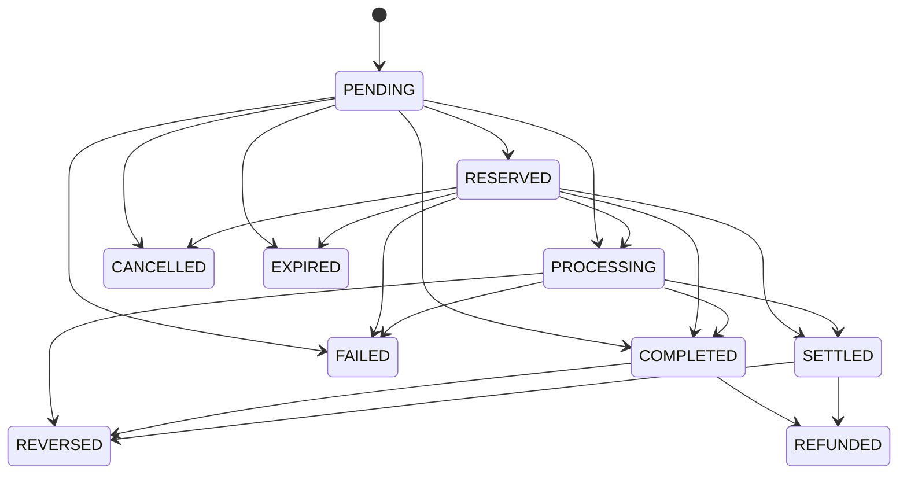

`Lifecycle.transition(from, to)` throws `LifecycleError` on any move not in `TRANSITIONS`. This *"prevents illegal settlements (e.g. committing an already-reversed transaction) and double-processing."* A `COMPLETED` or `SETTLED` transaction can only move to `REVERSED`/`REFUNDED` (corrections); `FAILED`/`CANCELLED`/`EXPIRED`/`REVERSED`/`REFUNDED` are dead-ends. See [ADR-007](#27-architecture-decision-records).

### 13.3 Transaction records

Each `WalletTransaction` captures `reference` (unique), `idempotencyKey` (unique, optional), `amount`, `balanceBefore`, `balanceAfter`, `type` (a `TransactionType` code), `status` (a `TransactionStatus` code), `description`, and optional `metadata`/`relatedTransactionId`. `balanceBefore`/`balanceAfter` are snapshotted for audit, so each transaction is a self-describing record of the balance change it caused. `recordTxn` is the single writer; `WalletTransactionService` is read-only history.

### 13.3.1 A bet's transaction lifecycle

Following the `WalletTransaction` records a single real-money bet produces shows the state machine in action:

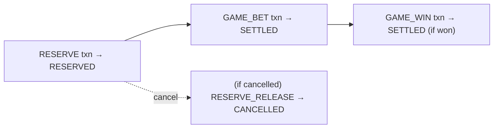

A reserved bet creates a `RESERVE` transaction in status `RESERVED`. On settlement, a `GAME_BET` transaction is created directly in `SETTLED` (the round is resolved atomically, so it doesn't pass through intermediate states), and a `GAME_WIN` in `SETTLED` if there were winnings. If instead the round is cancelled, a `RESERVE_RELEASE` transaction in `CANCELLED` records it. Each transaction is a distinct, immutable row — the bet isn't one row that changes status, but a sequence of records that together tell the round's financial story. This append-only sequence is what makes the ledger auditable: you can reconstruct exactly what happened to any bet by reading its transactions in order.

### 13.4 Lookup-table codes

`TransactionType` and `TransactionStatus` are lookup tables, not enums, so codes are operationally extensible. `ensureType`/`ensureStatus` upsert them on first use (caching the ids), so a new transaction type is a seeded row, not a migration ([Database ADR-014](./DATABASE_ARCHITECTURE.md#24-architecture-decision-records)).

---

## 14. Concurrency Model

Concurrent balance writes are the single greatest threat to financial correctness. The engine defends against them with **four independent layers** — the same four named in [Backend §12.4](./BACKEND_ARCHITECTURE.md#124-concurrency-the-four-layers), documented here from the wallet's perspective.

### 14.1 The four layers

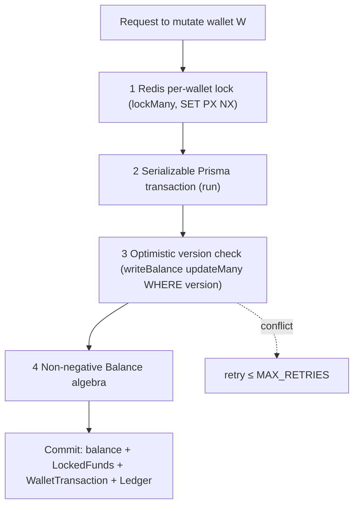

| Layer | Mechanism | Guarantees |
| --- | --- | --- |
| **1. Redis lock** | `lockMany` acquires `wallet:lock:<id>` via `SET key token PX <ttl> NX` (up to 50 attempts, 20ms apart) | Serializes concurrent mutations of the same wallet(s) |
| **2. Serializable tx** | `run()` wraps the body in `$transaction(fn, { isolationLevel: Serializable })` | DB-level isolation |
| **3. Optimistic version** | `writeBalance` does `updateMany WHERE walletId AND version = expected`, throwing if `count === 0` | A stale write hits zero rows → conflict |
| **4. Non-negative algebra** | `Balance` rejects any negative result | No overdraft, ever |

### 14.2 Ordered lock acquisition (deadlock avoidance)

`lockMany` sorts the wallet ids before acquiring locks (`[...new Set(walletIds)].sort()`) and releases them in reverse order in a `finally`. **Why sort:** a transfer touches two wallets; if two concurrent transfers acquired their two locks in opposite orders, they could deadlock. Acquiring locks in a **global order** (sorted ids) makes deadlock impossible — a classic lock-ordering discipline. The lock is token-based (`releaseLock` only deletes the key if the stored token matches), so a lock can't be released by a different holder. See [ADR-008](#27-architecture-decision-records).

### 14.3 Bounded optimistic retry

`run()` retries the transaction up to `MAX_RETRIES` on a **retryable** error: a `ConflictException` (version conflict), or Prisma `P2034` (write conflict / deadlock) or `P2002` (unique-constraint race). After exhausting retries it throws `ConflictException('Wallet operation failed after contention retries')`. This means a version conflict under contention is **transparently retried** — the caller sees a success, not an error, unless contention is pathological.

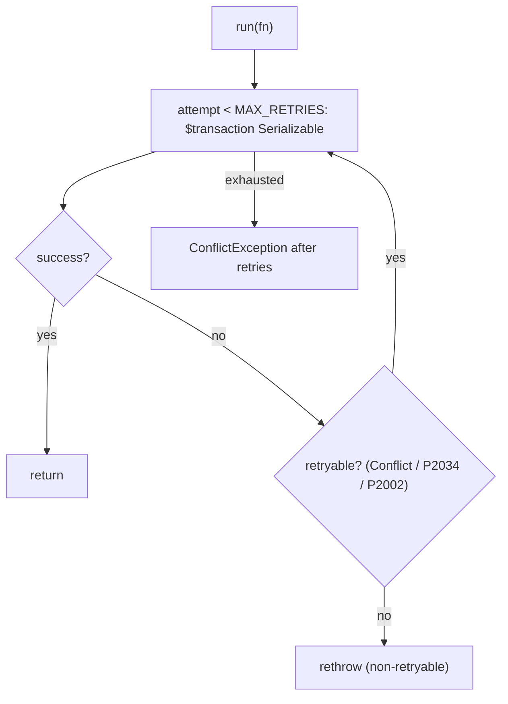

### 14.3.1 A worked concurrency scenario

Consider two requests hitting the **same wallet** simultaneously — a bet settlement and an admin credit. Follow how the four layers serialize them:

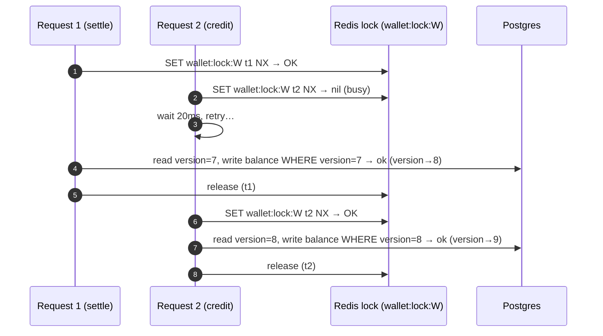

Request 2 waits on the Redis lock while Request 1 completes, then proceeds against the **already-updated** balance (version 8). The two mutations serialize cleanly, and the final balance reflects both. Now suppose the Redis lock had lapsed at its TTL and both requests entered the DB transaction concurrently: Request 1 writes `WHERE version = 7` (succeeds, version→8); Request 2 also read version 7 and writes `WHERE version = 7` — but that row is now version 8, so `updateMany` matches **zero rows**, the engine throws a version conflict, and `run()` **retries** Request 2, which re-reads version 8 and succeeds. Either way — lock held or lock lapsed — the outcome is correct. That is what "defense in depth" buys: the version check is a safety net under the lock, not a redundancy.

### 14.4 Why four layers and not one

Each layer covers a case the others might miss, so the system is correct even if one fails:

- The **Redis lock** is fast and prevents most contention, but if Redis blips or a lock lapses at TTL, the **version check** still catches a concurrent write.
- The **Serializable transaction** prevents phantom/anomaly reads at the DB, but the **version check** is a cheaper, explicit optimistic guard on the exact row.
- The **non-negative algebra** is the last line: even if every concurrency guard failed, an overdraft would still throw rather than persist a negative balance.

This is defense in depth for money — the belt-and-suspenders philosophy applied to the most safety-critical writes in the platform.

---

## 15. Idempotency

Idempotency makes retries safe — essential because clients retry, networks duplicate, and queues deliver at-least-once.

### 15.1 The mechanism

Money operations accept an `idempotencyKey`. Before mutating, the engine calls `replay(tx, idempotencyKey)` — a lookup on the unique `WalletTransaction.idempotencyKey`. If a transaction with that key exists, the engine returns the **original result** (`movementFrom`) instead of applying the mutation again.

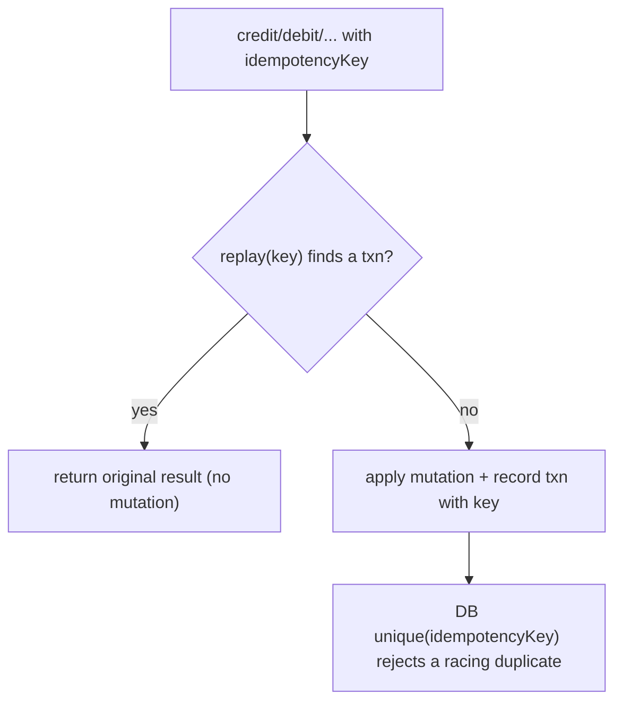

### 15.2 Two layers of idempotency protection

| Layer | Mechanism |
| --- | --- |
| **Application** | `replay()` returns the original result for a known key |
| **Database** | `WalletTransaction.idempotencyKey @unique` + `reference @unique` reject a duplicate even under a race |

Even if two identical requests raced past the application check simultaneously, the **unique constraint** would reject the second insert (a `P2002`, which `run()` treats as retryable → the retry finds the now-existing transaction and returns it). So double-application is *structurally* impossible, not merely usually-prevented. See [ADR-009](#27-architecture-decision-records).

### 15.2.1 A worked idempotency scenario

A flaky network causes a client to submit the same $50 deposit twice with idempotency key `dep-abc`:

```mermaid
sequenceDiagram
    autonumber
    participant C as Client
    participant WE as WalletEngineService
    participant DB as Postgres
    C->>WE: credit(50, key=dep-abc) [request 1]
    WE->>DB: replay(dep-abc)? none
    WE->>DB: credit balance +50; INSERT txn(idempotencyKey=dep-abc)
    WE-->>C: { balance: 550 }
    Note over C,WE: client times out, retries
    C->>WE: credit(50, key=dep-abc) [request 2]
    WE->>DB: replay(dep-abc)? found txn
    WE-->>C: { balance: 550 } (original result, no mutation)
```

The second request finds the existing transaction via `replay(dep-abc)` and returns the **original** result — the balance stays at 550, credited once. If both requests had raced *simultaneously* past the replay check, the unique constraint on `idempotencyKey` would reject the second `INSERT` (a `P2002`), which `run()` treats as retryable; the retry then finds the now-committed transaction and returns it. Either timing yields exactly-once semantics. This is why every retryable money operation **must** carry an idempotency key — it is the difference between "usually credited once" and "provably credited once."

### 15.3 Reference namespacing

Settlement namespaces its references and keys per leg (`<ref>:bet`, `<ref>:win`, `<ref>:release`, `<ref>:rsv`), so each leg of a round is independently idempotent. A replayed settleImmediate reserves with `<key>:rsv` and settles with `<key>`, so neither leg double-applies. Bonus conversion uses `bonus-convert:<bonusWalletId>` as its key, so converting the same bonus twice is a no-op.

---

## 16. House Wallet

Every double-entry journal needs a counterparty. The platform's counterparty is the **house** — a per-currency system wallet.

### 16.1 The system account service

`SystemAccountService` resolves the house wallets: *"player movements are mirrored against a per-currency house wallet owned by a single system user. The system user and its wallets are created lazily and cached."*

```mermaid
flowchart TD
    NEED["postJournal needs a counterparty"] --> HW["SystemAccountService.houseWallet(currencyId)"]
    HW --> CACHE{"cached?"}
    CACHE -->|yes| RET["return cached wallet id"]
    CACHE -->|no| USER["systemUser() — upsert house@system.local"]
    USER --> UPSERT["upsert Wallet {system user, currency, type CASH} + zero balance"]
    UPSERT --> RET
```

### 16.2 How the house is modeled

| Aspect | Value |
| --- | --- |
| System user | `house@system.local` / `house_account` (upserted, ACTIVE, verified) |
| House wallet type | `CASH` |
| Per currency | One house wallet per currency (unique `[systemUser, currency, CASH]`) |
| Caching | System user id + per-currency house wallet id cached in memory |

### 16.3 Why a per-currency house wallet

Each currency needs its own counterparty because journals are single-currency (`Σ debit = Σ credit` in *one* currency). A single global house wallet would mix currencies. Modeling the house as ordinary `Wallet` rows (type `CASH`, owned by a system user) means the house's position is queryable with the same tools as any player's, and every player bet has a real, balanced counterparty entry. The house wallet's balance is the platform's net gaming position in that currency. See [ADR-010](#27-architecture-decision-records).

### 16.3.1 The house wallet as a GGR accumulator — worked

Because every bet credits the house and every win debits it, the house wallet's balance *is* the running gross gaming revenue. Watch it accumulate over three rounds (currency USD):

| Round | Player action | House CREDIT (bet) | House DEBIT (win) | House balance |
| --- | --- | --- | --- | --- |
| 1 | bets 100, loses | +100 | 0 | 100 |
| 2 | bets 100, wins 180 | +100 | −180 | 20 |
| 3 | bets 100, loses | +100 | 0 | 120 |

After three rounds of 100 staked each (300 turnover) with one 180 win, the house holds `120` — exactly `bets(300) − wins(180)`, the GGR. The reporting `overview` computes the same `120` by summing `GAME_BET` and `GAME_WIN` transactions. **The house wallet and the revenue report are the same number viewed two ways** — one as a live balance, one as an aggregate — and they reconcile by construction. This is the elegance of modeling the house as a real wallet: solvency, revenue, and reconciliation all fall out of the same double-entry postings.

### 16.4 The house in reporting

Because the stake flows player → house on a bet and house → player on a win, the house wallet's net movement over a window *is* the gross gaming revenue (GGR). Reporting derives GGR from transaction sums (`bets − wins`, [§19.1](#191-the-gaming-overview-report)), which reconciles with the house wallet's ledger position.

---

## 17. Bonus & Reward Wallets

Beyond the main cash wallet, the platform manages promotional **bonus** balances and loyalty **reward** points, each with its own service and rules.

### 17.1 Bonus wallets

`BonusWalletService` manages promotional credit with wagering requirements: *"granting promotional credit, tracking wagering progress and converting cleared bonuses into real, withdrawable funds via the engine (never by direct balance writes)."*

| Method | Effect |
| --- | --- |
| `list(userId)` | active bonus wallets |
| `grant({...})` | create a `BonusWallet` (balance, `wageringRequirement`, `sourcePromotionId`, `expiresAt`) |
| `addWagering(id, amount)` | increment `wageringProgress` |
| `convert(userId, id)` | if fully wagered, close the bonus and **credit the main wallet via the engine** |

```mermaid
stateDiagram-v2
    [*] --> Granted: grant (balance, wageringRequirement)
    Granted --> Wagering: addWagering (progress += amount)
    Wagering --> Wagering: more play
    Wagering --> Convertible: progress ≥ requirement
    Convertible --> Converted: convert → engine.credit(MAIN, BONUS_CREDIT)
    Converted --> [*]
```

**The critical rule:** `convert` never writes a balance directly — it calls `engine.credit(userId, currency, { amount, typeCode: 'BONUS_CREDIT', idempotencyKey: 'bonus-convert:<id>' }, MAIN)`. The wagering guard (`wageringProgress ≥ wageringRequirement`) is enforced before conversion, and the idempotency key prevents double-conversion. This is why bonus liability always flows through the audited money path. See [Database §12](./DATABASE_ARCHITECTURE.md#12-wallet-schema).

### 17.2 Reward wallets

`RewardWalletService` manages loyalty points — a single reward wallet per user with a points balance and a tier multiplier:

| Method | Effect |
| --- | --- |
| `get(userId)` | get-or-create the reward wallet |
| `earn(userId, points)` | credit `points × tierMultiplier` |
| `redeem(userId, points)` | debit points (guarded by sufficient balance) |

Reward points use `Decimal(38,8)` (points precision) with a `tierMultiplier` (`Decimal(10,4)`). `earn` scales points by the tier multiplier via `Money.mul`, so a higher-tier player earns more per unit of play. Points are a separate economy from cash — they don't post to the cash ledger — but use the same exact-arithmetic `Money` primitives.

### 17.3 Why bonus/reward are separate from the cash ledger

Bonus and reward balances have different rules (wagering requirements, expiry, tier multipliers, non-withdrawable until cleared) and must not be conflated with withdrawable cash. Modeling them as separate wallets/tables keeps the cash ledger clean and the promotional liability explicitly tracked. The *only* bridge to real money is the audited `convert` path, so a bonus can become cash only after its wagering is met, through the engine.

---

## 18. Currency Handling

### 18.1 Exact decimal money

All money is `Decimal(38,18)` at rest and `bigint` fixed-point (18 dp) in the `Money` core. The scale (`MONEY_SCALE = 18`) matches the database columns exactly, so there is no precision loss crossing the boundary. 18 fractional digits accommodate any fiat (2 dp) and crypto sub-units (up to 18 dp), and 20 integer digits accommodate any realistic amount. See [Database §7.2](./DATABASE_ARCHITECTURE.md#72-why-uuidv7-the-decisive-trade-off) and [Database §2](./DATABASE_ARCHITECTURE.md#2-technology-stack).

### 18.2 One wallet, one currency

A `Wallet` is bound to a single `Currency` (`currencyId`), and a journal is single-currency (both entries share the currency). This keeps `Σ debit = Σ credit` meaningful — you cannot balance a debit in USD against a credit in BTC. A user holds separate wallets per currency (and per type), and the balance summary aggregates `totalsByCurrency` without converting.

### 18.3 The currency master & house wallets

`Currency` (`code`, `symbol`, `type` FIAT/CRYPTO/VIRTUAL, `decimals`, `isActive`) is the master table. Each currency gets its own house wallet ([§16](#16-house-wallet)). Adding a currency is a seeded row — no migration — because currencies are a lookup table ([Database ADR-014](./DATABASE_ARCHITECTURE.md#24-architecture-decision-records)).

### 18.4 FX is out of band

Exchange rates exist (`ExchangeRate`, time-bounded) but the wallet engine does **not** convert at settlement — a bet settles in its wallet's currency. Cross-currency conversion would be a separate, explicit transfer with its own transaction, keeping each journal single-currency and the ledger unambiguous. See [§1.5](#15-non-goals).

---

## 19. Reporting & Reconciliation

All financial reporting derives from the **immutable transaction ledger**, never recomputed from game state — so reports always reconcile with the books.

### 19.1 The gaming overview report

`WalletReportingService.overview(sinceHours = 24)` sums transactions by type over a trailing window:

| Figure | Derivation |
| --- | --- |
| `bets` | Σ `GAME_BET` |
| `wins` | Σ `GAME_WIN` |
| `deposits` / `withdrawals` | Σ `DEPOSIT` / Σ `WITHDRAWAL` |
| `bonuses` | Σ `BONUS_CREDIT` |
| `houseProfit` (GGR) | `bets − wins` |
| `playerProfit` | `wins − bets` |
| `rtp` | `wins / bets × 100` (%) |
| `cashFlow` | `deposits − withdrawals` |

`sumByType` aggregates `WalletTransaction.amount` for a type code over the window. **Why derive from transactions:** *"All figures come from posted WalletTransaction rows grouped by type — never recomputed from game state — so reports always reconcile with the ledger."* GGR from reporting equals the house wallet's net ledger movement, by construction.

### 19.1.1 A worked report

Suppose over 24 hours the platform records: `bets = 100,000`, `wins = 96,000`, `deposits = 40,000`, `withdrawals = 25,000`, `bonuses = 5,000`. The overview derives:

| Figure | Computation | Value |
| --- | --- | --- |
| houseProfit (GGR) | 100,000 − 96,000 | **4,000** |
| playerProfit | 96,000 − 100,000 | −4,000 |
| RTP | 96,000 / 100,000 × 100 | **96.00%** |
| cashFlow | 40,000 − 25,000 | 15,000 |

The GGR of 4,000 is the house's take — and it **equals** the net movement of the house wallet's ledger over the window, because every bet credited the house and every win debited it. This equality is the practical payoff of deriving reports from the ledger rather than from game state: the revenue report and the house wallet's balance are two views of the *same* postings, so they can never disagree. An RTP of 96% means the game returned 96% of stakes to players — a headline regulatory and business metric, computed directly from the immutable transaction sums.

### 19.2 Wallet statistics

`walletStatistics()` aggregates all `WalletBalance` rows: total wallet count and the sum of `available`, `locked`, `pending`, and `total` across the platform — the aggregate money-under-management.

### 19.3 Reconciliation — the trial balance

`WalletLedgerService.reconcile()` runs the **trial balance**: it groups `LedgerEntry` by `direction` (summing `amount` where `status = POSTED`) and checks `Money.eq(debit, credit)`:

```mermaid
flowchart TD
    REC["reconcile()"] --> GROUP["GROUP BY direction, SUM(amount) WHERE status=POSTED"]
    GROUP --> DEB["debit total"]
    GROUP --> CRED["credit total"]
    DEB & CRED --> EQ{"Money.eq(debit, credit)?"}
    EQ -->|yes| BAL["balanced: true, difference: 0"]
    EQ -->|no| UNBAL["balanced: false, difference: debit − credit"]
```

The result is `{ debit, credit, balanced, difference }`. Because every journal is balanced when posted ([§11](#11-double-entry-ledger)), `balanced` should **always** be true; a `false` is a critical money-integrity alarm. The platform's alert model has a `wallet-inconsistency` rule at threshold **0** ([Backend §15.3](./BACKEND_ARCHITECTURE.md#153-alerting)) — a single ledger imbalance pages someone. This turns "is the money correct?" into a query. See [ADR-011](#27-architecture-decision-records).

### 19.3.1 What a reconciliation failure would mean

Because every journal is balanced at posting time, `reconcile()` returning `balanced: false` is not a routine data-quality issue — it is a **five-alarm event**. It would mean either a bug posted an unbalanced journal (which the `Ledger.assertBalanced` guard should have prevented), or ledger rows were mutated outside the engine (which the single-path guarantee should prevent), or storage corruption. Any of these implies the platform's money can no longer be trusted, which is why the `wallet-inconsistency` alert fires at threshold **0** ([Backend §15.3](./BACKEND_ARCHITECTURE.md#153-alerting)) — not at a tolerance band. The correct operational response is to **halt settlement**, investigate the offending journals (findable by comparing per-ledger debit/credit sums), and reconcile before resuming. The `difference` field (`debit − credit`) localizes the magnitude of the discrepancy. In a correctly-functioning system this alert never fires; its value is that if the impossible happens, it is caught immediately rather than compounding silently. This is the difference between a system that is *probably* correct and one that *continuously proves* it is.

### 19.4 Admin reporting endpoints

`AdminWalletController` exposes the reporting/reconciliation surface: `statistics`, `reports/overview`, `reconcile`, per-user wallets/transactions, per-wallet ledger, plus the corrective operations `credit`, `debit`, `freeze`, `unfreeze`, `rollback` — all permission-gated and audit-logged ([Backend §16](./BACKEND_ARCHITECTURE.md#16-administration-schema)).

---

## 20. Failure Recovery

### 20.1 Atomicity — all or nothing

Every money operation runs inside a Serializable Prisma transaction: the balance write, the `LockedFunds` change, the `WalletTransaction`, and the `Ledger` + entries either **all commit or all roll back**. There is no window where a balance changed but its journal didn't post, or a transaction exists without its balance effect. A crash mid-operation rolls back cleanly. See [Backend §9.3](./BACKEND_ARCHITECTURE.md#93-transactions).

### 20.2 Retry safety

Because operations are idempotent, a failed operation can be retried without risk of double-application ([§15](#15-idempotency)). The engine's own `run()` retries transient conflicts internally ([§14.3](#143-bounded-optimistic-retry)); higher-level retries (client, queue) are safe via the idempotency key.

### 20.3 Rollback & compensation

Corrections **never mutate history**. `WalletEngineService.rollback(transactionId, idempotencyKey)`:

```mermaid
sequenceDiagram
    autonumber
    participant ADM as Admin
    participant WE as WalletEngineService
    participant DB as Postgres (tx)
    ADM->>WE: rollback(transactionId)
    WE->>DB: find original txn; lock wallet row
    WE->>WE: determine original direction (balanceAfter < balanceBefore = debit)
    WE->>WE: reverse: was-debit → credit back; was-credit → debit
    WE->>DB: writeBalance (version check)
    WE->>DB: recordTxn(ROLLBACK, status REVERSED, relatedTransactionId = original)
    WE-->>ADM: { transactionId, reference, wallet }
```

The rollback posts a **new** `ROLLBACK` transaction (status `REVERSED`) linked to the original via `relatedTransactionId`, applying the opposite balance effect. The original transaction is untouched — the reversal is a compensating entry, preserving the append-only ledger. This is the financial-industry standard: you never erase a mistake, you post its correction. See [ADR-012](#27-architecture-decision-records).

### 20.3.1 A worked rollback

An admin discovers a $250 `GAME_WIN` was credited in error and rolls it back. The original transaction had `balanceBefore = 400`, `balanceAfter = 650` (a credit). `rollback`:

| Step | Effect |
| --- | --- |
| Find original txn | `GAME_WIN`, 250, balanceAfter(650) > balanceBefore(400) ⇒ was a **credit** |
| Reverse | apply the opposite: **debit** 250 → available 650 → 400 |
| Record | new `ROLLBACK` txn (status `REVERSED`, `relatedTransactionId = original`) |
| Original | **untouched** — still `GAME_WIN`, 250, SETTLED |

The player's balance returns to 400, but the history now shows *both* the original win and its compensating rollback, linked. Nothing was erased. If the same rollback request is retried (same idempotency key), it returns the existing rollback rather than debiting twice. This is the audit-preserving correction: an investigator later sees exactly what happened and how it was fixed — the erroneous credit, the reversal, and who authorized it (via the admin audit trail). Contrast this with editing the original transaction, which would destroy the evidence of the error. See [ADR-012](#27-architecture-decision-records).

### 20.4 Orphan detection

| Orphan | Detection |
| --- | --- |
| Stale `LockedFunds` (crashed round) | reconciliation / `status = LOCKED` sweep |
| Ledger imbalance | `reconcile()` trial balance → `wallet-inconsistency` alert |
| Failed settlement | `failed_settlements` alert ([Backend §15.3](./BACKEND_ARCHITECTURE.md#153-alerting)) |

### 20.5 Failure at the bridge

If a settlement fails, `WalletBridgeService.settleImmediate` logs the error (with the reference) and **rethrows**, so the caller (and any retry queue) can react. Because the operation is idempotent, the retry is safe. The bridge never swallows a settlement failure — a money error must be visible. See [§21.3](#213-failure-handling-at-the-bridge).

---

## 21. Runtime Integration

Games settle money **exclusively** through `WalletBridgeService` — the mandatory, single seam between the game runtime and the wallet engine.

### 21.1 The bridge contract

The bridge docstring states the rule: *"The single, mandatory integration point between every game engine and the Wallet Engine. Engines never touch balances directly — they call the bridge to reserve a stake before a round and settle (commit) it afterwards."* The canonical flow it enforces:

```
reserve → start game → game ends → commit → ledger → wallet → realtime
```

| Bridge method | Purpose |
| --- | --- |
| `reserveBet({ userId, currencyId, amount, reference })` | reserve a stake (returns `reservationId`, or `null` in demo mode) |
| `settle({ userId, reservationId, winAmount, reference })` | commit the reservation (stake + win) |
| `cancel(userId, reservationId)` | release a reserved round |
| `settleImmediate({ userId, currencyId, betAmount, winAmount, reference })` | reserve-and-commit in one step (stateless games) |

### 21.2 Stateful vs. stateless settlement

```mermaid
flowchart TD
    ROUND["A game round"] --> KIND{"stateful or stateless?"}
    KIND -->|"stateful (crash)"| A["reserveBet → (play) → settle"]
    KIND -->|"stateless (dice/roulette/card)"| B["settleImmediate (reserve+commit atomically)"]
    A --> LEDGER["fully ledgered"]
    B --> LEDGER
```

Stateful games (crash, multi-step) reserve up front and settle after the round; stateless games (dice, roulette, card) use `settleImmediate`. Both produce the same double-entry journals — there is no unledgered path. See [§10.4](#104-stateless-settlement--settleimmediate).

### 21.3 Failure handling at the bridge

`settleImmediate` wraps the reserve+settle in try/catch: on failure it logs `Wallet settlement failed` with the reference and **rethrows**. This makes settlement failures loud and retryable rather than silently dropping money. The reserve leg uses a `<key>:rsv` idempotency key and the settle leg uses `<key>`, so a retry of the whole `settleImmediate` doesn't double-reserve or double-settle.

### 21.4 Demo mode — the safe no-op

The bridge is a **safe no-op in demo mode**: *"In demo mode (no currency bound) the bridge is a safe no-op, so demo play never touches real funds while real-money play is always fully ledgered."* `reserveBet` returns `null` if there's no `currencyId` or the amount is ≤ 0; `settle`/`cancel` return early on a null reservation; `settleImmediate` returns early with no currency. So a demo game runs the full runtime and engine logic but never posts a single ledger entry — the client-side demo wallet ([Frontend §7.2](./FRONTEND_ARCHITECTURE.md#72-zustand--client-state)) handles demo balances entirely on the client. This is the clean separation between **free demo play** and **real-money play**: same game code, zero financial side effects in demo. See [ADR-013](#27-architecture-decision-records).

### 21.4.1 The demo/real fork, concretely

The single most important line in the bridge is the currency check. `reserveBet` begins `if (!input.currencyId || Number(input.amount) <= 0) return null`. This one guard forks the entire financial behavior:

```mermaid
flowchart TD
    BET["Game calls reserveBet"] --> Q{"currencyId present & amount > 0?"}
    Q -->|"no (demo)"| NULL["return null → settle/cancel are no-ops → zero ledger entries"]
    Q -->|"yes (real)"| REAL["reserve → LockedFunds + RESERVE txn → settle → GAME_BET/GAME_WIN + journals"]
    NULL --> DEMO["client-side demo wallet handles the illusion"]
    REAL --> LEDGER["fully ledgered, real money"]
```

The same game engine, running the same code, produces **zero** database writes in demo mode and a **fully ledgered** settlement in real mode — the difference is entirely whether a currency is bound to the session. This is what makes demo play safe: there is no code path where a demo game can accidentally touch a real balance, because the bridge short-circuits before reaching the engine. It is also what makes the demo/real split maintainable: there are not two settlement implementations to keep in sync, just one, gated at the seam. The client's demo wallet ([Frontend §7.2](./FRONTEND_ARCHITECTURE.md#72-zustand--client-state)) provides the demo balance illusion entirely on the client, never round-tripping to the wallet engine. See [ADR-013](#27-architecture-decision-records).

### 21.5 Real-time balance push

After every settlement the bridge emits updated balances and a settlement event via the `WalletGateway`: `emitBalances(userId, [wallet])` and `emitSettlement(userId, {...})`. The gateway pushes these to the user's private room (`wallet:user:<userId>`) as `wallet:balances` and `wallet:settlement`, so the player's balance updates in real time the instant the engine commits. See [§21.6](#216-the-wallet-gateway).

### 21.6 The wallet gateway

`WalletGateway` (`/wallet` namespace) authenticates at the handshake (via `verifyAccessToken`), joins each user to a private room, and exposes `emitBalances`, `emitTransaction`, and `emitSettlement`. The client's wallet UI subscribes to these events for live updates ([Frontend §9](./FRONTEND_ARCHITECTURE.md#9-api-layer)). A heartbeat (`wallet:heartbeat`/`:ack`) measures latency. This is the money counterpart of the runtime gateway ([GAME_RUNTIME §10](./GAME_RUNTIME.md#10-runtime-networking)).

---

## 22. Security

### 22.1 The single-path guarantee

The strongest security property is architectural: **only `WalletEngineService` mutates balances.** No controller, gateway, game, or other service writes `WalletBalance` directly. This means every balance change is subject to the four concurrency layers, idempotency, non-negative algebra, and double-entry posting — there is no back door. Auditing the money reduces to auditing one service.

### 22.2 Authorization & audit

Player wallet endpoints require the authenticated user and operate only on that user's wallets (ownership-scoped queries). Admin operations (`credit`, `debit`, `freeze`, `rollback`, reports) are permission-gated (`wallets:read`, `wallets:adjust`) and audit-logged ([Backend §8](./BACKEND_ARCHITECTURE.md#8-authorization-architecture), [§16](./BACKEND_ARCHITECTURE.md#16-administration-schema)). Every administrative money movement is attributable to an admin via the audit trail.

### 22.3 Referential protection

Financial foreign keys are `Restrict` ([Database §8.3](./DATABASE_ARCHITECTURE.md#83-cascade-strategy--the-three-delete-behaviors)): a currency, wallet, or user with transaction history **cannot be deleted**. This protects the ledger from dangling references — you can close/soft-delete a user, but their financial record persists intact.

### 22.4 Fraud & compliance controls

| Control | Mechanism |
| --- | --- |
| Freeze a wallet | `freeze()` blocks all mutation immediately |
| Reverse a fraudulent movement | `rollback()` posts a compensating entry |
| Detect anomalies | AI fraud/risk reads transaction/deposit history ([Backend §14](./BACKEND_ARCHITECTURE.md#14-ai-backend)) |
| Ledger integrity alarm | `reconcile()` + `wallet-inconsistency` alert at threshold 0 |
| No overdraft | non-negative `Balance` algebra |

### 22.4.1 A worked fraud response

Suppose the AI fraud module flags an account for suspicious deposit-then-immediate-withdrawal patterns ([Backend §14](./BACKEND_ARCHITECTURE.md#14-ai-backend)). The wallet's controls compose into a response:

```mermaid
flowchart TD
    FLAG["Fraud signal on user U"] --> FREEZE["admin freeze(walletId) → status FROZEN"]
    FREEZE --> BLOCK["all credit/debit rejected (Wallet is frozen)"]
    BLOCK --> INVESTIGATE["review transactions + ledger + audit trail"]
    INVESTIGATE --> DECISION{"fraudulent?"}
    DECISION -->|yes| ROLLBACK["rollback the offending transactions (compensating entries)"]
    DECISION -->|no| UNFREEZE["unfreeze → status ACTIVE"]
    ROLLBACK --> UNFREEZE
```

Each step uses an existing wallet capability: `freeze` halts money movement **immediately** (the next credit/debit throws), the transaction/ledger history provides the complete forensic record, `rollback` reverses confirmed-fraudulent movements without erasing evidence, and `unfreeze` restores a cleared account. The whole response is auditable — every admin action is logged — and reversible where appropriate. Critically, because balances can't go negative and rollbacks are compensating, the response never itself corrupts the books: freezing and reversing are safe, ledger-preserving operations. This is the wallet's operational security surface: not a separate fraud system, but a set of composable, audited controls over the one authoritative money path.

### 22.5 Amount validation

Every mutating operation calls `assertPositive(amount)` (throwing `BadRequestException` for non-positive) and the `Money` parser rejects malformed values. A negative, zero, or malformed amount can never enter a balance calculation.

---

## 23. Performance

### 23.1 The write path

A balance mutation is a short, bounded transaction: acquire the Redis lock, open a Serializable transaction, `SELECT … FOR UPDATE` the wallet row, compute the new state with the pure algebra (in-memory, fast), write the balance conditioned on version, record the transaction, post the journal, commit, release the lock. The transaction holds the row lock for **minimal time** — the expensive work (validation, algebra) is in-memory; only the writes touch the DB.

### 23.2 Balance caching

Balances are cached in Redis (`wallet:balance:<walletId>`) and **invalidated write-through**: `writeBalance` and `setStatus` delete the cache key on every mutation, so a read never serves a stale balance. Hot balance reads hit Redis; the source of truth remains PostgreSQL. See [Backend §10](./BACKEND_ARCHITECTURE.md#10-redis-architecture).

### 23.3 Lock granularity

Locks are **per-wallet**, not global. Contention on one wallet serializes only that wallet's writes; different wallets proceed fully in parallel. A transfer locks exactly its two wallets (in sorted order). This keeps throughput high — the platform can settle thousands of independent players concurrently, bottlenecked only per-wallet.

### 23.4 Optimistic-first contention handling

The optimistic `version` check means the common (uncontended) case pays **no** extra cost — the update succeeds on the first try. Only under actual contention does the retry loop engage. This is the right default for a system where most wallets are touched by one request at a time.

### 23.4.1 Performance under load — reasoning

Consider the platform at peak: thousands of players betting concurrently. Because locks are **per-wallet**, these thousands of settlements are almost entirely independent — Player A's bet and Player B's bet touch different wallets, acquire different locks, and run fully in parallel. The only serialization is *within* a single wallet, which is correct and necessary (you cannot settle two of the same player's bets simultaneously without risking a lost update). The house wallet is a potential hotspot — every bet in a currency credits it — but house-side postings are appends to the ledger and a balance write that is itself version-guarded, and in practice the per-wallet lock on the *player* wallet paces the throughput. The optimistic-first design means the uncontended common case (the vast majority) pays nothing extra; only genuine same-wallet contention triggers a retry. The net effect: throughput scales with the number of *distinct* wallets in flight, which for a large player base is very high. Should the house wallet become a measured bottleneck, the documented mitigation is per-shard house wallets ([§28](#28-future-wallet-roadmap)).

### 23.5 Read/reporting performance

Reporting aggregates over indexed transaction rows (`WalletTransaction` composite indexes, [Database §10](./DATABASE_ARCHITECTURE.md#10-indexing-strategy)); reconciliation groups ledger entries by `direction` (indexed). Heavy reports read from the transactional tables today; routing them to a read replica is a documented future step ([§28](#28-future-wallet-roadmap)).

---

## 24. Testing Strategy

### 24.1 The reference engine as the test oracle

The pure `WalletLedgerEngine` is *"the basis for its property tests."* Because it maintains signed system accounts and posts every journal, it can assert the invariants after **any** sequence of operations:

| Invariant check | Method |
| --- | --- |
| Global conservation (`Σ = 0`) | `isConserved()` / `globalNet()` |
| Every journal balanced | `ledgerBalanced()` |
| No negative balance | enforced by `Balance` (throws) |
| Reservation transitions legal | `ReservationState.assert` |

### 24.2 Property testing the algebra

The ideal test drives a random sequence of credits, debits, reserves, commits, releases, and transfers against the `WalletLedgerEngine`, then asserts `isConserved()` and `ledgerBalanced()` still hold. Because the engine is pure and in-memory, thousands of such sequences run in milliseconds — the money algebra is verified exhaustively without a database. `wallet-core.spec.ts` (vitest) exercises this.

```mermaid
flowchart LR
    SEQ["random ops: credit/debit/reserve/commit/release/transfer"] --> ENG["WalletLedgerEngine"]
    ENG --> INV["assert isConserved() && ledgerBalanced()"]
    INV --> PASS["invariants hold for ANY sequence"]
```

### 24.3 Backend settlement tests

`wallet-settlement.spec.ts` tests the backend engine's settlement path against the database (mocked or test DB), asserting the reserve→commit→release flow, idempotent replay, and the double-entry postings. The pure core proves the *algebra*; the backend spec proves the *mirroring* onto Postgres.

### 24.4 What to always test

| Path | Assertion |
| --- | --- |
| Overdraft | `debit`/`reserve` beyond available throws |
| Idempotency | same key twice → one effect, same result |
| Settlement | bet+win legs post balanced journals |
| Rollback | compensating entry, original untouched |
| Concurrency | version conflict retried; no lost update |
| Reconciliation | trial balance always balanced |

---

## 25. Extension Guide

### 25.1 Add a transaction type

Add the code to `TransactionTypeCode` + `TRANSACTION_TYPE_CODES` + `TRANSACTION_DIRECTION` (CREDIT or DEBIT) in `wallet-core/types.ts`. Because `TransactionType` is a lookup table, `ensureType` upserts the row on first use — no migration. Use the new code in the relevant engine operation. **Rule:** the direction map must be correct, or the journal will post the wrong way.

### 25.2 Add a wallet type

Add to `WalletType` + `WALLET_TYPES` (and the database enum). Use `getOrCreateWallet(userId, currencyId, newType)` to materialize it. Ensure the unique `[userId, currencyId, type]` semantics fit (one per user per currency).

### 25.3 Add a money operation

Compose it from **existing engine primitives** (`credit`, `debit`, `reserve`, `commitReservation`, `releaseReservation`, `transfer`) rather than writing a balance directly. If it's genuinely new, follow the pattern in `applyAvailableDelta`: `withWallet` (lock + tx), idempotency check, status gate, `Balance` algebra, `writeBalance` (version), `recordTxn`, `postJournal`. Never bypass the four concurrency layers.

### 25.4 Add a wallet-backed feature (bonus/reward-style)

Model it as its own table + service (like `BonusWalletService`), managing its own balances, but route **any conversion to real money through `engine.credit`** with an idempotency key. Never write `WalletBalance` from the new service.

### 25.5 Golden rules for extenders

| Rule | Why |
| --- | --- |
| Never write `WalletBalance` outside the engine | One authoritative path |
| Never use `number` for money | Use `Money` (exact) |
| Always supply an idempotency key for retryable ops | Safe retries |
| Always post a balanced journal | Books must balance |
| Never mutate a transaction; post a compensating one | Append-only history |
| Add types to the direction map | Correct journal direction |
| Compose primitives; don't reinvent the write path | Preserve the four concurrency layers |

### 25.6 Extending the core

To extend `wallet-core`: add operations to `Balance` (keeping the non-negative guarantee), extend the `Ledger` builder (keeping `assertBalanced`), or add reference-engine methods (keeping `isConserved()`). Every addition must preserve the invariants the property tests assert. See [§24](#24-testing-strategy).

---

## 26. Coding Standards

### 26.1 Money handling

- **Never** use `number` for a monetary value — use `Money` (decimal string) end to end.
- Compare with `Money.eq`/`gt`/`lt`, never `===`/`<` on strings or numbers.
- Amounts are validated at parse; reject non-positive amounts explicitly.

### 26.2 Balance mutation

- Mutate only through `WalletEngineService`; never write `WalletBalance` elsewhere.
- Use the pure `Balance` algebra for the computation; let it enforce non-negativity.
- Always write conditioned on the read `version` (optimistic lock).

### 26.3 Transactions & journals

- Every balance movement records a `WalletTransaction` and posts a balanced `Ledger`.
- Namespace references per leg for idempotency (`<ref>:bet`, `<ref>:win`).
- Corrections are compensating transactions, never edits.

### 26.4 Concurrency

- Acquire per-wallet Redis locks via `lockMany` (sorted ids) — never hand-roll lock ordering.
- Wrap money operations in `run()` (Serializable + bounded retry).
- Treat `P2034`/`P2002`/`ConflictException` as retryable.

### 26.5 Naming conventions

| Artifact | Convention | Example |
| --- | --- | --- |
| Service | `Wallet<Concern>Service` | `WalletReportingService` |
| Money value | `Money` (string) | `amount: Money` |
| Transaction type | SCREAMING_SNAKE code | `GAME_BET` |
| Reference | `<domain>-<id>` / namespaced | `ldg-<ref>`, `<ref>:win` |
| Idempotency key | `<op>:<id>` | `bonus-convert:<id>` |

### 26.6 Anti-patterns (and fixes)

| Anti-pattern | Fix |
| --- | --- |
| `number` arithmetic on money | `Money` (bigint core) |
| Writing `WalletBalance` directly | Call the engine |
| Skipping the idempotency key | Always supply one for retryable ops |
| Editing a transaction to "fix" it | Post a `ROLLBACK` compensation |
| Unbalanced journal | Use the `Ledger` builder / `postJournal` |
| Global lock or unordered multi-lock | `lockMany` (sorted) |
| Reading a possibly-stale cached balance after a write | cache is invalidated on write — read fresh |

---

## 27. Architecture Decision Records

Each ADR records the **problem, decision, alternatives, trade-offs, and consequences.**

### ADR-001 — Pure core + persistent mirror
- **Problem:** prove the money algebra correct, then persist it reliably.
- **Decision:** `wallet-core` (pure, tested) + `wallet-engine` (mirrors onto Postgres).
- **Alternatives:** logic only in the backend.
- **Trade-offs:** (+) algebra verified in isolation; (−) two layers to keep aligned.
- **Consequences:** the reference engine is the test oracle for the backend.

### ADR-002 — Exact `bigint` money, never floating point
- **Problem:** floating-point drift corrupts balances.
- **Decision:** decimal-string boundary, `bigint` at 18 dp internally.
- **Alternatives:** `number`; integer minor units.
- **Trade-offs:** (+) exact, matches `Decimal(38,18)`; (−) arithmetic via a helper.
- **Consequences:** no rounding errors anywhere.

### ADR-003 — Non-negative balance algebra
- **Problem:** overdrafts must be structurally impossible.
- **Decision:** `Balance` throws on any negative component.
- **Alternatives:** application-level checks.
- **Trade-offs:** (+) can't forget the check; (−) throws instead of returning a status.
- **Consequences:** the engine cannot produce a negative balance.

### ADR-004 — Single authoritative mutation path
- **Problem:** many features move money; correctness must be central.
- **Decision:** only `WalletEngineService` writes balances.
- **Alternatives:** per-feature balance writes.
- **Trade-offs:** (+) one place to audit/lock/ledger; (−) a hot dependency.
- **Consequences:** facades orchestrate; nothing else writes.

### ADR-005 — Reservation state machine
- **Problem:** a stake must be committed or released exactly once.
- **Decision:** `RESERVED → COMMITTED | RELEASED`, both terminal, enforced.
- **Alternatives:** boolean flags.
- **Trade-offs:** (+) illegal transitions throw; (−) explicit machine.
- **Consequences:** no double-commit or commit-after-release.

### ADR-006 — Double-entry ledger with global conservation
- **Problem:** prove money is neither created nor destroyed.
- **Decision:** balanced player↔counterparty journals; `Σ = 0` conservation.
- **Alternatives:** single balance column; transaction log only.
- **Trade-offs:** (+) provable solvency; (−) more rows per movement.
- **Consequences:** reconciliation is a query.

### ADR-007 — Transaction lifecycle state machine
- **Problem:** prevent illegal settlements and double-processing.
- **Decision:** declared `TRANSITIONS`; illegal moves throw.
- **Alternatives:** free-form status updates.
- **Trade-offs:** (+) predictable, safe; (−) maintain the graph.
- **Consequences:** e.g. can't commit a reversed transaction.

### ADR-008 — Ordered per-wallet Redis locks
- **Problem:** serialize wallet writes without deadlock.
- **Decision:** `lockMany` acquires sorted, token-based locks.
- **Alternatives:** a global lock; unordered locks.
- **Trade-offs:** (+) per-wallet parallelism, deadlock-free; (−) lock bookkeeping.
- **Consequences:** transfers lock two wallets safely.

### ADR-009 — Idempotency keys + unique constraints
- **Problem:** retries must not double-apply.
- **Decision:** `replay()` returns the original; `idempotencyKey`/`reference` unique.
- **Alternatives:** app-only dedup.
- **Trade-offs:** (+) DB-enforced safety; (−) callers supply keys.
- **Consequences:** double-settlement is impossible.

### ADR-010 — Per-currency house wallets
- **Problem:** every journal needs a single-currency counterparty.
- **Decision:** a system user owns a `CASH` house wallet per currency.
- **Alternatives:** a synthetic global house account.
- **Trade-offs:** (+) queryable with normal tools, currency-clean; (−) a system user to manage.
- **Consequences:** the house position is a normal wallet balance.

### ADR-011 — Reconciliation as a trial balance
- **Problem:** continuously verify the books.
- **Decision:** `reconcile()` groups entries by direction and asserts equality.
- **Alternatives:** trust the writes.
- **Trade-offs:** (+) provable, alertable; (−) a periodic query.
- **Consequences:** `wallet-inconsistency` alert at threshold 0.

### ADR-012 — Compensating rollbacks, not edits
- **Problem:** corrections must preserve history.
- **Decision:** `rollback` posts a `ROLLBACK`/`REVERSED` compensating transaction.
- **Alternatives:** edit/delete the original.
- **Trade-offs:** (+) append-only audit trail; (−) more rows.
- **Consequences:** the original is immutable.

### ADR-013 — Bridge as the mandatory game seam (demo no-op)
- **Problem:** games must settle money without touching balances.
- **Decision:** `WalletBridgeService` is the only integration; demo is a no-op.
- **Alternatives:** engines call the wallet directly.
- **Trade-offs:** (+) enforced flow, free demo isolation; (−) an indirection.
- **Consequences:** real play is always ledgered; demo never touches funds.

### ADR-014 — Serializable transactions with bounded retry
- **Problem:** strongest isolation for money, without failing on contention.
- **Decision:** `$transaction(Serializable)` + retry on P2034/P2002/Conflict.
- **Alternatives:** READ COMMITTED; unbounded retry.
- **Trade-offs:** (+) correctness + transparent retry; (−) retries under contention.
- **Consequences:** conflicts are retried, not surfaced.

### ADR-015 — Optimistic version on the balance
- **Problem:** detect lost updates cheaply.
- **Decision:** `WalletBalance.version` checked via `updateMany WHERE version`.
- **Alternatives:** pessimistic-only.
- **Trade-offs:** (+) no cost when uncontended; (−) retry logic.
- **Consequences:** a stale write hits zero rows → conflict.

### ADR-016 — Balance components (available/locked/pending)
- **Problem:** model reserved and in-flight funds precisely.
- **Decision:** split balance into available/locked/pending with a conserved total.
- **Alternatives:** a single balance number.
- **Trade-offs:** (+) precise reservation/deposit modeling; (−) four fields to maintain.
- **Consequences:** reserve/release are component transfers.

### ADR-017 — Lookup tables for transaction type/status
- **Problem:** type/status sets are operationally extensible.
- **Decision:** `TransactionType`/`TransactionStatus` tables, upserted on use.
- **Alternatives:** enums.
- **Trade-offs:** (+) add a type without a migration; (−) a join.
- **Consequences:** `ensureType`/`ensureStatus` cache ids.

### ADR-018 — Separate bonus/reward wallets
- **Problem:** promotional funds have different rules than cash.
- **Decision:** dedicated bonus/reward tables + services; convert to cash via the engine.
- **Alternatives:** one balance with flags.
- **Trade-offs:** (+) clean cash ledger, explicit liability; (−) more tables.
- **Consequences:** bonus→cash only through the audited path.

### ADR-019 — Real-time balance push
- **Problem:** players should see balances update instantly.
- **Decision:** the bridge emits balances/settlement via the `/wallet` gateway.
- **Alternatives:** client polling.
- **Trade-offs:** (+) instant, precise; (−) socket infrastructure.
- **Consequences:** balance UI reflects commits immediately.

### ADR-020 — Reporting derived from the ledger
- **Problem:** reports must reconcile with the books.
- **Decision:** compute turnover/GGR/RTP from `WalletTransaction` sums, not game state.
- **Alternatives:** recompute from game results.
- **Trade-offs:** (+) always reconciles; (−) tied to transaction granularity.
- **Consequences:** GGR equals the house wallet's ledger position.

### ADR-021 — Write-through balance cache invalidation
- **Problem:** fast reads without staleness.
- **Decision:** cache balances in Redis; delete the key on every write.
- **Alternatives:** TTL-only cache; no cache.
- **Trade-offs:** (+) fresh + fast; (−) a delete per write.
- **Consequences:** a read never serves a pre-write balance.

---

## 28. Future Wallet Roadmap

| Phase | Initiative | What changes | Seam it uses |
| --- | --- | --- | --- |
| **1. Read scaling** | Reporting on a read replica | Route overview/statistics/reconcile to a replica | Read-only reporting services |
| **1. Reconciliation job** | Scheduled trial balance | Periodic `reconcile()` → alert on drift | `WalletLedgerService.reconcile` |
| **2. Payments integration** | Gateway-backed deposits/withdrawals | Wire `DepositRequest`/`WithdrawalRequest` to real gateways | Payments tables |
| **2. Multi-currency transfer** | Explicit FX conversion transactions | A conversion op posting two single-currency journals + a rate | `ExchangeRate` + engine primitives |
| **3. Outbox / event stream** | Transactional outbox for settlement events | Durable downstream propagation | `WalletTransaction` write |
| **3. Sharding by user** | Partition wallets/ledger by user | Scale the largest financial tables | UUIDv7 keys |
| **4. Provably-fair accounting** | Signed ledger chain | Hash-chain ledger entries for tamper evidence | `Ledger`/`LedgerEntry` |
| **4. Real-time GGR dashboard** | Streaming revenue | CDC from transactions → live dashboard | Reporting + analytics |

**Guiding principle:** the wallet already names its seams — the engine primitives, the bridge, the reporting services, and the reconciliation query. Each initiative extends behind a seam rather than re-architecting the money model. The invariants (`Σ = 0`, non-negative balances, balanced journals) hold across every phase.

---

## 29. Appendix

### A. Glossary

| Term | Definition |
| --- | --- |
| **Money** | Exact decimal value (string boundary, bigint core at 18 dp) |
| **Balance** | `available`/`locked`/`pending`/`total` + `version` |
| **Double-entry** | Every movement posts balanced DEBIT + CREDIT entries |
| **Trial balance** | `Σ debits` vs `Σ credits` — proves the ledger balances |
| **Reservation** | A locked stake awaiting commit or release |
| **House wallet** | The per-currency system counterparty (`CASH`) |
| **GGR** | Gross gaming revenue = bets − wins (house profit) |
| **RTP** | Return to player = wins / bets |
| **Optimistic lock** | Concurrency control via a `version` column |
| **Idempotency key** | Unique key making a replayed op safe |
| **Compensation** | A `ROLLBACK` entry reversing a prior transaction |
| **Conservation** | `Σ player + Σ system ≡ 0` |

### B. Wallet types

`MAIN`, `BONUS`, `REWARD`, `LOCKED`, `TOURNAMENT`, `PROMOTIONAL`, `CASH` (house), `VIRTUAL`.

### C. Transaction type codes (21)

`DEPOSIT`, `WITHDRAWAL`, `GAME_BET`, `GAME_WIN`, `REFUND`, `ROLLBACK`, `ADJUSTMENT`, `BONUS_CREDIT`, `BONUS_DEBIT`, `REFERRAL_REWARD`, `TOURNAMENT_PRIZE`, `CASHBACK`, `PROMOTION_REWARD`, `PENALTY`, `ADMIN_ADJUSTMENT`, `TRANSFER_IN`, `TRANSFER_OUT`, `LOCK`, `UNLOCK`, `RESERVE`, `RESERVE_RELEASE`. See [§12.2](#122-transaction-type-direction-map) for the direction map.

### D. Transaction status codes (10)

`PENDING`, `RESERVED`, `PROCESSING`, `COMPLETED`, `FAILED`, `CANCELLED`, `EXPIRED`, `REVERSED`, `REFUNDED`, `SETTLED`. Final: `COMPLETED`, `FAILED`, `CANCELLED`, `EXPIRED`, `REVERSED`, `REFUNDED`, `SETTLED`.

### E. Service index

| Service | Role |
| --- | --- |
| `WalletEngineService` | Authoritative mutations |
| `WalletBalanceService` | Balance reads + aggregation |
| `WalletTransactionService` | Transaction history (read-only) |
| `WalletLedgerService` | Ledger reads + reconciliation |
| `ReservationService` | Reservation facade |
| `SettlementService` | Settlement facade |
| `WalletBridgeService` | Game integration seam |
| `BonusWalletService` | Bonus grants + conversion |
| `RewardWalletService` | Loyalty points |
| `SystemAccountService` | House wallets |
| `WalletReportingService` | Turnover/GGR/RTP/reconcile |
| `WalletGateway` | Real-time push |

### F. Invariant index

| Invariant | Enforced by |
| --- | --- |
| No negative balance | `Balance` algebra (throws) |
| `total = available + locked + pending` | `Balance.total` + component transfers |
| `Σ debit = Σ credit` per journal | `Ledger.assertBalanced` / `postJournal` |
| `Σ player + Σ system = 0` | double-entry posting (`WalletLedgerEngine.isConserved`) |
| No double-settlement | idempotency key + unique constraints |
| No lost update | optimistic `version` + retry |
| Legal transaction transitions | `Lifecycle.transition` |
| Legal reservation transitions | `ReservationState.assert` |

### G. Core API index

| Module | Exports |
| --- | --- |
| `money` | `Money` (of/add/sub/mul/cmp/eq/…), `parseMoney`, `formatMoney`, `MONEY_SCALE` |
| `balance` | `Balance` (credit/debit/reserve/commitReserved/releaseReserved/…), `emptyBalance`, `BalanceState` |
| `ledger` | `Ledger` (simple/totals/assertBalanced), `Journal`, `LedgerEntryDraft` |
| `lifecycle` | `Lifecycle`, `TRANSITIONS` |
| `reservation` | `ReservationState`, `RESERVATION_TRANSITIONS` |
| `engine` | `WalletLedgerEngine` |
| `types` | `WalletType`, `TransactionTypeCode`, `TRANSACTION_DIRECTION`, `TransactionStatusCode`, `FINAL_STATUSES`, `LedgerDirection` |

### H. Endpoint index

| Surface | Endpoints |
| --- | --- |
| `wallet-engine` | `GET balances`, `GET wallets/:currencyId`, `GET transactions`, `GET transactions/:id`, `POST transfer`, `GET bonus`, `POST bonus/:id/convert`, `GET reward`, `POST reward/redeem`, `POST grant-bonus` |
| `admin/wallet` | `GET statistics`, `GET reports/overview`, `GET reconcile`, `GET users/:userId/wallets`, `GET users/:userId/transactions`, `GET wallets/:walletId/ledger`, `POST credit`, `POST debit`, `POST freeze`, `POST unfreeze`, `POST rollback` |
| `/wallet` WS | `wallet:connected`, `wallet:balances`, `wallet:transaction`, `wallet:settlement`, `wallet:heartbeat`/`:ack` |

### I. Useful references

- [System Architecture (master)](./SYSTEM_ARCHITECTURE.md) · §9 Wallet Architecture
- [Backend Architecture](./BACKEND_ARCHITECTURE.md) · §12 Wallet Backend
- [Database Architecture](./DATABASE_ARCHITECTURE.md) · §12 Wallet Schema
- [Game Runtime Architecture](./GAME_RUNTIME.md) · §12 Wallet Integration
- [Frontend Architecture](./FRONTEND_ARCHITECTURE.md) · §13.4 Progression & economy
- Core: [`packages/wallet-core/src`](../packages/wallet-core/src)
- Module: [`apps/backend/src/modules/wallet-engine`](../apps/backend/src/modules/wallet-engine)

---

## 30. Wallet Reference

### 30.1 The canonical game-round flow

```mermaid
sequenceDiagram
    autonumber
    participant G as Game
    participant BR as WalletBridge
    participant SE as Settlement
    participant RS as Reservation
    participant WE as WalletEngine
    participant DB as Postgres
    participant GW as WalletGateway
    G->>BR: reserveBet(user, currency, stake, ref)
    BR->>SE: reserveStake → RS.reserve → WE.reserve
    WE->>DB: available→locked, LockedFunds LOCKED, RESERVE txn
    BR->>GW: emitBalances
    Note over G: round plays out
    G->>BR: settle(reservationId, win, ref)
    BR->>SE: settle → RS.commit → WE.commitReservation
    WE->>DB: commit stake (GAME_BET) + credit win (GAME_WIN) + 2 journals
    BR->>GW: emitBalances + emitSettlement
```

### 30.2 Balance operation reference

| Operation | available | locked | pending | Journal |
| --- | --- | --- | --- | --- |
| `credit` | +amount | — | — | player CREDIT / house DEBIT |
| `debit` | −amount | — | — | player DEBIT / house CREDIT |
| `reserve` | −amount | +amount | — | (RESERVE txn; LockedFunds) |
| `commitReserved` | — | −stake | — | player DEBIT / house CREDIT (bet) |
| commit win | +win | — | — | house DEBIT / player CREDIT (win) |
| `releaseReserved` | +amount | −amount | — | (RESERVE_RELEASE txn) |
| `addPending` | — | — | +amount | (deposit initiated) |
| `settlePending` | +amount | — | −amount | (deposit confirmed) |
| `transfer` | −/+ | — | — | player DEBIT / player CREDIT |

### 30.3 Transaction state transitions

See [§13.2](#132-the-transaction-state-machine). Reference: `PENDING → {RESERVED, PROCESSING, COMPLETED, FAILED, CANCELLED, EXPIRED}`; `RESERVED → {PROCESSING, COMPLETED, SETTLED, CANCELLED, EXPIRED, FAILED}`; `PROCESSING → {COMPLETED, SETTLED, FAILED, REVERSED}`; `COMPLETED/SETTLED → {REVERSED, REFUNDED}`; final states → ∅.

### 30.4 Concurrency reference

| Layer | Trigger | Failure handling |
| --- | --- | --- |
| Redis lock | `lockMany` (sorted) | `ConflictException` after 50 attempts |
| Serializable tx | `run()` | retry on P2034/P2002/Conflict (≤ MAX_RETRIES) |
| Optimistic version | `writeBalance updateMany WHERE version` | `count === 0` → conflict → retry |
| Non-negative algebra | `Balance.*` | `BalanceError` (not retried — a real overdraft) |

### 30.5 Idempotency reference

| Operation | Key convention |
| --- | --- |
| credit/debit | caller-supplied |
| settleImmediate | settle `<key>`, reserve `<key>:rsv` |
| commit | `commit:<reservationId>` (default) |
| release | `release:<reservationId>` (default) |
| bonus convert | `bonus-convert:<bonusWalletId>` |

### 30.6 The maintainer's checklist

| ✓ | Check |
| --- | --- |
| ☐ | All money is `Money`, never `number` |
| ☐ | Balance writes go only through the engine |
| ☐ | Every movement posts a balanced journal |
| ☐ | Retryable ops carry an idempotency key |
| ☐ | Corrections are compensating transactions |
| ☐ | New transaction types are in the direction map |
| ☐ | `reconcile()` returns balanced |
| ☐ | Property tests assert `isConserved()` + `ledgerBalanced()` |

### 30.7 The wallet engineer's contract, in one page

The wallet's promise is a single sentence: **no money is created or destroyed, no balance goes negative, and every movement is atomic, idempotent, and double-entry ledgered.** To uphold it, you write money as `Money`, mutate balances only through `WalletEngineService`, post balanced journals through the ledger, protect writes with the four concurrency layers, make operations idempotent, and correct mistakes with compensating entries — never edits. The pure `wallet-core` proves the algebra; the backend mirrors it onto Postgres; reconciliation proves it stayed correct. Respect these seams and the books will always balance. The reference engine's `isConserved()` returning `true` after any sequence of operations is the proof that they do.

---

*End of document — Wallet Engine, Gaming Universe Platform. Maintained by the Office of the CTO. Changes to the wallet must update this document or record a new ADR in [§27](#27-architecture-decision-records).*
